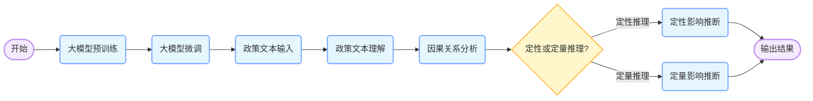

# 大模型在政策影响推理中的潜力探索

> 关键词：大模型、政策影响推理、自然语言处理、数据分析、人工智能、决策支持、因果推断

> 摘要：本文聚焦于大模型在政策影响推理领域的应用潜力。首先介绍了政策影响推理的背景和大模型发展带来的契机，阐述了核心概念及相互联系。接着详细讲解了用于政策影响推理的核心算法原理，结合 Python 代码进行说明，并给出了相关数学模型和公式。通过项目实战展示了大模型在政策影响推理中的具体应用，分析了实际应用场景。同时推荐了学习、开发相关的工具和资源，探讨了大模型在该领域的未来发展趋势与挑战，最后解答了常见问题并提供了扩展阅读和参考资料，旨在为研究者和从业者深入了解大模型在政策影响推理中的应用提供全面的指导。

## 1. 背景介绍 
### 1.1 目的和范围
政策影响推理是评估政策实施后可能产生的各种影响的过程，对于政府部门、企业和社会组织制定科学合理的决策至关重要。传统的政策影响评估方法往往依赖于统计分析和专家经验，存在数据获取困难、分析周期长、难以考虑复杂因素等局限性。随着人工智能技术的快速发展，大模型凭借其强大的语言理解、知识推理和数据处理能力，为政策影响推理提供了新的思路和方法。

本文的目的是深入探索大模型在政策影响推理中的潜力，分析其原理、应用场景和面临的挑战。具体范围包括介绍大模型和政策影响推理的核心概念，讲解用于政策影响推理的核心算法和数学模型，通过实际案例展示大模型的应用，推荐相关的学习和开发资源，以及探讨大模型在该领域的未来发展趋势。

### 1.2 预期读者
本文的预期读者包括政府政策研究人员、企业战略规划人员、人工智能研究者、数据分析师以及对政策影响评估和大模型应用感兴趣的人士。政府政策研究人员可以从中了解如何利用大模型提高政策制定的科学性和有效性；企业战略规划人员可以借鉴大模型的方法评估政策对企业的影响，制定相应的发展策略；人工智能研究者可以深入研究大模型在政策领域的应用，拓展研究方向；数据分析师可以学习如何运用大模型进行政策数据的分析和推理；对该领域感兴趣的人士可以通过本文获得全面的知识和信息。

### 1.3 文档结构概述
本文共分为 10 个部分。第 1 部分为背景介绍，阐述了文章的目的、范围、预期读者和文档结构，并对相关术语进行了定义和解释。第 2 部分介绍了大模型和政策影响推理的核心概念及相互联系，通过文本示意图和 Mermaid 流程图进行说明。第 3 部分详细讲解了用于政策影响推理的核心算法原理，并给出了 Python 代码示例。第 4 部分介绍了相关的数学模型和公式，并通过具体例子进行了详细讲解。第 5 部分通过项目实战展示了大模型在政策影响推理中的具体应用，包括开发环境搭建、源代码实现和代码解读。第 6 部分分析了大模型在政策影响推理中的实际应用场景。第 7 部分推荐了学习和开发相关的工具和资源，包括书籍、在线课程、技术博客、IDE 和编辑器、调试和性能分析工具、相关框架和库以及论文著作等。第 8 部分总结了大模型在政策影响推理中的未来发展趋势与挑战。第 9 部分为附录，解答了常见问题。第 10 部分提供了扩展阅读和参考资料。

### 1.4 术语表
#### 1.4.1 核心术语定义
- **大模型**：指具有大量参数和强大计算能力的人工智能模型，如 GPT 系列、BERT 等。这些模型通过在大规模数据上进行预训练，学习到丰富的语言知识和模式，能够处理各种自然语言处理任务。
- **政策影响推理**：指根据政策文本、相关数据和背景知识，推断政策实施后可能产生的各种影响，包括经济、社会、环境等方面的影响。
- **因果推断**：指在研究中确定变量之间因果关系的方法和技术。在政策影响推理中，因果推断用于分析政策变量与影响变量之间的因果联系。
- **自然语言处理（NLP）**：指让计算机理解、处理和生成人类语言的技术。大模型在政策影响推理中主要通过自然语言处理技术对政策文本进行分析和理解。

#### 1.4.2 相关概念解释
- **预训练**：大模型在大规模无监督数据上进行的训练过程，通过学习数据中的语言模式和知识，使模型具备一定的语言理解和生成能力。
- **微调**：在预训练的基础上，使用特定领域的有监督数据对大模型进行进一步训练，使模型适应特定任务的需求。
- **嵌入向量**：将文本或其他数据转换为低维向量的表示形式，以便计算机进行处理和分析。在大模型中，嵌入向量用于表示单词、句子或文档的语义信息。

#### 1.4.3 缩略词列表
- **NLP**：自然语言处理（Natural Language Processing）
- **GPT**：生成式预训练变换器（Generative Pretrained Transformer）
- **BERT**：双向编码器表示来自变换器（Bidirectional Encoder Representations from Transformers）

## 2. 核心概念与联系 
### 核心概念原理
#### 大模型原理
大模型通常基于深度学习架构，如变换器（Transformer）。变换器由编码器和解码器组成，通过自注意力机制（Self-Attention Mechanism）能够捕捉输入序列中不同位置之间的依赖关系。在预训练阶段，大模型在大规模无监督数据上进行训练，学习语言的统计规律和语义信息。例如，GPT 系列模型是基于解码器的变换器，通过自回归的方式生成文本；BERT 模型是基于编码器的变换器，通过掩码语言模型（Masked Language Model）和下一句预测（Next Sentence Prediction）任务进行预训练。

#### 政策影响推理原理
政策影响推理的核心是根据政策文本和相关数据，推断政策实施后可能产生的影响。这需要对政策文本进行语义理解，提取政策的关键信息和目标，同时结合领域知识和历史数据，分析政策与影响之间的因果关系。在实际应用中，政策影响推理可以分为定性推理和定量推理。定性推理主要通过自然语言处理技术对政策文本进行分析，推断政策可能产生的影响方向；定量推理则需要建立数学模型，利用统计分析和机器学习方法对政策数据进行建模和预测。

### 架构的文本示意图
```plaintext
大模型
├── 预训练阶段
│   └── 大规模无监督数据
├── 微调阶段
│   └── 特定领域有监督数据
└── 应用阶段
    └── 政策影响推理
        ├── 政策文本理解
        │   ├── 语义分析
        │   ├── 关键信息提取
        │   └── 目标识别
        ├── 因果关系分析
        │   ├── 领域知识融合
        │   └── 历史数据挖掘
        └── 影响推断
            ├── 定性推理
            └── 定量推理
```

### Mermaid 流程图


## 3. 核心算法原理 & 具体操作步骤 
### 核心算法原理
#### 基于大模型的文本分类算法
在政策影响推理中，文本分类算法用于将政策文本分类到不同的类别中，以便后续分析不同类型政策的影响。常用的基于大模型的文本分类算法是在预训练模型的基础上进行微调。以 BERT 模型为例，其微调过程如下：
1. **数据准备**：收集政策文本数据，并标注每个文本的类别标签。
2. **模型加载**：加载预训练的 BERT 模型。
3. **模型修改**：在 BERT 模型的输出层添加一个全连接层，用于进行分类。
4. **训练模型**：使用标注好的数据对模型进行训练，调整模型的参数。
5. **模型评估**：使用测试数据评估模型的性能。

#### 因果推断算法
因果推断算法用于分析政策变量与影响变量之间的因果关系。常用的因果推断算法包括倾向得分匹配（Propensity Score Matching）、双重差分法（Difference-in-Differences）等。以倾向得分匹配为例，其原理是通过找到与处理组（接受政策干预的样本）在协变量上相似的对照组（未接受政策干预的样本），来估计政策的因果效应。

### Python 代码示例
#### 基于 BERT 的文本分类代码
```python
import torch
from torch.utils.data import Dataset, DataLoader
from transformers import BertTokenizer, BertForSequenceClassification, AdamW
from sklearn.model_selection import train_test_split

# 定义数据集类
class PolicyDataset(Dataset):
    def __init__(self, texts, labels, tokenizer, max_length):
        self.texts = texts
        self.labels = labels
        self.tokenizer = tokenizer
        self.max_length = max_length

    def __len__(self):
        return len(self.texts)

    def __getitem__(self, idx):
        text = str(self.texts[idx])
        label = self.labels[idx]
        encoding = self.tokenizer.encode_plus(
            text,
            add_special_tokens=True,
            max_length=self.max_length,
            padding='max_length',
            truncation=True,
            return_tensors='pt'
        )
        return {
            'input_ids': encoding['input_ids'].flatten(),
            'attention_mask': encoding['attention_mask'].flatten(),
            'labels': torch.tensor(label, dtype=torch.long)
        }

# 数据准备
texts = ["政策文本 1", "政策文本 2",...]
labels = [0, 1,...]
train_texts, test_texts, train_labels, test_labels = train_test_split(texts, labels, test_size=0.2)

# 加载 tokenizer 和模型
tokenizer = BertTokenizer.from_pretrained('bert-base-chinese')
model = BertForSequenceClassification.from_pretrained('bert-base-chinese', num_labels=2)

# 创建数据集和数据加载器
train_dataset = PolicyDataset(train_texts, train_labels, tokenizer, max_length=128)
test_dataset = PolicyDataset(test_texts, test_labels, tokenizer, max_length=128)
train_dataloader = DataLoader(train_dataset, batch_size=16, shuffle=True)
test_dataloader = DataLoader(test_dataset, batch_size=16, shuffle=False)

# 训练模型
optimizer = AdamW(model.parameters(), lr=2e-5)
device = torch.device('cuda' if torch.cuda.is_available() else 'cpu')
model.to(device)

for epoch in range(3):
    model.train()
    total_loss = 0
    for batch in train_dataloader:
        input_ids = batch['input_ids'].to(device)
        attention_mask = batch['attention_mask'].to(device)
        labels = batch['labels'].to(device)

        optimizer.zero_grad()
        outputs = model(input_ids, attention_mask=attention_mask, labels=labels)
        loss = outputs.loss
        loss.backward()
        optimizer.step()
        total_loss += loss.item()

    print(f'Epoch {epoch+1}, Loss: {total_loss/len(train_dataloader)}')

# 评估模型
model.eval()
correct = 0
total = 0
with torch.no_grad():
    for batch in test_dataloader:
        input_ids = batch['input_ids'].to(device)
        attention_mask = batch['attention_mask'].to(device)
        labels = batch['labels'].to(device)

        outputs = model(input_ids, attention_mask=attention_mask)
        logits = outputs.logits
        predictions = torch.argmax(logits, dim=1)
        correct += (predictions == labels).sum().item()
        total += labels.size(0)

print(f'Accuracy: {correct/total}')
```

#### 倾向得分匹配代码
```python
import pandas as pd
from sklearn.linear_model import LogisticRegression
from causalinference import CausalModel

# 数据准备
data = pd.read_csv('policy_data.csv')
treatment = data['treatment']  # 处理变量
outcome = data['outcome']  # 结果变量
covariates = data.drop(['treatment', 'outcome'], axis=1)  # 协变量

# 计算倾向得分
lr = LogisticRegression()
lr.fit(covariates, treatment)
propensity_scores = lr.predict_proba(covariates)[:, 1]

# 进行倾向得分匹配
causal = CausalModel(outcome, treatment, propensity_scores)
causal.est_via_matching()

# 输出因果效应估计结果
print(causal.estimates)
```

### 具体操作步骤
#### 基于大模型的文本分类操作步骤
1. **数据收集和标注**：收集政策文本数据，并根据政策的类型或影响类别对文本进行标注。
2. **环境搭建**：安装必要的 Python 库，如 `transformers`、`torch` 等。
3. **代码实现**：按照上述代码示例，实现基于 BERT 的文本分类模型。
4. **模型训练和评估**：使用训练数据对模型进行训练，使用测试数据评估模型的性能。
5. **模型应用**：使用训练好的模型对新的政策文本进行分类。

#### 因果推断操作步骤
1. **数据准备**：收集包含政策变量、影响变量和协变量的数据。
2. **环境搭建**：安装必要的 Python 库，如 `pandas`、`sklearn`、`causalinference` 等。
3. **计算倾向得分**：使用逻辑回归模型计算每个样本的倾向得分。
4. **进行倾向得分匹配**：使用 `causalinference` 库进行倾向得分匹配，估计政策的因果效应。
5. **结果分析**：分析因果效应估计结果，评估政策的影响。

## 4. 数学模型和公式 & 详细讲解 & 举例说明 
### 基于大模型的文本分类数学模型
#### 模型架构
基于 BERT 的文本分类模型可以表示为：
$$
\hat{y} = \text{softmax}(W_h \cdot h + b_h)
$$
其中，$\hat{y}$ 是预测的类别概率分布，$W_h$ 是全连接层的权重矩阵，$b_h$ 是偏置向量，$h$ 是 BERT 模型的输出。

#### 损失函数
常用的损失函数是交叉熵损失函数，定义为：
$$
L = -\frac{1}{N} \sum_{i=1}^{N} \sum_{j=1}^{C} y_{ij} \log(\hat{y}_{ij})
$$
其中，$N$ 是样本数量，$C$ 是类别数量，$y_{ij}$ 是第 $i$ 个样本的真实类别标签的第 $j$ 个分量，$\hat{y}_{ij}$ 是预测的类别概率分布的第 $j$ 个分量。

#### 详细讲解
在基于 BERT 的文本分类模型中，BERT 模型首先对输入的政策文本进行编码，得到文本的表示向量 $h$。然后，全连接层将 $h$ 映射到类别空间，得到预测的类别概率分布 $\hat{y}$。交叉熵损失函数用于衡量预测的类别概率分布与真实类别标签之间的差异，通过最小化损失函数来调整模型的参数。

#### 举例说明
假设我们有一个二分类问题，即判断政策文本是否会对经济增长产生积极影响。我们有 100 个政策文本样本，每个样本的真实类别标签为 0 或 1。在训练过程中，模型根据输入的政策文本预测每个样本属于类别 0 或 1 的概率，然后计算交叉熵损失。通过多次迭代训练，模型不断调整参数，使得损失函数逐渐减小，最终得到一个能够准确分类政策文本的模型。

### 因果推断数学模型
#### 倾向得分匹配
倾向得分定义为：
$$
e(X) = P(T = 1 | X)
$$
其中，$T$ 是处理变量（是否接受政策干预），$X$ 是协变量。

倾向得分匹配的目标是找到与处理组样本在倾向得分上相近的对照组样本，以估计政策的平均处理效应（Average Treatment Effect，ATE）：
$$
\text{ATE} = E[Y(1) - Y(0)]
$$
其中，$Y(1)$ 是接受政策干预的潜在结果，$Y(0)$ 是未接受政策干预的潜在结果。

#### 详细讲解
倾向得分匹配的核心思想是通过控制协变量的影响，使得处理组和对照组在协变量上尽可能相似，从而可以将处理组和对照组的结果差异归因于政策干预。在实际应用中，首先使用逻辑回归模型估计每个样本的倾向得分，然后根据倾向得分进行匹配，最后计算匹配后的处理组和对照组的结果差异，得到政策的因果效应估计。

#### 举例说明
假设我们要评估一项税收优惠政策对企业创新的影响。我们收集了 100 家企业的数据，其中 50 家企业接受了税收优惠政策（处理组），50 家企业未接受政策（对照组）。协变量包括企业规模、行业类型、研发投入等。首先，使用逻辑回归模型计算每个企业的倾向得分。然后，为处理组的每个企业找到在倾向得分上最接近的对照组企业进行匹配。最后，比较匹配后的处理组和对照组企业的创新指标（如专利申请数量），得到税收优惠政策对企业创新的因果效应估计。

## 5. 项目实战：代码实际案例和详细解释说明 
### 5.1  开发环境搭建
#### 操作系统
推荐使用 Linux 或 macOS 操作系统，因为它们对深度学习开发的支持较好。如果使用 Windows 操作系统，建议安装 Windows Subsystem for Linux (WSL)。

#### Python 环境
安装 Python 3.7 或以上版本。可以使用 Anaconda 或 Miniconda 来管理 Python 环境。创建一个新的虚拟环境：
```bash
conda create -n policy_inference python=3.8
conda activate policy_inference
```

#### 安装依赖库
安装必要的 Python 库，包括 `transformers`、`torch`、`pandas`、`sklearn`、`causalinference` 等：
```bash
pip install transformers torch pandas scikit-learn causalinference
```

### 5.2  源代码详细实现和代码解读
#### 基于 BERT 的政策文本分类
```python
import torch
from torch.utils.data import Dataset, DataLoader
from transformers import BertTokenizer, BertForSequenceClassification, AdamW
from sklearn.model_selection import train_test_split

# 定义数据集类
class PolicyDataset(Dataset):
    def __init__(self, texts, labels, tokenizer, max_length):
        self.texts = texts
        self.labels = labels
        self.tokenizer = tokenizer
        self.max_length = max_length

    def __len__(self):
        return len(self.texts)

    def __getitem__(self, idx):
        text = str(self.texts[idx])
        label = self.labels[idx]
        encoding = self.tokenizer.encode_plus(
            text,
            add_special_tokens=True,
            max_length=self.max_length,
            padding='max_length',
            truncation=True,
            return_tensors='pt'
        )
        return {
            'input_ids': encoding['input_ids'].flatten(),
            'attention_mask': encoding['attention_mask'].flatten(),
            'labels': torch.tensor(label, dtype=torch.long)
        }

# 数据准备
texts = ["政策文本 1", "政策文本 2",...]
labels = [0, 1,...]
train_texts, test_texts, train_labels, test_labels = train_test_split(texts, labels, test_size=0.2)

# 加载 tokenizer 和模型
tokenizer = BertTokenizer.from_pretrained('bert-base-chinese')
model = BertForSequenceClassification.from_pretrained('bert-base-chinese', num_labels=2)

# 创建数据集和数据加载器
train_dataset = PolicyDataset(train_texts, train_labels, tokenizer, max_length=128)
test_dataset = PolicyDataset(test_texts, test_labels, tokenizer, max_length=128)
train_dataloader = DataLoader(train_dataset, batch_size=16, shuffle=True)
test_dataloader = DataLoader(test_dataset, batch_size=16, shuffle=False)

# 训练模型
optimizer = AdamW(model.parameters(), lr=2e-5)
device = torch.device('cuda' if torch.cuda.is_available() else 'cpu')
model.to(device)

for epoch in range(3):
    model.train()
    total_loss = 0
    for batch in train_dataloader:
        input_ids = batch['input_ids'].to(device)
        attention_mask = batch['attention_mask'].to(device)
        labels = batch['labels'].to(device)

        optimizer.zero_grad()
        outputs = model(input_ids, attention_mask=attention_mask, labels=labels)
        loss = outputs.loss
        loss.backward()
        optimizer.step()
        total_loss += loss.item()

    print(f'Epoch {epoch+1}, Loss: {total_loss/len(train_dataloader)}')

# 评估模型
model.eval()
correct = 0
total = 0
with torch.no_grad():
    for batch in test_dataloader:
        input_ids = batch['input_ids'].to(device)
        attention_mask = batch['attention_mask'].to(device)
        labels = batch['labels'].to(device)

        outputs = model(input_ids, attention_mask=attention_mask)
        logits = outputs.logits
        predictions = torch.argmax(logits, dim=1)
        correct += (predictions == labels).sum().item()
        total += labels.size(0)

print(f'Accuracy: {correct/total}')
```

#### 代码解读
1. **数据集类定义**：`PolicyDataset` 类继承自 `torch.utils.data.Dataset`，用于封装政策文本数据和标签。在 `__getitem__` 方法中，使用 `BertTokenizer` 对文本进行编码，得到输入 ID 和注意力掩码。
2. **数据准备**：使用 `sklearn.model_selection.train_test_split` 函数将数据分为训练集和测试集。
3. **模型加载**：使用 `BertTokenizer.from_pretrained` 和 `BertForSequenceClassification.from_pretrained` 函数加载预训练的 BERT 模型和分词器。
4. **数据集和数据加载器创建**：使用 `PolicyDataset` 类创建训练集和测试集对象，然后使用 `DataLoader` 类创建数据加载器，方便批量处理数据。
5. **模型训练**：使用 `AdamW` 优化器对模型进行训练，通过多次迭代更新模型的参数。在每个 epoch 中，计算损失并进行反向传播。
6. **模型评估**：在测试集上评估模型的性能，计算准确率。

#### 倾向得分匹配进行政策因果效应估计
```python
import pandas as pd
from sklearn.linear_model import LogisticRegression
from causalinference import CausalModel

# 数据准备
data = pd.read_csv('policy_data.csv')
treatment = data['treatment']  # 处理变量
outcome = data['outcome']  # 结果变量
covariates = data.drop(['treatment', 'outcome'], axis=1)  # 协变量

# 计算倾向得分
lr = LogisticRegression()
lr.fit(covariates, treatment)
propensity_scores = lr.predict_proba(covariates)[:, 1]

# 进行倾向得分匹配
causal = CausalModel(outcome, treatment, propensity_scores)
causal.est_via_matching()

# 输出因果效应估计结果
print(causal.estimates)
```

#### 代码解读
1. **数据准备**：使用 `pandas` 库读取包含政策数据的 CSV 文件，提取处理变量、结果变量和协变量。
2. **计算倾向得分**：使用 `sklearn.linear_model.LogisticRegression` 模型计算每个样本的倾向得分。
3. **进行倾向得分匹配**：使用 `causalinference.CausalModel` 类进行倾向得分匹配，估计政策的因果效应。
4. **输出结果**：打印因果效应估计结果。

### 5.3  代码解读与分析
#### 基于 BERT 的政策文本分类代码分析
- **优点**：基于预训练的 BERT 模型可以利用大规模无监督数据学习到丰富的语言知识，在政策文本分类任务中通常能够取得较好的性能。通过微调模型，可以快速适应特定领域的政策文本分类任务。
- **缺点**：训练时间和计算资源消耗较大，需要大量的标注数据。对于一些复杂的政策文本，模型可能无法准确理解其语义。

#### 倾向得分匹配代码分析
- **优点**：倾向得分匹配是一种常用的因果推断方法，能够在一定程度上控制协变量的影响，估计政策的因果效应。代码实现相对简单，易于理解和应用。
- **缺点**：倾向得分匹配依赖于协变量的选择和倾向得分的估计，如果协变量选择不当或倾向得分估计不准确，可能会导致因果效应估计偏差。

## 6. 实际应用场景 
### 政府政策制定
政府在制定政策时，需要评估政策可能产生的影响，包括经济、社会、环境等方面的影响。大模型可以通过对政策文本进行分析，推断政策的目标和可能产生的影响，为政策制定者提供决策支持。例如，在制定税收政策时，大模型可以分析政策文本中关于税率调整、税收优惠等内容，结合经济数据和行业信息，预测政策对企业投资、居民消费等方面的影响。

### 企业战略规划
企业需要关注政策变化对自身发展的影响，以便制定相应的战略规划。大模型可以帮助企业分析政策文本，评估政策对企业的市场环境、竞争态势、成本结构等方面的影响。例如，在新能源汽车补贴政策出台后，企业可以利用大模型分析政策文本，预测政策对新能源汽车市场需求、技术研发、产业链发展等方面的影响，从而调整企业的生产计划、研发方向和市场策略。

### 社会研究和评估
社会研究机构和评估机构可以利用大模型对政策的实施效果进行评估。通过对政策文本和相关数据的分析，大模型可以推断政策的目标是否实现，政策产生的影响是否符合预期。例如，在教育政策评估中，大模型可以分析政策文本中关于教育资源分配、教学质量提升等内容，结合学生成绩、学校发展等数据，评估政策对教育公平和教育质量的影响。

### 公众参与和监督
大模型可以为公众提供政策解读和影响分析服务，帮助公众更好地理解政策内容和政策影响，从而提高公众的参与度和监督能力。例如，政府可以通过网站或移动应用程序提供政策文本和大模型分析结果，让公众了解政策的背景、目标和可能产生的影响，公众可以根据这些信息提出意见和建议，参与政策制定和监督政策实施。

## 7. 工具和资源推荐
### 7.1 学习资源推荐
#### 7.1.1 书籍推荐
- 《Python 自然语言处理实战》：介绍了 Python 在自然语言处理中的应用，包括文本分类、情感分析、命名实体识别等任务，适合初学者入门。
- 《深度学习》：由 Ian Goodfellow、Yoshua Bengio 和 Aaron Courville 合著，是深度学习领域的经典教材，涵盖了深度学习的基本原理、模型架构和应用场景。
- 《因果推断：基础与学习算法》：详细介绍了因果推断的基本概念、方法和算法，适合对因果推断感兴趣的读者深入学习。

#### 7.1.2 在线课程
- Coursera 上的 “Natural Language Processing Specialization”：由斯坦福大学的教授授课，系统介绍了自然语言处理的理论和实践，包括大模型的应用。
- edX 上的 “Deep Learning Specialization”：由 Andrew Ng 教授授课，是深度学习领域的经典课程，涵盖了神经网络、卷积神经网络、循环神经网络等内容。
- Udemy 上的 “Causal Inference for Data Science”：介绍了因果推断在数据科学中的应用，包括倾向得分匹配、双重差分法等方法。

#### 7.1.3 技术博客和网站
- Hugging Face Blog：Hugging Face 是大模型领域的领先公司，其博客上发布了很多关于大模型的最新研究成果和应用案例。
- Towards Data Science：是一个数据科学领域的技术博客，上面有很多关于自然语言处理、深度学习和因果推断的文章。
- arXiv：是一个预印本平台，上面可以找到很多关于大模型和政策影响推理的最新研究论文。

### 7.2 开发工具框架推荐
#### 7.2.1 IDE和编辑器
- PyCharm：是一款专业的 Python 集成开发环境，具有代码编辑、调试、版本控制等功能，适合开发大规模的 Python 项目。
- Visual Studio Code：是一款轻量级的代码编辑器，支持多种编程语言和插件扩展，具有丰富的开发工具和社区资源。

#### 7.2.2 调试和性能分析工具
- PyTorch Profiler：是 PyTorch 自带的性能分析工具，可以帮助开发者分析模型的训练时间、内存使用情况等，优化模型性能。
- TensorBoard：是 TensorFlow 提供的可视化工具，也可以用于 PyTorch 模型的训练过程可视化和性能分析。

#### 7.2.3 相关框架和库
- Transformers：是 Hugging Face 开发的一个开源库，提供了多种预训练的大模型，如 GPT、BERT 等，方便开发者进行自然语言处理任务。
- scikit-learn：是一个常用的机器学习库，提供了多种机器学习算法和工具，包括分类、回归、聚类等算法，可用于因果推断中的倾向得分计算。
- causalinference：是一个专门用于因果推断的 Python 库，提供了多种因果推断方法，如倾向得分匹配、双重差分法等。

### 7.3 相关论文著作推荐
#### 7.3.1 经典论文
- “Attention Is All You Need”：介绍了变换器（Transformer）架构，是大模型领域的经典论文，为后续的大模型发展奠定了基础。
- “BERT: Pre-training of Deep Bidirectional Transformers for Language Understanding”：提出了 BERT 模型，是自然语言处理领域的重要突破，在多个自然语言处理任务中取得了优异的成绩。
- “Mostly Harmless Econometrics: An Empiricist's Companion”：是因果推断领域的经典著作，介绍了因果推断的基本原理和方法，对政策影响评估具有重要的指导意义。

#### 7.3.2 最新研究成果
- 关注 arXiv 上关于大模型和政策影响推理的最新研究论文，了解该领域的前沿动态。例如，一些研究尝试将大模型与因果推断方法相结合，提高政策影响推理的准确性和可靠性。
- 参加相关的学术会议，如 ACL（Association for Computational Linguistics）、ICML（International Conference on Machine Learning）等，获取最新的研究成果和学术交流机会。

#### 7.3.3 应用案例分析
- 政府部门和研究机构发布的政策评估报告，分析其中使用的方法和技术，了解大模型在实际政策影响推理中的应用案例。
- 企业的案例研究，了解企业如何利用大模型评估政策对自身发展的影响，制定相应的战略规划。

## 8. 总结：未来发展趋势与挑战
### 未来发展趋势
#### 模型融合与创新
未来，大模型可能会与其他技术，如知识图谱、强化学习等进行融合，以提高政策影响推理的准确性和可解释性。例如，将知识图谱中的领域知识融入大模型中，可以帮助模型更好地理解政策文本和相关背景信息；使用强化学习方法对大模型进行优化，可以使其在政策影响推理中做出更合理的决策。

#### 多模态数据处理
政策影响推理不仅涉及文本数据，还可能涉及图像、视频、音频等多模态数据。未来的大模型将具备处理多模态数据的能力，综合利用各种数据来源进行政策影响推理。例如，在评估城市规划政策时，可以结合卫星图像、交通视频等数据，更全面地分析政策对城市发展的影响。

#### 个性化和定制化服务
不同的用户对政策影响推理的需求可能不同，未来的大模型将提供个性化和定制化的服务。例如，政府部门可能更关注政策的宏观影响，企业可能更关注政策对自身业务的影响，大模型可以根据用户的需求和偏好，提供针对性的政策影响分析报告。

#### 跨领域应用拓展
大模型在政策影响推理中的应用将不仅仅局限于政府和企业领域，还将拓展到医疗、教育、环保等多个领域。例如，在医疗领域，大模型可以分析医疗政策对患者就医体验、医疗资源分配等方面的影响；在教育领域，大模型可以评估教育政策对学生学习效果、教师教学质量等方面的影响。

### 挑战
#### 数据质量和可用性
政策影响推理需要大量的高质量数据，包括政策文本、相关统计数据、领域知识等。然而，数据的收集、整理和标注工作往往面临诸多困难，数据质量参差不齐，数据可用性较低。此外，一些敏感数据的获取和使用还涉及到隐私和安全问题。

#### 模型可解释性
大模型通常是黑盒模型，其决策过程难以解释。在政策影响推理中，决策者需要了解模型的决策依据，以便做出合理的决策。因此，提高大模型的可解释性是一个亟待解决的问题。

#### 计算资源和成本
大模型的训练和推理需要大量的计算资源，包括 GPU、TPU 等。这不仅增加了计算成本，还限制了大模型在一些资源受限环境中的应用。如何降低大模型的计算成本，提高其计算效率，是一个重要的挑战。

#### 伦理和法律问题
大模型在政策影响推理中的应用可能会引发一些伦理和法律问题，如算法偏见、数据隐私泄露等。如何确保大模型的应用符合伦理和法律要求，保护用户的权益和利益，是一个需要关注的问题。

## 9. 附录：常见问题与解答
### 问题 1：大模型在政策影响推理中的准确性如何保证？
答：保证大模型在政策影响推理中的准确性可以从以下几个方面入手：
- **数据质量**：使用高质量的政策文本数据和相关统计数据进行训练和验证，确保数据的准确性和完整性。
- **模型选择和调优**：选择适合政策影响推理任务的大模型，并对模型进行微调，以提高模型的性能。
- **特征工程**：对政策文本和相关数据进行特征工程，提取有价值的特征，帮助模型更好地理解和分析数据。
- **多模型融合**：结合多个不同的模型进行政策影响推理，通过融合多个模型的结果，提高推理的准确性。
- **领域知识融合**：将领域知识融入大模型中，帮助模型更好地理解政策背景和相关概念，提高推理的准确性。

### 问题 2：大模型在政策影响推理中的可解释性如何解决？
答：解决大模型在政策影响推理中的可解释性可以采用以下方法：
- **模型架构设计**：设计具有可解释性的模型架构，如基于规则的模型、决策树模型等。
- **特征重要性分析**：分析模型输入特征的重要性，了解哪些特征对模型的决策起到了关键作用。
- **局部解释方法**：使用局部解释方法，如 LIME（Local Interpretable Model-agnostic Explanations）、SHAP（SHapley Additive exPlanations）等，解释模型在特定样本上的决策过程。
- **知识图谱融合**：将知识图谱中的领域知识融入大模型中，通过知识图谱的可解释性来提高大模型的可解释性。
- **可视化展示**：使用可视化工具展示模型的决策过程和结果，帮助用户更好地理解模型的推理过程。

### 问题 3：大模型在政策影响推理中的计算资源需求如何降低？
答：降低大模型在政策影响推理中的计算资源需求可以采取以下措施：
- **模型压缩**：使用模型压缩技术，如剪枝、量化等，减少模型的参数数量，降低模型的计算复杂度。
- **分布式训练**：使用分布式训练技术，将模型的训练任务分配到多个计算节点上进行并行计算，提高训练效率。
- **模型选择**：选择轻量级的大模型，如 DistilBERT、ALBERT 等，这些模型在保持一定性能的前提下，计算资源需求相对较低。
- **推理优化**：在模型推理阶段，使用推理优化技术，如模型量化、硬件加速等，提高推理效率。
- **数据采样**：在训练和推理过程中，对数据进行采样，减少数据量，降低计算资源需求。

### 问题 4：大模型在政策影响推理中如何处理数据隐私问题？
答：处理大模型在政策影响推理中的数据隐私问题可以采用以下方法：
- **数据加密**：对敏感数据进行加密处理，确保数据在传输和存储过程中的安全性。
- **差分隐私**：使用差分隐私技术，在数据中添加噪声，保护数据的隐私性，同时保证模型的性能。
- **联邦学习**：采用联邦学习技术，在不共享原始数据的情况下，让多个参与方联合训练模型，保护数据的隐私性。
- **访问控制**：建立严格的访问控制机制，限制对敏感数据的访问权限，确保只有授权人员可以访问和使用数据。
- **合规性检查**：确保大模型在政策影响推理中的应用符合相关的法律法规和隐私政策要求。

## 10. 扩展阅读 & 参考资料
### 扩展阅读
- 《人工智能时代的政策制定》：探讨了人工智能技术在政策制定中的应用和挑战，对理解大模型在政策影响推理中的作用具有重要的参考价值。
- 《大数据与政策评估》：介绍了大数据技术在政策评估中的应用方法和案例，有助于深入了解如何利用数据进行政策影响推理。
- 《自然语言处理入门》：对于初学者来说，这本书可以帮助他们快速掌握自然语言处理的基本概念和方法，为学习大模型在政策影响推理中的应用打下基础。

### 参考资料
- Hugging Face 官方文档：https://huggingface.co/docs
- PyTorch 官方文档：https://pytorch.org/docs/stable/index.html
- scikit-learn 官方文档：https://scikit-learn.org/stable/documentation.html
- causalinference 官方文档：https://causalinferenceinpython.org/

作者：AI天才研究院/AI Genius Institute & 禅与计算机程序设计艺术 /Zen And The Art of Computer Programming