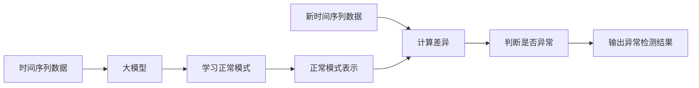

# 大模型在时序异常检测推理任务中的应用

> 关键词：大模型、时序异常检测、推理任务、深度学习、时间序列分析

> 摘要：本文聚焦于大模型在时序异常检测推理任务中的应用。首先介绍了该研究的背景，包括目的、预期读者、文档结构和相关术语。接着阐述了核心概念与联系，通过文本示意图和 Mermaid 流程图展示其架构。详细讲解了核心算法原理及具体操作步骤，结合 Python 源代码进行说明。同时给出了数学模型和公式，并举例阐释。在项目实战部分，从开发环境搭建到源代码实现与解读进行了全面分析。探讨了实际应用场景，推荐了学习资源、开发工具框架以及相关论文著作。最后总结了未来发展趋势与挑战，还提供了常见问题解答和扩展阅读参考资料，旨在为读者全面深入地呈现大模型在时序异常检测推理任务中的应用全貌。

## 1. 背景介绍 
### 1.1 目的和范围
在当今数字化时代，各种系统和设备会产生大量的时间序列数据，如工业生产中的传感器数据、金融市场的交易数据、网络流量数据等。对这些时序数据进行异常检测具有重要的现实意义，例如在工业生产中及时发现设备故障，在金融领域防范欺诈行为等。传统的时序异常检测方法在处理复杂、高维、动态的数据时往往存在局限性。大模型由于其强大的表征能力和学习能力，为时序异常检测推理任务带来了新的解决方案。本文的目的在于深入探讨大模型在时序异常检测推理任务中的应用，涵盖从核心概念、算法原理到实际应用的各个方面，帮助读者全面了解和掌握相关技术。

### 1.2 预期读者
本文预期读者包括从事数据挖掘、机器学习、深度学习等领域的研究人员和工程师，对时序数据分析和异常检测感兴趣的技术爱好者，以及在工业、金融、医疗等行业中需要处理时序数据并进行异常检测的从业者。通过阅读本文，读者可以获取大模型在时序异常检测推理任务中的理论知识和实践经验。

### 1.3 文档结构概述
本文将按照以下结构进行组织：首先介绍核心概念与联系，帮助读者建立起对大模型和时序异常检测的基本认识；接着详细阐述核心算法原理和具体操作步骤，结合 Python 代码进行说明；然后给出数学模型和公式，并通过具体例子进行讲解；在项目实战部分，从开发环境搭建到源代码实现和解读进行详细分析；探讨实际应用场景，为读者提供应用思路；推荐相关的学习资源、开发工具框架和论文著作；最后总结未来发展趋势与挑战，并提供常见问题解答和扩展阅读参考资料。

### 1.4 术语表
#### 1.4.1 核心术语定义
- **大模型**：通常指具有大量参数和强大计算能力的深度学习模型，如 Transformer 架构的模型，这些模型在大规模数据集上进行预训练，能够学习到丰富的语义信息和模式。
- **时序异常检测**：在时间序列数据中识别出与正常模式明显不同的异常点或异常段的过程。
- **推理任务**：利用训练好的模型对新的输入数据进行预测或判断的过程。
- **时间序列数据**：按时间顺序排列的一系列数据点，每个数据点对应一个特定的时间戳。

#### 1.4.2 相关概念解释
- **异常点**：时间序列中明显偏离正常模式的单个数据点。
- **异常段**：时间序列中连续的一段数据，整体表现出与正常模式的显著差异。
- **正常模式**：时间序列数据在正常情况下呈现出的统计特征和规律。

#### 1.4.3 缩略词列表
- **LSTM**：Long Short-Term Memory，长短期记忆网络，一种递归神经网络，常用于处理时间序列数据。
- **GRU**：Gated Recurrent Unit，门控循环单元，也是一种递归神经网络，与 LSTM 类似但结构更简单。
- **Transformer**：一种基于注意力机制的深度学习架构，在自然语言处理和其他领域取得了显著成果。

## 2. 核心概念与联系 
### 核心概念原理
大模型在时序异常检测推理任务中的应用基于以下核心原理。大模型通过在大规模数据集上进行预训练，学习到了丰富的语义信息和模式。在时序异常检测中，大模型可以将时间序列数据看作一种特殊的序列数据，利用其强大的表征能力对时间序列进行建模。通过学习正常时间序列数据的特征和模式，大模型可以构建一个正常模式的表示。当新的时间序列数据输入时，大模型可以计算该数据与正常模式的差异，从而判断是否存在异常。

### 架构的文本示意图
```plaintext
输入：时间序列数据
|
V
大模型（如 Transformer、LSTM 等）
|
| 学习正常模式的特征和模式
V
正常模式表示
|
| 新的时间序列数据输入
V
计算差异
|
| 判断是否异常
V
输出：异常检测结果
```

### Mermaid 流程图


## 3. 核心算法原理 & 具体操作步骤 
### 核心算法原理
在大模型应用于时序异常检测推理任务中，常用的算法包括基于 Transformer 的方法和基于递归神经网络（如 LSTM、GRU）的方法。这里以基于 LSTM 的方法为例进行讲解。

LSTM 是一种特殊的递归神经网络，能够处理长序列数据并捕捉时间序列中的长期依赖关系。LSTM 的核心是细胞状态和门控机制，通过门控机制可以控制信息的流入、流出和遗忘。

### Python 源代码详细阐述
```python
import numpy as np
import tensorflow as tf
from tensorflow.keras.models import Sequential
from tensorflow.keras.layers import LSTM, Dense

# 生成示例时间序列数据
def generate_time_series(n_steps):
    time = np.linspace(0, 2 * np.pi, n_steps)
    series = np.sin(time) + np.random.normal(0, 0.1, n_steps)
    return series

# 准备训练数据
n_steps = 100
series = generate_time_series(n_steps)
X = []
y = []
for i in range(n_steps - 10):
    X.append(series[i:i+10])
    y.append(series[i+10])
X = np.array(X)
y = np.array(y)
X = X.reshape((X.shape[0], X.shape[1], 1))

# 构建 LSTM 模型
model = Sequential()
model.add(LSTM(50, activation='relu', input_shape=(10, 1)))
model.add(Dense(1))
model.compile(optimizer='adam', loss='mse')

# 训练模型
model.fit(X, y, epochs=50, verbose=1)

# 进行异常检测推理
test_series = generate_time_series(20)
test_X = []
for i in range(10):
    test_X.append(test_series[i:i+10])
test_X = np.array(test_X)
test_X = test_X.reshape((test_X.shape[0], test_X.shape[1], 1))
predictions = model.predict(test_X)

# 计算差异并判断异常
threshold = 0.2
for i in range(len(predictions)):
    diff = np.abs(predictions[i] - test_series[i+10])
    if diff > threshold:
        print(f"Step {i+10} is an anomaly.")
    else:
        print(f"Step {i+10} is normal.")
```
### 具体操作步骤
1. **数据准备**：生成或收集时间序列数据，并将其划分为训练集和测试集。对于训练集，将数据转换为适合 LSTM 模型输入的格式，通常是三维数组 `[样本数, 时间步长, 特征数]`。
2. **模型构建**：使用 Keras 构建 LSTM 模型，添加 LSTM 层和全连接层，编译模型并指定优化器和损失函数。
3. **模型训练**：使用训练集对模型进行训练，指定训练的轮数和批次大小。
4. **异常检测推理**：使用测试集进行推理，计算模型预测值与实际值之间的差异。
5. **异常判断**：设定一个阈值，当差异超过阈值时，判断该时间步为异常。

## 4. 数学模型和公式 & 详细讲解 & 举例说明 
### 数学模型和公式
在基于 LSTM 的时序异常检测中，LSTM 单元的核心公式如下：

- 输入门：
$$i_t = \sigma(W_{ii}x_t + W_{hi}h_{t-1} + b_i)$$
其中，$i_t$ 是输入门的输出，$\sigma$ 是 sigmoid 激活函数，$W_{ii}$ 和 $W_{hi}$ 是权重矩阵，$x_t$ 是当前时间步的输入，$h_{t-1}$ 是上一个时间步的隐藏状态，$b_i$ 是偏置项。

- 遗忘门：
$$f_t = \sigma(W_{if}x_t + W_{hf}h_{t-1} + b_f)$$
$f_t$ 是遗忘门的输出，用于控制上一个时间步的细胞状态 $C_{t-1}$ 的保留程度。

- 细胞状态更新：
$$\tilde{C}_t = \tanh(W_{ic}x_t + W_{hc}h_{t-1} + b_c)$$
$$C_t = f_t \odot C_{t-1} + i_t \odot \tilde{C}_t$$
其中，$\tilde{C}_t$ 是候选细胞状态，$\tanh$ 是双曲正切激活函数，$\odot$ 表示逐元素相乘。

- 输出门：
$$o_t = \sigma(W_{io}x_t + W_{ho}h_{t-1} + b_o)$$
$$h_t = o_t \odot \tanh(C_t)$$
$o_t$ 是输出门的输出，$h_t$ 是当前时间步的隐藏状态。

### 详细讲解
输入门决定了当前输入 $x_t$ 有多少信息要加入到细胞状态中；遗忘门控制上一个时间步的细胞状态 $C_{t-1}$ 有多少信息要保留；细胞状态更新公式通过遗忘门和输入门的作用更新细胞状态；输出门决定了当前细胞状态 $C_t$ 有多少信息要输出到隐藏状态 $h_t$。

### 举例说明
假设我们有一个简单的时间序列数据，每个时间步的输入 $x_t$ 是一个一维向量，$x_t = [0.5]$。上一个时间步的隐藏状态 $h_{t-1} = [0.2]$，细胞状态 $C_{t-1} = [0.3]$。权重矩阵和偏置项的值如下：

$W_{ii} = [0.1]$, $W_{hi} = [0.2]$, $b_i = [0.05]$

$W_{if} = [0.3]$, $W_{hf} = [0.4]$, $b_f = [0.08]$

$W_{ic} = [0.5]$, $W_{hc} = [0.6]$, $b_c = [0.1]$

$W_{io} = [0.7]$, $W_{ho} = [0.8]$, $b_o = [0.12]$

首先计算输入门：
$$i_t = \sigma(0.1\times0.5 + 0.2\times0.2 + 0.05) = \sigma(0.14) \approx 0.535$$

遗忘门：
$$f_t = \sigma(0.3\times0.5 + 0.4\times0.2 + 0.08) = \sigma(0.29) \approx 0.572$$

候选细胞状态：
$$\tilde{C}_t = \tanh(0.5\times0.5 + 0.6\times0.2 + 0.1) = \tanh(0.47) \approx 0.432$$

细胞状态更新：
$$C_t = 0.572\times0.3 + 0.535\times0.432 \approx 0.384$$

输出门：
$$o_t = \sigma(0.7\times0.5 + 0.8\times0.2 + 0.12) = \sigma(0.53) \approx 0.629$$

隐藏状态：
$$h_t = 0.629\times\tanh(0.384) \approx 0.234$$

## 5. 项目实战：代码实际案例和详细解释说明 
### 5.1  开发环境搭建
#### 操作系统
可以选择 Windows、Linux 或 macOS 操作系统。这里以 Ubuntu 20.04 为例进行说明。

#### Python 环境
安装 Python 3.7 或更高版本。可以使用以下命令安装：
```bash
sudo apt update
sudo apt install python3 python3-pip
```

#### 依赖库安装
安装 TensorFlow、NumPy 等必要的库：
```bash
pip install tensorflow numpy
```

### 5.2  源代码详细实现和代码解读
```python
import numpy as np
import tensorflow as tf
from tensorflow.keras.models import Sequential
from tensorflow.keras.layers import LSTM, Dense

# 生成示例时间序列数据
def generate_time_series(n_steps):
    time = np.linspace(0, 2 * np.pi, n_steps)
    series = np.sin(time) + np.random.normal(0, 0.1, n_steps)
    return series

# 准备训练数据
n_steps = 100
series = generate_time_series(n_steps)
X = []
y = []
for i in range(n_steps - 10):
    X.append(series[i:i+10])
    y.append(series[i+10])
X = np.array(X)
y = np.array(y)
X = X.reshape((X.shape[0], X.shape[1], 1))

# 构建 LSTM 模型
model = Sequential()
model.add(LSTM(50, activation='relu', input_shape=(10, 1)))
model.add(Dense(1))
model.compile(optimizer='adam', loss='mse')

# 训练模型
model.fit(X, y, epochs=50, verbose=1)

# 进行异常检测推理
test_series = generate_time_series(20)
test_X = []
for i in range(10):
    test_X.append(test_series[i:i+10])
test_X = np.array(test_X)
test_X = test_X.reshape((test_X.shape[0], test_X.shape[1], 1))
predictions = model.predict(test_X)

# 计算差异并判断异常
threshold = 0.2
for i in range(len(predictions)):
    diff = np.abs(predictions[i] - test_series[i+10])
    if diff > threshold:
        print(f"Step {i+10} is an anomaly.")
    else:
        print(f"Step {i+10} is normal.")
```
#### 代码解读
1. **数据生成**：`generate_time_series` 函数生成一个包含正弦波和噪声的时间序列数据。
2. **数据准备**：将时间序列数据划分为输入序列 $X$ 和目标值 $y$，每个输入序列包含 10 个时间步，目标值是下一个时间步的值。
3. **模型构建**：使用 Keras 构建一个简单的 LSTM 模型，包含一个 LSTM 层和一个全连接层。
4. **模型训练**：使用 `fit` 方法对模型进行训练，指定训练的轮数为 50。
5. **异常检测推理**：生成一个新的测试时间序列，使用训练好的模型进行预测，计算预测值与实际值之间的差异。
6. **异常判断**：设定一个阈值，当差异超过阈值时，判断该时间步为异常。

### 5.3  代码解读与分析
#### 优点
- **简单易懂**：代码结构清晰，易于理解和实现。
- **可扩展性**：可以根据需要调整模型的结构和参数，如增加 LSTM 层的数量、调整神经元的数量等。

#### 缺点
- **数据局限性**：示例代码中使用的是简单的正弦波数据，实际应用中可能需要处理更复杂的时间序列数据。
- **异常判断的主观性**：阈值的设定是主观的，可能需要根据不同的数据集和应用场景进行调整。

## 6. 实际应用场景 
### 工业生产
在工业生产中，各种传感器会实时采集设备的运行数据，如温度、压力、振动等。通过大模型进行时序异常检测，可以及时发现设备的异常运行状态，提前进行维护和维修，避免设备故障导致的生产中断和损失。例如，在钢铁生产过程中，对高炉的温度和压力数据进行实时监测，当检测到异常时及时调整生产参数或进行检修。

### 金融领域
金融市场的交易数据是典型的时间序列数据。大模型可以用于检测金融交易中的异常行为，如欺诈交易、市场操纵等。通过分析交易的时间、金额、频率等特征，及时发现异常交易并采取相应的措施，保障金融市场的稳定和安全。

### 医疗保健
在医疗保健领域，患者的生理数据如心率、血压、血糖等会随着时间变化。利用大模型进行时序异常检测，可以帮助医生及时发现患者的健康异常，如心律失常、高血压发作等。例如，通过对可穿戴设备采集的心率数据进行实时监测，当检测到异常心率时及时提醒患者和医生。

### 网络安全
网络流量数据是一种时间序列数据。大模型可以用于检测网络中的异常流量行为，如网络攻击、恶意软件感染等。通过分析网络流量的特征和模式，及时发现异常流量并采取相应的防护措施，保障网络的安全和稳定。

## 7. 工具和资源推荐
### 7.1 学习资源推荐
#### 7.1.1 书籍推荐
- 《深度学习》（Deep Learning）：由 Ian Goodfellow、Yoshua Bengio 和 Aaron Courville 撰写，是深度学习领域的经典教材，涵盖了深度学习的基本原理、算法和应用。
- 《时间序列分析：预测与控制》（Time Series Analysis: Forecasting and Control）：由 George E. P. Box、Gwilym M. Jenkins 和 Gregory C. Reinsel 撰写，是时间序列分析领域的权威著作，介绍了时间序列分析的各种方法和技术。

#### 7.1.2 在线课程
- Coursera 上的“深度学习专项课程”（Deep Learning Specialization）：由 Andrew Ng 教授授课，系统地介绍了深度学习的各个方面，包括神经网络、卷积神经网络、循环神经网络等。
- edX 上的“时间序列分析与预测”（Time Series Analysis and Forecasting）：由宾夕法尼亚大学的教师授课，讲解了时间序列分析的基本概念、模型和方法。

#### 7.1.3 技术博客和网站
- Towards Data Science：是一个专注于数据科学和机器学习的博客平台，上面有很多关于大模型和时序异常检测的优秀文章。
- Kaggle：是一个数据科学竞赛平台，上面有很多关于时间序列分析和异常检测的竞赛和案例，可以学习到实际应用中的技巧和方法。

### 7.2 开发工具框架推荐
#### 7.2.1 IDE和编辑器
- PyCharm：是一款专门为 Python 开发设计的集成开发环境，具有代码编辑、调试、自动完成等功能，适合开发深度学习项目。
- Jupyter Notebook：是一个交互式的开发环境，支持 Python、R 等多种编程语言，可以方便地进行数据探索、模型训练和可视化。

#### 7.2.2 调试和性能分析工具
- TensorBoard：是 TensorFlow 提供的可视化工具，可以用于监控模型的训练过程、查看模型的结构和性能指标等。
- PyTorch Profiler：是 PyTorch 提供的性能分析工具，可以帮助开发者找出代码中的性能瓶颈，优化代码性能。

#### 7.2.3 相关框架和库
- TensorFlow：是一个开源的深度学习框架，提供了丰富的工具和库，支持各种深度学习模型的构建和训练。
- PyTorch：是另一个流行的深度学习框架，具有动态图机制，易于使用和调试。
- scikit-learn：是一个用于机器学习的 Python 库，提供了各种机器学习算法和工具，可用于数据预处理、模型选择和评估等。

### 7.3 相关论文著作推荐
#### 7.3.1 经典论文
- “Long Short-Term Memory”：由 Sepp Hochreiter 和 Jürgen Schmidhuber 撰写，介绍了 LSTM 网络的基本原理和结构。
- “Attention Is All You Need”：由 Ashish Vaswani 等人撰写，提出了 Transformer 架构，是自然语言处理领域的重要突破。

#### 7.3.2 最新研究成果
- 在 arXiv 预印本平台上搜索“Large model for time series anomaly detection”，可以找到很多关于大模型在时序异常检测方面的最新研究成果。

#### 7.3.3 应用案例分析
- 阅读一些知名企业或研究机构发布的应用案例报告，了解大模型在实际场景中的应用效果和经验教训。

## 8. 总结：未来发展趋势与挑战
### 未来发展趋势
- **多模态融合**：将时间序列数据与其他模态的数据（如图像、文本等）进行融合，利用大模型的强大表征能力进行更全面的异常检测。例如，在工业生产中，结合设备的运行数据和设备的图像数据进行异常检测。
- **自适应模型**：开发能够自适应环境变化和数据分布变化的大模型，提高异常检测的准确性和鲁棒性。例如，在金融市场中，随着市场环境的变化，模型能够自动调整参数和结构。
- **可解释性增强**：提高大模型的可解释性，让用户能够理解模型的决策过程和依据。例如，在医疗保健领域，医生需要了解模型为什么判断患者的健康数据异常。

### 挑战
- **数据隐私和安全**：大模型通常需要大量的数据进行训练，如何保护数据的隐私和安全是一个重要的挑战。例如，在金融和医疗领域，数据包含敏感信息，需要采取有效的措施进行保护。
- **计算资源需求**：大模型的训练和推理需要大量的计算资源，如何降低计算成本和提高计算效率是一个亟待解决的问题。
- **模型评估标准**：目前缺乏统一的模型评估标准，如何准确评估大模型在时序异常检测中的性能是一个挑战。需要开发更科学、合理的评估指标和方法。

## 9. 附录：常见问题与解答
### 问题 1：大模型在时序异常检测中的优势是什么？
答：大模型具有强大的表征能力和学习能力，能够处理复杂、高维、动态的时间序列数据。可以学习到更丰富的语义信息和模式，提高异常检测的准确性和鲁棒性。

### 问题 2：如何选择合适的大模型进行时序异常检测？
答：需要考虑数据的特点、应用场景和计算资源等因素。如果数据具有长期依赖关系，可以选择 LSTM 或 GRU 等递归神经网络；如果数据的序列长度较长，可以选择 Transformer 架构的模型。

### 问题 3：如何处理时间序列数据中的缺失值？
答：可以采用插值法（如线性插值、样条插值）、填充法（如用均值、中位数填充）或使用能够处理缺失值的模型（如基于概率的模型）来处理缺失值。

### 问题 4：如何调整异常检测的阈值？
答：可以通过交叉验证的方法，在不同的阈值下评估模型的性能，选择性能最优的阈值。也可以根据实际应用场景和业务需求进行手动调整。

## 10. 扩展阅读 & 参考资料
- Goodfellow, I., Bengio, Y., & Courville, A. (2016). Deep Learning. MIT Press.
- Box, G. E. P., Jenkins, G. M., & Reinsel, G. C. (2015). Time Series Analysis: Forecasting and Control. Wiley.
- Hochreiter, S., & Schmidhuber, J. (1997). Long Short-Term Memory. Neural Computation, 9(8), 1735-1780.
- Vaswani, A., Shazeer, N., Parmar, N., Uszkoreit, J., Jones, L., Gomez, A. N.,... & Polosukhin, I. (2017). Attention Is All You Need. Advances in Neural Information Processing Systems, 5998-6008.

作者：AI天才研究院/AI Genius Institute & 禅与计算机程序设计艺术 /Zen And The Art of Computer Programming