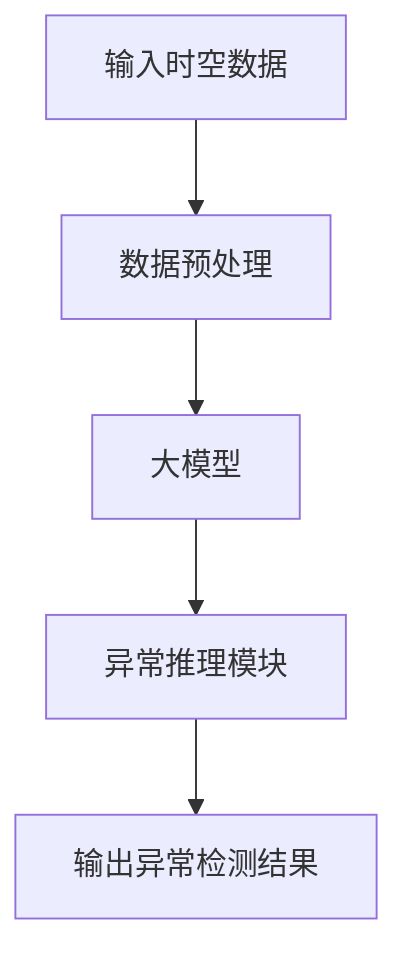

# 大模型在时空数据异常推理中的实时检测应用

> 关键词：大模型、时空数据、异常推理、实时检测、深度学习

> 摘要：本文深入探讨了大模型在时空数据异常推理实时检测中的应用。随着时空数据的规模和复杂性不断增加，传统的异常检测方法面临诸多挑战，而大模型凭借其强大的学习和推理能力为解决这些问题提供了新的途径。文章首先介绍了相关背景知识，包括目的范围、预期读者等；接着阐述了核心概念与联系，分析了大模型在时空数据异常推理中的原理和架构；详细讲解了核心算法原理及具体操作步骤，并结合Python代码进行说明；探讨了相关的数学模型和公式；通过项目实战展示了代码实现和解读；列举了实际应用场景；推荐了学习资源、开发工具框架以及相关论文著作；最后总结了未来发展趋势与挑战，并提供了常见问题解答和扩展阅读参考资料。

## 1. 背景介绍 
### 1.1 目的和范围
随着物联网、传感器技术和互联网的飞速发展，时空数据呈现出爆炸式增长。时空数据包含了时间和空间维度的信息，广泛应用于交通、气象、环境监测等多个领域。然而，这些数据中往往存在异常值，这些异常值可能代表着系统故障、突发事件或潜在的安全隐患。因此，对时空数据进行异常推理和实时检测具有重要的现实意义。

本文的目的是探讨大模型在时空数据异常推理实时检测中的应用，详细介绍相关的技术原理、算法实现和实际应用场景。范围涵盖了从核心概念的阐述到项目实战的展示，以及学习资源和未来趋势的分析。

### 1.2 预期读者
本文预期读者包括计算机科学、数据分析、人工智能等领域的研究人员、工程师和学生。对于对时空数据处理和异常检测感兴趣的从业者，本文可以提供深入的技术知识和实践指导；对于学生来说，本文可以作为学习大模型应用和时空数据分析的参考资料。

### 1.3 文档结构概述
本文共分为十个部分。第一部分是背景介绍，包括目的范围、预期读者和文档结构概述等；第二部分阐述核心概念与联系，介绍大模型、时空数据、异常推理等核心概念及其相互关系；第三部分详细讲解核心算法原理和具体操作步骤，并给出Python代码示例；第四部分探讨相关的数学模型和公式，并举例说明；第五部分通过项目实战展示代码实现和详细解释；第六部分列举实际应用场景；第七部分推荐学习资源、开发工具框架和相关论文著作；第八部分总结未来发展趋势与挑战；第九部分是附录，提供常见问题解答；第十部分是扩展阅读和参考资料。

### 1.4 术语表
#### 1.4.1 核心术语定义
- **大模型**：指具有大量参数和强大学习能力的深度学习模型，如Transformer架构的模型。
- **时空数据**：包含时间和空间维度信息的数据，例如气象数据中的时间和地理位置信息。
- **异常推理**：通过对数据的分析和建模，识别出数据中的异常模式和特征。
- **实时检测**：在数据产生的同时进行异常检测，及时发现异常情况。

#### 1.4.2 相关概念解释
- **深度学习**：一种基于人工神经网络的机器学习方法，通过多层神经网络学习数据的特征和模式。
- **时空序列**：按时间顺序排列的时空数据序列，例如城市交通流量的时间序列。
- **异常值**：与正常数据模式明显不同的数据点。

#### 1.4.3 缩略词列表
- **AI**：人工智能（Artificial Intelligence）
- **ML**：机器学习（Machine Learning）
- **DL**：深度学习（Deep Learning）
- **RNN**：循环神经网络（Recurrent Neural Network）
- **LSTM**：长短期记忆网络（Long Short-Term Memory）
- **GRU**：门控循环单元（Gated Recurrent Unit）
- **Transformer**：一种基于注意力机制的深度学习架构

## 2. 核心概念与联系 

### 核心概念原理
#### 大模型
大模型通常基于深度学习架构，具有大量的参数和强大的学习能力。以Transformer架构为例，它通过自注意力机制能够捕捉数据中的长距离依赖关系。自注意力机制允许模型在处理每个输入位置时，考虑到序列中其他位置的信息，从而更好地理解数据的上下文。

#### 时空数据
时空数据是指在特定时间和空间范围内收集的数据。它可以表示为一个四维张量，其中三个维度表示空间坐标（如经度、纬度和高度），一个维度表示时间。时空数据具有时间相关性和空间相关性，即相邻时间和相邻空间的数据往往具有相似的特征。

#### 异常推理
异常推理是指通过对正常数据模式的学习，识别出数据中不符合该模式的异常情况。在时空数据中，异常可能表现为突然的流量变化、温度异常升高等。异常推理可以基于统计方法、机器学习方法或深度学习方法。

#### 实时检测
实时检测要求在数据产生的同时进行异常检测，及时发现异常情况并采取相应的措施。这需要模型具有高效的推理能力和低延迟的处理速度。

### 架构的文本示意图
```plaintext
输入：时空数据（时间、空间坐标、特征值）
|
v
数据预处理（归一化、缺失值处理等）
|
v
大模型（如Transformer）
|
v
异常推理模块（判断数据是否异常）
|
v
输出：异常检测结果（正常或异常）
```

### Mermaid流程图


## 3. 核心算法原理 & 具体操作步骤 

### 核心算法原理
在时空数据异常推理的实时检测中，我们可以使用基于Transformer的大模型。Transformer架构由编码器和解码器组成，编码器用于对输入序列进行特征提取，解码器用于生成输出序列。在异常检测任务中，我们可以只使用编码器部分。

Transformer的核心是自注意力机制，其计算公式如下：
$$Attention(Q, K, V) = softmax(\frac{QK^T}{\sqrt{d_k}})V$$
其中，$Q$ 是查询矩阵，$K$ 是键矩阵，$V$ 是值矩阵，$d_k$ 是键的维度。

### 具体操作步骤
1. **数据预处理**：对输入的时空数据进行归一化处理，将数据的取值范围映射到[0, 1]之间，以提高模型的训练效果。同时，处理缺失值，例如使用均值填充或插值方法。
2. **构建Transformer模型**：定义Transformer编码器的层数、头数和隐藏层维度等参数。
3. **训练模型**：使用正常的时空数据对模型进行训练，使模型学习到正常数据的特征和模式。
4. **异常推理**：将新的时空数据输入到训练好的模型中，计算模型的输出。通过设定一个阈值，判断输出是否超过阈值，如果超过则认为数据异常。

### Python源代码实现
```python
import torch
import torch.nn as nn
import torch.optim as optim

# 定义Transformer编码器层
class TransformerEncoderLayer(nn.Module):
    def __init__(self, d_model, nhead, dim_feedforward=2048, dropout=0.1):
        super(TransformerEncoderLayer, self).__init__()
        self.self_attn = nn.MultiheadAttention(d_model, nhead, dropout=dropout)
        self.linear1 = nn.Linear(d_model, dim_feedforward)
        self.dropout = nn.Dropout(dropout)
        self.linear2 = nn.Linear(dim_feedforward, d_model)
        self.norm1 = nn.LayerNorm(d_model)
        self.norm2 = nn.LayerNorm(d_model)
        self.dropout1 = nn.Dropout(dropout)
        self.dropout2 = nn.Dropout(dropout)

    def forward(self, src, src_mask=None, src_key_padding_mask=None):
        src2 = self.self_attn(src, src, src, attn_mask=src_mask,
                              key_padding_mask=src_key_padding_mask)[0]
        src = src + self.dropout1(src2)
        src = self.norm1(src)
        src2 = self.linear2(self.dropout(torch.relu(self.linear1(src))))
        src = src + self.dropout2(src2)
        src = self.norm2(src)
        return src

# 定义Transformer编码器模型
class TransformerEncoderModel(nn.Module):
    def __init__(self, d_model, nhead, num_layers, dim_feedforward=2048, dropout=0.1):
        super(TransformerEncoderModel, self).__init__()
        encoder_layers = TransformerEncoderLayer(d_model, nhead, dim_feedforward, dropout)
        self.transformer_encoder = nn.TransformerEncoder(encoder_layers, num_layers)
        self.d_model = d_model

    def forward(self, src):
        output = self.transformer_encoder(src)
        return output

# 数据预处理函数
def preprocess_data(data):
    # 归一化处理
    data_min = data.min()
    data_max = data.max()
    normalized_data = (data - data_min) / (data_max - data_min)
    return normalized_data

# 训练模型
def train_model(model, train_data, criterion, optimizer, num_epochs):
    model.train()
    for epoch in range(num_epochs):
        optimizer.zero_grad()
        output = model(train_data)
        loss = criterion(output, train_data)
        loss.backward()
        optimizer.step()
        print(f'Epoch {epoch+1}/{num_epochs}, Loss: {loss.item()}')

# 异常推理
def anomaly_detection(model, test_data, threshold):
    model.eval()
    output = model(test_data)
    error = torch.mean((output - test_data) ** 2, dim=1)
    anomalies = error > threshold
    return anomalies

# 示例数据
train_data = torch.randn(100, 10, 5)  # 100个样本，每个样本长度为10，特征维度为5
test_data = torch.randn(20, 10, 5)

# 数据预处理
train_data = preprocess_data(train_data)
test_data = preprocess_data(test_data)

# 初始化模型
d_model = 5
nhead = 2
num_layers = 2
model = TransformerEncoderModel(d_model, nhead, num_layers)

# 定义损失函数和优化器
criterion = nn.MSELoss()
optimizer = optim.Adam(model.parameters(), lr=0.001)

# 训练模型
num_epochs = 10
train_model(model, train_data, criterion, optimizer, num_epochs)

# 异常检测
threshold = 0.1
anomalies = anomaly_detection(model, test_data, threshold)
print('Anomaly detection results:', anomalies)
```

## 4. 数学模型和公式 & 详细讲解 & 举例说明 

### 自注意力机制公式
$$Attention(Q, K, V) = softmax(\frac{QK^T}{\sqrt{d_k}})V$$

#### 详细讲解
- **$Q$、$K$、$V$矩阵**：在自注意力机制中，输入序列的每个位置都会被映射到三个不同的向量：查询向量（$Q$）、键向量（$K$）和值向量（$V$）。这些向量是通过对输入序列进行线性变换得到的。
- **$QK^T$计算**：通过计算查询向量和键向量的点积，得到每个位置与其他位置的相关性得分。点积越大，表示两个位置之间的相关性越强。
- **$\frac{QK^T}{\sqrt{d_k}}$缩放**：为了避免点积结果过大，导致softmax函数的梯度消失，需要对$QK^T$进行缩放。$\sqrt{d_k}$是键向量的维度的平方根。
- **$softmax$函数**：将缩放后的相关性得分转换为概率分布，使得每个位置的得分之和为1。
- **$softmax(\frac{QK^T}{\sqrt{d_k}})V$加权求和**：将得到的概率分布与值向量相乘，然后对所有位置进行加权求和，得到每个位置的输出。

### 举例说明
假设我们有一个输入序列 $X = [x_1, x_2, x_3]$，每个输入向量的维度为 $d = 3$。我们将输入序列映射到查询向量、键向量和值向量：
$$Q = [q_1, q_2, q_3]$$
$$K = [k_1, k_2, k_3]$$
$$V = [v_1, v_2, v_3]$$
其中，$q_i$、$k_i$ 和 $v_i$ 是 $d$ 维向量。

计算相关性得分矩阵 $S$：
$$S = QK^T = \begin{bmatrix}
q_1^Tk_1 & q_1^Tk_2 & q_1^Tk_3 \\
q_2^Tk_1 & q_2^Tk_2 & q_2^Tk_3 \\
q_3^Tk_1 & q_3^Tk_2 & q_3^Tk_3
\end{bmatrix}$$

对得分矩阵进行缩放：
$$S' = \frac{S}{\sqrt{d_k}}$$

使用softmax函数得到概率分布矩阵 $P$：
$$P = softmax(S')$$

最后，计算输出矩阵 $O$：
$$O = PV = \begin{bmatrix}
p_{11}v_1 + p_{12}v_2 + p_{13}v_3 \\
p_{21}v_1 + p_{22}v_2 + p_{23}v_3 \\
p_{31}v_1 + p_{32}v_2 + p_{33}v_3
\end{bmatrix}$$
其中，$p_{ij}$ 是概率分布矩阵 $P$ 中的元素。

## 5. 项目实战：代码实际案例和详细解释说明 

### 5.1  开发环境搭建
#### 操作系统
可以选择Windows、Linux或macOS操作系统。推荐使用Linux系统，因为它在开发和部署深度学习项目方面具有更好的稳定性和兼容性。

#### Python环境
安装Python 3.7或更高版本。可以使用Anaconda来管理Python环境，具体步骤如下：
1. 下载并安装Anaconda：从Anaconda官方网站（https://www.anaconda.com/products/individual）下载适合自己操作系统的Anaconda安装包，并按照提示进行安装。
2. 创建虚拟环境：打开终端或命令提示符，输入以下命令创建一个新的虚拟环境：
```bash
conda create -n anomaly_detection python=3.8
```
3. 激活虚拟环境：输入以下命令激活虚拟环境：
```bash
conda activate anomaly_detection
```

#### 安装依赖库
在激活的虚拟环境中，使用以下命令安装所需的依赖库：
```bash
pip install torch numpy pandas matplotlib
```

### 5.2  源代码详细实现和代码解读
```python
import torch
import torch.nn as nn
import torch.optim as optim
import numpy as np
import pandas as pd
import matplotlib.pyplot as plt

# 定义Transformer编码器层
class TransformerEncoderLayer(nn.Module):
    def __init__(self, d_model, nhead, dim_feedforward=2048, dropout=0.1):
        super(TransformerEncoderLayer, self).__init__()
        self.self_attn = nn.MultiheadAttention(d_model, nhead, dropout=dropout)
        self.linear1 = nn.Linear(d_model, dim_feedforward)
        self.dropout = nn.Dropout(dropout)
        self.linear2 = nn.Linear(dim_feedforward, d_model)
        self.norm1 = nn.LayerNorm(d_model)
        self.norm2 = nn.LayerNorm(d_model)
        self.dropout1 = nn.Dropout(dropout)
        self.dropout2 = nn.Dropout(dropout)

    def forward(self, src, src_mask=None, src_key_padding_mask=None):
        src2 = self.self_attn(src, src, src, attn_mask=src_mask,
                              key_padding_mask=src_key_padding_mask)[0]
        src = src + self.dropout1(src2)
        src = self.norm1(src)
        src2 = self.linear2(self.dropout(torch.relu(self.linear1(src))))
        src = src + self.dropout2(src2)
        src = self.norm2(src)
        return src

# 定义Transformer编码器模型
class TransformerEncoderModel(nn.Module):
    def __init__(self, d_model, nhead, num_layers, dim_feedforward=2048, dropout=0.1):
        super(TransformerEncoderModel, self).__init__()
        encoder_layers = TransformerEncoderLayer(d_model, nhead, dim_feedforward, dropout)
        self.transformer_encoder = nn.TransformerEncoder(encoder_layers, num_layers)
        self.d_model = d_model

    def forward(self, src):
        output = self.transformer_encoder(src)
        return output

# 数据预处理函数
def preprocess_data(data):
    # 归一化处理
    data_min = data.min()
    data_max = data.max()
    normalized_data = (data - data_min) / (data_max - data_min)
    return normalized_data

# 训练模型
def train_model(model, train_data, criterion, optimizer, num_epochs):
    model.train()
    for epoch in range(num_epochs):
        optimizer.zero_grad()
        output = model(train_data)
        loss = criterion(output, train_data)
        loss.backward()
        optimizer.step()
        print(f'Epoch {epoch+1}/{num_epochs}, Loss: {loss.item()}')

# 异常推理
def anomaly_detection(model, test_data, threshold):
    model.eval()
    output = model(test_data)
    error = torch.mean((output - test_data) ** 2, dim=1)
    anomalies = error > threshold
    return anomalies

# 加载数据
data = pd.read_csv('spatiotemporal_data.csv')  # 假设数据存储在CSV文件中
data = data.values.astype(np.float32)

# 划分训练集和测试集
train_size = int(len(data) * 0.8)
train_data = data[:train_size]
test_data = data[train_size:]

# 数据预处理
train_data = preprocess_data(torch.tensor(train_data))
test_data = preprocess_data(torch.tensor(test_data))

# 初始化模型
d_model = train_data.shape[2]
nhead = 2
num_layers = 2
model = TransformerEncoderModel(d_model, nhead, num_layers)

# 定义损失函数和优化器
criterion = nn.MSELoss()
optimizer = optim.Adam(model.parameters(), lr=0.001)

# 训练模型
num_epochs = 10
train_model(model, train_data, criterion, optimizer, num_epochs)

# 异常检测
threshold = 0.1
anomalies = anomaly_detection(model, test_data, threshold)
print('Anomaly detection results:', anomalies)

# 可视化异常检测结果
plt.plot(test_data[:, 0, 0], label='Original Data')
anomaly_indices = np.where(anomalies)[0]
plt.scatter(anomaly_indices, test_data[anomaly_indices, 0, 0], color='red', label='Anomalies')
plt.legend()
plt.show()
```

### 5.3  代码解读与分析
#### 数据加载和预处理
- 使用`pandas`库读取CSV文件中的时空数据，并将其转换为`numpy`数组。
- 将数据划分为训练集和测试集，比例为8:2。
- 对训练集和测试集进行归一化处理，将数据的取值范围映射到[0, 1]之间。

#### 模型定义
- 定义`TransformerEncoderLayer`类，实现Transformer编码器层的功能。
- 定义`TransformerEncoderModel`类，使用多个`TransformerEncoderLayer`构建Transformer编码器模型。

#### 模型训练
- 使用均方误差损失函数（`nn.MSELoss`）和Adam优化器（`optim.Adam`）对模型进行训练。
- 训练过程中，将模型设置为训练模式（`model.train()`），并在每个epoch中计算损失、反向传播和更新参数。

#### 异常检测
- 将模型设置为评估模式（`model.eval()`），对测试数据进行异常检测。
- 计算模型输出与测试数据之间的均方误差，根据设定的阈值判断数据是否异常。

#### 可视化结果
- 使用`matplotlib`库绘制原始数据和异常点，直观展示异常检测结果。

## 6. 实际应用场景 
### 交通领域
在交通系统中，时空数据包括车辆的位置、速度、流量等信息。大模型可以实时检测交通流量的异常变化，例如交通事故、道路施工等情况导致的交通拥堵。通过及时发现异常，可以采取相应的交通管理措施，如调整信号灯时间、引导车辆绕行等，提高交通效率和安全性。

### 气象领域
气象数据包含时间和空间维度的信息，如温度、湿度、气压等。大模型可以对气象数据进行实时监测，检测异常的气象现象，如暴雨、飓风等。提前预警这些异常天气可以帮助人们做好防范措施，减少自然灾害带来的损失。

### 环境监测领域
环境监测数据包括空气质量、水质、土壤污染等信息。大模型可以实时检测环境数据的异常变化，例如工厂排放超标、水源污染等情况。及时发现这些异常可以采取相应的治理措施，保护环境和人类健康。

### 能源领域
在能源系统中，时空数据包括电力消耗、能源生产等信息。大模型可以实时检测能源消耗的异常变化，例如设备故障、能源浪费等情况。通过及时发现异常，可以采取相应的节能措施，提高能源利用效率。

## 7. 工具和资源推荐
### 7.1 学习资源推荐
#### 7.1.1 书籍推荐
- 《深度学习》（Deep Learning）：由Ian Goodfellow、Yoshua Bengio和Aaron Courville撰写，是深度学习领域的经典教材，涵盖了神经网络、卷积神经网络、循环神经网络等基础知识。
- 《Python深度学习》（Deep Learning with Python）：由Francois Chollet撰写，介绍了如何使用Python和Keras库进行深度学习模型的开发，适合初学者。
- 《动手学深度学习》（Dive into Deep Learning）：由李沐等人撰写，提供了丰富的代码示例和详细的解释，帮助读者快速上手深度学习。

#### 7.1.2 在线课程
- Coursera上的“深度学习专项课程”（Deep Learning Specialization）：由Andrew Ng教授授课，包括五门课程，系统地介绍了深度学习的各个方面。
- edX上的“人工智能基础”（Introduction to Artificial Intelligence）：由麻省理工学院（MIT）提供，介绍了人工智能的基本概念和方法。
- 哔哩哔哩（Bilibili）上有许多关于深度学习和人工智能的免费教程，例如“刘二大人的PyTorch教程”。

#### 7.1.3 技术博客和网站
- Medium：有许多深度学习和人工智能领域的优秀博客文章，例如Towards Data Science。
- arXiv：是一个预印本平台，提供了大量的最新研究论文，涵盖了人工智能、机器学习等多个领域。
- Kaggle：是一个数据科学竞赛平台，提供了丰富的数据集和代码示例，适合实践和学习。

### 7.2 开发工具框架推荐
#### 7.2.1 IDE和编辑器
- PyCharm：是一款专业的Python集成开发环境（IDE），提供了丰富的代码编辑、调试和项目管理功能。
- Jupyter Notebook：是一个交互式的开发环境，适合进行数据探索和模型实验。
- Visual Studio Code：是一款轻量级的代码编辑器，支持多种编程语言，并且有丰富的插件可以扩展功能。

#### 7.2.2 调试和性能分析工具
- PyTorch Profiler：是PyTorch提供的性能分析工具，可以帮助用户分析模型的性能瓶颈，优化代码。
- TensorBoard：是TensorFlow提供的可视化工具，也可以用于PyTorch模型的可视化和调试。
- VS Code Debugger：可以方便地对Python代码进行调试，查看变量的值和程序的执行流程。

#### 7.2.3 相关框架和库
- PyTorch：是一个开源的深度学习框架，提供了丰富的神经网络层和优化算法，易于使用和扩展。
- TensorFlow：是另一个广泛使用的深度学习框架，具有强大的分布式训练和部署能力。
- Scikit-learn：是一个机器学习库，提供了许多常用的机器学习算法和工具，如分类、回归、聚类等。

### 7.3 相关论文著作推荐
#### 7.3.1 经典论文
- “Attention Is All You Need”：介绍了Transformer架构，是自然语言处理领域的经典论文。
- “Long Short-Term Memory”：提出了长短期记忆网络（LSTM），解决了循环神经网络中的梯度消失问题。
- “Generative Adversarial Nets”：提出了生成对抗网络（GAN），开创了生成式模型的新纪元。

#### 7.3.2 最新研究成果
- 可以关注NeurIPS、ICML、CVPR等顶级学术会议的论文，了解大模型在时空数据异常推理实时检测领域的最新研究进展。
- arXiv上也有许多关于该领域的预印本论文，可以及时了解最新的研究动态。

#### 7.3.3 应用案例分析
- 可以参考一些实际应用案例的论文，了解大模型在不同领域的应用方法和效果，例如交通领域的交通流量预测和异常检测、气象领域的气象预报和灾害预警等。

## 8. 总结：未来发展趋势与挑战
### 未来发展趋势
#### 模型优化
随着计算能力的不断提升和研究的深入，大模型的性能将不断优化。例如，通过改进模型架构、优化训练算法等方式，提高模型的准确性和效率。

#### 多模态融合
将时空数据与其他模态的数据（如图像、文本、音频等）进行融合，可以获取更丰富的信息，提高异常检测的准确性。例如，在交通领域，可以将车辆的位置信息与道路监控图像进行融合，更准确地检测交通事故。

#### 实时性增强
未来的大模型将更加注重实时性，能够在更短的时间内完成异常检测任务。这需要优化模型的推理速度和系统的响应时间，以满足实际应用的需求。

#### 可解释性提高
大模型的可解释性一直是一个重要的研究方向。未来，将有更多的方法和技术用于解释大模型的决策过程，使人们能够更好地理解模型的输出结果，提高模型的可信度和可靠性。

### 挑战
#### 数据质量和规模
时空数据的质量和规模对大模型的性能有重要影响。数据中可能存在噪声、缺失值等问题，需要进行有效的预处理。同时，获取大规模的高质量时空数据也是一个挑战。

#### 计算资源需求
大模型通常需要大量的计算资源进行训练和推理。这对于一些资源有限的应用场景来说是一个挑战，需要研究如何在有限的资源下提高模型的性能。

#### 模型可解释性
如前所述，大模型的可解释性是一个难题。如何在保证模型性能的前提下，提高模型的可解释性，是未来需要解决的重要问题。

#### 隐私和安全
时空数据通常包含敏感信息，如个人位置、企业生产数据等。在使用大模型进行异常检测时，需要确保数据的隐私和安全，防止数据泄露和滥用。

## 9. 附录：常见问题与解答
### 问题1：大模型在时空数据异常推理实时检测中的优势是什么？
大模型具有强大的学习能力和表示能力，能够自动从大规模的时空数据中学习到复杂的模式和特征。相比传统的异常检测方法，大模型可以更好地处理时空数据的时间相关性和空间相关性，提高异常检测的准确性。同时，大模型的实时推理能力也可以满足实际应用中的实时检测需求。

### 问题2：如何选择合适的阈值进行异常检测？
阈值的选择通常需要根据具体的应用场景和数据特点进行调整。一种常见的方法是使用训练数据中的正常数据计算误差分布，然后根据误差分布的统计信息（如均值、标准差）来确定阈值。例如，可以将阈值设置为均值加上一定倍数的标准差。此外，也可以通过交叉验证的方法，在验证数据上评估不同阈值下的异常检测性能，选择最优的阈值。

### 问题3：大模型的训练时间通常比较长，如何提高训练效率？
可以采取以下几种方法提高大模型的训练效率：
- 使用GPU进行加速：GPU具有强大的并行计算能力，可以显著缩短模型的训练时间。
- 优化训练算法：选择合适的优化算法（如Adam、Adagrad等），并调整学习率等超参数，可以加快模型的收敛速度。
- 数据并行和模型并行：使用数据并行和模型并行技术，将训练任务分配到多个GPU或多个节点上进行并行计算，提高训练效率。
- 模型压缩：通过模型剪枝、量化等技术，减少模型的参数数量，降低计算复杂度，提高训练效率。

### 问题4：如何处理时空数据中的缺失值？
处理时空数据中的缺失值可以采用以下几种方法：
- 均值填充：使用数据的均值来填充缺失值。这种方法简单易行，但可能会引入偏差。
- 插值方法：如线性插值、样条插值等，根据已知数据点的信息来估计缺失值。
- 基于模型的方法：使用机器学习或深度学习模型来预测缺失值。例如，可以使用自编码器、循环神经网络等模型进行缺失值的预测。

## 10. 扩展阅读 & 参考资料
### 扩展阅读
- 《人工智能：现代方法》（Artificial Intelligence: A Modern Approach）：全面介绍了人工智能的各个方面，包括搜索算法、知识表示、机器学习等。
- 《深度学习实战》（Deep Learning in Practice）：通过实际案例介绍了深度学习在图像识别、自然语言处理等领域的应用。
- 《数据挖掘：概念与技术》（Data Mining: Concepts and Techniques）：介绍了数据挖掘的基本概念、算法和应用，对于理解时空数据的处理和分析有很大帮助。

### 参考资料
- Vaswani, A., Shazeer, N., Parmar, N., et al. (2017). Attention Is All You Need. Advances in Neural Information Processing Systems.
- Hochreiter, S., & Schmidhuber, J. (1997). Long Short-Term Memory. Neural Computation.
- Goodfellow, I. J., Pouget-Abadie, J., Mirza, M., et al. (2014). Generative Adversarial Nets. Advances in Neural Information Processing Systems.

作者：AI天才研究院/AI Genius Institute & 禅与计算机程序设计艺术 /Zen And The Art of Computer Programming