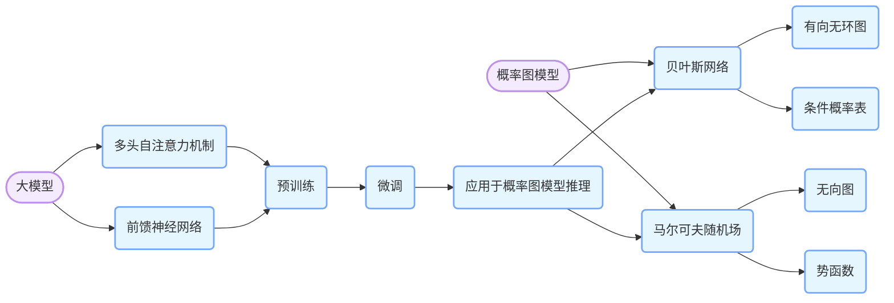

# 大模型在概率图模型推理任务中的性能评估

> 关键词：大模型、概率图模型、推理任务、性能评估、评估指标

> 摘要：本文聚焦于大模型在概率图模型推理任务中的性能评估。首先介绍了研究的背景、目的、预期读者等信息，接着阐述了大模型和概率图模型的核心概念及其联系，详细讲解了相关核心算法原理与操作步骤，给出了数学模型和公式并举例说明。通过项目实战，展示了代码实现及解读。分析了大模型在概率图模型推理任务中的实际应用场景，推荐了相关的学习资源、开发工具框架以及论文著作。最后总结了未来发展趋势与挑战，并对常见问题进行了解答，提供了扩展阅读和参考资料，旨在为相关领域的研究和实践提供全面而深入的指导。

## 1. 背景介绍 
### 1.1 目的和范围
概率图模型是一种强大的工具，用于表示和处理复杂的概率分布，在机器学习、计算机视觉、自然语言处理等众多领域有着广泛的应用。随着大模型的兴起，将大模型应用于概率图模型推理任务成为了研究的热点。本研究的目的在于全面、系统地评估大模型在概率图模型推理任务中的性能，为模型的选择、改进和应用提供科学依据。

研究范围涵盖了常见的大模型架构，如Transformer、BERT等，以及典型的概率图模型，如贝叶斯网络、马尔可夫随机场等。同时，考虑了不同类型的推理任务，包括精确推理和近似推理。

### 1.2 预期读者
本文预期读者包括从事机器学习、人工智能、概率图模型等领域研究的科研人员，以及在实际项目中需要使用大模型进行概率图模型推理的工程师。对于对相关领域感兴趣的初学者，本文也提供了详细的基础知识介绍和案例分析，有助于他们快速入门。

### 1.3 文档结构概述
本文将按照以下结构展开：首先介绍核心概念与联系，让读者了解大模型和概率图模型的基本原理和相互关系；接着详细讲解核心算法原理和具体操作步骤，并通过Python代码进行说明；给出相关的数学模型和公式，并举例解释；通过项目实战展示代码实现和解读；分析大模型在概率图模型推理任务中的实际应用场景；推荐相关的学习资源、开发工具框架和论文著作；最后总结未来发展趋势与挑战，解答常见问题，并提供扩展阅读和参考资料。

### 1.4 术语表
#### 1.4.1 核心术语定义
- **大模型**：通常指具有大量参数和强大计算能力的深度学习模型，如GPT系列、BERT等。这些模型在大规模数据集上进行训练，能够学习到丰富的语言和数据模式。
- **概率图模型**：用图结构来表示变量之间概率依赖关系的模型，包括有向图（如贝叶斯网络）和无向图（如马尔可夫随机场）。它能够有效地处理不确定性和复杂的概率分布。
- **推理任务**：在概率图模型中，根据已知的证据变量推断未知变量的概率分布的过程。可以分为精确推理和近似推理。
- **性能评估**：通过一系列指标和方法，对大模型在概率图模型推理任务中的表现进行量化和评价。

#### 1.4.2 相关概念解释
- **精确推理**：在概率图模型中，通过精确的算法计算出未知变量的精确概率分布。例如，在贝叶斯网络中，可以使用变量消元法进行精确推理。
- **近似推理**：当精确推理计算复杂度较高时，采用近似算法来估计未知变量的概率分布。常见的近似推理方法包括蒙特卡罗采样、变分推理等。
- **证据变量**：在推理任务中，已知其取值的变量。通过证据变量的信息，可以对未知变量的概率分布进行更新。

#### 1.4.3 缩略词列表
- **BERT**：Bidirectional Encoder Representations from Transformers，基于Transformer的双向编码器表示模型。
- **GPT**：Generative Pretrained Transformer，生成式预训练Transformer模型。
- **MCMC**：Markov Chain Monte Carlo，马尔可夫链蒙特卡罗方法，一种常用的近似推理算法。

## 2. 核心概念与联系 

### 2.1 大模型概述
大模型通常基于深度学习架构，如Transformer。Transformer模型引入了注意力机制，能够有效地处理序列数据，捕捉长距离依赖关系。以BERT为例，它是一种基于Transformer的预训练模型，通过在大规模文本数据上进行无监督学习，学习到了丰富的语言表示。

BERT的架构由多个Transformer编码器层堆叠而成，每个编码器层包含多头自注意力机制和前馈神经网络。多头自注意力机制允许模型在不同的表示子空间中关注输入序列的不同部分，从而提高模型的表达能力。

### 2.2 概率图模型概述
概率图模型分为有向图模型（贝叶斯网络）和无向图模型（马尔可夫随机场）。

#### 2.2.1 贝叶斯网络
贝叶斯网络用有向无环图（DAG）表示变量之间的因果关系。图中的节点表示随机变量，边表示变量之间的直接依赖关系。每个节点都有一个条件概率表（CPT），描述了该节点在其父节点取值条件下的概率分布。

例如，考虑一个简单的贝叶斯网络，包含三个节点：天气（Weather）、是否带伞（Umbrella）和是否淋湿（Wet）。天气节点影响是否带伞，而是否带伞和天气共同影响是否淋湿。可以用以下公式表示：

$$P(Weather, Umbrella, Wet) = P(Weather)P(Umbrella|Weather)P(Wet|Weather, Umbrella)$$

#### 2.2.2 马尔可夫随机场
马尔可夫随机场用无向图表示变量之间的概率依赖关系。图中的节点表示随机变量，边表示变量之间的相互作用。马尔可夫随机场通过势函数来定义联合概率分布。

例如，在图像分割任务中，可以将每个像素看作一个节点，相邻像素之间存在边。势函数可以用来表示相邻像素之间的相似性，从而实现图像的分割。

### 2.3 大模型与概率图模型的联系
大模型可以应用于概率图模型的推理任务中。一方面，大模型可以学习概率图模型的结构和参数，通过预训练和微调，提高模型在推理任务中的性能。另一方面，概率图模型可以为大模型提供结构化的知识表示，帮助大模型更好地理解数据中的概率依赖关系。

例如，在自然语言处理中，可以将概率图模型用于表示文本中的语义关系，然后使用大模型进行推理，预测文本中的未知信息。

### 2.4 核心概念原理和架构的文本示意图
```plaintext
大模型（如Transformer）
|
|-- 多头自注意力机制
|-- 前馈神经网络
|
|-- 预训练
|-- 微调
|
|-- 应用于概率图模型推理
|
概率图模型
|
|-- 贝叶斯网络
|   |-- 有向无环图
|   |-- 条件概率表
|
|-- 马尔可夫随机场
|   |-- 无向图
|   |-- 势函数
```

### 2.5 Mermaid 流程图


## 3. 核心算法原理 & 具体操作步骤 

### 3.1 大模型在概率图模型推理中的核心算法原理
大模型在概率图模型推理中主要通过学习概率图模型的结构和参数，然后进行推理计算。以基于Transformer的大模型为例，其核心算法原理如下：

#### 3.1.1 预训练阶段
在预训练阶段，大模型在大规模无监督数据上进行训练，学习到通用的语言表示和数据模式。例如，BERT采用了掩码语言模型（MLM）和下一句预测（NSP）两个任务进行预训练。

- **掩码语言模型**：随机掩码输入序列中的一些词，然后让模型预测这些被掩码的词。通过这种方式，模型学习到词与词之间的上下文关系。
- **下一句预测**：判断两个句子是否是连续的。这有助于模型学习句子之间的语义连贯性。

#### 3.1.2 微调阶段
在微调阶段，将预训练好的大模型应用到具体的概率图模型推理任务中。根据任务的特点，设计合适的损失函数，对模型进行微调。例如，在概率图模型的节点分类任务中，可以使用交叉熵损失函数。

### 3.2 具体操作步骤

#### 3.2.1 数据准备
首先，需要准备概率图模型的数据集。数据集应包含节点的特征信息、图的结构信息以及推理任务的标签信息。例如，在贝叶斯网络推理任务中，数据集可以包括每个节点的取值和条件概率表。

#### 3.2.2 模型加载
加载预训练好的大模型，如BERT。可以使用开源的深度学习框架，如PyTorch或TensorFlow，来加载和使用预训练模型。

#### 3.2.3 模型微调
根据概率图模型推理任务的特点，设计合适的微调策略。例如，在节点分类任务中，可以在大模型的输出层添加一个全连接层，用于输出节点的分类结果。然后，使用训练数据对模型进行微调。

#### 3.2.4 推理计算
在模型微调完成后，使用测试数据进行推理计算。输入测试数据的节点特征和图结构信息，模型输出推理结果。

### 3.3 Python源代码详细阐述

```python
import torch
from torch import nn
from transformers import BertModel

# 定义基于BERT的概率图模型推理模型
class ProbabilisticGraphInferenceModel(nn.Module):
    def __init__(self, num_classes):
        super(ProbabilisticGraphInferenceModel, self).__init__()
        self.bert = BertModel.from_pretrained('bert-base-uncased')
        self.fc = nn.Linear(self.bert.config.hidden_size, num_classes)

    def forward(self, input_ids, attention_mask):
        outputs = self.bert(input_ids=input_ids, attention_mask=attention_mask)
        pooled_output = outputs.pooler_output
        logits = self.fc(pooled_output)
        return logits

# 数据准备
input_ids = torch.randint(0, 1000, (16, 128))  # 模拟输入ID
attention_mask = torch.ones((16, 128), dtype=torch.long)  # 模拟注意力掩码
labels = torch.randint(0, 2, (16,))  # 模拟标签

# 模型加载
num_classes = 2
model = ProbabilisticGraphInferenceModel(num_classes)

# 定义损失函数和优化器
criterion = nn.CrossEntropyLoss()
optimizer = torch.optim.Adam(model.parameters(), lr=2e-5)

# 模型微调
for epoch in range(3):
    optimizer.zero_grad()
    logits = model(input_ids, attention_mask)
    loss = criterion(logits, labels)
    loss.backward()
    optimizer.step()
    print(f'Epoch {epoch+1}, Loss: {loss.item()}')

# 推理计算
with torch.no_grad():
    test_input_ids = torch.randint(0, 1000, (16, 128))
    test_attention_mask = torch.ones((16, 128), dtype=torch.long)
    test_logits = model(test_input_ids, test_attention_mask)
    predictions = torch.argmax(test_logits, dim=1)
    print('Predictions:', predictions)
```

## 4. 数学模型和公式 & 详细讲解 & 举例说明 

### 4.1 大模型的数学模型和公式
#### 4.1.1 Transformer的多头自注意力机制
Transformer的多头自注意力机制是其核心组件之一。给定输入序列 $X = [x_1, x_2, \cdots, x_n]$，其中 $x_i \in \mathbb{R}^d$，多头自注意力机制的计算过程如下：

首先，将输入序列通过三个线性变换得到查询（Query）、键（Key）和值（Value）矩阵：

$$Q = XW^Q, K = XW^K, V = XW^V$$

其中 $W^Q \in \mathbb{R}^{d \times d_k}$，$W^K \in \mathbb{R}^{d \times d_k}$，$W^V \in \mathbb{R}^{d \times d_v}$ 是可学习的参数矩阵。

然后，计算注意力分数：

$$Attention(Q, K, V) = \text{softmax}\left(\frac{QK^T}{\sqrt{d_k}}\right)V$$

多头自注意力机制将注意力计算并行进行多次，然后将结果拼接起来：

$$MultiHead(Q, K, V) = \text{Concat}(head_1, head_2, \cdots, head_h)W^O$$

其中 $head_i = Attention(QW_i^Q, KW_i^K, VW_i^V)$，$W_i^Q \in \mathbb{R}^{d \times d_k}$，$W_i^K \in \mathbb{R}^{d \times d_k}$，$W_i^V \in \mathbb{R}^{d \times d_v}$，$W^O \in \mathbb{R}^{hd_v \times d}$ 是可学习的参数矩阵。

#### 4.1.2 BERT的预训练损失函数
BERT的预训练损失函数由掩码语言模型损失和下一句预测损失组成：

$$L = L_{MLM} + L_{NSP}$$

其中 $L_{MLM}$ 是掩码语言模型的交叉熵损失，$L_{NSP}$ 是下一句预测的交叉熵损失。

### 4.2 概率图模型的数学模型和公式
#### 4.2.1 贝叶斯网络的联合概率分布
对于一个具有 $n$ 个节点的贝叶斯网络，其联合概率分布可以表示为：

$$P(X_1, X_2, \cdots, X_n) = \prod_{i=1}^{n} P(X_i|Pa(X_i))$$

其中 $Pa(X_i)$ 表示节点 $X_i$ 的父节点集合。

例如，对于一个包含三个节点 $A$、$B$、$C$ 的贝叶斯网络，其中 $A$ 是 $B$ 的父节点，$B$ 和 $A$ 是 $C$ 的父节点，则联合概率分布为：

$$P(A, B, C) = P(A)P(B|A)P(C|A, B)$$

#### 4.2.2 马尔可夫随机场的联合概率分布
马尔可夫随机场的联合概率分布可以通过势函数来定义：

$$P(X) = \frac{1}{Z} \prod_{c \in C} \psi_c(X_c)$$

其中 $C$ 是图中的所有团（完全子图）的集合，$X_c$ 是团 $c$ 中的节点集合，$\psi_c(X_c)$ 是团 $c$ 的势函数，$Z$ 是归一化常数：

$$Z = \sum_{X} \prod_{c \in C} \psi_c(X_c)$$

### 4.3 大模型在概率图模型推理中的数学模型和公式
在大模型应用于概率图模型推理中，通常使用交叉熵损失函数来进行模型微调。假设模型的输出为 $\hat{y} = [\hat{y}_1, \hat{y}_2, \cdots, \hat{y}_K]$，真实标签为 $y = [y_1, y_2, \cdots, y_K]$，其中 $K$ 是类别数，则交叉熵损失函数为：

$$L = -\sum_{i=1}^{K} y_i \log(\hat{y}_i)$$

### 4.4 举例说明
#### 4.4.1 大模型的多头自注意力机制举例
假设输入序列 $X$ 是一个长度为 3 的向量序列，每个向量的维度为 4：

$$X = \begin{bmatrix}
1 & 2 & 3 & 4 \\
5 & 6 & 7 & 8 \\
9 & 10 & 11 & 12
\end{bmatrix}$$

设 $d_k = d_v = 2$，$W^Q$、$W^K$、$W^V$ 分别为：

$$W^Q = \begin{bmatrix}
0.1 & 0.2 \\
0.3 & 0.4 \\
0.5 & 0.6 \\
0.7 & 0.8
\end{bmatrix}, W^K = \begin{bmatrix}
0.9 & 1.0 \\
1.1 & 1.2 \\
1.3 & 1.4 \\
1.5 & 1.6
\end{bmatrix}, W^V = \begin{bmatrix}
1.7 & 1.8 \\
1.9 & 2.0 \\
2.1 & 2.2 \\
2.3 & 2.4
\end{bmatrix}$$

则 $Q = XW^Q$，$K = XW^K$，$V = XW^V$ 的计算如下：

$$Q = \begin{bmatrix}
1\times0.1 + 2\times0.3 + 3\times0.5 + 4\times0.7 & 1\times0.2 + 2\times0.4 + 3\times0.6 + 4\times0.8 \\
5\times0.1 + 6\times0.3 + 7\times0.5 + 8\times0.7 & 5\times0.2 + 6\times0.4 + 7\times0.6 + 8\times0.8 \\
9\times0.1 + 10\times0.3 + 11\times0.5 + 12\times0.7 & 9\times0.2 + 10\times0.4 + 11\times0.6 + 12\times0.8
\end{bmatrix} = \begin{bmatrix}
5.0 & 6.0 \\
15.0 & 18.0 \\
25.0 & 30.0
\end{bmatrix}$$

$$K = \begin{bmatrix}
1\times0.9 + 2\times1.1 + 3\times1.3 + 4\times1.5 & 1\times1.0 + 2\times1.2 + 3\times1.4 + 4\times1.6 \\
5\times0.9 + 6\times1.1 + 7\times1.3 + 8\times1.5 & 5\times1.0 + 6\times1.2 + 7\times1.4 + 8\times1.6 \\
9\times0.9 + 10\times1.1 + 11\times1.3 + 12\times1.5 & 9\times1.0 + 10\times1.2 + 11\times1.4 + 12\times1.6
\end{bmatrix} = \begin{bmatrix}
12.0 & 14.0 \\
36.0 & 42.0 \\
60.0 & 70.0
\end{bmatrix}$$

$$V = \begin{bmatrix}
1\times1.7 + 2\times1.9 + 3\times2.1 + 4\times2.3 & 1\times1.8 + 2\times2.0 + 3\times2.2 + 4\times2.4 \\
5\times1.7 + 6\times1.9 + 7\times2.1 + 8\times2.3 & 5\times1.8 + 6\times2.0 + 7\times2.2 + 8\times2.4 \\
9\times1.7 + 10\times1.9 + 11\times2.1 + 12\times2.3 & 9\times1.8 + 10\times2.0 + 11\times2.2 + 12\times2.4
\end{bmatrix} = \begin{bmatrix}
20.0 & 22.0 \\
60.0 & 66.0 \\
100.0 & 110.0
\end{bmatrix}$$

然后计算注意力分数：

$$QK^T = \begin{bmatrix}
5.0\times12.0 + 6.0\times14.0 & 5.0\times36.0 + 6.0\times42.0 & 5.0\times60.0 + 6.0\times70.0 \\
15.0\times12.0 + 18.0\times14.0 & 15.0\times36.0 + 18.0\times42.0 & 15.0\times60.0 + 18.0\times70.0 \\
25.0\times12.0 + 30.0\times14.0 & 25.0\times36.0 + 30.0\times42.0 & 25.0\times60.0 + 30.0\times70.0
\end{bmatrix} = \begin{bmatrix}
144.0 & 432.0 & 720.0 \\
432.0 & 1296.0 & 2160.0 \\
720.0 & 2160.0 & 3600.0
\end{bmatrix}$$

$$\frac{QK^T}{\sqrt{d_k}} = \frac{1}{\sqrt{2}}\begin{bmatrix}
144.0 & 432.0 & 720.0 \\
432.0 & 1296.0 & 2160.0 \\
720.0 & 2160.0 & 3600.0
\end{bmatrix}$$

最后计算注意力输出：

$$Attention(Q, K, V) = \text{softmax}\left(\frac{QK^T}{\sqrt{d_k}}\right)V$$

#### 4.4.2 贝叶斯网络的联合概率分布举例
考虑一个简单的贝叶斯网络，包含三个节点：$A$、$B$、$C$，其中 $A$ 是 $B$ 的父节点，$B$ 和 $A$ 是 $C$ 的父节点。假设节点的取值为二进制（0 或 1），条件概率表如下：

$$P(A = 0) = 0.6, P(A = 1) = 0.4$$

$$P(B = 0|A = 0) = 0.7, P(B = 1|A = 0) = 0.3$$
$$P(B = 0|A = 1) = 0.2, P(B = 1|A = 1) = 0.8$$

$$P(C = 0|A = 0, B = 0) = 0.8, P(C = 1|A = 0, B = 0) = 0.2$$
$$P(C = 0|A = 0, B = 1) = 0.3, P(C = 1|A = 0, B = 1) = 0.7$$
$$P(C = 0|A = 1, B = 0) = 0.4, P(C = 1|A = 1, B = 0) = 0.6$$
$$P(C = 0|A = 1, B = 1) = 0.1, P(C = 1|A = 1, B = 1) = 0.9$$

则 $P(A = 0, B = 0, C = 0) = P(A = 0)P(B = 0|A = 0)P(C = 0|A = 0, B = 0) = 0.6\times0.7\times0.8 = 0.336$

## 5. 项目实战：代码实际案例和详细解释说明 

### 5.1  开发环境搭建
#### 5.1.1 操作系统
推荐使用 Linux 系统，如 Ubuntu 18.04 或更高版本。Windows 和 macOS 系统也可以使用，但在某些情况下可能会遇到兼容性问题。

#### 5.1.2 Python 环境
安装 Python 3.7 或更高版本。可以使用 Anaconda 来管理 Python 环境，创建一个新的虚拟环境：

```bash
conda create -n graph_inference python=3.8
conda activate graph_inference
```

#### 5.1.3 依赖库安装
安装必要的依赖库，包括 PyTorch、transformers、numpy 等：

```bash
pip install torch transformers numpy
```

### 5.2  源代码详细实现和代码解读
```python
import torch
from torch import nn
from transformers import BertModel

# 定义基于BERT的概率图模型推理模型
class ProbabilisticGraphInferenceModel(nn.Module):
    def __init__(self, num_classes):
        super(ProbabilisticGraphInferenceModel, self).__init__()
        # 加载预训练的BERT模型
        self.bert = BertModel.from_pretrained('bert-base-uncased')
        # 定义全连接层，用于输出分类结果
        self.fc = nn.Linear(self.bert.config.hidden_size, num_classes)

    def forward(self, input_ids, attention_mask):
        # 前向传播，通过BERT模型得到输出
        outputs = self.bert(input_ids=input_ids, attention_mask=attention_mask)
        # 获取池化后的输出
        pooled_output = outputs.pooler_output
        # 通过全连接层得到分类结果
        logits = self.fc(pooled_output)
        return logits

# 数据准备
# 模拟输入ID，形状为 (batch_size, sequence_length)
input_ids = torch.randint(0, 1000, (16, 128))
# 模拟注意力掩码，用于指示哪些位置是有效输入
attention_mask = torch.ones((16, 128), dtype=torch.long)
# 模拟标签，形状为 (batch_size,)
labels = torch.randint(0, 2, (16,))

# 模型加载
# 定义分类的类别数
num_classes = 2
# 初始化模型
model = ProbabilisticGraphInferenceModel(num_classes)

# 定义损失函数和优化器
# 使用交叉熵损失函数
criterion = nn.CrossEntropyLoss()
# 使用Adam优化器
optimizer = torch.optim.Adam(model.parameters(), lr=2e-5)

# 模型微调
# 训练3个epoch
for epoch in range(3):
    # 梯度清零
    optimizer.zero_grad()
    # 前向传播，得到模型的输出
    logits = model(input_ids, attention_mask)
    # 计算损失
    loss = criterion(logits, labels)
    # 反向传播，计算梯度
    loss.backward()
    # 更新模型参数
    optimizer.step()
    print(f'Epoch {epoch+1}, Loss: {loss.item()}')

# 推理计算
# 关闭梯度计算
with torch.no_grad():
    # 模拟测试输入ID
    test_input_ids = torch.randint(0, 1000, (16, 128))
    # 模拟测试注意力掩码
    test_attention_mask = torch.ones((16, 128), dtype=torch.long)
    # 前向传播，得到测试输出
    test_logits = model(test_input_ids, test_attention_mask)
    # 获取预测结果
    predictions = torch.argmax(test_logits, dim=1)
    print('Predictions:', predictions)
```

### 5.3  代码解读与分析
#### 5.3.1 模型定义
`ProbabilisticGraphInferenceModel` 类继承自 `nn.Module`，用于定义基于BERT的概率图模型推理模型。在 `__init__` 方法中，加载预训练的BERT模型，并定义一个全连接层用于输出分类结果。在 `forward` 方法中，实现了模型的前向传播过程。

#### 5.3.2 数据准备
使用 `torch.randint` 函数模拟输入ID和标签，使用 `torch.ones` 函数模拟注意力掩码。在实际应用中，需要使用真实的数据集进行训练和测试。

#### 5.3.3 模型训练
使用交叉熵损失函数和Adam优化器进行模型训练。在每个epoch中，先将梯度清零，然后进行前向传播、计算损失、反向传播和参数更新。

#### 5.3.4 推理计算
在推理阶段，使用 `torch.no_grad()` 上下文管理器关闭梯度计算，以提高推理速度。通过前向传播得到测试输出，然后使用 `torch.argmax` 函数获取预测结果。

## 6. 实际应用场景 
### 6.1 自然语言处理
在自然语言处理中，概率图模型可以用于表示文本中的语义关系，如词性标注、命名实体识别等。大模型可以学习这些语义关系，提高推理任务的性能。例如，在命名实体识别任务中，使用概率图模型表示实体之间的依赖关系，然后使用大模型进行推理，预测文本中的实体标签。

### 6.2 计算机视觉
在计算机视觉中，概率图模型可以用于图像分割、目标检测等任务。大模型可以学习图像中的特征和结构信息，结合概率图模型进行推理。例如，在图像分割任务中，使用马尔可夫随机场表示像素之间的相似性，然后使用大模型进行推理，将图像分割成不同的区域。

### 6.3 生物信息学
在生物信息学中，概率图模型可以用于基因调控网络分析、蛋白质结构预测等任务。大模型可以学习生物数据中的复杂模式，结合概率图模型进行推理。例如，在基因调控网络分析中，使用贝叶斯网络表示基因之间的调控关系，然后使用大模型进行推理，预测基因的表达水平。

### 6.4 金融领域
在金融领域，概率图模型可以用于风险评估、投资决策等任务。大模型可以学习金融数据中的规律和趋势，结合概率图模型进行推理。例如，在风险评估任务中，使用概率图模型表示风险因素之间的依赖关系，然后使用大模型进行推理，评估投资项目的风险水平。

## 7. 工具和资源推荐
### 7.1 学习资源推荐
#### 7.1.1 书籍推荐
- 《深度学习》（Deep Learning）：由Ian Goodfellow、Yoshua Bengio和Aaron Courville所著，是深度学习领域的经典教材，涵盖了深度学习的基本概念、算法和应用。
- 《概率图模型：原理与技术》（Probabilistic Graphical Models: Principles and Techniques）：由Daphne Koller和Nir Friedman所著，详细介绍了概率图模型的原理、算法和应用。
- 《自然语言处理入门》（Natural Language Processing with Python）：由Steven Bird、Ewan Klein和Edward Loper所著，介绍了自然语言处理的基本概念和技术，使用Python进行实现。

#### 7.1.2 在线课程
- Coursera上的“深度学习专项课程”（Deep Learning Specialization）：由Andrew Ng教授授课，涵盖了深度学习的各个方面，包括神经网络、卷积神经网络、循环神经网络等。
- edX上的“概率图模型”（Probabilistic Graphical Models）：由Daphne Koller教授授课，详细介绍了概率图模型的原理和算法。
- 网易云课堂上的“自然语言处理实战”（Natural Language Processing实战）：介绍了自然语言处理的实际应用和技术，包括文本分类、情感分析等。

#### 7.1.3 技术博客和网站
- arXiv：是一个预印本服务器，提供了大量的学术论文，涵盖了机器学习、人工智能等领域的最新研究成果。
- Medium：是一个技术博客平台，有许多机器学习和人工智能领域的专家分享他们的经验和见解。
- 机器之心：是一个专注于人工智能领域的媒体平台，提供了最新的技术动态、研究成果和应用案例。

### 7.2 开发工具框架推荐
#### 7.2.1 IDE和编辑器
- PyCharm：是一款专门为Python开发设计的集成开发环境，提供了代码编辑、调试、版本控制等功能。
- Jupyter Notebook：是一个交互式的开发环境，适合进行数据分析和模型实验。可以在浏览器中运行代码，并实时查看结果。
- Visual Studio Code：是一款轻量级的代码编辑器，支持多种编程语言，有丰富的插件可以扩展功能。

#### 7.2.2 调试和性能分析工具
- PyTorch Profiler：是PyTorch提供的性能分析工具，可以帮助用户分析模型的性能瓶颈，优化代码。
- TensorBoard：是TensorFlow提供的可视化工具，可以用于可视化模型的训练过程、损失曲线、参数分布等。
- cProfile：是Python标准库中的性能分析工具，可以分析Python代码的执行时间和调用次数。

#### 7.2.3 相关框架和库
- PyTorch：是一个开源的深度学习框架，提供了丰富的神经网络层和优化算法，支持GPU加速。
- TensorFlow：是另一个流行的深度学习框架，具有高效的分布式训练和部署能力。
- NetworkX：是一个用于创建、操作和研究复杂网络的Python库，可以用于概率图模型的构建和分析。

### 7.3 相关论文著作推荐
#### 7.3.1 经典论文
- “Attention Is All You Need”：提出了Transformer模型，引入了注意力机制，是深度学习领域的经典论文。
- “Deep Residual Learning for Image Recognition”：提出了残差网络（ResNet），解决了深度神经网络训练中的梯度消失问题。
- “Probabilistic Reasoning in Intelligent Systems: Networks of Plausible Inference”：是概率图模型领域的经典著作，介绍了概率图模型的基本原理和算法。

#### 7.3.2 最新研究成果
- “Language Models are Few-Shot Learners”：介绍了GPT-3模型，展示了大模型在少样本学习中的强大能力。
- “Masked Autoencoders Are Scalable Vision Learners”：提出了MAE模型，是计算机视觉领域的最新研究成果。
- “Graph Neural Networks: A Review of Methods and Applications”：对图神经网络的方法和应用进行了综述。

#### 7.3.3 应用案例分析
- “Applying Probabilistic Graphical Models to Healthcare Data Analysis”：介绍了概率图模型在医疗数据分析中的应用案例。
- “Using Deep Learning and Probabilistic Graphical Models for Financial Risk Assessment”：介绍了深度学习和概率图模型在金融风险评估中的应用案例。
- “Natural Language Processing with Probabilistic Graphical Models”：介绍了概率图模型在自然语言处理中的应用案例。

## 8. 总结：未来发展趋势与挑战
### 8.1 未来发展趋势
#### 8.1.1 模型融合
未来，大模型和概率图模型的融合将更加深入。大模型可以为概率图模型提供更强大的特征表示能力，而概率图模型可以为大模型提供结构化的知识和推理能力。例如，将大模型的预训练表示与概率图模型的推理算法相结合，提高推理任务的性能。

#### 8.1.2 可解释性增强
随着大模型在关键领域的应用越来越广泛，模型的可解释性变得越来越重要。未来，研究人员将致力于提高大模型在概率图模型推理任务中的可解释性，例如通过可视化、规则提取等方法，让用户更好地理解模型的决策过程。

#### 8.1.3 跨领域应用
大模型在概率图模型推理任务中的应用将拓展到更多的领域，如物联网、智能交通、医疗保健等。通过结合不同领域的数据和知识，提高模型的泛化能力和应用价值。

### 8.2 挑战
#### 8.2.1 计算资源需求
大模型通常需要大量的计算资源进行训练和推理，这对硬件设备和计算成本提出了很高的要求。如何在有限的计算资源下提高大模型在概率图模型推理任务中的性能，是一个亟待解决的问题。

#### 8.2.2 数据质量和标注
概率图模型的训练和推理需要高质量的数据和准确的标注。然而，在实际应用中，数据往往存在噪声、缺失值等问题，标注成本也很高。如何处理这些数据问题，提高数据的质量和可用性，是一个挑战。

#### 8.2.3 模型复杂度和可扩展性
大模型和概率图模型的复杂度都很高，如何在保证模型性能的前提下，提高模型的可扩展性，是一个需要研究的问题。例如，如何处理大规模的概率图模型和高维的数据。

## 9. 附录：常见问题与解答
### 9.1 大模型在概率图模型推理任务中的性能评估有哪些常用指标？
常用的性能评估指标包括准确率、召回率、F1值、均方误差（MSE）、对数损失（Log Loss）等。准确率用于衡量模型预测正确的比例；召回率用于衡量模型正确预测正样本的比例；F1值是准确率和召回率的调和平均数；均方误差用于衡量回归任务中模型预测值与真实值之间的误差；对数损失用于衡量分类任务中模型预测概率的准确性。

### 9.2 如何选择合适的大模型和概率图模型进行推理任务？
选择合适的大模型和概率图模型需要考虑多个因素，如任务的类型、数据的特点、计算资源的限制等。对于自然语言处理任务，可以选择基于Transformer的大模型，如BERT、GPT等；对于图像和视频处理任务，可以选择卷积神经网络（CNN）等大模型。对于概率图模型，如果数据具有明显的因果关系，可以选择贝叶斯网络；如果数据具有局部相关性，可以选择马尔可夫随机场。

### 9.3 大模型在概率图模型推理任务中可能会遇到哪些问题？
大模型在概率图模型推理任务中可能会遇到以下问题：
- 过拟合：模型在训练数据上表现良好，但在测试数据上表现不佳。可以通过正则化、增加数据等方法来解决。
- 计算资源不足：大模型的训练和推理需要大量的计算资源，可能会导致训练时间过长或无法运行。可以通过使用GPU加速、模型压缩等方法来解决。
- 数据不平衡：在分类任务中，数据的类别分布可能不平衡，导致模型对少数类别的预测性能较差。可以通过数据增强、重采样等方法来解决。

## 10. 扩展阅读 & 参考资料
### 10.1 扩展阅读
- 《人工智能：一种现代的方法》（Artificial Intelligence: A Modern Approach）：是人工智能领域的经典教材，涵盖了人工智能的各个方面，包括搜索算法、知识表示、机器学习等。
- 《深度学习实战》（Deep Learning in Practice）：介绍了深度学习的实际应用和技术，包括图像识别、自然语言处理、语音识别等。
- 《图机器学习》（Graph Machine Learning）：详细介绍了图机器学习的方法和应用，包括图神经网络、图嵌入等。

### 10.2 参考资料
- Goodfellow, I., Bengio, Y., & Courville, A. (2016). Deep Learning. MIT Press.
- Koller, D., & Friedman, N. (2009). Probabilistic Graphical Models: Principles and Techniques. MIT Press.
- Bird, S., Klein, E., & Loper, E. (2009). Natural Language Processing with Python. O'Reilly Media.

作者：AI天才研究院/AI Genius Institute & 禅与计算机程序设计艺术 /Zen And The Art of Computer Programming