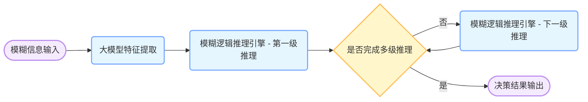

# 大模型在模糊逻辑多级推理中的决策能力评估指标

> 关键词：大模型、模糊逻辑、多级推理、决策能力、评估指标

> 摘要：本文聚焦于大模型在模糊逻辑多级推理中的决策能力评估。首先介绍了研究的背景、目的、预期读者等信息。接着阐述了大模型、模糊逻辑和多级推理的核心概念及其联系，并给出了相应的文本示意图和 Mermaid 流程图。详细讲解了核心算法原理，用 Python 代码进行了说明，同时给出了相关的数学模型和公式并举例。通过项目实战展示了代码的实际应用和详细解读。分析了大模型在模糊逻辑多级推理决策中的实际应用场景，推荐了学习资源、开发工具框架以及相关论文著作。最后总结了未来发展趋势与挑战，提供了常见问题解答和扩展阅读参考资料，旨在为评估大模型在该领域的决策能力提供全面且深入的指导。

## 1. 背景介绍 
### 1.1 目的和范围
在当今人工智能领域，大模型的发展日新月异。模糊逻辑多级推理作为一种处理不确定性和模糊信息的有效方法，在许多实际场景中有着广泛的应用。然而，如何准确评估大模型在模糊逻辑多级推理中的决策能力是一个亟待解决的问题。本研究的目的就是建立一套科学、合理的评估指标体系，用于全面、客观地衡量大模型在这一特定领域的决策表现。研究范围涵盖了常见的大模型架构，如基于 Transformer 的模型，以及多种模糊逻辑多级推理方法，旨在为不同应用场景下的大模型决策能力评估提供参考。

### 1.2 预期读者
本文预期读者包括人工智能领域的研究人员、开发者、数据科学家以及对大模型和模糊逻辑推理感兴趣的专业人士。对于正在从事相关研究或开发工作的人员，本文可以为他们提供评估大模型决策能力的理论基础和实践方法；对于初学者，本文有助于他们了解大模型在模糊逻辑多级推理中的应用和评估的基本概念。

### 1.3 文档结构概述
本文将按照以下结构进行组织：首先介绍核心概念与联系，帮助读者理解大模型、模糊逻辑和多级推理的基本原理和它们之间的关系；接着阐述核心算法原理和具体操作步骤，并使用 Python 代码进行详细说明；然后给出相关的数学模型和公式，并举例进行详细讲解；通过项目实战展示代码的实际应用和详细解读；分析大模型在模糊逻辑多级推理决策中的实际应用场景；推荐学习资源、开发工具框架以及相关论文著作；最后总结未来发展趋势与挑战，提供常见问题解答和扩展阅读参考资料。

### 1.4 术语表
#### 1.4.1 核心术语定义
- **大模型**：通常指具有大量参数和强大计算能力的人工智能模型，如 GPT 系列、BERT 等。这些模型通过在大规模数据集上进行训练，能够学习到丰富的语言和知识表示。
- **模糊逻辑**：一种处理不确定性和模糊信息的逻辑系统，与传统的布尔逻辑不同，模糊逻辑允许命题的真值在 0 到 1 之间取值，更符合人类对模糊概念的认知和处理方式。
- **多级推理**：指在推理过程中，通过多个层次的推理步骤逐步得出结论的过程。每一层的推理结果可以作为下一层推理的输入，从而实现复杂的推理任务。
- **决策能力**：大模型在模糊逻辑多级推理过程中，根据输入的模糊信息和推理规则，做出合理决策的能力。

#### 1.4.2 相关概念解释
- **模糊集合**：模糊逻辑中的基本概念，是一种对传统集合概念的扩展。模糊集合中的元素具有一定的隶属度，表示该元素属于该集合的程度。
- **模糊规则**：用于描述模糊逻辑推理过程的规则，通常采用“如果……那么……”的形式，例如“如果温度高，那么风扇转速快”。
- **推理引擎**：负责根据输入的模糊信息和模糊规则进行推理计算，得出推理结果的程序模块。

#### 1.4.3 缩略词列表
- **GPT**：Generative Pretrained Transformer，生成式预训练变换器
- **BERT**：Bidirectional Encoder Representations from Transformers，基于变换器的双向编码器表示

## 2. 核心概念与联系 
### 核心概念原理
#### 大模型
大模型通常基于深度学习架构，如 Transformer 架构。Transformer 架构由编码器和解码器组成，其中编码器负责对输入序列进行特征提取和表示，解码器负责根据编码器的输出生成目标序列。大模型通过在大规模数据集上进行无监督预训练，学习到语言的通用表示和语义信息，然后可以在特定任务上进行微调，以适应不同的应用场景。

#### 模糊逻辑
模糊逻辑的核心思想是用模糊集合来表示模糊概念，用模糊规则来描述模糊推理过程。模糊集合中的元素具有隶属度，隶属度函数用于描述元素属于模糊集合的程度。模糊规则通常采用“如果……那么……”的形式，通过模糊推理引擎根据输入的模糊信息和模糊规则进行推理计算，得出模糊结论。

#### 多级推理
多级推理是一种逐步推进的推理过程，每一级推理都基于上一级的推理结果进行。在模糊逻辑多级推理中，每一级推理都处理模糊信息，通过多次推理逐步细化和明确最终的决策结果。

### 架构的文本示意图
大模型在模糊逻辑多级推理中的架构可以描述为：输入的模糊信息首先经过大模型进行特征提取和语义理解，将模糊信息转化为模型能够处理的表示形式。然后，这些表示形式作为输入传递给模糊逻辑推理引擎，推理引擎根据预设的模糊规则进行第一级推理。第一级推理的结果作为下一级推理的输入，继续进行推理，直到完成多级推理过程，最终得出决策结果。

### Mermaid 流程图


## 3. 核心算法原理 & 具体操作步骤 
### 核心算法原理
在大模型进行模糊逻辑多级推理时，主要涉及两个关键步骤：大模型的特征提取和模糊逻辑推理。

#### 大模型特征提取
大模型通常使用预训练的语言模型，如 BERT 或 GPT。以 BERT 为例，输入的模糊信息首先被分词为词元序列，然后通过 BERT 的嵌入层将词元转换为词向量表示。接着，词向量经过多个 Transformer 编码器层进行特征提取，每个编码器层由多头自注意力机制和前馈神经网络组成。多头自注意力机制允许模型在不同的表示子空间中关注输入序列的不同部分，从而捕获序列中的长距离依赖关系。最后，编码器层的输出作为大模型提取的特征表示。

#### 模糊逻辑推理
模糊逻辑推理基于模糊集合和模糊规则。首先，将大模型提取的特征映射到模糊集合中，计算特征在各个模糊集合中的隶属度。然后，根据预设的模糊规则，使用模糊推理方法（如 Mamdani 方法或 Sugeno 方法）进行推理计算。在多级推理中，上一级推理的结果作为下一级推理的输入，重复上述过程，直到完成所有级别的推理。

### 具体操作步骤
#### 步骤 1：数据预处理
将输入的模糊信息进行分词和编码，使其能够输入到大模型中。可以使用 Python 的 `transformers` 库来实现。

```python
from transformers import AutoTokenizer

# 加载预训练的分词器
tokenizer = AutoTokenizer.from_pretrained('bert-base-uncased')

# 输入的模糊信息
input_text = "温度有点高"

# 分词和编码
input_ids = tokenizer.encode(input_text, return_tensors='pt')
```

#### 步骤 2：大模型特征提取
使用预训练的大模型进行特征提取。

```python
from transformers import AutoModel

# 加载预训练的大模型
model = AutoModel.from_pretrained('bert-base-uncased')

# 提取特征
outputs = model(input_ids)
features = outputs.last_hidden_state
```

#### 步骤 3：模糊集合定义和隶属度计算
定义模糊集合和隶属度函数，计算特征在各个模糊集合中的隶属度。

```python
import numpy as np

# 定义模糊集合的隶属度函数（示例）
def membership_function(feature, center, width):
    return np.exp(-((feature - center) ** 2) / (2 * width ** 2))

# 定义模糊集合的中心和宽度
center_low = 0.2
width_low = 0.1
center_high = 0.8
width_high = 0.1

# 计算隶属度
membership_low = membership_function(features.mean().item(), center_low, width_low)
membership_high = membership_function(features.mean().item(), center_high, width_high)
```

#### 步骤 4：模糊规则推理
根据预设的模糊规则进行推理计算。

```python
# 定义模糊规则（示例）
# 如果温度低，那么风扇转速慢；如果温度高，那么风扇转速快
rule_low = 0.2  # 风扇转速慢的程度
rule_high = 0.8  # 风扇转速快的程度

# 推理计算
output = membership_low * rule_low + membership_high * rule_high
```

#### 步骤 5：多级推理
如果需要进行多级推理，将上一级推理的结果作为下一级推理的输入，重复步骤 3 和步骤 4。

```python
# 假设进行两级推理
# 第一级推理结果作为第二级推理的输入
input_second_level = output

# 重复步骤 3 和步骤 4 进行第二级推理
#...
```

## 4. 数学模型和公式 & 详细讲解 & 举例说明 
### 大模型特征提取的数学模型
大模型的特征提取过程可以用以下数学公式表示。

假设输入的模糊信息为 $x = [x_1, x_2, \cdots, x_n]$，其中 $x_i$ 表示第 $i$ 个词元。经过分词和嵌入层后，词元被转换为词向量表示 $e = [e_1, e_2, \cdots, e_n]$，其中 $e_i \in \mathbb{R}^d$，$d$ 是词向量的维度。

在 Transformer 编码器层中，多头自注意力机制的计算过程如下：

对于每个头 $h$，首先计算查询矩阵 $Q^h$、键矩阵 $K^h$ 和值矩阵 $V^h$：

$$Q^h = eW_Q^h$$
$$K^h = eW_K^h$$
$$V^h = eW_V^h$$

其中 $W_Q^h$、$W_K^h$ 和 $W_V^h$ 是可学习的权重矩阵。

然后计算注意力分数：

$$A^h = \text{softmax}\left(\frac{Q^h(K^h)^T}{\sqrt{d_k}}\right)$$

其中 $d_k$ 是查询和键向量的维度。

最后计算多头自注意力的输出：

$$\text{MultiHead}(Q, K, V) = \text{Concat}(A^1V^1, A^2V^2, \cdots, A^HV^H)W_O$$

其中 $H$ 是头的数量，$W_O$ 是可学习的权重矩阵。

前馈神经网络的计算过程如下：

$$FFN(x) = \text{ReLU}(xW_1 + b_1)W_2 + b_2$$

其中 $W_1$、$W_2$ 是可学习的权重矩阵，$b_1$、$b_2$ 是偏置向量。

经过多个 Transformer 编码器层后，最终的特征表示为 $z = [z_1, z_2, \cdots, z_n]$。

### 模糊逻辑推理的数学模型
#### 隶属度函数
常见的隶属度函数有高斯隶属度函数、三角形隶属度函数等。以高斯隶属度函数为例，其数学公式为：

$$\mu(x; c, \sigma) = \exp\left(-\frac{(x - c)^2}{2\sigma^2}\right)$$

其中 $x$ 是输入的特征值，$c$ 是模糊集合的中心，$\sigma$ 是模糊集合的宽度。

#### 模糊规则推理
以 Mamdani 方法为例，假设模糊规则为“如果 $A$ 那么 $B$”，其中 $A$ 是前提条件，$B$ 是结论。前提条件 $A$ 的隶属度为 $\mu_A(x)$，结论 $B$ 的隶属度函数为 $\mu_B(y)$。

推理过程如下：

首先，根据前提条件的隶属度对结论的隶属度函数进行截断：

$$\mu_{B'}(y) = \min(\mu_A(x), \mu_B(y))$$

然后，对所有规则的截断后的隶属度函数进行聚合：

$$\mu_{B_{agg}}(y) = \max(\mu_{B_1'}(y), \mu_{B_2'}(y), \cdots, \mu_{B_m'}(y))$$

最后，通过去模糊化方法（如重心法）得到最终的清晰输出：

$$y_{out} = \frac{\int y\mu_{B_{agg}}(y)dy}{\int \mu_{B_{agg}}(y)dy}$$

### 举例说明
假设我们有一个模糊逻辑多级推理系统，用于根据温度控制风扇转速。输入的模糊信息是“温度有点高”，我们使用 BERT 大模型进行特征提取。

#### 大模型特征提取
输入的模糊信息经过 BERT 模型后，得到特征表示 $z$。假设 $z$ 的平均值为 0.7。

#### 模糊集合定义和隶属度计算
定义两个模糊集合：“温度低”和“温度高”，其中心和宽度分别为 $c_{low} = 0.2$，$\sigma_{low} = 0.1$，$c_{high} = 0.8$，$\sigma_{high} = 0.1$。

使用高斯隶属度函数计算隶属度：

$$\mu_{low}(0.7) = \exp\left(-\frac{(0.7 - 0.2)^2}{2\times0.1^2}\right) \approx 0.082$$
$$\mu_{high}(0.7) = \exp\left(-\frac{(0.7 - 0.8)^2}{2\times0.1^2}\right) \approx 0.607$$

#### 模糊规则推理
定义模糊规则：“如果温度低，那么风扇转速慢（转速为 0.2）”，“如果温度高，那么风扇转速快（转速为 0.8）”。

根据规则进行推理计算：

$$\text{output} = \mu_{low}(0.7) \times 0.2 + \mu_{high}(0.7) \times 0.8 \approx 0.082\times0.2 + 0.607\times0.8 = 0.502$$

如果进行两级推理，将第一级推理的结果 0.502 作为第二级推理的输入，重复上述过程。

## 5. 项目实战：代码实际案例和详细解释说明 
### 5.1  开发环境搭建
#### 安装 Python
确保你的系统已经安装了 Python 3.7 或更高版本。可以从 Python 官方网站（https://www.python.org/downloads/）下载并安装。

#### 创建虚拟环境
为了避免不同项目之间的依赖冲突，建议使用虚拟环境。可以使用 `venv` 模块创建虚拟环境：

```bash
python -m venv myenv
```

激活虚拟环境：

在 Windows 上：
```bash
myenv\Scripts\activate
```

在 Linux 或 macOS 上：
```bash
source myenv/bin/activate
```

#### 安装依赖库
安装所需的 Python 库，包括 `transformers`、`numpy` 等：

```bash
pip install transformers numpy
```

### 5.2  源代码详细实现和代码解读
```python
import torch
from transformers import AutoTokenizer, AutoModel
import numpy as np

# 步骤 1：数据预处理
# 加载预训练的分词器
tokenizer = AutoTokenizer.from_pretrained('bert-base-uncased')

# 输入的模糊信息
input_text = "温度有点高"

# 分词和编码
input_ids = tokenizer.encode(input_text, return_tensors='pt')

# 步骤 2：大模型特征提取
# 加载预训练的大模型
model = AutoModel.from_pretrained('bert-base-uncased')

# 提取特征
with torch.no_grad():
    outputs = model(input_ids)
features = outputs.last_hidden_state

# 步骤 3：模糊集合定义和隶属度计算
# 定义模糊集合的隶属度函数（高斯隶属度函数）
def membership_function(feature, center, width):
    return np.exp(-((feature - center) ** 2) / (2 * width ** 2))

# 定义模糊集合的中心和宽度
center_low = 0.2
width_low = 0.1
center_high = 0.8
width_high = 0.1

# 计算隶属度
feature_value = features.mean().item()
membership_low = membership_function(feature_value, center_low, width_low)
membership_high = membership_function(feature_value, center_high, width_high)

# 步骤 4：模糊规则推理
# 定义模糊规则（示例）
# 如果温度低，那么风扇转速慢；如果温度高，那么风扇转速快
rule_low = 0.2  # 风扇转速慢的程度
rule_high = 0.8  # 风扇转速快的程度

# 推理计算
output = membership_low * rule_low + membership_high * rule_high

# 步骤 5：多级推理（示例，假设进行两级推理）
# 第一级推理结果作为第二级推理的输入
input_second_level = output

# 重复步骤 3 和步骤 4 进行第二级推理
# 重新定义模糊集合的中心和宽度（可以根据实际情况调整）
center_low_second = 0.3
width_low_second = 0.1
center_high_second = 0.7
width_high_second = 0.1

# 计算隶属度
membership_low_second = membership_function(input_second_level, center_low_second, width_low_second)
membership_high_second = membership_function(input_second_level, center_high_second, width_high_second)

# 重新定义模糊规则（示例）
rule_low_second = 0.3  # 风扇转速慢的程度
rule_high_second = 0.7  # 风扇转速快的程度

# 推理计算
output_second_level = membership_low_second * rule_low_second + membership_high_second * rule_high_second

print("第一级推理结果:", output)
print("第二级推理结果:", output_second_level)
```

### 5.3  代码解读与分析
#### 数据预处理
使用 `transformers` 库的 `AutoTokenizer` 对输入的模糊信息进行分词和编码，将其转换为大模型能够处理的输入格式。

#### 大模型特征提取
使用 `AutoModel` 加载预训练的 BERT 模型，通过 `model(input_ids)` 提取输入信息的特征表示。使用 `torch.no_grad()` 上下文管理器可以避免在推理过程中计算梯度，提高推理速度。

#### 模糊集合定义和隶属度计算
定义了高斯隶属度函数 `membership_function`，并根据模糊集合的中心和宽度计算特征在各个模糊集合中的隶属度。

#### 模糊规则推理
根据预设的模糊规则，将隶属度与规则的结论进行加权求和，得到推理结果。

#### 多级推理
将第一级推理的结果作为第二级推理的输入，重复模糊集合定义和隶属度计算、模糊规则推理的过程，完成多级推理。

## 6. 实际应用场景 
### 智能家居
在智能家居系统中，大模型在模糊逻辑多级推理中的决策能力可以用于实现智能环境控制。例如，根据用户对环境的模糊描述（如“有点热”“有点暗”等），通过大模型提取语义信息，然后利用模糊逻辑多级推理确定空调的温度调节、灯光的亮度调节等决策。可以根据不同的时间段、用户的习惯等因素进行多级推理，提供更加个性化和智能的家居控制体验。

### 医疗诊断
在医疗诊断领域，患者的症状描述往往具有模糊性（如“有点头痛”“感觉身体乏力”等）。大模型可以对患者的症状描述进行分析和理解，提取关键信息。然后，通过模糊逻辑多级推理，结合医学知识和经验，逐步缩小可能的疾病范围，为医生提供辅助诊断建议。例如，第一级推理可以根据常见症状判断可能的疾病大类，第二级推理可以进一步细化疾病类型。

### 金融风险评估
在金融领域，市场情况和客户信息往往具有不确定性和模糊性。大模型可以对市场数据、客户的财务状况描述等进行处理，提取相关特征。模糊逻辑多级推理可以用于评估金融风险，例如根据市场的模糊趋势（如“市场有点波动”）和客户的模糊信用状况（如“信用一般”），通过多级推理确定贷款的风险等级，为金融机构的决策提供参考。

### 交通流量控制
在交通领域，交通状况的描述通常是模糊的（如“道路有点拥堵”“车辆通行速度较慢”等）。大模型可以对交通传感器采集的信息和交通参与者的描述进行分析。模糊逻辑多级推理可以根据这些模糊信息，结合交通规则和历史数据，进行多级推理，调整交通信号灯的时长、引导车辆分流等，以优化交通流量。

## 7. 工具和资源推荐
### 7.1 学习资源推荐
#### 7.1.1 书籍推荐
- 《深度学习》（Deep Learning）：由 Ian Goodfellow、Yoshua Bengio 和 Aaron Courville 所著，是深度学习领域的经典教材，涵盖了深度学习的基本原理、模型架构和应用场景等方面的内容。
- 《模糊数学及其应用》：介绍了模糊数学的基本概念、理论和方法，以及在各个领域的应用，对于理解模糊逻辑有很大的帮助。
- 《人工智能：一种现代的方法》（Artificial Intelligence: A Modern Approach）：全面介绍了人工智能的各个领域，包括大模型、推理和决策等方面的内容，是人工智能领域的权威书籍。

#### 7.1.2 在线课程
- Coursera 上的“深度学习专项课程”（Deep Learning Specialization）：由 Andrew Ng 教授授课，系统地介绍了深度学习的基础知识和应用，包括大模型的训练和使用。
- edX 上的“人工智能基础”（Introduction to Artificial Intelligence）：涵盖了人工智能的基本概念、推理方法和决策理论等内容，适合初学者学习。
- 哔哩哔哩上有许多关于大模型和模糊逻辑的教学视频，可以根据自己的需求进行搜索和学习。

#### 7.1.3 技术博客和网站
- Hugging Face Blog：提供了关于大模型的最新研究成果、应用案例和技术教程，是了解大模型发展动态的重要渠道。
- Medium 上的 AI 相关博客：有许多人工智能领域的专家和开发者分享他们的研究和实践经验，对于学习大模型和模糊逻辑推理有很大的启发。
- 机器之心：专注于人工智能领域的资讯和技术报道，提供了丰富的行业动态和技术分析文章。

### 7.2 开发工具框架推荐
#### 7.2.1 IDE和编辑器
- PyCharm：是一款专业的 Python 集成开发环境，提供了代码编辑、调试、版本控制等功能，适合开发大模型和模糊逻辑推理相关的项目。
- Jupyter Notebook：是一个交互式的开发环境，支持代码、文本、图表等多种形式的展示，方便进行数据分析和模型实验。
- Visual Studio Code：是一款轻量级的代码编辑器，支持多种编程语言和插件扩展，具有良好的代码编辑和调试功能。

#### 7.2.2 调试和性能分析工具
- TensorBoard：是 TensorFlow 提供的可视化工具，可以用于监控模型的训练过程、分析模型的性能指标等。
- Py-Spy：是一个 Python 性能分析工具，可以实时监测 Python 程序的 CPU 使用率和函数调用情况，帮助优化代码性能。
- cProfile：是 Python 内置的性能分析模块，可以分析 Python 程序的函数调用时间和调用次数，找出性能瓶颈。

#### 7.2.3 相关框架和库
- Transformers：是 Hugging Face 开发的用于自然语言处理的库，提供了多种预训练的大模型和工具，方便进行大模型的使用和开发。
- scikit-fuzzy：是一个用于模糊逻辑的 Python 库，提供了模糊集合、模糊规则和模糊推理等功能，支持多种模糊推理方法。
- NumPy：是 Python 中用于科学计算的基础库，提供了高效的数组操作和数学函数，在大模型特征提取和模糊逻辑推理中经常使用。

### 7.3 相关论文著作推荐
#### 7.3.1 经典论文
- Vaswani, Ashish, et al. "Attention is all you need." Advances in neural information processing systems 30 (2017). 介绍了 Transformer 架构，是大模型领域的经典论文。
- Zadeh, Lotfi A. "Fuzzy sets." Information and control 8.3 (1965): 338-353. 提出了模糊集合的概念，开创了模糊逻辑的研究领域。

#### 7.3.2 最新研究成果
可以通过学术搜索引擎（如 Google Scholar、IEEE Xplore 等）搜索关于大模型在模糊逻辑多级推理中的最新研究论文，了解该领域的前沿动态和技术进展。

#### 7.3.3 应用案例分析
可以关注相关领域的学术会议和期刊，如 AAAI、IJCAI、Fuzzy Sets and Systems 等，这些会议和期刊会发表许多关于大模型和模糊逻辑推理在实际应用中的案例分析和研究成果。

## 8. 总结：未来发展趋势与挑战
### 未来发展趋势
#### 模型融合与创新
未来，大模型可能会与其他类型的模型（如强化学习模型、知识图谱等）进行融合，以提高在模糊逻辑多级推理中的决策能力。通过融合不同模型的优势，可以更好地处理复杂的模糊信息和多级推理任务。

#### 可解释性增强
随着大模型在关键领域的应用越来越广泛，对其决策过程的可解释性要求也越来越高。未来的研究可能会致力于开发更加可解释的大模型和模糊逻辑推理方法，使决策者能够更好地理解模型的决策依据。

#### 应用场景拓展
大模型在模糊逻辑多级推理中的应用场景将不断拓展，除了现有的智能家居、医疗诊断、金融风险评估和交通流量控制等领域，还可能应用于工业自动化、农业生产、环境保护等更多领域，为各行业的智能化发展提供支持。

### 挑战
#### 数据质量和数量
大模型的训练需要大量高质量的数据，但在模糊逻辑多级推理中，获取准确、丰富的模糊信息数据是一个挑战。此外，数据的标注和预处理也需要耗费大量的人力和时间。

#### 计算资源需求
大模型通常具有大量的参数，训练和推理过程需要强大的计算资源支持。在进行模糊逻辑多级推理时，多级推理的计算复杂度会进一步增加，对计算资源的需求也会更高。如何在有限的计算资源下实现高效的推理是一个亟待解决的问题。

#### 模型评估和优化
目前，还缺乏一套完善的评估指标体系来准确评估大模型在模糊逻辑多级推理中的决策能力。如何建立科学、合理的评估指标，以及如何根据评估结果对模型进行优化，是未来研究的重要方向。

## 9. 附录：常见问题与解答
### 问题 1：大模型在模糊逻辑多级推理中一定比传统方法更有效吗？
不一定。大模型在处理大规模数据和复杂语义信息方面具有优势，但在一些简单的模糊逻辑推理任务中，传统方法可能已经足够有效，并且具有更高的效率和可解释性。大模型的有效性还取决于数据质量、模型架构和训练方法等因素。

### 问题 2：如何选择合适的模糊集合和隶属度函数？
选择合适的模糊集合和隶属度函数需要根据具体的应用场景和问题来确定。一般来说，可以根据领域知识和经验来定义模糊集合的中心和宽度，选择合适的隶属度函数类型（如高斯隶属度函数、三角形隶属度函数等）。也可以通过实验和调优来确定最佳的模糊集合和隶属度函数参数。

### 问题 3：多级推理的级数越多越好吗？
不一定。多级推理的级数需要根据具体的问题和数据特点来确定。级数过多可能会导致计算复杂度增加，推理时间变长，并且可能会引入更多的误差和不确定性。在实际应用中，需要权衡多级推理的效果和计算成本，选择合适的级数。

### 问题 4：如何处理大模型在模糊逻辑多级推理中的过拟合问题？
可以采用以下方法来处理过拟合问题：增加训练数据的多样性和数量，使用正则化方法（如 L1 和 L2 正则化），进行模型融合，采用早停策略等。此外，还可以对模糊规则进行优化和调整，避免规则过于复杂导致过拟合。

## 10. 扩展阅读 & 参考资料
### 扩展阅读
- 《自然语言处理入门》：进一步了解自然语言处理的基础知识和技术方法，有助于更好地理解大模型在模糊逻辑多级推理中的应用。
- 《机器学习实战》：通过实际案例学习机器学习的算法和应用，对于掌握大模型的训练和优化方法有很大的帮助。
- 《智能系统中的模糊逻辑》：深入探讨模糊逻辑在智能系统中的应用和发展，为研究大模型在模糊逻辑多级推理中的应用提供理论支持。

### 参考资料
- Hugging Face 官方文档：https://huggingface.co/docs
- scikit-fuzzy 官方文档：https://pythonhosted.org/scikit-fuzzy/
- 相关学术会议和期刊的官方网站：如 AAAI（https://www.aaai.org/）、IJCAI（https://ijcai.org/）、Fuzzy Sets and Systems（https://www.sciencedirect.com/journal/fuzzy-sets-and-systems）

作者：AI天才研究院/AI Genius Institute & 禅与计算机程序设计艺术 /Zen And The Art of Computer Programming