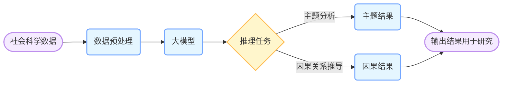

# 大模型在社会科学定性推理中的表现分析

> 关键词：大模型、社会科学、定性推理、表现分析、语言理解

> 摘要：本文聚焦于大模型在社会科学定性推理中的表现。首先介绍了研究的背景、目的、预期读者、文档结构和相关术语。接着阐述了大模型与社会科学定性推理的核心概念及联系，并给出了相应的文本示意图和 Mermaid 流程图。详细讲解了核心算法原理，通过 Python 源代码进行具体阐述，同时介绍了相关的数学模型和公式。在项目实战部分，给出了开发环境搭建、源代码实现及解读。分析了大模型在社会科学定性推理中的实际应用场景，推荐了学习资源、开发工具框架和相关论文著作。最后总结了未来发展趋势与挑战，解答了常见问题并提供了扩展阅读和参考资料。

## 1. 背景介绍 
### 1.1 目的和范围
社会科学研究涉及到对人类社会现象、行为和关系的理解与解释，定性推理是其中重要的研究方法。随着人工智能技术的发展，大模型在自然语言处理等领域取得了显著成果。本研究的目的在于深入分析大模型在社会科学定性推理中的表现，探讨其优势、局限性以及应用前景。研究范围涵盖了常见的大模型如 GPT 系列、BERT 等在社会科学不同领域（如社会学、政治学、经济学等）定性推理任务中的应用情况。

### 1.2 预期读者
本文预期读者包括社会科学研究人员，他们可以了解大模型在其研究领域的潜在应用价值；人工智能研究人员，能够从社会科学的角度审视大模型的性能和改进方向；以及对跨学科研究感兴趣的学者和爱好者，帮助他们理解大模型与社会科学定性推理相结合的相关知识。

### 1.3 文档结构概述
本文首先介绍核心概念，包括大模型和社会科学定性推理的定义、特点以及它们之间的联系。然后阐述核心算法原理和具体操作步骤，同时给出相关的数学模型和公式。接着通过项目实战展示大模型在社会科学定性推理中的实际应用，包括开发环境搭建、源代码实现和代码解读。之后分析大模型在社会科学定性推理中的实际应用场景。再推荐学习资源、开发工具框架和相关论文著作。最后总结未来发展趋势与挑战，解答常见问题并提供扩展阅读和参考资料。

### 1.4 术语表
#### 1.4.1 核心术语定义
- **大模型**：指具有大量参数和强大计算能力的人工智能模型，通常基于深度学习技术，如神经网络，能够处理大规模的数据并学习复杂的模式和规律。
- **社会科学定性推理**：社会科学研究中基于非量化数据（如文本、图像、观察记录等）进行逻辑分析、概念阐释和关系推导的过程，旨在理解社会现象的本质、意义和因果关系。

#### 1.4.2 相关概念解释
- **自然语言处理（NLP）**：人工智能的一个分支，专注于使计算机能够理解、处理和生成人类语言。大模型在社会科学定性推理中的应用很大程度上依赖于自然语言处理技术。
- **定性研究方法**：社会科学中常用的研究方法，包括访谈法、观察法、案例分析法等，用于收集和分析非量化的数据，以揭示社会现象的内在特征和规律。

#### 1.4.3 缩略词列表
- **GPT**：Generative Pretrained Transformer，一种基于 Transformer 架构的生成式预训练模型。
- **BERT**：Bidirectional Encoder Representations from Transformers，一种基于 Transformer 架构的双向编码器表示模型。

## 2. 核心概念与联系 

### 核心概念原理
#### 大模型原理
大模型通常基于深度学习架构，如 Transformer 架构。Transformer 架构由编码器和解码器组成，其中注意力机制是其核心组件。注意力机制允许模型在处理输入序列时，动态地关注序列中的不同部分，从而捕捉到长距离的依赖关系。大模型通过在大规模的文本数据上进行预训练，学习到丰富的语言知识和语义信息。例如，GPT 系列模型是自回归模型，通过预测下一个词来学习语言模式；BERT 模型则是双向编码器，通过掩码语言模型（Masked Language Model，MLM）和下一句预测（Next Sentence Prediction，NSP）任务进行预训练。

#### 社会科学定性推理原理
社会科学定性推理基于社会科学的理论和方法，通过对社会现象的观察、描述和分析，揭示其内在的结构、过程和意义。定性推理的过程通常包括数据收集（如访谈记录、文献资料等）、数据编码（将文本数据转化为概念和类别）、主题分析（识别数据中的主题和模式）和理论构建（基于分析结果形成理论解释）。

### 架构的文本示意图
大模型在社会科学定性推理中的应用架构可以描述为：社会科学数据（如文本资料）作为输入，经过预处理（如清洗、分词等）后输入到大模型中。大模型利用其学习到的语言知识和语义信息，对输入数据进行分析和推理，输出相关的结果（如主题分析、因果关系推导等）。这些结果可以为社会科学研究人员提供决策支持和理论启发。

### Mermaid 流程图


## 3. 核心算法原理 & 具体操作步骤 

### 核心算法原理
以 GPT 模型为例，其核心算法基于 Transformer 解码器架构。在预训练阶段，模型通过最大化给定前文预测下一个词的概率来学习语言模式。设输入序列为 $x = [x_1, x_2,..., x_n]$，模型的目标是最大化条件概率 $P(x_{i+1}|x_1, x_2,..., x_i)$ 对于所有 $i = 0, 1,..., n-1$。在推理阶段，模型根据输入的文本生成后续的文本。

### 具体操作步骤
#### 步骤 1：数据预处理
```python
import re
import nltk
from nltk.corpus import stopwords
from nltk.tokenize import word_tokenize

nltk.download('stopwords')
nltk.download('punkt')

def preprocess_text(text):
    # 转换为小写
    text = text.lower()
    # 去除特殊字符
    text = re.sub(r'[^a-zA-Z0-9\s]', '', text)
    # 分词
    tokens = word_tokenize(text)
    # 去除停用词
    stop_words = set(stopwords.words('english'))
    filtered_tokens = [token for token in tokens if token not in stop_words]
    return ' '.join(filtered_tokens)

# 示例
input_text = "This is an example text! It contains some special characters."
preprocessed_text = preprocess_text(input_text)
print(preprocessed_text)
```
#### 步骤 2：加载大模型
```python
from transformers import GPT2LMHeadModel, GPT2Tokenizer

# 加载预训练的 GPT-2 模型和分词器
model = GPT2LMHeadModel.from_pretrained('gpt2')
tokenizer = GPT2Tokenizer.from_pretrained('gpt2')
```
#### 步骤 3：进行推理
```python
# 对预处理后的文本进行编码
input_ids = tokenizer.encode(preprocessed_text, return_tensors='pt')

# 生成文本
output = model.generate(input_ids, max_length=100, num_beams=5, no_repeat_ngram_size=2, early_stopping=True)

# 解码生成的文本
generated_text = tokenizer.decode(output[0], skip_special_tokens=True)
print(generated_text)
```

## 4. 数学模型和公式 & 详细讲解 & 举例说明 

### 大模型的数学模型
以 GPT 模型为例，其基于自回归语言模型。设 $x = [x_1, x_2,..., x_n]$ 是一个长度为 $n$ 的输入序列，模型的目标是最大化序列的联合概率 $P(x)$。根据链式法则，联合概率可以分解为条件概率的乘积：
$$P(x) = \prod_{i=1}^{n} P(x_i|x_1, x_2,..., x_{i-1})$$
在训练过程中，模型通过最小化负对数似然损失来学习参数：
$$L = -\sum_{i=1}^{n} \log P(x_i|x_1, x_2,..., x_{i-1})$$

### 举例说明
假设输入序列为 $x = [“the”, “dog”, “runs”]$，模型需要预测每个词的条件概率。对于第一个词 “the”，由于没有前文，我们可以假设 $P(“the”|None)$ 是一个初始概率。对于第二个词 “dog”，模型需要计算 $P(“dog”|“the”)$，即给定 “the” 时出现 “dog” 的概率。对于第三个词 “runs”，模型需要计算 $P(“runs”|“the”, “dog”)$。通过训练大量的文本数据，模型可以学习到这些条件概率的分布。

## 5. 项目实战：代码实际案例和详细解释说明 

### 5.1  开发环境搭建
#### 安装 Python
确保你已经安装了 Python 3.6 或更高版本。可以从 Python 官方网站（https://www.python.org/downloads/）下载并安装。

#### 创建虚拟环境
使用 `venv` 模块创建一个虚拟环境：
```bash
python -m venv social_science_env
```
激活虚拟环境：
- 在 Windows 上：
```bash
social_science_env\Scripts\activate
```
- 在 Linux 或 macOS 上：
```bash
source social_science_env/bin/activate
```

#### 安装必要的库
安装 `transformers`、`nltk` 等库：
```bash
pip install transformers nltk
```

### 5.2  源代码详细实现和代码解读
```python
import re
import nltk
from nltk.corpus import stopwords
from nltk.tokenize import word_tokenize
from transformers import GPT2LMHeadModel, GPT2Tokenizer

# 数据预处理函数
def preprocess_text(text):
    # 转换为小写
    text = text.lower()
    # 去除特殊字符
    text = re.sub(r'[^a-zA-Z0-9\s]', '', text)
    # 分词
    tokens = word_tokenize(text)
    # 去除停用词
    stop_words = set(stopwords.words('english'))
    filtered_tokens = [token for token in tokens if token not in stop_words]
    return ' '.join(filtered_tokens)

# 加载预训练的 GPT-2 模型和分词器
model = GPT2LMHeadModel.from_pretrained('gpt2')
tokenizer = GPT2Tokenizer.from_pretrained('gpt2')

# 示例社会科学文本
social_science_text = "In sociology, social inequality refers to the unequal distribution of resources and opportunities among different social groups."

# 数据预处理
preprocessed_text = preprocess_text(social_science_text)

# 对预处理后的文本进行编码
input_ids = tokenizer.encode(preprocessed_text, return_tensors='pt')

# 生成文本
output = model.generate(input_ids, max_length=150, num_beams=5, no_repeat_ngram_size=2, early_stopping=True)

# 解码生成的文本
generated_text = tokenizer.decode(output[0], skip_special_tokens=True)

print("原始文本:", social_science_text)
print("预处理后的文本:", preprocessed_text)
print("生成的文本:", generated_text)
```
### 代码解读与分析
- **数据预处理**：`preprocess_text` 函数将输入文本转换为小写，去除特殊字符，进行分词并去除停用词。这有助于减少噪声，提高模型的输入质量。
- **模型加载**：使用 `transformers` 库加载预训练的 GPT-2 模型和分词器。
- **文本编码**：使用分词器将预处理后的文本编码为模型可以接受的输入格式。
- **文本生成**：调用 `model.generate` 方法生成文本，设置了最大长度、束搜索的束数、避免重复的 n-gram 大小等参数。
- **文本解码**：使用分词器将生成的编码文本解码为可读的文本。

## 6. 实际应用场景 
### 社会学研究
在社会学研究中，大模型可以用于分析社会现象的文本数据，如社交媒体上的用户言论、新闻报道等。通过主题分析，大模型可以帮助研究人员识别社会热点问题和公众关注的焦点。例如，分析社交媒体上关于种族平等的讨论，可以了解不同群体的观点和态度，以及社会舆论的动态变化。

### 政治学研究
在政治学研究中，大模型可以用于分析政治演讲、政策文件等文本，推导政治人物的立场和政策倾向。通过因果关系分析，大模型可以帮助研究人员理解政策的实施效果和影响因素。例如，分析政府发布的经济刺激政策文件，预测政策对经济增长、就业等方面的影响。

### 经济学研究
在经济学研究中，大模型可以用于分析市场调研报告、企业财务报表等文本，评估企业的竞争力和市场趋势。通过情感分析，大模型可以了解消费者对产品和服务的满意度，为企业的市场营销策略提供参考。例如，分析消费者在电商平台上的商品评价，了解消费者对不同品牌和产品的喜好和不满。

## 7. 工具和资源推荐
### 7.1 学习资源推荐
#### 7.1.1 书籍推荐
- 《深度学习》（Deep Learning）：由 Ian Goodfellow、Yoshua Bengio 和 Aaron Courville 编写，是深度学习领域的经典教材，介绍了深度学习的基本原理和算法。
- 《自然语言处理入门》（Natural Language Processing with Python）：由 Steven Bird、Ewan Klein 和 Edward Loper 编写，提供了使用 Python 进行自然语言处理的详细教程。

#### 7.1.2 在线课程
- Coursera 上的 “Natural Language Processing Specialization”：由斯坦福大学的教授授课，涵盖了自然语言处理的各个方面，包括大模型的应用。
- edX 上的 “Deep Learning Specialization”：由 Andrew Ng 教授授课，介绍了深度学习的基础和应用，包括大模型的训练和优化。

#### 7.1.3 技术博客和网站
- Hugging Face Blog：提供了关于大模型和自然语言处理的最新研究成果和技术应用。
- Towards Data Science：一个数据科学和人工智能领域的博客平台，有很多关于大模型在不同领域应用的文章。

### 7.2 开发工具框架推荐
#### 7.2.1 IDE和编辑器
- PyCharm：一个功能强大的 Python 集成开发环境，提供了代码编辑、调试、版本控制等功能。
- Jupyter Notebook：一个交互式的开发环境，适合进行数据分析和模型实验。

#### 7.2.2 调试和性能分析工具
- TensorBoard：一个可视化工具，用于监控和分析深度学习模型的训练过程和性能。
- PyTorch Profiler：PyTorch 提供的性能分析工具，可以帮助开发者找出代码中的性能瓶颈。

#### 7.2.3 相关框架和库
- Transformers：由 Hugging Face 开发的一个库，提供了多种预训练的大模型和相关工具，方便进行自然语言处理任务。
- NLTK：一个自然语言处理工具包，提供了丰富的文本处理功能，如分词、词性标注、命名实体识别等。

### 7.3 相关论文著作推荐
#### 7.3.1 经典论文
- “Attention Is All You Need”：介绍了 Transformer 架构，是大模型发展的重要里程碑。
- “BERT: Pre-training of Deep Bidirectional Transformers for Language Understanding”：提出了 BERT 模型，开创了双向编码器预训练的先河。

#### 7.3.2 最新研究成果
- 关注 ACL（Association for Computational Linguistics）、EMNLP（Conference on Empirical Methods in Natural Language Processing）等会议的最新论文，了解大模型在自然语言处理领域的最新研究进展。

#### 7.3.3 应用案例分析
- 一些学术期刊和研究报告中会有大模型在社会科学领域的应用案例分析，可以从中了解实际应用中的经验和挑战。

## 8. 总结：未来发展趋势与挑战
### 未来发展趋势
- **跨学科融合**：大模型与社会科学的结合将更加深入，不仅在数据处理和分析方面提供支持，还将与社会科学的理论和方法进行深度融合，推动社会科学研究的创新。
- **个性化服务**：根据不同社会科学研究领域和研究问题的需求，开发个性化的大模型，提高模型在特定任务中的性能和效果。
- **可解释性增强**：随着对大模型可解释性的需求增加，未来的研究将致力于开发可解释的大模型，使社会科学研究人员能够更好地理解模型的决策过程和结果。

### 挑战
- **数据质量和隐私问题**：社会科学数据往往具有多样性和复杂性，数据质量参差不齐。同时，数据隐私和安全问题也是需要解决的重要挑战。
- **模型偏差和公平性**：大模型的训练数据可能存在偏差，导致模型在推理过程中产生不公平的结果。如何减少模型偏差，保证公平性是一个亟待解决的问题。
- **计算资源和成本**：大模型的训练和推理需要大量的计算资源和时间，成本较高。如何降低计算成本，提高效率是未来发展的关键。

## 9. 附录：常见问题与解答
### 问题 1：大模型在社会科学定性推理中的准确性如何保证？
解答：可以通过以下方法保证准确性：选择合适的大模型，并进行微调；使用高质量的标注数据进行训练和评估；结合人工验证和审核，对模型的输出结果进行修正。

### 问题 2：大模型能否完全替代社会科学研究人员的定性推理工作？
解答：不能。大模型可以提供数据处理和分析的支持，但社会科学研究中的定性推理需要人类的专业知识、判断力和创造力。大模型可以作为辅助工具，帮助研究人员提高工作效率和准确性。

### 问题 3：如何选择适合社会科学定性推理的大模型？
解答：需要考虑模型的性能、适用性、可解释性等因素。可以参考相关的研究和评测报告，选择在自然语言处理任务中表现较好的模型，并根据具体的研究问题进行微调。

## 10. 扩展阅读 & 参考资料
### 扩展阅读
- 《社会科学研究方法》（Research Methods in the Social Sciences）：提供了社会科学研究的基本方法和理论。
- 《人工智能与社会科学》（Artificial Intelligence and Social Science）：探讨了人工智能技术在社会科学领域的应用和影响。

### 参考资料
- Goodfellow, I., Bengio, Y., & Courville, A. (2016). Deep Learning. MIT Press.
- Bird, S., Klein, E., & Loper, E. (2009). Natural Language Processing with Python. O'Reilly Media.
- Vaswani, A., Shazeer, N., Parmar, N., Uszkoreit, J., Jones, L., Gomez, A. N.,... & Polosukhin, I. (2017). Attention is all you need. In Advances in neural information processing systems (pp. 5998-6008).
- Devlin, J., Chang, M. W., Lee, K., & Toutanova, K. (2018). BERT: Pre-training of Deep Bidirectional Transformers for Language Understanding. arXiv preprint arXiv:1810.04805.

作者：AI天才研究院/AI Genius Institute & 禅与计算机程序设计艺术 /Zen And The Art of Computer Programming