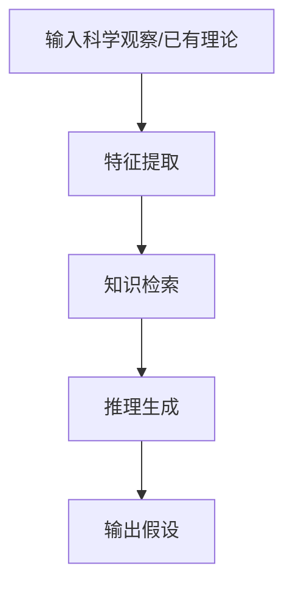

# 大模型在科学理论构建推理中的假设生成作用分析研究

> 关键词：大模型、科学理论构建、推理、假设生成、人工智能

> 摘要：本文聚焦于大模型在科学理论构建推理中假设生成的作用。首先介绍了研究的背景和相关概念，阐述了大模型与科学理论构建的核心联系。接着深入探讨了大模型用于假设生成的核心算法原理，并给出了具体操作步骤和Python代码示例。通过数学模型和公式对其进行详细讲解与举例说明。在项目实战部分，展示了代码实际案例并进行详细解释。分析了大模型在科学领域的实际应用场景，推荐了相关的学习资源、开发工具框架以及论文著作。最后总结了大模型在科学理论构建推理中假设生成的未来发展趋势与挑战，并给出常见问题与解答以及扩展阅读和参考资料。旨在全面深入地剖析大模型在科学理论构建中假设生成的重要作用，为相关研究和实践提供有价值的参考。

## 1. 背景介绍 
### 1.1 目的和范围
科学理论的构建是一个复杂且充满创造性的过程，其中假设的生成是关键环节。传统的假设生成主要依赖于科学家的经验、直觉和专业知识，然而这种方式存在一定的局限性，如效率较低、受个人认知边界限制等。随着人工智能技术的发展，大模型逐渐展现出强大的语言理解、知识整合和推理能力，为科学理论构建中的假设生成提供了新的思路和方法。

本研究的目的在于深入分析大模型在科学理论构建推理中假设生成的作用，探讨其优势、局限性以及应用前景。研究范围涵盖了多个科学领域，包括物理学、生物学、化学等，旨在全面评估大模型在不同科学场景下的假设生成能力。

### 1.2 预期读者
本文预期读者包括从事人工智能、科学哲学、科学研究方法等领域的研究人员和学者，他们希望深入了解大模型在科学研究中的应用；也包括对科学理论构建过程感兴趣的科学爱好者，他们想了解大模型如何辅助科学假设的生成；此外，还包括相关领域的工程师和开发者，他们可以从本文中获取关于大模型技术实现和应用的思路。

### 1.3 文档结构概述
本文将按照以下结构展开：首先介绍相关背景知识和核心概念，明确研究的基础和关键术语；接着阐述大模型与科学理论构建的核心联系，通过文本示意图和Mermaid流程图展示其内在逻辑；然后详细讲解大模型用于假设生成的核心算法原理，给出具体操作步骤和Python代码示例；利用数学模型和公式对其进行更深入的分析和举例说明；通过项目实战展示代码实际案例并进行详细解读；分析大模型在实际科学场景中的应用；推荐相关的学习资源、开发工具框架和论文著作；最后总结大模型在科学理论构建推理中假设生成的未来发展趋势与挑战，给出常见问题与解答以及扩展阅读和参考资料。

### 1.4 术语表
#### 1.4.1 核心术语定义
- **大模型**：指具有大量参数和强大计算能力的人工智能模型，如GPT系列、BERT等，通常在大规模数据集上进行预训练，能够学习到丰富的语言知识和模式。
- **科学理论构建**：是科学家通过观察、实验、推理等方法，对自然现象进行解释和预测，形成系统的科学知识体系的过程。
- **假设生成**：在科学研究中，根据已有的观察和知识，提出关于未知现象或规律的初步推测，为进一步的研究和验证提供方向。
- **推理**：从已知的前提条件出发，通过逻辑规则或其他方法得出结论的思维过程。

#### 1.4.2 相关概念解释
- **自然语言处理（NLP）**：是人工智能的一个重要领域，主要研究如何让计算机理解、处理和生成人类语言。大模型在自然语言处理中发挥着重要作用，能够完成文本分类、情感分析、机器翻译等多种任务。
- **知识图谱**：是一种用图结构来表示知识和语义关系的技术，将实体及其之间的关系以图形的方式进行存储和展示。大模型可以与知识图谱结合，更好地利用结构化知识进行假设生成。

#### 1.4.3 缩略词列表
- **NLP**：Natural Language Processing（自然语言处理）
- **GPT**：Generative Pretrained Transformer（生成式预训练变换器）
- **BERT**：Bidirectional Encoder Representations from Transformers（基于变换器的双向编码器表示）

## 2. 核心概念与联系 

### 核心概念原理
大模型在科学理论构建推理中假设生成的作用基于其强大的语言理解和生成能力。大模型通过在大规模文本数据上进行预训练，学习到了丰富的语言知识和语义信息，能够理解科学文献中的各种概念、关系和逻辑。当给定一些科学观察或已有理论作为输入时，大模型可以基于其所学知识，生成与之相关的假设。

例如，在物理学中，如果输入关于某种物理现象的观察描述，大模型可以结合其对物理学知识的理解，生成关于该现象背后可能的物理机制的假设。这一过程涉及到对输入信息的语义分析、知识检索和推理，大模型需要从其庞大的知识储备中提取相关信息，并进行合理的组合和推导。

### 架构的文本示意图
大模型在科学理论构建推理中假设生成的架构可以描述如下：

输入层：接收科学观察数据、已有理论等信息，这些信息可以是自然语言文本、实验数据等。

特征提取层：大模型对输入信息进行处理，提取其中的语义特征和关键信息。这一步骤利用了大模型的语言理解能力，将输入信息转化为计算机能够处理的向量表示。

知识检索层：基于提取的特征，大模型在其知识储备中检索相关的科学知识和信息。这些知识可以来自于预训练数据，也可以结合外部知识图谱等资源。

推理生成层：根据检索到的知识和输入信息，大模型进行推理和假设生成。这一过程涉及到逻辑推理、类比推理等多种推理方式，大模型通过对已有知识的组合和扩展，生成新的假设。

输出层：将生成的假设以自然语言文本或其他合适的形式输出。

### Mermaid流程图


## 3. 核心算法原理 & 具体操作步骤 

### 核心算法原理
大模型通常基于Transformer架构，如GPT系列和BERT。Transformer架构的核心是注意力机制，它能够动态地捕捉输入序列中不同位置之间的依赖关系。

以GPT为例，其采用自回归的方式进行文本生成。在训练过程中，GPT通过预测下一个词的概率来学习语言模式。给定一个输入序列 $x_1, x_2, \cdots, x_n$，GPT的目标是预测下一个词 $x_{n+1}$ 的概率 $P(x_{n+1}|x_1, x_2, \cdots, x_n)$。

在假设生成过程中，我们可以将科学观察和已有理论作为输入序列，让大模型预测可能的假设文本。大模型会根据其所学的语言模式和知识，生成最有可能的后续文本，即假设。

### 具体操作步骤
1. **数据预处理**：将科学观察数据和已有理论转换为大模型能够处理的格式，通常是文本形式。对文本进行清洗、分词等预处理操作。
2. **模型加载**：选择合适的大模型，如GPT-3等，并加载预训练的模型参数。
3. **输入构建**：将预处理后的文本作为输入，构建大模型的输入序列。
4. **假设生成**：调用大模型的生成函数，根据输入序列生成假设文本。可以设置一些生成参数，如生成的最大长度、温度等，以控制生成结果。
5. **后处理**：对生成的假设文本进行后处理，如去除不必要的字符、检查语法等。

### Python源代码示例
```python
import openai

# 设置OpenAI API密钥
openai.api_key = "your_api_key"

def generate_hypothesis(input_text):
    try:
        response = openai.Completion.create(
            engine="text-davinci-003",
            prompt=input_text,
            max_tokens=100,
            temperature=0.7
        )
        hypothesis = response.choices[0].text.strip()
        return hypothesis
    except Exception as e:
        print(f"Error generating hypothesis: {e}")
        return None

# 示例输入
input_text = "在某实验中，发现物体的运动速度在特定条件下突然增加。请提出可能的假设。"
hypothesis = generate_hypothesis(input_text)
if hypothesis:
    print(f"生成的假设: {hypothesis}")
```

## 4. 数学模型和公式 & 详细讲解 & 举例说明 

### 数学模型和公式
在大模型的训练和假设生成过程中，涉及到多个数学模型和公式。以GPT为例，其基于Transformer架构，Transformer的核心是多头注意力机制。

多头注意力机制的计算公式如下：

$$\text{Attention}(Q, K, V) = \text{softmax}(\frac{QK^T}{\sqrt{d_k}})V$$

其中，$Q$ 是查询矩阵，$K$ 是键矩阵，$V$ 是值矩阵，$d_k$ 是键向量的维度。

多头注意力机制将多个单头注意力的结果拼接起来，然后通过一个线性变换得到最终的输出：

$$\text{MultiHead}(Q, K, V) = \text{Concat}(\text{head}_1, \cdots, \text{head}_h)W^O$$

其中，$\text{head}_i = \text{Attention}(QW_i^Q, KW_i^K, VW_i^V)$，$W_i^Q$、$W_i^K$、$W_i^V$ 和 $W^O$ 是可学习的参数矩阵。

在假设生成过程中，大模型通过最大化似然函数来学习语言模式。给定一个训练数据集 $\{x^{(1)}, x^{(2)}, \cdots, x^{(N)}\}$，其中 $x^{(i)}$ 是一个文本序列，GPT的目标是最大化以下似然函数：

$$L = \sum_{i=1}^{N} \log P(x^{(i)})$$

### 详细讲解
多头注意力机制的作用是让模型能够关注输入序列的不同部分，从而捕捉到不同位置之间的依赖关系。通过将查询矩阵 $Q$ 与键矩阵 $K$ 进行点积运算，可以得到每个位置对其他位置的注意力分数。这些分数经过softmax函数归一化后，用于加权求和值矩阵 $V$，得到最终的注意力输出。

多头注意力机制通过多个单头注意力的组合，让模型能够从不同的表示子空间中学习到更丰富的信息。

在训练过程中，最大化似然函数的目的是让模型学习到输入序列的概率分布，从而能够生成与训练数据相似的文本。在假设生成时，模型根据输入序列的概率分布，预测下一个最有可能的词，逐步生成假设文本。

### 举例说明
假设我们有一个简单的输入序列 "The cat is"，大模型在生成下一个词时，会根据其学习到的语言模式和概率分布来进行预测。如果在训练数据中，"The cat is" 后面经常跟着 "sleeping"，那么模型就有较高的概率生成 "sleeping" 作为下一个词。

在科学假设生成的场景中，如果输入是 "在某化学实验中，溶液颜色突然变深"，大模型会结合其对化学知识的理解和语言模式，生成如 "可能是溶液中发生了氧化反应，产生了深色物质" 这样的假设。

## 5. 项目实战：代码实际案例和详细解释说明 

### 5.1  开发环境搭建
1. **安装Python**：确保你的系统中安装了Python 3.x版本。可以从Python官方网站（https://www.python.org/downloads/） 下载并安装。
2. **安装必要的库**：在本项目中，我们使用OpenAI的Python库。可以使用以下命令进行安装：
```sh
pip install openai
```
3. **获取OpenAI API密钥**：访问OpenAI官方网站（https://platform.openai.com/） 注册并获取API密钥。

### 5.2  源代码详细实现和代码解读
```python
import openai

# 设置OpenAI API密钥
openai.api_key = "your_api_key"

def generate_hypothesis(input_text):
    try:
        # 调用OpenAI的Completion API进行文本生成
        response = openai.Completion.create(
            # 选择使用的模型引擎
            engine="text-davinci-003",
            # 输入的文本提示
            prompt=input_text,
            # 生成的最大词数
            max_tokens=100,
            # 温度参数，控制生成的随机性
            temperature=0.7
        )
        # 提取生成的文本并去除首尾空格
        hypothesis = response.choices[0].text.strip()
        return hypothesis
    except Exception as e:
        # 处理异常情况
        print(f"Error generating hypothesis: {e}")
        return None

# 示例输入
input_text = "在某生物实验中，发现细胞的生长速度在特定条件下加快。请提出可能的假设。"
hypothesis = generate_hypothesis(input_text)
if hypothesis:
    print(f"生成的假设: {hypothesis}")
```

### 代码解读与分析
1. **导入库**：导入 `openai` 库，用于调用OpenAI的API。
2. **设置API密钥**：将你的OpenAI API密钥赋值给 `openai.api_key`，以便进行身份验证。
3. **定义 `generate_hypothesis` 函数**：该函数接受一个输入文本作为参数，用于生成假设。
    - `openai.Completion.create`：调用OpenAI的Completion API进行文本生成。
        - `engine`：指定使用的模型引擎，这里选择 `text-davinci-003`。
        - `prompt`：输入的文本提示，即科学观察或已有理论。
        - `max_tokens`：生成的最大词数，控制生成文本的长度。
        - `temperature`：温度参数，控制生成的随机性。值越大，生成的结果越随机；值越小，生成的结果越确定。
    - `response.choices[0].text.strip()`：提取生成的文本并去除首尾空格。
4. **异常处理**：使用 `try-except` 块捕获可能的异常，并打印错误信息。
5. **示例输入和输出**：定义一个示例输入文本，调用 `generate_hypothesis` 函数生成假设，并打印生成的假设。

## 6. 实际应用场景 
### 物理学
在物理学研究中，大模型可以根据实验数据和已有理论生成关于新物理现象的假设。例如，在粒子物理学中，当观测到新的粒子行为时，大模型可以结合量子场论等理论知识，生成关于这些粒子相互作用机制的假设，为进一步的理论研究和实验验证提供方向。

### 生物学
在生物学领域，大模型可以辅助生物学家生成关于基因功能、生物进化等方面的假设。例如，当发现某个基因在特定疾病中表达异常时，大模型可以结合生物学知识图谱和大量的研究文献，生成关于该基因在疾病发生发展过程中可能作用机制的假设，有助于深入研究疾病的发病机制和开发新的治疗方法。

### 化学
在化学研究中，大模型可以根据化学反应的实验结果和化学原理，生成关于反应机理的假设。例如，在有机合成化学中，当观察到某种新的反应产物时，大模型可以结合有机化学知识和反应动力学原理，生成关于反应中间体和反应路径的假设，为优化反应条件和设计新的合成路线提供参考。

### 天文学
在天文学中，大模型可以根据天文观测数据和天体物理学理论，生成关于天体演化、宇宙结构等方面的假设。例如，当观测到新的星系或天体现象时，大模型可以结合广义相对论和宇宙学模型，生成关于这些天体形成和演化过程的假设，推动天文学的发展。

## 7. 工具和资源推荐
### 7.1 学习资源推荐
#### 7.1.1 书籍推荐
- 《深度学习》（Deep Learning）：由Ian Goodfellow、Yoshua Bengio和Aaron Courville合著，是深度学习领域的经典教材，全面介绍了深度学习的基本概念、算法和应用。
- 《自然语言处理入门》（Natural Language Processing in Action）：由Hobson Lane、Cole Howard和 Hannes Hapke合著，适合初学者学习自然语言处理的基本技术和方法。
- 《人工智能：一种现代的方法》（Artificial Intelligence: A Modern Approach）：由Stuart Russell和Peter Norvig合著，是人工智能领域的权威教材，涵盖了人工智能的各个方面。

#### 7.1.2 在线课程
- Coursera上的“深度学习专项课程”（Deep Learning Specialization）：由Andrew Ng教授授课，系统地介绍了深度学习的理论和实践。
- edX上的“自然语言处理基础”（Foundations of Natural Language Processing）：由哥伦比亚大学的教授授课，深入讲解自然语言处理的核心技术。
- 哔哩哔哩上的相关人工智能和自然语言处理教程：有许多优质的免费教程，适合不同层次的学习者。

#### 7.1.3 技术博客和网站
- OpenAI官方博客（https://openai.com/blog/）：提供关于大模型和人工智能的最新研究成果和应用案例。
- Hugging Face博客（https://huggingface.co/blog）：专注于自然语言处理和大模型技术，有许多实用的教程和技术文章。
- arXiv（https://arxiv.org/）：一个预印本服务器，提供大量的学术论文，包括人工智能、