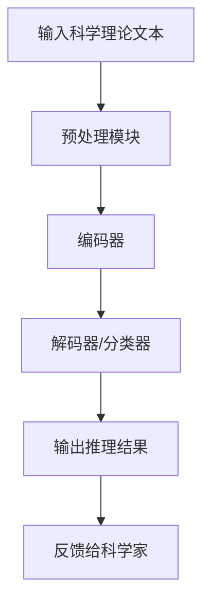

# 大模型在科学理论验证推理过程中的辅助角色

> 关键词：大模型、科学理论验证推理、辅助角色、人工智能、自然语言处理

> 摘要：本文深入探讨了大模型在科学理论验证推理过程中所扮演的辅助角色。首先介绍了相关背景，包括目的范围、预期读者等。接着阐述了核心概念与联系，详细讲解了核心算法原理及具体操作步骤，通过数学模型和公式进行理论支持，并给出实际例子。然后通过项目实战展示了大模型在科学理论验证推理中的代码实现与分析。进一步探讨了其实际应用场景，推荐了学习资源、开发工具框架以及相关论文著作。最后总结了未来发展趋势与挑战，解答常见问题，并提供扩展阅读与参考资料。旨在全面剖析大模型在科学研究中的辅助作用，为相关领域的研究者和开发者提供有价值的参考。

## 1. 背景介绍 
### 1.1 目的和范围
随着人工智能技术的飞速发展，大模型如GPT系列、BERT等在自然语言处理、知识问答等领域取得了显著的成果。本研究的目的在于探索大模型在科学理论验证推理过程中所能发挥的辅助作用，具体范围涵盖了数学、物理、化学等多个科学领域的理论验证推理场景，分析大模型如何通过数据处理、知识整合和逻辑推导等方式为科学研究提供支持。

### 1.2 预期读者
本文预期读者包括科研工作者、人工智能开发者、科学理论研究爱好者等。对于科研工作者，希望能为他们在科学理论验证推理过程中提供新的思路和工具；对于人工智能开发者，可借鉴其中的算法和实现方式进行相关应用的开发；对于科学理论研究爱好者，有助于他们了解大模型在科学研究中的应用价值。

### 1.3 文档结构概述
本文首先介绍背景信息，让读者了解研究的目的和适用对象。接着阐述核心概念与联系，使读者对大模型和科学理论验证推理有清晰的认识。然后详细讲解核心算法原理和具体操作步骤，并通过数学模型和公式进行理论支撑。项目实战部分展示了如何在实际中运用大模型进行科学理论验证推理。之后探讨实际应用场景，为读者提供应用思路。推荐学习资源、开发工具框架和相关论文著作，方便读者进一步深入学习。最后总结未来发展趋势与挑战，解答常见问题，并提供扩展阅读与参考资料。

### 1.4 术语表
#### 1.4.1 核心术语定义
- **大模型**：指具有大量参数和强大计算能力的人工智能模型，通常在大规模数据集上进行训练，能够处理复杂的自然语言任务和知识推理。
- **科学理论验证推理**：对科学领域中已提出的理论进行验证和推理的过程，通过逻辑分析、实验数据等手段来判断理论的正确性和可靠性。
- **自然语言处理（NLP）**：人工智能的一个分支，研究如何让计算机理解、处理和生成人类语言。

#### 1.4.2 相关概念解释
- **预训练模型**：大模型通常采用预训练的方式，在大规模无监督数据上进行训练，学习到通用的语言知识和特征，然后可以在特定任务上进行微调。
- **知识图谱**：一种以图的形式表示知识的方法，将实体和实体之间的关系进行可视化和结构化，有助于大模型进行知识推理。

#### 1.4.3 缩略词列表
- **NLP**：Natural Language Processing（自然语言处理）
- **GPT**：Generative Pretrained Transformer（生成式预训练变换器）
- **BERT**：Bidirectional Encoder Representations from Transformers（基于变换器的双向编码器表示）

## 2. 核心概念与联系 
### 核心概念原理
大模型的核心原理基于深度学习中的神经网络架构，如Transformer架构。Transformer架构通过多头注意力机制能够捕捉输入序列中不同位置之间的依赖关系，从而更好地理解和处理自然语言。在预训练阶段，大模型在大规模的文本数据上进行无监督学习，学习到语言的语法、语义和知识表示。在科学理论验证推理中，大模型可以将输入的科学理论文本进行编码，提取其中的关键信息和逻辑关系，然后根据已学习到的知识进行推理和判断。

科学理论验证推理是一个基于逻辑和证据的过程。科学家根据已有的科学知识和实验数据提出理论假设，然后通过逻辑推导、实验验证等方式来检验假设的正确性。大模型在这个过程中可以作为一个辅助工具，帮助科学家进行知识检索、逻辑推理和数据处理。

### 架构的文本示意图
大模型在科学理论验证推理中的架构可以描述为：输入科学理论文本，经过大模型的预处理模块，包括分词、词性标注等操作，将文本转换为适合模型处理的格式。然后输入到模型的编码器中，编码器利用Transformer架构对文本进行编码，提取特征表示。接着，根据具体的验证推理任务，可能会有一个解码器或分类器，对编码后的特征进行进一步处理，输出推理结果。推理结果可以反馈给科学家，帮助他们进行科学理论的验证和改进。

### Mermaid流程图


## 3. 核心算法原理 & 具体操作步骤 
### 核心算法原理
以GPT模型为例，其核心算法基于Transformer的解码器架构。Transformer解码器由多个相同的层堆叠而成，每层包含多头自注意力机制和前馈神经网络。多头自注意力机制允许模型在不同的表示子空间中关注输入序列的不同部分，从而捕捉更丰富的信息。

前馈神经网络则对自注意力机制的输出进行非线性变换，增强模型的表达能力。在训练过程中，GPT模型采用自监督学习的方式，通过预测下一个词的概率来学习语言的模式和规律。

### Python源代码详细阐述
```python
import torch
import torch.nn as nn
import torch.nn.functional as F

# 定义多头自注意力机制
class MultiHeadAttention(nn.Module):
    def __init__(self, embed_size, num_heads):
        super(MultiHeadAttention, self).__init__()
        self.embed_size = embed_size
        self.num_heads = num_heads
        self.head_dim = embed_size // num_heads

        assert (
            self.head_dim * num_heads == embed_size
        ), "Embedding size needs to be divisible by number of heads"

        self.values = nn.Linear(self.head_dim, self.head_dim, bias=False)
        self.keys = nn.Linear(self.head_dim, self.head_dim, bias=False)
        self.queries = nn.Linear(self.head_dim, self.head_dim, bias=False)
        self.fc_out = nn.Linear(num_heads * self.head_dim, embed_size)

    def forward(self, values, keys, query, mask):
        N = query.shape[0]
        value_len, key_len, query_len = values.shape[1], keys.shape[1], query.shape[1]

        # 分割嵌入维度为多个头
        values = values.reshape(N, value_len, self.num_heads, self.head_dim)
        keys = keys.reshape(N, key_len, self.num_heads, self.head_dim)
        queries = query.reshape(N, query_len, self.num_heads, self.head_dim)

        values = self.values(values)
        keys = self.keys(keys)
        queries = self.queries(queries)

        # 计算注意力分数
        energy = torch.einsum("nqhd,nkhd->nhqk", [queries, keys])
        if mask is not None:
            energy = energy.masked_fill(mask == 0, float("-1e20"))

        attention = torch.softmax(energy / (self.embed_size ** (1 / 2)), dim=3)

        out = torch.einsum("nhql,nlhd->nqhd", [attention, values]).reshape(
            N, query_len, self.num_heads * self.head_dim
        )

        out = self.fc_out(out)
        return out

# 定义前馈神经网络
class PositionwiseFeedForward(nn.Module):
    def __init__(self, embed_size, hidden_size):
        super(PositionwiseFeedForward, self).__init__()
        self.fc1 = nn.Linear(embed_size, hidden_size)
        self.fc2 = nn.Linear(hidden_size, embed_size)
        self.relu = nn.ReLU()

    def forward(self, x):
        out = self.fc1(x)
        out = self.relu(out)
        out = self.fc2(out)
        return out

# 定义解码器层
class DecoderLayer(nn.Module):
    def __init__(self, embed_size, num_heads, hidden_size, dropout):
        super(DecoderLayer, self).__init__()
        self.norm1 = nn.LayerNorm(embed_size)
        self.norm2 = nn.LayerNorm(embed_size)
        self.attention = MultiHeadAttention(embed_size, num_heads)
        self.feed_forward = PositionwiseFeedForward(embed_size, hidden_size)
        self.dropout = nn.Dropout(dropout)

    def forward(self, x, mask):
        attn_output = self.attention(x, x, x, mask)
        x = self.norm1(x + self.dropout(attn_output))
        ff_output = self.feed_forward(x)
        x = self.norm2(x + self.dropout(ff_output))
        return x

# 定义GPT模型
class GPT(nn.Module):
    def __init__(self, vocab_size, embed_size, num_layers, num_heads, hidden_size, dropout):
        super(GPT, self).__init__()
        self.embedding = nn.Embedding(vocab_size, embed_size)
        self.layers = nn.ModuleList(
            [
                DecoderLayer(embed_size, num_heads, hidden_size, dropout)
                for _ in range(num_layers)
            ]
        )
        self.fc_out = nn.Linear(embed_size, vocab_size)
        self.dropout = nn.Dropout(dropout)

    def forward(self, x, mask):
        x = self.embedding(x)
        x = self.dropout(x)
        for layer in self.layers:
            x = layer(x, mask)
        out = self.fc_out(x)
        return out

# 示例使用
vocab_size = 10000
embed_size = 256
num_layers = 6
num_heads = 8
hidden_size = 1024
dropout = 0.1

model = GPT(vocab_size, embed_size, num_layers, num_heads, hidden_size, dropout)
input_seq = torch.randint(0, vocab_size, (1, 10))
mask = torch.ones((1, 10, 10))
output = model(input_seq, mask)
print(output.shape)
```
### 具体操作步骤
1. **数据准备**：收集科学理论相关的文本数据，并进行清洗和预处理，包括分词、去除停用词等操作。
2. **模型训练**：使用准备好的数据对大模型进行训练，可以采用预训练模型进行微调的方式，以提高训练效率和模型性能。
3. **输入处理**：将待验证推理的科学理论文本输入到训练好的模型中，进行编码和推理。
4. **结果分析**：对模型输出的推理结果进行分析和评估，判断其是否符合科学逻辑和实际情况。

## 4. 数学模型和公式 & 详细讲解 & 举例说明 
### 数学模型和公式
#### 多头自注意力机制
多头自注意力机制的计算过程可以用以下公式表示：

$$
\text{MultiHead}(Q, K, V) = \text{Concat}(\text{head}_1, \cdots, \text{head}_h)W^O
$$

其中，$h$ 是头的数量，$\text{head}_i$ 定义为：

$$
\text{head}_i = \text{Attention}(QW_i^Q, KW_i^K, VW_i^V)
$$

$$
\text{Attention}(Q, K, V) = \text{softmax}\left(\frac{QK^T}{\sqrt{d_k}}\right)V
$$

这里，$Q$ 是查询矩阵，$K$ 是键矩阵，$V$ 是值矩阵，$W_i^Q$、$W_i^K$ 和 $W_i^V$ 是可学习的权重矩阵，$d_k$ 是键的维度。

#### 前馈神经网络
前馈神经网络的计算过程可以表示为：

$$
FFN(x) = \max(0, xW_1 + b_1)W_2 + b_2
$$

其中，$W_1$ 和 $W_2$ 是权重矩阵，$b_1$ 和 $b_2$ 是偏置向量。

### 详细讲解
多头自注意力机制通过将输入的查询、键和值矩阵分别投影到多个低维子空间中，在每个子空间中计算注意力分数，然后将结果拼接起来并进行线性变换。这样可以让模型在不同的表示子空间中关注输入序列的不同部分，从而捕捉更丰富的信息。

前馈神经网络则对自注意力机制的输出进行非线性变换，增强模型的表达能力。通过使用ReLU激活函数，可以引入非线性特性，使得模型能够学习到更复杂的模式和规律。

### 举例说明
假设我们有一个输入序列 $x = [x_1, x_2, x_3]$，每个元素的嵌入维度为 $d = 128$。我们使用 $h = 8$ 个头的多头自注意力机制，每个头的维度为 $d_k = 16$。

首先，我们将查询、键和值矩阵分别投影到 8 个子空间中，得到 $QW_i^Q$、$KW_i^K$ 和 $VW_i^V$。然后，在每个子空间中计算注意力分数，即 $\text{softmax}\left(\frac{QK^T}{\sqrt{d_k}}\right)$。最后，将注意力分数与值矩阵相乘，得到每个头的输出 $\text{head}_i$。将 8 个头的输出拼接起来，并进行线性变换，得到多头自注意力机制的最终输出。

对于前馈神经网络，假设输入 $x$ 的维度为 128，$W_1$ 的形状为 $(128, 512)$，$W_2$ 的形状为 $(512, 128)$。首先，将输入 $x$ 与 $W_1$ 相乘并加上偏置 $b_1$，然后通过ReLU激活函数进行非线性变换。最后，将变换后的结果与 $W_2$ 相乘并加上偏置 $b_2$，得到前馈神经网络的输出。

## 5. 项目实战：代码实际案例和详细解释说明 
### 5.1  开发环境搭建
#### 硬件环境
- **CPU**：建议使用多核处理器，如Intel Core i7及以上。
- **GPU**：如果进行大规模训练，建议使用NVIDIA GPU，如NVIDIA GeForce RTX 30系列或更高版本。
- **内存**：至少16GB，建议32GB或以上。

#### 软件环境
- **操作系统**：推荐使用Linux系统，如Ubuntu 18.04或更高版本。
- **Python**：建议使用Python 3.7及以上版本。
- **深度学习框架**：使用PyTorch，可通过以下命令安装：
```bash
pip install torch torchvision
```

### 5.2  源代码详细实现和代码解读
以下是一个使用大模型进行科学理论验证推理的简单示例：
```python
import torch
from transformers import GPT2LMHeadModel, GPT2Tokenizer

# 加载预训练模型和分词器
tokenizer = GPT2Tokenizer.from_pretrained('gpt2')
model = GPT2LMHeadModel.from_pretrained('gpt2')

# 输入科学理论文本
input_text = "牛顿第二定律表明，物体的加速度与作用力成正比，与物体的质量成反比。如果一个物体受到的作用力增大，那么它的加速度会怎样变化？"
input_ids = tokenizer.encode(input_text, return_tensors='pt')

# 生成推理结果
output = model.generate(input_ids, max_length=100, num_beams=5, no_repeat_ngram_size=2, early_stopping=True)
output_text = tokenizer.decode(output[0], skip_special_tokens=True)

print("输入文本：", input_text)
print("推理结果：", output_text)
```
### 代码解读与分析
1. **加载预训练模型和分词器**：使用`transformers`库加载GPT-2的预训练模型和分词器。分词器用于将输入文本转换为模型可以处理的输入ID，模型用于进行推理。
2. **输入处理**：将科学理论相关的文本输入到分词器中，得到输入ID。
3. **生成推理结果**：使用`generate`方法对输入ID进行推理，生成输出ID。可以通过设置`max_length`、`num_beams`等参数来控制生成结果的长度和质量。
4. **结果解码**：使用分词器将输出ID解码为文本，得到最终的推理结果。

需要注意的是，这个示例只是一个简单的演示，实际应用中可能需要对模型进行微调，以提高推理的准确性和针对性。

## 6. 实际应用场景 
### 物理学理论验证推理
在物理学中，大模型可以辅助科学家进行理论验证和推理。例如，在相对论的研究中，科学家可以将相对论的相关理论和实验数据输入到模型中，模型可以帮助分析理论的逻辑一致性，预测新的实验结果，并发现潜在的矛盾和问题。

### 化学物质性质预测
在化学领域，大模型可以根据化学物质的结构和已知的化学原理，预测其物理和化学性质。例如，预测某种新型材料的导电性、溶解性等性质，为化学实验和材料研发提供指导。

### 生物学基因分析
在生物学中，大模型可以对基因序列进行分析和解读。例如，预测基因的功能、基因之间的相互作用等，帮助生物学家更好地理解生命的奥秘。

### 数学定理证明辅助
在数学领域，大模型可以作为一个辅助工具，帮助数学家进行定理证明。模型可以分析已知的定理和证明思路，提供可能的证明方向和中间步骤，加速定理证明的过程。

## 7. 工具和资源推荐
### 7.1 学习资源推荐
#### 7.1.1 书籍推荐
- 《深度学习》（Deep Learning）：由Ian Goodfellow、Yoshua Bengio和Aaron Courville所著，是深度学习领域的经典教材，涵盖了深度学习的基本原理、算法和应用。
- 《自然语言处理入门》（Natural Language Processing with Python）：介绍了使用Python进行自然语言处理的基本方法和技术，适合初学者入门。
- 《Attention Is All You Need》：Transformer架构的原始论文，对于理解大模型的核心原理非常有帮助。

#### 7.1.2 在线课程
- Coursera上的“深度学习专项课程”（Deep Learning Specialization）：由Andrew Ng教授讲授，系统地介绍了深度学习的各个方面。
- edX上的“自然语言处理基础”（Foundations of Natural Language Processing）：讲解了自然语言处理的基本概念和算法。

#### 7.1.3 技术博客和网站
- arXiv：提供了大量的学术论文，包括人工智能、机器学习等领域的最新研究成果。
- Medium：有许多技术博主分享关于大模型和自然语言处理的经验和见解。
- Hugging Face：一个专注于自然语言处理的开源社区，提供了丰富的预训练模型和工具。

### 7.2 开发工具框架推荐
#### 7.2.1 IDE和编辑器
- PyCharm：一款功能强大的Python集成开发环境，提供了代码编辑、调试、版本控制等功能。
- Jupyter Notebook：交互式的开发环境，适合进行数据分析和模型实验。

#### 7.2.2 调试和性能分析工具
- TensorBoard：用于可视化深度学习模型的训练过程和性能指标。
- PyTorch Profiler：可以帮助分析PyTorch模型的性能瓶颈，优化代码。

#### 7.2.3 相关框架和库
- Transformers：由Hugging Face开发的库，提供了多种预训练的大模型和工具，方便进行自然语言处理任务。
- NLTK：自然语言处理工具包，提供了丰富的语料库和处理方法。

### 7.3 相关论文著作推荐
#### 7.3.1 经典论文
- 《Attention Is All You Need》：提出了Transformer架构，是大模型发展的重要里程碑。
- 《BERT: Pre-training of Deep Bidirectional Transformers for Language Understanding》：介绍了BERT模型，在自然语言处理任务中取得了优异的成绩。

#### 7.3.2 最新研究成果
- 关注arXiv上关于大模型在科学研究中应用的最新论文，了解该领域的前沿动态。

#### 7.3.3 应用案例分析
- 可以参考一些知名科研机构和企业发表的关于大模型在科学理论验证推理中的应用案例，学习实际应用中的经验和方法。

## 8. 总结：未来发展趋势与挑战
### 未来发展趋势
- **模型性能提升**：随着计算能力的不断提高和算法的不断优化，大模型的性能将不断提升，能够处理更复杂的科学理论验证推理任务。
- **跨学科应用拓展**：大模型将在更多的科学领域得到应用，促进学科之间的交叉融合，推动科学研究的发展。
- **与人类专家的深度协作**：大模型将与人类专家形成更紧密的协作关系，人类专家可以利用大模型的辅助功能，提高研究效率和准确性，同时大模型也可以从人类专家的知识和经验中学习，不断完善自身。

### 挑战
- **数据质量和隐私问题**：科学研究中的数据往往具有专业性和敏感性，数据质量和隐私保护是一个重要的挑战。需要建立有效的数据管理和保护机制，确保数据的安全性和可靠性。
- **模型可解释性**：大模型通常是黑盒模型，其决策过程难以解释。在科学理论验证推理中，需要模型能够提供可解释的结果，以便科学家进行评估和验证。
- **计算资源需求**：大模型的训练和推理需要大量的计算资源，这对于一些科研机构和企业来说可能是一个挑战。需要探索更高效的计算方法和硬件平台，降低计算成本。

## 9. 附录：常见问题与解答
### 问题1：大模型在科学理论验证推理中的准确性如何保证？
解答：可以通过以下方法提高大模型的准确性：使用高质量的训练数据，对模型进行微调以适应特定的科学领域，结合人类专家的知识和经验进行结果评估和修正。

### 问题2：大模型是否可以完全替代人类科学家进行科学理论验证推理？
解答：目前大模型还不能完全替代人类科学家。虽然大模型具有强大的计算和推理能力，但科学研究需要人类的创造力、直觉和判断力。大模型更适合作为辅助工具，帮助人类科学家提高研究效率和准确性。

### 问题3：如何选择适合的大模型进行科学理论验证推理？
解答：需要考虑模型的性能、适用领域、训练数据等因素。可以参考相关的研究论文和实验结果，选择在特定科学领域表现较好的模型。同时，也可以根据自己的需求对模型进行微调。

## 10. 扩展阅读 & 参考资料
### 扩展阅读
- 《人工智能时代的科学研究》：探讨了人工智能在科学研究中的应用和影响。
- 《科学推理的逻辑》：介绍了科学推理的基本原理和方法。

### 参考资料
- Goodfellow, I., Bengio, Y., & Courville, A. (2016). Deep Learning. MIT Press.
- Vaswani, A., Shazeer, N., Parmar, N., Uszkoreit, J., Jones, L., Gomez, A. N.,... & Polosukhin, I. (2017). Attention is all you need. In Advances in neural information processing systems (pp. 5998-6008).
- Devlin, J., Chang, M. W., Lee, K., & Toutanova, K. (2018). Bert: Pre-training of deep bidirectional transformers for language understanding. arXiv preprint arXiv:1810.04805.

作者：AI天才研究院/AI Genius Institute & 禅与计算机程序设计艺术 /Zen And The Art of Computer Programming