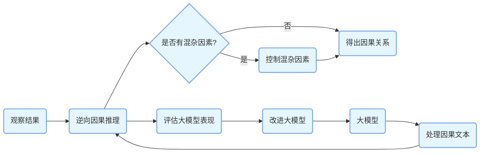

# 大模型在逆向因果推理中的表现评估

> 关键词：大模型、逆向因果推理、表现评估、因果推断、人工智能

> 摘要：本文聚焦于大模型在逆向因果推理中的表现评估。首先介绍了研究的背景、目的、预期读者、文档结构和相关术语。接着阐述了逆向因果推理和大模型的核心概念及其联系，通过文本示意图和 Mermaid 流程图展示其架构。详细讲解了用于评估的核心算法原理，并给出 Python 代码示例。从数学模型和公式角度深入分析逆向因果推理，结合具体例子进行说明。通过项目实战，展示开发环境搭建、源代码实现及解读。探讨了大模型在逆向因果推理中的实际应用场景，推荐了相关的学习资源、开发工具框架和论文著作。最后总结了未来发展趋势与挑战，提供常见问题解答和扩展阅读参考资料，旨在为深入研究大模型在逆向因果推理中的应用提供全面的指导和参考。

## 1. 背景介绍 
### 1.1 目的和范围
逆向因果推理旨在从结果出发，推断导致该结果的原因，这在众多领域如医学、经济学、社会学等都具有重要意义。大模型作为当前人工智能领域的前沿技术，具有强大的语言理解和生成能力。本研究的目的是评估大模型在逆向因果推理任务中的表现，明确其优势和局限性。研究范围涵盖多种类型的大模型，包括基于 Transformer 架构的语言模型，如 GPT 系列、BERT 及其变体等，以及在不同领域数据集上的逆向因果推理任务。

### 1.2 预期读者
本文预期读者包括人工智能领域的研究人员、开发者，对因果推断感兴趣的科研工作者，以及希望了解大模型应用边界的技术爱好者。对于正在从事因果推理相关项目开发的工程师，本文可以为其提供大模型选择和评估的参考；对于科研人员，有助于深入探讨大模型在逆向因果推理中的理论和实践问题。

### 1.3 文档结构概述
本文将按照以下结构展开：首先介绍核心概念与联系，明确逆向因果推理和大模型的基本原理和架构；接着阐述核心算法原理及具体操作步骤，并给出 Python 代码实现；然后从数学模型和公式角度深入分析逆向因果推理；通过项目实战展示大模型在逆向因果推理中的代码实现和解读；探讨实际应用场景；推荐相关的学习资源、开发工具框架和论文著作；最后总结未来发展趋势与挑战，提供常见问题解答和扩展阅读参考资料。

### 1.4 术语表
#### 1.4.1 核心术语定义
- **逆向因果推理**：从已知的结果出发，通过逻辑和统计方法推断产生该结果的原因的过程。与正向因果推理（从原因到结果的推理）相对。
- **大模型**：指具有大量参数和强大计算能力的人工智能模型，通常基于深度学习架构，如神经网络，在大规模数据集上进行训练。
- **因果效应**：指某个原因变量对结果变量产生的影响程度。
- **混杂因素**：与原因变量和结果变量都相关的变量，可能会干扰对因果关系的判断。

#### 1.4.2 相关概念解释
- **因果图**：一种用图形表示因果关系的方法，节点表示变量，边表示因果关系的方向。
- **结构因果模型（SCM）**：一种基于因果图的数学模型，用于描述变量之间的因果关系和生成数据的机制。
- **反事实推理**：思考在不同条件下（与事实相反的情况）结果会如何变化的推理方式，是因果推断中的重要概念。

#### 1.4.3 缩略词列表
- **GPT**：Generative Pretrained Transformer，生成式预训练变换器。
- **BERT**：Bidirectional Encoder Representations from Transformers，基于变换器的双向编码器表示。
- **SCM**：Structural Causal Model，结构因果模型。

## 2. 核心概念与联系 

### 逆向因果推理原理
逆向因果推理的核心是从观察到的结果回溯到可能的原因。在实际问题中，我们通常只能观察到一些变量的值，而需要推断这些变量之间的因果关系。例如，在医学领域，我们观察到患者出现了某种症状（结果），需要推断可能导致该症状的疾病（原因）。

逆向因果推理面临诸多挑战，其中混杂因素是一个重要问题。混杂因素会导致虚假的因果关系，使得我们难以准确判断真正的因果效应。为了解决这些问题，研究者们提出了多种方法，如基于因果图的方法、反事实推理方法等。

### 大模型原理
大模型通常基于深度学习架构，如神经网络。以 Transformer 架构为例，它具有强大的并行计算能力和长序列处理能力。大模型通过在大规模文本数据上进行预训练，学习到语言的语义和语法信息，能够对输入的文本进行理解和生成。

在预训练过程中，大模型通常采用无监督学习方法，如自监督学习。通过预测文本中的缺失部分或下一个单词，模型学习到语言的模式和规律。在微调阶段，模型可以在特定任务的数据集上进行有监督学习，以适应具体的任务需求。

### 核心概念架构的文本示意图
逆向因果推理和大模型的关系可以用以下方式描述：大模型作为一种强大的工具，可以用于逆向因果推理任务。大模型可以对文本数据进行处理，理解因果相关的描述，并尝试推断可能的因果关系。逆向因果推理的任务可以为大模型提供具体的应用场景，同时也可以通过评估大模型在逆向因果推理中的表现，来改进大模型的性能。

### Mermaid 流程图


## 3. 核心算法原理 & 具体操作步骤 

### 核心算法原理
评估大模型在逆向因果推理中的表现，通常采用以下步骤：首先，构建一个包含因果关系的数据集，其中包含已知的结果和对应的可能原因。然后，使用大模型对这些结果进行处理，让大模型推断可能的原因。最后，将大模型的推断结果与真实的原因进行比较，计算评估指标。

在实际应用中，可以使用基于规则的方法或机器学习方法来评估大模型的表现。基于规则的方法通过定义一些因果推理的规则，判断大模型的推断是否符合这些规则。机器学习方法则通过训练一个评估模型，将大模型的推断结果作为输入，预测其准确性。

### 具体操作步骤
1. **数据准备**：收集包含因果关系的文本数据，将其整理成适合大模型处理的格式。数据集中应包含结果描述和对应的原因描述。
2. **大模型选择和微调**：选择合适的大模型，如 GPT-3 或 BERT，并在因果推理数据集上进行微调。微调过程可以使用有监督学习方法，让模型学习因果关系的模式。
3. **因果推理推断**：使用微调后的大模型对新的结果描述进行处理，得到模型推断的原因。
4. **评估指标计算**：将模型推断的原因与真实的原因进行比较，计算评估指标，如准确率、召回率、F1 值等。

### Python 源代码实现
```python
import torch
from transformers import AutoTokenizer, AutoModelForSequenceClassification

# 加载预训练模型和分词器
model_name = "bert-base-uncased"
tokenizer = AutoTokenizer.from_pretrained(model_name)
model = AutoModelForSequenceClassification.from_pretrained(model_name, num_labels=2)

# 示例数据
results = ["患者出现咳嗽症状"]
true_causes = ["感冒"]

# 对结果进行分词处理
inputs = tokenizer(results, return_tensors="pt")

# 使用模型进行推断
with torch.no_grad():
    outputs = model(**inputs)
    logits = outputs.logits
    predicted_labels = torch.argmax(logits, dim=1)

# 简单的评估
correct = 0
for i in range(len(results)):
    # 这里只是简单示例，实际评估需要更复杂的逻辑
    if predicted_labels[i] == 1:  # 假设 1 表示推断有因果关系
        if true_causes[i] is not None:
            correct += 1

accuracy = correct / len(results)
print(f"Accuracy: {accuracy}")
```

## 4. 数学模型和公式 & 详细讲解 & 举例说明 

### 因果效应的数学表示
在因果推断中，因果效应通常用潜在结果框架来表示。设 $Y$ 是结果变量，$T$ 是原因变量（通常为二元变量，$T = 1$ 表示接受处理，$T = 0$ 表示未接受处理）。对于每个个体 $i$，有两个潜在结果 $Y_i(1)$ 和 $Y_i(0)$，分别表示个体 $i$ 在接受处理和未接受处理时的结果。

平均因果效应（ATE）定义为：
$$ATE = E[Y(1) - Y(0)]$$

其中 $E$ 表示期望。在实际应用中，我们通常只能观察到一个个体的一个潜在结果，即如果 $T_i = 1$，我们观察到 $Y_i(1)$，如果 $T_i = 0$，我们观察到 $Y_i(0)$。

### 逆向因果推理的数学模型
逆向因果推理可以看作是一个优化问题。假设我们有一个因果图 $G$，其中节点表示变量，边表示因果关系。我们的目标是从观察到的结果变量 $Y$ 的值，推断出原因变量 $X$ 的值。

可以使用最大似然估计方法来解决这个问题。设 $P(Y|X)$ 是给定原因变量 $X$ 时结果变量 $Y$ 的条件概率分布。我们的目标是找到 $X$ 的值，使得 $P(Y|X)$ 最大。即：
$$\hat{X} = \arg\max_X P(Y|X)$$

### 举例说明
考虑一个简单的医学例子，假设我们有两个变量：疾病 $D$（原因变量）和症状 $S$（结果变量）。疾病 $D$ 有两种可能的值：感冒（$D = 1$）和过敏（$D = 0$），症状 $S$ 有两种可能的值：咳嗽（$S = 1$）和不咳嗽（$S = 0$）。

根据医学知识，我们可以得到条件概率分布 $P(S|D)$：
- $P(S = 1|D = 1) = 0.8$（感冒时咳嗽的概率为 0.8）
- $P(S = 1|D = 0) = 0.2$（过敏时咳嗽的概率为 0.2）

现在我们观察到一个患者出现咳嗽症状（$S = 1$），我们可以使用贝叶斯定理来推断患者患感冒的概率：
$$P(D = 1|S = 1) = \frac{P(S = 1|D = 1)P(D = 1)}{P(S = 1|D = 1)P(D = 1) + P(S = 1|D = 0)P(D = 0)}$$

假设 $P(D = 1) = 0.6$（感冒的先验概率为 0.6），$P(D = 0) = 0.4$（过敏的先验概率为 0.4），则：
$$P(D = 1|S = 1) = \frac{0.8\times0.6}{0.8\times0.6 + 0.2\times0.4} = \frac{0.48}{0.48 + 0.08} = \frac{0.48}{0.56} \approx 0.857$$

因此，在观察到患者咳嗽的情况下，患者患感冒的概率约为 0.857。

## 5. 项目实战：代码实际案例和详细解释说明 

### 5.1  开发环境搭建
#### 操作系统
可以选择 Linux（如 Ubuntu）、Windows 或 macOS 作为开发环境。Linux 系统在深度学习开发中较为常用，因为它具有良好的开源软件支持和命令行操作环境。

#### Python 环境
安装 Python 3.7 或更高版本。可以使用 Anaconda 来管理 Python 环境，它提供了方便的包管理和环境隔离功能。

#### 深度学习框架
安装 PyTorch 深度学习框架，它是一个广泛使用的深度学习框架，支持 GPU 加速。可以使用以下命令安装：
```sh
pip install torch torchvision
```

#### 其他依赖库
安装 `transformers` 库，用于加载和使用预训练的大模型：
```sh
pip install transformers
```

### 5.2  源代码详细实现和代码解读
```python
import torch
from transformers import AutoTokenizer, AutoModelForSequenceClassification
import pandas as pd

# 加载预训练模型和分词器
model_name = "bert-base-uncased"
tokenizer = AutoTokenizer.from_pretrained(model_name)
model = AutoModelForSequenceClassification.from_pretrained(model_name, num_labels=2)

# 加载数据集
data = pd.read_csv("causal_data.csv")
results = data["result"].tolist()
true_causes = data["cause"].tolist()

# 数据预处理
inputs = tokenizer(results, padding=True, truncation=True, return_tensors="pt")
labels = []
for cause in true_causes:
    if cause is not None:
        labels.append(1)
    else:
        labels.append(0)
labels = torch.tensor(labels)

# 定义训练参数
optimizer = torch.optim.AdamW(model.parameters(), lr=2e-5)
epochs = 3
batch_size = 16

# 训练模型
num_batches = len(results) // batch_size
for epoch in range(epochs):
    for i in range(num_batches):
        start_idx = i * batch_size
        end_idx = (i + 1) * batch_size
        batch_inputs = {k: v[start_idx:end_idx] for k, v in inputs.items()}
        batch_labels = labels[start_idx:end_idx]

        optimizer.zero_grad()
        outputs = model(**batch_inputs, labels=batch_labels)
        loss = outputs.loss
        loss.backward()
        optimizer.step()

    print(f"Epoch {epoch + 1} completed. Loss: {loss.item()}")

# 评估模型
with torch.no_grad():
    outputs = model(**inputs)
    logits = outputs.logits
    predicted_labels = torch.argmax(logits, dim=1)

correct = (predicted_labels == labels).sum().item()
accuracy = correct / len(results)
print(f"Accuracy: {accuracy}")
```

### 代码解读与分析
1. **模型和分词器加载**：使用 `transformers` 库加载预训练的 BERT 模型和对应的分词器。
2. **数据集加载**：从 CSV 文件中加载包含因果关系的数据集，将结果描述和真实原因分别存储在 `results` 和 `true_causes` 列表中。
3. **数据预处理**：使用分词器对结果描述进行分词处理，并将真实原因转换为标签（0 或 1）。
4. **训练参数定义**：定义优化器（AdamW）、训练轮数和批次大小。
5. **模型训练**：使用循环进行多轮训练，每次训练一个批次的数据。在每个批次中，计算损失并进行反向传播更新模型参数。
6. **模型评估**：在训练完成后，使用训练好的模型对所有数据进行推断，计算预测标签，并与真实标签进行比较，计算准确率。

## 6. 实际应用场景 
### 医学领域
在医学诊断中，逆向因果推理可以帮助医生从患者的症状推断可能的疾病。大模型可以处理大量的医学文献和病例数据，学习到疾病和症状之间的因果关系。例如，当患者出现咳嗽、发热等症状时，大模型可以根据这些症状推断可能的疾病，如感冒、肺炎、流感等，并给出相应的概率。

### 经济学领域
在经济学中，逆向因果推理可以用于分析经济现象的原因。例如，分析失业率上升的原因可能包括经济衰退、政策变化、技术进步等。大模型可以处理大量的经济数据和新闻报道，帮助经济学家推断这些因素对失业率的影响。

### 社会学领域
在社会学研究中，逆向因果推理可以用于理解社会现象的成因。例如，分析犯罪率上升的原因可能包括贫困、教育水平低、社会不稳定等。大模型可以处理社交媒体数据、新闻报道和调查数据，帮助社会学家推断这些因素与犯罪率之间的因果关系。

### 工业领域
在工业生产中，逆向因果推理可以用于故障诊断。当设备出现故障时，大模型可以根据故障现象推断可能的故障原因，如设备老化、操作不当、零部件损坏等。这有助于提高设备的维修效率和可靠性。

## 7. 工具和资源推荐
### 7.1 学习资源推荐
#### 7.1.1 书籍推荐
- 《Causal Inference in Statistics: A Primer》：这本书由 Judea Pearl、Madelyn Glymour 和 Nicholas P. Jewell 所著，提供了因果推断的基础理论和方法，适合初学者入门。
- 《Elements of Causal Inference: Foundations and Learning Algorithms》：由 Jonas Peters、Dominik Janzing 和 Bernhard Schölkopf 所著，深入介绍了因果推断的理论和算法，包括因果图、结构因果模型等。
- 《Deep Learning》：由 Ian Goodfellow、Yoshua Bengio 和 Aaron Courville 所著，是深度学习领域的经典教材，介绍了深度学习的基本原理和方法，对于理解大模型的工作原理有很大帮助。

#### 7.1.2 在线课程
- Coursera 上的 “Causal Diagrams: Draw Your Assumptions Before Your Conclusions”：由 Judea Pearl 教授授课，介绍了因果图的基本概念和应用。
- edX 上的 “Probability-The Science of Uncertainty and Data”：这门课程提供了概率论的基础知识，是理解因果推断的重要基础。
- fast.ai 上的 “Practical Deep Learning for Coders”：该课程提供了深度学习的实践教程，帮助学习者快速上手使用深度学习框架进行模型开发。

#### 7.1.3 技术博客和网站
- Towards Data Science：这是一个数据科学领域的知名博客，上面有很多关于因果推断和大模型的文章。
- ArXiv：这是一个预印本服务器，上面可以找到很多最新的因果推断和大模型的研究论文。
- Hugging Face Blog：Hugging Face 是一家专注于自然语言处理的公司，其博客上有很多关于大模型的技术文章和应用案例。

### 7.2 开发工具框架推荐
#### 7.2.1 IDE和编辑器
- PyCharm：这是一个专业的 Python 集成开发环境，提供了代码编辑、调试、版本控制等功能，适合开发深度学习项目。
- Jupyter Notebook：这是一个交互式的开发环境，支持 Python 代码的编写和运行，同时可以插入 Markdown 文本进行说明，非常适合数据分析和模型开发的实验。
- Visual Studio Code：这是一个轻量级的代码编辑器，支持多种编程语言和插件扩展，具有良好的代码编辑和调试功能。

#### 7.2.2 调试和性能分析工具
- TensorBoard：这是一个用于可视化深度学习模型训练过程的工具，可以展示损失曲线、准确率曲线等信息，帮助开发者调试模型。
- Py-Spy：这是一个用于分析 Python 程序性能的工具，可以分析函数调用时间、内存使用等情况，帮助开发者优化代码性能。
- NVIDIA Nsight Systems：这是一个用于分析 GPU 应用程序性能的工具，可以帮助开发者优化深度学习模型在 GPU 上的运行效率。

#### 7.2.3 相关框架和库
- PyTorch：这是一个广泛使用的深度学习框架，提供了丰富的神经网络层和优化算法，支持 GPU 加速。
- TensorFlow：这是另一个流行的深度学习框架，具有强大的分布式训练和模型部署功能。
- scikit-learn：这是一个用于机器学习的 Python 库，提供了多种机器学习算法和工具，如分类、回归、聚类等。

### 7.3 相关论文著作推荐
#### 7.3.1 经典论文
- “The Book of Why: The New Science of Cause and Effect” by Judea Pearl and Dana Mackenzie：这本书提出了因果推断的新理论和方法，对因果推断领域产生了深远影响。
- “Estimating causal effects of treatments in randomized and nonrandomized studies” by Donald B. Rubin：这篇论文介绍了潜在结果框架和倾向得分匹配方法，是因果推断领域的经典之作。
- “Attention Is All You Need” by Ashish Vaswani et al.：这篇论文提出了 Transformer 架构，是大模型发展的重要里程碑。

#### 7.3.2 最新研究成果
- 在 ArXiv 上搜索 “Causal Inference with Large Language Models” 可以找到很多关于大模型在因果推断中的最新研究论文。
- 关注 NeurIPS、ICML、ACL 等顶级学术会议的论文，这些会议上会有很多关于因果推断和大模型的最新研究成果。

#### 7.3.3 应用案例分析
- 在 Google Scholar 上搜索 “Causal Inference Applications in [领域名称]” 可以找到很多关于因果推断在不同领域的应用案例分析，如医学、经济学、社会学等。

## 8. 总结：未来发展趋势与挑战
### 未来发展趋势
- **多模态融合**：未来的大模型在逆向因果推理中可能会融合多种模态的数据，如图像、音频、视频等。例如，在医学诊断中，除了文本描述的症状，还可以结合患者的医学影像数据进行更准确的因果推断。
- **可解释性增强**：随着大模型在逆向因果推理中的应用越来越广泛，对模型的可解释性要求也越来越高。未来的研究将致力于开发可解释的大模型，使得模型的因果推断过程和结果能够被人类理解和信任。
- **跨领域应用拓展**：大模型在逆向因果推理中的应用将不仅仅局限于现有的医学、经济学、社会学等领域，还将拓展到更多的领域，如环境科学、交通运输、教育等。

### 挑战
- **数据质量和标注问题**：逆向因果推理需要高质量的因果数据，而因果数据的标注往往比较困难和昂贵。如何获取高质量的因果数据，并进行有效的标注，是当前面临的一个挑战。
- **混杂因素处理**：在实际应用中，混杂因素往往非常复杂，难以完全控制。大模型如何有效地处理混杂因素，提高因果推断的准确性，是需要解决的问题。
- **计算资源和效率**：大模型通常需要大量的计算资源和时间进行训练和推断。如何在有限的计算资源下提高大模型在逆向因果推理中的效率，是一个亟待解决的问题。

## 9. 附录：常见问题与解答
### 问题 1：大模型在逆向因果推理中的准确性如何提高？
解答：可以通过以下方法提高大模型在逆向因果推理中的准确性：
- 使用高质量的因果数据集进行训练，确保数据的多样性和代表性。
- 对大模型进行微调，使其更适应逆向因果推理任务。
- 采用集成学习的方法，结合多个大模型的推断结果，提高准确性。
- 引入领域知识，如因果图、先验概率等，辅助大模型进行推理。

### 问题 2：大模型在逆向因果推理中能否处理连续变量？
解答：可以。大模型可以处理连续变量，通常需要对连续变量进行适当的预处理，如归一化、离散化等。在模型训练过程中，可以使用回归模型或其他适合处理连续变量的模型结构。

### 问题 3：如何评估大模型在逆向因果推理中的可解释性？
解答：可以从以下几个方面评估大模型在逆向因果推理中的可解释性：
- 模型的决策过程是否可以可视化，如展示因果图、特征重要性等。
- 模型是否能够提供合理的解释，说明为什么推断出某个原因。
- 模型的解释是否与人类的直觉和领域知识相符。

## 10. 扩展阅读 & 参考资料
### 扩展阅读
- Pearl, J., Glymour, M., & Jewell, N. P. (2016). Causal Inference in Statistics: A Primer. Wiley.
- Peters, J., Janzing, D., & Schölkopf, B. (2017). Elements of Causal Inference: Foundations and Learning Algorithms. MIT Press.
- Goodfellow, I. J., Bengio, Y., & Courville, A. (2016). Deep Learning. MIT Press.

### 参考资料
- Vaswani, A., Shazeer, N., Parmar, N., Uszkoreit, J., Jones, L., Gomez, A. N.,... & Polosukhin, I. (2017). Attention is all you need. In Advances in neural information processing systems (pp. 5998-6008).
- Rubin, D. B. (1974). Estimating causal effects of treatments in randomized and nonrandomized studies. Journal of educational Psychology, 66(5), 688.

作者：AI天才研究院/AI Genius Institute & 禅与计算机程序设计艺术 /Zen And The Art of Computer Programming