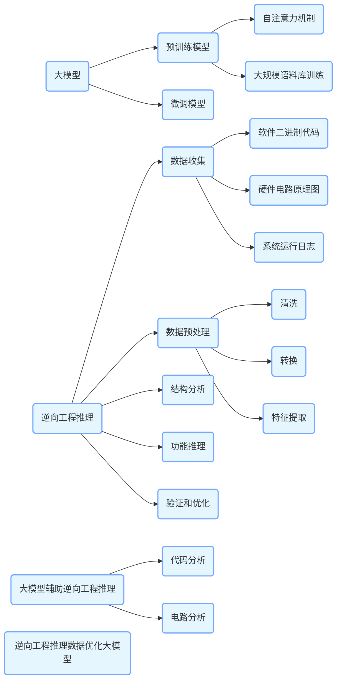

# 大模型在逆向工程推理中的能力评估

> 关键词：大模型、逆向工程推理、能力评估、自然语言处理、人工智能

> 摘要：本文围绕大模型在逆向工程推理中的能力评估展开深入探讨。逆向工程推理在众多领域具有重要意义，而大模型的兴起为其带来了新的机遇和挑战。文章首先介绍了研究的背景和相关概念，详细阐述了大模型与逆向工程推理的核心原理和联系，接着深入分析了核心算法原理并给出具体操作步骤，通过数学模型和公式进行理论支撑，结合项目实战案例详细解释代码实现和分析，探讨了大模型在逆向工程推理中的实际应用场景，推荐了相关的学习资源、开发工具框架和论文著作，最后总结了未来发展趋势与挑战，并提供常见问题解答和参考资料，旨在全面、系统地评估大模型在逆向工程推理中的能力，为相关研究和应用提供有价值的参考。

## 1. 背景介绍 
### 1.1 目的和范围
逆向工程推理是一种从产品、系统或过程的输出、行为等结果信息出发，反向推导其内部结构、设计原理和实现细节的技术和方法。在当今的科技发展中，逆向工程推理在软件破解、知识产权保护、产品改进、故障诊断等多个领域都发挥着关键作用。

大模型，特别是基于深度学习的大规模语言模型和图像模型等，近年来取得了巨大的进展。这些模型具有强大的语言理解、模式识别和推理能力，使得人们开始思考将其应用于逆向工程推理中。本研究的目的就是全面、客观地评估大模型在逆向工程推理中的能力，明确其优势和局限性，为后续的研究和应用提供指导。

本研究的范围涵盖了多种类型的大模型，包括但不限于GPT系列、BERT系列等自然语言处理大模型，以及一些基于卷积神经网络（CNN）、生成对抗网络（GAN）等的图像和数据处理大模型。同时，涉及的逆向工程推理场景包括软件逆向、硬件逆向、流程逆向等多个方面。

### 1.2 预期读者
本文的预期读者包括从事人工智能、逆向工程、软件工程、电子工程等领域的研究人员、开发人员和工程师。对于对大模型技术和逆向工程推理感兴趣的学生、学者以及相关行业的从业者也具有一定的参考价值。

### 1.3 文档结构概述
本文将按照以下结构进行阐述：首先介绍背景知识和相关概念，使读者对大模型和逆向工程推理有基本的了解；然后详细讲解大模型与逆向工程推理的核心概念和联系，以及相关的算法原理和操作步骤；接着通过数学模型和公式进一步分析；再结合项目实战案例进行代码实现和分析；探讨实际应用场景；推荐相关的工具和资源；最后总结未来发展趋势与挑战，提供常见问题解答和参考资料。

### 1.4 术语表
#### 1.4.1 核心术语定义
- **大模型**：指具有大量参数和强大计算能力的深度学习模型，通常在大规模数据集上进行训练，能够学习到丰富的语言、图像等模式和知识。
- **逆向工程推理**：从产品、系统或过程的结果信息出发，反向推导其内部结构、设计原理和实现细节的过程。
- **能力评估**：对大模型在逆向工程推理任务中表现出的性能、准确性、效率等方面进行量化和分析的过程。

#### 1.4.2 相关概念解释
- **深度学习**：一种基于人工神经网络的机器学习方法，通过多层神经网络对数据进行特征提取和模式识别。
- **自然语言处理（NLP）**：研究计算机与人类语言之间交互的技术领域，包括文本分类、机器翻译、问答系统等任务。
- **计算机视觉**：研究如何让计算机理解和处理图像和视频的技术领域，包括图像分类、目标检测、图像生成等任务。

#### 1.4.3 缩略词列表
- **CNN**：Convolutional Neural Network，卷积神经网络
- **GAN**：Generative Adversarial Network，生成对抗网络
- **GPT**：Generative Pretrained Transformer，生成式预训练变换器
- **BERT**：Bidirectional Encoder Representations from Transformers，基于变换器的双向编码器表示

## 2. 核心概念与联系 

### 2.1 大模型的原理和架构
大模型通常基于深度学习的架构，以Transformer架构为代表的语言模型最为典型。Transformer架构主要由编码器和解码器组成，其核心机制是自注意力机制（Self-Attention）。

自注意力机制允许模型在处理输入序列时，关注序列中不同位置的元素之间的关系。给定输入序列 $\mathbf{x} = [x_1, x_2, \cdots, x_n]$，自注意力机制通过计算查询（Query）、键（Key）和值（Value）之间的相似度来确定每个位置的输出。具体步骤如下：
1. 计算查询、键和值：
    - $Q = \mathbf{x}W^Q$
    - $K = \mathbf{x}W^K$
    - $V = \mathbf{x}W^V$
    其中，$W^Q$、$W^K$ 和 $W^V$ 是可学习的权重矩阵。
2. 计算注意力分数：
    - $\text{Attention}(Q, K, V) = \text{softmax}(\frac{QK^T}{\sqrt{d_k}})V$
    其中，$d_k$ 是键向量的维度。

大模型通过在大规模语料库上进行无监督预训练，学习到丰富的语言知识和模式。然后，根据具体任务进行微调，以适应不同的应用场景。

### 2.2 逆向工程推理的原理和流程
逆向工程推理的一般流程包括以下几个步骤：
1. **数据收集**：收集与目标产品、系统或过程相关的各种数据，如软件的二进制代码、硬件的电路原理图、系统的运行日志等。
2. **数据预处理**：对收集到的数据进行清洗、转换和特征提取等操作，以便后续分析。
3. **结构分析**：通过对预处理后的数据进行分析，推断目标的内部结构和组成部分。
4. **功能推理**：根据结构分析的结果，进一步推断目标的功能和工作原理。
5. **验证和优化**：对推理结果进行验证和优化，确保其准确性和可靠性。

### 2.3 大模型与逆向工程推理的联系
大模型在逆向工程推理中可以发挥重要作用。例如，在软件逆向工程中，大模型可以对二进制代码进行分析和理解，帮助识别代码中的函数、变量和控制流等信息。在硬件逆向工程中，大模型可以对电路原理图进行分析，推断电路的功能和设计原理。

大模型的语言理解和模式识别能力可以帮助逆向工程推理人员更高效地处理和分析复杂的数据，提高推理的准确性和效率。同时，逆向工程推理中的数据和知识也可以用于大模型的训练和优化，进一步提升大模型的性能。

### 2.4 文本示意图
```plaintext
大模型
|-- 预训练模型（基于Transformer架构）
|   |-- 自注意力机制
|   |-- 大规模语料库训练
|-- 微调模型（适应具体任务）

逆向工程推理
|-- 数据收集
|   |-- 软件二进制代码
|   |-- 硬件电路原理图
|   |-- 系统运行日志
|-- 数据预处理
|   |-- 清洗
|   |-- 转换
|   |-- 特征提取
|-- 结构分析
|-- 功能推理
|-- 验证和优化

大模型与逆向工程推理的联系
|-- 大模型辅助逆向工程推理
|   |-- 代码分析
|   |-- 电路分析
|-- 逆向工程推理数据优化大模型
```

### 2.5 Mermaid 流程图


## 3. 核心算法原理 & 具体操作步骤 

### 3.1 核心算法原理
在大模型应用于逆向工程推理中，主要涉及到自然语言处理和机器学习的算法。以软件逆向工程为例，我们可以使用基于Transformer的语言模型来对二进制代码进行分析。

#### 3.1.1 代码嵌入
首先，需要将二进制代码转换为适合大模型处理的文本表示形式。可以使用反汇编工具将二进制代码转换为汇编代码，然后对汇编代码进行分词和编码。

```python
import torch
from transformers import AutoTokenizer

# 加载预训练的分词器
tokenizer = AutoTokenizer.from_pretrained('bert-base-uncased')

# 示例汇编代码
assembly_code = "mov eax, 0\nadd eax, 1"

# 分词和编码
tokens = tokenizer.tokenize(assembly_code)
input_ids = tokenizer.convert_tokens_to_ids(tokens)
input_tensor = torch.tensor([input_ids])
```

#### 3.1.2 特征提取
使用预训练的大模型对编码后的代码进行特征提取。

```python
from transformers import AutoModel

# 加载预训练的模型
model = AutoModel.from_pretrained('bert-base-uncased')

# 前向传播
with torch.no_grad():
    outputs = model(input_tensor)
    last_hidden_state = outputs.last_hidden_state
```

#### 3.1.3 任务特定的分类或推理
根据具体的逆向工程任务，对提取的特征进行分类或推理。例如，判断代码是否包含特定的漏洞。

```python
import torch.nn as nn

# 定义一个简单的分类器
class CodeClassifier(nn.Module):
    def __init__(self, input_dim, num_classes):
        super(CodeClassifier, self).__init__()
        self.fc = nn.Linear(input_dim, num_classes)

    def forward(self, x):
        return self.fc(x)

# 初始化分类器
input_dim = last_hidden_state.shape[-1]
num_classes = 2  # 例如，有漏洞和无漏洞
classifier = CodeClassifier(input_dim, num_classes)

# 提取池化后的特征
pooled_output = last_hidden_state.mean(dim=1)

# 进行分类
logits = classifier(pooled_output)
```

### 3.2 具体操作步骤
1. **数据准备**：收集和整理逆向工程推理所需的数据，如软件二进制代码、硬件电路原理图等。对数据进行预处理，包括清洗、转换和特征提取。
2. **模型选择**：根据具体的任务和数据特点，选择合适的大模型。例如，对于文本处理任务，可以选择GPT、BERT等自然语言处理模型；对于图像和数据处理任务，可以选择基于CNN、GAN等的模型。
3. **模型微调**：如果预训练的模型不能完全满足任务需求，可以使用逆向工程推理的数据对模型进行微调。微调的过程包括定义损失函数、优化器，以及训练模型。
4. **推理和评估**：使用微调后的模型进行逆向工程推理，并对推理结果进行评估。评估指标可以包括准确率、召回率、F1值等。
5. **优化和改进**：根据评估结果，对模型和推理方法进行优化和改进，提高推理的准确性和效率。

## 4. 数学模型和公式 & 详细讲解 & 举例说明 

### 4.1 自注意力机制的数学模型
自注意力机制的核心公式为：
$$\text{Attention}(Q, K, V) = \text{softmax}(\frac{QK^T}{\sqrt{d_k}})V$$
其中，$Q$ 是查询矩阵，$K$ 是键矩阵，$V$ 是值矩阵，$d_k$ 是键向量的维度。

#### 4.1.1 详细讲解
- **查询、键和值的计算**：
    - 给定输入序列 $\mathbf{x} = [x_1, x_2, \cdots, x_n]$，通过线性变换计算查询、键和值：
        - $Q = \mathbf{x}W^Q$
        - $K = \mathbf{x}W^K$
        - $V = \mathbf{x}W^V$
    其中，$W^Q$、$W^K$ 和 $W^V$ 是可学习的权重矩阵。
- **注意力分数的计算**：
    - 通过计算查询和键之间的相似度，得到注意力分数：
        - $\text{Attention Score}_{ij} = \frac{Q_{i}K_{j}^T}{\sqrt{d_k}}$
    其中，$Q_{i}$ 是查询矩阵的第 $i$ 行，$K_{j}$ 是键矩阵的第 $j$ 行。
- **注意力分布的计算**：
    - 使用softmax函数将注意力分数转换为注意力分布：
        - $\text{Attention Distribution}_{ij} = \frac{\exp(\text{Attention Score}_{ij})}{\sum_{k=1}^{n}\exp(\text{Attention Score}_{ik})}$
- **输出的计算**：
    - 根据注意力分布，对值矩阵进行加权求和，得到输出：
        - $\text{Output}_{i} = \sum_{j=1}^{n}\text{Attention Distribution}_{ij}V_{j}$

#### 4.1.2 举例说明
假设输入序列 $\mathbf{x} = [x_1, x_2, x_3]$，其中每个 $x_i$ 是一个长度为 $d$ 的向量。查询、键和值的维度均为 $d_k$。

- 计算查询、键和值：
    - $Q = \mathbf{x}W^Q$，$K = \mathbf{x}W^K$，$V = \mathbf{x}W^V$
    - 假设 $W^Q$、$W^K$ 和 $W^V$ 是 $d \times d_k$ 的矩阵。
- 计算注意力分数：
    - $\text{Attention Score}_{11} = \frac{Q_{1}K_{1}^T}{\sqrt{d_k}}$，$\text{Attention Score}_{12} = \frac{Q_{1}K_{2}^T}{\sqrt{d_k}}$，$\text{Attention Score}_{13} = \frac{Q_{1}K_{3}^T}{\sqrt{d_k}}$
- 计算注意力分布：
    - $\text{Attention Distribution}_{11} = \frac{\exp(\text{Attention Score}_{11})}{\exp(\text{Attention Score}_{11}) + \exp(\text{Attention Score}_{12}) + \exp(\text{Attention Score}_{13})}$
    - $\text{Attention Distribution}_{12} = \frac{\exp(\text{Attention Score}_{12})}{\exp(\text{Attention Score}_{11}) + \exp(\text{Attention Score}_{12}) + \exp(\text{Attention Score}_{13})}$
    - $\text{Attention Distribution}_{13} = \frac{\exp(\text{Attention Score}_{13})}{\exp(\text{Attention Score}_{11}) + \exp(\text{Attention Score}_{12}) + \exp(\text{Attention Score}_{13})}$
- 计算输出：
    - $\text{Output}_{1} = \text{Attention Distribution}_{11}V_{1} + \text{Attention Distribution}_{12}V_{2} + \text{Attention Distribution}_{13}V_{3}$

### 4.2 交叉熵损失函数
在分类任务中，常用交叉熵损失函数来衡量模型预测结果与真实标签之间的差异。交叉熵损失函数的公式为：
$$H(p, q) = -\sum_{i=1}^{C}p_i\log(q_i)$$
其中，$p$ 是真实标签的概率分布，$q$ 是模型预测的概率分布，$C$ 是类别数。

#### 4.2.1 详细讲解
- **真实标签的概率分布**：
    - 对于一个分类任务，真实标签通常用one-hot编码表示。例如，对于一个三分类任务，真实标签为 $[0, 1, 0]$，表示样本属于第二类。
- **模型预测的概率分布**：
    - 模型的输出通常是一个未归一化的分数向量，通过softmax函数将其转换为概率分布。
    - $\text{Softmax}(z_i) = \frac{\exp(z_i)}{\sum_{j=1}^{C}\exp(z_j)}$
    其中，$z$ 是模型的输出向量。
- **交叉熵损失的计算**：
    - 根据真实标签的概率分布和模型预测的概率分布，计算交叉熵损失。
    - 对于一个样本，交叉熵损失为：
        - $H(p, q) = -\sum_{i=1}^{C}p_i\log(q_i)$
    - 对于一个批量的样本，交叉熵损失为：
