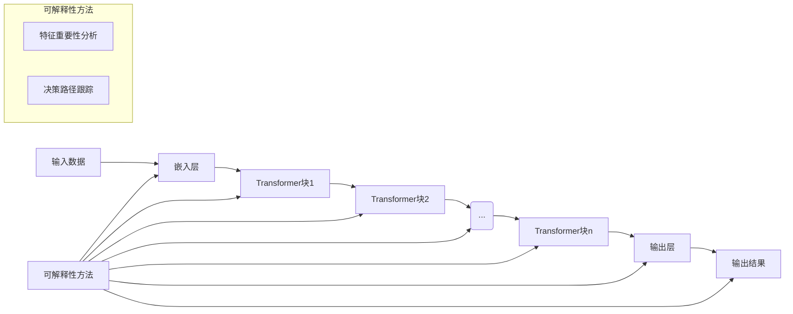

# 大模型推理能力的可解释性研究

> 关键词：大模型、推理能力、可解释性、人工智能、模型透明度、决策依据

> 摘要：本文聚焦于大模型推理能力的可解释性研究。随着大模型在诸多领域的广泛应用，其推理过程的不透明性引发了众多担忧。文章首先介绍了研究的背景，包括目的、预期读者、文档结构和相关术语。接着阐述了核心概念与联系，通过文本示意图和Mermaid流程图展示大模型推理及可解释性的架构。详细讲解了核心算法原理，并用Python代码进行说明，同时给出了相关的数学模型和公式。通过项目实战，展示了代码的实际案例并进行深入解读。探讨了大模型推理能力可解释性在不同场景的实际应用，推荐了学习资源、开发工具框架和相关论文著作。最后总结了未来发展趋势与挑战，解答了常见问题并提供扩展阅读和参考资料，旨在为提高大模型推理的可解释性提供全面的技术指导。

## 1. 背景介绍 
### 1.1 目的和范围
在当今人工智能领域，大模型如GPT系列、BERT等取得了显著的成果，在自然语言处理、图像识别等多个领域展现出强大的能力。然而，这些大模型通常被视为“黑盒”，其推理过程难以理解。本研究的目的在于深入探究大模型推理能力的可解释性，揭示模型做出决策的依据，提高模型的透明度和可信度。

研究范围涵盖了常见的大模型架构，包括基于Transformer的模型，分析其在不同任务（如文本生成、问答系统、图像分类等）中的推理过程，探索有效的可解释性方法，并评估这些方法的有效性和局限性。

### 1.2 预期读者
本文预期读者包括人工智能领域的研究人员、工程师、学生，以及对大模型技术应用感兴趣的专业人士。对于研究人员，本文可以提供新的研究思路和方法；工程师可以借鉴其中的技术实现方案，提高模型的可解释性；学生可以加深对大模型和可解释性的理解；专业人士可以了解大模型在实际应用中的风险和挑战。

### 1.3 文档结构概述
本文将按照以下结构展开：首先介绍大模型推理能力可解释性的核心概念与联系，包括相关的原理和架构；接着详细讲解核心算法原理，并给出Python代码示例；阐述相关的数学模型和公式，并举例说明；通过项目实战展示代码的实际应用和解读；探讨大模型推理能力可解释性在实际场景中的应用；推荐相关的学习资源、开发工具框架和论文著作；最后总结未来发展趋势与挑战，解答常见问题并提供扩展阅读和参考资料。

### 1.4 术语表
#### 1.4.1 核心术语定义
- **大模型**：指具有大量参数和复杂架构的人工智能模型，通常在大规模数据集上进行训练，如GPT - 3、BERT等。
- **推理能力**：模型根据输入数据生成输出结果的能力，包括预测、分类、生成等操作。
- **可解释性**：指能够理解和解释模型做出决策的原因和依据，使模型的推理过程变得透明。
- **特征重要性**：在模型推理中，各个输入特征对输出结果的贡献程度。
- **决策路径**：模型从输入到输出所经过的中间步骤和决策过程。

#### 1.4.2 相关概念解释
- **黑盒模型**：指模型的内部结构和推理过程难以直接观察和理解的模型，大模型通常被视为黑盒模型。
- **白盒模型**：模型的内部结构和推理过程可以清晰地被解释和理解，如决策树模型。
- **局部可解释性**：针对特定的输入样本，解释模型的决策过程。
- **全局可解释性**：从整体上解释模型的行为和决策机制。

#### 1.4.3 缩略词列表
- **GPT**：Generative Pretrained Transformer
- **BERT**：Bidirectional Encoder Representations from Transformers
- **LIME**：Local Interpretable Model - agnostic Explanations
- **SHAP**：SHapley Additive exPlanations

## 2. 核心概念与联系 

### 核心概念原理
大模型的推理过程通常涉及多个层次的计算和信息传递。以基于Transformer架构的大模型为例，输入数据首先经过嵌入层转换为向量表示，然后通过多个Transformer块进行特征提取和信息交互，最后经过输出层生成最终的结果。

可解释性的核心原理是通过各种方法揭示模型在这个过程中各个步骤的作用和影响。例如，通过分析输入特征的重要性，我们可以了解哪些特征对模型的决策起到关键作用；通过跟踪决策路径，我们可以了解模型是如何从输入逐步得出输出的。

### 架构的文本示意图
```plaintext
输入数据 -> 嵌入层 -> Transformer块1 -> Transformer块2 ->... -> Transformer块n -> 输出层 -> 输出结果
|                                                   |
|--------------------- 可解释性方法 ----------------|
特征重要性分析、决策路径跟踪等
```

### Mermaid流程图


## 3. 核心算法原理 & 具体操作步骤 

### 特征重要性分析 - LIME算法原理
LIME（Local Interpretable Model - agnostic Explanations）是一种局部可解释性方法，其核心思想是在局部范围内用一个简单的可解释模型来近似复杂的大模型。

具体步骤如下：
1. 对于给定的输入样本，生成一组与该样本相似的扰动样本。
2. 使用大模型对这些扰动样本进行预测，得到相应的输出。
3. 根据扰动样本与原始样本的相似度，为每个样本分配一个权重。
4. 使用加权的扰动样本和对应的输出训练一个简单的可解释模型（如线性回归模型）。
5. 从可解释模型中提取特征的重要性。

### Python代码实现
```python
import numpy as np
import lime
from lime.lime_text import LimeTextExplainer
from sklearn.feature_extraction.text import TfidfVectorizer
from sklearn.linear_model import LogisticRegression
from sklearn.datasets import fetch_20newsgroups

# 加载数据集
categories = ['alt.atheism', 'soc.religion.christian']
newsgroups_train = fetch_20newsgroups(subset='train', categories=categories)
newsgroups_test = fetch_20newsgroups(subset='test', categories=categories)

# 特征提取
vectorizer = TfidfVectorizer()
X_train = vectorizer.fit_transform(newsgroups_train.data)
X_test = vectorizer.transform(newsgroups_test.data)
y_train = newsgroups_train.target
y_test = newsgroups_test.target

# 训练模型
model = LogisticRegression()
model.fit(X_train, y_train)

# 创建LIME解释器
explainer = LimeTextExplainer(class_names=newsgroups_train.target_names)

# 选择一个样本进行解释
idx = 1
text_instance = newsgroups_test.data[idx]
exp = explainer.explain_instance(text_instance, model.predict_proba, num_features=6)

# 打印特征重要性
print(exp.as_list())
```

### 代码解释
1. 首先，我们加载了20个新闻组数据集，并选择了其中的两个类别。
2. 使用TfidfVectorizer对文本数据进行特征提取。
3. 训练一个逻辑回归模型作为大模型。
4. 创建LIME解释器，并选择一个样本进行解释。
5. 调用explainer.explain_instance方法，使用大模型的预测概率作为输入，得到特征重要性的解释。
6. 最后，打印出特征重要性的列表。

## 4. 数学模型和公式 & 详细讲解 & 举例说明 

### LIME算法的数学模型
LIME的目标是在局部范围内找到一个简单的可解释模型 $g \in G$，使得 $g$ 尽可能地接近大模型 $f$。具体来说，我们要最小化以下损失函数：

$$\xi(x) = \min_{g \in G} L(f, g, \pi_x) + \Omega(g)$$

其中，$L(f, g, \pi_x)$ 是大模型 $f$ 和可解释模型 $g$ 在以 $x$ 为中心的局部区域内的差异，$\pi_x(z)$ 是样本 $z$ 与 $x$ 的相似度，$\Omega(g)$ 是可解释模型 $g$ 的复杂度。

### 详细讲解
- $L(f, g, \pi_x)$ 通常使用均方误差来衡量，即：

$$L(f, g, \pi_x) = \sum_{z \in Z} \pi_x(z)(f(z) - g(z))^2$$

其中，$Z$ 是扰动样本的集合。

- $\Omega(g)$ 用于控制可解释模型的复杂度，例如在线性回归模型中，$\Omega(g)$ 可以是模型系数的 $L_1$ 或 $L_2$ 正则化项。

### 举例说明
假设我们有一个文本分类问题，输入样本 $x$ 是一篇新闻文章，大模型 $f$ 是一个训练好的分类器，可解释模型 $g$ 是一个线性回归模型。我们生成一组与 $x$ 相似的扰动样本 $Z$，并使用大模型 $f$ 对这些样本进行预测。然后，根据样本与 $x$ 的相似度 $\pi_x(z)$，为每个样本分配一个权重。最后，使用加权的扰动样本和对应的输出训练线性回归模型 $g$，并从 $g$ 中提取特征的重要性。

## 5. 项目实战：代码实际案例和详细解释说明 

### 5.1  开发环境搭建
#### 安装Python和必要的库
我们使用Python 3.8及以上版本，并安装以下库：
```bash
pip install numpy scikit-learn lime
```

#### 数据集准备
我们使用前面提到的20个新闻组数据集，该数据集可以通过 `sklearn.datasets` 模块轻松加载。

### 5.2  源代码详细实现和代码解读
```python
import numpy as np
import lime
from lime.lime_text import LimeTextExplainer
from sklearn.feature_extraction.text import TfidfVectorizer
from sklearn.linear_model import LogisticRegression
from sklearn.datasets import fetch_20newsgroups

# 加载数据集
categories = ['alt.atheism', 'soc.religion.christian']
newsgroups_train = fetch_20newsgroups(subset='train', categories=categories)
newsgroups_test = fetch_20newsgroups(subset='test', categories=categories)

# 特征提取
vectorizer = TfidfVectorizer()
X_train = vectorizer.fit_transform(newsgroups_train.data)
X_test = vectorizer.transform(newsgroups_test.data)
y_train = newsgroups_train.target
y_test = newsgroups_test.target

# 训练模型
model = LogisticRegression()
model.fit(X_train, y_train)

# 创建LIME解释器
explainer = LimeTextExplainer(class_names=newsgroups_train.target_names)

# 选择一个样本进行解释
idx = 1
text_instance = newsgroups_test.data[idx]
exp = explainer.explain_instance(text_instance, model.predict_proba, num_features=6)

# 打印特征重要性
print(exp.as_list())
```

### 代码解读
1. **数据集加载**：使用 `fetch_20newsgroups` 函数加载20个新闻组数据集的训练集和测试集，并选择了两个类别。
2. **特征提取**：使用 `TfidfVectorizer` 将文本数据转换为数值特征向量。
3. **模型训练**：使用逻辑回归模型对训练数据进行训练。
4. **创建解释器**：使用 `LimeTextExplainer` 创建一个LIME解释器。
5. **选择样本并解释**：选择一个测试样本，调用 `explainer.explain_instance` 方法对该样本进行解释，得到特征重要性的解释结果。
6. **打印结果**：使用 `exp.as_list()` 打印特征重要性的列表。

### 5.3  代码解读与分析
通过上述代码，我们可以看到如何使用LIME算法对大模型的推理过程进行解释。LIME算法的优点是模型无关性，即可以应用于任何类型的大模型。同时，它提供了局部可解释性，能够针对特定的输入样本进行解释。

然而，LIME算法也存在一些局限性。例如，它的解释结果可能受到扰动样本生成方法和可解释模型选择的影响。此外，LIME只能提供局部解释，对于全局可解释性的需求可能无法满足。

## 6. 实际应用场景 
### 医疗领域
在医疗诊断中，大模型可以根据患者的病历、检查结果等信息进行疾病预测。然而，医生需要了解模型做出诊断的依据，以确保诊断的准确性和可靠性。通过可解释性方法，可以分析哪些特征（如症状、检查指标等）对诊断结果起到关键作用，帮助医生更好地理解模型的决策过程。

### 金融领域
在金融风险评估中，大模型可以用于预测客户的信用风险。银行和金融机构需要了解模型是如何评估风险的，以便做出合理的决策。可解释性方法可以揭示模型考虑的因素（如收入、负债、信用历史等），帮助金融机构更好地管理风险。

### 自动驾驶领域
在自动驾驶系统中，大模型用于感知环境、做出决策和控制车辆。为了确保自动驾驶的安全性，需要了解模型在不同情况下的决策依据。可解释性方法可以分析模型对各种传感器数据（如摄像头图像、雷达信号等）的处理过程，帮助工程师优化系统设计。

## 7. 工具和资源推荐
### 7.1 学习资源推荐
#### 7.1.1 书籍推荐
- 《可解释的机器学习》（Interpretable Machine Learning）：这本书详细介绍了各种可解释性方法的原理和应用。
- 《深度学习》（Deep Learning）：虽然主要关注深度学习的基础和技术，但其中也涉及到一些模型解释的相关内容。

#### 7.1.2 在线课程
- Coursera上的“可解释人工智能”课程：由知名教授授课，系统地介绍了可解释人工智能的理论和实践。
- edX上的“深度学习基础”课程：涵盖了深度学习的基本概念和方法，为理解大模型的可解释性提供了基础。

#### 7.1.3 技术博客和网站
- Towards Data Science：一个专注于数据科学和人工智能的博客平台，有很多关于可解释性的文章。
- ArXiv：一个预印本论文平台，经常发布最新的可解释性研究成果。

### 7.2 开发工具框架推荐
#### 7.2.1 IDE和编辑器
- PyCharm：一个功能强大的Python集成开发环境，提供了代码编辑、调试、版本控制等功能。
- Jupyter Notebook：一个交互式的开发环境，适合进行数据分析和模型实验。

#### 7.2.2 调试和性能分析工具
- TensorBoard：TensorFlow的可视化工具，可以用于监控模型的训练过程和性能指标。
- PyTorch Profiler：PyTorch的性能分析工具，可以帮助开发者找出代码中的性能瓶颈。

#### 7.2.3 相关框架和库
- LIME：用于局部可解释性的Python库，支持多种类型的模型。
- SHAP：用于特征重要性分析的Python库，提供了多种解释方法。

### 7.3 相关论文著作推荐
#### 7.3.1 经典论文
- Ribeiro, M. T., Singh, S., & Guestrin, C. (2016). “Why should I trust you?”: Explaining the predictions of any classifier. In Proceedings of the 22nd ACM SIGKDD international conference on knowledge discovery and data mining.
- Lundberg, S. M., & Lee, S. I. (2017). A unified approach to interpreting model predictions. In Advances in neural information processing systems.

#### 7.3.2 最新研究成果
- 关注ArXiv和顶级学术会议（如NeurIPS、ICML、ACL等）上的最新论文，了解可解释性领域的前沿研究。

#### 7.3.3 应用案例分析
- 可以在ACM Digital Library、IEEE Xplore等数据库中查找可解释性在不同领域的应用案例，学习实际应用中的经验和方法。

## 8. 总结：未来发展趋势与挑战
### 未来发展趋势
- **全局可解释性方法的发展**：目前的可解释性方法主要集中在局部解释，未来需要开发更多的全局可解释性方法，以更好地理解大模型的整体行为。
- **可解释性与模型性能的平衡**：在提高模型可解释性的同时，需要保证模型的性能不受太大影响。未来的研究将致力于找到两者之间的最佳平衡点。
- **多模态可解释性**：随着多模态大模型的发展，需要开发适用于多模态数据的可解释性方法，以揭示模型在不同模态数据上的推理过程。

### 挑战
- **模型复杂度的增加**：大模型的参数数量和复杂度不断增加，使得可解释性变得更加困难。如何有效地解释复杂模型的推理过程是一个巨大的挑战。
- **数据隐私和安全**：在可解释性过程中，可能会涉及到数据的隐私和安全问题。如何在保证可解释性的同时，保护数据的隐私和安全是需要解决的问题。
- **缺乏统一的评估标准**：目前缺乏统一的可解释性评估标准，使得不同方法之间的比较和评估变得困难。建立统一的评估标准是推动可解释性研究发展的关键。

## 9. 附录：常见问题与解答
### 问题1：可解释性方法是否会降低模型的性能？
解答：一般来说，可解释性方法本身不会直接降低模型的性能。然而，为了提高可解释性，可能需要对模型进行一些调整或简化，这可能会在一定程度上影响模型的性能。在实际应用中，需要在可解释性和模型性能之间找到一个平衡点。

### 问题2：可解释性方法是否适用于所有类型的大模型？
解答：大部分可解释性方法具有模型无关性，即可以应用于各种类型的大模型。例如，LIME和SHAP等方法可以用于神经网络、决策树等不同类型的模型。然而，不同的方法可能对不同类型的模型有不同的效果，需要根据具体情况选择合适的方法。

### 问题3：如何评估可解释性方法的有效性？
解答：目前还没有统一的评估标准。常见的评估方法包括可视化分析、人类评估和定量评估等。可视化分析可以直观地展示解释结果，人类评估可以通过专家或用户的反馈来评估解释的可理解性，定量评估可以使用一些指标（如特征重要性的一致性等）来评估解释的准确性。

## 10. 扩展阅读 & 参考资料
- Molnar, C. (2020). Interpretable Machine Learning. https://christophm.github.io/interpretable-ml-book/
- Goodfellow, I. J., Bengio, Y., & Courville, A. (2016). Deep Learning. MIT Press.
- Ribeiro, M. T., Singh, S., & Guestrin, C. (2016). “Why should I trust you?”: Explaining the predictions of any classifier. In Proceedings of the 22nd ACM SIGKDD international conference on knowledge discovery and data mining.
- Lundberg, S. M., & Lee, S. I. (2017). A unified approach to interpreting model predictions. In Advances in neural information processing systems.

作者：AI天才研究院/AI Genius Institute & 禅与计算机程序设计艺术 /Zen And The Art of Computer Programming