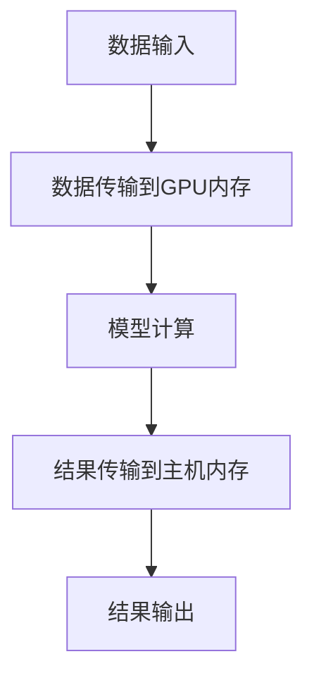

# 大规模AI推理的GPU优化策略

> 关键词：大规模AI推理、GPU优化、深度学习、计算效率、内存管理

> 摘要：本文围绕大规模AI推理的GPU优化策略展开，详细介绍了相关的核心概念、算法原理、数学模型，并通过项目实战给出具体的代码案例及解释。探讨了其实际应用场景，推荐了学习资源、开发工具框架和相关论文著作。最后总结了未来发展趋势与挑战，解答了常见问题，为读者全面深入了解大规模AI推理的GPU优化提供了丰富且有价值的信息。

## 1. 背景介绍 
### 1.1 目的和范围
随着人工智能技术的飞速发展，大规模AI推理在众多领域得到了广泛应用，如自然语言处理、计算机视觉等。然而，大规模AI推理对计算资源的需求巨大，GPU作为一种强大的并行计算设备，成为了加速推理过程的关键。本文的目的在于深入探讨大规模AI推理的GPU优化策略，涵盖从核心概念到实际应用的各个方面，为开发者和研究人员提供全面的指导。范围包括GPU优化的基本原理、常见算法、数学模型，以及实际项目中的应用和优化技巧。

### 1.2 预期读者
本文预期读者主要包括人工智能领域的开发者、研究人员，以及对大规模AI推理和GPU优化感兴趣的技术爱好者。对于正在从事深度学习项目开发，希望提高推理效率的开发者，本文将提供实用的优化策略和代码示例；对于研究人员，本文的理论分析和最新研究成果推荐将有助于其开展相关研究工作；对于技术爱好者，本文通俗易懂的讲解将帮助他们了解大规模AI推理和GPU优化的基本概念和方法。

### 1.3 文档结构概述
本文将按照以下结构进行组织：首先介绍核心概念与联系，包括大规模AI推理和GPU优化的基本原理和架构；接着详细阐述核心算法原理和具体操作步骤，并给出Python源代码示例；然后介绍相关的数学模型和公式，并通过举例进行说明；之后通过项目实战展示代码实际案例和详细解释；再探讨实际应用场景；推荐学习资源、开发工具框架和相关论文著作；最后总结未来发展趋势与挑战，解答常见问题，并提供扩展阅读和参考资料。

### 1.4 术语表
#### 1.4.1 核心术语定义
- **大规模AI推理**：指在大量数据上进行人工智能模型的推理过程，以获取预测结果。例如，在图像识别任务中，对成千上万张图片进行分类预测。
- **GPU（Graphics Processing Unit）**：图形处理单元，是一种专门设计用于快速处理图形和图像数据的并行计算设备。在AI推理中，GPU可以同时处理多个计算任务，从而显著提高推理速度。
- **推理优化**：通过各种技术手段提高AI推理的效率，包括减少计算时间、降低内存占用等。例如，使用模型压缩技术减少模型参数数量，从而加快推理速度。

#### 1.4.2 相关概念解释
- **并行计算**：指同时进行多个计算任务的计算方式。GPU通过多个计算核心并行处理数据，实现高效的计算。例如，在矩阵乘法运算中，GPU可以同时计算矩阵的多个元素，大大提高计算速度。
- **内存带宽**：指GPU内存与计算核心之间的数据传输速度。高内存带宽可以确保计算核心能够及时获取所需的数据，避免因数据传输延迟而影响计算效率。
- **张量（Tensor）**：在深度学习中，张量是一种多维数组，用于表示数据和模型参数。例如，图像数据可以表示为三维张量，分别对应图像的高度、宽度和通道数。

#### 1.4.3 缩略词列表
- **CUDA（Compute Unified Device Architecture）**：英伟达推出的一种并行计算平台和编程模型，用于在GPU上进行通用计算。
- **TensorRT**：英伟达开发的一种高性能深度学习推理优化器，可以对深度学习模型进行优化和加速。
- **FP16（Float 16）**：一种16位浮点数数据类型，相比于32位浮点数（FP32），可以减少内存占用和计算量，提高推理效率。

## 2. 核心概念与联系 
### 大规模AI推理的基本原理
大规模AI推理是指在大量数据上运行预训练好的人工智能模型，以获得预测结果的过程。在这个过程中，输入数据被输入到模型中，经过一系列的计算和变换，最终输出预测结果。例如，在图像分类任务中，输入的是图像数据，模型经过卷积、池化、全连接等操作，输出图像属于各个类别的概率。

### GPU的并行计算架构
GPU由多个计算核心组成，这些计算核心可以同时处理多个计算任务，从而实现并行计算。GPU的并行计算架构可以分为多个层次，包括线程、线程块和网格。线程是GPU中最小的计算单元，多个线程可以组成一个线程块，多个线程块可以组成一个网格。通过合理地组织线程、线程块和网格，可以充分发挥GPU的并行计算能力。

### 大规模AI推理与GPU优化的联系
大规模AI推理对计算资源的需求巨大，而GPU的并行计算能力可以显著提高推理效率。通过对GPU进行优化，可以进一步提高大规模AI推理的性能。例如，通过优化内存管理，减少数据传输时间；通过优化计算算法，提高计算核心的利用率。

### 核心概念原理和架构的文本示意图
大规模AI推理的过程可以分为数据输入、模型计算和结果输出三个阶段。在数据输入阶段，输入数据从主机内存传输到GPU内存；在模型计算阶段，GPU根据输入数据和模型参数进行计算；在结果输出阶段，计算结果从GPU内存传输到主机内存。

### Mermaid流程图


## 3. 核心算法原理 & 具体操作步骤 
### 矩阵乘法优化算法
矩阵乘法是深度学习中最常见的计算操作之一，也是大规模AI推理中计算量最大的部分。因此，优化矩阵乘法的计算效率对于提高大规模AI推理的性能至关重要。

#### 算法原理
传统的矩阵乘法算法是按行和列依次计算每个元素，这种算法的时间复杂度为 $O(n^3)$。为了提高计算效率，可以采用分块矩阵乘法算法。分块矩阵乘法算法将大矩阵分成多个小矩阵，然后分别计算小矩阵的乘积，最后将结果合并。这种算法可以减少内存访问次数，提高缓存命中率，从而提高计算效率。

#### Python源代码示例
```python
import numpy as np

def block_matrix_multiplication(A, B, block_size):
    m, k = A.shape
    k, n = B.shape
    C = np.zeros((m, n))
    for i in range(0, m, block_size):
        for j in range(0, n, block_size):
            for l in range(0, k, block_size):
                A_block = A[i:i+block_size, l:l+block_size]
                B_block = B[l:l+block_size, j:j+block_size]
                C[i:i+block_size, j:j+block_size] += np.dot(A_block, B_block)
    return C

# 示例使用
A = np.random.rand(100, 100)
B = np.random.rand(100, 100)
block_size = 10
C = block_matrix_multiplication(A, B, block_size)
print(C)
```

#### 具体操作步骤
1. 定义矩阵 $A$ 和 $B$，以及分块大小 $block\_size$。
2. 初始化结果矩阵 $C$ 为全零矩阵。
3. 使用三重循环遍历矩阵的分块，分别计算每个分块的乘积，并累加到结果矩阵 $C$ 中。
4. 返回结果矩阵 $C$。

### 内存管理优化算法
内存管理是GPU优化的另一个重要方面。合理的内存管理可以减少数据传输时间，提高计算效率。

#### 算法原理
在大规模AI推理中，数据的传输时间往往占据了很大的比例。为了减少数据传输时间，可以采用内存池技术。内存池技术是指预先分配一定数量的内存块，当需要使用内存时，直接从内存池中获取；当使用完毕后，将内存块返回给内存池。这样可以避免频繁的内存分配和释放操作，减少内存碎片，提高内存使用效率。

#### Python源代码示例
```python
import torch

class MemoryPool:
    def __init__(self, size):
        self.pool = [torch.empty(size) for _ in range(10)]

    def get_memory(self):
        if self.pool:
            return self.pool.pop()
        else:
            return torch.empty(size)

    def release_memory(self, memory):
        self.pool.append(memory)

# 示例使用
size = (100, 100)
memory_pool = MemoryPool(size)
memory = memory_pool.get_memory()
# 使用内存
memory_pool.release_memory(memory)
```

#### 具体操作步骤
1. 定义内存池类 `MemoryPool`，并在初始化时预先分配一定数量的内存块。
2. 实现 `get_memory` 方法，用于从内存池中获取内存块。
3. 实现 `release_memory` 方法，用于将使用完毕的内存块返回给内存池。
4. 在实际使用中，通过调用 `get_memory` 方法获取内存块，使用完毕后调用 `release_memory` 方法释放内存块。

## 4. 数学模型和公式 & 详细讲解 & 举例说明 
### 矩阵乘法的数学模型
矩阵乘法是指将两个矩阵相乘得到一个新的矩阵的运算。设矩阵 $A$ 是一个 $m \times k$ 的矩阵，矩阵 $B$ 是一个 $k \times n$ 的矩阵，则它们的乘积矩阵 $C$ 是一个 $m \times n$ 的矩阵，其元素 $c_{ij}$ 可以通过以下公式计算：

$$c_{ij} = \sum_{l=1}^{k} a_{il} b_{lj}$$

其中，$a_{il}$ 是矩阵 $A$ 的第 $i$ 行第 $l$ 列的元素，$b_{lj}$ 是矩阵 $B$ 的第 $l$ 行第 $j$ 列的元素。

### 分块矩阵乘法的数学模型
分块矩阵乘法是将大矩阵分成多个小矩阵，然后分别计算小矩阵的乘积，最后将结果合并。设矩阵 $A$ 被分成 $p \times q$ 个小矩阵 $A_{rs}$，矩阵 $B$ 被分成 $q \times r$ 个小矩阵 $B_{st}$，则它们的乘积矩阵 $C$ 被分成 $p \times r$ 个小矩阵 $C_{rt}$，其计算公式为：

$$C_{rt} = \sum_{s=1}^{q} A_{rs} B_{st}$$

### 举例说明
设矩阵 $A$ 为：

$$A = \begin{bmatrix}
1 & 2 \\
3 & 4
\end{bmatrix}$$

矩阵 $B$ 为：

$$B = \begin{bmatrix}
5 & 6 \\
7 & 8
\end{bmatrix}$$

则它们的乘积矩阵 $C$ 为：

$$C = AB = \begin{bmatrix}
1\times5 + 2\times7 & 1\times6 + 2\times8 \\
3\times5 + 4\times7 & 3\times6 + 4\times8
\end{bmatrix} = \begin{bmatrix}
19 & 22 \\
43 & 50
\end{bmatrix}$$

如果采用分块矩阵乘法，将矩阵 $A$ 和 $B$ 分别分成 $2 \times 2$ 个小矩阵，则有：

$$A = \begin{bmatrix}
A_{11} & A_{12} \\
A_{21} & A_{22}
\end{bmatrix} = \begin{bmatrix}
1 & 2 \\
3 & 4
\end{bmatrix}$$

$$B = \begin{bmatrix}
B_{11} & B_{12} \\
B_{21} & B_{22}
\end{bmatrix} = \begin{bmatrix}
5 & 6 \\
7 & 8
\end{bmatrix}$$

则乘积矩阵 $C$ 的小矩阵 $C_{11}$ 为：

$$C_{11} = A_{11} B_{11} + A_{12} B_{21} = 1\times5 + 2\times7 = 19$$

同理，可以计算出 $C_{12}$、$C_{21}$ 和 $C_{22}$ 的值。

## 5. 项目实战：代码实际案例和详细解释说明 
### 5.1  开发环境搭建
#### 硬件环境
- GPU：英伟达的GPU，如NVIDIA GeForce RTX 3080、NVIDIA Tesla V100等。
- CPU：多核CPU，如Intel Core i7、AMD Ryzen 7等。
- 内存：至少16GB的系统内存。

#### 软件环境
- 操作系统：Ubuntu 18.04或更高版本。
- CUDA：安装与GPU兼容的CUDA版本，如CUDA 11.0。
- cuDNN：安装与CUDA版本兼容的cuDNN库。
- Python：Python 3.7或更高版本。
- PyTorch：安装最新版本的PyTorch，并确保支持CUDA。

### 5.2  源代码详细实现和代码解读
#### 代码实现
```python
import torch
import torch.nn as nn
import torch.optim as optim
from torchvision import datasets, transforms

# 定义简单的卷积神经网络模型
class SimpleCNN(nn.Module):
    def __init__(self):
        super(SimpleCNN, self).__init__()
        self.conv1 = nn.Conv2d(1, 10, kernel_size=5)
        self.conv2 = nn.Conv2d(10, 20, kernel_size=5)
        self.fc1 = nn.Linear(320, 50)
        self.fc2 = nn.Linear(50, 10)

    def forward(self, x):
        x = nn.functional.relu(nn.functional.max_pool2d(self.conv1(x), 2))
        x = nn.functional.relu(nn.functional.max_pool2d(self.conv2(x), 2))
        x = x.view(-1, 320)
        x = nn.functional.relu(self.fc1(x))
        x = self.fc2(x)
        return nn.functional.log_softmax(x, dim=1)

# 数据预处理
transform = transforms.Compose([
    transforms.ToTensor(),
    transforms.Normalize((0.1307,), (0.3081,))
])

# 加载数据集
train_dataset = datasets.MNIST('data', train=True, download=True, transform=transform)
test_dataset = datasets.MNIST('data', train=False, transform=transform)

train_loader = torch.utils.data.DataLoader(train_dataset, batch_size=64, shuffle=True)
test_loader = torch.utils.data.DataLoader(test_dataset, batch_size=1000, shuffle=False)

# 初始化模型和优化器
model = SimpleCNN()
model.cuda()  # 将模型移动到GPU上
optimizer = optim.SGD(model.parameters(), lr=0.01, momentum=0.5)

# 训练模型
def train(model, train_loader, optimizer, epoch):
    model.train()
    for batch_idx, (data, target) in enumerate(train_loader):
        data, target = data.cuda(), target.cuda()  # 将数据移动到GPU上
        optimizer.zero_grad()
        output = model(data)
        loss = nn.functional.nll_loss(output, target)
        loss.backward()
        optimizer.step()
        if batch_idx % 100 == 0:
            print('Train Epoch: {} [{}/{} ({:.0f}%)]\tLoss: {:.6f}'.format(
                epoch, batch_idx * len(data), len(train_loader.dataset),
                100. * batch_idx / len(train_loader), loss.item()))

# 测试模型
def test(model, test_loader):
    model.eval()
    test_loss = 0
    correct = 0
    with torch.no_grad():
        for data, target in test_loader:
            data, target = data.cuda(), target.cuda()  # 将数据移动到GPU上
            output = model(data)
            test_loss += nn.functional.nll_loss(output, target, reduction='sum').item()
            pred = output.argmax(dim=1, keepdim=True)
            correct += pred.eq(target.view_as(pred)).sum().item()

    test_loss /= len(test_loader.dataset)
    print('\nTest set: Average loss: {:.4f}, Accuracy: {}/{} ({:.0f}%)\n'.format(
        test_loss, correct, len(test_loader.dataset),
        100. * correct / len(test_loader.dataset)))

# 训练和测试模型
for epoch in range(1, 11):
    train(model, train_loader, optimizer, epoch)
    test(model, test_loader)
```

#### 代码解读
1. **模型定义**：定义了一个简单的卷积神经网络模型 `SimpleCNN`，包含两个卷积层和两个全连接层。
2. **数据预处理**：使用 `transforms` 对图像数据进行预处理，包括将图像转换为张量和归一化处理。
3. **数据集加载**：使用 `torchvision.datasets` 加载MNIST数据集，并使用 `torch.utils.data.DataLoader` 创建数据加载器。
4. **模型和优化器初始化**：初始化模型 `SimpleCNN`，并将其移动到GPU上。同时，初始化优化器 `SGD`。
5. **训练和测试函数**：定义了 `train` 和 `test` 函数，分别用于训练和测试模型。在训练和测试过程中，将数据移动到GPU上进行计算。
6. **训练和测试循环**：使用 `for` 循环进行多个epoch的训练和测试。

### 5.3  代码解读与分析
#### 模型优化
- **使用GPU加速**：通过将模型和数据移动到GPU上进行计算，可以显著提高训练和推理速度。
- **小批量训练**：使用小批量数据进行训练，可以减少内存占用，同时提高模型的泛化能力。

#### 性能分析
- **训练时间**：使用GPU加速后，训练时间会明显减少。可以通过记录每个epoch的训练时间来评估性能提升。
- **准确率**：通过测试集的准确率来评估模型的性能。在训练过程中，准确率会逐渐提高。

## 6. 实际应用场景 
### 图像识别
在图像识别领域，大规模AI推理用于对大量图像进行分类、目标检测等任务。例如，在安防监控系统中，需要对大量的监控视频进行实时分析，识别出其中的人员、车辆等目标。通过使用GPU优化策略，可以显著提高图像识别的速度和效率。

### 自然语言处理
在自然语言处理领域，大规模AI推理用于文本分类、情感分析、机器翻译等任务。例如，在智能客服系统中，需要对大量的用户咨询进行实时回复，通过使用GPU优化策略，可以提高自然语言处理模型的推理速度，从而提供更及时的服务。

### 自动驾驶
在自动驾驶领域，大规模AI推理用于对传感器采集的大量数据进行实时处理，如激光雷达数据、摄像头图像等。通过使用GPU优化策略，可以提高自动驾驶系统的决策速度和准确性，从而保障行车安全。

## 7. 工具和资源推荐
### 7.1 学习资源推荐
#### 7.1.1 书籍推荐
- 《深度学习》（Deep Learning）：由Ian Goodfellow、Yoshua Bengio和Aaron Courville所著，是深度学习领域的经典教材，涵盖了深度学习的基本概念、算法和应用。
- 《Python深度学习》（Deep Learning with Python）：由Francois Chollet所著，通过Python和Keras框架介绍了深度学习的实践方法，适合初学者入门。
- 《GPU高性能编程CUDA实战》（CUDA by Example: An Introduction to General-Purpose GPU Programming）：由Jason Sanders和Edward Kandrot所著，详细介绍了CUDA编程的基本原理和实践方法。

#### 7.1.2 在线课程
- Coursera上的“深度学习专项课程”（Deep Learning Specialization）：由Andrew Ng教授授课，涵盖了深度学习的各个方面，包括神经网络、卷积神经网络、循环神经网络等。
- edX上的“使用Python进行数据科学”（Data Science with Python）：介绍了Python在数据科学和机器学习中的应用，包括数据处理、模型训练和评估等。
- Udemy上的“CUDA编程入门”（Introduction to CUDA Programming）：详细介绍了CUDA编程的基本概念和实践方法。

#### 7.1.3 技术博客和网站
- TensorFlow官方博客：提供了TensorFlow框架的最新进展和应用案例。
- PyTorch官方博客：提供了PyTorch框架的最新进展和技术文章。
- Medium上的Towards Data Science：汇聚了大量的数据科学和机器学习领域的技术文章和实践经验。

### 7.2 开发工具框架推荐
#### 7.2.1 IDE和编辑器
- PyCharm：一款专门为Python开发设计的集成开发环境，提供了丰富的代码编辑、调试和分析功能。
- Visual Studio Code：一款轻量级的代码编辑器，支持多种编程语言和插件扩展，适合快速开发和调试。
- Jupyter Notebook：一种交互式的开发环境，适合进行数据探索、模型训练和可视化。

#### 7.2.2 调试和性能分析工具
- NVIDIA Nsight Compute：一款用于GPU性能分析的工具，可以帮助开发者找出GPU代码中的性能瓶颈。
- PyTorch Profiler：PyTorch提供的性能分析工具，可以对模型的训练和推理过程进行详细的性能分析。
- TensorBoard：TensorFlow提供的可视化工具，可以对模型的训练过程、性能指标等进行可视化展示。

#### 7.2.3 相关框架和库
- TensorFlow：一个开源的深度学习框架，提供了丰富的深度学习模型和工具，支持GPU加速。
- PyTorch：一个开源的深度学习框架，具有动态图特性，易于使用和调试，支持GPU加速。
- NumPy：一个Python科学计算库，提供了高效的多维数组操作和数学函数，是深度学习框架的基础。

### 7.3 相关论文著作推荐
#### 7.3.1 经典论文
- “ImageNet Classification with Deep Convolutional Neural Networks”：由Alex Krizhevsky、Ilya Sutskever和Geoffrey E. Hinton所著，介绍了AlexNet卷积神经网络在ImageNet图像分类任务中的应用，开启了深度学习在计算机视觉领域的热潮。
- “Long Short-Term Memory”：由Sepp Hochreiter和Jürgen Schmidhuber所著，介绍了长短期记忆网络（LSTM）的基本原理和应用，是循环神经网络领域的经典论文。
- “Attention Is All You Need”：由Ashish Vaswani等人所著，介绍了Transformer模型的基本原理和应用，是自然语言处理领域的重要突破。

#### 7.3.2 最新研究成果
- 关注arXiv.org上的深度学习和GPU优化相关的最新论文，了解该领域的最新研究进展。
- 参加顶级学术会议，如NeurIPS、ICML、CVPR等，获取最新的研究成果和技术趋势。

#### 7.3.3 应用案例分析
- NVIDIA的官方网站提供了大量的GPU加速应用案例，包括图像识别、自然语言处理、自动驾驶等领域。
- 各大科技公司的技术博客，如Google AI Blog、Facebook AI Research等，分享了他们在深度学习和GPU优化方面的实践经验和应用案例。

## 8. 总结：未来发展趋势与挑战
### 未来发展趋势
- **更高的计算性能**：随着GPU技术的不断发展，未来的GPU将具备更高的计算性能和并行计算能力，从而进一步提高大规模AI推理的效率。
- **更智能的优化策略**：未来的优化策略将更加智能化，能够根据不同的模型和数据自动调整优化参数，实现最优的性能。
- **与其他技术的融合**：大规模AI推理将与其他技术，如边缘计算、云计算等深度融合，实现更高效的计算和数据处理。

### 挑战
- **能耗问题**：大规模AI推理对能源的需求巨大，如何降低能耗是一个亟待解决的问题。
- **模型复杂度**：随着深度学习模型的不断发展，模型的复杂度越来越高，如何优化这些复杂模型的推理性能是一个挑战。
- **数据隐私和安全**：大规模AI推理涉及大量的数据，如何保障数据的隐私和安全是一个重要的问题。

## 9. 附录：常见问题与解答
### 如何选择适合的GPU进行大规模AI推理？
选择适合的GPU需要考虑以下因素：计算能力、内存容量、内存带宽、功耗等。一般来说，计算能力越强、内存容量越大、内存带宽越高的GPU，越适合大规模AI推理。同时，还需要考虑GPU的价格和功耗等因素。

### 如何评估GPU优化策略的效果？
可以通过以下指标来评估GPU优化策略的效果：推理时间、吞吐量、准确率、内存占用等。推理时间越短、吞吐量越高、准确率越高、内存占用越低，说明优化策略的效果越好。

### 如何解决GPU内存不足的问题？
可以通过以下方法解决GPU内存不足的问题：减少批量大小、使用模型压缩技术、释放不必要的内存、使用内存池技术等。

## 10. 扩展阅读 & 参考资料
### 扩展阅读
- 《深度学习进阶：自然语言处理》：深入介绍了自然语言处理领域的深度学习技术和应用。
- 《计算机视觉：算法与应用》：详细介绍了计算机视觉领域的算法和应用，包括图像识别、目标检测等。
- 《高性能计算：原理、算法与应用》：介绍了高性能计算的基本原理、算法和应用，包括GPU并行计算。

### 参考资料
- NVIDIA官方文档：提供了GPU硬件和软件的详细文档和技术资料。
- PyTorch官方文档：提供了PyTorch框架的详细文档和教程。
- TensorFlow官方文档：提供了TensorFlow框架的详细文档和教程。

作者：AI天才研究院/AI Genius Institute & 禅与计算机程序设计艺术 /Zen And The Art of Computer Programming