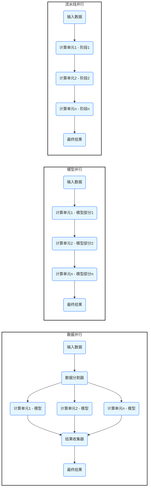

# 大规模推理任务的并行处理策略

> 关键词：大规模推理任务、并行处理策略、数据并行、模型并行、流水线并行

> 摘要：本文聚焦于大规模推理任务的并行处理策略。随着人工智能和大数据的发展，大规模推理任务在诸多领域变得愈发常见，其计算复杂度和数据规模对处理效率提出了巨大挑战。并行处理策略成为解决这些问题的关键手段。文章将深入探讨大规模推理任务并行处理的核心概念、算法原理、数学模型，通过项目实战案例展示具体实现过程，分析其实际应用场景，推荐相关的学习工具和资源，最后总结未来发展趋势与挑战，旨在为相关领域的开发者和研究者提供全面且深入的技术参考。

## 1. 背景介绍 
### 1.1 目的和范围
在当今数字化时代，大规模推理任务广泛存在于自然语言处理、计算机视觉、金融风险评估等众多领域。这些任务通常涉及海量的数据和复杂的模型，传统的串行处理方式难以满足实时性和高效性的要求。本文章的目的在于系统地介绍大规模推理任务的并行处理策略，涵盖数据并行、模型并行、流水线并行等多种策略，深入分析其原理、实现方法以及适用场景，帮助读者理解如何根据具体任务选择合适的并行处理策略，以提高推理任务的处理效率和性能。

### 1.2 预期读者
本文预期读者包括人工智能领域的开发者、数据科学家、软件工程师、研究人员以及对大规模推理任务并行处理感兴趣的技术爱好者。无论是初学者希望了解基本概念和方法，还是有一定经验的专业人士寻求深入的技术细节和优化方案，都能从本文中获得有价值的信息。

### 1.3 文档结构概述
本文将按照以下结构展开：首先介绍大规模推理任务并行处理的核心概念，包括不同并行处理策略的定义和联系；接着详细阐述核心算法原理，并给出Python源代码示例；然后介绍相关的数学模型和公式，并结合具体例子进行说明；通过项目实战展示并行处理策略的实际应用，包括开发环境搭建、源代码实现和代码解读；分析大规模推理任务并行处理在实际场景中的应用；推荐相关的学习工具和资源；最后总结未来发展趋势与挑战，并提供常见问题解答和扩展阅读参考资料。

### 1.4 术语表
#### 1.4.1 核心术语定义
- **大规模推理任务**：指处理的数据量巨大、模型复杂度高、计算量庞大的推理任务，如大型语言模型的文本生成、图像识别中的复杂分类任务等。
- **并行处理**：将一个大任务分解为多个子任务，这些子任务可以同时在多个处理器或计算单元上执行，以提高整体处理效率。
- **数据并行**：将输入数据分割成多个子集，每个子集在不同的计算单元上使用相同的模型进行推理，最后将结果合并。
- **模型并行**：将模型分割成多个部分，每个部分在不同的计算单元上进行计算，通过数据在不同部分之间的传递完成整个推理过程。
- **流水线并行**：将推理任务按照计算流程划分为多个阶段，每个阶段在不同的计算单元上执行，数据依次经过各个阶段进行处理。

#### 1.4.2 相关概念解释
- **计算单元**：可以是CPU、GPU、TPU等具有计算能力的硬件设备，也可以是多个硬件设备组成的集群。
- **同步并行**：在并行处理过程中，各个计算单元需要等待其他计算单元完成特定步骤后才能继续执行，确保数据的一致性和计算的正确性。
- **异步并行**：各个计算单元可以独立执行任务，不需要等待其他计算单元，通过消息传递等方式进行数据交互。

#### 1.4.3 缩略词列表
- **CPU**：Central Processing Unit，中央处理器
- **GPU**：Graphics Processing Unit，图形处理器
- **TPU**：Tensor Processing Unit，张量处理器
- **HPC**：High Performance Computing，高性能计算
- **MPI**：Message Passing Interface，消息传递接口

## 2. 核心概念与联系 
### 核心概念原理
#### 数据并行
数据并行的核心思想是将输入数据进行分割，每个计算单元处理一部分数据，使用相同的模型进行推理。例如，在图像分类任务中，假设有1000张图像需要分类，我们可以将这1000张图像平均分成10份，每份100张，分别分配给10个计算单元。每个计算单元使用相同的图像分类模型对自己所分配的100张图像进行分类，最后将结果汇总。数据并行的优点是实现简单，适合于数据量较大的任务；缺点是当模型规模非常大时，计算资源的利用率可能不高。

#### 模型并行
模型并行是将模型分割成多个部分，每个计算单元负责处理模型的一部分。以深度神经网络为例，一个具有多个隐藏层的神经网络可以按照层进行分割，不同的计算单元负责不同的层。数据在不同的计算单元之间传递，依次经过各个部分完成整个推理过程。模型并行的优点是可以处理非常大的模型，充分利用多个计算单元的计算资源；缺点是实现复杂度较高，数据在不同计算单元之间的传递会带来一定的通信开销。

#### 流水线并行
流水线并行是将推理任务按照计算流程划分为多个阶段，每个阶段在不同的计算单元上执行。例如，在一个自然语言处理任务中，推理过程可以分为词法分析、句法分析、语义理解等阶段，每个阶段由一个计算单元负责。数据依次经过各个阶段进行处理，就像工厂中的流水线一样。流水线并行的优点是可以提高计算资源的利用率，减少计算单元的空闲时间；缺点是需要合理划分阶段，否则会导致流水线不平衡，影响整体性能。

### 架构的文本示意图
```plaintext
数据并行：
输入数据 -> 数据分割器 -> 计算单元1（模型） -> 结果收集器 -> 最终结果
                |
                v
            计算单元2（模型）
                |
                v
             ...
                |
                v
            计算单元n（模型）

模型并行：
输入数据 -> 计算单元1（模型部分1） -> 计算单元2（模型部分2） ->... -> 计算单元n（模型部分n） -> 最终结果

流水线并行：
输入数据 -> 计算单元1（阶段1） -> 计算单元2（阶段2） ->... -> 计算单元n（阶段n） -> 最终结果
```

### Mermaid 流程图


## 3. 核心算法原理 & 具体操作步骤 
### 数据并行算法原理及Python代码示例
#### 算法原理
数据并行的基本算法步骤如下：
1. 将输入数据分割成多个子集。
2. 将每个子集分配给不同的计算单元。
3. 每个计算单元使用相同的模型对分配到的子集进行推理。
4. 收集各个计算单元的推理结果。
5. 合并结果得到最终输出。

#### Python代码示例
```python
import torch
import torch.nn as nn
import torch.optim as optim
from torch.utils.data import DataLoader, Dataset

# 定义一个简单的神经网络模型
class SimpleModel(nn.Module):
    def __init__(self):
        super(SimpleModel, self).__init__()
        self.fc = nn.Linear(10, 1)

    def forward(self, x):
        return self.fc(x)

# 定义一个简单的数据集
class SimpleDataset(Dataset):
    def __init__(self, num_samples):
        self.data = torch.randn(num_samples, 10)

    def __len__(self):
        return len(self.data)

    def __getitem__(self, idx):
        return self.data[idx]

# 数据并行处理
def data_parallel_processing(num_samples, num_gpus):
    # 创建数据集和数据加载器
    dataset = SimpleDataset(num_samples)
    dataloader = DataLoader(dataset, batch_size=num_samples // num_gpus)

    # 创建模型并将其移到GPU上
    model = SimpleModel()
    if torch.cuda.is_available() and num_gpus > 1:
        model = nn.DataParallel(model, device_ids=list(range(num_gpus)))
    model = model.cuda()

    # 推理过程
    results = []
    for data in dataloader:
        data = data.cuda()
        output = model(data)
        results.append(output.cpu())

    # 合并结果
    final_result = torch.cat(results, dim=0)
    return final_result

# 示例运行
num_samples = 1000
num_gpus = 2
result = data_parallel_processing(num_samples, num_gpus)
print(result.shape)
```

### 模型并行算法原理及Python代码示例
#### 算法原理
模型并行的基本算法步骤如下：
1. 将模型分割成多个部分。
2. 将每个部分分配到不同的计算单元。
3. 输入数据依次经过各个计算单元的模型部分进行计算。
4. 最终得到推理结果。

#### Python代码示例
```python
import torch
import torch.nn as nn

# 定义一个简单的神经网络模型并进行分割
class Part1Model(nn.Module):
    def __init__(self):
        super(Part1Model, self).__init__()
        self.fc1 = nn.Linear(10, 20)

    def forward(self, x):
        return self.fc1(x)

class Part2Model(nn.Module):
    def __init__(self):
        super(Part2Model, self).__init__()
        self.fc2 = nn.Linear(20, 1)

    def forward(self, x):
        return self.fc2(x)

# 模型并行处理
def model_parallel_processing(input_data):
    # 创建模型并将其移到不同的GPU上
    part1_model = Part1Model().cuda(0)
    part2_model = Part2Model().cuda(1)

    # 输入数据移到第一个GPU
    input_data = input_data.cuda(0)

    # 第一部分计算
    output_part1 = part1_model(input_data)

    # 将中间结果移到第二个GPU
    output_part1 = output_part1.cuda(1)

    # 第二部分计算
    final_output = part2_model(output_part1)

    return final_output.cpu()

# 示例运行
input_data = torch.randn(100, 10)
result = model_parallel_processing(input_data)
print(result.shape)
```

### 流水线并行算法原理及Python代码示例
#### 算法原理
流水线并行的基本算法步骤如下：
1. 将推理任务划分为多个阶段。
2. 每个阶段由一个计算单元负责。
3. 输入数据依次进入各个阶段进行处理。
4. 最终得到推理结果。

#### Python代码示例
```python
import torch
import torch.nn as nn
import queue
import threading

# 定义各个阶段的模型
class Stage1Model(nn.Module):
    def __init__(self):
        super(Stage1Model, self).__init__()
        self.fc1 = nn.Linear(10, 20)

    def forward(self, x):
        return self.fc1(x)

class Stage2Model(nn.Module):
    def __init__(self):
        super(Stage2Model, self).__init__()
        self.fc2 = nn.Linear(20, 1)

    def forward(self, x):
        return self.fc2(x)

# 定义流水线并行处理的线程函数
def stage_worker(input_queue, output_queue, model, device):
    while True:
        item = input_queue.get()
        if item is None:
            break
        data = item.to(device)
        output = model(data)
        output_queue.put(output.cpu())

# 流水线并行处理
def pipeline_parallel_processing(input_data):
    # 创建输入和输出队列
    input_queue_1 = queue.Queue()
    output_queue_1 = queue.Queue()
    output_queue_2 = queue.Queue()

    # 创建模型并将其移到不同的GPU上
    stage1_model = Stage1Model().cuda(0)
    stage2_model = Stage2Model().cuda(1)

    # 创建线程
    thread1 = threading.Thread(target=stage_worker, args=(input_queue_1, output_queue_1, stage1_model, 0))
    thread2 = threading.Thread(target=stage_worker, args=(output_queue_1, output_queue_2, stage2_model, 1))

    # 启动线程
    thread1.start()
    thread2.start()

    # 将输入数据放入队列
    for data in input_data:
        input_queue_1.put(data)

    # 发送结束信号
    input_queue_1.put(None)

    # 等待线程结束
    thread1.join()
    output_queue_1.put(None)
    thread2.join()

    # 收集结果
    results = []
    while not output_queue_2.empty():
        results.append(output_queue_2.get())

    final_result = torch.cat(results, dim=0)
    return final_result

# 示例运行
input_data = [torch.randn(10, 10) for _ in range(10)]
result = pipeline_parallel_processing(input_data)
print(result.shape)
```

## 4. 数学模型和公式 & 详细讲解 & 举例说明 
### 数据并行的数学模型
假设我们有一个输入数据集 $D = \{x_1, x_2,..., x_N\}$，其中 $N$ 是数据样本的数量。模型 $f$ 是一个可微分的函数，用于对输入数据进行推理。在数据并行中，我们将数据集 $D$ 分割成 $M$ 个子集 $D_1, D_2,..., D_M$，每个子集的大小为 $n_i$，且 $\sum_{i=1}^{M} n_i = N$。

每个计算单元 $i$ 对其分配的子集 $D_i$ 进行推理，得到结果 $y_i = f(D_i)$。最终的结果 $Y$ 是所有计算单元结果的合并，即 $Y = \bigcup_{i=1}^{M} y_i$。

例如，假设我们有一个线性回归模型 $f(x) = Wx + b$，其中 $W$ 是权重矩阵，$b$ 是偏置向量。输入数据集 $D$ 是一个 $N \times d$ 的矩阵，其中 $d$ 是特征维度。在数据并行中，我们将 $D$ 分割成 $M$ 个 $n_i \times d$ 的子矩阵 $D_i$，每个计算单元计算 $y_i = W D_i + b$，最后将所有 $y_i$ 合并得到最终结果。

### 模型并行的数学模型
假设我们有一个复杂的模型 $f$ 可以分解为 $K$ 个部分 $f_1, f_2,..., f_K$，即 $f(x) = f_K(f_{K-1}(...(f_1(x))...))$。输入数据 $x$ 依次经过各个部分进行计算。

每个计算单元 $j$ 负责模型的一部分 $f_j$。输入数据 $x$ 首先被送到计算单元 1 进行计算，得到 $x_1 = f_1(x)$。然后 $x_1$ 被传递到计算单元 2 进行计算，得到 $x_2 = f_2(x_1)$，以此类推，直到最后一个计算单元 $K$ 得到最终结果 $y = f_K(x_{K-1})$。

例如，考虑一个具有两个隐藏层的神经网络模型。第一个隐藏层的计算可以表示为 $h_1 = \sigma(W_1x + b_1)$，其中 $\sigma$ 是激活函数，$W_1$ 是第一个隐藏层的权重矩阵，$b_1$ 是偏置向量。第二个隐藏层的计算可以表示为 $h_2 = \sigma(W_2h_1 + b_2)$。在模型并行中，计算单元 1 负责计算 $h_1$，计算单元 2 负责计算 $h_2$。

### 流水线并行的数学模型
假设推理任务可以划分为 $L$ 个阶段 $s_1, s_2,..., s_L$。每个阶段 $s_j$ 对应一个计算函数 $g_j$。输入数据 $x$ 依次经过各个阶段进行处理。

在第 $t$ 个时间步，第 $j$ 个阶段的输入是前一个阶段在第 $t - 1$ 个时间步的输出（如果 $j > 1$），即 $x_{j,t} = g_{j - 1}(x_{j - 1,t - 1})$（当 $j > 1$ 时），$x_{1,t}$ 是新的输入数据。最终结果是最后一个阶段在第 $T$ 个时间步的输出，即 $y = g_L(x_{L,T})$。

例如，在一个自然语言处理任务中，第一个阶段是词法分析，第二个阶段是句法分析，第三个阶段是语义理解。输入文本首先经过词法分析得到词法分析结果，然后将词法分析结果作为输入进行句法分析，最后将句法分析结果作为输入进行语义理解得到最终的语义理解结果。

## 5. 项目实战：代码实际案例和详细解释说明 
### 5.1  开发环境搭建
#### 硬件环境
- **CPU**：推荐使用多核CPU，如Intel Xeon系列，以提供足够的计算能力。
- **GPU**：如果进行大规模推理任务，建议使用NVIDIA GPU，如NVIDIA Tesla V100、NVIDIA RTX 3090等。确保GPU驱动程序已正确安装。
- **内存**：根据任务的规模和数据量，建议使用16GB以上的内存。

#### 软件环境
- **操作系统**：推荐使用Linux系统，如Ubuntu 18.04或更高版本。
- **Python**：安装Python 3.7或更高版本。
- **深度学习框架**：安装PyTorch或TensorFlow等深度学习框架。以PyTorch为例，可以使用以下命令进行安装：
```bash
pip install torch torchvision torchaudio
```
- **MPI**：如果需要进行分布式并行处理，安装MPI库，如OpenMPI：
```bash
sudo apt-get install openmpi-bin openmpi-doc libopenmpi-dev
```

### 5.2  源代码详细实现和代码解读
#### 数据并行示例
```python
import torch
import torch.nn as nn
import torch.optim as optim
from torch.utils.data import DataLoader, Dataset

# 定义一个简单的神经网络模型
class SimpleModel(nn.Module):
    def __init__(self):
        super(SimpleModel, self).__init__()
        self.fc = nn.Linear(10, 1)

    def forward(self, x):
        return self.fc(x)

# 定义一个简单的数据集
class SimpleDataset(Dataset):
    def __init__(self, num_samples):
        self.data = torch.randn(num_samples, 10)

    def __len__(self):
        return len(self.data)

    def __getitem__(self, idx):
        return self.data[idx]

# 数据并行处理
def data_parallel_processing(num_samples, num_gpus):
    # 创建数据集和数据加载器
    dataset = SimpleDataset(num_samples)
    dataloader = DataLoader(dataset, batch_size=num_samples // num_gpus)

    # 创建模型并将其移到GPU上
    model = SimpleModel()
    if torch.cuda.is_available() and num_gpus > 1:
        model = nn.DataParallel(model, device_ids=list(range(num_gpus)))
    model = model.cuda()

    # 推理过程
    results = []
    for data in dataloader:
        data = data.cuda()
        output = model(data)
        results.append(output.cpu())

    # 合并结果
    final_result = torch.cat(results, dim=0)
    return final_result

# 示例运行
num_samples = 1000
num_gpus = 2
result = data_parallel_processing(num_samples, num_gpus)
print(result.shape)
```
**代码解读**：
1. **模型定义**：`SimpleModel` 是一个简单的线性回归模型，包含一个全连接层。
2. **数据集定义**：`SimpleDataset` 是一个简单的数据集，生成随机的输入数据。
3. **数据并行处理**：
    - 创建数据集和数据加载器，将数据分割成多个批次。
    - 使用 `nn.DataParallel` 将模型包装成数据并行模型，将其移到GPU上。
    - 遍历数据加载器，将数据移到GPU上进行推理，将结果移到CPU上并收集。
    - 最后将所有结果合并得到最终结果。

#### 模型并行示例
```python
import torch
import torch.nn as nn

# 定义一个简单的神经网络模型并进行分割
class Part1Model(nn.Module):
    def __init__(self):
        super(Part1Model, self).__init__()
        self.fc1 = nn.Linear(10, 20)

    def forward(self, x):
        return self.fc1(x)

class Part2Model(nn.Module):
    def __init__(self):
        super(Part2Model, self).__init__()
        self.fc2 = nn.Linear(20, 1)

    def forward(self, x):
        return self.fc2(x)

# 模型并行处理
def model_parallel_processing(input_data):
    # 创建模型并将其移到不同的GPU上
    part1_model = Part1Model().cuda(0)
    part2_model = Part2Model().cuda(1)

    # 输入数据移到第一个GPU
    input_data = input_data.cuda(0)

    # 第一部分计算
    output_part1 = part1_model(input_data)

    # 将中间结果移到第二个GPU
    output_part1 = output_part1.cuda(1)

    # 第二部分计算
    final_output = part2_model(output_part1)

    return final_output.cpu()

# 示例运行
input_data = torch.randn(100, 10)
result = model_parallel_processing(input_data)
print(result.shape)
```
**代码解读**：
1. **模型分割**：将一个简单的神经网络模型分割成两个部分，`Part1Model` 和 `Part2Model`。
2. **模型并行处理**：
    - 将两个模型分别移到不同的GPU上。
    - 将输入数据移到第一个GPU上进行第一部分计算。
    - 将中间结果移到第二个GPU上进行第二部分计算。
    - 最后将最终结果移到CPU上。

#### 流水线并行示例
```python
import torch
import torch.nn as nn
import queue
import threading

# 定义各个阶段的模型
class Stage1Model(nn.Module):
    def __init__(self):
        super(Stage1Model, self).__init__()
        self.fc1 = nn.Linear(10, 20)

    def forward(self, x):
        return self.fc1(x)

class Stage2Model(nn.Module):
    def __init__(self):
        super(Stage2Model, self).__init__()
        self.fc2 = nn.Linear(20, 1)

    def forward(self, x):
        return self.fc2(x)

# 定义流水线并行处理的线程函数
def stage_worker(input_queue, output_queue, model, device):
    while True:
        item = input_queue.get()
        if item is None:
            break
        data = item.to(device)
        output = model(data)
        output_queue.put(output.cpu())

# 流水线并行处理
def pipeline_parallel_processing(input_data):
    # 创建输入和输出队列
    input_queue_1 = queue.Queue()
    output_queue_1 = queue.Queue()
    output_queue_2 = queue.Queue()

    # 创建模型并将其移到不同的GPU上
    stage1_model = Stage1Model().cuda(0)
    stage2_model = Stage2Model().cuda(1)

    # 创建线程
    thread1 = threading.Thread(target=stage_worker, args=(input_queue_1, output_queue_1, stage1_model, 0))
    thread2 = threading.Thread(target=stage_worker, args=(output_queue_1, output_queue_2, stage2_model, 1))

    # 启动线程
    thread1.start()
    thread2.start()

    # 将输入数据放入队列
    for data in input_data:
        input_queue_1.put(data)

    # 发送结束信号
    input_queue_1.put(None)

    # 等待线程结束
    thread1.join()
    output_queue_1.put(None)
    thread2.join()

    # 收集结果
    results = []
    while not output_queue_2.empty():
        results.append(output_queue_2.get())

    final_result = torch.cat(results, dim=0)
    return final_result

# 示例运行
input_data = [torch.randn(10, 10) for _ in range(10)]
result = pipeline_parallel_processing(input_data)
print(result.shape)
```
**代码解读**：
1. **阶段模型定义**：定义了两个阶段的模型 `Stage1Model` 和 `Stage2Model`。
2. **线程函数**：`stage_worker` 函数用于处理每个阶段的计算，从输入队列中获取数据，进行计算，并将结果放入输出队列。
3. **流水线并行处理**：
    - 创建输入和输出队列，将模型分别移到不同的GPU上。
    - 创建线程并启动，将输入数据放入第一个阶段的输入队列。
    - 发送结束信号，等待线程结束。
    - 收集最终结果并合并。

### 5.3  代码解读与分析
#### 数据并行
- **优点**：实现简单，适合数据量较大的任务。可以充分利用多个GPU的计算资源，提高推理速度。
- **缺点**：当模型规模非常大时，计算资源的利用率可能不高，因为每个GPU都需要存储完整的模型。

#### 模型并行
- **优点**：可以处理非常大的模型，充分利用多个计算单元的计算资源。
- **缺点**：实现复杂度较高，数据在不同计算单元之间的传递会带来一定的通信开销。需要合理分割模型，否则会影响性能。

#### 流水线并行
- **优点**：可以提高计算资源的利用率，减少计算单元的空闲时间。适合推理任务可以划分为多个阶段的情况。
- **缺点**：需要合理划分阶段，否则会导致流水线不平衡，影响整体性能。线程之间的同步和通信也会带来一定的开销。

## 6. 实际应用场景 
### 自然语言处理
在自然语言处理领域，大规模推理任务如文本生成、机器翻译等通常需要处理大量的文本数据和复杂的模型。数据并行可以将输入文本分割成多个批次，在多个GPU上同时进行推理，提高处理速度。模型并行可以将大型语言模型分割成多个部分，分布在不同的计算单元上进行计算，以处理模型规模过大的问题。流水线并行可以将推理过程划分为词法分析、句法分析、语义理解等阶段，每个阶段由一个计算单元负责，提高计算资源的利用率。

### 计算机视觉
在计算机视觉领域，图像识别、目标检测等任务通常需要处理大量的图像数据和复杂的卷积神经网络模型。数据并行可以将图像数据分割成多个子集，在多个GPU上同时进行推理。模型并行可以将大型卷积神经网络模型分割成多个部分，分布在不同的计算单元上进行计算。流水线并行可以将图像预处理、特征提取、分类等阶段分别由不同的计算单元负责，提高推理效率。

### 金融风险评估
在金融领域，风险评估任务需要处理大量的金融数据和复杂的风险评估模型。数据并行可以将金融数据分割成多个子集，在多个计算单元上同时进行风险评估。模型并行可以将大型风险评估模型分割成多个部分，分布在不同的计算单元上进行计算。流水线并行可以将数据预处理、特征提取、模型预测等阶段分别由不同的计算单元负责，提高评估效率。

## 7. 工具和资源推荐
### 7.1 学习资源推荐
#### 7.1.1 书籍推荐
- 《深度学习》（Deep Learning）：由Ian Goodfellow、Yoshua Bengio和Aaron Courville所著，是深度学习领域的经典教材，涵盖了深度学习的基本概念、算法和应用。
- 《Python深度学习》（Deep Learning with Python）：由Francois Chollet所著，以Python和Keras为基础，介绍了深度学习的实践方法和应用案例。
- 《并行计算》（Parallel Computing）：由Ian Foster所著，介绍了并行计算的基本概念、算法和编程模型，对于理解大规模推理任务的并行处理有很大帮助。

#### 7.1.2 在线课程
- Coursera上的“深度学习专项课程”（Deep Learning Specialization）：由Andrew Ng教授授课，涵盖了深度学习的各个方面，包括神经网络、卷积神经网络、循环神经网络等。
- edX上的“并行计算导论”（Introduction to Parallel Computing）：介绍了并行计算的基本概念、算法和编程模型，适合初学者学习。
- Udemy上的“PyTorch深度学习实战”（Deep Learning with PyTorch）：以PyTorch为基础，介绍了深度学习的实践方法和应用案例。

#### 7.1.3 技术博客和网站
- arXiv：一个预印本平台，提供了大量的计算机科学和人工智能领域的研究论文，包括大规模推理任务并行处理的最新研究成果。
- Medium：一个技术博客平台，有很多关于深度学习和并行计算的优质文章。
- Towards Data Science：专注于数据科学和机器学习领域的技术博客，提供了很多实用的教程和案例。

### 7.2 开发工具框架推荐
#### 7.2.1 IDE和编辑器
- PyCharm：一个专业的Python集成开发环境，提供了代码编辑、调试、版本控制等功能，适合Python开发。
- Visual Studio Code：一个轻量级的代码编辑器，支持多种编程语言和插件，具有丰富的扩展功能。
- Jupyter Notebook：一个交互式的笔记本环境，适合进行数据分析和模型实验，支持Python、R等多种编程语言。

#### 7.2.2 调试和性能分析工具
- PyTorch Profiler：PyTorch提供的性能分析工具，可以帮助开发者分析模型的性能瓶颈，优化代码。
- NVIDIA Nsight Systems：NVIDIA提供的性能分析工具，可以对GPU应用程序进行性能分析和调试。
- TensorBoard：TensorFlow提供的可视化工具，可以帮助开发者可视化模型的训练过程和性能指标。

#### 7.2.3 相关框架和库
- PyTorch：一个开源的深度学习框架，提供了丰富的神经网络层和优化算法，支持数据并行、模型并行等并行处理策略。
- TensorFlow：另一个开源的深度学习框架，具有强大的分布式训练和推理能力，支持多种并行处理策略。
- Horovod：一个用于分布式深度学习的开源框架，支持PyTorch、TensorFlow等多种深度学习框架，提供了简单易用的接口实现数据并行和模型并行。

### 7.3 相关论文著作推荐
#### 7.3.1 经典论文
- “ImageNet Classification with Deep Convolutional Neural Networks”：Alex Krizhevsky等人发表的论文，介绍了AlexNet卷积神经网络，开启了深度学习在计算机视觉领域的应用热潮。
- “Attention Is All You Need”：Ashish Vaswani等人发表的论文，提出了Transformer模型，在自然语言处理领域取得了巨大成功。
- “Distributed Representations of Words and Phrases and their Compositionality”：Tomas Mikolov等人发表的论文，介绍了Word2Vec模型，用于学习词的分布式表示。

#### 7.3.2 最新研究成果
- 关注arXiv上关于大规模推理任务并行处理的最新研究论文，如关于高效模型并行算法、流水线并行优化策略等方面的研究。
- 关注顶级学术会议如NeurIPS、ICML、CVPR等上的相关研究成果。

#### 7.3.3 应用案例分析
- 一些科技公司的技术博客会分享大规模推理任务并行处理的应用案例，如Google、Facebook、NVIDIA等公司的博客。
- 一些开源项目的文档和README文件中也会介绍并行处理策略的应用案例，如Hugging Face的Transformers库。

## 8. 总结：未来发展趋势与挑战
### 未来发展趋势
#### 更高效的并行算法
随着硬件技术的不断发展，未来将出现更高效的并行算法，能够更好地利用多核CPU、GPU和TPU等计算资源，提高大规模推理任务的处理效率。例如，研究人员可能会开发出更智能的模型分割算法和流水线调度算法，减少通信开销和计算单元的空闲时间。

#### 混合并行策略
单一的并行处理策略可能无法满足所有大规模推理任务的需求，未来将更多地采用混合并行策略，结合数据并行、模型并行和流水线并行的优点，以实现更高的性能和效率。例如，在处理非常大的模型和海量数据时，可以先采用模型并行将模型分割成多个部分，再对每个部分采用数据并行进行计算，同时使用流水线并行提高计算资源的利用率。

#### 硬件与软件的协同优化
未来的大规模推理任务并行处理将更加注重硬件与软件的协同优化。硬件厂商将设计出更适合并行计算的芯片架构，软件开发者将根据硬件特性优化并行算法和框架，以实现更好的性能和能效比。例如，NVIDIA的GPU和TPU等硬件设备不断推出新的架构和功能，深度学习框架也会不断优化以充分利用这些硬件特性。

#### 分布式并行计算
随着云计算和集群计算的发展，分布式并行计算将成为大规模推理任务处理的主流方式。多个计算节点可以通过网络连接组成一个分布式集群，共同完成大规模推理任务。未来将出现更高效的分布式并行计算框架和通信协议，减少节点之间的通信开销，提高分布式系统的性能和可靠性。

### 挑战
#### 通信开销
在并行处理过程中，数据在不同计算单元之间的传递会带来一定的通信开销。当计算单元数量增多或数据量增大时，通信开销可能会成为性能瓶颈。如何减少通信开销，提高通信效率，是大规模推理任务并行处理面临的一个重要挑战。

#### 负载均衡
在并行处理中，各个计算单元的负载均衡是保证整体性能的关键。如果负载不均衡，会导致部分计算单元空闲，而部分计算单元过载，从而影响整体处理效率。如何实现负载均衡，是大规模推理任务并行处理需要解决的一个难题。

#### 模型分割和流水线划分
在模型并行和流水线并行中，合理的模型分割和流水线划分是保证性能的关键。如果分割或划分不合理，会导致计算单元之间的通信频繁、计算单元空闲时间增加等问题，影响整体性能。如何进行合理的模型分割和流水线划分，是大规模推理任务并行处理需要研究的一个重要问题。

#### 系统复杂性
并行处理系统的复杂性随着计算单元数量和任务规模的增大而增加。系统的管理、调度、容错等方面都面临着挑战。如何设计出简单易用、高效可靠的并行处理系统，是大规模推理任务并行处理需要解决的一个重要问题。

## 9. 附录：常见问题与解答
### 问题1：数据并行和模型并行有什么区别？
**解答**：数据并行是将输入数据分割成多个子集，每个计算单元处理一部分数据，使用相同的模型进行推理；而模型并行是将模型分割成多个部分，每个计算单元负责处理模型的一部分，数据在不同的计算单元之间传递完成整个推理过程。数据并行适合数据量较大的任务，模型并行适合模型规模较大的任务。

### 问题2：流水线并行和数据并行、模型并行可以结合使用吗？
**解答**：可以。流水线并行可以和数据并行、模型并行结合使用，形成混合并行策略。例如，可以先采用模型并行将模型分割成多个部分，再对每个部分采用数据并行进行计算，同时使用流水线并行将推理过程划分为多个阶段，提高计算资源的利用率。

### 问题3：如何选择合适的并行处理策略？
**解答**：选择合适的并行处理策略需要考虑多个因素，如数据量、模型规模、计算资源等。如果数据量较大，模型规模较小，可以选择数据并行；如果模型规模较大，数据量相对较小，可以选择模型并行；如果推理任务可以划分为多个阶段，可以选择流水线并行。在实际应用中，也可以根据具体情况采用混合并行策略。

### 问题4：并行处理会增加代码的复杂度吗？
**解答**：并行处理会增加代码的复杂度。数据并行相对简单，只需要将模型包装成数据并行模型，将数据分割成多个批次进行处理即可。而模型并行和流水线并行需要对模型进行分割，处理数据在不同计算单元之间的传递和同步，代码实现相对复杂。但是，一些深度学习框架提供了简单易用的接口，可以帮助开发者降低并行处理代码的复杂度。

## 10. 扩展阅读 & 参考资料
### 扩展阅读
- 《高性能计算实战》：介绍了高性能计算的基本概念、算法和应用，对于理解大规模推理任务的并行处理有很大帮助。
- 《深度学习实战：基于Python和PyTorch》：以PyTorch为基础，介绍了深度学习的实践方法和应用案例，包括并行处理策略的应用。
- 《人工智能：一种现代的方法》：涵盖了人工智能的各个方面，包括机器学习、深度学习、自然语言处理等，对于了解大规模推理任务的背景和应用有很大帮助。

### 参考资料
- PyTorch官方文档：https://pytorch.org/docs/stable/index.html
- TensorFlow官方文档：https://www.tensorflow.org/api_docs
- Horovod官方文档：https://horovod.readthedocs.io/en/stable/
- NVIDIA官方文档：https://docs.nvidia.com/

作者：AI天才研究院/AI Genius Institute & 禅与计算机程序设计艺术 /Zen And The Art of Computer Programming