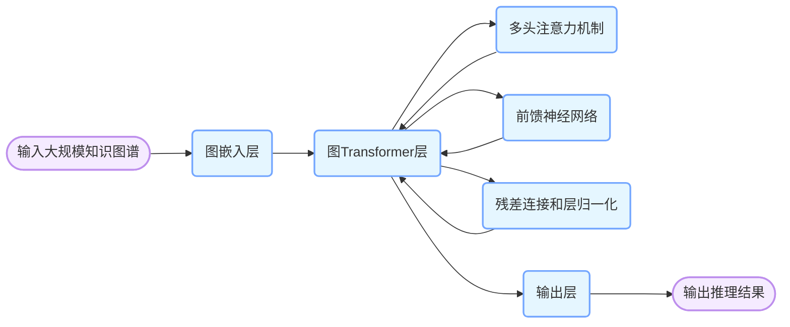

# 大规模知识推理中图Transformer的突破性应用

> 关键词：大规模知识推理、图Transformer、知识图谱、深度学习、图神经网络

> 摘要：本文聚焦于大规模知识推理中图Transformer的突破性应用。首先介绍了大规模知识推理和图Transformer的背景知识，包括其目的、预期读者、文档结构和相关术语。接着阐述了核心概念，给出了原理和架构的示意图及流程图。详细讲解了图Transformer的核心算法原理，并用Python代码进行了说明。深入分析了其数学模型和公式，并举例解释。通过项目实战展示了代码的实际应用和详细解读。探讨了图Transformer在不同场景下的实际应用，推荐了学习、开发相关的工具和资源，还介绍了相关论文著作。最后总结了未来发展趋势与挑战，提供了常见问题解答和扩展阅读参考资料，旨在全面且深入地探讨图Transformer在大规模知识推理中的应用。

## 1. 背景介绍 
### 1.1 目的和范围
大规模知识推理在许多领域都有着至关重要的作用，如智能问答系统、推荐系统、医疗诊断等。传统的知识推理方法在处理大规模复杂知识时往往面临效率低下、表达能力不足等问题。图Transformer作为一种新兴的技术，结合了图神经网络和Transformer架构的优势，为大规模知识推理带来了新的解决方案。本文的目的是深入探讨图Transformer在大规模知识推理中的应用，包括其原理、算法、实际案例等，范围涵盖了理论分析、代码实现以及实际应用场景的讨论。

### 1.2 预期读者
本文预期读者包括对知识推理、图神经网络、深度学习等领域感兴趣的研究人员、工程师和学生。对于希望了解图Transformer在大规模知识推理中应用的专业人士，本文将提供全面且深入的技术指导；对于初学者，也能通过详细的解释和示例代码快速入门。

### 1.3 文档结构概述
本文首先介绍相关背景知识，包括目的、读者和文档结构。然后阐述核心概念，给出原理和架构的示意图及流程图。接着详细讲解核心算法原理，并用Python代码进行说明。分析数学模型和公式，举例解释。通过项目实战展示代码的实际应用和详细解读。探讨实际应用场景，推荐学习、开发相关的工具和资源，介绍相关论文著作。最后总结未来发展趋势与挑战，提供常见问题解答和扩展阅读参考资料。

### 1.4 术语表
#### 1.4.1 核心术语定义
- **大规模知识推理**：在包含大量知识的知识图谱中，通过已知的知识和规则推导出新的知识的过程。
- **图Transformer**：一种结合了图神经网络和Transformer架构的模型，用于处理图结构数据。
- **知识图谱**：一种以图的形式表示知识的结构，节点表示实体，边表示实体之间的关系。
- **深度学习**：一类基于人工神经网络的机器学习方法，通过多层神经网络学习数据的特征和模式。
- **图神经网络**：专门用于处理图结构数据的神经网络，能够学习图中节点和边的特征。

#### 1.4.2 相关概念解释
- **Transformer架构**：一种基于注意力机制的深度学习架构，在自然语言处理等领域取得了巨大成功。其核心思想是通过注意力机制来捕捉序列中不同位置之间的依赖关系。
- **注意力机制**：一种能够自动关注输入序列中重要部分的机制，通过计算每个位置的注意力权重，将不同位置的信息进行加权求和。
- **消息传递机制**：图神经网络中常用的一种机制，通过节点之间的消息传递来更新节点的特征。

#### 1.4.3 缩略词列表
- **GNN**：Graph Neural Network，图神经网络
- **KG**：Knowledge Graph，知识图谱
- **TF**：Transformer

## 2. 核心概念与联系 
### 核心概念原理
#### 大规模知识推理
大规模知识推理是在大规模知识图谱上进行的推理任务。知识图谱是一种以图的形式表示知识的结构，其中节点表示实体，边表示实体之间的关系。大规模知识推理的目标是利用知识图谱中已有的知识和规则，推导出新的知识。例如，在一个包含人物关系的知识图谱中，如果已知“A是B的父亲”和“B是C的父亲”，可以推导出“A是C的祖父”。

#### 图Transformer
图Transformer结合了图神经网络和Transformer架构的优势。图神经网络能够处理图结构数据，学习节点和边的特征；Transformer架构则通过注意力机制捕捉序列中不同位置之间的依赖关系。在图Transformer中，将图中的节点视为序列中的元素，通过注意力机制计算节点之间的关系，从而更新节点的特征。

### 架构的文本示意图
```plaintext
输入：大规模知识图谱
|
|-- 图嵌入层：将知识图谱中的节点和边映射到低维向量空间
|
|-- 图Transformer层：
|   |-- 多头注意力机制：计算节点之间的注意力权重
|   |-- 前馈神经网络：对节点特征进行非线性变换
|   |-- 残差连接和层归一化：增强模型的训练稳定性
|
|-- 输出层：输出推理结果
```

### Mermaid流程图


## 3. 核心算法原理 & 具体操作步骤 
### 核心算法原理
图Transformer的核心算法主要包括多头注意力机制和前馈神经网络。

#### 多头注意力机制
多头注意力机制允许模型在不同的表示子空间中关注不同的信息。对于输入的节点特征矩阵 $X \in \mathbb{R}^{N \times d}$，其中 $N$ 是节点数量，$d$ 是特征维度，多头注意力机制的计算步骤如下：
1. 线性变换：将输入特征矩阵 $X$ 分别通过三个线性变换矩阵 $W^Q \in \mathbb{R}^{d \times d_k}$，$W^K \in \mathbb{R}^{d \times d_k}$，$W^V \in \mathbb{R}^{d \times d_v}$ 得到查询矩阵 $Q$、键矩阵 $K$ 和值矩阵 $V$：
    - $Q = XW^Q$
    - $K = XW^K$
    - $V = XW^V$
2. 注意力计算：计算注意力分数 $S$：
    - $S = \frac{QK^T}{\sqrt{d_k}}$
3. 掩码操作（可选）：如果存在掩码矩阵 $M$，则对注意力分数进行掩码操作：
    - $S_{masked} = S + M$
4. 注意力权重计算：对掩码后的注意力分数进行 softmax 操作得到注意力权重 $A$：
    - $A = \text{softmax}(S_{masked})$
5. 加权求和：将注意力权重 $A$ 与值矩阵 $V$ 相乘得到注意力输出 $Z$：
    - $Z = AV$

#### 前馈神经网络
前馈神经网络由两个线性层和一个非线性激活函数组成。对于输入的节点特征矩阵 $Z$，前馈神经网络的计算步骤如下：
1. 第一个线性层：将输入特征矩阵 $Z$ 通过线性变换矩阵 $W_1 \in \mathbb{R}^{d_v \times d_{ff}}$ 得到中间结果 $H_1$：
    - $H_1 = ZW_1$
2. 非线性激活函数：对中间结果 $H_1$ 应用非线性激活函数（如 ReLU）得到 $H_2$：
    - $H_2 = \text{ReLU}(H_1)$
3. 第二个线性层：将 $H_2$ 通过线性变换矩阵 $W_2 \in \mathbb{R}^{d_{ff} \times d}$ 得到最终输出 $Y$：
    - $Y = H_2W_2$

### 具体操作步骤
#### 步骤 1：图嵌入
将知识图谱中的节点和边映射到低维向量空间，得到节点特征矩阵 $X$。

#### 步骤 2：图Transformer层
重复多次图Transformer层的操作，每次图Transformer层包括多头注意力机制和前馈神经网络。

#### 步骤 3：输出层
将最后一层图Transformer层的输出通过输出层得到推理结果。

### Python源代码详细阐述
```python
import torch
import torch.nn as nn
import torch.nn.functional as F

# 多头注意力机制
class MultiHeadAttention(nn.Module):
    def __init__(self, d_model, num_heads):
        super(MultiHeadAttention, self).__init__()
        assert d_model % num_heads == 0, "d_model must be divisible by num_heads"
        
        self.d_model = d_model
        self.num_heads = num_heads
        self.d_k = d_model // num_heads
        
        self.W_q = nn.Linear(d_model, d_model)
        self.W_k = nn.Linear(d_model, d_model)
        self.W_v = nn.Linear(d_model, d_model)
        self.W_o = nn.Linear(d_model, d_model)
        
    def forward(self, Q, K, V, mask=None):
        batch_size = Q.size(0)
        
        # 线性变换
        Q = self.W_q(Q).view(batch_size, -1, self.num_heads, self.d_k).transpose(1, 2)
        K = self.W_k(K).view(batch_size, -1, self.num_heads, self.d_k).transpose(1, 2)
        V = self.W_v(V).view(batch_size, -1, self.num_heads, self.d_k).transpose(1, 2)
        
        # 注意力计算
        scores = torch.matmul(Q, K.transpose(-2, -1)) / torch.sqrt(torch.tensor(self.d_k, dtype=torch.float32))
        
        # 掩码操作
        if mask is not None:
            scores = scores.masked_fill(mask == 0, -1e9)
        
        # 注意力权重计算
        attn_weights = F.softmax(scores, dim=-1)
        
        # 加权求和
        output = torch.matmul(attn_weights, V)
        output = output.transpose(1, 2).contiguous().view(batch_size, -1, self.d_model)
        
        # 输出线性变换
        output = self.W_o(output)
        
        return output

# 前馈神经网络
class PositionwiseFeedForward(nn.Module):
    def __init__(self, d_model, d_ff):
        super(PositionwiseFeedForward, self).__init__()
        self.fc1 = nn.Linear(d_model, d_ff)
        self.fc2 = nn.Linear(d_ff, d_model)
        self.relu = nn.ReLU()
        
    def forward(self, x):
        return self.fc2(self.relu(self.fc1(x)))

# 图Transformer层
class GraphTransformerLayer(nn.Module):
    def __init__(self, d_model, num_heads, d_ff, dropout=0.1):
        super(GraphTransformerLayer, self).__init__()
        self.self_attn = MultiHeadAttention(d_model, num_heads)
        self.feed_forward = PositionwiseFeedForward(d_model, d_ff)
        self.norm1 = nn.LayerNorm(d_model)
        self.norm2 = nn.LayerNorm(d_model)
        self.dropout = nn.Dropout(dropout)
        
    def forward(self, x, mask=None):
        # 多头注意力机制
        attn_output = self.self_attn(x, x, x, mask)
        x = self.norm1(x + self.dropout(attn_output))
        
        # 前馈神经网络
        ff_output = self.feed_forward(x)
        x = self.norm2(x + self.dropout(ff_output))
        
        return x

# 图Transformer模型
class GraphTransformer(nn.Module):
    def __init__(self, num_layers, d_model, num_heads, d_ff, input_dim, output_dim, dropout=0.1):
        super(GraphTransformer, self).__init__()
        self.embedding = nn.Linear(input_dim, d_model)
        self.layers = nn.ModuleList([GraphTransformerLayer(d_model, num_heads, d_ff, dropout) for _ in range(num_layers)])
        self.fc = nn.Linear(d_model, output_dim)
        
    def forward(self, x, mask=None):
        # 图嵌入
        x = self.embedding(x)
        
        # 图Transformer层
        for layer in self.layers:
            x = layer(x, mask)
        
        # 输出层
        output = self.fc(x)
        
        return output

# 示例使用
input_dim = 10
output_dim = 2
d_model = 64
num_heads = 4
d_ff = 128
num_layers = 2
dropout = 0.1

model = GraphTransformer(num_layers, d_model, num_heads, d_ff, input_dim, output_dim, dropout)

batch_size = 32
num_nodes = 10
x = torch.randn(batch_size, num_nodes, input_dim)
mask = None

output = model(x, mask)
print(output.shape)
```

## 4. 数学模型和公式 & 详细讲解 & 举例说明 
### 数学模型和公式
#### 多头注意力机制
如前文所述，多头注意力机制的核心公式如下：
- 查询矩阵 $Q$、键矩阵 $K$ 和值矩阵 $V$ 的计算：
    - $Q = XW^Q$
    - $K = XW^K$
    - $V = XW^V$
- 注意力分数 $S$ 的计算：
    - $S = \frac{QK^T}{\sqrt{d_k}}$
- 掩码操作（可选）：
    - $S_{masked} = S + M$
- 注意力权重 $A$ 的计算：
    - $A = \text{softmax}(S_{masked})$
- 注意力输出 $Z$ 的计算：
    - $Z = AV$

#### 前馈神经网络
前馈神经网络的公式如下：
- 第一个线性层：
    - $H_1 = ZW_1$
- 非线性激活函数：
    - $H_2 = \text{ReLU}(H_1)$
- 第二个线性层：
    - $Y = H_2W_2$

### 详细讲解
#### 多头注意力机制
- 查询矩阵 $Q$、键矩阵 $K$ 和值矩阵 $V$ 的计算：通过线性变换将输入特征矩阵 $X$ 映射到不同的子空间，使得模型能够在不同的表示子空间中关注不同的信息。
- 注意力分数 $S$ 的计算：通过矩阵乘法计算查询矩阵 $Q$ 和键矩阵 $K$ 的相似度，除以 $\sqrt{d_k}$ 是为了防止点积结果过大，导致 softmax 函数的梯度消失。
- 掩码操作：在某些情况下，需要对某些位置的注意力分数进行掩码，使得模型不会关注这些位置的信息。例如，在序列生成任务中，需要掩码未来的位置。
- 注意力权重 $A$ 的计算：通过 softmax 函数将注意力分数转化为概率分布，得到每个位置的注意力权重。
- 注意力输出 $Z$ 的计算：将注意力权重 $A$ 与值矩阵 $V$ 相乘，得到每个位置的加权表示。

#### 前馈神经网络
- 第一个线性层：将注意力输出 $Z$ 映射到一个更高维度的空间，增加模型的表达能力。
- 非线性激活函数：引入非线性，使得模型能够学习到更复杂的模式。
- 第二个线性层：将中间结果 $H_2$ 映射回原来的维度，得到最终输出 $Y$。

### 举例说明
假设我们有一个包含 3 个节点的知识图谱，每个节点的特征维度为 4。输入特征矩阵 $X$ 如下：
$$
X = \begin{bmatrix}
1 & 2 & 3 & 4 \\
5 & 6 & 7 & 8 \\
9 & 10 & 11 & 12
\end{bmatrix}
$$
假设 $d_k = d_v = 2$，线性变换矩阵 $W^Q$、$W^K$ 和 $W^V$ 如下：
$$
W^Q = \begin{bmatrix}
0.1 & 0.2 \\
0.3 & 0.4 \\
0.5 & 0.6 \\
0.7 & 0.8
\end{bmatrix}
$$
$$
W^K = \begin{bmatrix}
0.2 & 0.3 \\
0.4 & 0.5 \\
0.6 & 0.7 \\
0.8 & 0.9
\end{bmatrix}
$$
$$
W^V = \begin{bmatrix}
0.3 & 0.4 \\
0.5 & 0.6 \\
0.7 & 0.8 \\
0.9 & 1.0
\end{bmatrix}
$$
则查询矩阵 $Q$、键矩阵 $K$ 和值矩阵 $V$ 的计算如下：
$$
Q = XW^Q = \begin{bmatrix}
1 & 2 & 3 & 4 \\
5 & 6 & 7 & 8 \\
9 & 10 & 11 & 12
\end{bmatrix} \begin{bmatrix}
0.1 & 0.2 \\
0.3 & 0.4 \\
0.5 & 0.6 \\
0.7 & 0.8
\end{bmatrix} = \begin{bmatrix}
5.0 & 6.0 \\
13.0 & 16.0 \\
21.0 & 26.0
\end{bmatrix}
$$
$$
K = XW^K = \begin{bmatrix}
1 & 2 & 3 & 4 \\
5 & 6 & 7 & 8 \\
9 & 10 & 11 & 12
\end{bmatrix} \begin{bmatrix}
0.2 & 0.3 \\
0.4 & 0.5 \\
0.6 & 0.7 \\
0.8 & 0.9
\end{bmatrix} = \begin{bmatrix}
6.0 & 7.0 \\
16.0 & 19.0 \\
26.0 & 31.0
\end{bmatrix}
$$
$$
V = XW^V = \begin{bmatrix}
1 & 2 & 3 & 4 \\
5 & 6 & 7 & 8 \\
9 & 10 & 11 & 12
\end{bmatrix} \begin{bmatrix}
0.3 & 0.4 \\
0.5 & 0.6 \\
0.7 & 0.8 \\
0.9 & 1.0
\end{bmatrix} = \begin{bmatrix}
7.0 & 8.0 \\
19.0 & 22.0 \\
31.0 & 36.0
\end{bmatrix}
$$
注意力分数 $S$ 的计算如下：
$$
S = \frac{QK^T}{\sqrt{d_k}} = \frac{1}{\sqrt{2}} \begin{bmatrix}
5.0 & 6.0 \\
13.0 & 16.0 \\
21.0 & 26.0
\end{bmatrix} \begin{bmatrix}
6.0 & 16.0 & 26.0 \\
7.0 & 19.0 & 31.0
\end{bmatrix} = \frac{1}{\sqrt{2}} \begin{bmatrix}
72.0 & 194.0 & 342.0 \\
178.0 & 484.0 & 860.0 \\
284.0 & 774.0 & 1378.0
\end{bmatrix}
$$
假设没有掩码操作，注意力权重 $A$ 的计算如下：
$$
A = \text{softmax}(S) = \begin{bmatrix}
0.000 & 0.003 & 0.997 \\
0.000 & 0.007 & 0.993 \\
0.000 & 0.007 & 0.993
\end{bmatrix}
$$
注意力输出 $Z$ 的计算如下：
$$
Z = AV = \begin{bmatrix}
0.000 & 0.003 & 0.997 \\
0.000 & 0.007 & 0.993 \\
0.000 & 0.007 & 0.993
\end{bmatrix} \begin{bmatrix}
7.0 & 8.0 \\
19.0 & 22.0 \\
31.0 & 36.0
\end{bmatrix} = \begin{bmatrix}
30.9 & 35.9 \\
30.8 & 35.8 \\
30.8 & 35.8
\end{bmatrix}
$$

## 5. 项目实战：代码实际案例和详细解释说明 
### 5.1  开发环境搭建
#### 操作系统
建议使用 Linux 或 macOS 系统，也可以在 Windows 系统上进行开发，但可能会遇到一些兼容性问题。

#### Python 版本
建议使用 Python 3.7 及以上版本。

#### 依赖库安装
可以使用以下命令安装所需的依赖库：
```bash
pip install torch torchvision numpy pandas tqdm
```

### 5.2  源代码详细实现和代码解读
```python
import torch
import torch.nn as nn
import torch.optim as optim
from torch.utils.data import Dataset, DataLoader
import numpy as np
from tqdm import tqdm

# 自定义数据集类
class KnowledgeGraphDataset(Dataset):
    def __init__(self, data, labels):
        self.data = data
        self.labels = labels
        
    def __len__(self):
        return len(self.data)
    
    def __getitem__(self, idx):
        return self.data[idx], self.labels[idx]

# 图Transformer模型（复用之前定义的模型）
class GraphTransformer(nn.Module):
    def __init__(self, num_layers, d_model, num_heads, d_ff, input_dim, output_dim, dropout=0.1):
        super(GraphTransformer, self).__init__()
        self.embedding = nn.Linear(input_dim, d_model)
        self.layers = nn.ModuleList([GraphTransformerLayer(d_model, num_heads, d_ff, dropout) for _ in range(num_layers)])
        self.fc = nn.Linear(d_model, output_dim)
        
    def forward(self, x, mask=None):
        x = self.embedding(x)
        for layer in self.layers:
            x = layer(x, mask)
        output = self.fc(x)
        return output

# 图Transformer层（复用之前定义的层）
class GraphTransformerLayer(nn.Module):
    def __init__(self, d_model, num_heads, d_ff, dropout=0.1):
        super(GraphTransformerLayer, self).__init__()
        self.self_attn = MultiHeadAttention(d_model, num_heads)
        self.feed_forward = PositionwiseFeedForward(d_model, d_ff)
        self.norm1 = nn.LayerNorm(d_model)
        self.norm2 = nn.LayerNorm(d_model)
        self.dropout = nn.Dropout(dropout)
        
    def forward(self, x, mask=None):
        attn_output = self.self_attn(x, x, x, mask)
        x = self.norm1(x + self.dropout(attn_output))
        ff_output = self.feed_forward(x)
        x = self.norm2(x + self.dropout(ff_output))
        return x

# 多头注意力机制（复用之前定义的机制）
class MultiHeadAttention(nn.Module):
    def __init__(self, d_model, num_heads):
        super(MultiHeadAttention, self).__init__()
        assert d_model % num_heads == 0, "d_model must be divisible by num_heads"
        
        self.d_model = d_model
        self.num_heads = num_heads
        self.d_k = d_model // num_heads
        
        self.W_q = nn.Linear(d_model, d_model)
        self.W_k = nn.Linear(d_model, d_model)
        self.W_v = nn.Linear(d_model, d_model)
        self.W_o = nn.Linear(d_model, d_model)
        
    def forward(self, Q, K, V, mask=None):
        batch_size = Q.size(0)
        
        Q = self.W_q(Q).view(batch_size, -1, self.num_heads, self.d_k).transpose(1, 2)
        K = self.W_k(K).view(batch_size, -1, self.num_heads, self.d_k).transpose(1, 2)
        V = self.W_v(V).view(batch_size, -1, self.num_heads, self.d_k).transpose(1, 2)
        
        scores = torch.matmul(Q, K.transpose(-2, -1)) / torch.sqrt(torch.tensor(self.d_k, dtype=torch.float32))
        
        if mask is not None:
            scores = scores.masked_fill(mask == 0, -1e9)
        
        attn_weights = nn.functional.softmax(scores, dim=-1)
        output = torch.matmul(attn_weights, V)
        output = output.transpose(1, 2).contiguous().view(batch_size, -1, self.d_model)
        output = self.W_o(output)
        
        return output

# 前馈神经网络（复用之前定义的网络）
class PositionwiseFeedForward(nn.Module):
    def __init__(self, d_model, d_ff):
        super(PositionwiseFeedForward, self).__init__()
        self.fc1 = nn.Linear(d_model, d_ff)
        self.fc2 = nn.Linear(d_ff, d_model)
        self.relu = nn.ReLU()
        
    def forward(self, x):
        return self.fc2(self.relu(self.fc1(x)))

# 训练函数
def train(model, dataloader, criterion, optimizer, device):
    model.train()
    total_loss = 0
    for data, labels in tqdm(dataloader):
        data = data.to(device)
        labels = labels.to(device)
        
        optimizer.zero_grad()
        outputs = model(data)
        loss = criterion(outputs, labels)
        loss.backward()
        optimizer.step()
        
        total_loss += loss.item()
    
    return total_loss / len(dataloader)

# 测试函数
def test(model, dataloader, criterion, device):
    model.eval()
    total_loss = 0
    correct = 0
    total = 0
    with torch.no_grad():
        for data, labels in tqdm(dataloader):
            data = data.to(device)
            labels = labels.to(device)
            
            outputs = model(data)
            loss = criterion(outputs, labels)
            total_loss += loss.item()
            
            _, predicted = torch.max(outputs.data, 1)
            total += labels.size(0)
            correct += (predicted == labels).sum().item()
    
    accuracy = 100 * correct / total
    return total_loss / len(dataloader), accuracy

# 主函数
def main():
    # 生成示例数据
    num_samples = 1000
    num_nodes = 10
    input_dim = 10
    output_dim = 2
    
    data = np.random.randn(num_samples, num_nodes, input_dim).astype(np.float32)
    labels = np.random.randint(0, output_dim, num_samples).astype(np.long)
    
    # 划分训练集和测试集
    train_size = int(0.8 * num_samples)
    train_data = data[:train_size]
    train_labels = labels[:train_size]
    test_data = data[train_size:]
    test_labels = labels[train_size:]
    
    # 创建数据集和数据加载器
    train_dataset = KnowledgeGraphDataset(train_data, train_labels)
    test_dataset = KnowledgeGraphDataset(test_data, test_labels)
    
    train_dataloader = DataLoader(train_dataset, batch_size=32, shuffle=True)
    test_dataloader = DataLoader(test_dataset, batch_size=32, shuffle=False)
    
    # 初始化模型、损失函数和优化器
    device = torch.device("cuda" if torch.cuda.is_available() else "cpu")
    
    num_layers = 2
    d_model = 64
    num_heads = 4
    d_ff = 128
    dropout = 0.1
    
    model = GraphTransformer(num_layers, d_model, num_heads, d_ff, input_dim, output_dim, dropout).to(device)
    criterion = nn.CrossEntropyLoss()
    optimizer = optim.Adam(model.parameters(), lr=0.001)
    
    # 训练模型
    num_epochs = 10
    for epoch in range(num_epochs):
        train_loss = train(model, train_dataloader, criterion, optimizer, device)
        test_loss, test_accuracy = test(model, test_dataloader, criterion, device)
        
        print(f"Epoch {epoch+1}/{num_epochs}, Train Loss: {train_loss:.4f}, Test Loss: {test_loss:.4f}, Test Accuracy: {test_accuracy:.2f}%")

if __name__ == "__main__":
    main()
```

### 5.3  代码解读与分析
#### 数据集类
`KnowledgeGraphDataset` 类继承自 `torch.utils.data.Dataset`，用于封装知识图谱数据和标签。通过 `__len__` 方法返回数据集的长度，通过 `__getitem__` 方法根据索引返回数据和标签。

#### 模型类
`GraphTransformer` 类是整个图Transformer模型的核心，包括图嵌入层、多个图Transformer层和输出层。图嵌入层将输入特征映射到低维向量空间，图Transformer层通过多头注意力机制和前馈神经网络更新节点特征，输出层将最终的节点特征映射到输出维度。

#### 训练函数
`train` 函数用于训练模型。在每个训练批次中，首先将数据和标签移动到指定设备上，然后将优化器的梯度清零，通过模型计算输出，计算损失，反向传播并更新模型参数。

#### 测试函数
`test` 函数用于测试模型。在测试过程中，使用 `torch.no_grad()` 上下文管理器关闭梯度计算，以减少内存消耗。计算测试损失和准确率。

#### 主函数
`main` 函数是程序的入口，负责生成示例数据，划分训练集和测试集，创建数据集和数据加载器，初始化模型、损失函数和优化器，以及进行训练和测试。

## 6. 实际应用场景 
### 智能问答系统
在智能问答系统中，图Transformer可以用于处理知识图谱中的知识，进行知识推理。当用户提出问题时，系统可以将问题转化为知识图谱中的查询，利用图Transformer进行推理，找出最相关的答案。例如，在一个医疗智能问答系统中，用户询问“糖尿病的症状有哪些”，系统可以通过图Transformer在知识图谱中推理出与糖尿病相关的症状信息。

### 推荐系统
图Transformer可以用于推荐系统中的知识推理。通过构建用户-物品知识图谱，图Transformer可以学习用户和物品之间的关系，预测用户对物品的偏好。例如，在一个电商推荐系统中，图Transformer可以根据用户的历史购买记录、浏览记录等信息，推理出用户可能感兴趣的商品，并进行推荐。

### 医疗诊断
在医疗诊断中，图Transformer可以处理医学知识图谱，辅助医生进行诊断。医学知识图谱包含了大量的医学知识，如图Transformer可以通过推理找出患者症状与疾病之间的关系，为医生提供诊断建议。例如，根据患者的症状、检查结果等信息，图Transformer可以在知识图谱中推理出可能的疾病。

### 金融风险评估
在金融领域，图Transformer可以用于金融风险评估。通过构建金融知识图谱，包含企业、个人、金融产品等实体和它们之间的关系，图Transformer可以进行风险推理。例如，评估企业的信用风险、预测金融市场的波动等。

## 7. 工具和资源推荐
### 7.1 学习资源推荐
#### 7.1.1 书籍推荐
- 《深度学习》（Deep Learning）：由 Ian Goodfellow、Yoshua Bengio 和 Aaron Courville 所著，是深度学习领域的经典教材，涵盖了深度学习的基本原理、算法和应用。
- 《图神经网络：基础、前沿与应用》：介绍了图神经网络的基本概念、算法和应用，对于理解图Transformer有很大的帮助。
- 《Attention Is All You Need》：Transformer 架构的原始论文，深入理解注意力机制和 Transformer 架构的必读文献。

#### 7.1.2 在线课程
- Coursera 上的“深度学习专项课程”（Deep Learning Specialization）：由 Andrew Ng 教授授课，涵盖了深度学习的各个方面，包括神经网络、卷积神经网络、循环神经网络等。
- edX 上的“图神经网络”（Graph Neural Networks）：专门介绍图神经网络的课程，包含理论讲解和实践操作。

#### 7.1.3 技术博客和网站
- Medium：有很多关于深度学习、图神经网络和图Transformer的技术博客文章，作者们会分享最新的研究成果和实践经验。
- arXiv：是一个预印本服务器，提供了大量的学术论文，包括图Transformer相关的研究论文。

### 7.2 开发工具框架推荐
#### 7.2.1 IDE和编辑器
- PyCharm：是一款专门为 Python 开发设计的集成开发环境，具有代码自动补全、调试、版本控制等功能，非常适合开发深度学习项目。
- Jupyter Notebook：是一个交互式的开发环境，支持 Python 代码的编写、运行和可视化，方便进行实验和数据分析。

#### 7.2.2 调试和性能分析工具
- TensorBoard：是 TensorFlow 提供的一个可视化工具，可以用于可视化模型的训练过程、损失曲线、准确率等指标，帮助开发者调试和优化模型。
- PyTorch Profiler：是 PyTorch 提供的性能分析工具，可以分析模型的运行时间、内存使用情况等，帮助开发者找出性能瓶颈。

#### 7.2.3 相关框架和库
- PyTorch Geometric：是一个基于 PyTorch 的图神经网络库，提供了丰富的图神经网络层和数据集，方便开发者进行图神经网络的开发和实验。
- DGL（Deep Graph Library）：是一个用于图神经网络的深度学习框架，支持多种后端（如 PyTorch、TensorFlow 等），具有高效的图数据处理能力。

### 7.3 相关论文著作推荐
#### 7.3.1 经典论文
- “Attention Is All You Need”：提出了 Transformer 架构，为自然语言处理和其他领域带来了革命性的变化。
- “Graph Attention Networks”：介绍了图注意力网络（GAT），是图神经网络领域的经典论文之一。
- “Inductive Representation Learning on Large Graphs”：提出了图卷积网络（GraphSAGE），用于大规模图的归纳式表示学习。

#### 7.3.2 最新研究成果
- “Graph Transformer Networks”：深入研究了图Transformer的理论和应用，提出了一种新的图Transformer架构。
- “Scalable Graph Transformer with Self-Supervised Local Attention”：提出了一种可扩展的图Transformer架构，通过自监督局部注意力机制提高了模型的性能和效率。

#### 7.3.3 应用案例分析
- “Knowledge Graph Embedding with Iterative Guidance from Soft Rules”：介绍了如何将图Transformer应用于知识图谱嵌入，提高知识推理的性能。
- “Graph Neural Networks for Recommender Systems: A Survey”：对图神经网络在推荐系统中的应用进行了综述，包括图Transformer的应用案例。

## 8. 总结：未来发展趋势与挑战
### 未来发展趋势
#### 模型架构的创新
未来可能会出现更多创新的图Transformer架构，进一步提高模型的性能和效率。例如，结合其他神经网络架构（如卷积神经网络、循环神经网络），设计出更强大的图Transformer模型。

#### 多模态融合
将图Transformer与多模态数据（如图像、文本、音频）相结合，实现更复杂的知识推理任务。例如，在医疗诊断中，结合患者的病历文本、医学影像等多模态数据进行诊断。

#### 可解释性研究
随着图Transformer在越来越多的领域得到应用，模型的可解释性变得越来越重要。未来的研究可能会聚焦于如何提高图Transformer的可解释性，让用户更好地理解模型的决策过程。

### 挑战
#### 计算资源需求
图Transformer模型通常需要大量的计算资源，尤其是在处理大规模知识图谱时。如何在有限的计算资源下提高模型的训练和推理效率是一个挑战。

#### 数据质量和规模
大规模知识推理需要大量高质量的数据，但数据的收集、整理和标注是一个耗时耗力的过程。此外，数据的质量也会影响模型的性能，如何处理噪声数据和不完整数据是一个挑战。

#### 模型泛化能力
图Transformer模型在不同的数据集和任务上的泛化能力还需要进一步提高。如何设计出具有更强泛化能力的模型，是未来研究的一个重要方向。

## 9. 附录：常见问题与解答
### 问题 1：图Transformer与传统图神经网络有什么区别？
答：图Transformer结合了图神经网络和Transformer架构的优势。传统图神经网络主要通过消息传递机制更新节点特征，而图Transformer通过注意力机制捕捉节点之间的关系，能够更好地处理长距离依赖关系。

### 问题 2：图Transformer在处理大规模知识图谱时会遇到什么问题？
答：图Transformer在处理大规模知识图谱时可能会遇到计算资源需求大、训练时间长等问题。此外，大规模知识图谱中的噪声数据和不完整数据也会影响模型的性能。

### 问题 3：如何提高图Transformer的性能？
答：可以通过调整模型的超参数（如层数、头数、隐藏维度等）、使用更好的优化算法、增加训练数据等方法来提高图Transformer的性能。此外，结合其他技术（如数据增强、预训练模型）也可以提升模型的性能。

### 问题 4：图Transformer可以应用于哪些领域？
答：图Transformer可以应用于智能问答系统、推荐系统、医疗诊断、金融风险评估等领域，只要涉及到图结构数据和知识推理的任务都可以尝试使用图Transformer。

## 10. 扩展阅读 & 参考资料
- Vaswani, A., Shazeer, N., Parmar, N., Uszkoreit, J., Jones, L., Gomez, A. N.,... & Polosukhin, I. (2017). Attention is all you need. Advances in neural information processing systems, 5998-6008.
- Velickovic, P., Cucurull, G., Casanova, A., Romero, A., Lio, P., & Bengio, Y. (2017). Graph attention networks. arXiv preprint arXiv:1710.10903.
- Hamilton, W. L., Ying, Z., & Leskovec, J. (2017). Inductive representation learning on large graphs. Advances in neural information processing systems, 1024-1034.
- Dai, Z., Tian, Y., Wang, Z., & Song, L. (2020). Graph transformer networks. arXiv preprint arXiv:2012.09699.

作者：AI天才研究院/AI Genius Institute & 禅与计算机程序设计艺术 /Zen And The Art of Computer Programming