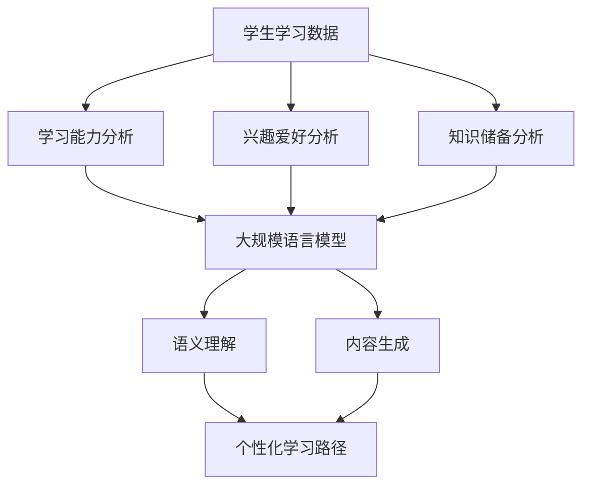

# 大规模语言模型在个性化学习路径生成中的应用

> 关键词：大规模语言模型、个性化学习路径、教育技术、人工智能、自适应学习、自然语言处理、学习分析

> 摘要：本文聚焦于大规模语言模型在个性化学习路径生成中的应用。首先介绍了相关背景，包括目的、预期读者、文档结构等内容。接着阐述了大规模语言模型和个性化学习路径的核心概念与联系，通过文本示意图和 Mermaid 流程图进行展示。详细讲解了核心算法原理，用 Python 代码阐述实现步骤，还给出了相关数学模型和公式并举例说明。通过项目实战，展示了代码实际案例及详细解释。探讨了其实际应用场景，推荐了相关工具和资源。最后总结了未来发展趋势与挑战，提供常见问题解答和扩展阅读参考资料，旨在全面深入地剖析大规模语言模型在个性化学习路径生成中的应用，为教育领域的智能化发展提供参考。

## 1. 背景介绍 
### 1.1 目的和范围
在当今信息爆炸的时代，传统的“一刀切”式教育方式已难以满足学生多样化的学习需求。个性化学习路径的生成旨在根据每个学生的学习能力、兴趣爱好、知识储备等因素，为其量身定制最适合的学习计划，以提高学习效率和效果。大规模语言模型作为人工智能领域的重要成果，具有强大的语言理解和生成能力，为个性化学习路径的生成提供了新的技术手段和思路。

本文的范围主要涵盖大规模语言模型在个性化学习路径生成中的基本概念、核心算法、数学模型、实际应用案例以及相关工具资源等方面，旨在全面深入地探讨这一领域的理论和实践。

### 1.2 预期读者
本文预期读者包括教育领域的从业者，如教师、教育研究者、教育技术开发者等，他们可以从文中获取关于如何利用大规模语言模型改进教学方法和学习体验的思路和方法；同时也适合人工智能领域的技术人员，他们可以了解大规模语言模型在教育场景中的具体应用和挑战；此外，对个性化学习和人工智能感兴趣的普通读者也能从本文中获得相关知识和启发。

### 1.3 文档结构概述
本文将按照以下结构展开：首先介绍背景信息，包括目的、预期读者和文档结构概述等；接着阐述大规模语言模型和个性化学习路径的核心概念与联系；然后详细讲解核心算法原理和具体操作步骤，并用 Python 代码进行说明；随后给出相关数学模型和公式，并举例说明；通过项目实战展示代码实际案例和详细解释；探讨其实际应用场景；推荐相关工具和资源；最后总结未来发展趋势与挑战，提供常见问题解答和扩展阅读参考资料。

### 1.4 术语表
#### 1.4.1 核心术语定义
- **大规模语言模型**：是指基于深度学习技术，通过在大规模文本数据上进行训练得到的具有强大语言理解和生成能力的模型，如 GPT - 3、BERT 等。
- **个性化学习路径**：根据学生的个体特征，如学习能力、兴趣爱好、知识水平等，为其定制的独特的学习计划和路线，包括学习内容的选择、学习顺序的安排等。
- **自适应学习**：一种能够根据学生的学习表现和反馈，自动调整学习内容和难度的学习模式。

#### 1.4.2 相关概念解释
- **自然语言处理（NLP）**：是计算机科学和人工智能领域的一个重要分支，主要研究如何让计算机理解和处理人类语言，大规模语言模型是自然语言处理技术的重要成果之一。
- **学习分析**：通过收集、分析和解释学生的学习数据，以了解学生的学习过程和行为，为个性化学习路径的生成提供依据。

#### 1.4.3 缩略词列表
- **NLP**：自然语言处理（Natural Language Processing）
- **GPT**：生成式预训练变压器（Generative Pretrained Transformer）
- **BERT**：双向编码器表示来自变压器（Bidirectional Encoder Representations from Transformers）

## 2. 核心概念与联系 

### 大规模语言模型原理
大规模语言模型通常基于Transformer架构，Transformer架构由编码器和解码器组成。编码器负责对输入的文本进行特征提取和编码，解码器则根据编码器的输出生成相应的文本。

以GPT系列模型为例，它是基于Transformer的解码器架构，通过自监督学习的方式在大规模文本数据上进行预训练。在预训练过程中，模型学习到语言的统计规律和语义信息，从而能够对输入的文本进行理解和生成。

### 个性化学习路径原理
个性化学习路径的生成需要综合考虑多个因素，包括学生的学习能力、兴趣爱好、知识储备等。通过对学生的学习数据进行分析，如考试成绩、作业完成情况、学习时间等，可以了解学生的学习状态和需求。然后根据这些信息，为学生选择合适的学习内容和学习顺序，制定个性化的学习计划。

### 两者的联系
大规模语言模型可以为个性化学习路径的生成提供强大的支持。一方面，大规模语言模型可以用于对学生的学习数据进行分析和理解，例如对学生的作业、笔记等文本数据进行语义分析，提取学生的知识掌握情况和学习偏好。另一方面，大规模语言模型可以根据学生的特点和需求，生成个性化的学习内容和指导建议，如生成适合学生水平的练习题、讲解材料等。

### 文本示意图
```plaintext
学生学习数据
|
|-- 学习能力分析
|-- 兴趣爱好分析
|-- 知识储备分析
|
V
大规模语言模型
|
|-- 语义理解
|-- 内容生成
|
V
个性化学习路径
```

### Mermaid 流程图


## 3. 核心算法原理 & 具体操作步骤 

### 核心算法原理
在个性化学习路径生成中，主要涉及到以下几个核心算法：

- **文本分类算法**：用于对学生的学习数据进行分类，例如将学生的作业分为不同的知识类别，以便了解学生在各个知识点上的掌握情况。常用的文本分类算法有朴素贝叶斯分类器、支持向量机等。
- **聚类算法**：用于将学生按照学习能力、兴趣爱好等特征进行聚类，以便为同一类别的学生制定相似的学习路径。常用的聚类算法有 K - 均值聚类、层次聚类等。
- **序列生成算法**：用于根据学生的特点和需求，生成个性化的学习内容和学习顺序。在大规模语言模型中，通常使用基于Transformer的序列生成算法，如自回归解码算法。

### 具体操作步骤
1. **数据收集**：收集学生的学习数据，包括考试成绩、作业完成情况、学习时间、笔记等。
2. **数据预处理**：对收集到的数据进行清洗、标注和特征提取，以便后续的分析和处理。
3. **学生特征分析**：使用文本分类算法和聚类算法对学生的学习数据进行分析，提取学生的学习能力、兴趣爱好、知识储备等特征。
4. **学习路径生成**：根据学生的特征，使用大规模语言模型生成个性化的学习内容和学习顺序。
5. **路径评估和优化**：对生成的学习路径进行评估和优化，根据学生的学习反馈不断调整学习路径。

### Python 源代码实现
```python
import numpy as np
from sklearn.feature_extraction.text import TfidfVectorizer
from sklearn.naive_bayes import MultinomialNB
from sklearn.cluster import KMeans
from transformers import GPT2LMHeadModel, GPT2Tokenizer

# 数据收集和预处理
student_notes = [
    "我对数学的函数部分很感兴趣，觉得很有挑战性",
    "物理的力学部分好难，总是搞不懂",
    "化学的化学反应原理很有趣，我掌握得还不错"
]

vectorizer = TfidfVectorizer()
X = vectorizer.fit_transform(student_notes)

# 文本分类
clf = MultinomialNB()
# 这里简单假设类别标签
labels = [0, 1, 2]
clf.fit(X, labels)

# 聚类分析
kmeans = KMeans(n_clusters=2)
kmeans.fit(X)

# 大规模语言模型
tokenizer = GPT2Tokenizer.from_pretrained('gpt2')
model = GPT2LMHeadModel.from_pretrained('gpt2')

# 生成个性化学习建议
input_text = "我在物理力学部分遇到困难，该怎么学习？"
input_ids = tokenizer.encode(input_text, return_tensors='pt')
output = model.generate(input_ids, max_length=100, num_beams=5, no_repeat_ngram_size=2)
generated_text = tokenizer.decode(output[0], skip_special_tokens=True)

print("生成的学习建议：", generated_text)
```

## 4. 数学模型和公式 & 详细讲解 & 举例说明 

### 文本分类的数学模型
在文本分类中，常用的朴素贝叶斯分类器基于贝叶斯定理。贝叶斯定理的公式为：

$$P(c|x)=\frac{P(x|c)P(c)}{P(x)}$$

其中，$P(c|x)$ 表示在给定文本特征 $x$ 的情况下，文本属于类别 $c$ 的概率；$P(x|c)$ 表示在类别 $c$ 下出现文本特征 $x$ 的概率；$P(c)$ 表示类别 $c$ 的先验概率；$P(x)$ 表示文本特征 $x$ 的先验概率。

在实际应用中，由于 $P(x)$ 对于所有类别都是相同的，因此可以忽略，只需要比较 $P(x|c)P(c)$ 的大小来确定文本的类别。

例如，假设有两个类别 $c_1$ 和 $c_2$，文本特征 $x$，已知 $P(x|c_1)=0.3$，$P(c_1)=0.4$，$P(x|c_2)=0.2$，$P(c_2)=0.6$。则：

$P(x|c_1)P(c_1)=0.3\times0.4 = 0.12$

$P(x|c_2)P(c_2)=0.2\times0.6 = 0.12$

由于两者相等，在这种情况下可以根据其他规则（如默认类别）来确定文本的类别。

### 聚类分析的数学模型
K - 均值聚类算法的目标是将 $n$ 个样本划分到 $k$ 个簇中，使得每个样本到其所属簇的质心的距离之和最小。其数学公式为：

$$\min\sum_{i = 1}^{k}\sum_{x\in C_i}d(x,\mu_i)$$

其中，$C_i$ 表示第 $i$ 个簇，$\mu_i$ 表示第 $i$ 个簇的质心，$d(x,\mu_i)$ 表示样本 $x$ 到质心 $\mu_i$ 的距离，通常使用欧几里得距离。

例如，假设有三个样本 $x_1=(1, 2)$，$x_2=(3, 4)$，$x_3=(5, 6)$，要将它们划分到两个簇中。首先随机初始化两个质心 $\mu_1=(2, 3)$ 和 $\mu_2=(4, 5)$，然后计算每个样本到两个质心的距离：

$d(x_1,\mu_1)=\sqrt{(1 - 2)^2+(2 - 3)^2}=\sqrt{2}$

$d(x_1,\mu_2)=\sqrt{(1 - 4)^2+(2 - 5)^2}=\sqrt{18}$

由于 $d(x_1,\mu_1)<d(x_1,\mu_2)$，所以 $x_1$ 属于第一个簇。同理计算 $x_2$ 和 $x_3$ 所属的簇，然后更新质心，重复这个过程直到质心不再变化。

### 序列生成的数学模型
在基于Transformer的序列生成中，通常使用自回归解码算法。其基本思想是根据之前生成的词预测下一个词的概率分布，然后从概率分布中采样得到下一个词。

假设已经生成的词序列为 $y_1,y_2,\cdots,y_t$，则下一个词 $y_{t + 1}$ 的概率分布为：

$$P(y_{t+1}|y_1,y_2,\cdots,y_t)=\text{softmax}(W_{out}h_{t+1}+b_{out})$$

其中，$W_{out}$ 是输出层的权重矩阵，$h_{t+1}$ 是Transformer解码器的输出隐藏状态，$b_{out}$ 是输出层的偏置。

例如，在生成文本“我喜欢”之后，模型会计算下一个词的概率分布，如“苹果”的概率为 0.3，“香蕉”的概率为 0.2 等，然后根据这些概率进行采样得到下一个词。

## 5. 项目实战：代码实际案例和详细解释说明 

### 5.1  开发环境搭建
1. **安装 Python**：建议使用 Python 3.7 及以上版本，可以从 Python 官方网站（https://www.python.org/downloads/） 下载并安装。
2. **安装依赖库**：使用 `pip` 命令安装所需的库，包括 `scikit - learn`、`transformers` 等。
```bash
pip install scikit-learn transformers
```
3. **配置 GPU 环境（可选）**：如果有 GPU 可用，可以安装相应的 CUDA 工具包和 PyTorch 的 GPU 版本，以加速模型的训练和推理。

### 5.2  源代码详细实现和代码解读
```python
import numpy as np
from sklearn.feature_extraction.text import TfidfVectorizer
from sklearn.naive_bayes import MultinomialNB
from sklearn.cluster import KMeans
from transformers import GPT2LMHeadModel, GPT2Tokenizer

# 数据收集和预处理
student_notes = [
    "我对数学的函数部分很感兴趣，觉得很有挑战性",
    "物理的力学部分好难，总是搞不懂",
    "化学的化学反应原理很有趣，我掌握得还不错"
]

# 使用 TfidfVectorizer 将文本转换为特征向量
vectorizer = TfidfVectorizer()
X = vectorizer.fit_transform(student_notes)

# 文本分类
clf = MultinomialNB()
# 这里简单假设类别标签
labels = [0, 1, 2]
clf.fit(X, labels)

# 聚类分析
kmeans = KMeans(n_clusters=2)
kmeans.fit(X)

# 大规模语言模型
tokenizer = GPT2Tokenizer.from_pretrained('gpt2')
model = GPT2LMHeadModel.from_pretrained('gpt2')

# 生成个性化学习建议
input_text = "我在物理力学部分遇到困难，该怎么学习？"
input_ids = tokenizer.encode(input_text, return_tensors='pt')
output = model.generate(input_ids, max_length=100, num_beams=5, no_repeat_ngram_size=2)
generated_text = tokenizer.decode(output[0], skip_special_tokens=True)

print("生成的学习建议：", generated_text)
```

### 代码解读与分析
1. **数据收集和预处理**：定义了一个包含学生笔记的列表 `student_notes`，使用 `TfidfVectorizer` 将文本转换为特征向量 `X`。`TfidfVectorizer` 会计算每个词的 TF - IDF 值，用于表示词在文本中的重要性。
2. **文本分类**：使用朴素贝叶斯分类器 `MultinomialNB` 对文本进行分类，简单假设了类别标签 `labels`，并使用 `fit` 方法进行训练。
3. **聚类分析**：使用 K - 均值聚类算法 `KMeans` 对文本特征向量进行聚类，将学生分为两个类别。
4. **大规模语言模型**：使用 `GPT2Tokenizer` 和 `GPT2LMHeadModel` 加载预训练的 GPT - 2 模型。
5. **生成个性化学习建议**：将输入文本 `input_text` 编码为输入 ID `input_ids`，使用 `generate` 方法生成文本，设置了最大长度、束搜索的束数和不重复的 n - 元组大小等参数，最后将生成的 ID 解码为文本并输出。

## 6. 实际应用场景 
### 在线教育平台
在线教育平台可以利用大规模语言模型为学生生成个性化的学习路径。例如，根据学生的学习历史、测试成绩、兴趣爱好等信息，为学生推荐适合的课程、学习资料和练习题目。同时，当学生在学习过程中遇到问题时，大规模语言模型可以实时提供解答和指导建议，帮助学生更好地理解和掌握知识。

### 智能辅导系统
智能辅导系统可以集成大规模语言模型，实现个性化的辅导服务。系统可以根据学生的学习进度和表现，动态调整辅导策略和内容。例如，对于学习困难的学生，系统可以提供更多的基础讲解和练习；对于学习能力较强的学生，系统可以提供更具挑战性的拓展内容和项目。

### 自适应学习教材
教材编写者可以利用大规模语言模型生成自适应学习教材。教材可以根据学生的个体差异，呈现不同难度层次的内容和学习任务。例如，对于基础知识掌握较好的学生，可以直接提供进阶的知识点和案例分析；对于基础知识薄弱的学生，则先提供基础概念的讲解和练习。

## 7. 工具和资源推荐
### 7.1 学习资源推荐
#### 7.1.1 书籍推荐