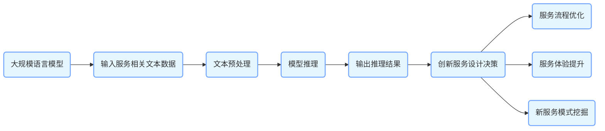

# 大规模语言模型在创新服务设计中的推理应用

> 关键词：大规模语言模型、创新服务设计、推理应用、自然语言处理、服务优化

> 摘要：本文聚焦于大规模语言模型在创新服务设计中的推理应用。首先介绍了相关背景，包括目的、预期读者等。接着阐述了核心概念及联系，展示了其原理和架构。详细讲解了核心算法原理与操作步骤，并给出Python代码示例。同时分析了相关数学模型和公式，辅以举例说明。通过项目实战展示代码实现和解读。探讨了实际应用场景，推荐了学习资源、开发工具框架及相关论文著作。最后总结未来发展趋势与挑战，解答常见问题，并提供扩展阅读和参考资料，旨在为大规模语言模型在创新服务设计中的有效应用提供全面的技术指导。

## 1. 背景介绍 
### 1.1 目的和范围
随着数字化时代的发展，服务设计领域面临着不断创新以满足用户日益多样化和个性化需求的挑战。大规模语言模型凭借其强大的语言理解和生成能力，为创新服务设计带来了新的机遇。本文的目的在于深入探讨大规模语言模型在创新服务设计中的推理应用，包括如何利用其推理能力优化服务流程、提升服务质量、挖掘新的服务模式等。范围涵盖了从基础概念到实际应用的多个层面，旨在为服务设计从业者和相关技术人员提供全面的技术参考。

### 1.2 预期读者
本文预期读者包括服务设计领域的专业人员，如服务设计师、产品经理等，他们可以从文中了解如何运用大规模语言模型提升服务设计的创新性和实用性；同时也面向人工智能领域的技术人员，包括算法工程师、数据科学家等，为他们探索语言模型在服务设计场景的应用提供思路；此外，对创新服务和人工智能交叉领域感兴趣的研究者和学生也能从本文中获取有价值的信息。

### 1.3 文档结构概述
本文首先介绍大规模语言模型和创新服务设计的背景知识，包括相关术语和概念。然后阐述核心概念之间的联系，通过示意图和流程图展示其架构。接着详细讲解核心算法原理和具体操作步骤，结合Python代码进行说明。分析相关数学模型和公式，并举例阐释。通过项目实战展示代码实现和详细解读。探讨大规模语言模型在创新服务设计中的实际应用场景。推荐学习资源、开发工具框架和相关论文著作。最后总结未来发展趋势与挑战，解答常见问题，并提供扩展阅读和参考资料。

### 1.4 术语表
#### 1.4.1 核心术语定义
- **大规模语言模型**：基于深度学习技术，通过在大规模文本数据上进行训练得到的语言模型，能够对自然语言进行理解和生成，具有强大的语言处理能力，如GPT - 3、BERT等。
- **创新服务设计**：以用户需求为导向，运用创造性的思维和方法，对服务的流程、体验、模式等进行重新设计和优化，以提供更具竞争力和价值的服务。
- **推理应用**：在大规模语言模型中，推理是指利用训练好的模型对输入数据进行处理，得出相应的输出结果。在创新服务设计中，推理应用则是将语言模型的推理能力应用于服务设计的各个环节，如需求分析、服务流程优化等。

#### 1.4.2 相关概念解释
- **自然语言处理（NLP）**：是计算机科学与人工智能领域的一个重要分支，主要研究如何让计算机理解和处理人类语言。大规模语言模型是自然语言处理技术的重要成果之一。
- **服务设计思维**：强调以用户为中心，综合考虑用户体验、业务目标和技术可行性，通过跨学科的方法进行服务创新和优化。

#### 1.4.3 缩略词列表
- **NLP**：Natural Language Processing（自然语言处理）
- **GPT**：Generative Pretrained Transformer（生成式预训练变换器）
- **BERT**：Bidirectional Encoder Representations from Transformers（基于变换器的双向编码器表示）

## 2. 核心概念与联系 

### 核心概念原理
大规模语言模型的核心原理基于深度学习中的神经网络架构，如Transformer。Transformer架构通过自注意力机制（Self - Attention Mechanism）能够高效地处理序列数据，捕捉输入文本中不同位置之间的依赖关系。在预训练阶段，模型在大规模无标注文本数据上进行训练，学习语言的通用模式和语义信息。在微调阶段，模型可以针对特定的任务进行调整，以适应不同的应用场景。

在创新服务设计中，推理应用主要是利用大规模语言模型对服务相关的文本数据进行分析和处理。例如，通过对用户反馈、需求描述等文本进行理解和推理，挖掘潜在的服务改进点和创新机会。

### 架构示意图


### 核心概念联系
大规模语言模型为创新服务设计提供了强大的技术支持。通过对服务相关文本的推理，能够深入理解用户需求、发现服务痛点，从而为服务设计的创新提供依据。而创新服务设计的实践又为大规模语言模型的应用提供了具体的场景和数据，促进模型的进一步优化和发展。

## 3. 核心算法原理 & 具体操作步骤 

### 核心算法原理
以Transformer架构的大规模语言模型为例，其核心算法主要包括自注意力机制和前馈神经网络。

#### 自注意力机制
自注意力机制允许模型在处理输入序列时，关注序列中不同位置的信息。对于输入序列 $\mathbf{X} = [\mathbf{x}_1, \mathbf{x}_2, \cdots, \mathbf{x}_n]$，其中 $\mathbf{x}_i$ 是第 $i$ 个位置的输入向量。首先，通过线性变换得到查询向量 $\mathbf{Q}$、键向量 $\mathbf{K}$ 和值向量 $\mathbf{V}$：
$$
\mathbf{Q} = \mathbf{X} \mathbf{W}^Q, \quad \mathbf{K} = \mathbf{X} \mathbf{W}^K, \quad \mathbf{V} = \mathbf{X} \mathbf{W}^V
$$
其中 $\mathbf{W}^Q$, $\mathbf{W}^K$, $\mathbf{W}^V$ 是可学习的权重矩阵。然后，计算注意力分数：
$$
\text{Attention}(\mathbf{Q}, \mathbf{K}, \mathbf{V}) = \text{softmax}\left(\frac{\mathbf{Q} \mathbf{K}^T}{\sqrt{d_k}}\right) \mathbf{V}
$$
其中 $d_k$ 是键向量的维度。

#### 前馈神经网络
在自注意力机制之后，将输出通过前馈神经网络进行进一步处理：
$$
\mathbf{FFN}(\mathbf{z}) = \text{max}(0, \mathbf{z} \mathbf{W}_1 + \mathbf{b}_1) \mathbf{W}_2 + \mathbf{b}_2
$$
其中 $\mathbf{z}$ 是自注意力机制的输出，$\mathbf{W}_1$, $\mathbf{W}_2$ 是权重矩阵，$\mathbf{b}_1$, $\mathbf{b}_2$ 是偏置向量。

### 具体操作步骤
#### 步骤1：数据收集与预处理
收集与服务设计相关的文本数据，如用户反馈、服务描述等。对数据进行清洗、分词、标注等预处理操作，将文本转换为模型可以处理的格式。

#### 步骤2：模型选择与加载
选择合适的大规模语言模型，如Hugging Face提供的开源模型。使用相应的库加载模型和预训练权重。

#### 步骤3：模型推理
将预处理后的文本输入到模型中进行推理，得到输出结果。

#### 步骤4：结果分析与应用
对推理结果进行分析，提取有用的信息，如用户需求、服务痛点等。将分析结果应用于创新服务设计的决策中。

### Python代码示例
```python
from transformers import AutoTokenizer, AutoModelForSequenceClassification
import torch

# 步骤1：数据收集与预处理
text = "这个服务的响应时间太长了，希望能改进。"

# 步骤2：模型选择与加载
model_name = "distilbert-base-uncased-finetuned-sst-2-english"
tokenizer = AutoTokenizer.from_pretrained(model_name)
model = AutoModelForSequenceClassification.from_pretrained(model_name)

# 步骤3：模型推理
inputs = tokenizer(text, return_tensors='pt')
with torch.no_grad():
    outputs = model(**inputs)
logits = outputs.logits
predicted_class_id = logits.argmax().item()
label = model.config.id2label[predicted_class_id]

# 步骤4：结果分析与应用
print(f"预测标签: {label}")
if label == "NEGATIVE":
    print("服务存在问题，需要改进。")
```

## 4. 数学模型和公式 & 详细讲解 & 举例说明 

### 自注意力机制公式详细讲解
$$
\text{Attention}(\mathbf{Q}, \mathbf{K}, \mathbf{V}) = \text{softmax}\left(\frac{\mathbf{Q} \mathbf{K}^T}{\sqrt{d_k}}\right) \mathbf{V}
$$

#### 计算过程
1. **计算注意力分数**：$\mathbf{Q} \mathbf{K}^T$ 计算查询向量和键向量之间的相似度。除以 $\sqrt{d_k}$ 是为了防止点积结果过大，导致softmax函数的梯度消失。
2. **应用softmax函数**：$\text{softmax}$ 函数将注意力分数转换为概率分布，使得每个位置的注意力权重之和为1。
3. **加权求和**：将softmax输出与值向量 $\mathbf{V}$ 相乘并求和，得到每个位置的注意力输出。

#### 举例说明
假设输入序列为 $\mathbf{X} = [\mathbf{x}_1, \mathbf{x}_2, \mathbf{x}_3]$，其中 $\mathbf{x}_i \in \mathbb{R}^{d_x}$。经过线性变换得到 $\mathbf{Q} \in \mathbb{R}^{3 \times d_k}$, $\mathbf{K} \in \mathbb{R}^{3 \times d_k}$, $\mathbf{V} \in \mathbb{R}^{3 \times d_v}$。

计算 $\mathbf{Q} \mathbf{K}^T$：
$$
\mathbf{Q} \mathbf{K}^T = 
\begin{bmatrix}
\mathbf{q}_1^T \mathbf{k}_1 & \mathbf{q}_1^T \mathbf{k}_2 & \mathbf{q}_1^T \mathbf{k}_3 \\
\mathbf{q}_2^T \mathbf{k}_1 & \mathbf{q}_2^T \mathbf{k}_2 & \mathbf{q}_2^T \mathbf{k}_3 \\
\mathbf{q}_3^T \mathbf{k}_1 & \mathbf{q}_3^T \mathbf{k}_2 & \mathbf{q}_3^T \mathbf{k}_3
\end{bmatrix}
$$
其中 $\mathbf{q}_i$ 和 $\mathbf{k}_i$ 分别是 $\mathbf{Q}$ 和 $\mathbf{K}$ 的第 $i$ 行。

除以 $\sqrt{d_k}$ 并应用softmax函数：
$$
\text{softmax}\left(\frac{\mathbf{Q} \mathbf{K}^T}{\sqrt{d_k}}\right) = 
\begin{bmatrix}
\text{softmax}\left(\frac{\mathbf{q}_1^T \mathbf{k}_1}{\sqrt{d_k}}\right) & \text{softmax}\left(\frac{\mathbf{q}_1^T \mathbf{k}_2}{\sqrt{d_k}}\right) & \text{softmax}\left(\frac{\mathbf{q}_1^T \mathbf{k}_3}{\sqrt{d_k}}\right) \\
\text{softmax}\left(\frac{\mathbf{q}_2^T \mathbf{k}_1}{\sqrt{d_k}}\right) & \text{softmax}\left(\frac{\mathbf{q}_2^T \mathbf{k}_2}{\sqrt{d_k}}\right) & \text{softmax}\left(\frac{\mathbf{q}_2^T \mathbf{k}_3}{\sqrt{d_k}}\right) \\
\text{softmax}\left(\frac{\mathbf{q}_3^T \mathbf{k}_1}{\sqrt{d_k}}\right) & \text{softmax}\left(\frac{\mathbf{q}_3^T \mathbf{k}_2}{\sqrt{d_k}}\right) & \text{softmax}\left(\frac{\mathbf{q}_3^T \mathbf{k}_3}{\sqrt{d_k}}\right)
\end{bmatrix}
$$

最后，将softmax输出与 $\mathbf{V}$ 相乘得到注意力输出：
$$
\text{Attention}(\mathbf{Q}, \mathbf{K}, \mathbf{V}) = 
\begin{bmatrix}
\sum_{j=1}^{3} \text{softmax}\left(\frac{\mathbf{q}_1^T \mathbf{k}_j}{\sqrt{d_k}}\right) \mathbf{v}_j \\
\sum_{j=1}^{3} \text{softmax}\left(\frac{\mathbf{q}_2^T \mathbf{k}_j}{\sqrt{d_k}}\right) \mathbf{v}_j \\
\sum_{j=1}^{3} \text{softmax}\left(\frac{\mathbf{q}_3^T \mathbf{k}_j}{\sqrt{d_k}}\right) \mathbf{v}_j
\end{bmatrix}
$$

### 前馈神经网络公式详细讲解
$$
\mathbf{FFN}(\mathbf{z}) = \text{max}(0, \mathbf{z} \mathbf{W}_1 + \mathbf{b}_1) \mathbf{W}_2 + \mathbf{b}_2
$$

#### 计算过程
1. **线性变换**：$\mathbf{z} \mathbf{W}_1 + \mathbf{b}_1$ 对输入 $\mathbf{z}$ 进行线性变换。
2. **ReLU激活函数**：$\text{max}(0, \cdot)$ 是ReLU激活函数，用于引入非线性。
3. **再次线性变换**：将ReLU输出与 $\mathbf{W}_2$ 相乘并加上偏置 $\mathbf{b}_2$ 得到最终输出。

#### 举例说明
假设 $\mathbf{z} \in \mathbb{R}^{d_z}$，$\mathbf{W}_1 \in \mathbb{R}^{d_z \times d_{h}}$，$\mathbf{W}_2 \in \mathbb{R}^{d_{h} \times d_{o}}$，$\mathbf{b}_1 \in \mathbb{R}^{d_{h}}$，$\mathbf{b}_2 \in \mathbb{R}^{d_{o}}$。

首先计算 $\mathbf{z} \mathbf{W}_1 + \mathbf{b}_1$：
$$
\mathbf{h} = \mathbf{z} \mathbf{W}_1 + \mathbf{b}_1
$$
其中 $\mathbf{h} \in \mathbb{R}^{d_{h}}$。

然后应用ReLU激活函数：
$$
\mathbf{h}_{relu} = \text{max}(0, \mathbf{h})
$$

最后计算最终输出：
$$
\mathbf{FFN}(\mathbf{z}) = \mathbf{h}_{relu} \mathbf{W}_2 + \mathbf{b}_2
$$

## 5. 项目实战：代码实际案例和详细解释说明 

### 5.1  开发环境搭建
#### 安装Python
确保已经安装Python 3.6及以上版本。可以从Python官方网站（https://www.python.org/downloads/）下载并安装。

#### 创建虚拟环境
使用`venv`或`conda`创建虚拟环境，以隔离项目依赖。例如，使用`venv`创建虚拟环境：
```bash
python -m venv service_design_env
source service_design_env/bin/activate  # 对于Linux/Mac
service_design_env\Scripts\activate  # 对于Windows
```

#### 安装依赖库
在虚拟环境中安装必要的依赖库，如`transformers`、`torch`等：
```bash
pip install transformers torch
```

### 5.2  源代码详细实现和代码解读
```python
from transformers import AutoTokenizer, AutoModelForSequenceClassification
import torch

# 步骤1：数据收集与预处理
# 假设我们有一组用户反馈数据
user_feedbacks = [
    "这个服务的界面很不友好，操作起来很麻烦。",
    "服务的响应速度很快，很满意。",
    "客服的态度不好，体验很差。"
]

# 步骤2：模型选择与加载
model_name = "distilbert-base-uncased-finetuned-sst-2-english"
tokenizer = AutoTokenizer.from_pretrained(model_name)
model = AutoModelForSequenceClassification.from_pretrained(model_name)

# 步骤3：模型推理
for feedback in user_feedbacks:
    inputs = tokenizer(feedback, return_tensors='pt')
    with torch.no_grad():
        outputs = model(**inputs)
    logits = outputs.logits
    predicted_class_id = logits.argmax().item()
    label = model.config.id2label[predicted_class_id]
    
    # 步骤4：结果分析与应用
    print(f"用户反馈: {feedback}")
    print(f"预测标签: {label}")
    if label == "NEGATIVE":
        print("服务存在问题，需要改进。")
    else:
        print("服务表现良好。")
    print()
```

### 5.3  代码解读与分析
#### 数据收集与预处理
`user_feedbacks` 列表存储了一组用户反馈数据。在实际应用中，这些数据可以从数据库、文件或其他数据源中获取。

#### 模型选择与加载
使用`transformers`库的`AutoTokenizer`和`AutoModelForSequenceClassification`加载预训练的模型和分词器。`distilbert-base-uncased-finetuned-sst-2-english` 是一个经过微调的情感分类模型。

#### 模型推理
遍历每个用户反馈，使用分词器将文本转换为模型可以处理的输入张量。通过`torch.no_grad()`上下文管理器关闭梯度计算，以提高推理效率。调用模型得到输出`logits`，并通过`argmax()`方法获取预测的类别ID。

#### 结果分析与应用
根据预测的标签判断服务是否存在问题，并输出相应的信息。在实际应用中，可以根据分析结果对服务进行优化和改进。

## 6. 实际应用场景 
### 用户需求分析
大规模语言模型可以对用户的文本反馈、咨询记录等进行推理分析，挖掘用户的潜在需求。例如，通过分析用户在社交媒体上对某服务的评论，发现用户对服务功能、体验等方面的期望，为服务的功能扩展和优化提供依据。

### 服务流程优化
对服务流程中的文本数据，如操作指南、客服对话等进行分析。通过推理找出流程中的繁琐环节、容易出错的步骤，提出优化建议。例如，分析客服与用户的对话记录，发现常见问题的处理流程是否可以简化。

### 服务体验提升
利用语言模型对用户的体验描述进行情感分析和语义理解。根据分析结果，针对性地改进服务的界面设计、交互方式等。例如，若发现用户反馈服务界面不友好，可进一步分析具体不友好的原因，如操作流程复杂、信息展示不清晰等。

### 新服务模式挖掘
通过对行业动态、市场趋势等文本信息的推理，发现潜在的新服务模式。例如，分析新闻报道、行业研究报告等，找出与服务相关的新兴技术和市场需求，探索新的服务领域和业务模式。

## 7. 工具和资源推荐
### 7.1 学习资源推荐
#### 7.1.1 书籍推荐
- 《自然语言处理入门》：适合初学者，系统介绍自然语言处理的基本概念、算法和技术。
- 《深度学习》：由Ian Goodfellow等撰写，深入讲解深度学习的原理和应用，包括语言模型相关内容。
- 《Transformers从入门到实战》：专门介绍Transformer架构和相关模型的书籍，对理解大规模语言模型有很大帮助。

#### 7.1.2 在线课程
- Coursera上的“Natural Language Processing Specialization”：由顶尖高校教授授课，涵盖自然语言处理的多个方面，包括语言模型。
- edX上的“Deep Learning for Natural Language Processing”：深入讲解深度学习在自然语言处理中的应用。
- 哔哩哔哩上有许多关于自然语言处理和大规模语言模型的免费教程，适合自主学习。

#### 7.1.3 技术博客和网站
- Hugging Face Blog：提供关于Transformer模型、语言处理技术的最新研究和应用案例。
- Medium上的“Towards Data Science”：有大量关于人工智能和自然语言处理的优质文章。
- 机器之心、量子位等中文科技媒体，会及时报道人工智能领域的最新动态和技术解读。

### 7.2 开发工具框架推荐
#### 7.2.1 IDE和编辑器
- PyCharm：功能强大的Python集成开发环境，提供代码编辑、调试、版本控制等功能。
- Visual Studio Code：轻量级的代码编辑器，支持多种编程语言和插件扩展，适合快速开发和调试。

#### 7.2.2 调试和性能分析工具
- TensorBoard：用于可视化深度学习模型的训练过程和性能指标，方便调试和优化模型。
- Py-Spy：可以对Python代码进行性能分析，找出性能瓶颈。

#### 7.2.3 相关框架和库
- Transformers：Hugging Face开发的库，提供了丰富的预训练语言模型和工具，方便进行自然语言处理任务。
- PyTorch：广泛使用的深度学习框架，支持大规模语言模型的训练和推理。
- NLTK：自然语言处理工具包，提供了丰富的文本处理功能和语料库。

### 7.3 相关论文著作推荐
#### 7.3.1 经典论文
- “Attention Is All You Need”：介绍了Transformer架构，是大规模语言模型的基础。
- “BERT: Pre-training of Deep Bidirectional Transformers for Language Understanding”：提出了BERT模型，在自然语言处理领域取得了巨大成功。
- “Generative Pretrained Transformer 3 (GPT - 3): Language Models are Few - Shot Learners”：介绍了GPT - 3模型及其强大的语言生成能力。

#### 7.3.2 最新研究成果
可以关注顶级学术会议如ACL（Association for Computational Linguistics）、EMNLP（Conference on Empirical Methods in Natural Language Processing）等的论文，了解大规模语言模型在自然语言处理和服务设计领域的最新研究进展。

#### 7.3.3 应用案例分析
一些知名企业和研究机构会发布大规模语言模型在实际应用中的案例分析报告，如谷歌、微软等公司的技术博客和研究报告，可以从中学习到实际应用中的经验和技巧。

## 8. 总结：未来发展趋势与挑战
### 未来发展趋势
#### 多模态融合
未来大规模语言模型将与图像、音频等多模态数据进行融合，在创新服务设计中提供更丰富的信息和更全面的服务体验。例如，在智能家居服务中，结合语音指令和图像识别，实现更智能的家居控制。

#### 个性化服务
通过对用户的历史数据和偏好进行深度分析，大规模语言模型能够为用户提供更加个性化的服务。例如，在金融服务中，根据用户的投资历史和风险偏好，提供定制化的投资建议。

#### 跨领域应用
大规模语言模型将在更多的领域得到应用，促进不同领域之间的创新服务设计。例如，在医疗服务中，结合医学知识和患者的文本信息，提供辅助诊断和治疗建议。

### 挑战
#### 数据隐私和安全
大规模语言模型需要大量的数据进行训练和推理，如何保护用户的数据隐私和安全是一个重要挑战。例如，在处理用户的医疗记录、金融信息等敏感数据时，需要采取严格的安全措施。

#### 模型可解释性
大规模语言模型通常是黑盒模型，其决策过程难以解释。在创新服务设计中，尤其是涉及到重要决策的场景，需要提高模型的可解释性，以便用户和决策者能够理解和信任模型的输出。

#### 计算资源需求
训练和推理大规模语言模型需要大量的计算资源，包括GPU、TPU等。如何降低计算成本，提高模型的效率，是大规模语言模型在实际应用中面临的挑战之一。

## 9. 附录：常见问题与解答
### 问题1：大规模语言模型在创新服务设计中的应用是否受限于语言？
解答：目前大多数大规模语言模型是针对特定语言进行训练的，因此在应用中会受到语言的限制。但随着跨语言模型的发展，如mBERT、XLM - RoBERTa等，这种限制将逐渐减小。同时，可以通过翻译等手段将不同语言的数据转换为模型支持的语言进行处理。

### 问题2：如何评估大规模语言模型在创新服务设计中的应用效果？
解答：可以从多个方面进行评估，如服务质量的提升、用户满意度的提高、业务指标的改善等。具体可以通过对比应用模型前后的服务流程效率、用户反馈评分、销售额等指标来评估。此外，还可以使用一些自然语言处理的评估指标，如准确率、召回率、F1值等，对模型的推理结果进行评估。

### 问题3：大规模语言模型在创新服务设计中的应用是否会取代人类服务设计师？
解答：不会。大规模语言模型可以为服务设计提供数据支持和分析建议，但服务设计涉及到人类的情感、价值观等复杂因素，需要人类设计师的创造力和判断力。语言模型可以作为辅助工具，帮助设计师更高效地完成工作，而不是取代他们。

## 10. 扩展阅读 & 参考资料
### 扩展阅读
- 《服务设计与创新实践》：深入探讨服务设计的理论和实践方法，结合大规模语言模型的应用可以进一步拓展服务设计的思路。
- 《人工智能时代的创新管理》：分析人工智能技术在创新管理中的应用，包括大规模语言模型在服务创新中的作用。

### 参考资料
- Hugging Face官方文档：https://huggingface.co/docs
- PyTorch官方文档：https://pytorch.org/docs/stable/index.html
- 《自然语言处理实战》书籍相关资源

作者：AI天才研究院/AI Genius Institute & 禅与计算机程序设计艺术 /Zen And The Art of Computer Programming