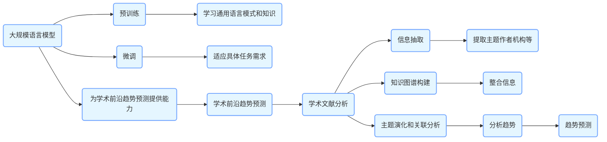

# 大规模语言模型在学术前沿趋势预测中的应用

> 关键词：大规模语言模型、学术前沿趋势预测、自然语言处理、机器学习、信息抽取、知识图谱

> 摘要：本文深入探讨了大规模语言模型在学术前沿趋势预测中的应用。首先介绍了相关背景，包括研究目的、预期读者和文档结构等。接着阐述了大规模语言模型和学术前沿趋势预测的核心概念及其联系，给出了相应的文本示意图和 Mermaid 流程图。详细讲解了核心算法原理，并通过 Python 源代码进行说明，同时给出了相关的数学模型和公式。通过项目实战展示了代码的实际应用和详细解读。分析了该技术在实际中的应用场景，推荐了学习资源、开发工具框架和相关论文著作。最后总结了未来发展趋势与挑战，解答了常见问题并提供了扩展阅读和参考资料，旨在为研究人员和从业者提供全面深入的技术指导。

## 1. 背景介绍 
### 1.1 目的和范围
学术研究领域发展迅速，新的理论、方法和技术不断涌现。准确预测学术前沿趋势对于科研机构、学者和决策者具有重要意义。大规模语言模型凭借其强大的语言理解和生成能力，为学术前沿趋势预测提供了新的途径和方法。本文的目的在于系统地介绍大规模语言模型在学术前沿趋势预测中的应用，涵盖从核心概念、算法原理到实际应用的各个方面，帮助读者全面了解该领域的技术和方法。

### 1.2 预期读者
本文的预期读者包括从事自然语言处理、机器学习、情报学等领域的研究人员和学者，希望了解如何利用大规模语言模型进行学术研究和分析的科研工作者，以及对学术前沿趋势预测感兴趣的决策者和管理人员。

### 1.3 文档结构概述
本文首先介绍大规模语言模型和学术前沿趋势预测的核心概念及其联系，然后详细讲解核心算法原理和具体操作步骤，给出相关的数学模型和公式。通过项目实战展示代码的实际应用和详细解读，分析该技术在实际中的应用场景。推荐学习资源、开发工具框架和相关论文著作，最后总结未来发展趋势与挑战，解答常见问题并提供扩展阅读和参考资料。

### 1.4 术语表
#### 1.4.1 核心术语定义
- **大规模语言模型**：基于深度学习技术，在大规模文本数据上进行训练的语言模型，能够学习到丰富的语言知识和模式，具有强大的语言理解和生成能力，如 GPT - 3、BERT 等。
- **学术前沿趋势预测**：通过对学术文献、研究报告等信息的分析和挖掘，预测未来学术研究领域的发展方向、热点问题和新兴趋势。
- **自然语言处理**：研究如何让计算机理解和处理人类语言的技术领域，包括文本分类、信息抽取、机器翻译等任务。
- **机器学习**：一门多领域交叉学科，涉及概率论、统计学、逼近论、凸分析、算法复杂度理论等多门学科。它专门研究计算机怎样模拟或实现人类的学习行为，以获取新的知识或技能，重新组织已有的知识结构使之不断改善自身的性能。

#### 1.4.2 相关概念解释
- **知识图谱**：一种语义网络，用于表示实体之间的关系和知识。在学术前沿趋势预测中，知识图谱可以整合学术文献中的各种信息，帮助发现研究主题之间的关联和演化。
- **信息抽取**：从文本中提取出特定的信息，如实体、关系和事件等。在学术研究中，信息抽取可以用于从学术文献中提取作者、机构、研究主题等信息。

#### 1.4.3 缩略词列表
- **NLP**：Natural Language Processing，自然语言处理
- **ML**：Machine Learning，机器学习
- **LLM**：Large Language Model，大规模语言模型

## 2. 核心概念与联系 

### 大规模语言模型原理
大规模语言模型通常基于Transformer架构，如GPT系列采用了Transformer的解码器架构，BERT采用了Transformer的编码器架构。Transformer架构利用多头自注意力机制，能够捕捉文本中不同位置之间的依赖关系，从而更好地理解文本的语义信息。

大规模语言模型的训练过程通常分为预训练和微调两个阶段。在预训练阶段，模型在大规模的无监督文本数据上进行训练，学习语言的通用模式和知识。在微调阶段，模型在特定的任务数据集上进行训练，以适应具体的任务需求。

### 学术前沿趋势预测原理
学术前沿趋势预测主要基于对学术文献的分析和挖掘。通过对大量学术文献的标题、摘要、关键词等信息的处理，可以提取出研究主题、作者、机构等信息。然后，利用这些信息构建知识图谱，分析研究主题的演化和关联，从而预测学术前沿趋势。

### 两者联系
大规模语言模型可以为学术前沿趋势预测提供强大的语言理解和处理能力。例如，利用大规模语言模型进行信息抽取，可以更准确地从学术文献中提取出研究主题、作者、机构等信息。大规模语言模型还可以用于文本分类、情感分析等任务，帮助分析学术文献的内容和趋势。

### 文本示意图
```plaintext
大规模语言模型
|-- 预训练（大规模无监督文本数据）
|   |-- 学习通用语言模式和知识
|-- 微调（特定任务数据集）
|   |-- 适应具体任务需求

学术前沿趋势预测
|-- 学术文献分析
|   |-- 信息抽取（主题、作者、机构等）
|   |-- 知识图谱构建
|   |-- 主题演化和关联分析
|-- 趋势预测

联系：大规模语言模型为学术前沿趋势预测提供语言理解和处理能力
```

### Mermaid 流程图


## 3. 核心算法原理 & 具体操作步骤 

### 信息抽取算法原理
信息抽取是学术前沿趋势预测的重要步骤，常用的信息抽取方法包括基于规则的方法和基于机器学习的方法。基于机器学习的方法中，命名实体识别（NER）是一种常见的任务，用于识别文本中的实体，如人名、地名、机构名等。

下面是一个使用Python和Hugging Face的Transformers库进行命名实体识别的示例代码：
```python
from transformers import AutoTokenizer, AutoModelForTokenClassification
from transformers import pipeline

# 加载预训练的命名实体识别模型和分词器
tokenizer = AutoTokenizer.from_pretrained("dbmdz/bert-large-cased-finetuned-conll03-english")
model = AutoModelForTokenClassification.from_pretrained("dbmdz/bert-large-cased-finetuned-conll03-english")

# 创建命名实体识别管道
nlp = pipeline("ner", model=model, tokenizer=tokenizer)

# 待处理的文本
text = "Apple is looking at buying U.K. startup for $1 billion"

# 进行命名实体识别
ner_results = nlp(text)

# 输出结果
for result in ner_results:
    print(result)
```
### 代码解释
1. **加载模型和分词器**：使用`AutoTokenizer`和`AutoModelForTokenClassification`从Hugging Face的模型库中加载预训练的命名实体识别模型和分词器。
2. **创建命名实体识别管道**：使用`pipeline`函数创建一个命名实体识别管道，指定模型和分词器。
3. **进行命名实体识别**：将待处理的文本输入到命名实体识别管道中，得到识别结果。
4. **输出结果**：遍历识别结果并输出。

### 文本分类算法原理
文本分类用于将文本划分到不同的类别中，在学术前沿趋势预测中，可以用于对学术文献进行主题分类。下面是一个使用Python和Scikit-learn库进行文本分类的示例代码：
```python
from sklearn.feature_extraction.text import TfidfVectorizer
from sklearn.naive_bayes import MultinomialNB
from sklearn.pipeline import Pipeline

# 示例数据
train_texts = ["This is a sports article", "This is a technology article"]
train_labels = ["sports", "technology"]
test_text = ["This is another technology article"]

# 创建文本分类管道
text_clf = Pipeline([
    ('tfidf', TfidfVectorizer()),
    ('clf', MultinomialNB()),
])

# 训练模型
text_clf.fit(train_texts, train_labels)

# 进行预测
predicted = text_clf.predict(test_text)

# 输出结果
print(predicted)
```
### 代码解释
1. **数据准备**：准备训练数据和测试数据，训练数据包括文本和对应的标签。
2. **创建文本分类管道**：使用`Pipeline`将`TfidfVectorizer`和`MultinomialNB`组合在一起，`TfidfVectorizer`用于将文本转换为向量，`MultinomialNB`是一个朴素贝叶斯分类器。
3. **训练模型**：使用训练数据对模型进行训练。
4. **进行预测**：使用训练好的模型对测试数据进行预测。
5. **输出结果**：输出预测结果。

## 4. 数学模型和公式 & 详细讲解 & 举例说明 

### 词向量表示
在自然语言处理中，通常需要将文本转换为向量表示，以便计算机能够处理。词向量是一种常用的文本表示方法，它将每个词映射到一个低维的向量空间中。常见的词向量模型包括Word2Vec和GloVe。

#### Word2Vec
Word2Vec是一种基于神经网络的词向量模型，它有两种训练方法：Skip - gram和CBOW。

##### Skip - gram
Skip - gram模型的目标是根据中心词预测其上下文词。假设我们有一个词序列 $w_1, w_2, \cdots, w_T$，中心词为 $w_t$，上下文词为 $w_{t - c}, \cdots, w_{t - 1}, w_{t + 1}, \cdots, w_{t + c}$，其中 $c$ 是上下文窗口的大小。

Skip - gram模型的目标函数是最大化以下概率：
$$
\prod_{t = 1}^{T} \prod_{-c \leq j \leq c, j \neq 0} P(w_{t + j} | w_t)
$$

其中，$P(w_{t + j} | w_t)$ 可以通过softmax函数计算：
$$
P(w_{o} | w_{i}) = \frac{\exp(\mathbf{v}_{w_{o}}^T \mathbf{v}_{w_{i}})}{\sum_{w = 1}^{V} \exp(\mathbf{v}_{w}^T \mathbf{v}_{w_{i}})}
$$

这里，$\mathbf{v}_{w_{i}}$ 是中心词 $w_{i}$ 的输入向量，$\mathbf{v}_{w_{o}}$ 是上下文词 $w_{o}$ 的输出向量，$V$ 是词汇表的大小。

##### 举例说明
假设我们有一个简单的句子 "I love natural language processing"，上下文窗口大小 $c = 1$。对于中心词 "love"，上下文词是 "I" 和 "natural"。Skip - gram模型的目标是根据 "love" 预测 "I" 和 "natural"。

#### CBOW
CBOW模型的目标是根据上下文词预测中心词。目标函数是最大化以下概率：
$$
\prod_{t = 1}^{T} P(w_t | w_{t - c}, \cdots, w_{t - 1}, w_{t + 1}, \cdots, w_{t + c})
$$

同样，$P(w_t | w_{t - c}, \cdots, w_{t - 1}, w_{t + 1}, \cdots, w_{t + c})$ 可以通过softmax函数计算。

### 文本分类的数学模型
在文本分类中，常用的模型是朴素贝叶斯分类器。假设我们有一个文本分类问题，类别集合为 $C = \{c_1, c_2, \cdots, c_K\}$，文本集合为 $D = \{d_1, d_2, \cdots, d_N\}$。

朴素贝叶斯分类器基于贝叶斯定理：
$$
P(c | d) = \frac{P(d | c) P(c)}{P(d)}
$$

由于 $P(d)$ 对于所有类别都是相同的，因此在分类时可以忽略。朴素贝叶斯分类器假设文本中的词是相互独立的，即：
$$
P(d | c) = \prod_{i = 1}^{n} P(w_i | c)
$$

其中，$w_i$ 是文本 $d$ 中的第 $i$ 个词，$n$ 是文本 $d$ 的长度。

#### 举例说明
假设我们有一个文本分类问题，类别为 "sports" 和 "technology"，训练数据如下：
- 类别 "sports": ["This is a football game", "Basketball is exciting"]
- 类别 "technology": ["AI is changing the world", "Machine learning is powerful"]

对于一个新的文本 "This is a new AI project"，朴素贝叶斯分类器会计算 $P(\text{sports} | \text{This is a new AI project})$ 和 $P(\text{technology} | \text{This is a new AI project})$，并选择概率最大的类别作为预测结果。

## 5. 项目实战：代码实际案例和详细解释说明 

### 5.1  开发环境搭建
#### 安装Python
首先需要安装Python，建议使用Python 3.7及以上版本。可以从Python官方网站（https://www.python.org/downloads/）下载并安装。

#### 安装必要的库
使用pip安装以下必要的库：
```bash
pip install transformers scikit-learn pandas numpy
```

### 5.2  源代码详细实现和代码解读
#### 数据准备
假设我们有一个包含学术文献标题和主题标签的CSV文件`papers.csv`，格式如下：
```plaintext
title,topic
"Deep learning for image recognition", "Computer Science"
"New drug discovery using AI", "Biology"
```

以下是读取数据的代码：
```python
import pandas as pd

# 读取CSV文件
data = pd.read_csv('papers.csv')

# 提取标题和主题标签
titles = data['title'].tolist()
topics = data['topic'].tolist()
```
#### 文本向量化
使用TfidfVectorizer将文本转换为向量：
```python
from sklearn.feature_extraction.text import TfidfVectorizer

# 创建TfidfVectorizer对象
vectorizer = TfidfVectorizer()

# 将标题转换为向量
X = vectorizer.fit_transform(titles)
```
#### 模型训练
使用逻辑回归模型进行训练：
```python
from sklearn.linear_model import LogisticRegression
from sklearn.model_selection import train_test_split

# 划分训练集和测试集
X_train, X_test, y_train, y_test = train_test_split(X, topics, test_size=0.2, random_state=42)

# 创建逻辑回归模型
model = LogisticRegression()

# 训练模型
model.fit(X_train, y_train)
```
#### 模型评估
使用测试集评估模型的性能：
```python
from sklearn.metrics import accuracy_score

# 进行预测
y_pred = model.predict(X_test)

# 计算准确率
accuracy = accuracy_score(y_test, y_pred)
print(f"Accuracy: {accuracy}")
```

### 5.3  代码解读与分析
1. **数据准备**：使用`pandas`库读取CSV文件，提取标题和主题标签。
2. **文本向量化**：使用`TfidfVectorizer`将文本转换为向量，`TfidfVectorizer`会计算每个词的TF - IDF值，将文本表示为向量。
3. **模型训练**：使用`train_test_split`函数将数据划分为训练集和测试集，使用逻辑回归模型进行训练。
4. **模型评估**：使用`accuracy_score`函数计算模型在测试集上的准确率，评估模型的性能。

## 6. 实际应用场景 
### 科研机构决策支持
科研机构可以利用大规模语言模型进行学术前沿趋势预测，为科研项目的立项、资源分配等决策提供支持。例如，通过分析学术文献的趋势，确定未来有潜力的研究方向，合理安排科研经费和人员。

### 学者研究方向选择
学者可以借助大规模语言模型了解学术前沿动态，选择有前景的研究方向。通过对学术文献的主题分析和趋势预测，学者可以发现新兴的研究领域和热点问题，避免选择过于冷门或竞争激烈的研究方向。

### 学术期刊选题策划
学术期刊可以利用大规模语言模型预测学术前沿趋势，进行选题策划。根据预测结果，确定期刊的重点选题和专题，吸引高质量的学术论文投稿，提高期刊的影响力。

### 科技企业技术研发
科技企业可以通过大规模语言模型了解学术前沿趋势，为技术研发提供方向。例如，了解人工智能、生物科技等领域的最新研究成果和发展趋势，提前布局研发项目，保持技术领先优势。

## 7. 工具和资源推荐
### 7.1 学习资源推荐
#### 7.1.1 书籍推荐
- 《自然语言处理入门》：介绍了自然语言处理的基本概念、方法和技术，适合初学者。
- 《深度学习》：详细讲解了深度学习的原理和应用，包括神经网络、卷积神经网络等。
- 《信息检索导论》：介绍了信息检索的基本理论和方法，对于理解学术文献分析和趋势预测有帮助。

#### 7.1.2 在线课程
- Coursera上的“Natural Language Processing Specialization”：由斯坦福大学的教授授课，系统地介绍了自然语言处理的各个方面。
- edX上的“Deep Learning Specialization”：由吴恩达教授授课，深入讲解了深度学习的理论和实践。

#### 7.1.3 技术博客和网站
- Hugging Face博客：提供了关于大规模语言模型的最新研究成果和应用案例。
- Medium上的自然语言处理相关博客：有很多专业人士分享的技术文章和经验。

### 7.2 开发工具框架推荐
#### 7.2.1 IDE和编辑器
- PyCharm：功能强大的Python集成开发环境，支持代码编辑、调试、版本控制等功能。
- Jupyter Notebook：交互式的开发环境，适合进行数据分析和模型实验。

#### 7.2.2 调试和性能分析工具
- TensorBoard：用于可视化深度学习模型的训练过程和性能指标。
- Py-Spy：用于分析Python代码的性能瓶颈。

#### 7.2.3 相关框架和库
- Transformers：Hugging Face开发的用于自然语言处理的框架，提供了大量预训练的语言模型。
- Scikit-learn：用于机器学习的Python库，包含了各种机器学习算法和工具。

### 7.3 相关论文著作推荐
#### 7.3.1 经典论文
- “Attention Is All You Need”：介绍了Transformer架构，是大规模语言模型的基础。
- “BERT: Pre-training of Deep Bidirectional Transformers for Language Understanding”：提出了BERT模型，开创了预训练语言模型的新纪元。

#### 7.3.2 最新研究成果
- 关注顶级学术会议如ACL、EMNLP等的论文，了解大规模语言模型在学术前沿趋势预测中的最新研究进展。

#### 7.3.3 应用案例分析
- 一些知名科研机构和企业发布的应用案例报告，如Google、Microsoft等在学术研究领域的应用实践。

## 8. 总结：未来发展趋势与挑战
### 未来发展趋势
#### 模型性能提升
随着计算资源的不断增加和算法的不断改进，大规模语言模型的性能将不断提升。模型将能够更好地理解和处理自然语言，提高学术前沿趋势预测的准确性和可靠性。

#### 多模态融合
未来的学术前沿趋势预测将不仅仅依赖于文本信息，还将融合图像、视频、音频等多模态信息。通过多模态融合，可以更全面地了解学术研究的发展动态。

#### 个性化预测
根据用户的需求和兴趣，提供个性化的学术前沿趋势预测服务。例如，为不同领域的学者提供针对性的研究趋势分析。

### 挑战
#### 数据质量和规模
大规模语言模型的训练需要大量高质量的数据。在学术前沿趋势预测中，数据的质量和规模直接影响模型的性能。如何获取和处理高质量的学术数据是一个挑战。

#### 模型可解释性
大规模语言模型通常是黑盒模型，难以解释其决策过程。在学术研究中，需要模型能够提供可解释的预测结果，以便研究人员理解和信任模型的预测。

#### 伦理和法律问题
大规模语言模型的应用可能会带来一些伦理和法律问题，如数据隐私、版权保护等。如何在学术前沿趋势预测中解决这些问题是需要关注的。

## 9. 附录：常见问题与解答
### 大规模语言模型在学术前沿趋势预测中的准确率如何？
大规模语言模型的准确率受到多种因素的影响，如数据质量、模型架构、训练方法等。在实际应用中，需要通过实验和评估来确定模型的准确率。一般来说，经过适当训练和优化的模型可以取得较好的预测效果。

### 如何选择适合的大规模语言模型进行学术前沿趋势预测？
选择适合的大规模语言模型需要考虑多个因素，如模型的性能、训练数据、计算资源等。可以根据具体的任务需求和数据特点，选择预训练好的模型，并进行微调。同时，也可以参考相关的研究和评测结果。

### 大规模语言模型在处理学术文献时会遇到哪些挑战？
大规模语言模型在处理学术文献时可能会遇到以下挑战：学术文献的专业性较强，包含大量的专业术语和领域知识，模型可能难以准确理解；学术文献的格式和结构复杂，需要进行有效的预处理；学术文献的更新速度快，需要及时更新模型的训练数据。

## 10. 扩展阅读 & 参考资料
### 扩展阅读
- 《人工智能：现代方法》：全面介绍了人工智能的各个方面，包括自然语言处理、机器学习等。
- 《统计学习方法》：详细讲解了统计学习的基本理论和方法，对于理解机器学习算法有帮助。

### 参考资料
- Hugging Face官方文档：https://huggingface.co/docs
- Scikit-learn官方文档：https://scikit-learn.org/stable/documentation.html
- 学术数据库如IEEE Xplore、ACM Digital Library等的相关研究论文。

作者：AI天才研究院/AI Genius Institute & 禅与计算机程序设计艺术 /Zen And The Art of Computer Programming