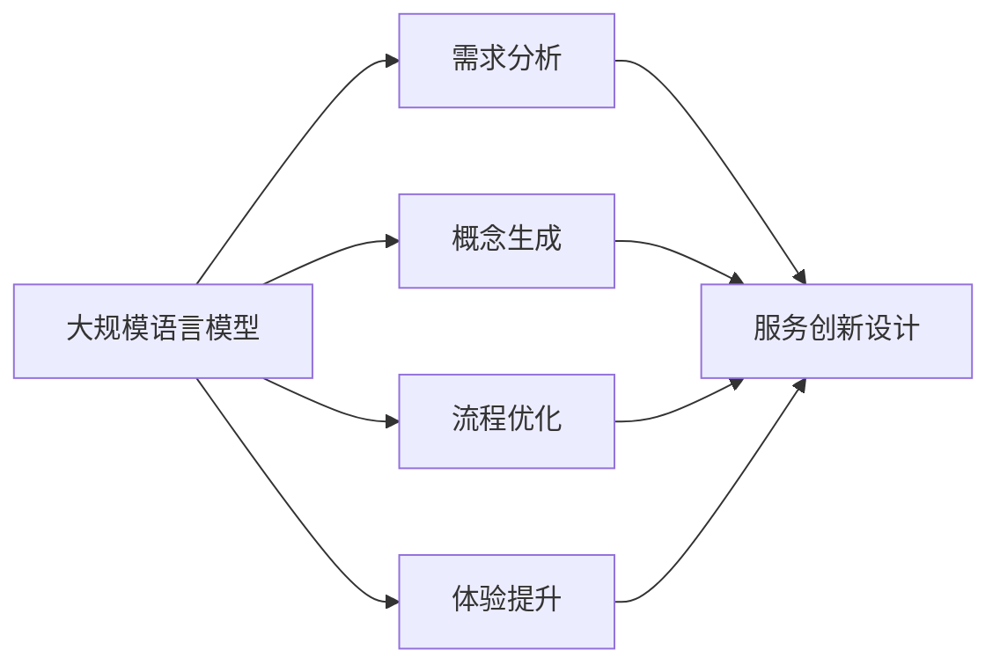

# 大规模语言模型在服务创新设计中的推理应用

> 关键词：大规模语言模型、服务创新设计、推理应用、自然语言处理、人工智能

> 摘要：本文围绕大规模语言模型在服务创新设计中的推理应用展开深入探讨。首先介绍了相关背景，包括目的范围、预期读者等内容。接着阐述大规模语言模型与服务创新设计的核心概念及联系，详细讲解其核心算法原理与操作步骤，通过数学模型和公式进行理论支撑，并给出实际案例。还探讨了在不同场景下的应用，推荐了学习、开发等相关工具和资源。最后总结未来发展趋势与挑战，解答常见问题并提供参考资料，旨在全面呈现大规模语言模型在服务创新设计中推理应用的全貌，为相关领域的研究和实践提供有价值的参考。

## 1. 背景介绍 
### 1.1 目的和范围
在当今数字化快速发展的时代，服务创新设计对于企业的竞争力提升和社会的进步具有至关重要的意义。大规模语言模型作为人工智能领域的重要成果，展现出了强大的自然语言处理和推理能力。本文章的目的在于深入研究大规模语言模型在服务创新设计中的推理应用，探索如何利用这些模型的能力来推动服务设计的创新，提升服务的质量和效率。范围涵盖了大规模语言模型的基本原理、在服务创新设计中的具体推理方法、实际应用场景以及未来发展趋势等多个方面。

### 1.2 预期读者
本文预期读者包括从事服务设计、人工智能、自然语言处理等领域的研究人员和学者，他们可以从文中获取新的研究思路和方法；企业中的服务创新设计师、产品经理等专业人士，有助于他们在实际工作中更好地利用大规模语言模型进行服务创新；对人工智能和服务创新感兴趣的爱好者，能够帮助他们了解相关领域的前沿知识和应用案例。

### 1.3 文档结构概述
本文将按照以下结构进行阐述：首先介绍背景信息，让读者对研究的目的、范围、预期读者和文档结构有清晰的了解；接着阐述大规模语言模型与服务创新设计的核心概念及联系，构建理论基础；然后详细讲解核心算法原理和操作步骤，结合数学模型和公式进行深入分析；通过项目实战给出实际案例和代码解释；探讨在不同场景下的应用；推荐相关的工具和资源；最后总结未来发展趋势与挑战，解答常见问题并提供参考资料。

### 1.4 术语表
#### 1.4.1 核心术语定义
- **大规模语言模型**：指基于大量文本数据进行训练的深度学习模型，具有强大的语言理解和生成能力，如GPT - 3、BERT等。
- **服务创新设计**：通过对服务流程、服务模式、服务体验等方面进行创新和改进，以满足用户不断变化的需求，提升服务的竞争力和价值。
- **推理应用**：利用大规模语言模型的能力，根据给定的输入信息，进行逻辑推理和分析，得出相关的结论或建议，应用于服务创新设计的各个环节。

#### 1.4.2 相关概念解释
- **自然语言处理（NLP）**：是人工智能领域的一个重要分支，主要研究如何让计算机理解、处理和生成人类语言。大规模语言模型是自然语言处理技术的重要成果之一。
- **深度学习**：是一种基于人工神经网络的机器学习方法，通过构建多层神经网络来学习数据的特征和模式，大规模语言模型通常采用深度学习技术进行训练。

#### 1.4.3 缩略词列表
- **NLP**：自然语言处理（Natural Language Processing）
- **GPT**：生成式预训练变换器（Generative Pretrained Transformer）
- **BERT**：双向编码器表示来自变换器（Bidirectional Encoder Representations from Transformers）

## 2. 核心概念与联系 

### 大规模语言模型的原理和架构
大规模语言模型通常基于Transformer架构，Transformer架构由编码器和解码器组成，其核心是自注意力机制（Self - Attention Mechanism）。自注意力机制允许模型在处理输入序列时，动态地关注序列中不同位置的信息，从而更好地捕捉语言中的语义和上下文关系。

文本示意图：
```plaintext
输入序列 --> 嵌入层 --> 编码器（多个Transformer块） --> 解码器（多个Transformer块） --> 输出序列
```

Mermaid流程图：


### 服务创新设计的概念和流程
服务创新设计是一个系统性的过程，包括用户需求分析、服务概念生成、服务流程设计、服务体验优化等多个环节。其目标是通过创新的方式提供更优质、更个性化的服务，满足用户的需求和期望。

文本示意图：
```plaintext
用户需求分析 --> 服务概念生成 --> 服务流程设计 --> 服务体验优化 --> 服务实施与评估
```

Mermaid流程图：


### 大规模语言模型与服务创新设计的联系
大规模语言模型可以为服务创新设计提供强大的支持。在用户需求分析阶段，语言模型可以帮助分析用户的文本反馈，挖掘潜在的需求；在服务概念生成阶段，模型可以根据给定的主题和约束条件，生成创新的服务概念；在服务流程设计阶段，模型可以进行逻辑推理，优化服务流程；在服务体验优化阶段，模型可以生成个性化的服务建议，提升用户体验。

文本示意图：
```plaintext
大规模语言模型 -- 需求分析 --> 服务创新设计
大规模语言模型 -- 概念生成 --> 服务创新设计
大规模语言模型 -- 流程优化 --> 服务创新设计
大规模语言模型 -- 体验提升 --> 服务创新设计
```

Mermaid流程图：


## 3. 核心算法原理 & 具体操作步骤 

### 核心算法原理 - 自注意力机制
自注意力机制是Transformer架构的核心，其主要思想是通过计算输入序列中不同位置之间的相关性，来动态地分配注意力权重。具体来说，对于输入序列中的每个位置，自注意力机制会计算其与其他位置的相似度，然后根据相似度分配权重，最后将这些加权后的信息进行汇总。

以下是Python代码示例：
```python
import torch
import torch.nn as nn

class SelfAttention(nn.Module):
    def __init__(self, input_dim, d_k):
        super(SelfAttention, self).__init__()
        self.input_dim = input_dim
        self.d_k = d_k
        self.W_q = nn.Linear(input_dim, d_k)
        self.W_k = nn.Linear(input_dim, d_k)
        self.W_v = nn.Linear(input_dim, d_k)
        self.softmax = nn.Softmax(dim=-1)

    def forward(self, x):
        Q = self.W_q(x)
        K = self.W_k(x)
        V = self.W_v(x)
        scores = torch.matmul(Q, K.transpose(-2, -1)) / (self.d_k ** 0.5)
        attention_weights = self.softmax(scores)
        output = torch.matmul(attention_weights, V)
        return output, attention_weights
```

### 具体操作步骤
1. **数据预处理**：将输入的文本数据进行清洗、分词、编码等操作，转换为模型可以处理的格式。
```python
import torch
from transformers import AutoTokenizer

tokenizer = AutoTokenizer.from_pretrained('bert-base-uncased')
text = "This is a sample sentence."
input_ids = tokenizer(text, return_tensors='pt')['input_ids']
```
2. **模型加载**：选择合适的大规模语言模型，并加载预训练的权重。
```python
from transformers import AutoModel

model = AutoModel.from_pretrained('bert-base-uncased')
```
3. **推理过程**：将预处理后的数据输入到模型中，进行推理计算。
```python
outputs = model(input_ids)
last_hidden_state = outputs.last_hidden_state
```
4. **结果处理**：根据具体的应用需求，对模型的输出结果进行处理和分析。
```python
# 示例：取第一个词的隐藏状态
first_token_hidden_state = last_hidden_state[:, 0, :]
```

## 4. 数学模型和公式 & 详细讲解 & 举例说明 

### 自注意力机制的数学模型
自注意力机制的计算过程可以用以下公式表示：

给定输入序列 $\mathbf{X} = [\mathbf{x}_1, \mathbf{x}_2, \cdots, \mathbf{x}_n]$，其中 $\mathbf{x}_i \in \mathbb{R}^d$ 是第 $i$ 个位置的输入向量，$n$ 是序列的长度，$d$ 是向量的维度。

首先，通过线性变换得到查询矩阵 $\mathbf{Q}$、键矩阵 $\mathbf{K}$ 和值矩阵 $\mathbf{V}$：

$$\mathbf{Q} = \mathbf{X} \mathbf{W}_q$$
$$\mathbf{K} = \mathbf{X} \mathbf{W}_k$$
$$\mathbf{V} = \mathbf{X} \mathbf{W}_v$$

其中 $\mathbf{W}_q \in \mathbb{R}^{d \times d_k}$，$\mathbf{W}_k \in \mathbb{R}^{d \times d_k}$，$\mathbf{W}_v \in \mathbb{R}^{d \times d_k}$ 是可学习的权重矩阵，$d_k$ 是查询、键和值的维度。

然后，计算注意力分数矩阵 $\mathbf{S}$：

$$\mathbf{S} = \frac{\mathbf{Q} \mathbf{K}^T}{\sqrt{d_k}}$$

最后，通过 softmax 函数计算注意力权重矩阵 $\mathbf{A}$，并得到输出矩阵 $\mathbf{Z}$：

$$\mathbf{A} = \text{softmax}(\mathbf{S})$$
$$\mathbf{Z} = \mathbf{A} \mathbf{V}$$

### 详细讲解
- **查询（Query）、键（Key）和值（Value）**：查询矩阵 $\mathbf{Q}$ 用于表示当前位置的信息，键矩阵 $\mathbf{K}$ 用于表示其他位置的信息，值矩阵 $\mathbf{V}$ 用于表示其他位置的实际内容。
- **注意力分数矩阵 $\mathbf{S}$**：通过计算查询和键的相似度，得到注意力分数矩阵。$\frac{1}{\sqrt{d_k}}$ 是为了防止点积结果过大，导致 softmax 函数的梯度消失。
- **注意力权重矩阵 $\mathbf{A}$**：通过 softmax 函数将注意力分数矩阵转换为概率分布，即注意力权重矩阵。
- **输出矩阵 $\mathbf{Z}$**：将注意力权重矩阵与值矩阵相乘，得到加权后的信息，即输出矩阵。

### 举例说明
假设输入序列 $\mathbf{X} = \begin{bmatrix} 1 & 2 & 3 \\ 4 & 5 & 6 \\ 7 & 8 & 9 \end{bmatrix}$，$d = 3$，$d_k = 2$，$\mathbf{W}_q = \begin{bmatrix} 0.1 & 0.2 \\ 0.3 & 0.4 \\ 0.5 & 0.6 \end{bmatrix}$，$\mathbf{W}_k = \begin{bmatrix} 0.7 & 0.8 \\ 0.9 & 1.0 \\ 1.1 & 1.2 \end{bmatrix}$，$\mathbf{W}_v = \begin{bmatrix} 1.3 & 1.4 \\ 1.5 & 1.6 \\ 1.7 & 1.8 \end{bmatrix}$。

首先，计算查询矩阵 $\mathbf{Q}$：

$$\mathbf{Q} = \mathbf{X} \mathbf{W}_q = \begin{bmatrix} 1 & 2 & 3 \\ 4 & 5 & 6 \\ 7 & 8 & 9 \end{bmatrix} \begin{bmatrix} 0.1 & 0.2 \\ 0.3 & 0.4 \\ 0.5 & 0.6 \end{bmatrix} = \begin{bmatrix} 2.2 & 2.8 \\ 4.9 & 6.4 \\ 7.6 & 10.0 \end{bmatrix}$$

同理，计算键矩阵 $\mathbf{K}$ 和值矩阵 $\mathbf{V}$。

然后，计算注意力分数矩阵 $\mathbf{S}$：

$$\mathbf{S} = \frac{\mathbf{Q} \mathbf{K}^T}{\sqrt{d_k}}$$

最后，计算注意力权重矩阵 $\mathbf{A}$ 和输出矩阵 $\mathbf{Z}$。

## 5. 项目实战：代码实际案例和详细解释说明 

### 5.1  开发环境搭建
1. **安装Python**：建议使用Python 3.7及以上版本，可以从Python官方网站下载安装。
2. **安装依赖库**：使用pip命令安装必要的库，如`transformers`、`torch`等。
```bash
pip install transformers torch
```

### 5.2  源代码详细实现和代码解读
以下是一个利用大规模语言模型进行服务概念生成的示例代码：
```python
from transformers import AutoTokenizer, AutoModelForCausalLM

# 加载预训练的语言模型和分词器
tokenizer = AutoTokenizer.from_pretrained('gpt2')
model = AutoModelForCausalLM.from_pretrained('gpt2')

# 定义服务主题
service_topic = "在线教育服务创新"

# 生成提示文本
prompt = f"请提出一些关于 {service_topic} 的创新服务概念："

# 对提示文本进行编码
input_ids = tokenizer(prompt, return_tensors='pt').input_ids

# 生成文本
output = model.generate(input_ids, max_length=200, num_return_sequences=3)

# 解码生成的文本
for i, sample_output in enumerate(output):
    print(f"服务概念 {i + 1}:")
    print(tokenizer.decode(sample_output, skip_special_tokens=True))
    print()
```

### 5.3  代码解读与分析
1. **模型和分词器加载**：使用`AutoTokenizer`和`AutoModelForCausalLM`从预训练模型库中加载GPT - 2模型和对应的分词器。
2. **提示文本生成**：根据服务主题生成提示文本，引导模型生成相关的服务概念。
3. **编码和生成**：使用分词器对提示文本进行编码，将编码后的输入传递给模型进行文本生成。
4. **解码和输出**：使用分词器对生成的文本进行解码，并输出结果。

通过这个示例，我们可以看到如何利用大规模语言模型进行服务概念生成，为服务创新设计提供创意和灵感。

## 6. 实际应用场景 
### 客户服务创新
大规模语言模型可以用于智能客服系统，通过对用户问题的理解和推理，提供更准确、更个性化的回答。例如，当用户咨询产品信息时，模型可以根据用户的历史记录和当前问题，推理出用户的需求，提供针对性的产品推荐和解决方案。

### 服务流程优化
在服务流程设计中，语言模型可以分析现有的服务流程和用户反馈，找出其中的痛点和问题，并提出优化建议。例如，通过对用户投诉文本的分析，模型可以推理出服务流程中可能存在的瓶颈，建议增加或调整某些环节，提高服务效率。

### 新服务开发
在新服务开发过程中，语言模型可以帮助生成创新的服务概念和商业模式。例如，根据市场趋势和用户需求，模型可以生成不同类型的新服务方案，包括服务内容、服务方式、收费模式等，为企业的决策提供参考。

### 服务体验提升
大规模语言模型可以根据用户的行为数据和反馈，推理出用户的情感和满意度，从而提供个性化的服务体验。例如，在旅游服务中，模型可以根据用户的旅游偏好和历史评价，为用户推荐更符合其需求的旅游线路和景点，提升用户的旅游体验。

## 7. 工具和资源推荐
### 7.1 学习资源推荐
#### 7.1.1 书籍推荐
- 《深度学习》（Deep Learning）：由Ian Goodfellow、Yoshua Bengio和Aaron Courville所著，是深度学习领域的经典教材，涵盖了深度学习的基本原理、算法和应用。
- 《自然语言处理入门》：详细介绍了自然语言处理的基本概念、方法和技术，适合初学者入门。
- 《Attention Is All You Need》：Transformer架构的原始论文，对理解大规模语言模型的核心原理有重要意义。

#### 7.1.2 在线课程
- Coursera上的“深度学习专项课程”（Deep Learning Specialization）：由Andrew Ng教授授课，系统地介绍了深度学习的各个方面。
- edX上的“自然语言处理基础”（Foundations of Natural Language Processing）：帮助学习者掌握自然语言处理的基本技术和方法。

#### 7.1.3 技术博客和网站
- Hugging Face博客：提供了关于大规模语言模型和自然语言处理的最新研究成果和应用案例。
- Medium上的AI相关博客：有许多优秀的作者分享关于人工智能和自然语言处理的技术文章和经验。

### 7.2 开发工具框架推荐
#### 7.2.1 IDE和编辑器
- PyCharm：功能强大的Python集成开发环境，提供代码编辑、调试、版本控制等功能。
- Visual Studio Code：轻量级的代码编辑器，支持多种编程语言和插件扩展，适合快速开发和调试。

#### 7.2.2 调试和性能分析工具
- Tensor