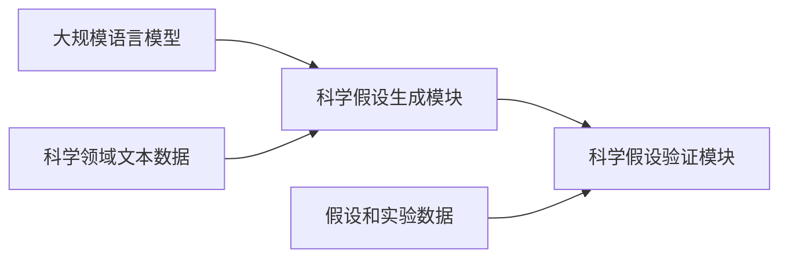

# 大规模语言模型在科学假设生成与验证中的应用

> 关键词：大规模语言模型、科学假设生成、科学假设验证、自然语言处理、人工智能

> 摘要：本文深入探讨了大规模语言模型在科学假设生成与验证中的应用。首先介绍了相关背景，包括研究目的、预期读者、文档结构和术语表。接着阐述了核心概念，给出了原理和架构的文本示意图与Mermaid流程图。详细讲解了核心算法原理及操作步骤，结合Python源代码进行说明。分析了相关数学模型和公式，并举例阐释。通过项目实战，给出代码实际案例并详细解读。探讨了实际应用场景，推荐了学习资源、开发工具框架和相关论文著作。最后总结了未来发展趋势与挑战，解答了常见问题并提供了扩展阅读和参考资料，旨在为相关领域的研究和应用提供全面且深入的指导。

## 1. 背景介绍 
### 1.1 目的和范围
科学研究的核心在于提出有价值的假设并进行有效的验证。传统的科学假设生成往往依赖于科学家的经验、专业知识和直觉，这一过程不仅耗时费力，而且容易受到个人认知局限的影响。而假设验证则需要大量的实验设计、数据收集和分析工作。大规模语言模型（LLMs）的出现为科学假设的生成与验证提供了新的思路和方法。

本文的目的是全面探讨大规模语言模型在科学假设生成与验证中的应用，涵盖了从理论原理到实际操作的各个方面。范围包括介绍大规模语言模型的基本概念和工作原理，分析其在科学假设生成与验证中的具体应用方式，通过实际案例展示其应用效果，以及探讨未来的发展趋势和面临的挑战。

### 1.2 预期读者
本文的预期读者包括从事科学研究的科研人员，如物理学家、生物学家、化学家等，他们可以借助大规模语言模型的能力来辅助自己的研究工作，提高假设生成的效率和质量。同时，也适合对人工智能在科学领域应用感兴趣的计算机科学家、数据科学家和工程师，他们可以从中了解大规模语言模型在科学研究中的具体应用场景和技术实现细节。此外，对于相关专业的学生和教育工作者，本文也可以作为学习和教学的参考资料。

### 1.3 文档结构概述
本文将按照以下结构进行组织：首先介绍核心概念与联系，包括大规模语言模型、科学假设生成和验证的基本原理以及它们之间的关系，并通过文本示意图和Mermaid流程图进行直观展示。接着详细讲解核心算法原理和具体操作步骤，使用Python源代码进行说明。然后分析相关的数学模型和公式，并通过具体例子进行详细讲解。之后进行项目实战，包括开发环境搭建、源代码实现和代码解读。再探讨大规模语言模型在科学假设生成与验证中的实际应用场景。推荐相关的学习资源、开发工具框架和论文著作。最后总结未来发展趋势与挑战，解答常见问题并提供扩展阅读和参考资料。

### 1.4 术语表
#### 1.4.1 核心术语定义
- **大规模语言模型（Large Language Model，LLM）**：是一种基于深度学习的人工智能模型，通过在大规模文本数据上进行训练，学习语言的模式和规律，能够生成自然语言文本、回答问题、进行语言翻译等任务。
- **科学假设（Scientific Hypothesis）**：是对自然现象或科学问题的一种推测性解释，通常基于已有的观察和知识，需要通过进一步的实验或观察来验证其正确性。
- **假设生成（Hypothesis Generation）**：是指提出科学假设的过程，包括从已有的数据、理论和观察中发现问题，提出可能的解释和预测。
- **假设验证（Hypothesis Verification）**：是指通过实验、观察或其他方法来检验科学假设的正确性的过程。

#### 1.4.2 相关概念解释
- **自然语言处理（Natural Language Processing，NLP）**：是人工智能的一个重要领域，研究如何让计算机理解、处理和生成自然语言。大规模语言模型是自然语言处理的重要成果之一。
- **深度学习（Deep Learning）**：是一种基于人工神经网络的机器学习方法，通过构建多层神经网络来学习数据的特征和模式。大规模语言模型通常采用深度学习技术进行训练。
- **数据驱动（Data-driven）**：是指在科学研究和决策过程中，依靠大量的数据来发现规律、提出假设和验证结论。大规模语言模型的训练和应用都依赖于大量的文本数据。

#### 1.4.3 缩略词列表
- **LLM**：Large Language Model（大规模语言模型）
- **NLP**：Natural Language Processing（自然语言处理）

## 2. 核心概念与联系 

### 核心概念原理
#### 大规模语言模型原理
大规模语言模型基于Transformer架构，Transformer架构主要由编码器和解码器组成。编码器负责对输入的文本进行特征提取，解码器则根据编码器的输出生成文本。在训练过程中，模型通过预测下一个单词的概率来学习语言的模式和规律。例如，给定一个句子“今天天气很”，模型会预测下一个可能的单词，如“好”“晴朗”等。通过在大规模文本数据上进行训练，模型可以学习到丰富的语言知识，从而能够生成高质量的自然语言文本。

#### 科学假设生成原理
科学假设生成是一个创造性的过程，通常基于已有的科学知识、观察和实验数据。研究人员通过对这些信息的分析和思考，发现问题并提出可能的解释和预测。大规模语言模型可以辅助科学假设生成，它可以根据输入的科学领域的文本数据，学习该领域的知识和模式，然后基于这些知识生成可能的假设。例如，在生物学领域，输入有关基因表达的文本数据，模型可以根据这些数据生成关于基因调控机制的假设。

#### 科学假设验证原理
科学假设验证需要设计实验、收集数据并进行统计分析。研究人员根据假设设计实验方案，通过实验收集数据，然后使用统计方法对数据进行分析，以判断假设是否成立。大规模语言模型可以在假设验证过程中提供帮助，例如，它可以根据实验数据生成可能的解释和结论，辅助研究人员进行数据分析和判断。

### 架构的文本示意图
```plaintext
+---------------------+
| 大规模语言模型      |
| （Transformer架构） |
+---------------------+
       |
       | 输入科学领域文本数据
       v
+---------------------+
| 科学假设生成模块    |
| 学习领域知识和模式  |
| 生成可能的假设      |
+---------------------+
       |
       | 假设和实验数据
       v
+---------------------+
| 科学假设验证模块    |
| 辅助数据分析和判断  |
| 生成解释和结论      |
+---------------------+
```

### Mermaid流程图


## 3. 核心算法原理 & 具体操作步骤 

### 核心算法原理
大规模语言模型的核心算法基于Transformer架构，Transformer架构中的注意力机制是其关键。注意力机制允许模型在处理每个单词时，关注输入序列中的其他相关单词。例如，在句子“猫追老鼠”中，处理“追”这个单词时，模型会关注“猫”和“老鼠”这两个相关的单词。

以下是一个简化的注意力机制的Python代码实现：
```python
import torch
import torch.nn as nn

class Attention(nn.Module):
    def __init__(self, input_dim, hidden_dim):
        super(Attention, self).__init__()
        self.W_q = nn.Linear(input_dim, hidden_dim)
        self.W_k = nn.Linear(input_dim, hidden_dim)
        self.W_v = nn.Linear(input_dim, hidden_dim)
        self.softmax = nn.Softmax(dim=-1)

    def forward(self, query, key, value):
        Q = self.W_q(query)
        K = self.W_k(key)
        V = self.W_v(value)
        scores = torch.matmul(Q, K.transpose(-2, -1)) / torch.sqrt(torch.tensor(Q.size(-1), dtype=torch.float32))
        attention_weights = self.softmax(scores)
        output = torch.matmul(attention_weights, V)
        return output

# 示例使用
input_dim = 128
hidden_dim = 64
attention = Attention(input_dim, hidden_dim)
query = torch.randn(10, 5, input_dim)
key = torch.randn(10, 5, input_dim)
value = torch.randn(10, 5, input_dim)
output = attention(query, key, value)
print(output.shape)
```

### 具体操作步骤
#### 数据准备
首先需要收集科学领域的文本数据，例如学术论文、研究报告等。对数据进行清洗和预处理，包括去除噪声、分词、标注等操作。

#### 模型训练
使用准备好的数据对大规模语言模型进行训练。训练过程通常包括定义模型架构、选择损失函数和优化器，然后进行多轮迭代训练。

#### 假设生成
将科学领域的相关文本输入到训练好的模型中，模型根据学习到的知识生成可能的假设。可以通过调整模型的参数和生成策略来控制假设的质量和多样性。

#### 假设验证
将生成的假设和相关的实验数据输入到假设验证模块中。该模块可以使用统计分析方法和机器学习算法对数据进行分析，判断假设是否成立。同时，模型可以生成对实验结果的解释和结论，辅助研究人员进行决策。

## 4. 数学模型和公式 & 详细讲解 & 举例说明 

### 注意力机制数学模型
注意力机制的核心公式如下：
$$Attention(Q, K, V) = softmax(\frac{QK^T}{\sqrt{d_k}})V$$
其中，$Q$ 是查询矩阵，$K$ 是键矩阵，$V$ 是值矩阵，$d_k$ 是查询和键向量的维度。

详细讲解：首先计算查询矩阵 $Q$ 和键矩阵 $K$ 的转置的乘积，得到得分矩阵。然后将得分矩阵除以 $\sqrt{d_k}$ 进行缩放，以避免点积结果过大。接着使用 softmax 函数将得分矩阵转换为注意力权重矩阵，该矩阵表示每个位置的重要性。最后将注意力权重矩阵与值矩阵 $V$ 相乘，得到注意力输出。

举例说明：假设我们有一个输入序列 $[x_1, x_2, x_3]$，每个元素的维度为 $d$。我们将其分别映射到查询、键和值空间，得到 $Q = [q_1, q_2, q_3]$，$K = [k_1, k_2, k_3]$，$V = [v_1, v_2, v_3]$。计算得分矩阵 $S$：
$$S_{ij} = \frac{q_i^T k_j}{\sqrt{d}}$$
其中，$S_{ij}$ 表示第 $i$ 个查询与第 $j$ 个键的得分。然后计算注意力权重矩阵 $A$：
$$A_{ij} = \frac{exp(S_{ij})}{\sum_{k=1}^{n} exp(S_{ik})}$$
最后计算注意力输出 $O$：
$$O_i = \sum_{j=1}^{n} A_{ij} v_j$$

### 交叉熵损失函数
在大规模语言模型的训练中，通常使用交叉熵损失函数来衡量模型预测结果与真实标签之间的差异。交叉熵损失函数的公式如下：
$$H(p, q) = -\sum_{i=1}^{n} p_i log(q_i)$$
其中，$p$ 是真实概率分布，$q$ 是模型预测的概率分布。

详细讲解：交叉熵损失函数衡量了两个概率分布之间的差异。当模型的预测结果与真实标签越接近时，交叉熵损失越小。在训练过程中，我们的目标是最小化交叉熵损失，从而使模型的预测结果更接近真实标签。

举例说明：假设我们有一个分类问题，真实标签的概率分布为 $p = [0, 1, 0]$，模型预测的概率分布为 $q = [0.1, 0.8, 0.1]$。则交叉熵损失为：
$$H(p, q) = -(0 \times log(0.1) + 1 \times log(0.8) + 0 \times log(0.1)) \approx 0.223$$

## 5. 项目实战：代码实际案例和详细解释说明 

### 5.1  开发环境搭建
#### 安装Python
首先需要安装Python 3.7或更高版本。可以从Python官方网站（https://www.python.org/downloads/）下载适合自己操作系统的安装包进行安装。

#### 安装深度学习框架
推荐使用PyTorch作为深度学习框架。可以使用以下命令安装PyTorch：
```bash
pip install torch torchvision
```

#### 安装其他依赖库
还需要安装一些其他的依赖库，如`transformers`、`numpy`、`pandas`等。可以使用以下命令安装：
```bash
pip install transformers numpy pandas
```

### 5.2  源代码详细实现和代码解读
以下是一个使用`transformers`库进行科学假设生成的简单示例代码：
```python
from transformers import AutoTokenizer, AutoModelForCausalLM

# 加载预训练的语言模型和分词器
model_name = "gpt2"
tokenizer = AutoTokenizer.from_pretrained(model_name)
model = AutoModelForCausalLM.from_pretrained(model_name)

# 输入科学领域的文本
input_text = "在物理学中，关于黑洞的形成，"

# 对输入文本进行分词
input_ids = tokenizer.encode(input_text, return_tensors="pt")

# 生成假设
output = model.generate(input_ids, max_length=100, num_return_sequences=1)

# 解码生成的文本
generated_text = tokenizer.decode(output[0], skip_special_tokens=True)

print("生成的假设：", generated_text)
```
代码解读：
1. **加载预训练的语言模型和分词器**：使用`transformers`库的`AutoTokenizer`和`AutoModelForCausalLM`类加载预训练的GPT-2模型和对应的分词器。
2. **输入科学领域的文本**：定义一个输入文本，这里是关于物理学中黑洞形成的相关描述。
3. **对输入文本进行分词**：使用分词器将输入文本转换为模型可以处理的输入ID。
4. **生成假设**：调用模型的`generate`方法生成假设，设置最大长度为100，并只返回一个生成的序列。
5. **解码生成的文本**：使用分词器将生成的ID序列解码为自然语言文本。

### 5.3  代码解读与分析
上述代码展示了如何使用预训练的语言模型进行科学假设生成。通过简单的几行代码，我们就可以利用大规模语言模型的能力生成可能的假设。然而，需要注意的是，生成的假设的质量和合理性依赖于模型的训练数据和性能。在实际应用中，可能需要对模型进行微调，以适应特定科学领域的需求。同时，生成的假设还需要进一步的验证和评估。

## 6. 实际应用场景 
### 物理学领域
在物理学中，大规模语言模型可以辅助物理学家提出关于宇宙起源、黑洞性质、量子力学等方面的假设。例如，通过输入有关宇宙微波背景辐射的数据和理论，模型可以生成关于宇宙早期演化的新假设。然后物理学家可以根据这些假设设计实验进行验证，如使用射电望远镜进行观测等。

### 生物学领域
在生物学中，大规模语言模型可以帮助生物学家生成关于基因功能、蛋白质结构和生物进化的假设。例如，输入基因序列和相关的表达数据，模型可以生成关于基因调控网络的假设。生物学家可以通过基因编辑技术和蛋白质结晶实验等方法对这些假设进行验证。

### 化学领域
在化学中，大规模语言模型可以用于生成关于化学反应机理、新材料合成的假设。例如，输入反应物和反应条件，模型可以生成可能的反应路径和产物。化学家可以通过实验合成新材料，并使用光谱分析等方法验证假设。

### 医学领域
在医学中，大规模语言模型可以辅助医生和研究人员生成关于疾病发病机制、药物研发的假设。例如，输入患者的临床数据和基因信息，模型可以生成关于疾病遗传因素和治疗靶点的假设。医学研究人员可以通过临床试验和细胞实验等方法对这些假设进行验证。

## 7. 工具和资源推荐
### 7.1 学习资源推荐
#### 7.1.1 书籍推荐
- 《深度学习》（Deep Learning）：由Ian Goodfellow、Yoshua Bengio和Aaron Courville所著，是深度学习领域的经典教材，全面介绍了深度学习的理论和方法。
- 《自然语言处理入门》（Natural Language Processing in Action）：由Hobson Lane、Cole Howard和 Hannes Hapke所著，详细介绍了自然语言处理的基本概念和技术。
- 《人工智能：一种现代的方法》（Artificial Intelligence: A Modern Approach）：由Stuart Russell和Peter Norvig所著，是人工智能领域的权威教材，涵盖了人工智能的各个方面。

#### 7.1.2 在线课程
- Coursera上的“深度学习专项课程”（Deep Learning Specialization）：由Andrew Ng教授授课，系统介绍了深度学习的理论和实践。
- edX上的“自然语言处理基础”（Foundations of Natural Language Processing）：由哥伦比亚大学的教授授课，深入讲解了自然语言处理的核心技术。
- Udemy上的“Python自然语言处理实战”（Natural Language Processing with Python）：通过实际案例介绍了如何使用Python进行自然语言处理。

#### 7.1.3 技术博客和网站
- Medium：有很多关于人工智能和自然语言处理的技术博客文章，作者来自世界各地的研究人员和工程师。
- arXiv：是一个预印本数据库，包含了大量关于人工智能和科学研究的最新论文。
- Hugging Face：是一个专注于自然语言处理的开源社区，提供了丰富的模型和工具。

### 7.2 开发工具框架推荐
#### 7.2.1 IDE和编辑器
- PyCharm：是一款专业的Python集成开发环境，提供了丰富的代码编辑、调试和版本控制功能。
- Jupyter Notebook：是一个交互式的开发环境，适合进行数据分析和模型实验。
- Visual Studio Code：是一款轻量级的代码编辑器，支持多种编程语言和插件扩展。

#### 7.2.2 调试和性能分析工具
- TensorBoard：是TensorFlow的可视化工具，可以用于监控模型的训练过程和性能指标。
- PyTorch Profiler：是PyTorch的性能分析工具，可以帮助开发者找出代码中的性能瓶颈。
- cProfile：是Python的内置性能分析工具，可以分析代码的运行时间和函数调用情况。

#### 7.2.3 相关框架和库
- Transformers：是Hugging Face开发的一个用于自然语言处理的开源库，提供了大量的预训练模型和工具。
- NLTK：是Python的自然语言处理工具包，提供了丰富的文本处理功能和语料库。
- SpaCy：是一个快速、高效的自然语言处理库，提供了多种语言的处理支持。

### 7.3 相关论文著作推荐
#### 7.3.1 经典论文
- “Attention Is All You Need”：提出了Transformer架构，是大规模语言模型的基础。
- “BERT: Pre-training of Deep Bidirectional Transformers for Language Understanding”：介绍了BERT模型，开创了预训练语言模型的新时代。
- “Generative Adversarial Nets”：提出了生成对抗网络（GAN），对自然语言生成有重要影响。

#### 7.3.2 最新研究成果
- 关注arXiv上关于大规模语言模型和科学研究的最新论文，了解该领域的前沿动态。
- 参加国际人工智能会议，如NeurIPS、ICML等，获取最新的研究成果。

#### 7.3.3 应用案例分析
- 一些学术期刊和会议会发表大规模语言模型在科学领域的应用案例，如《Nature》《Science》等。可以通过阅读这些案例了解实际应用中的经验和挑战。

## 8. 总结：未来发展趋势与挑战
### 未来发展趋势
#### 与领域知识的深度融合
未来大规模语言模型将与各个科学领域的专业知识进行更深度的融合。通过结合领域内的专业数据库和知识图谱，模型可以生成更具专业性和准确性的科学假设。例如，在医学领域，结合电子病历、医学影像和医学知识库，模型可以生成更精准的疾病诊断和治疗方案假设。

#### 多模态信息处理
除了文本信息，未来的大规模语言模型将能够处理图像、音频、视频等多模态信息。在科学研究中，多模态信息可以提供更丰富的证据和线索，有助于生成更全面的科学假设。例如，在天文学中，结合天文图像和光谱数据，模型可以生成关于星系演化的更准确假设。

#### 协同式科学研究
大规模语言模型将促进科学家之间的协同式研究。模型可以作为一个智能助手，帮助科学家在全球范围内进行知识共享和合作。例如，不同国家的科学家可以通过模型共同探讨和验证关于气候变化的假设。

### 面临的挑战
#### 数据质量和隐私问题
大规模语言模型的训练依赖于大量的数据，数据的质量直接影响模型的性能。在科学研究中，数据的收集和标注往往需要专业知识和大量的时间成本。同时，数据隐私也是一个重要问题，特别是在医学和生物学等领域，涉及到患者的个人信息和生物样本数据。

#### 模型可解释性
大规模语言模型通常是一个黑盒模型，其决策过程和生成的假设难以解释。在科学研究中，可解释性是非常重要的，科学家需要了解模型生成假设的依据和推理过程。因此，提高模型的可解释性是一个亟待解决的问题。

#### 伦理和法律问题
大规模语言模型在科学假设生成与验证中的应用可能会带来一些伦理和法律问题。例如，模型生成的错误假设可能会误导科学研究，导致资源的浪费和研究方向的偏差。同时，模型的应用也可能涉及到知识产权和责任归属等法律问题。

## 9. 附录：常见问题与解答
### 问题1：大规模语言模型生成的假设一定正确吗？
解答：不一定。大规模语言模型生成的假设是基于其学习到的语言模式和知识，虽然模型可以根据输入的信息生成看似合理的假设，但这些假设仍然需要通过实验和观察进行验证。模型可能会受到训练数据的局限性和噪声的影响，导致生成的假设存在错误或不合理的情况。

### 问题2：如何评估大规模语言模型生成的假设的质量？
解答：可以从以下几个方面评估假设的质量：一是合理性，假设是否符合已有的科学知识和理论；二是可验证性，假设是否可以通过实验或观察进行验证；三是创新性，假设是否具有新颖性和独特性，能够为科学研究提供新的思路和方向。

### 问题3：大规模语言模型可以完全替代科学家进行科学假设生成与验证吗？
解答：不能。大规模语言模型可以作为科学家的辅助工具，帮助他们提高假设生成的效率和质量，但不能完全替代科学家的创造力、判断力和专业知识。科学研究是一个复杂的过程，需要科学家进行深入的思考、实验设计和数据分析，而这些能力是模型目前所不具备的。

## 10. 扩展阅读 & 参考资料
### 扩展阅读
- 《人工智能时代的科学发现》：探讨了人工智能在科学研究中的应用和发展趋势。
- 《科学研究的逻辑》：介绍了科学研究的基本方法和逻辑推理过程。

### 参考资料
- 《Attention Is All You Need》，Vaswani et al., 2017
- 《BERT: Pre-training of Deep Bidirectional Transformers for Language Understanding》，Devlin et al., 2018
- 《Generative Adversarial Nets》，Goodfellow et al., 2014

作者：AI天才研究院/AI Genius Institute & 禅与计算机程序设计艺术 /Zen And The Art of Computer Programming