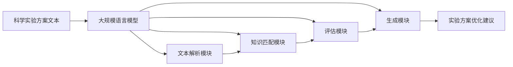

# 大规模语言模型在科学实验方案优化中的应用

> 关键词：大规模语言模型、科学实验方案优化、自然语言处理、实验设计、人工智能

> 摘要：本文深入探讨了大规模语言模型在科学实验方案优化中的应用。首先介绍了相关背景，包括目的、预期读者、文档结构和术语表。接着阐述了核心概念及其联系，给出了原理和架构的文本示意图与 Mermaid 流程图。详细讲解了核心算法原理及具体操作步骤，通过 Python 源代码进行说明。同时，介绍了相关数学模型和公式，并举例说明。在项目实战部分，给出了开发环境搭建、源代码实现及解读。分析了实际应用场景，推荐了学习资源、开发工具框架和相关论文著作。最后总结了未来发展趋势与挑战，还提供了常见问题解答和扩展阅读参考资料，旨在为利用大规模语言模型优化科学实验方案提供全面的指导。

## 1. 背景介绍 
### 1.1 目的和范围
科学实验是推动科学进步的重要手段，而优化实验方案能够提高实验效率、降低成本、提升实验结果的准确性和可靠性。大规模语言模型（Large Language Models，LLMs）作为人工智能领域的重要成果，具有强大的自然语言理解和生成能力。本文章的目的在于探讨如何将大规模语言模型应用于科学实验方案优化中，具体范围涵盖了从实验方案的设计、评估到改进的整个过程，涉及多个科学领域的实验场景。

### 1.2 预期读者
本文预期读者包括科研工作者、实验设计人员、人工智能领域的从业者以及对科学实验和人工智能交叉领域感兴趣的爱好者。科研工作者可以通过本文了解如何利用大规模语言模型来提升自己的实验方案质量；实验设计人员可以获取新的方法和思路，优化实验流程；人工智能从业者可以从中发现新的应用场景和研究方向；而爱好者则可以对该领域有一个全面的认识。

### 1.3 文档结构概述
本文首先介绍背景信息，让读者对主题有一个初步的了解。接着阐述核心概念与联系，帮助读者建立起理论框架。然后详细讲解核心算法原理和具体操作步骤，使读者明白如何在技术层面实现。通过数学模型和公式进一步深入分析，结合实际例子增强理解。在项目实战部分，通过具体代码案例展示应用过程。分析实际应用场景，让读者了解其实际价值。推荐相关的工具和资源，方便读者进一步学习和实践。最后总结未来发展趋势与挑战，并提供常见问题解答和扩展阅读参考资料。

### 1.4 术语表
#### 1.4.1 核心术语定义
- **大规模语言模型（Large Language Models，LLMs）**：基于深度学习技术，在大规模文本数据上进行训练的语言模型，能够学习到语言的模式和规律，具备强大的自然语言处理能力，如 GPT - 3、BERT 等。
- **科学实验方案**：为了实现特定的科学研究目标而设计的一系列实验步骤、方法、条件等的详细规划。
- **实验方案优化**：通过对现有实验方案进行分析、评估和改进，以提高实验的效率、准确性、可靠性等性能指标的过程。

#### 1.4.2 相关概念解释
- **自然语言处理（Natural Language Processing，NLP）**：是人工智能的一个重要分支，研究如何让计算机理解、处理和生成人类语言。大规模语言模型是自然语言处理领域的重要成果之一。
- **实验设计（Experimental Design）**：是指应用于实验研究的规划和安排，旨在通过合理的设计来控制实验变量，减少误差，提高实验结果的有效性和可靠性。

#### 1.4.3 缩略词列表
- **LLMs**：Large Language Models，大规模语言模型
- **NLP**：Natural Language Processing，自然语言处理

## 2. 核心概念与联系 

### 核心概念原理
大规模语言模型的核心原理基于深度学习中的神经网络架构，如 Transformer。Transformer 架构通过自注意力机制（Self - Attention Mechanism）能够有效地捕捉文本中的长距离依赖关系。在训练过程中，大规模语言模型在海量的文本数据上进行无监督学习，学习到语言的语法、语义和上下文信息。

对于科学实验方案优化，其原理是利用大规模语言模型的自然语言理解能力，对实验方案文本进行解析，提取关键信息，如实验目的、实验步骤、实验变量等。然后，基于模型学习到的知识和模式，对实验方案进行评估和改进建议的生成。

### 架构的文本示意图
```plaintext
输入：科学实验方案文本
|
V
大规模语言模型
- 文本解析模块：解析实验方案中的关键信息
- 知识匹配模块：将关键信息与模型知识进行匹配
- 评估模块：评估实验方案的合理性和有效性
- 生成模块：生成优化建议
|
V
输出：实验方案优化建议
```

### Mermaid 流程图


## 3. 核心算法原理 & 具体操作步骤 

### 核心算法原理
在使用大规模语言模型进行科学实验方案优化时，主要涉及到文本嵌入、相似度计算和生成模型等算法。

#### 文本嵌入
文本嵌入是将文本转换为向量表示的过程。以 BERT 模型为例，其输入是一系列的词元（tokens），经过多层 Transformer 编码器后，输出每个词元的向量表示。可以通过对这些向量进行聚合（如取平均）得到整个文本的向量表示。

以下是使用 Python 和 Transformers 库进行文本嵌入的示例代码：
```python
from transformers import AutoTokenizer, AutoModel
import torch

# 加载预训练的 BERT 模型和分词器
tokenizer = AutoTokenizer.from_pretrained('bert-base-uncased')
model = AutoModel.from_pretrained('bert-base-uncased')

# 输入文本
text = "This is a sample experiment plan."

# 对文本进行分词
inputs = tokenizer(text, return_tensors='pt')

# 通过模型获取输出
outputs = model(**inputs)

# 取 [CLS] 标记的向量作为文本的表示
text_embedding = outputs.last_hidden_state[:, 0, :].detach().numpy()
print(text_embedding)
```

#### 相似度计算
在评估实验方案时，需要计算实验方案文本与知识库中优秀实验方案文本的相似度。常用的相似度计算方法有余弦相似度。

以下是计算余弦相似度的 Python 代码：
```python
import numpy as np
from sklearn.metrics.pairwise import cosine_similarity

# 假设有两个文本嵌入向量
embedding1 = np.random.rand(768)
embedding2 = np.random.rand(768)

# 计算余弦相似度
similarity = cosine_similarity([embedding1], [embedding2])
print(similarity)
```

#### 生成模型
生成模型用于生成实验方案的优化建议。以 GPT - 3 为例，可以通过向模型输入实验方案的相关信息，让模型生成优化建议。

以下是使用 OpenAI API 调用 GPT - 3 生成优化建议的示例代码：
```python
import openai

# 设置 API 密钥
openai.api_key = "YOUR_API_KEY"

# 实验方案文本
experiment_plan = "We will conduct an experiment to measure the growth rate of plants. We will plant 10 plants in a pot and water them once a day."

# 生成优化建议的提示
prompt = f"Please provide optimization suggestions for the following experiment plan: {experiment_plan}"

# 调用 GPT - 3 生成建议
response = openai.Completion.create(
    engine="text-davinci-003",
    prompt=prompt,
    max_tokens=100
)

# 输出优化建议
suggestion = response.choices[0].text
print(suggestion)
```

### 具体操作步骤
1. **数据准备**：收集科学实验方案文本数据，可以从学术论文、实验报告等渠道获取。同时，构建一个知识库，包含优秀的实验方案和相关的科学知识。
2. **文本预处理**：对实验方案文本进行清洗、分词等预处理操作，以便后续输入到大规模语言模型中。
3. **模型选择和加载**：根据具体需求选择合适的大规模语言模型，如 BERT、GPT - 3 等，并加载预训练的模型。
4. **文本嵌入和相似度计算**：将实验方案文本转换为向量表示，计算其与知识库中优秀实验方案的相似度，评估实验方案的合理性。
5. **生成优化建议**：根据评估结果，使用生成模型生成实验方案的优化建议。
6. **结果评估和反馈**：对生成的优化建议进行评估，根据实际情况进行调整和反馈，不断优化整个流程。

## 4. 数学模型和公式 & 详细讲解 & 举例说明 

### 文本嵌入的数学模型
假设输入的文本序列为 $x = [x_1, x_2, \cdots, x_n]$，其中 $x_i$ 表示第 $i$ 个词元。经过分词和编码后，输入到 BERT 模型中。BERT 模型由 $L$ 层 Transformer 编码器组成，每层编码器包含多头自注意力机制和前馈神经网络。

对于第 $l$ 层的多头自注意力机制，其输入为 $h^{l - 1} = [h_1^{l - 1}, h_2^{l - 1}, \cdots, h_n^{l - 1}]$，输出为 $h^l = [h_1^l, h_2^l, \cdots, h_n^l]$。多头自注意力机制的计算公式如下：

$$
\text{MultiHead}(Q, K, V) = \text{Concat}(\text{head}_1, \cdots, \text{head}_h)W^O
$$

其中，$\text{head}_i = \text{Attention}(QW_i^Q, KW_i^K, VW_i^V)$，$\text{Attention}(Q, K, V) = \text{softmax}(\frac{QK^T}{\sqrt{d_k}})V$。$Q$、$K$、$V$ 分别是查询、键和值矩阵，$W_i^Q$、$W_i^K$、$W_i^V$ 和 $W^O$ 是可学习的权重矩阵，$d_k$ 是键向量的维度。

最终，整个文本的向量表示可以取 [CLS] 标记的输出向量 $h_1^L$。

### 余弦相似度公式
假设有两个向量 $\mathbf{u}$ 和 $\mathbf{v}$，它们的余弦相似度定义为：

$$
\text{cosine similarity}(\mathbf{u}, \mathbf{v}) = \frac{\mathbf{u} \cdot \mathbf{v}}{\|\mathbf{u}\| \|\mathbf{v}\|}
$$

其中，$\mathbf{u} \cdot \mathbf{v}$ 是向量的点积，$\|\mathbf{u}\|$ 和 $\|\mathbf{v}\|$ 分别是向量的模。

### 举例说明
假设我们有两个实验方案文本：
- 方案 A：“We will test the effect of temperature on the reaction rate. We will conduct the experiment at 20°C, 30°C, and 40°C.”
- 方案 B：“We will study the influence of temperature on the chemical reaction. The experiment will be carried out at 15°C, 25°C, and 35°C.”

首先，使用 BERT 模型将这两个方案文本转换为向量 $\mathbf{u}$ 和 $\mathbf{v}$。然后，计算它们的余弦相似度：

```python
from transformers import AutoTokenizer, AutoModel
import torch
from sklearn.metrics.pairwise import cosine_similarity

# 加载预训练的 BERT 模型和分词器
tokenizer = AutoTokenizer.from_pretrained('bert-base-uncased')
model = AutoModel.from_pretrained('bert-base-uncased')

# 输入文本
text_a = "We will test the effect of temperature on the reaction rate. We will conduct the experiment at 20°C, 30°C, and 40°C."
text_b = "We will study the influence of temperature on the chemical reaction. The experiment will be carried out at 15°C, 25°C, and 35°C."

# 对文本进行分词
inputs_a = tokenizer(text_a, return_tensors='pt')
inputs_b = tokenizer(text_b, return_tensors='pt')

# 通过模型获取输出
outputs_a = model(**inputs_a)
outputs_b = model(**inputs_b)

# 取 [CLS] 标记的向量作为文本的表示
embedding_a = outputs_a.last_hidden_state[:, 0, :].detach().numpy()
embedding_b = outputs_b.last_hidden_state[:, 0, :].detach().numpy()

# 计算余弦相似度
similarity = cosine_similarity(embedding_a, embedding_b)
print(similarity)
```

## 5. 项目实战：代码实际案例和详细解释说明 

### 5.1  开发环境搭建
#### 安装 Python
首先，确保你已经安装了 Python 3.6 或更高版本。可以从 Python 官方网站（https://www.python.org/downloads/）下载并安装。

#### 安装必要的库
使用以下命令安装必要的 Python 库：
```sh
pip install transformers scikit-learn openai
```

#### 设置 OpenAI API 密钥
如果你要使用 GPT - 3 生成优化建议，需要在 OpenAI 官网注册并获取 API 密钥。将 API 密钥设置为环境变量：
```sh
export OPENAI_API_KEY="YOUR_API_KEY"
```

### 5.2  源代码详细实现和代码解读
以下是一个完整的示例代码，展示了如何使用大规模语言模型进行科学实验方案优化：
```python
from transformers import AutoTokenizer, AutoModel
import torch
from sklearn.metrics.pairwise import cosine_similarity
import openai
import os

# 设置 OpenAI API 密钥
openai.api_key = os.getenv("OPENAI_API_KEY")

# 加载预训练的 BERT 模型和分词器
tokenizer = AutoTokenizer.from_pretrained('bert-base-uncased')
model = AutoModel.from_pretrained('bert-base-uncased')

# 定义实验方案文本
experiment_plan = "We will conduct an experiment to measure the solubility of salt in water. We will add 10 grams of salt to 100 ml of water and stir for 5 minutes."

# 定义知识库中的优秀实验方案文本
knowledge_base_plan = "To measure the solubility of salt in water, we will gradually add salt to 100 ml of water while stirring continuously until no more salt can dissolve. We will record the amount of salt added."

# 对实验方案文本进行分词和嵌入
inputs_experiment = tokenizer(experiment_plan, return_tensors='pt')
outputs_experiment = model(**inputs_experiment)
embedding_experiment = outputs_experiment.last_hidden_state[:, 0, :].detach().numpy()

# 对知识库中的实验方案文本进行分词和嵌入
inputs_knowledge = tokenizer(knowledge_base_plan, return_tensors='pt')
outputs_knowledge = model(**inputs_knowledge)
embedding_knowledge = outputs_knowledge.last_hidden_state[:, 0, :].detach().numpy()

# 计算余弦相似度
similarity = cosine_similarity(embedding_experiment, embedding_knowledge)
print(f"Similarity between the experiment plan and the knowledge base plan: {similarity[0][0]}")

# 如果相似度较低，生成优化建议
if similarity[0][0] < 0.8:
    prompt = f"Please provide optimization suggestions for the following experiment plan: {experiment_plan}"
    response = openai.Completion.create(
        engine="text-davinci-003",
        prompt=prompt,
        max_tokens=100
    )
    suggestion = response.choices[0].text
    print("Optimization suggestions:")
    print(suggestion)
else:
    print("The experiment plan is similar to the knowledge base plan and may not need major optimization.")
```

### 5.3  代码解读与分析
1. **导入必要的库**：导入了 `transformers` 库用于加载 BERT 模型和分词器，`torch` 用于深度学习计算，`sklearn.metrics.pairwise` 用于计算余弦相似度，`openai` 用于调用 GPT - 3 生成优化建议，`os` 用于获取环境变量。
2. **设置 OpenAI API 密钥**：从环境变量中获取 OpenAI API 密钥。
3. **加载预训练的 BERT 模型和分词器**：使用 `AutoTokenizer` 和 `AutoModel` 加载预训练的 BERT 模型和分词器。
4. **定义实验方案文本和知识库中的优秀实验方案文本**：分别定义了待优化的实验方案文本和知识库中的优秀实验方案文本。
5. **文本嵌入**：使用 BERT 模型将实验方案文本和知识库中的实验方案文本转换为向量表示。
6. **计算余弦相似度**：使用 `cosine_similarity` 函数计算两个文本向量的余弦相似度。
7. **生成优化建议**：如果相似度较低，使用 GPT - 3 生成优化建议；否则，提示实验方案可能不需要大的优化。

## 6. 实际应用场景 
### 化学实验
在化学实验中，大规模语言模型可以帮助优化实验方案。例如，在合成新化合物的实验中，模型可以根据已有的实验数据和化学知识，对实验步骤、反应条件（如温度、压力、反应物比例等）进行评估和优化。它可以分析实验方案中可能存在的风险，如副反应的发生，提供避免副反应的建议，从而提高合成效率和产物纯度。

### 生物实验
对于生物实验，如基因编辑实验、细胞培养实验等，大规模语言模型可以根据实验目的和现有的研究成果，优化实验方案。在基因编辑实验中，模型可以帮助选择合适的基因编辑工具和靶点，评估实验的可行性和潜在风险。在细胞培养实验中，它可以根据细胞类型和培养条件，提供优化的培养基配方和培养参数，提高细胞的生长和繁殖效率。

### 物理实验
在物理实验中，如材料物理实验、量子物理实验等，大规模语言模型可以辅助优化实验方案。在材料物理实验中，模型可以根据材料的特性和实验要求，优化实验的测量方法和数据处理流程，提高实验结果的准确性。在量子物理实验中，它可以帮助设计实验装置和控制实验条件，提高量子态的制备和测量效率。

## 7. 工具和资源推荐
### 7.1 学习资源推荐
#### 7.1.1 书籍推荐
- 《自然语言处理入门》：这本书详细介绍了自然语言处理的基本概念、算法和技术，适合初学者入门。
- 《深度学习》：由 Ian Goodfellow、Yoshua Bengio 和 Aaron Courville 所著，是深度学习领域的经典教材，涵盖了神经网络、卷积神经网络、循环神经网络等内容。
- 《Python 自然语言处理》：介绍了如何使用 Python 进行自然语言处理，包括文本处理、分词、词性标注、命名实体识别等技术。

#### 7.1.2 在线课程
- Coursera 上的“Natural Language Processing Specialization”：由顶尖大学的教授授课，系统地介绍了自然语言处理的各个方面，包括词嵌入、序列模型、注意力机制等。
- edX 上的“Deep Learning for Natural Language Processing”：深入讲解了深度学习在自然语言处理中的应用，包括循环神经网络、长短时记忆网络、Transformer 架构等。

#### 7.1.3 技术博客和网站
- Hugging Face Blog：提供了关于大规模语言模型的最新研究成果、技术文章和应用案例，是了解自然语言处理领域动态的重要渠道。
- Towards Data Science：发布了大量关于人工智能、机器学习和自然语言处理的技术文章，涵盖了理论、实践和应用等多个方面。

### 7.2 开发工具框架推荐
#### 7.2.1 IDE和编辑器
- PyCharm：是一款专业的 Python 集成开发环境，具有代码编辑、调试、代码分析等功能，适合开发大规模的 Python 项目。
- Jupyter Notebook：是一个交互式的开发环境，支持代码、文本、图表等多种形式的展示，非常适合进行数据探索和模型实验。

#### 7.2.2 调试和性能分析工具
- TensorBoard：是 TensorFlow 提供的可视化工具，可以用于监控模型的训练过程、可视化模型结构、分析模型性能等。
- Py-Spy：是一个轻量级的 Python 性能分析工具，可以实时监控 Python 程序的 CPU 使用情况和函数调用时间。

#### 7.2.3 相关框架和库
- Transformers：由 Hugging Face 开发的库，提供了多种预训练的大规模语言模型，如 BERT、GPT - 3 等，方便用户进行自然语言处理任务的开发。
- Scikit-learn：是一个常用的机器学习库，提供了多种机器学习算法和工具，如分类、回归、聚类等，可用于实验方案的评估和优化。

### 7.3 相关论文著作推荐
#### 7.3.1 经典论文
- “Attention Is All You Need”：介绍了 Transformer 架构，是大规模语言模型的基础，对自然语言处理领域产生了深远的影响。
- “BERT: Pre-training of Deep Bidirectional Transformers for Language Understanding”：提出了 BERT 模型，开创了预训练语言模型的新时代。

#### 7.3.2 最新研究成果
- 关注 ACL（Association for Computational Linguistics）、EMNLP（Conference on Empirical Methods in Natural Language Processing）等自然语言处理领域的顶级会议，获取最新的研究成果。

#### 7.3.3 应用案例分析
- 可以在学术数据库（如 IEEE Xplore、ACM Digital Library 等）中搜索关于大规模语言模型在科学实验方案优化中的应用案例，了解实际应用中的经验和方法。

## 8. 总结：未来发展趋势与挑战
### 未来发展趋势
- **多模态融合**：未来的大规模语言模型可能会与图像、音频等多模态数据进行融合，在科学实验方案优化中提供更全面的信息。例如，在生物实验中，结合显微镜图像和实验方案文本进行分析和优化。
- **领域特定模型**：针对不同的科学领域，开发领域特定的大规模语言模型。这些模型可以在特定领域的数据上进行微调，提高对该领域实验方案的理解和优化能力。
- **人机协作**：实现人类专家与大规模语言模型的高效协作。人类专家可以利用模型提供的建议进行决策，同时为模型提供反馈，不断改进模型的性能。

### 挑战
- **数据质量和隐私问题**：科学实验数据往往具有较高的专业性和敏感性，数据的质量和隐私保护是一个重要挑战。在使用大规模语言模型时，需要确保数据的准确性和安全性。
- **模型解释性**：大规模语言模型通常是黑盒模型，其决策过程难以解释。在科学实验方案优化中，需要模型能够提供可解释的建议，以便人类专家理解和接受。
- **计算资源需求**：训练和使用大规模语言模型需要大量的计算资源，这对于一些科研机构和小型实验室来说可能是一个障碍。需要开发更高效的模型和算法，降低计算资源的需求。

## 9. 附录：常见问题与解答
### 问题 1：大规模语言模型生成的优化建议一定可靠吗？
解答：大规模语言模型生成的优化建议是基于其学习到的知识和模式，不一定完全可靠。模型的输出受到训练数据的质量和多样性、模型的架构和参数等因素的影响。因此，在使用优化建议时，需要结合人类专家的知识和经验进行评估和判断。

### 问题 2：如何选择适合的大规模语言模型？
解答：选择适合的大规模语言模型需要考虑多个因素，如任务需求、数据规模、计算资源等。如果是进行文本分类、情感分析等任务，可以选择 BERT 等预训练模型；如果是进行文本生成任务，可以选择 GPT - 3 等生成模型。同时，还需要考虑模型的大小和复杂度，确保其在可用的计算资源下能够正常运行。

### 问题 3：使用大规模语言模型进行科学实验方案优化需要具备哪些技能？
解答：需要具备一定的自然语言处理和机器学习知识，熟悉 Python 编程语言，了解常见的深度学习框架（如 PyTorch、TensorFlow）。同时，还需要对科学实验有一定的了解，能够理解实验方案的内容和目的。

## 10. 扩展阅读 & 参考资料
- [Hugging Face 官方文档](https://huggingface.co/docs)
- [OpenAI 官方文档](https://platform.openai.com/docs)
- [Scikit-learn 官方文档](https://scikit-learn.org/stable/documentation.html)
- 《人工智能：现代方法》（Artificial Intelligence: A Modern Approach）

作者：AI天才研究院/AI Genius Institute & 禅与计算机程序设计艺术 /Zen And The Art of Computer Programming