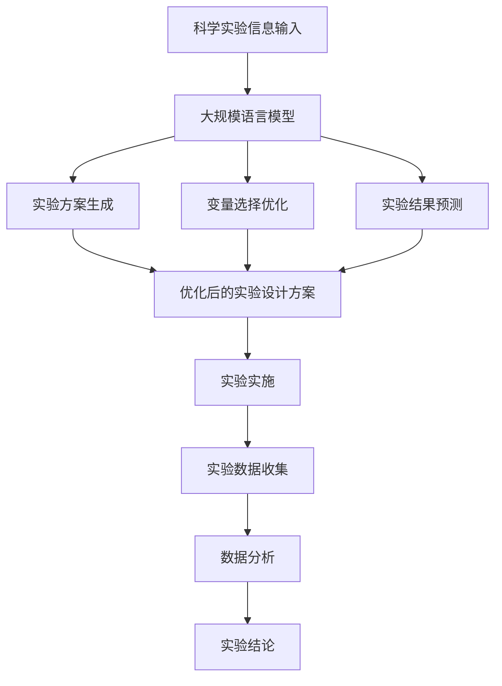

# 大规模语言模型在科学实验设计优化中的应用

> 关键词：大规模语言模型、科学实验设计、优化、实验效率、数据驱动决策

> 摘要：本文深入探讨了大规模语言模型在科学实验设计优化中的应用。首先介绍了相关背景，包括研究目的、预期读者、文档结构和术语表。接着阐述了核心概念及其联系，通过文本示意图和Mermaid流程图展示原理和架构。详细讲解了核心算法原理和具体操作步骤，并给出Python源代码示例。还介绍了相关数学模型和公式，结合实例进行说明。通过项目实战展示了代码的实际应用和详细解读。分析了大规模语言模型在不同科学实验场景中的实际应用。推荐了学习资源、开发工具框架和相关论文著作。最后总结了未来发展趋势与挑战，提供常见问题解答和扩展阅读参考资料，旨在为科研人员和技术爱好者提供全面的指导，推动大规模语言模型在科学实验设计优化领域的发展。

## 1. 背景介绍 
### 1.1 目的和范围
科学实验是推动各个领域知识进步的重要手段，然而传统的实验设计方法往往依赖于研究者的经验和直觉，存在效率低下、资源浪费等问题。随着人工智能技术的发展，大规模语言模型（LLMs）展现出强大的语言理解和生成能力。本文章的目的在于探讨如何利用大规模语言模型来优化科学实验设计，提高实验效率和质量，减少不必要的资源消耗。

本文的范围涵盖了大规模语言模型在不同科学领域实验设计中的应用，包括但不限于物理学、化学、生物学、医学等。我们将研究如何利用大规模语言模型进行实验方案的生成、变量的选择、实验结果的预测等方面的优化。

### 1.2 预期读者
本文的预期读者主要包括以下几类人群：
- 科研人员：希望借助大规模语言模型提升实验设计的效率和科学性，突破传统实验设计的局限。
- 人工智能开发者：对将大规模语言模型应用于科学领域感兴趣，探索新的应用场景和技术挑战。
- 科学教育工作者：了解前沿技术在科学实验教学中的应用，丰富教学内容和方法。
- 技术爱好者：对大规模语言模型和科学实验设计的结合有好奇心，希望深入了解相关知识。

### 1.3 文档结构概述
本文将按照以下结构进行组织：
- 核心概念与联系：介绍大规模语言模型和科学实验设计的核心概念，以及它们之间的联系，通过文本示意图和Mermaid流程图进行展示。
- 核心算法原理 & 具体操作步骤：详细讲解利用大规模语言模型优化科学实验设计的核心算法原理，并给出具体的操作步骤，同时提供Python源代码示例。
- 数学模型和公式 & 详细讲解 & 举例说明：介绍相关的数学模型和公式，对其进行详细讲解，并结合实例进行说明。
- 项目实战：通过实际案例展示如何使用大规模语言模型进行科学实验设计优化，包括开发环境搭建、源代码实现和代码解读。
- 实际应用场景：分析大规模语言模型在不同科学领域实验设计中的实际应用场景。
- 工具和资源推荐：推荐学习资源、开发工具框架和相关论文著作，帮助读者进一步深入学习和研究。
- 总结：未来发展趋势与挑战：总结大规模语言模型在科学实验设计优化中的应用现状，分析未来的发展趋势和面临的挑战。
- 附录：常见问题与解答：提供常见问题的解答，帮助读者解决在学习和实践过程中遇到的问题。
- 扩展阅读 & 参考资料：提供扩展阅读的建议和相关参考资料，方便读者进一步深入研究。

### 1.4 术语表
#### 1.4.1 核心术语定义
- 大规模语言模型（Large Language Model, LLM）：是一种基于深度学习的人工智能模型，通过在大规模文本数据上进行训练，学习语言的模式和规律，能够生成自然语言文本、回答问题、进行推理等。
- 科学实验设计（Scientific Experiment Design）：是指研究者为了验证假设、探索因果关系或获取新知识，对实验的各个要素（如实验对象、实验变量、实验方法等）进行合理安排和规划的过程。
- 实验优化（Experiment Optimization）：是指通过对实验设计进行改进和调整，提高实验的效率、准确性和可靠性，减少实验误差和资源消耗。

#### 1.4.2 相关概念解释
- 数据驱动决策（Data-Driven Decision Making）：是指在决策过程中，基于数据分析和挖掘的结果，而不是仅凭经验和直觉来做出决策。在科学实验设计中，数据驱动决策可以帮助研究者更准确地选择实验变量、确定实验方案。
- 自然语言处理（Natural Language Processing, NLP）：是指让计算机能够理解、处理和生成自然语言的技术。大规模语言模型是自然语言处理领域的重要成果之一，它通过对大量文本数据的学习，能够实现文本生成、语义理解、问答系统等功能。

#### 1.4.3 缩略词列表
- LLM：Large Language Model（大规模语言模型）
- NLP：Natural Language Processing（自然语言处理）

## 2. 核心概念与联系 
### 核心概念原理
#### 大规模语言模型原理
大规模语言模型通常基于Transformer架构，它由多个编码器和解码器层组成。Transformer架构引入了注意力机制（Attention Mechanism），使得模型能够在处理输入序列时，动态地关注序列中不同位置的信息。

以GPT（Generative Pretrained Transformer）系列模型为例，它是一种自回归语言模型，通过在大规模文本数据上进行无监督预训练，学习语言的统计规律和语义信息。在预训练过程中，模型的目标是根据输入的上下文预测下一个单词的概率分布。

在微调阶段，模型可以根据特定的任务进行有监督训练，例如文本分类、问答系统等。通过微调，模型可以更好地适应具体的应用场景。

#### 科学实验设计原理
科学实验设计的核心目标是通过合理安排实验因素和控制实验条件，揭示实验因素与实验结果之间的因果关系。实验设计通常包括以下几个关键步骤：
1. **问题定义**：明确实验要解决的问题和研究目标。
2. **变量选择**：确定实验中的自变量、因变量和控制变量。自变量是研究者可以操纵的因素，因变量是研究者要观察和测量的结果，控制变量是需要保持恒定的因素，以排除其他因素对实验结果的干扰。
3. **实验方案设计**：根据研究目标和变量选择，设计具体的实验方案，包括实验对象的选择、实验处理的安排、实验测量的方法等。
4. **实验实施**：按照实验方案进行实验操作，收集实验数据。
5. **数据分析**：对实验数据进行统计分析，验证实验假设，得出实验结论。

### 架构的文本示意图
大规模语言模型在科学实验设计优化中的应用架构可以描述如下：

1. **数据输入层**：将科学实验的相关信息，如实验问题、已有研究成果、实验数据等，以自然语言文本的形式输入到大规模语言模型中。
2. **模型处理层**：大规模语言模型对输入的文本进行处理，利用其强大的语言理解和生成能力，进行实验方案的生成、变量的选择、实验结果的预测等操作。
3. **输出层**：模型输出优化后的实验设计方案、实验结果预测等信息，供研究者参考和决策。

### Mermaid流程图


该流程图展示了大规模语言模型在科学实验设计优化中的应用流程。首先，将科学实验的相关信息输入到大规模语言模型中，模型进行实验方案生成、变量选择优化和实验结果预测等操作，输出优化后的实验设计方案。然后，按照优化后的方案进行实验实施，收集实验数据，进行数据分析，最终得出实验结论。

## 3. 核心算法原理 & 具体操作步骤 
### 核心算法原理
在利用大规模语言模型进行科学实验设计优化时，主要涉及到以下几个核心算法原理：

#### 文本生成算法
大规模语言模型的文本生成能力是其在实验设计优化中应用的基础。文本生成算法通常基于概率模型，通过对输入文本的理解，预测下一个单词的概率分布，然后根据概率分布选择最可能的单词作为生成结果。

以GPT模型为例，它采用了自回归的方式进行文本生成。给定输入文本 $x_1, x_2, \cdots, x_n$，模型预测下一个单词 $x_{n+1}$ 的概率分布为：

$$P(x_{n+1} | x_1, x_2, \cdots, x_n)$$

在生成文本时，模型根据这个概率分布选择最可能的单词作为下一个生成的单词，然后将其添加到输入文本中，继续预测下一个单词，直到生成完整的文本。

#### 知识推理算法
大规模语言模型在训练过程中学习了大量的知识和信息，能够进行一定程度的知识推理。在科学实验设计优化中，知识推理算法可以帮助模型根据已有知识和实验信息，推断出合理的实验方案和变量选择。

例如，模型可以根据化学知识推断出不同化学物质之间的反应条件和可能的产物，从而为化学实验设计提供参考。

#### 强化学习算法
为了进一步优化大规模语言模型在实验设计中的性能，可以引入强化学习算法。强化学习是一种通过智能体与环境进行交互，根据环境反馈的奖励信号来学习最优策略的算法。

在科学实验设计优化中，智能体可以是大规模语言模型，环境可以是实验的实际情况，奖励信号可以根据实验的效率、准确性等指标来定义。通过强化学习，模型可以不断调整自己的行为，以获得更高的奖励，从而生成更优的实验设计方案。

### 具体操作步骤
以下是利用大规模语言模型进行科学实验设计优化的具体操作步骤：

#### 步骤1：数据准备
收集和整理科学实验的相关数据，包括实验问题、已有研究成果、实验数据等。将这些数据转换为自然语言文本的形式，作为大规模语言模型的输入。

#### 步骤2：模型选择和加载
根据具体的应用场景和需求，选择合适的大规模语言模型，如GPT、BERT等。加载预训练的模型权重，并根据需要进行微调。

#### 步骤3：实验信息输入
将准备好的实验信息输入到大规模语言模型中，模型对输入文本进行处理和分析。

#### 步骤4：实验方案生成
模型利用其文本生成能力，根据输入的实验信息生成可能的实验方案。可以通过设置不同的生成参数，如温度、采样策略等，来控制生成方案的多样性和质量。

#### 步骤5：变量选择优化
模型根据已有知识和实验信息，对实验变量进行分析和评估，选择最相关和有效的变量。可以通过特征选择算法、知识推理等方法来实现变量选择优化。

#### 步骤6：实验结果预测
模型利用其知识推理和预测能力，对生成的实验方案可能产生的结果进行预测。预测结果可以帮助研究者评估实验方案的可行性和有效性。

#### 步骤7：方案评估和优化
根据实验结果预测和其他评估指标，对生成的实验方案进行评估和优化。可以通过调整实验方案的参数、重新选择变量等方法来提高实验方案的质量。

#### 步骤8：实验实施和反馈
按照优化后的实验方案进行实验实施，收集实验数据。将实验结果反馈给大规模语言模型，进一步优化模型的性能和实验设计方案。

### Python源代码示例
以下是一个简单的Python代码示例，演示了如何使用Hugging Face的Transformers库调用GPT模型进行文本生成：

```python
from transformers import GPT2LMHeadModel, GPT2Tokenizer

# 加载预训练的GPT2模型和分词器
model_name = "gpt2"
tokenizer = GPT2Tokenizer.from_pretrained(model_name)
model = GPT2LMHeadModel.from_pretrained(model_name)

# 输入实验信息
input_text = "在化学实验中，探究不同浓度的盐酸对金属铁反应速率的影响，设计一个实验方案。"

# 对输入文本进行编码
input_ids = tokenizer.encode(input_text, return_tensors="pt")

# 生成实验方案
output = model.generate(input_ids, max_length=200, num_beams=5, no_repeat_ngram_size=2, early_stopping=True)

# 解码生成的文本
generated_text = tokenizer.decode(output[0], skip_special_tokens=True)

print("生成的实验方案：")
print(generated_text)
```

在这个示例中，我们首先加载了预训练的GPT2模型和分词器。然后，将实验信息作为输入文本进行编码，并使用模型的`generate`方法生成实验方案。最后，将生成的文本解码并打印输出。

## 4. 数学模型和公式 & 详细讲解 & 举例说明 
### 文本生成的数学模型
在大规模语言模型的文本生成中，通常使用概率模型来描述单词的生成过程。假设输入文本为 $x = (x_1, x_2, \cdots, x_n)$，生成的文本为 $y = (y_1, y_2, \cdots, y_m)$，则生成文本 $y$ 的概率可以表示为：

$$P(y | x) = \prod_{i=1}^{m} P(y_i | x, y_1, y_2, \cdots, y_{i-1})$$

其中，$P(y_i | x, y_1, y_2, \cdots, y_{i-1})$ 表示在给定输入文本 $x$ 和已生成的文本 $y_1, y_2, \cdots, y_{i-1}$ 的条件下，生成单词 $y_i$ 的概率。

在实际应用中，为了提高计算效率，通常采用贪心搜索、束搜索等算法来近似求解最优的生成文本。

### 知识推理的数学模型
知识推理可以看作是在知识图谱或语义网络中进行路径搜索的过程。假设知识图谱 $G = (V, E)$，其中 $V$ 是节点集合，$E$ 是边集合。节点表示实体或概念，边表示实体之间的关系。

给定一个查询 $q$，知识推理的目标是找到从查询节点到目标节点的路径，使得路径上的关系能够满足查询的要求。可以使用图搜索算法，如广度优先搜索（BFS）、深度优先搜索（DFS）等，来实现知识推理。

### 强化学习的数学模型
在强化学习中，智能体与环境进行交互，根据环境反馈的奖励信号来学习最优策略。强化学习的数学模型可以用马尔可夫决策过程（Markov Decision Process, MDP）来描述。

一个MDP可以表示为一个五元组 $(S, A, P, R, \gamma)$，其中：
- $S$ 是状态空间，表示环境的所有可能状态。
- $A$ 是动作空间，表示智能体可以采取的所有动作。
- $P(s' | s, a)$ 是状态转移概率，表示在状态 $s$ 采取动作 $a$ 后转移到状态 $s'$ 的概率。
- $R(s, a, s')$ 是奖励函数，表示在状态 $s$ 采取动作 $a$ 转移到状态 $s'$ 时获得的奖励。
- $\gamma$ 是折扣因子，用于权衡即时奖励和未来奖励。

智能体的目标是学习一个策略 $\pi(a | s)$，使得在每个状态 $s$ 下选择动作 $a$ 的期望累积奖励最大。可以使用深度Q网络（Deep Q-Network, DQN）、策略梯度算法等方法来实现强化学习。

### 举例说明
#### 文本生成举例
假设我们要生成一个关于生物实验的实验方案，输入文本为：“设计一个实验，探究光照强度对植物光合作用的影响。”

使用大规模语言模型生成的实验方案可能如下：

“实验目的：探究光照强度对植物光合作用的影响。

实验材料：若干株生长状况相似的植物、不同功率的光源、光照强度测量仪、二氧化碳浓度测量仪等。

实验步骤：
1. 将植物分成若干组，每组设置不同的光照强度，如弱光、中等光、强光。
2. 使用光照强度测量仪测量每组的光照强度，并记录下来。
3. 在相同的温度、湿度等条件下，将植物放置在不同光照强度下一段时间。
4. 使用二氧化碳浓度测量仪测量每组植物周围的二氧化碳浓度变化，记录下来。
5. 分析实验数据，比较不同光照强度下植物光合作用的差异。

实验结果预测：随着光照强度的增加，植物的光合作用速率可能会增加，但达到一定程度后可能会趋于稳定。”

#### 知识推理举例
假设我们在化学实验设计中，需要探究某种金属与酸反应的产物。已知该金属为铁，酸为盐酸，我们可以利用知识推理来预测反应产物。

在化学知识图谱中，我们知道铁（Fe）与盐酸（HCl）反应会生成氯化亚铁（$FeCl_2$）和氢气（$H_2$），反应方程式为：

$$Fe + 2HCl \longrightarrow FeCl_2 + H_2\uparrow$$

通过知识推理，我们可以预测该反应的产物为氯化亚铁和氢气，从而为实验设计提供参考。

#### 强化学习举例
假设我们要优化一个生物实验的实验方案，实验的目标是提高某种细胞的培养效率。我们可以将实验方案的设计看作是智能体的动作，细胞的培养效率看作是奖励信号。

智能体在不同的状态下（如不同的培养条件）选择不同的实验方案，根据细胞培养效率的反馈来调整自己的策略。通过不断地与环境进行交互和学习，智能体可以找到最优的实验方案，提高细胞的培养效率。

## 5. 项目实战：代码实际案例和详细解释说明 
### 5.1  开发环境搭建
#### 安装Python
首先，确保你已经安装了Python。建议使用Python 3.7及以上版本。你可以从Python官方网站（https://www.python.org/downloads/）下载并安装Python。

#### 安装必要的库
在项目中，我们需要使用Hugging Face的Transformers库来调用大规模语言模型。可以使用以下命令来安装Transformers库：

```sh
pip install transformers
```

此外，还可以根据需要安装其他辅助库，如NumPy、Pandas等。

### 5.2  源代码详细实现和代码解读
以下是一个完整的Python代码示例，演示了如何使用GPT模型进行科学实验设计优化：

```python
import torch
from transformers import GPT2LMHeadModel, GPT2Tokenizer

# 加载预训练的GPT2模型和分词器
model_name = "gpt2"
tokenizer = GPT2Tokenizer.from_pretrained(model_name)
model = GPT2LMHeadModel.from_pretrained(model_name)

# 定义实验信息
experiment_info = "在物理学实验中，探究不同质量的物体在斜面上的下滑加速度，设计一个实验方案。"

# 对实验信息进行编码
input_ids = tokenizer.encode(experiment_info, return_tensors="pt")

# 设置生成参数
max_length = 300
num_beams = 5
no_repeat_ngram_size = 2
early_stopping = True

# 生成实验方案
output = model.generate(
    input_ids,
    max_length=max_length,
    num_beams=num_beams,
    no_repeat_ngram_size=no_repeat_ngram_size,
    early_stopping=early_stopping
)

# 解码生成的文本
generated_text = tokenizer.decode(output[0], skip_special_tokens=True)

# 打印生成的实验方案
print("生成的实验方案：")
print(generated_text)
```

### 代码解读与分析
#### 加载模型和分词器
```python
model_name = "gpt2"
tokenizer = GPT2Tokenizer.from_pretrained(model_name)
model = GPT2LMHeadModel.from_pretrained(model_name)
```
这部分代码加载了预训练的GPT2模型和分词器。`GPT2Tokenizer` 用于将输入文本转换为模型可以处理的编码，`GPT2LMHeadModel` 是用于文本生成的模型。

#### 定义实验信息
```python
experiment_info = "在物理学实验中，探究不同质量的物体在斜面上的下滑加速度，设计一个实验方案。"
```
这部分代码定义了要输入到模型中的实验信息。

#### 编码实验信息
```python
input_ids = tokenizer.encode(experiment_info, return_tensors="pt")
```
这部分代码使用分词器将实验信息编码为模型可以处理的输入ID，并将其转换为PyTorch张量。

#### 设置生成参数
```python
max_length = 300
num_beams = 5
no_repeat_ngram_size = 2
early_stopping = True
```
这部分代码设置了文本生成的参数：
- `max_length`：生成文本的最大长度。
- `num_beams`：束搜索的束宽，用于控制生成的多样性。
- `no_repeat_ngram_size`：避免生成重复的n-gram，提高生成文本的质量。
- `early_stopping`：是否在生成结束时提前停止。

#### 生成实验方案
```python
output = model.generate(
    input_ids,
    max_length=max_length,
    num_beams=num_beams,
    no_repeat_ngram_size=no_repeat_ngram_size,
    early_stopping=early_stopping
)
```
这部分代码调用模型的`generate`方法生成实验方案。

#### 解码生成的文本
```python
generated_text = tokenizer.decode(output[0], skip_special_tokens=True)
```
这部分代码使用分词器将生成的编码文本解码为自然语言文本，并去除特殊标记。

#### 打印生成的实验方案
```python
print("生成的实验方案：")
print(generated_text)
```
这部分代码打印生成的实验方案。

## 6. 实际应用场景 
### 物理学实验设计优化
在物理学实验中，大规模语言模型可以帮助研究者设计更合理的实验方案。例如，在探究物体的运动规律时，模型可以根据已知的物理知识和实验条件，生成不同的实验设置和测量方法。

对于研究自由落体运动的实验，模型可以根据不同的实验目的（如测量重力加速度、验证运动方程等），推荐合适的实验器材（如打点计时器、光电门等）和实验步骤（如释放高度的选择、测量时间的方法等）。同时，模型还可以预测不同实验条件下的实验结果，帮助研究者评估实验方案的可行性。

### 化学实验设计优化
在化学实验中，大规模语言模型可以用于优化化学反应的条件和实验流程。例如，在合成某种化合物时，模型可以根据反应物的性质、反应类型等信息，推荐合适的反应温度、压力、催化剂等条件。

对于有机合成实验，模型可以根据反应物的结构和反应机理，预测可能的反应产物和副产物，并提供减少副反应的建议。此外，模型还可以帮助研究者设计实验的操作步骤，如加料顺序、反应时间的控制等，提高实验的效率和成功率。

### 生物学实验设计优化
在生物学实验中，大规模语言模型可以在细胞培养、基因编辑、蛋白质分析等方面发挥作用。例如，在细胞培养实验中，模型可以根据细胞的类型和培养目的，推荐合适的培养基成分、培养条件（如温度、湿度、气体浓度等）和培养时间。

在基因编辑实验中，模型可以根据目标基因的序列和编辑要求，选择合适的基因编辑工具（如CRISPR/Cas9）和编辑策略，并预测编辑的效率和可能的脱靶效应。在蛋白质分析实验中，模型可以根据蛋白质的结构和功能，设计合适的分析方法和实验流程。

### 医学实验设计优化
在医学实验中，大规模语言模型可以辅助药物研发、临床试验设计等工作。例如，在药物研发过程中，模型可以根据疾病的发病机制和药物的作用靶点，筛选可能的药物分子，并预测药物的疗效和安全性。

在临床试验设计中，模型可以根据患者的特征、疾病的分期等信息，优化试验的分组方案、样本量的确定和观察指标的选择。同时，模型还可以预测临床试验的结果，帮助研究者评估试验的风险和收益。

## 7. 工具和资源推荐
### 7.1 学习资源推荐
#### 7.1.1 书籍推荐
- 《自然语言处理入门》：这本书系统地介绍了自然语言处理的基本概念、算法和技术，适合初学者入门。
- 《深度学习》：由Ian Goodfellow、Yoshua Bengio和Aaron Courville所著，是深度学习领域的经典教材，对大规模语言模型的原理和应用有深入的讲解。
- 《Python自然语言处理》：详细介绍了如何使用Python进行自然语言处理任务，包括文本处理、分类、生成等，结合实际案例进行讲解，具有很强的实用性。

#### 7.1.2 在线课程
- Coursera上的“Natural Language Processing Specialization”：由顶尖大学的教授授课，涵盖了自然语言处理的各个方面，包括大规模语言模型的应用。
- edX上的“Deep Learning for Natural Language Processing”：深入介绍了深度学习在自然语言处理中的应用，包括Transformer架构、语言模型训练等内容。
- 哔哩哔哩上有很多关于自然语言处理和大规模语言模型的教学视频，适合初学者快速入门和学习。

#### 7.1.3 技术博客和网站
- Hugging Face Blog：Hugging Face是自然语言处理领域的领先机构，其博客上有很多关于大规模语言模型的最新研究成果和应用案例。
- Towards Data Science：一个专注于数据科学和人工智能的技术博客，上面有很多关于自然语言处理和大规模语言模型的高质量文章。
- arXiv：一个预印本论文库，提供了大量关于人工智能和自然语言处理的最新研究论文。

### 7.2 开发工具框架推荐
#### 7.2.1 IDE和编辑器
- PyCharm：是一款专业的Python集成开发环境，具有强大的代码编辑、调试和项目管理功能，适合Python开发者使用。
- Visual Studio Code：是一款轻量级的代码编辑器，支持多种编程语言和插件扩展，对于自然语言处理开发也非常方便。

#### 7.2.2 调试和性能分析工具
- TensorBoard：是TensorFlow提供的可视化工具，可以用于监控模型的训练过程、分析模型的性能指标等。
- Py-Spy：是一个Python性能分析工具，可以帮助开发者找出代码中的性能瓶颈，提高代码的运行效率。

#### 7.2.3 相关框架和库
- Hugging Face Transformers：是一个开源的自然语言处理库，提供了丰富的预训练模型和工具，方便开发者进行大规模语言模型的使用和开发。
- PyTorch：是一个深度学习框架，具有动态图机制和丰富的神经网络层，广泛应用于自然语言处理和大规模语言模型的研究和开发。
- NumPy和Pandas：是Python中常用的科学计算和数据处理库，在大规模语言模型的数据处理和分析中发挥着重要作用。

### 7.3 相关论文著作推荐
#### 7.3.1 经典论文
- “Attention Is All You Need”：提出了Transformer架构，是大规模语言模型的基础，对自然语言处理领域产生了深远的影响。
- “Improving Language Understanding by Generative Pre-Training”：介绍了GPT模型的预训练方法，开创了基于自监督学习的大规模语言模型训练的先河。
- “BERT: Pre-training of Deep Bidirectional Transformers for Language Understanding”：提出了BERT模型，通过双向预训练的方式提高了语言模型的理解能力。

#### 7.3.2 最新研究成果
- 关注arXiv上关于大规模语言模型在科学实验设计优化方面的最新研究论文，了解该领域的前沿动态和技术发展趋势。
- 参加相关的学术会议，如ACL（Association for Computational Linguistics）、EMNLP（Conference on Empirical Methods in Natural Language Processing）等，获取最新的研究成果和交流机会。

#### 7.3.3 应用案例分析
- 阅读相关的学术期刊和研究报告，了解大规模语言模型在不同科学领域实验设计优化中的实际应用案例，学习其经验和方法。
- 关注一些科技公司和研究机构的官方博客，了解他们在大规模语言模型应用方面的实践和探索。

## 8. 总结：未来发展趋势与挑战
### 未来发展趋势
#### 模型性能的持续提升
随着计算资源的不断增加和算法的不断改进，大规模语言模型的性能将不断提升。模型将能够更好地理解和处理自然语言，生成更加准确、合理的实验设计方案。

#### 跨领域融合应用
大规模语言模型将与其他技术，如计算机视觉、数据分析、自动化实验设备等进行更深入的融合。例如，结合计算机视觉技术，模型可以对实验图像和视频进行分析，提供更全面的实验信息；结合自动化实验设备，模型可以实现实验的自动化控制和优化。

#### 个性化实验设计
根据不同研究者的需求和偏好，大规模语言模型将能够提供个性化的实验设计方案。模型可以学习研究者的历史实验数据和偏好，为其量身定制最合适的实验方案。

#### 推动科学研究的创新
大规模语言模型在科学实验设计优化中的应用将为科学研究带来新的思路和方法。模型可以发现一些传统方法难以发现的实验规律和现象，推动科学研究的创新和发展。

### 挑战
#### 数据质量和标注问题
大规模语言模型的训练需要大量高质量的数据，然而在科学实验领域，数据的获取和标注往往比较困难。实验数据可能存在噪声、不完整等问题，需要进行有效的数据清洗和预处理。同时，数据的标注也需要专业的知识和经验，这增加了数据准备的难度。

#### 模型解释性问题
大规模语言模型通常是基于深度学习的黑盒模型，其决策过程难以解释。在科学实验设计中，研究者需要了解模型生成实验方案的依据和原理，以便对方案进行评估和调整。因此，如何提高模型的解释性是一个亟待解决的问题。

#### 伦理和法律问题
大规模语言模型在科学实验设计中的应用可能会引发一些伦理和法律问题。例如，模型生成的实验方案可能存在潜在的风险和危害，需要进行严格的伦理审查和监管。同时，模型的使用也可能涉及到数据隐私、知识产权等法律问题，需要建立相应的法律制度和规范。

#### 计算资源和成本问题
训练和使用大规模语言模型需要大量的计算资源和成本。对于一些科研机构和企业来说，可能无法承担如此高昂的费用。因此，如何降低模型的计算成本和提高计算效率是一个重要的挑战。

## 9. 附录：常见问题与解答
### 问题1：大规模语言模型生成的实验方案一定可靠吗？
答：大规模语言模型生成的实验方案具有一定的参考价值，但不能保证完全可靠。模型的生成结果受到训练数据、模型结构和参数等因素的影响，可能存在一定的误差和不确定性。因此，在使用模型生成的实验方案时，研究者需要结合自己的专业知识和经验进行评估和验证。

### 问题2：如何选择合适的大规模语言模型？
答：选择合适的大规模语言模型需要考虑以下几个因素：
- 应用场景：不同的应用场景对模型的要求不同，例如文本生成、问答系统、知识推理等。需要根据具体的应用场景选择合适的模型。
- 模型性能：可以参考模型在公开数据集上的评估指标，如准确率、召回率、F1值等，选择性能较好的模型。
- 计算资源：不同的模型对计算资源的要求不同，需要根据自己的计算资源情况选择合适的模型。

### 问题3：如何提高大规模语言模型在科学实验设计优化中的性能？
答：可以从以下几个方面提高大规模语言模型在科学实验设计优化中的性能：
- 数据增强：通过增加训练数据的多样性和规模，提高模型的泛化能力。
- 模型微调：根据具体的应用场景，对预训练的模型进行微调，使其更好地适应实验设计优化的任务。
- 引入外部知识：将科学领域的专业知识和规则引入到模型中，提高模型的知识推理能力。
- 强化学习：使用强化学习算法对模型进行优化，根据实验结果的反馈调整模型的行为。

### 问题4：大规模语言模型在科学实验设计优化中存在哪些局限性？
答：大规模语言模型在科学实验设计优化中存在以下局限性：
- 知识的局限性：模型的知识来源于训练数据，可能存在知识覆盖不全面、知识更新不及时等问题。
- 逻辑推理能力的局限性：虽然模型具有一定的知识推理能力，但在复杂的逻辑推理和因果分析方面还存在不足。
- 实验验证的局限性：模型生成的实验方案需要进行实际的实验验证，模型本身无法保证实验的可行性和有效性。

## 10. 扩展阅读 & 参考资料
### 扩展阅读
- 《人工智能时代的科学研究》：探讨了人工智能技术在科学研究中的应用和影响，为大规模语言模型在科学实验设计优化中的应用提供了更广阔的视角。
- 《数据驱动的科学发现》：介绍了如何利用数据挖掘和机器学习技术进行科学发现，对理解大规模语言模型在科学实验设计中的作用有很大帮助。

### 参考资料
- Hugging Face官方文档：https://huggingface.co/docs
- PyTorch官方文档：https://pytorch.org/docs/stable/index.html
- 《自然语言处理：原理、算法与应用》

作者：AI天才研究院/AI Genius Institute & 禅与计算机程序设计艺术 /Zen And The Art of Computer Programming