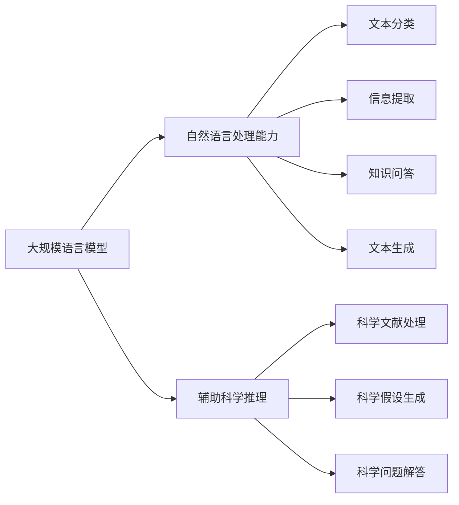

# 大规模语言模型在科学推理中的潜力探索

> 关键词：大规模语言模型、科学推理、自然语言处理、知识表示、机器学习

> 摘要：本文旨在深入探索大规模语言模型在科学推理领域的潜力。首先介绍相关背景，包括研究目的、预期读者等内容。接着阐述大规模语言模型与科学推理的核心概念及联系，详细讲解核心算法原理与具体操作步骤，并给出相关数学模型和公式。通过项目实战展示其在实际中的应用，分析其实际应用场景。同时推荐了学习资源、开发工具框架以及相关论文著作。最后总结未来发展趋势与挑战，提供常见问题解答和扩展阅读参考资料，为进一步挖掘大规模语言模型在科学推理中的价值提供全面的参考。

## 1. 背景介绍 
### 1.1 目的和范围
随着人工智能技术的飞速发展，大规模语言模型如GPT系列、BERT等取得了显著的成果。这些模型在自然语言处理任务中展现出了强大的能力，然而其在科学推理领域的应用尚处于探索阶段。本研究的目的在于全面深入地探究大规模语言模型在科学推理中的潜力，明确其在不同科学领域中的应用范围和可能达到的效果，为推动科学研究的智能化发展提供理论和实践依据。范围涵盖了从基础科学到应用科学的多个领域，包括物理学、化学、生物学、计算机科学等，研究大规模语言模型如何辅助科学推理、解决科学问题以及推动科学发现。

### 1.2 预期读者
本文的预期读者包括对人工智能和科学推理交叉领域感兴趣的科研人员、工程师、学生以及相关领域的从业者。对于科研人员，本文提供了大规模语言模型在科学推理中的最新研究进展和应用案例，有助于拓展研究思路；工程师可以从中获取技术实现的细节和方法，应用于实际项目中；学生可以作为学习资料，了解前沿技术和研究方向；从业者则可以通过本文了解行业动态，为职业发展提供参考。

### 1.3 文档结构概述
本文共分为十个部分。第一部分为背景介绍，阐述研究的目的、预期读者、文档结构概述和术语表；第二部分讲解核心概念与联系，包括大规模语言模型和科学推理的原理以及它们之间的关系，并给出相应的示意图和流程图；第三部分详细介绍核心算法原理和具体操作步骤，通过Python源代码进行阐述；第四部分给出数学模型和公式，并进行详细讲解和举例说明；第五部分是项目实战，包括开发环境搭建、源代码详细实现和代码解读；第六部分分析实际应用场景；第七部分推荐相关的工具和资源，包括学习资源、开发工具框架和相关论文著作；第八部分总结未来发展趋势与挑战；第九部分是附录，提供常见问题与解答；第十部分列出扩展阅读和参考资料。

### 1.4 术语表
#### 1.4.1 核心术语定义
- **大规模语言模型**：指基于深度学习技术，通过在大规模文本数据上进行训练得到的语言模型，具有强大的语言理解和生成能力，能够处理各种自然语言处理任务。
- **科学推理**：是指在科学研究过程中，运用逻辑思维、归纳、演绎等方法，从观察、实验等获得的科学事实中得出结论、发现规律、解决问题的过程。
- **自然语言处理**：是人工智能的一个重要领域，主要研究如何让计算机理解、处理和生成自然语言，包括文本分类、信息提取、机器翻译等任务。

#### 1.4.2 相关概念解释
- **知识表示**：是指将人类知识以计算机能够理解和处理的形式进行表示，例如语义网络、本体等。在大规模语言模型中，知识表示是理解和推理的基础。
- **机器学习**：是一门多领域交叉学科，涉及概率论、统计学、逼近论、凸分析、算法复杂度理论等多门学科。它专门研究计算机怎样模拟或实现人类的学习行为，以获取新的知识或技能，重新组织已有的知识结构使之不断改善自身的性能。

#### 1.4.3 缩略词列表
- **GPT**：Generative Pretrained Transformer，生成式预训练变换器。
- **BERT**：Bidirectional Encoder Representations from Transformers，基于变换器的双向编码器表示。
- **NLP**：Natural Language Processing，自然语言处理。

## 2. 核心概念与联系 
### 大规模语言模型原理
大规模语言模型通常基于深度学习架构，如Transformer。Transformer由编码器和解码器组成，其核心机制是注意力机制（Attention Mechanism）。注意力机制允许模型在处理序列数据时，动态地关注序列中的不同部分，从而更好地捕捉序列中的依赖关系。

以GPT系列为例，它是基于Transformer的解码器架构的自回归语言模型。通过在大规模文本数据上进行无监督学习，模型学习到语言的统计规律和语义信息。在训练过程中，模型的目标是预测下一个单词的概率分布。

### 科学推理原理
科学推理是一个复杂的认知过程，包括观察、假设、实验、验证等多个环节。科学家通过观察自然现象，提出假设，设计实验来验证假设，最终得出科学结论。科学推理需要运用逻辑思维、归纳、演绎等方法，以及相关的科学知识和经验。

### 两者联系
大规模语言模型可以为科学推理提供自然语言处理的能力，帮助科学家更高效地处理科学文献、提取关键信息、生成科学假设等。例如，模型可以对大量的科学论文进行文本分类和信息提取，帮助科学家快速筛选出相关的研究成果；可以根据已有的科学知识生成新的科学假设，为科学研究提供方向。

### 文本示意图
大规模语言模型与科学推理的关系可以用以下示意图表示：

```plaintext
大规模语言模型
|
|-- 自然语言处理能力
|   |-- 文本分类
|   |-- 信息提取
|   |-- 知识问答
|   |-- 文本生成
|
|-- 辅助科学推理
    |-- 科学文献处理
    |-- 科学假设生成
    |-- 科学问题解答
```

### Mermaid流程图


## 3. 核心算法原理 & 具体操作步骤 
### 核心算法原理
以GPT模型为例，其核心算法基于Transformer的解码器架构。Transformer解码器由多个相同的层组成，每个层包含多头自注意力机制（Multi-Head Self-Attention）和前馈神经网络（Feed-Forward Neural Network）。

多头自注意力机制允许模型在不同的表示子空间中并行地关注输入序列的不同部分。其计算公式如下：

```python
import torch
import torch.nn as nn

class MultiHeadSelfAttention(nn.Module):
    def __init__(self, embed_size, num_heads):
        super(MultiHeadSelfAttention, self).__init__()
        self.embed_size = embed_size
        self.num_heads = num_heads
        self.head_dim = embed_size // num_heads

        assert (
            self.head_dim * num_heads == embed_size
        ), "Embedding size needs to be divisible by heads"

        self.values = nn.Linear(self.head_dim, self.head_dim, bias=False)
        self.keys = nn.Linear(self.head_dim, self.head_dim, bias=False)
        self.queries = nn.Linear(self.head_dim, self.head_dim, bias=False)
        self.fc_out = nn.Linear(num_heads * self.head_dim, embed_size)

    def forward(self, values, keys, query, mask):
        N = query.shape[0]
        value_len, key_len, query_len = values.shape[1], keys.shape[1], query.shape[1]

        # Split the embedding into self.num_heads different pieces
        values = values.reshape(N, value_len, self.num_heads, self.head_dim)
        keys = keys.reshape(N, key_len, self.num_heads, self.head_dim)
        queries = query.reshape(N, query_len, self.num_heads, self.head_dim)

        values = self.values(values)
        keys = self.keys(keys)
        queries = self.queries(queries)

        # Scaled dot-product attention
        energy = torch.einsum("nqhd,nkhd->nhqk", [queries, keys])
        if mask is not None:
            energy = energy.masked_fill(mask == 0, float("-1e20"))

        attention = torch.softmax(energy / (self.embed_size ** (1 / 2)), dim=3)

        out = torch.einsum("nhql,nlhd->nqhd", [attention, values]).reshape(
            N, query_len, self.num_heads * self.head_dim
        )

        out = self.fc_out(out)
        return out
```

前馈神经网络是一个简单的两层全连接神经网络，用于对多头自注意力机制的输出进行非线性变换。

### 具体操作步骤
1. **数据预处理**：收集大规模的文本数据，对数据进行清洗、分词等预处理操作，将文本转换为模型可以处理的格式。
2. **模型训练**：使用预处理后的数据对GPT模型进行训练。在训练过程中，通过最小化预测下一个单词的损失函数来更新模型的参数。
3. **模型微调**：如果需要将模型应用于特定的科学推理任务，可以在预训练模型的基础上进行微调。例如，使用科学文献数据对模型进行微调，以提高模型在科学文本处理方面的性能。
4. **推理应用**：将微调后的模型应用于科学推理任务，如科学文献分类、信息提取、科学问题解答等。

## 4. 数学模型和公式 & 详细讲解 & 举例说明 
### 多头自注意力机制数学模型
多头自注意力机制的核心是计算注意力分数，其数学模型可以用以下公式表示：

$$Attention(Q, K, V) = softmax(\frac{QK^T}{\sqrt{d_k}})V$$

其中，$Q$ 是查询矩阵，$K$ 是键矩阵，$V$ 是值矩阵，$d_k$ 是键的维度。

### 详细讲解
- **查询、键和值矩阵**：在多头自注意力机制中，输入序列首先被线性变换为查询、键和值矩阵。这些矩阵的维度由模型的参数决定。
- **注意力分数计算**：通过计算查询矩阵和键矩阵的点积，得到注意力分数。为了防止点积结果过大，需要除以 $\sqrt{d_k}$ 进行缩放。
- **注意力分布**：使用softmax函数将注意力分数转换为注意力分布，使得所有注意力分数之和为1。
- **加权求和**：将注意力分布与值矩阵相乘，得到多头自注意力机制的输出。

### 举例说明
假设输入序列的长度为 $n$，嵌入维度为 $d$，头数为 $h$。则查询、键和值矩阵的维度分别为 $[n, d]$，经过线性变换后，每个头的维度为 $[n, \frac{d}{h}]$。注意力分数矩阵的维度为 $[n, n]$，注意力分布矩阵的维度也为 $[n, n]$，最终输出的维度为 $[n, d]$。

## 5. 项目实战：代码实际案例和详细解释说明 
### 5.1  开发环境搭建
1. **安装Python**：确保系统中安装了Python 3.7或更高版本。
2. **安装深度学习框架**：使用pip或conda安装PyTorch深度学习框架。例如，使用以下命令安装PyTorch：
```bash
pip install torch torchvision
```
3. **安装相关库**：安装transformers库，用于使用预训练的大规模语言模型。
```bash
pip install transformers
```

### 5.2  源代码详细实现和代码解读
以下是一个使用Hugging Face的transformers库进行科学问题解答的示例代码：

```python
from transformers import AutoTokenizer, AutoModelForQuestionAnswering
import torch

# 加载预训练的模型和分词器
tokenizer = AutoTokenizer.from_pretrained("bert-large-uncased-whole-word-masking-finetuned-squad")
model = AutoModelForQuestionAnswering.from_pretrained("bert-large-uncased-whole-word-masking-finetuned-squad")

# 定义科学问题和相关文本
question = "What is the theory of relativity?"
context = "The theory of relativity was developed by Albert Einstein. It consists of two main parts: special relativity and general relativity. Special relativity deals with objects moving at constant speeds, while general relativity deals with gravity and acceleration."

# 对问题和文本进行分词
inputs = tokenizer(question, context, return_tensors='pt')

# 模型推理
with torch.no_grad():
    outputs = model(**inputs)

# 获取答案的起始和结束位置
answer_start_index = outputs.start_logits.argmax()
answer_end_index = outputs.end_logits.argmax()

# 提取答案
predict_answer_tokens = inputs.input_ids[0, answer_start_index : answer_end_index + 1]
answer = tokenizer.decode(predict_answer_tokens)

print("Answer:", answer)
```

### 5.3  代码解读与分析
1. **加载模型和分词器**：使用`AutoTokenizer`和`AutoModelForQuestionAnswering`从Hugging Face的模型库中加载预训练的模型和分词器。
2. **定义问题和文本**：定义一个科学问题和相关的文本，作为模型的输入。
3. **分词**：使用分词器对问题和文本进行分词，将其转换为模型可以处理的格式。
4. **模型推理**：使用`torch.no_grad()`上下文管理器进行模型推理，得到答案的起始和结束位置的概率分布。
5. **提取答案**：根据起始和结束位置的概率分布，找到概率最大的位置，提取答案的分词，并将其解码为文本。

## 6. 实际应用场景 
### 科学文献处理
大规模语言模型可以对海量的科学文献进行自动化处理，包括文献分类、信息提取、文献综述生成等。例如，通过文本分类算法，将科学文献分为不同的学科领域，帮助科研人员快速找到相关的研究成果；通过信息提取技术，从文献中提取关键的实验数据、研究结论等信息，提高科研效率。

### 科学假设生成
模型可以根据已有的科学知识和研究成果，生成新的科学假设。例如，在生物学领域，模型可以分析基因序列数据，结合相关的生物学知识，提出关于基因功能和疾病机制的假设，为进一步的实验研究提供方向。

### 科学教育
在科学教育中，大规模语言模型可以作为智能教学助手，为学生提供个性化的学习资源和答疑服务。例如，学生可以向模型提出科学问题，模型可以提供详细的解答和相关的学习资料，帮助学生更好地理解科学知识。

### 科学研究辅助
在科学研究过程中，模型可以辅助科学家进行数据挖掘、实验设计等工作。例如，在化学领域，模型可以分析化学物质的结构和性质数据，帮助科学家设计新的化学反应和材料。

## 7. 工具和资源推荐
### 7.1 学习资源推荐
#### 7.1.1 书籍推荐
- 《深度学习》（Deep Learning）：由Ian Goodfellow、Yoshua Bengio和Aaron Courville合著，是深度学习领域的经典教材，涵盖了深度学习的基本概念、算法和应用。
- 《自然语言处理入门》（Natural Language Processing with Python）：由Steven Bird、Ewan Klein和Edward Loper合著，介绍了使用Python进行自然语言处理的基本方法和技术。
- 《人工智能：一种现代的方法》（Artificial Intelligence: A Modern Approach）：由Stuart Russell和Peter Norvig合著，是人工智能领域的权威教材，全面介绍了人工智能的各个方面。

#### 7.1.2 在线课程
- Coursera上的“深度学习专项课程”（Deep Learning Specialization）：由Andrew Ng教授主讲，包括深度学习的基础、卷积神经网络、循环神经网络等内容。
- edX上的“自然语言处理”（Natural Language Processing）：由Columbia University提供，介绍了自然语言处理的基本概念、算法和应用。
- 哔哩哔哩上的“人工智能教程”：有许多优质的人工智能教程视频，适合初学者学习。

#### 7.1.3 技术博客和网站
- Hugging Face Blog：提供了关于大规模语言模型的最新研究成果和应用案例。
- Towards Data Science：是一个数据科学和人工智能领域的技术博客，有许多高质量的技术文章。
- arXiv：是一个预印本服务器，提供了大量的科学研究论文，包括人工智能和自然语言处理领域的最新研究成果。

### 7.2 开发工具框架推荐
#### 7.2.1 IDE和编辑器
- PyCharm：是一款专业的Python集成开发环境，提供了代码编辑、调试、版本控制等功能。
- Visual Studio Code：是一款轻量级的代码编辑器，支持多种编程语言，有丰富的插件扩展功能。
- Jupyter Notebook：是一个交互式的编程环境，适合进行数据探索、模型训练和可视化等工作。

#### 7.2.2 调试和性能分析工具
- PyTorch Profiler：是PyTorch提供的性能分析工具，可以帮助开发者分析模型的性能瓶颈。
- TensorBoard：是TensorFlow提供的可视化工具，可以用于可视化模型的训练过程和性能指标。
- cProfile：是Python标准库中的性能分析工具，可以帮助开发者分析Python代码的性能。

#### 7.2.3 相关框架和库
- Hugging Face Transformers：是一个用于自然语言处理的开源库，提供了大量的预训练模型和工具。
- AllenNLP：是一个用于自然语言处理的深度学习框架，提供了丰富的工具和模型。
- SpaCy：是一个用于自然语言处理的Python库，提供了高效的文本处理功能。

### 7.3 相关论文著作推荐
