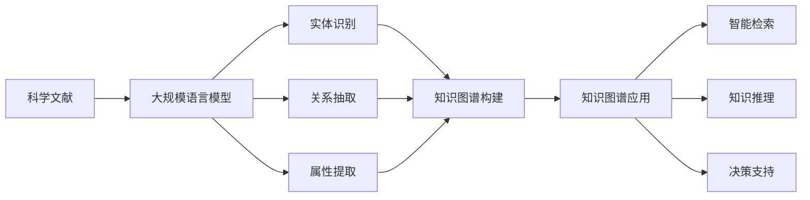

# 大规模语言模型在科学文献知识图谱构建中的应用

> 关键词：大规模语言模型、科学文献、知识图谱、信息抽取、语义理解

> 摘要：本文聚焦于大规模语言模型在科学文献知识图谱构建中的应用。首先介绍了相关背景，包括研究目的、预期读者等内容。接着深入探讨了大规模语言模型和知识图谱的核心概念与联系，详细阐述了核心算法原理及操作步骤，并给出数学模型和公式。通过项目实战展示了如何利用大规模语言模型构建科学文献知识图谱，包括开发环境搭建、源代码实现与解读。同时分析了其实际应用场景，推荐了相关的工具和资源。最后总结了未来发展趋势与挑战，提供了常见问题解答和扩展阅读参考资料，旨在为相关领域的研究和实践提供全面且深入的指导。

## 1. 背景介绍 
### 1.1 目的和范围
随着科学研究的不断推进，科学文献的数量呈现爆炸式增长。这些文献中蕴含着丰富的知识，但由于其海量性和复杂性，传统的信息检索和处理方式已难以满足对科学知识高效利用的需求。本研究的目的在于探索如何利用大规模语言模型的强大语义理解和信息抽取能力，构建科学文献知识图谱，从而实现对科学知识的结构化表示、高效组织和智能检索。

本研究的范围涵盖了大规模语言模型的原理和应用、科学文献知识图谱的构建方法和技术，以及两者结合在科学知识管理领域的具体实践。重点关注大规模语言模型在科学文献的实体识别、关系抽取、属性提取等知识图谱构建关键环节中的应用。

### 1.2 预期读者
本文预期读者包括从事自然语言处理、知识图谱、信息检索等领域的研究人员和学者，他们可以从本文中获取大规模语言模型在科学文献知识图谱构建方面的最新研究进展和技术方法；也适用于对科学知识管理和智能信息处理感兴趣的工程师和开发者，为他们在实际项目中应用相关技术提供参考和指导；此外，对于科研机构和图书馆的工作人员，了解大规模语言模型在科学文献知识图谱构建中的应用，有助于提升他们对科学文献的管理和服务水平。

### 1.3 文档结构概述
本文共分为十个部分。第一部分背景介绍，阐述了研究的目的、范围、预期读者和文档结构概述，并对相关术语进行了解释。第二部分探讨大规模语言模型和知识图谱的核心概念与联系，通过文本示意图和 Mermaid 流程图展示其关系。第三部分详细介绍核心算法原理及具体操作步骤，结合 Python 源代码进行说明。第四部分给出数学模型和公式，并通过举例进行详细讲解。第五部分通过项目实战，展示科学文献知识图谱构建的具体过程，包括开发环境搭建、源代码实现和代码解读。第六部分分析大规模语言模型在科学文献知识图谱构建中的实际应用场景。第七部分推荐相关的学习资源、开发工具框架和论文著作。第八部分总结未来发展趋势与挑战。第九部分提供常见问题与解答。第十部分给出扩展阅读和参考资料。

### 1.4 术语表
#### 1.4.1 核心术语定义
- **大规模语言模型**：基于深度学习技术，通过在大规模文本数据上进行训练得到的语言模型，具有强大的语言理解和生成能力，如 GPT - 3、BERT 等。
- **科学文献**：记录科学研究成果和过程的各类文献，包括学术论文、研究报告、专利文献等。
- **知识图谱**：一种用图结构来表示实体及其之间关系的语义网络，它将现实世界中的知识以结构化的形式进行表示和存储。
- **实体识别**：从文本中识别出具有特定意义的实体，如人名、地名、机构名、学科术语等。
- **关系抽取**：确定文本中实体之间的语义关系，如“作者 - 论文”、“引用 - 被引用”等。

#### 1.4.2 相关概念解释
- **语义理解**：语言模型对文本的语义信息进行分析和理解的能力，包括对词汇、句子和篇章的语义解释。
- **信息抽取**：从非结构化或半结构化文本中提取出有价值的信息，如实体、关系和属性等。
- **图数据库**：专门用于存储和管理图数据的数据库，能够高效地处理图结构数据的查询和操作，如 Neo4j 等。

#### 1.4.3 缩略词列表
- **NLP**：Natural Language Processing，自然语言处理
- **MLM**：Masked Language Model，掩码语言模型
- **RDF**：Resource Description Framework，资源描述框架

## 2. 核心概念与联系 

### 大规模语言模型原理
大规模语言模型通常基于深度学习中的神经网络架构，如 Transformer 架构。Transformer 架构引入了自注意力机制（Self - Attention Mechanism），使得模型能够更好地捕捉文本中不同位置之间的依赖关系。

以 BERT（Bidirectional Encoder Representations from Transformers）为例，它是一种基于 Transformer 编码器的预训练语言模型。BERT 采用了掩码语言模型（MLM）和下一句预测（NSP）两个预训练任务。在 MLM 任务中，模型会随机掩码输入文本中的一些词，然后预测这些被掩码的词；在 NSP 任务中，模型需要判断两个句子是否是连续的。通过这两个任务的训练，BERT 能够学习到丰富的语言知识和语义表示。

### 知识图谱架构
知识图谱通常由实体（Entities）、关系（Relations）和属性（Attributes）组成。实体是现实世界中的具体对象或概念，关系表示实体之间的联系，属性则描述实体的特征和性质。知识图谱的数据结构可以用资源描述框架（RDF）来表示，RDF 是一种三元组（Subject, Predicate, Object）的形式，其中 Subject 是实体，Predicate 是关系，Object 可以是实体或属性值。

### 核心概念联系的文本示意图
大规模语言模型为知识图谱的构建提供了强大的语义理解和信息抽取能力。通过大规模语言模型对科学文献进行处理，可以识别出文献中的实体、关系和属性，然后将这些信息整合到知识图谱中。知识图谱则为大规模语言模型的应用提供了结构化的知识表示和推理基础，使得模型能够更好地理解和利用科学知识。

### Mermaid 流程图


## 3. 核心算法原理 & 具体操作步骤 

### 核心算法原理
在科学文献知识图谱构建中，主要涉及实体识别、关系抽取和属性提取三个关键步骤，下面以 BERT 为例，介绍这些步骤的算法原理。

#### 实体识别
基于 BERT 的实体识别通常采用序列标注的方法。将输入的文本作为 BERT 的输入，通过 BERT 模型得到每个词的上下文表示。然后在 BERT 模型的输出层添加一个全连接层，将每个词的表示映射到实体标签空间。常见的实体标签表示方法有 BIO 格式，其中 B 表示实体的开始，I 表示实体的中间，O 表示非实体。

以下是一个简单的 Python 代码示例，使用 Transformers 库实现基于 BERT 的实体识别：
```python
from transformers import AutoTokenizer, AutoModelForTokenClassification
import torch

# 加载预训练的 BERT 实体识别模型和分词器
tokenizer = AutoTokenizer.from_pretrained("dbmdz/bert-large-cased-finetuned-conll03-english")
model = AutoModelForTokenClassification.from_pretrained("dbmdz/bert-large-cased-finetuned-conll03-english")

# 输入文本
text = "Albert Einstein was a famous physicist."

# 分词
tokens = tokenizer(text, return_tensors="pt")

# 模型推理
with torch.no_grad():
    outputs = model(**tokens)

# 获取预测结果
logits = outputs.logits
predicted_token_class_ids = logits.argmax(-1)
predicted_tokens_classes = [model.config.id2label[t.item()] for t in predicted_token_class_ids[0]]

print("Tokens:", tokenizer.convert_ids_to_tokens(tokens["input_ids"][0]))
print("Predicted classes:", predicted_tokens_classes)
```

#### 关系抽取
关系抽取可以基于实体识别的结果进行。一种常见的方法是将实体对和其上下文作为输入，通过 BERT 模型得到表示，然后在输出层添加一个分类器，判断实体对之间的关系类型。

以下是一个简化的 Python 代码示例：
```python
from transformers import AutoTokenizer, AutoModel
import torch
import torch.nn as nn

# 加载预训练的 BERT 模型和分词器
tokenizer = AutoTokenizer.from_pretrained("bert-base-uncased")
bert_model = AutoModel.from_pretrained("bert-base-uncased")

# 定义关系抽取模型
class RelationExtractionModel(nn.Module):
    def __init__(self, num_classes):
        super(RelationExtractionModel, self).__init__()
        self.bert = bert_model
        self.fc = nn.Linear(768, num_classes)

    def forward(self, input_ids, attention_mask):
        outputs = self.bert(input_ids=input_ids, attention_mask=attention_mask)
        pooled_output = outputs.pooler_output
        logits = self.fc(pooled_output)
        return logits

# 假设关系类型有 5 种
num_classes = 5
model = RelationExtractionModel(num_classes)

# 输入文本和实体对
text = "Albert Einstein proposed the theory of relativity."
entity1 = "Albert Einstein"
entity2 = "theory of relativity"

# 构建输入
input_text = f"{entity1} [SEP] {entity2} [SEP] {text}"
tokens = tokenizer(input_text, return_tensors="pt")

# 模型推理
logits = model(**tokens)
predicted_relation = torch.argmax(logits, dim=1).item()

print("Predicted relation:", predicted_relation)
```

#### 属性提取
属性提取可以看作是一种特殊的关系抽取，即实体与属性值之间的关系抽取。同样可以使用 BERT 模型进行处理，将实体和属性描述作为输入，预测属性值。

### 具体操作步骤
1. **数据预处理**：收集科学文献数据，对文本进行清洗、分词等预处理操作。
2. **模型训练**：使用标注好的数据集对基于 BERT 的实体识别、关系抽取和属性提取模型进行训练。
3. **信息抽取**：将预处理后的科学文献输入到训练好的模型中，进行实体识别、关系抽取和属性提取。
4. **知识图谱构建**：将抽取的实体、关系和属性信息整合到知识图谱中，可以使用图数据库进行存储和管理。
5. **知识图谱应用**：利用构建好的知识图谱进行智能检索、知识推理等应用。

## 4. 数学模型和公式 & 详细讲解 & 举例说明 

### 实体识别的数学模型
在基于 BERT 的实体识别中，假设输入的文本为 $x = [x_1, x_2, \cdots, x_n]$，其中 $x_i$ 表示第 $i$ 个词。BERT 模型将输入文本映射到隐藏层表示 $h = [h_1, h_2, \cdots, h_n]$，其中 $h_i$ 是第 $i$ 个词的上下文表示。

然后通过一个全连接层将 $h_i$ 映射到实体标签空间，假设实体标签的集合为 $L = \{l_1, l_2, \cdots, l_m\}$，则第 $i$ 个词的标签预测概率可以表示为：
$$p(l_j|h_i) = \frac{\exp(W_{j}h_i + b_j)}{\sum_{k = 1}^{m}\exp(W_{k}h_i + b_k)}$$
其中 $W_j$ 和 $b_j$ 是全连接层的权重和偏置。

例如，对于文本 “Albert Einstein was a famous physicist.”，经过 BERT 模型得到每个词的隐藏层表示，然后通过上述公式计算每个词属于不同实体标签的概率，选择概率最大的标签作为预测结果。

### 关系抽取的数学模型
在关系抽取中，假设输入的实体对和上下文文本经过 BERT 模型得到的表示为 $h$，关系类型的集合为 $R = \{r_1, r_2, \cdots, r_k\}$。则关系预测概率可以表示为：
$$p(r_j|h) = \frac{\exp(U_{j}h + c_j)}{\sum_{k = 1}^{k}\exp(U_{k}h + c_k)}$$
其中 $U_j$ 和 $c_j$ 是分类器的权重和偏置。

例如，对于实体对 “Albert Einstein” 和 “theory of relativity” 以及相关文本，经过 BERT 模型得到表示 $h$，然后通过上述公式计算该实体对属于不同关系类型的概率，选择概率最大的关系类型作为预测结果。

### 属性提取的数学模型
属性提取的数学模型与关系抽取类似，将实体和属性描述作为输入，通过 BERT 模型得到表示，然后通过分类器预测属性值。

## 5. 项目实战：代码实际案例和详细解释说明 

### 5.1  开发环境搭建
1. **Python 环境**：建议使用 Python 3.7 及以上版本，可以使用 Anaconda 进行 Python 环境的管理。
2. **安装依赖库**：安装 Transformers、torch、numpy 等库。可以使用以下命令进行安装：
```bash
pip install transformers torch numpy
```
3. **图数据库**：选择图数据库 Neo4j 进行知识图谱的存储和管理。下载并安装 Neo4j 社区版，启动 Neo4j 服务。

### 5.2  源代码详细实现和代码解读
以下是一个完整的科学文献知识图谱构建的代码示例：
```python
from transformers import AutoTokenizer, AutoModelForTokenClassification, AutoModel
import torch
import torch.nn as nn
from py2neo import Graph, Node, Relationship

# 加载预训练的 BERT 实体识别模型和分词器
tokenizer_ner = AutoTokenizer.from_pretrained("dbmdz/bert-large-cased-finetuned-conll03-english")
model_ner = AutoModelForTokenClassification.from_pretrained("dbmdz/bert-large-cased-finetuned-conll03-english")

# 加载预训练的 BERT 关系抽取模型和分词器
tokenizer_re = AutoTokenizer.from_pretrained("bert-base-uncased")
bert_model_re = AutoModel.from_pretrained("bert-base-uncased")

# 定义关系抽取模型
class RelationExtractionModel(nn.Module):
    def __init__(self, num_classes):
        super(RelationExtractionModel, self).__init__()
        self.bert = bert_model_re
        self.fc = nn.Linear(768, num_classes)

    def forward(self, input_ids, attention_mask):
        outputs = self.bert(input_ids=input_ids, attention_mask=attention_mask)
        pooled_output = outputs.pooler_output
        logits = self.fc(pooled_output)
        return logits

# 假设关系类型有 5 种
num_classes = 5
model_re = RelationExtractionModel(num_classes)

# 连接 Neo4j 图数据库
graph = Graph("bolt://localhost:7687", auth=("neo4j", "password"))

# 输入科学文献文本
text = "Albert Einstein proposed the theory of relativity."

# 实体识别
tokens_ner = tokenizer_ner(text, return_tensors="pt")
with torch.no_grad():
    outputs_ner = model_ner(**tokens_ner)
logits_ner = outputs_ner.logits
predicted_token_class_ids_ner = logits_ner.argmax(-1)
predicted_tokens_classes_ner = [model_ner.config.id2label[t.item()] for t in predicted_token_class_ids_ner[0]]

# 提取实体
entities = []
current_entity = ""
current_label = ""
for i in range(len(tokens_ner["input_ids"][0])):
    token = tokenizer_ner.convert_ids_to_tokens(tokens_ner["input_ids"][0][i])
    label = predicted_tokens_classes_ner[i]
    if label.startswith("B-"):
        if current_entity:
            entities.append((current_entity, current_label))
        current_entity = token
        current_label = label[2:]
    elif label.startswith("I-"):
        current_entity += " " + token
    else:
        if current_entity:
            entities.append((current_entity, current_label))
        current_entity = ""
        current_label = ""
if current_entity:
    entities.append((current_entity, current_label))

# 关系抽取
for i in range(len(entities)):
    for j in range(i + 1, len(entities)):
        entity1 = entities[i][0]
        entity2 = entities[j][0]
        input_text = f"{entity1} [SEP] {entity2} [SEP] {text}"
        tokens_re = tokenizer_re(input_text, return_tensors="pt")
        logits_re = model_re(**tokens_re)
        predicted_relation = torch.argmax(logits_re, dim=1).item()

        # 将实体和关系存储到知识图谱中
        node1 = Node(entities[i][1], name=entity1)
        node2 = Node(entities[j][1], name=entity2)
        graph.merge(node1, entities[i][1], "name")
        graph.merge(node2, entities[j][1], "name")
        rel = Relationship