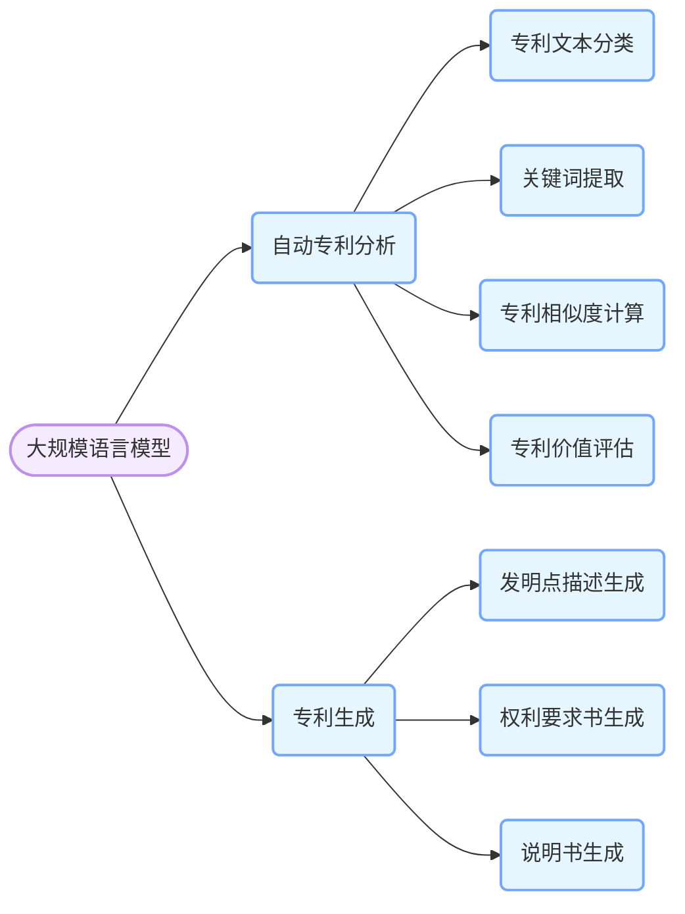

# 大规模语言模型在自动专利分析与生成中的应用

> 关键词：大规模语言模型、自动专利分析、专利生成、自然语言处理、知识图谱

> 摘要：本文深入探讨了大规模语言模型在自动专利分析与生成领域的应用。首先介绍了相关背景，包括目的、预期读者等。接着阐述了核心概念与联系，通过文本示意图和Mermaid流程图展示架构。详细讲解了核心算法原理，结合Python代码示例。给出了相关数学模型和公式，并举例说明。通过项目实战，从开发环境搭建到源代码实现与解读，展示了大规模语言模型在实际中的应用。分析了实际应用场景，推荐了学习资源、开发工具框架和相关论文著作。最后总结了未来发展趋势与挑战，解答了常见问题，并提供了扩展阅读和参考资料。

## 1. 背景介绍 
### 1.1 目的和范围
随着专利数量的急剧增长，人工进行专利分析和生成变得越来越困难且效率低下。大规模语言模型具有强大的自然语言处理能力，为自动专利分析与生成提供了新的解决方案。本文的目的是深入研究大规模语言模型在该领域的应用，包括如何利用其进行专利文本的理解、分析和生成。范围涵盖了核心概念、算法原理、数学模型、项目实战、应用场景等多个方面。

### 1.2 预期读者
本文预期读者包括专利分析师、知识产权律师、计算机科学研究人员、软件开发者等。对于希望了解大规模语言模型在专利领域应用的专业人士和研究人员具有较高的参考价值。

### 1.3 文档结构概述
本文首先介绍背景知识，包括目的、读者和结构概述等。接着阐述核心概念与联系，展示其架构。然后详细讲解核心算法原理和具体操作步骤，给出数学模型和公式。通过项目实战展示实际应用，分析应用场景。推荐相关工具和资源，最后总结未来趋势与挑战，解答常见问题并提供扩展阅读和参考资料。

### 1.4 术语表
#### 1.4.1 核心术语定义
- **大规模语言模型**：是指具有大量参数和强大语言理解与生成能力的深度学习模型，如GPT - 3、BERT等。
- **自动专利分析**：利用计算机技术对专利文本进行自动化的处理和分析，以提取关键信息、评估专利价值等。
- **专利生成**：根据已有信息和规则，自动生成符合专利规范的文本内容。

#### 1.4.2 相关概念解释
- **自然语言处理（NLP）**：是计算机科学与语言学的交叉领域，旨在让计算机理解和处理人类语言。大规模语言模型是NLP的重要成果之一。
- **知识图谱**：是一种结构化的语义网络，用于表示实体之间的关系。在专利分析中，知识图谱可以帮助整合和理解专利信息。

#### 1.4.3 缩略词列表
- **NLP**：Natural Language Processing（自然语言处理）
- **GPT**：Generative Pretrained Transformer（生成式预训练变换器）
- **BERT**：Bidirectional Encoder Representations from Transformers（基于变换器的双向编码器表示）

## 2. 核心概念与联系 
### 核心概念原理
大规模语言模型基于深度学习技术，通过在海量文本数据上进行预训练，学习到语言的统计规律和语义信息。在自动专利分析与生成中，它可以对专利文本进行语义理解、信息提取和文本生成。

自动专利分析的原理是利用大规模语言模型对专利文本进行分类、聚类、关键词提取等操作，以评估专利的创新性、竞争力和潜在价值。专利生成则是根据输入的相关信息，如技术领域、发明点等，利用模型生成符合专利规范的文本内容。

### 架构的文本示意图
```plaintext
大规模语言模型
|
|-- 自动专利分析
|   |-- 专利文本分类
|   |-- 关键词提取
|   |-- 专利相似度计算
|   |-- 专利价值评估
|
|-- 专利生成
|   |-- 发明点描述生成
|   |-- 权利要求书生成
|   |-- 说明书生成
```

### Mermaid流程图


## 3. 核心算法原理 & 具体操作步骤 
### 核心算法原理
在自动专利分析与生成中，常用的算法原理基于大规模语言模型的预训练和微调机制。预训练阶段，模型在大规模的通用文本数据上学习语言的一般规律和语义表示。微调阶段，将模型在专利相关的数据集上进行微调，使其适应专利分析与生成的任务。

以关键词提取为例，其原理是通过模型对专利文本进行编码，然后根据编码结果计算每个词语的重要性得分，选择得分较高的词语作为关键词。

### 具体操作步骤
#### 数据准备
收集和整理专利文本数据，进行清洗和预处理，包括去除噪声、分词、标注等操作。

#### 模型选择
选择合适的大规模语言模型，如GPT - 3、BERT等。

#### 模型微调
使用专利数据集对选择的模型进行微调，调整模型的参数以适应专利分析与生成任务。

#### 关键词提取
以下是一个使用Python和Hugging Face的Transformers库进行关键词提取的示例代码：
```python
from transformers import AutoTokenizer, AutoModelForSequenceClassification
import torch

# 加载预训练模型和分词器
model_name = "bert-base-chinese"
tokenizer = AutoTokenizer.from_pretrained(model_name)
model = AutoModelForSequenceClassification.from_pretrained(model_name)

# 示例专利文本
patent_text = "本发明涉及一种新型的太阳能电池，具有高效、稳定的特点。"

# 对文本进行分词
inputs = tokenizer(patent_text, return_tensors="pt")

# 前向传播
outputs = model(**inputs)

# 获取词向量
last_hidden_state = outputs.last_hidden_state

# 计算每个词语的重要性得分（简单示例，这里直接取词向量的范数）
word_importance_scores = torch.norm(last_hidden_state, dim=2).squeeze()

# 获取关键词
keywords = []
for i, score in enumerate(word_importance_scores):
    if score > torch.mean(word_importance_scores):
        keyword = tokenizer.convert_ids_to_tokens(inputs["input_ids"][0][i])
        keywords.append(keyword)

print("提取的关键词：", keywords)
```
#### 专利生成
对于专利生成任务，可以使用模型的生成功能，通过输入相关的提示信息，如技术领域、发明点等，让模型生成专利文本。以下是一个简单的示例代码：
```python
from transformers import GPT2LMHeadModel, GPT2Tokenizer

# 加载预训练模型和分词器
model_name = "gpt2"
tokenizer = GPT2Tokenizer.from_pretrained(model_name)
model = GPT2LMHeadModel.from_pretrained(model_name)

# 输入提示信息
prompt = "技术领域：太阳能电池；发明点：提高转换效率。"

# 对提示信息进行编码
input_ids = tokenizer.encode(prompt, return_tensors="pt")

# 生成专利文本
output = model.generate(input_ids, max_length=200, num_return_sequences=1)

# 解码生成的文本
generated_text = tokenizer.decode(output[0], skip_special_tokens=True)

print("生成的专利文本：", generated_text)
```

## 4. 数学模型和公式 & 详细讲解 & 举例说明 
### 关键词提取的数学模型
在关键词提取中，可以使用TF - IDF（词频 - 逆文档频率）模型来计算词语的重要性。TF - IDF的计算公式如下：
$$TF - IDF(t, d, D) = TF(t, d) \times IDF(t, D)$$
其中，$TF(t, d)$ 表示词语 $t$ 在文档 $d$ 中的词频，计算公式为：
$$TF(t, d) = \frac{词t在文档d中出现的次数}{文档d中的总词数}$$
$IDF(t, D)$ 表示词语 $t$ 的逆文档频率，计算公式为：
$$IDF(t, D) = \log\frac{文档总数}{包含词语t的文档数 + 1}$$

### 详细讲解
TF - IDF模型的核心思想是，一个词语在某个文档中出现的频率越高，同时在其他文档中出现的频率越低，那么这个词语就越能代表该文档的主题。通过计算每个词语的TF - IDF值，可以筛选出重要的关键词。

### 举例说明
假设有一个专利文档集合 $D$，包含3个文档：
- $d_1$: "本发明涉及一种新型的太阳能电池，具有高效、稳定的特点。"
- $d_2$: "这种太阳能电池采用了新的材料，提高了转换效率。"
- $d_3$: "该发明还涉及一种电池的制造方法。"

以词语“太阳能电池”为例，计算其在文档 $d_1$ 中的TF - IDF值：
- 计算 $TF$：在文档 $d_1$ 中，“太阳能电池”出现了1次，文档 $d_1$ 的总词数为9，所以 $TF("太阳能电池", d_1) = \frac{1}{9}$。
- 计算 $IDF$：文档总数为3，包含“太阳能电池”的文档数为2，所以 $IDF("太阳能电池", D) = \log\frac{3}{2 + 1} = \log1 = 0$。
- 计算 $TF - IDF$：$TF - IDF("太阳能电池", d_1, D) = \frac{1}{9} \times 0 = 0$。

## 5. 项目实战：代码实际案例和详细解释说明 
### 5.1  开发环境搭建
#### 操作系统
可以选择Windows、Linux或macOS操作系统。

#### Python环境
安装Python 3.7及以上版本。可以使用Anaconda来管理Python环境，具体步骤如下：
1. 下载并安装Anaconda：根据操作系统选择合适的Anaconda版本进行下载和安装。
2. 创建虚拟环境：打开Anaconda Prompt，执行以下命令创建一个新的虚拟环境：
```bash
conda create -n patent_env python=3.8
```
3. 激活虚拟环境：执行以下命令激活虚拟环境：
```bash
conda activate patent_env
```

#### 安装必要的库
在激活的虚拟环境中，安装以下必要的库：
```bash
pip install transformers torch pandas numpy
```

### 5.2  源代码详细实现和代码解读
#### 专利文本分类
以下是一个使用BERT模型进行专利文本分类的示例代码：
```python
import torch
from torch.utils.data import Dataset, DataLoader
from transformers import AutoTokenizer, AutoModelForSequenceClassification
from sklearn.model_selection import train_test_split
import pandas as pd

# 自定义数据集类
class PatentDataset(Dataset):
    def __init__(self, texts, labels, tokenizer, max_length):
        self.texts = texts
        self.labels = labels
        self.tokenizer = tokenizer
        self.max_length = max_length

    def __len__(self):
        return len(self.texts)

    def __getitem__(self, idx):
        text = str(self.texts[idx])
        label = self.labels[idx]
        encoding = self.tokenizer.encode_plus(
            text,
            add_special_tokens=True,
            max_length=self.max_length,
            padding='max_length',
            truncation=True,
            return_tensors='pt'
        )
        return {
            'input_ids': encoding['input_ids'].flatten(),
            'attention_mask': encoding['attention_mask'].flatten(),
            'labels': torch.tensor(label, dtype=torch.long)
        }

# 加载数据
data = pd.read_csv('patent_data.csv')
texts = data['text'].tolist()
labels = data['label'].tolist()

# 划分训练集和测试集
train_texts, test_texts, train_labels, test_labels = train_test_split(texts, labels, test_size=0.2, random_state=42)

# 加载分词器和模型
model_name = "bert-base-chinese"
tokenizer = AutoTokenizer.from_pretrained(model_name)
model = AutoModelForSequenceClassification.from_pretrained(model_name, num_labels=len(set(labels)))

# 创建数据集和数据加载器
max_length = 128
train_dataset = PatentDataset(train_texts, train_labels, tokenizer, max_length)
test_dataset = PatentDataset(test_texts, test_labels, tokenizer, max_length)
train_dataloader = DataLoader(train_dataset, batch_size=16, shuffle=True)
test_dataloader = DataLoader(test_dataset, batch_size=16, shuffle=False)

# 训练模型
device = torch.device('cuda' if torch.cuda.is_available() else 'cpu')
model.to(device)
optimizer = torch.optim.AdamW(model.parameters(), lr=2e-5)
epochs = 3
for epoch in range(epochs):
    model.train()
    total_loss = 0
    for batch in train_dataloader:
        input_ids = batch['input_ids'].to(device)
        attention_mask = batch['attention_mask'].to(device)
        labels = batch['labels'].to(device)

        optimizer.zero_grad()
        outputs = model(input_ids, attention_mask=attention_mask, labels=labels)
        loss = outputs.loss
        total_loss += loss.item()
        loss.backward()
        optimizer.step()

    print(f'Epoch {epoch + 1}/{epochs}, Loss: {total_loss / len(train_dataloader)}')

# 评估模型
model.eval()
correct_predictions = 0
total_predictions = 0
with torch.no_grad():
    for batch in test_dataloader:
        input_ids = batch['input_ids'].to(device)
        attention_mask = batch['attention_mask'].to(device)
        labels = batch['labels'].to(device)

        outputs = model(input_ids, attention_mask=attention_mask)
        logits = outputs.logits
        predictions = torch.argmax(logits, dim=1)
        correct_predictions += (predictions == labels).sum().item()
        total_predictions += labels.size(0)

accuracy = correct_predictions / total_predictions
print(f'Test Accuracy: {accuracy}')
```
#### 代码解读
1. **自定义数据集类**：`PatentDataset` 类用于封装专利文本和对应的标签，并对文本进行编码。
2. **数据加载**：使用 `pandas` 读取专利数据，并将其划分为训练集和测试集。
3. **加载分词器和模型**：使用 `AutoTokenizer` 和 `AutoModelForSequenceClassification` 加载预训练的BERT模型。
4. **创建数据集和数据加载器**：将训练集和测试集封装为 `Dataset` 对象，并创建 `DataLoader` 用于批量加载数据。
5. **训练模型**：使用 `AdamW` 优化器对模型进行训练，迭代多个epoch。
6. **评估模型**：在测试集上评估模型的准确率。

### 5.3  代码解读与分析
#### 优点
- 使用预训练的BERT模型可以利用其强大的语言理解能力，提高分类的准确性。
- 代码结构清晰，易于理解和扩展。

#### 缺点
- 训练时间较长，尤其是在使用较大的数据集和复杂的模型时。
- 模型的泛化能力可能受到数据集的限制。

#### 改进建议
- 可以尝试使用更复杂的模型架构，如RoBERTa、XLNet等。
- 增加数据增强技术，如随机替换、插入等，以提高模型的泛化能力。

## 6. 实际应用场景 
### 专利检索与筛选
大规模语言模型可以对海量的专利文本进行快速分析和筛选，帮助用户找到相关的专利。例如，用户可以输入关键词或技术领域，模型可以根据专利文本的语义信息进行匹配和排序，提供最相关的专利列表。

### 专利价值评估
通过对专利文本的分析，模型可以评估专利的创新性、竞争力和潜在价值。例如，分析专利的技术难度、市场需求、竞争对手等因素，为投资者和企业提供决策参考。

### 专利预警
监测专利动态，及时发现可能对企业造成威胁的专利。模型可以分析新申请的专利与企业现有技术的相似度，提前预警可能的侵权风险。

### 专利撰写辅助
在专利撰写过程中，模型可以提供发明点描述、权利要求书和说明书的生成建议。根据用户输入的技术信息，模型可以生成符合专利规范的文本内容，提高撰写效率和质量。

## 7. 工具和资源推荐
### 7.1 学习资源推荐
#### 7.1.1 书籍推荐
- 《自然语言处理入门》：介绍了自然语言处理的基础知识和常用算法，适合初学者。
- 《深度学习》：详细讲解了深度学习的原理和应用，对理解大规模语言模型有很大帮助。
- 《专利信息分析方法与实务》：介绍了专利分析的方法和技巧，结合实际案例进行讲解。

#### 7.1.2 在线课程
- Coursera上的“Natural Language Processing Specialization”：由知名教授授课，系统介绍自然语言处理的理论和实践。
- edX上的“Deep Learning Fundamentals”：帮助学习者掌握深度学习的基本概念和方法。
- 国家知识产权局培训中心的“专利信息分析与利用”课程：专门针对专利分析的在线课程。

#### 7.1.3 技术博客和网站
- Hugging Face Blog：提供了关于大规模语言模型的最新研究和应用案例。
- arXiv.org：是一个预印本论文库，包含了大量关于自然语言处理和人工智能的最新研究成果。
- 中国专利信息中心网站：提供专利信息检索和分析的相关资源和工具。

### 7.2 开发工具框架推荐
#### 7.2.1 IDE和编辑器
- PyCharm：是一款功能强大的Python集成开发环境，提供代码编辑、调试、版本控制等功能。
- Jupyter Notebook：适合进行交互式的代码开发和数据分析，方便展示和分享代码。
- Visual Studio Code：轻量级的代码编辑器，支持多种编程语言和插件扩展。

#### 7.2.2 调试和性能分析工具
- PyTorch Profiler：用于分析PyTorch模型的性能瓶颈，帮助优化代码。
- TensorBoard：可以可视化深度学习模型的训练过程和性能指标。
- cProfile：Python自带的性能分析工具，用于分析代码的执行时间和调用关系。

#### 7.2.3 相关框架和库
- Transformers：Hugging Face开发的用于自然语言处理的框架，提供了丰富的预训练模型和工具。
- PyTorch：深度学习框架，广泛应用于自然语言处理和计算机视觉领域。
- Scikit - learn：机器学习库，提供了多种机器学习算法和工具，可用于数据预处理和模型评估。

### 7.3 相关论文著作推荐
#### 7.3.1 经典论文
- “Attention Is All You Need”：介绍了Transformer架构，是大规模语言模型的基础。
- “BERT: Pre-training of Deep Bidirectional Transformers for Language Understanding”：提出了BERT模型，开创了预训练语言模型的新纪元。
- “Generative Pretrained Transformer 3”：介绍了GPT - 3模型，展示了大规模语言模型的强大生成能力。

#### 7.3.2 最新研究成果
- 关注ACL（Association for Computational Linguistics）、EMNLP（Conference on Empirical Methods in Natural Language Processing）等自然语言处理领域的顶级会议，获取最新的研究成果。

#### 7.3.3 应用案例分析
- 《专利信息分析应用案例集》：收集了多个专利分析的实际案例，涵盖了不同行业和技术领域。

## 8. 总结：未来发展趋势与挑战
### 未来发展趋势
- **模型性能提升**：随着技术的不断进步，大规模语言模型的性能将不断提升，能够更准确地理解和生成专利文本。
- **多模态融合**：将文本信息与图像、视频等多模态信息相结合，提供更全面的专利分析和生成服务。
- **行业定制化**：针对不同行业的特点和需求，开发定制化的大规模语言模型，提高专利分析和生成的针对性和准确性。
- **与知识图谱融合**：将大规模语言模型与知识图谱相结合，利用知识图谱的结构化信息，增强模型的推理和理解能力。

### 挑战
- **数据质量和隐私问题**：专利数据涉及大量的商业机密和隐私信息，数据的获取和使用需要遵守严格的法律法规。同时，数据的质量也会影响模型的性能。
- **模型可解释性**：大规模语言模型通常是黑盒模型，其决策过程难以解释。在专利分析和生成中，需要提高模型的可解释性，以便用户更好地理解和信任模型的结果。
- **计算资源需求**：训练和部署大规模语言模型需要大量的计算资源，成本较高。如何降低计算资源的需求，提高模型的效率，是一个亟待解决的问题。

## 9. 附录：常见问题与解答
### 问题1：大规模语言模型在专利分析与生成中的准确性如何保证？
解答：可以通过以下方法保证准确性：
- 使用高质量的专利数据集进行训练和微调。
- 采用合适的评估指标对模型进行评估和优化。
- 结合人工审核和验证，对模型的输出结果进行修正。

### 问题2：大规模语言模型是否可以完全替代人工进行专利分析和生成？
解答：目前还不能完全替代。虽然大规模语言模型具有强大的能力，但在一些复杂的专利分析和生成任务中，还需要人工的专业知识和判断。例如，在评估专利的创新性和法律风险时，人工的经验和专业知识仍然起着重要的作用。

### 问题3：如何选择适合的大规模语言模型进行专利分析和生成？
解答：可以考虑以下因素：
- 模型的性能和能力，如语言理解、生成能力等。
- 模型的可扩展性和灵活性，是否可以根据具体任务进行微调。
- 模型的计算资源需求和成本。

## 10. 扩展阅读 & 参考资料
### 扩展阅读
- 《人工智能时代的知识产权保护》：探讨了人工智能技术对知识产权保护的影响和挑战。
- 《自然语言处理实战：基于Scikit - learn、Keras和TensorFlow》：通过实际案例介绍自然语言处理的应用。

### 参考资料
- Hugging Face官方文档：https://huggingface.co/docs
- PyTorch官方文档：https://pytorch.org/docs/stable/index.html
- 国家知识产权局网站：https://www.cnipa.gov.cn/

作者：AI天才研究院/AI Genius Institute & 禅与计算机程序设计艺术 /Zen And The Art of Computer Programming