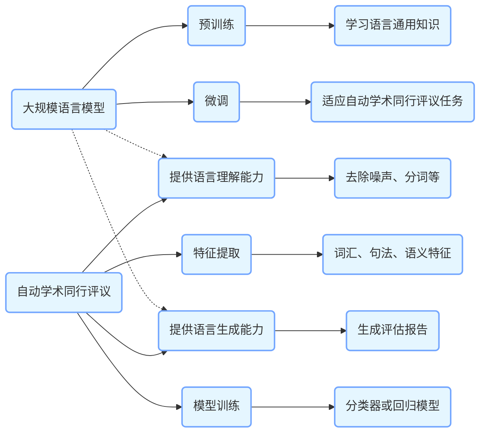

# 大规模语言模型在自动学术同行评议中的应用与挑战

> 关键词：大规模语言模型、自动学术同行评议、应用、挑战、自然语言处理

> 摘要：本文聚焦于大规模语言模型在自动学术同行评议中的应用与挑战。首先介绍了研究的背景、目的、预期读者和文档结构等内容。接着阐述了大规模语言模型和自动学术同行评议的核心概念及它们之间的联系，并给出相应的文本示意图和 Mermaid 流程图。详细讲解了核心算法原理，用 Python 代码进行了具体实现。同时，给出了相关的数学模型和公式，并举例说明。通过项目实战展示了代码实际案例及详细解释。探讨了其实际应用场景，推荐了学习资源、开发工具框架和相关论文著作。最后总结了未来发展趋势与挑战，提供了常见问题与解答以及扩展阅读和参考资料，旨在为相关领域的研究者和实践者提供全面且深入的参考。

## 1. 背景介绍 
### 1.1 目的和范围
学术同行评议是确保学术研究质量和可信度的重要环节，传统的同行评议过程往往耗时较长、成本较高且可能受到人为因素的影响。大规模语言模型（LLMs）如 GPT - 3、ChatGPT 等的出现，为自动学术同行评议带来了新的机遇和可能性。本研究的目的在于深入探讨大规模语言模型在自动学术同行评议中的应用方式、优势以及面临的挑战，旨在为学术界和科研机构提供参考，以更好地利用这些技术提高同行评议的效率和质量。本研究的范围涵盖了大规模语言模型的基本原理、在同行评议中的具体应用场景、相关算法和技术实现，以及对其应用所带来的伦理、技术和社会问题的分析。

### 1.2 预期读者
本文的预期读者包括学术研究人员、科研管理人员、自然语言处理领域的工程师和开发者，以及对学术出版和科研质量保障感兴趣的相关人士。对于研究人员来说，本文可以帮助他们了解如何利用大规模语言模型改进自己的研究成果评估过程；科研管理人员可以从中获取关于提高同行评议效率和公正性的思路；工程师和开发者则可以关注其中的技术实现细节和算法原理；而对相关领域感兴趣的人士可以通过本文了解这一新兴领域的发展动态和潜在影响。

### 1.3 文档结构概述
本文将按照以下结构展开：首先介绍核心概念与联系，包括大规模语言模型和自动学术同行评议的基本原理以及它们之间的关系，并通过文本示意图和 Mermaid 流程图进行直观展示。接着详细阐述核心算法原理和具体操作步骤，使用 Python 代码进行示例说明。然后给出相关的数学模型和公式，并通过具体例子进行解释。在项目实战部分，将介绍开发环境搭建、源代码详细实现和代码解读。之后探讨大规模语言模型在自动学术同行评议中的实际应用场景。推荐相关的学习资源、开发工具框架和论文著作。最后总结未来发展趋势与挑战，提供常见问题与解答以及扩展阅读和参考资料。

### 1.4 术语表
#### 1.4.1 核心术语定义
- **大规模语言模型（Large Language Model, LLM）**：是一种基于深度学习的自然语言处理模型，通过在大规模文本数据上进行训练，学习语言的统计规律和语义信息，能够生成自然流畅的文本、回答问题、进行文本分类等多种自然语言处理任务。
- **自动学术同行评议（Automated Academic Peer Review）**：利用计算机技术和算法自动对学术论文进行评估和审查，模拟传统同行评议过程，提供关于论文质量、创新性、可读性等方面的反馈和建议。
- **自然语言处理（Natural Language Processing, NLP）**：是一门研究如何让计算机理解、处理和生成人类自然语言的学科，包括文本分类、情感分析、机器翻译、信息抽取等多个任务。

#### 1.4.2 相关概念解释
- **Transformer 架构**：是一种基于注意力机制的深度学习架构，被广泛应用于大规模语言模型中。它通过多头自注意力机制能够有效地捕捉文本中的长距离依赖关系，提高模型的性能和表达能力。
- **预训练（Pre - training）**：大规模语言模型通常在大规模无监督文本数据上进行预训练，学习语言的通用知识和模式。预训练可以让模型在没有特定任务数据的情况下，就具备一定的语言理解和生成能力。
- **微调（Fine - tuning）**：在预训练的基础上，使用特定任务的标注数据对模型进行微调，使模型能够适应具体的任务需求，提高模型在该任务上的性能。

#### 1.4.3 缩略词列表
- **LLM**：Large Language Model（大规模语言模型）
- **NLP**：Natural Language Processing（自然语言处理）
- **API**：Application Programming Interface（应用程序编程接口）
- **GPU**：Graphics Processing Unit（图形处理单元）

## 2. 核心概念与联系 
### 大规模语言模型原理
大规模语言模型通常基于深度学习架构，如 Transformer。Transformer 架构由编码器和解码器组成，其中自注意力机制是其核心组件。自注意力机制允许模型在处理每个输入位置时，动态地关注输入序列中的其他位置，从而捕捉长距离依赖关系。

大规模语言模型的训练过程分为预训练和微调两个阶段。在预训练阶段，模型在大规模无监督文本数据上进行训练，学习语言的通用知识和模式。常见的预训练任务包括掩码语言模型（Masked Language Model, MLM）和下一句预测（Next Sentence Prediction, NSP）。在微调阶段，模型使用特定任务的标注数据进行训练，以适应具体的任务需求。

### 自动学术同行评议原理
自动学术同行评议的目标是通过计算机算法对学术论文进行评估和审查。其过程通常包括文本预处理、特征提取、模型训练和评估结果生成等步骤。文本预处理包括去除噪声、分词、词性标注等操作，以将论文文本转换为适合模型处理的格式。特征提取则从预处理后的文本中提取有意义的特征，如词汇特征、句法特征、语义特征等。模型训练使用提取的特征和标注数据对分类器或回归模型进行训练，以预测论文的质量、创新性等指标。最后，根据模型的预测结果生成评估报告。

### 两者联系
大规模语言模型为自动学术同行评议提供了强大的语言理解和生成能力。在文本预处理阶段，大规模语言模型可以用于更准确的分词、词性标注和命名实体识别。在特征提取阶段，模型的隐藏层输出可以作为文本的语义特征，提高特征的表达能力。在评估结果生成阶段，大规模语言模型可以生成自然流畅的评估报告，提供详细的反馈和建议。

### 文本示意图
```plaintext
大规模语言模型
|-- 预训练（大规模无监督数据）
|   |-- 学习语言通用知识
|-- 微调（特定任务标注数据）
|   |-- 适应自动学术同行评议任务

自动学术同行评议
|-- 文本预处理
|   |-- 去除噪声、分词等
|-- 特征提取
|   |-- 词汇、句法、语义特征
|-- 模型训练
|   |-- 分类器或回归模型
|-- 评估结果生成
|   |-- 生成评估报告

联系：大规模语言模型为自动学术同行评议提供语言理解和生成能力
```

### Mermaid 流程图


## 3. 核心算法原理 & 具体操作步骤 
### 核心算法原理
在自动学术同行评议中，可以使用大规模语言模型进行文本分类和文本生成任务。以文本分类为例，我们可以将学术论文分为不同的类别，如高质量论文、中等质量论文和低质量论文。可以使用预训练的大规模语言模型，如 BERT，将论文文本转换为向量表示，然后在向量表示上训练一个分类器。

### Python 代码实现
```python
import torch
from transformers import BertTokenizer, BertForSequenceClassification

# 加载预训练的 BERT 模型和分词器
tokenizer = BertTokenizer.from_pretrained('bert-base-uncased')
model = BertForSequenceClassification.from_pretrained('bert-base-uncased', num_labels=3)

# 示例论文文本
paper_text = "This is a sample academic paper with some interesting ideas."

# 对论文文本进行分词
inputs = tokenizer(paper_text, return_tensors='pt')

# 前向传播
outputs = model(**inputs)

# 获取分类结果
logits = outputs.logits
predicted_class = torch.argmax(logits, dim=1).item()

print(f"Predicted class: {predicted_class}")
```
### 代码解释
1. **加载模型和分词器**：使用 `transformers` 库加载预训练的 BERT 模型和分词器。`BertForSequenceClassification` 是用于文本分类的 BERT 模型，`num_labels=3` 表示分为 3 个类别。
2. **分词**：使用分词器对论文文本进行分词，并将其转换为 PyTorch 张量。
3. **前向传播**：将分词后的输入传递给模型进行前向传播，得到模型的输出。
4. **获取分类结果**：从模型的输出中提取 logits，并使用 `torch.argmax` 函数获取预测的类别。

### 具体操作步骤
1. **数据准备**：收集学术论文数据集，并进行标注，分为不同的类别。
2. **模型微调**：使用标注数据集对预训练的大规模语言模型进行微调，以适应文本分类任务。
3. **模型评估**：使用测试数据集对微调后的模型进行评估，计算准确率、召回率等指标。
4. **应用部署**：将训练好的模型部署到实际应用中，对新的学术论文进行分类。

## 4. 数学模型和公式 & 详细讲解 & 举例说明 
### 文本分类的数学模型
在文本分类任务中，我们的目标是将输入的文本 $x$ 分类到 $K$ 个类别中的一个。假设我们使用一个神经网络模型 $f(x; \theta)$，其中 $\theta$ 是模型的参数。模型的输出是一个长度为 $K$ 的向量 $y = f(x; \theta)$，其中 $y_i$ 表示输入文本属于第 $i$ 个类别的得分。

为了得到每个类别的概率，我们可以使用 softmax 函数：
$$P(y_i|x; \theta) = \frac{\exp(y_i)}{\sum_{j = 1}^{K}\exp(y_j)}$$

### 损失函数
在训练模型时，我们需要定义一个损失函数来衡量模型的预测结果与真实标签之间的差异。常用的损失函数是交叉熵损失函数：
$$L(\theta) = -\sum_{n = 1}^{N}\sum_{i = 1}^{K}t_{n, i}\log P(y_{n, i}|x_n; \theta)$$
其中 $N$ 是训练样本的数量，$t_{n, i}$ 是第 $n$ 个样本的真实标签的第 $i$ 个分量，如果样本 $n$ 属于第 $i$ 个类别，则 $t_{n, i} = 1$，否则 $t_{n, i} = 0$。

### 举例说明
假设我们有一个二分类问题，即判断一篇学术论文是高质量论文还是低质量论文。我们有一个训练样本 $x$，其真实标签为 $t = [0, 1]$，表示该论文是低质量论文。模型的输出 $y = [1.2, 2.5]$。

首先，使用 softmax 函数计算每个类别的概率：
$$P(y_1|x; \theta) = \frac{\exp(1.2)}{\exp(1.2) + \exp(2.5)} \approx 0.23$$
$$P(y_2|x; \theta) = \frac{\exp(2.5)}{\exp(1.2) + \exp(2.5)} \approx 0.77$$

然后，计算交叉熵损失：
$$L(\theta) = -(0\times\log(0.23) + 1\times\log(0.77)) \approx 0.26$$

在训练过程中，我们的目标是通过调整模型的参数 $\theta$ 来最小化损失函数 $L(\theta)$。

## 5. 项目实战：代码实际案例和详细解释说明 
### 5.1  开发环境搭建
#### 安装 Python
首先，确保你已经安装了 Python 3.7 或更高版本。可以从 Python 官方网站（https://www.python.org/downloads/）下载并安装。

#### 创建虚拟环境
为了避免不同项目之间的依赖冲突，建议使用虚拟环境。可以使用 `venv` 模块创建虚拟环境：
```bash
python -m venv myenv
```
激活虚拟环境：
- 在 Windows 上：
```bash
myenv\Scripts\activate
```
- 在 Linux 或 macOS 上：
```bash
source myenv/bin/activate
```

#### 安装依赖库
在虚拟环境中安装所需的依赖库，包括 `transformers`、`torch` 等：
```bash
pip install transformers torch pandas scikit-learn
```

### 5.2  源代码详细实现和代码解读
```python
import torch
from transformers import BertTokenizer, BertForSequenceClassification
from sklearn.model_selection import train_test_split
import pandas as pd

# 加载数据集
data = pd.read_csv('papers.csv')
texts = data['text'].tolist()
labels = data['label'].tolist()

# 划分训练集和测试集
train_texts, test_texts, train_labels, test_labels = train_test_split(texts, labels, test_size=0.2, random_state=42)

# 加载预训练的 BERT 模型和分词器
tokenizer = BertTokenizer.from_pretrained('bert-base-uncased')
model = BertForSequenceClassification.from_pretrained('bert-base-uncased', num_labels=3)

# 对训练集和测试集进行分词
train_encodings = tokenizer(train_texts, truncation=True, padding=True)
test_encodings = tokenizer(test_texts, truncation=True, padding=True)

# 创建 PyTorch 数据集
class PaperDataset(torch.utils.data.Dataset):
    def __init__(self, encodings, labels):
        self.encodings = encodings
        self.labels = labels

    def __getitem__(self, idx):
        item = {key: torch.tensor(val[idx]) for key, val in self.encodings.items()}
        item['labels'] = torch.tensor(self.labels[idx])
        return item

    def __len__(self):
        return len(self.labels)

train_dataset = PaperDataset(train_encodings, train_labels)
test_dataset = PaperDataset(test_encodings, test_labels)

# 定义训练参数
from transformers import TrainingArguments, Trainer

training_args = TrainingArguments(
    output_dir='./results',          # 输出目录
    num_train_epochs=3,              # 训练轮数
    per_device_train_batch_size=16,  # 每个设备的训练批次大小
    per_device_eval_batch_size=64,   # 每个设备的评估批次大小
    warmup_steps=500,                # 热身步数
    weight_decay=0.01,               # 权重衰减率
    logging_dir='./logs',            # 日志目录
    logging_steps=10
)

trainer = Trainer(
    model=model,                         # 模型
    args=training_args,                  # 训练参数
    train_dataset=train_dataset,         # 训练数据集
    eval_dataset=test_dataset            # 评估数据集
)

# 训练模型
trainer.train()

# 评估模型
results = trainer.evaluate()
print(results)
```

### 5.3  代码解读与分析
1. **数据加载与划分**：使用 `pandas` 库加载包含论文文本和标签的 CSV 文件，并将其划分为训练集和测试集。
2. **模型和分词器加载**：使用 `transformers` 库加载预训练的 BERT 模型和分词器。
3. **分词处理**：使用分词器对训练集和测试集的文本进行分词，并进行截断和填充操作，以确保输入的长度一致。
4. **数据集创建**：创建自定义的 PyTorch 数据集类 `PaperDataset`，用于封装分词后的文本和标签。
5. **训练参数定义**：使用 `TrainingArguments` 类定义训练参数，如训练轮数、批次大小、热身步数等。
6. **训练器创建**：使用 `Trainer` 类创建训练器，将模型、训练参数、训练数据集和评估数据集传入。
7. **模型训练和评估**：调用 `trainer.train()` 方法进行模型训练，调用 `trainer.evaluate()` 方法进行模型评估，并打印评估结果。

## 6. 实际应用场景 
### 快速初步筛选
在学术期刊收到大量投稿时，使用大规模语言模型进行自动学术同行评议可以快速对论文进行初步筛选。模型可以根据论文的标题、摘要、关键词等信息，快速判断论文是否符合期刊的主题范围、是否具有一定的创新性和质量，从而帮助编辑人员快速排除明显不符合要求的论文，提高筛选效率。

### 辅助评审
对于评审人员来说，大规模语言模型可以作为辅助工具，提供额外的参考信息。模型可以对论文进行语法检查、逻辑分析、文献引用分析等，发现论文中存在的潜在问题，并生成相应的建议和反馈。评审人员可以结合模型的输出和自己的专业知识，更全面、客观地对论文进行评估。

### 多语言评审
在国际学术交流中，论文往往使用多种语言撰写。大规模语言模型具有跨语言处理能力，可以对不同语言的论文进行统一的评估和分析。这有助于打破语言障碍，促进学术研究的国际化交流和合作。

### 实时反馈
在学术会议投稿、学生论文提交等场景中，大规模语言模型可以提供实时的反馈。作者可以在提交论文后立即得到关于论文质量、创新性、可读性等方面的初步评估，从而及时对论文进行修改和完善，提高论文的质量。

## 7. 工具和资源推荐
### 7.1 学习资源推荐
#### 7.1.1 书籍推荐
- 《自然语言处理入门》：这本书系统地介绍了自然语言处理的基本概念、算法和技术，适合初学者入门。
- 《深度学习》：由 Ian Goodfellow、Yoshua Bengio 和 Aaron Courville 所著，是深度学习领域的经典教材，对理解大规模语言模型的原理和架构有很大帮助。
- 《Transformer 自然语言处理》：详细介绍了 Transformer 架构及其在自然语言处理中的应用，是深入学习大规模语言模型的重要参考书籍。

#### 7.1.2 在线课程
- Coursera 上的“Natural Language Processing Specialization”：由斯坦福大学的教授授课，涵盖了自然语言处理的多个方面，包括文本分类、情感分析、机器翻译等。
- edX 上的“Deep Learning Specialization”：由 Andrew Ng 教授授课，深入讲解了深度学习的原理和应用，对理解大规模语言模型的训练和优化有很大帮助。
- Hugging Face 的官方教程：提供了关于使用 `transformers` 库进行自然语言处理任务的详细教程，包括模型加载、微调、推理等操作。

#### 7.1.3 技术博客和网站
- Hugging Face Blog：Hugging Face 官方博客，发布了许多关于大规模语言模型和自然语言处理的最新研究成果和技术文章。
- Towards Data Science：一个专注于数据科学和机器学习的博客平台，有很多关于自然语言处理和大规模语言模型的高质量文章。
- arXiv.org：一个开放获取的学术预印本平台，提供了大量关于自然语言处理和大规模语言模型的最新研究论文。

### 7.2 开发工具框架推荐
#### 7.2.1 IDE和编辑器
- PyCharm：一款专业的 Python 集成开发环境，提供了丰富的代码编辑、调试、版本控制等功能，适合大规模 Python 项目的开发。
- Jupyter Notebook：一个交互式的开发环境，支持 Python、R 等多种编程语言，适合进行数据探索、模型实验和可视化展示。
- Visual Studio Code：一款轻量级的代码编辑器，支持多种编程语言和插件扩展，具有良好的代码编辑体验和调试功能。

#### 7.2.2 调试和性能分析工具
- PyTorch Profiler：PyTorch 官方提供的性能分析工具，可以帮助开发者分析模型的训练和推理过程中的性能瓶颈，优化代码性能。
- TensorBoard：一个可视化工具，可用于监控模型的训练过程，如损失函数的变化、准确率的变化等，帮助开发者调试和优化模型。
- cProfile：Python 内置的性能分析模块，可以分析 Python 代码的执行时间和函数调用次数，找出代码中的性能瓶颈。

#### 7.2.3 相关框架和库
- Transformers：Hugging Face 开发的一个开源库，提供了大量预训练的语言模型和工具，方便开发者进行自然语言处理任务的开发。
- PyTorch：一个深度学习框架，具有动态图计算、自动求导等功能，被广泛应用于大规模语言模型的开发和训练。
- scikit - learn：一个用于机器学习的 Python 库，提供了丰富的机器学习算法和工具，可用于数据预处理、模型选择和评估等任务。

### 7.3 相关论文著作推荐
#### 7.3.1 经典论文
- “Attention Is All You Need”：介绍了 Transformer 架构，是大规模语言模型发展的重要里程碑。
- “BERT: Pre-training of Deep Bidirectional Transformers for Language Understanding”：提出了 BERT 模型，开创了预训练 - 微调的自然语言处理范式。
- “GPT: Generative Pretrained Transformer”：介绍了 GPT 模型，展示了基于自回归语言模型的强大文本生成能力。

#### 7.3.2 最新研究成果
- 关注 arXiv.org 上关于自然语言处理和大规模语言模型的最新研究论文，了解该领域的最新技术和方法。
- 参加国际学术会议，如 ACL（Association for Computational Linguistics）、EMNLP（Conference on Empirical Methods in Natural Language Processing）等，获取最新的研究成果和趋势。

#### 7.3.3 应用案例分析
- 一些学术期刊和会议会发表关于大规模语言模型在学术同行评议中的应用案例分析，可以通过搜索相关文献了解实际应用中的经验和挑战。
- 企业和科研机构的技术博客也会分享一些大规模语言模型的应用案例，可以从中获取灵感和实践经验。

## 8. 总结：未来发展趋势与挑战
### 未来发展趋势
#### 模型性能提升
随着计算资源的不断增加和算法的不断改进，大规模语言模型的性能将不断提升。模型将能够更好地理解自然语言的语义和上下文，生成更加准确和自然的文本，从而提高自动学术同行评议的质量和可靠性。

#### 多模态融合
未来的自动学术同行评议可能会融合多种模态的信息，如图像、音频、视频等。例如，对于一些涉及实验结果展示的论文，可以结合图像分析技术对实验图片进行评估，提供更全面的反馈。

#### 个性化评审
根据不同的学科领域、期刊要求和评审人员的偏好，实现个性化的自动学术同行评议。模型可以学习不同的评审标准和风格，为不同的用户提供定制化的评估结果和建议。

#### 与科研流程深度融合
自动学术同行评议将与科研流程的其他环节深度融合，如论文写作、实验设计、数据分析等。例如，在论文写作过程中，模型可以实时提供语法检查、逻辑优化等建议，帮助作者提高论文质量。

### 挑战
#### 数据质量和偏见
大规模语言模型的性能高度依赖于训练数据的质量。如果训练数据存在偏见、错误或不完整，模型的输出也会受到影响。在自动学术同行评议中，数据偏见可能导致对某些学科领域、研究方法或作者群体的不公平评估。

#### 伦理和法律问题
自动学术同行评议涉及到学术论文的知识产权、隐私保护等伦理和法律问题。例如，模型在处理论文数据时需要遵守相关的法律法规，确保数据的安全和隐私。同时，对于模型生成的评估结果，需要明确其责任归属和法律地位。

#### 解释性和可信任性
大规模语言模型通常是黑盒模型，其决策过程难以解释。在自动学术同行评议中，评审人员和作者需要了解模型的评估依据和决策过程，以便对评估结果进行合理的质疑和改进。提高模型的解释性和可信任性是一个重要的挑战。

#### 技术门槛和成本
大规模语言模型的训练和部署需要大量的计算资源和专业知识，对于一些小型科研机构和个人研究者来说，技术门槛和成本较高。如何降低技术门槛和成本，使更多的人能够受益于自动学术同行评议技术，是一个需要解决的问题。

## 9. 附录：常见问题与解答
### 大规模语言模型在自动学术同行评议中的准确性如何保证？
可以通过以下几种方式保证准确性：
- 使用高质量的训练数据，包括大量的标注论文数据和多样化的学科领域数据。
- 进行模型微调，使用特定任务的标注数据对预训练模型进行微调，以适应自动学术同行评议的任务需求。
- 进行模型评估和验证，使用测试数据集对模型进行评估，计算准确率、召回率等指标，并根据评估结果对模型进行优化。
- 结合人工评审，将模型的评估结果作为参考，由专业的评审人员进行最终的判断和决策。

### 自动学术同行评议是否会完全取代人工评审？
目前来看，自动学术同行评议不太可能完全取代人工评审。虽然大规模语言模型在语言理解和生成方面具有强大的能力，但学术研究的评估不仅仅涉及语言层面的分析，还需要专业的领域知识、创新思维和判断力。人工评审人员可以从更全面的角度对论文进行评估，发现一些模型难以察觉的问题。自动学术同行评议可以作为人工评审的辅助工具，提高评审效率和质量。

### 如何解决大规模语言模型在自动学术同行评议中的数据偏见问题？
可以采取以下措施解决数据偏见问题：
- 数据清洗和预处理，对训练数据进行清洗和筛选，去除存在偏见的数据。
- 多样化数据收集，收集来自不同学科领域、不同研究方法、不同作者群体的数据，确保数据的多样性。
- 偏见检测和纠正，使用专门的算法和工具检测模型输出中的偏见，并进行纠正。
- 人工监督和干预，在模型训练和评估过程中，引入人工监督和干预，确保模型的输出公平、公正。

### 大规模语言模型在自动学术同行评议中的计算资源需求如何？
大规模语言模型的训练和推理需要大量的计算资源，特别是 GPU 资源。训练一个大规模语言模型可能需要数十甚至数百个 GPU 进行并行计算。在推理阶段，对于一些复杂的模型，也需要一定的 GPU 资源来保证推理速度。为了降低计算资源需求，可以采用模型压缩、量化等技术，减少模型的参数量和计算量。同时，也可以使用云计算平台提供的计算资源，按需使用，降低成本。

## 10. 扩展阅读 & 参考资料
### 扩展阅读
- 《自然语言处理：基于预训练模型的方法》：深入介绍了基于预训练模型的自然语言处理技术，包括大规模语言模型的原理、训练和应用。
- 《人工智能：现代方法》：全面介绍了人工智能的各个领域，包括自然语言处理、机器学习、知识表示等，对理解大规模语言模型的背景和应用有很大帮助。
- 《学术出版与同行评议》：从学术出版的角度探讨了同行评议的历史、现状和未来发展趋势，有助于了解自动学术同行评议在学术出版体系中的地位和作用。

### 参考资料
- Vaswani, A., Shazeer, N., Parmar, N., Uszkoreit, J., Jones, L., Gomez, A. N.,... & Polosukhin, I. (2017). Attention is all you need. Advances in neural information processing systems, 30.
- Devlin, J., Chang, M. W., Lee, K., & Toutanova, K. (2018). Bert: Pre-training of deep bidirectional transformers for language understanding. arXiv preprint arXiv:1810.04805.
- Radford, A., Narasimhan, K., Salimans, T., & Sutskever, I. (2018). Improving language understanding by generative pre-training.
- Hugging Face 官方文档：https://huggingface.co/docs
- PyTorch 官方文档：https://pytorch.org/docs/stable/index.html

作者：AI天才研究院/AI Genius Institute & 禅与计算机程序设计艺术 /Zen And The Art of Computer Programming