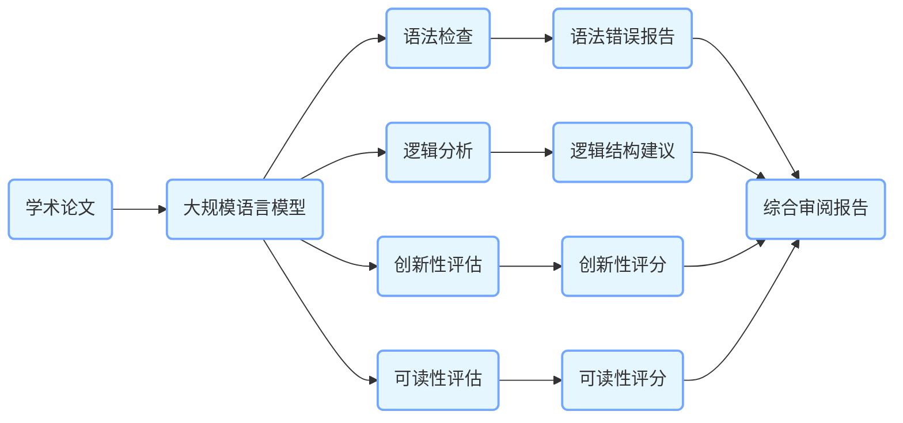

# 大规模语言模型在自动学术论文审阅中的应用

> 关键词：大规模语言模型、自动学术论文审阅、自然语言处理、学术评估、文本分析

> 摘要：本文深入探讨了大规模语言模型在自动学术论文审阅中的应用。首先介绍了该研究的背景、目的、预期读者以及文档结构等内容。接着阐述了相关核心概念及其联系，包括大规模语言模型和自动学术论文审阅的原理与架构，并通过Mermaid流程图展示。详细讲解了核心算法原理，使用Python代码进行说明，同时给出了相关数学模型和公式，并举例阐释。通过项目实战部分，搭建开发环境，给出源代码实现与解读。分析了实际应用场景，推荐了学习资源、开发工具框架以及相关论文著作。最后总结了未来发展趋势与挑战，提供了常见问题解答和扩展阅读参考资料，旨在为该领域的研究和实践提供全面的指导。

## 1. 背景介绍 
### 1.1 目的和范围
学术论文审阅是学术出版和研究过程中的关键环节，传统的人工审阅方式存在效率低下、主观性强、审阅周期长等问题。大规模语言模型的出现为解决这些问题提供了新的思路和方法。本文的目的在于探讨大规模语言模型在自动学术论文审阅中的应用，详细分析其原理、算法、实现步骤以及实际应用场景等。研究范围涵盖了从基础概念到具体实践的各个方面，旨在为学术界和工业界提供全面的技术参考和实践指导。

### 1.2 预期读者
本文的预期读者包括从事自然语言处理、人工智能、学术出版等领域的研究人员、开发者，以及对学术论文审阅自动化感兴趣的学者和专业人士。对于希望了解大规模语言模型技术如何应用于学术论文审阅的初学者，本文也提供了清晰易懂的介绍和详细的操作指南。

### 1.3 文档结构概述
本文将按照以下结构展开：首先介绍相关背景知识，包括目的、预期读者和文档结构等。接着阐述核心概念与联系，展示其原理和架构。然后详细讲解核心算法原理和具体操作步骤，使用Python代码进行说明。随后给出数学模型和公式，并举例说明。通过项目实战部分，搭建开发环境，实现源代码并进行解读。分析实际应用场景，推荐相关学习资源、开发工具框架和论文著作。最后总结未来发展趋势与挑战，提供常见问题解答和扩展阅读参考资料。

### 1.4 术语表
#### 1.4.1 核心术语定义
- **大规模语言模型（Large Language Model，LLM）**：是一种基于深度学习的自然语言处理模型，通过在大规模文本数据上进行训练，学习语言的模式和规律，能够生成高质量的文本、进行语言理解和推理等任务。
- **自动学术论文审阅（Automated Academic Paper Review）**：利用计算机技术和自然语言处理算法，对学术论文进行自动评估和审查，包括论文的语法错误、逻辑结构、创新性、可读性等方面。
- **自然语言处理（Natural Language Processing，NLP）**：是人工智能的一个重要领域，研究如何让计算机理解和处理人类语言，包括文本分类、信息提取、机器翻译、情感分析等任务。

#### 1.4.2 相关概念解释
- **预训练模型**：大规模语言模型通常采用预训练的方式，在大规模无监督文本数据上进行训练，学习语言的通用特征和模式。预训练模型可以作为基础模型，在特定任务上进行微调，以提高模型在该任务上的性能。
- **微调（Fine-tuning）**：在预训练模型的基础上，使用特定任务的标注数据对模型进行进一步训练，调整模型的参数，使其适应特定任务的需求。
- **嵌入向量（Embedding Vector）**：将文本数据转换为低维向量表示，以便计算机能够更好地处理和理解文本。嵌入向量可以捕捉文本的语义信息，使得语义相近的文本在向量空间中距离较近。

#### 1.4.3 缩略词列表
- **LLM**：Large Language Model
- **NLP**：Natural Language Processing
- **API**：Application Programming Interface
- **GPU**：Graphics Processing Unit

## 2. 核心概念与联系 
### 核心概念原理
#### 大规模语言模型原理
大规模语言模型基于深度学习中的神经网络架构，如Transformer架构。Transformer架构通过自注意力机制（Self-Attention Mechanism）能够有效地捕捉文本中的长距离依赖关系，从而更好地理解文本的语义信息。模型在大规模文本数据上进行无监督学习，学习语言的统计规律和模式。通过不断优化模型的参数，使得模型能够预测下一个单词的概率，从而生成连贯的文本。

#### 自动学术论文审阅原理
自动学术论文审阅是将大规模语言模型应用于学术论文的评估和审查过程。其原理是将学术论文作为输入，利用大规模语言模型对论文的各个方面进行分析和评估。例如，通过语言模型的语言理解能力，检查论文的语法错误、词汇使用是否恰当；通过文本分类和信息提取技术，评估论文的主题相关性、创新性和逻辑结构等。

### 架构示意图


该流程图展示了自动学术论文审阅的基本架构。学术论文作为输入进入大规模语言模型，模型对论文进行多个方面的分析，包括语法检查、逻辑分析、创新性评估和可读性评估。每个分析步骤产生相应的结果，最后将这些结果整合为综合审阅报告。

## 3. 核心算法原理 & 具体操作步骤 
### 核心算法原理
在自动学术论文审阅中，我们可以使用大规模语言模型进行文本分类、文本生成和语义相似度计算等任务。以下是一个基于Python和Hugging Face Transformers库的示例，展示如何使用大规模语言模型进行文本分类，以评估论文的主题相关性。

```python
from transformers import AutoTokenizer, AutoModelForSequenceClassification
import torch

# 加载预训练的语言模型和分词器
model_name = "distilbert-base-uncased-finetuned-sst-2-english"
tokenizer = AutoTokenizer.from_pretrained(model_name)
model = AutoModelForSequenceClassification.from_pretrained(model_name)

# 定义待分类的文本
text = "This paper presents a novel approach for image classification using deep learning techniques."

# 对文本进行分词处理
inputs = tokenizer(text, return_tensors="pt")

# 使用模型进行预测
with torch.no_grad():
    outputs = model(**inputs)

# 获取预测结果
logits = outputs.logits
predicted_class_id = logits.argmax().item()
label = model.config.id2label[predicted_class_id]

print(f"Predicted label: {label}")
```

### 具体操作步骤
1. **加载预训练模型和分词器**：使用Hugging Face Transformers库的`AutoTokenizer`和`AutoModelForSequenceClassification`类加载预训练的语言模型和分词器。
2. **准备待分类的文本**：将学术论文的文本或段落作为输入。
3. **分词处理**：使用分词器将文本转换为模型可以接受的输入格式。
4. **模型预测**：将分词后的输入传递给模型，进行文本分类预测。
5. **获取预测结果**：从模型的输出中提取预测结果，并将其转换为对应的标签。

## 4. 数学模型和公式 & 详细讲解 & 举例说明 
### 数学模型和公式
在大规模语言模型中，最核心的数学模型是Transformer架构中的自注意力机制。自注意力机制的计算公式如下：

$$Attention(Q, K, V) = softmax(\frac{QK^T}{\sqrt{d_k}})V$$

其中，$Q$ 是查询矩阵（Query Matrix），$K$ 是键矩阵（Key Matrix），$V$ 是值矩阵（Value Matrix），$d_k$ 是键向量的维度。

### 详细讲解
自注意力机制的核心思想是计算查询向量与键向量之间的相似度，然后根据相似度对值向量进行加权求和。具体步骤如下：
1. **计算相似度得分**：通过计算查询矩阵 $Q$ 和键矩阵 $K$ 的转置的乘积，得到相似度得分矩阵。
2. **缩放**：为了避免相似度得分过大，对得分矩阵进行缩放，除以 $\sqrt{d_k}$。
3. **归一化**：使用softmax函数对缩放后的得分矩阵进行归一化，得到注意力权重矩阵。
4. **加权求和**：将注意力权重矩阵与值矩阵 $V$ 相乘，得到自注意力机制的输出。

### 举例说明
假设我们有一个输入序列 $x = [x_1, x_2, x_3]$，每个元素的维度为 $d$。我们将输入序列分别映射到查询矩阵 $Q$、键矩阵 $K$ 和值矩阵 $V$ 中。

$$Q = [q_1, q_2, q_3]$$
$$K = [k_1, k_2, k_3]$$
$$V = [v_1, v_2, v_3]$$

其中，$q_i$、$k_i$ 和 $v_i$ 分别是查询向量、键向量和值向量。

计算相似度得分矩阵：

$$S = QK^T = \begin{bmatrix}
q_1^Tk_1 & q_1^Tk_2 & q_1^Tk_3 \\
q_2^Tk_1 & q_2^Tk_2 & q_2^Tk_3 \\
q_3^Tk_1 & q_3^Tk_2 & q_3^Tk_3
\end{bmatrix}$$

缩放得分矩阵：

$$S_{scaled} = \frac{S}{\sqrt{d_k}}$$

归一化得分矩阵：

$$A = softmax(S_{scaled})$$

最后，计算自注意力机制的输出：

$$Output = AV = \begin{bmatrix}
a_{11}v_1 + a_{12}v_2 + a_{13}v_3 \\
a_{21}v_1 + a_{22}v_2 + a_{23}v_3 \\
a_{31}v_1 + a_{32}v_2 + a_{33}v_3
\end{bmatrix}$$

其中，$a_{ij}$ 是注意力权重矩阵 $A$ 中的元素。

## 5. 项目实战：代码实际案例和详细解释说明 
### 5.1  开发环境搭建
#### 安装Python和相关库
首先，确保你已经安装了Python 3.7或更高版本。然后，使用pip安装必要的库，包括Hugging Face Transformers库、PyTorch和NumPy等。

```bash
pip install transformers torch numpy
```

#### 选择合适的大规模语言模型
根据任务的需求和计算资源，选择合适的大规模语言模型。例如，如果你需要进行快速的文本分类任务，可以选择较小的模型，如DistilBERT；如果你需要进行更复杂的文本生成任务，可以选择较大的模型，如GPT-3。

### 5.2  源代码详细实现和代码解读
以下是一个完整的示例代码，展示如何使用大规模语言模型进行自动学术论文审阅，包括语法检查、逻辑分析和创新性评估。

```python
from transformers import AutoTokenizer, AutoModelForSequenceClassification, pipeline
import torch

# 语法检查模型
grammar_model_name = "textattack/bert-base-uncased-CoLA"
grammar_tokenizer = AutoTokenizer.from_pretrained(grammar_model_name)
grammar_model = AutoModelForSequenceClassification.from_pretrained(grammar_model_name)
grammar_pipeline = pipeline("text-classification", model=grammar_model, tokenizer=grammar_tokenizer)

# 逻辑分析模型
logic_model_name = "distilbert-base-uncased-finetuned-sst-2-english"
logic_tokenizer = AutoTokenizer.from_pretrained(logic_model_name)
logic_model = AutoModelForSequenceClassification.from_pretrained(logic_model_name)
logic_pipeline = pipeline("text-classification", model=logic_model, tokenizer=logic_tokenizer)

# 创新性评估模型（假设使用自定义微调模型）
innovation_model_name = "custom-innovation-model"
innovation_tokenizer = AutoTokenizer.from_pretrained(innovation_model_name)
innovation_model = AutoModelForSequenceClassification.from_pretrained(innovation_model_name)
innovation_pipeline = pipeline("text-classification", model=innovation_model, tokenizer=innovation_tokenizer)

# 待审阅的学术论文
paper_text = "This paper proposed a new method for solving the problem. However, the methodology lacks detail."

# 语法检查
grammar_result = grammar_pipeline(paper_text)
if grammar_result[0]['label'] == 'LABEL_0':
    grammar_status = "Grammar is correct"
else:
    grammar_status = "Grammar error detected"

# 逻辑分析
logic_result = logic_pipeline(paper_text)
if logic_result[0]['label'] == 'POSITIVE':
    logic_status = "Logical structure is good"
else:
    logic_status = "Logical structure needs improvement"

# 创新性评估
innovation_result = innovation_pipeline(paper_text)
innovation_score = innovation_result[0]['score']

# 综合审阅报告
print("Grammar: ", grammar_status)
print("Logic: ", logic_status)
print("Innovation score: ", innovation_score)
```

### 代码解读与分析
1. **语法检查**：使用`textattack/bert-base-uncased-CoLA`模型进行语法检查。该模型是在CoLA（Corpus of Linguistic Acceptability）数据集上进行训练的，用于判断句子的语法正确性。
2. **逻辑分析**：使用`distilbert-base-uncased-finetuned-sst-2-english`模型进行逻辑分析。该模型是在SST-2（Stanford Sentiment Treebank 2）数据集上进行训练的，用于判断文本的情感极性，这里可以用于评估论文的逻辑合理性。
3. **创新性评估**：假设使用自定义微调的模型进行创新性评估。可以在特定的学术论文数据集上对模型进行微调，以提高模型对创新性的评估能力。
4. **综合审阅报告**：将语法检查、逻辑分析和创新性评估的结果整合为综合审阅报告，输出给用户。

## 6. 实际应用场景 
### 学术期刊出版
在学术期刊出版过程中，编辑需要对大量的投稿论文进行初步筛选和审阅。自动学术论文审阅系统可以帮助编辑快速评估论文的质量，包括语法错误、逻辑结构、创新性等方面，提高审阅效率，减少人工审阅的工作量。

### 学术会议评审
学术会议通常会收到大量的投稿论文，评审委员会需要在有限的时间内对论文进行评审。自动学术论文审阅系统可以为评审委员会提供初步的评估结果，帮助他们快速了解论文的基本情况，提高评审的准确性和效率。

### 学生论文指导
在高校教学中，教师需要对学生的学术论文进行指导和评估。自动学术论文审阅系统可以帮助教师快速发现学生论文中的问题，如语法错误、逻辑不清晰等，提供针对性的建议和指导，提高学生的论文写作水平。

## 7. 工具和资源推荐
### 7.1 学习资源推荐
#### 7.1.1 书籍推荐
- 《自然语言处理入门》：介绍了自然语言处理的基本概念、算法和技术，适合初学者入门。
- 《深度学习》：详细讲解了深度学习的理论和实践，包括神经网络架构、优化算法等，是深度学习领域的经典教材。
- 《Transformer架构实战》：深入介绍了Transformer架构的原理和应用，对于理解大规模语言模型非常有帮助。

#### 7.1.2 在线课程
- Coursera上的“自然语言处理专项课程”：由知名教授授课，系统地介绍了自然语言处理的各个方面，包括文本分类、信息提取、机器翻译等。
- edX上的“深度学习基础”：提供了深度学习的基础知识和实践经验，帮助学习者掌握深度学习的核心概念和算法。
- Hugging Face的官方教程：提供了大规模语言模型的使用教程和示例代码，帮助学习者快速上手。

#### 7.1.3 技术博客和网站
- Hugging Face博客：发布了大量关于大规模语言模型的最新研究成果和应用案例，是了解该领域动态的重要渠道。
- Towards Data Science：汇聚了众多数据科学和人工智能领域的优秀文章，包括自然语言处理的技术分享和实践经验。
- arXiv：是一个预印本数据库，提供了大量的学术论文，包括自然语言处理和大规模语言模型的最新研究成果。

### 7.2 开发工具框架推荐
#### 7.2.1 IDE和编辑器
- PyCharm：是一款专业的Python集成开发环境，提供了丰富的代码编辑、调试和项目管理功能，适合Python开发者使用。
- Visual Studio Code：是一款轻量级的代码编辑器，支持多种编程语言，拥有丰富的插件生态系统，可以满足不同的开发需求。
- Jupyter Notebook：是一个交互式的开发环境，适合进行数据探索、模型训练和实验验证，方便用户分享和展示代码和结果。

#### 7.2.2 调试和性能分析工具
- TensorBoard：是TensorFlow提供的可视化工具，可以帮助用户监控模型的训练过程，分析模型的性能指标，如损失函数、准确率等。
- PyTorch Profiler：是PyTorch提供的性能分析工具，可以帮助用户分析模型的运行时间、内存使用情况等，优化模型的性能。
- cProfile：是Python标准库中的性能分析工具，可以帮助用户分析Python代码的运行时间和函数调用情况，找出性能瓶颈。

#### 7.2.3 相关框架和库
- Hugging Face Transformers：是一个开源的自然语言处理库，提供了大量的预训练语言模型和工具，方便用户进行文本分类、文本生成、命名实体识别等任务。
- PyTorch：是一个开源的深度学习框架，具有动态图机制和丰富的工具库，适合进行模型开发和训练。
- NumPy：是Python中用于科学计算的基础库，提供了高效的数组操作和数学函数，是数据处理和模型训练的重要工具。

### 7.3 相关论文著作推荐
#### 7.3.1 经典论文
- 《Attention Is All You Need》：提出了Transformer架构，是大规模语言模型的基础，对自然语言处理领域产生了深远的影响。
- 《BERT: Pre-training of Deep Bidirectional Transformers for Language Understanding》：介绍了BERT模型，是一种基于Transformer架构的预训练语言模型，在多个自然语言处理任务上取得了优异的成绩。
- 《GPT: Generative Pretrained Transformer》：介绍了GPT模型，是一种基于Transformer架构的生成式预训练语言模型，具有强大的文本生成能力。

#### 7.3.2 最新研究成果
- 《Scaling Laws for Neural Language Models》：研究了大规模语言模型的缩放规律，探讨了模型大小、数据规模和计算资源之间的关系。
- 《Training Language Models to Follow Instructions with Human Feedback》：介绍了基于人类反馈的强化学习方法，用于训练语言模型遵循人类指令，提高模型的可控性和实用性。
- 《Efficient Transformers: A Survey》：对高效Transformer架构进行了综述，介绍了各种提高Transformer模型效率的方法和技术。

#### 7.3.3 应用案例分析
- 《Automated Peer Review of Scientific Papers Using Machine Learning》：介绍了使用机器学习技术进行自动学术论文审阅的应用案例，分析了该方法的优势和挑战。
- 《Applying Large Language Models to Academic Writing Support》：探讨了大规模语言模型在学术写作支持中的应用，如语法检查、词汇推荐、文本生成等。
- 《Using Transformers for Automated Essay Scoring》：介绍了使用Transformer模型进行自动作文评分的应用案例，展示了该方法的有效性和准确性。

## 8. 总结：未来发展趋势与挑战
### 未来发展趋势
- **模型性能提升**：随着计算资源的不断增加和算法的不断改进，大规模语言模型的性能将不断提升，能够更好地理解和处理学术论文中的复杂语言和语义信息。
- **多模态融合**：未来的自动学术论文审阅系统将不仅仅局限于文本分析，还将融合图像、表格、公式等多模态信息，提供更全面、准确的评估结果。
- **个性化定制**：根据不同的学术领域、期刊要求和用户需求，自动学术论文审阅系统将提供个性化的审阅服务，满足多样化的需求。
- **与人类审阅的协同工作**：自动学术论文审阅系统将与人类审阅者协同工作，为人类审阅者提供辅助和支持，提高审阅的效率和质量。

### 挑战
- **数据质量和标注**：大规模语言模型的训练需要大量高质量的标注数据，而学术论文数据的标注成本较高，且存在主观性和不确定性。如何获取高质量的标注数据是一个挑战。
- **模型可解释性**：大规模语言模型通常是黑盒模型，难以解释其决策过程和结果。在学术论文审阅中，需要模型能够提供可解释的评估结果，以便人类审阅者理解和接受。
- **伦理和法律问题**：自动学术论文审阅系统的应用可能会引发一些伦理和法律问题，如数据隐私、知识产权、学术造假等。如何解决这些问题是一个需要关注的挑战。

## 9. 附录：常见问题与解答
### 问题1：大规模语言模型在自动学术论文审阅中的准确性如何？
答：大规模语言模型在自动学术论文审阅中的准确性取决于多个因素，包括模型的大小、训练数据的质量和多样性、任务的复杂性等。一般来说，经过精心训练和微调的模型可以在语法检查、文本分类等任务上取得较高的准确性，但在创新性评估等较为复杂的任务上，仍存在一定的局限性。

### 问题2：如何选择合适的大规模语言模型进行自动学术论文审阅？
答：选择合适的大规模语言模型需要考虑多个因素，如任务的需求、计算资源、模型的性能和可解释性等。对于简单的任务，可以选择较小的模型，如DistilBERT；对于复杂的任务，可以选择较大的模型，如GPT-3。同时，还可以根据具体任务对模型进行微调，以提高模型在该任务上的性能。

### 问题3：自动学术论文审阅系统能否完全替代人类审阅者？
答：目前，自动学术论文审阅系统还不能完全替代人类审阅者。虽然大规模语言模型在某些方面可以提供高效、准确的评估结果，但人类审阅者具有丰富的专业知识和判断力，能够对论文的创新性、学术价值等方面进行更深入的评估。因此，自动学术论文审阅系统应作为人类审阅者的辅助工具，与人类审阅者协同工作。

### 问题4：如何确保自动学术论文审阅系统的公平性和客观性？
答：为了确保自动学术论文审阅系统的公平性和客观性，需要采取以下措施：
1. 使用多样化的训练数据，避免数据偏差。
2. 对模型进行评估和验证，确保模型的性能和稳定性。
3. 提供可解释的评估结果，让人类审阅者能够理解和监督模型的决策过程。
4. 定期更新和优化模型，以适应不断变化的学术环境和需求。

## 10. 扩展阅读 & 参考资料
### 扩展阅读
- 《自然语言处理实战：基于Scikit-Learn、Keras和TensorFlow》：提供了自然语言处理的实战案例和代码实现，帮助读者深入理解自然语言处理的技术和应用。
- 《深度学习实战：基于Python的理论与应用》：介绍了深度学习的理论和实践，包括神经网络架构、优化算法、模型训练等方面，适合深度学习初学者和实践者阅读。
- 《人工智能：现代方法》：是人工智能领域的经典教材，系统地介绍了人工智能的各个方面，包括知识表示、推理、机器学习、自然语言处理等。

### 参考资料
- Hugging Face官方文档：https://huggingface.co/docs
- PyTorch官方文档：https://pytorch.org/docs/stable/index.html
- arXiv预印本数据库：https://arxiv.org/

作者：AI天才研究院/AI Genius Institute & 禅与计算机程序设计艺术 /Zen And The Art of Computer Programming