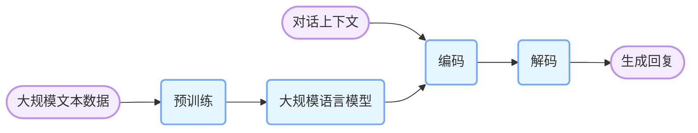

# 大规模语言模型在自动对话生成中的应用研究

> 关键词：大规模语言模型、自动对话生成、自然语言处理、Transformer架构、对话系统

> 摘要：本文围绕大规模语言模型在自动对话生成中的应用展开深入研究。首先介绍了研究的背景、目的、预期读者等内容，阐述了相关核心概念及其联系。接着详细讲解了核心算法原理、数学模型和公式，并通过Python代码进行具体说明。在项目实战部分，给出了开发环境搭建、源代码实现与解读。分析了大规模语言模型在自动对话生成中的实际应用场景，推荐了学习资源、开发工具框架以及相关论文著作。最后总结了未来发展趋势与挑战，解答了常见问题，并提供了扩展阅读和参考资料，旨在为相关领域的研究者和开发者提供全面且深入的技术指导。

## 1. 背景介绍 
### 1.1 目的和范围
随着人工智能技术的飞速发展，自动对话生成系统在客户服务、智能助手、聊天机器人等领域的应用越来越广泛。大规模语言模型凭借其强大的语言理解和生成能力，为自动对话生成带来了质的飞跃。本研究的目的在于深入探讨大规模语言模型在自动对话生成中的应用，分析其核心原理、算法实现、实际应用场景以及未来发展趋势，为相关领域的研究和开发提供理论支持和实践指导。

研究范围涵盖了大规模语言模型的基本概念、核心算法，如Transformer架构、预训练和微调技术等；自动对话生成的任务类型，包括闲聊对话、任务导向对话等；以及大规模语言模型在不同领域的具体应用案例和面临的挑战。

### 1.2 预期读者
本文预期读者包括自然语言处理领域的研究者、人工智能开发者、对自动对话生成技术感兴趣的技术爱好者以及相关企业的技术决策者。对于研究者，本文可以提供最新的研究思路和方法；对于开发者，能够帮助他们了解大规模语言模型在自动对话生成中的具体实现和应用；对于技术爱好者，可以作为入门学习的参考资料；对于技术决策者，有助于他们评估大规模语言模型在企业中的应用价值和发展前景。

### 1.3 文档结构概述
本文共分为十个部分。第一部分为背景介绍，阐述了研究的目的、范围、预期读者和文档结构概述，并给出了相关术语的定义和解释。第二部分介绍核心概念与联系，包括大规模语言模型和自动对话生成的原理和架构，并通过文本示意图和Mermaid流程图进行展示。第三部分详细讲解核心算法原理和具体操作步骤，使用Python源代码进行说明。第四部分介绍数学模型和公式，并通过举例进行详细讲解。第五部分是项目实战，包括开发环境搭建、源代码详细实现和代码解读。第六部分分析实际应用场景。第七部分推荐学习资源、开发工具框架和相关论文著作。第八部分总结未来发展趋势与挑战。第九部分为附录，解答常见问题。第十部分提供扩展阅读和参考资料。

### 1.4 术语表
#### 1.4.1 核心术语定义
- **大规模语言模型（Large Language Model, LLM）**：是一种基于深度学习的自然语言处理模型，通常具有数十亿甚至数万亿的参数，通过在大规模文本数据上进行无监督学习，能够学习到丰富的语言知识和模式。
- **自动对话生成（Automatic Dialogue Generation）**：指的是计算机系统根据输入的对话上下文，自动生成合理、连贯的回复的技术。
- **Transformer架构**：是一种基于注意力机制的深度学习架构，广泛应用于大规模语言模型中，能够有效处理序列数据，捕捉长距离依赖关系。
- **预训练（Pretraining）**：大规模语言模型在大规模无标注文本数据上进行的无监督学习过程，目的是学习通用的语言知识和特征。
- **微调（Fine-tuning）**：在预训练模型的基础上，使用特定任务的标注数据对模型进行进一步训练，以适应具体的任务需求。

#### 1.4.2 相关概念解释
- **自然语言处理（Natural Language Processing, NLP）**：是人工智能的一个重要分支，研究如何让计算机理解、处理和生成人类语言。
- **注意力机制（Attention Mechanism）**：是一种能够自动关注输入序列中重要部分的机制，在Transformer架构中起到关键作用，能够提高模型的性能和效率。
- **上下文（Context）**：在对话生成中，上下文指的是对话历史信息，包括之前的对话内容、用户的意图等，模型需要根据上下文生成合适的回复。

#### 1.4.3 缩略词列表
- **LLM**：Large Language Model
- **NLP**：Natural Language Processing
- **RNN**：Recurrent Neural Network
- **LSTM**：Long Short-Term Memory
- **GRU**：Gated Recurrent Unit
- **BERT**：Bidirectional Encoder Representations from Transformers
- **GPT**：Generative Pretrained Transformer

## 2. 核心概念与联系 

### 大规模语言模型原理
大规模语言模型通常基于深度学习架构，如Transformer，通过在大规模文本数据上进行预训练来学习语言的统计规律和语义信息。预训练的目标通常是预测下一个词或掩码词，通过不断优化模型参数，使模型能够生成高质量的文本。

### 自动对话生成原理
自动对话生成的目标是根据输入的对话上下文生成合适的回复。一般来说，对话生成模型会将对话历史信息编码为向量表示，然后根据这个向量表示生成回复。在生成过程中，模型需要考虑对话的连贯性、逻辑性和合理性。

### 核心概念架构示意图


### 核心概念联系说明
大规模语言模型为自动对话生成提供了强大的语言理解和生成能力。在自动对话生成中，首先将对话上下文输入到经过预训练的大规模语言模型中进行编码，得到上下文的向量表示。然后，模型根据这个向量表示进行解码，生成合适的回复。大规模语言模型的预训练过程使得模型能够学习到通用的语言知识和模式，从而在对话生成任务中能够生成更加自然、合理的回复。

## 3. 核心算法原理 & 具体操作步骤 

### Transformer架构原理
Transformer架构是大规模语言模型的核心，它由编码器和解码器组成。编码器负责将输入序列编码为向量表示，解码器则根据编码器的输出和之前生成的词来生成下一个词。

Transformer架构的关键在于注意力机制，它能够让模型在处理每个位置的输入时，自动关注输入序列中其他位置的信息。具体来说，注意力机制通过计算查询（Query）、键（Key）和值（Value）之间的相似度来确定每个位置的权重，然后根据这些权重对值进行加权求和，得到当前位置的输出。

### 多头注意力机制
多头注意力机制是Transformer架构中的一个重要组件，它通过多个不同的注意力头并行计算，能够捕捉输入序列中不同方面的信息。多头注意力机制的计算公式如下：

$$
\text{MultiHead}(Q, K, V) = \text{Concat}(\text{head}_1, \ldots, \text{head}_h)W^O
$$

其中，$\text{head}_i = \text{Attention}(QW_i^Q, KW_i^K, VW_i^V)$，$W_i^Q$、$W_i^K$、$W_i^V$ 和 $W^O$ 是可学习的参数。

### Python代码实现
```python
import torch
import torch.nn as nn
import torch.nn.functional as F

class MultiHeadAttention(nn.Module):
    def __init__(self, embed_size, num_heads):
        super(MultiHeadAttention, self).__init__()
        self.embed_size = embed_size
        self.num_heads = num_heads
        self.head_dim = embed_size // num_heads

        assert (
            self.head_dim * num_heads == embed_size
        ), "Embedding size needs to be divisible by number of heads"

        self.qkv_proj = nn.Linear(embed_size, 3 * embed_size)
        self.out_proj = nn.Linear(embed_size, embed_size)

    def forward(self, x):
        batch_size, seq_length, embed_size = x.size()
        qkv = self.qkv_proj(x)
        q, k, v = qkv.chunk(3, dim=-1)
        q = q.view(batch_size, seq_length, self.num_heads, self.head_dim).transpose(1, 2)
        k = k.view(batch_size, seq_length, self.num_heads, self.head_dim).transpose(1, 2)
        v = v.view(batch_size, seq_length, self.num_heads, self.head_dim).transpose(1, 2)

        attn_scores = torch.matmul(q, k.transpose(-2, -1)) / (self.head_dim ** 0.5)
        attn_probs = F.softmax(attn_scores, dim=-1)
        out = torch.matmul(attn_probs, v)
        out = out.transpose(1, 2).contiguous().view(batch_size, seq_length, embed_size)
        out = self.out_proj(out)
        return out
```

### 具体操作步骤
1. **数据预处理**：将输入的文本数据进行分词、编码等处理，转换为模型可以接受的输入格式。
2. **预训练**：使用大规模文本数据对Transformer模型进行预训练，优化模型参数，使其学习到通用的语言知识和模式。
3. **微调**：在预训练模型的基础上，使用特定任务的标注数据对模型进行微调，使其适应具体的对话生成任务。
4. **对话生成**：将对话上下文输入到微调后的模型中，模型根据上下文生成合适的回复。

## 4. 数学模型和公式 & 详细讲解 & 举例说明 

### 自注意力机制公式
自注意力机制是Transformer架构中的核心组件，它的计算公式如下：

$$
\text{Attention}(Q, K, V) = \text{softmax}\left(\frac{QK^T}{\sqrt{d_k}}\right)V
$$

其中，$Q$ 是查询矩阵，$K$ 是键矩阵，$V$ 是值矩阵，$d_k$ 是键的维度。

### 详细讲解
- **计算相似度**：首先计算查询矩阵 $Q$ 和键矩阵 $K$ 的转置的乘积 $QK^T$，得到一个相似度矩阵。这个矩阵中的每个元素表示查询向量和键向量之间的相似度。
- **缩放**：为了避免相似度矩阵中的值过大，导致softmax函数的梯度消失，需要将相似度矩阵除以 $\sqrt{d_k}$。
- **应用softmax函数**：对缩放后的相似度矩阵应用softmax函数，得到注意力权重矩阵。注意力权重矩阵中的每个元素表示每个位置的重要性。
- **加权求和**：将注意力权重矩阵和值矩阵 $V$ 相乘，得到自注意力机制的输出。

### 举例说明
假设我们有一个输入序列 $x = [x_1, x_2, x_3]$，每个元素的维度为 $d$。我们将输入序列分别投影到查询、键和值空间，得到 $Q = [q_1, q_2, q_3]$，$K = [k_1, k_2, k_3]$ 和 $V = [v_1, v_2, v_3]$。

首先计算相似度矩阵：

$$
QK^T = \begin{bmatrix}
q_1^Tk_1 & q_1^Tk_2 & q_1^Tk_3 \\
q_2^Tk_1 & q_2^Tk_2 & q_2^Tk_3 \\
q_3^Tk_1 & q_3^Tk_2 & q_3^Tk_3
\end{bmatrix}
$$

然后进行缩放：

$$
\frac{QK^T}{\sqrt{d_k}}
$$

接着应用softmax函数得到注意力权重矩阵：

$$
\text{softmax}\left(\frac{QK^T}{\sqrt{d_k}}\right)
$$

最后进行加权求和得到自注意力机制的输出：

$$
\text{Attention}(Q, K, V) = \text{softmax}\left(\frac{QK^T}{\sqrt{d_k}}\right)V
$$

### 交叉熵损失函数
在对话生成任务中，通常使用交叉熵损失函数来训练模型。交叉熵损失函数的计算公式如下：

$$
L = -\sum_{i=1}^{N} y_i \log(p_i)
$$

其中，$N$ 是词汇表的大小，$y_i$ 是真实标签的概率分布，$p_i$ 是模型预测的概率分布。

### 详细讲解
交叉熵损失函数衡量的是真实标签和模型预测之间的差异。当模型预测的概率分布与真实标签的概率分布越接近时，交叉熵损失函数的值越小。在训练过程中，我们的目标是最小化交叉熵损失函数，从而使模型的预测结果更加准确。

### 举例说明
假设我们有一个词汇表大小为 $N = 5$ 的对话生成任务，真实标签的概率分布为 $y = [0, 0, 1, 0, 0]$，模型预测的概率分布为 $p = [0.1, 0.2, 0.3, 0.2, 0.2]$。则交叉熵损失函数的值为：

$$
L = -(0 \log(0.1) + 0 \log(0.2) + 1 \log(0.3) + 0 \log(0.2) + 0 \log(0.2)) \approx 1.204
$$

## 5. 项目实战：代码实际案例和详细解释说明 

### 5.1  开发环境搭建
#### 操作系统
建议使用Linux系统，如Ubuntu 18.04或更高版本。

#### 编程语言
使用Python 3.7或更高版本。

#### 深度学习框架
使用PyTorch深度学习框架，可以通过以下命令安装：
```bash
pip install torch torchvision
```

#### 其他依赖库
安装其他必要的依赖库，如`transformers`、`numpy`、`pandas`等：
```bash
pip install transformers numpy pandas
```

### 5.2  源代码详细实现和代码解读
```python
import torch
from transformers import GPT2LMHeadModel, GPT2Tokenizer

# 加载预训练模型和分词器
tokenizer = GPT2Tokenizer.from_pretrained('gpt2')
model = GPT2LMHeadModel.from_pretrained('gpt2')

# 输入对话上下文
input_text = "你好，今天过得怎么样？"
input_ids = tokenizer.encode(input_text, return_tensors='pt')

# 生成回复
output = model.generate(input_ids, max_length=50, num_beams=5, no_repeat_ngram_size=2, early_stopping=True)
generated_text = tokenizer.decode(output[0], skip_special_tokens=True)

# 输出回复
print("回复:", generated_text)
```

### 代码解读
1. **加载预训练模型和分词器**：使用`transformers`库加载预训练的GPT-2模型和对应的分词器。
2. **输入对话上下文**：将对话上下文文本使用分词器进行编码，转换为模型可以接受的输入格式。
3. **生成回复**：使用`generate`方法生成回复。`max_length`参数指定生成文本的最大长度，`num_beams`参数指定束搜索的束宽，`no_repeat_ngram_size`参数用于避免生成重复的n-gram，`early_stopping`参数用于在生成结束时提前停止。
4. **输出回复**：将生成的回复使用分词器进行解码，转换为文本格式并输出。

### 5.3  代码解读与分析
上述代码使用了预训练的GPT-2模型进行对话生成。GPT-2是一种基于Transformer架构的大规模语言模型，通过在大规模文本数据上进行预训练，能够生成高质量的文本。

在代码中，我们使用了束搜索（Beam Search）算法来生成回复。束搜索是一种启发式搜索算法，它在每一步选择得分最高的k个候选词，然后继续扩展这些候选词，直到生成结束。通过使用束搜索，我们可以在一定程度上提高生成回复的质量。

同时，我们还使用了`no_repeat_ngram_size`参数来避免生成重复的n-gram，从而使生成的回复更加多样化和自然。

## 6. 实际应用场景 
### 客户服务
在客户服务领域，大规模语言模型可以用于构建智能客服系统。智能客服系统可以自动回答客户的常见问题，处理客户的咨询和投诉，提高客户服务的效率和质量。例如，当客户询问产品的使用方法、售后服务等问题时，智能客服系统可以根据客户的问题生成准确、详细的回复。

### 智能助手
智能助手如Siri、小爱同学等，都可以使用大规模语言模型来提高对话生成的能力。智能助手可以理解用户的语音指令，提供各种信息和服务，如查询天气、播放音乐、设置提醒等。通过使用大规模语言模型，智能助手可以更好地理解用户的意图，生成更加自然、流畅的回复。

### 聊天机器人
聊天机器人可以用于社交娱乐、教育等领域。在社交娱乐方面，聊天机器人可以与用户进行闲聊，提供娱乐内容和互动体验。在教育领域，聊天机器人可以作为学习伙伴，帮助学生解答问题、提供学习资料和指导。大规模语言模型可以使聊天机器人的对话更加智能、有趣和富有个性。

### 智能写作
大规模语言模型可以用于智能写作，如文章生成、故事创作等。在新闻媒体领域，智能写作系统可以根据新闻事件的相关信息自动生成新闻报道。在文学创作领域，作家可以使用智能写作工具来获取灵感、生成创意内容。

## 7. 工具和资源推荐
### 7.1 学习资源推荐
#### 7.1.1 书籍推荐
- 《深度学习》（Deep Learning）：由Ian Goodfellow、Yoshua Bengio和Aaron Courville所著，是深度学习领域的经典教材，涵盖了深度学习的基本概念、算法和应用。
- 《自然语言处理入门》（Natural Language Processing with Python）：由Steven Bird、Ewan Klein和Edward Loper所著，介绍了使用Python进行自然语言处理的基本方法和技术。
- 《Transformer架构实战》（Transformers for Natural Language Processing）：由Denis Rothman所著，详细介绍了Transformer架构的原理和应用，以及如何使用Transformer进行自然语言处理任务。

#### 7.1.2 在线课程
- Coursera上的“Natural Language Processing Specialization”：由DeepLearning.AI提供，是一门全面介绍自然语言处理的在线课程，包括词嵌入、循环神经网络、Transformer等内容。
- edX上的“Introduction to Artificial Intelligence”：由UC Berkeley提供，介绍了人工智能的基本概念、算法和应用，包括自然语言处理和对话系统。
- 吴恩达的“Deep Learning Specialization”：在Coursera上提供，涵盖了深度学习的各个方面，包括神经网络、卷积神经网络、循环神经网络等，对于理解大规模语言模型的原理和实现有很大帮助。

#### 7.1.3 技术博客和网站
- Hugging Face Blog：提供了关于自然语言处理和大规模语言模型的最新研究成果和技术应用，是了解Transformer架构和相关模型的重要资源。
- Towards Data Science：是一个数据科学和人工智能领域的博客平台，上面有很多关于自然语言处理和对话系统的技术文章和案例分析。
- arXiv.org：是一个预印本数据库，上面可以找到关于大规模语言模型和自动对话生成的最新研究论文。

### 7.2 开发工具框架推荐
#### 7.2.1 IDE和编辑器
- PyCharm：是一款专门为Python开发设计的集成开发环境，提供了代码编辑、调试、版本控制等功能，非常适合大规模语言模型的开发。
- Jupyter Notebook：是一个交互式的开发环境，可以将代码、文本、图像等内容整合在一起，方便进行数据探索、模型训练和结果展示。
- Visual Studio Code：是一款轻量级的代码编辑器，支持多种编程语言和插件，具有丰富的扩展功能，适合快速开发和调试。

#### 7.2.2 调试和性能分析工具
- TensorBoard：是TensorFlow提供的一个可视化工具，可以用于监控模型的训练过程、可视化模型的结构和性能指标。
- PyTorch Profiler：是PyTorch提供的一个性能分析工具，可以帮助开发者找出代码中的性能瓶颈，优化模型的训练和推理速度。
- NVIDIA Nsight Systems：是NVIDIA提供的一个性能分析工具，专门用于分析GPU加速的深度学习应用程序的性能。

#### 7.2.3 相关框架和库
- Transformers：是Hugging Face开发的一个开源库，提供了多种预训练的语言模型，如GPT-2、BERT、XLNet等，以及相应的工具和接口，方便开发者进行自然语言处理任务。
- AllenNLP：是一个深度学习框架，专门用于自然语言处理任务，提供了丰富的数据集、模型和工具，方便开发者进行实验和研究。
- SpaCy：是一个用于自然语言处理的Python库，提供了高效的分词、词性标注、命名实体识别等功能，适用于大规模文本数据的处理。

### 7.3 相关论文著作推荐
#### 7.3.1 经典论文
- “Attention Is All You Need”：由Vaswani等人发表于2017年，提出了Transformer架构，是大规模语言模型发展的重要里程碑。
- “BERT: Pre-training of Deep Bidirectional Transformers for Language Understanding”：由Devlin等人发表于2018年，介绍了BERT模型的预训练方法和应用，在自然语言处理领域取得了显著的成果。
- “Generative Pretrained Transformer 2 (GPT-2): Language Models are Unsupervised Multitask Learners”：由OpenAI发表于2019年，介绍了GPT-2模型的架构和性能，展示了大规模语言模型在无监督学习和多任务学习方面的强大能力。

#### 7.3.2 最新研究成果
- “Training language models to follow instructions with human feedback”：由OpenAI发表，介绍了通过人类反馈进行指令学习的方法，提高了语言模型的可控性和实用性。
- “LaMDA: Language Models for Dialog Applications”：由Google发表，介绍了LaMDA模型在对话应用中的表现和优势。
- “PaLM: Scaling Language Modeling with Pathways”：由Google发表，介绍了PaLM模型的架构和训练方法，展示了大规模语言模型在扩展性方面的最新进展。

#### 7.3.3 应用案例分析
- “Dialogue Systems: Principles and Practice”：介绍了对话系统的基本原理和应用案例，包括任务导向对话系统和闲聊对话系统。
- “Conversational AI: Designing Engaging User Experiences”：探讨了对话式人工智能的设计原则和方法，以及如何构建用户体验良好的对话系统。
- “Real-World Conversational AI: From Chatbots to Cognitive Assistants”：分析了对话式人工智能在实际应用中的挑战和解决方案，提供了一些实际案例和经验分享。

## 8. 总结：未来发展趋势与挑战
### 未来发展趋势
#### 模型规模不断扩大
随着计算资源的不断增加和算法的不断优化，大规模语言模型的规模将继续扩大。更大的模型通常能够学习到更丰富的语言知识和模式，从而在自动对话生成等任务中取得更好的性能。

#### 多模态融合
未来的自动对话生成系统将不仅仅局限于文本输入和输出，还将融合图像、语音、视频等多种模态的信息。例如，用户可以通过语音与对话系统进行交互，系统可以同时展示图像和文本信息，提供更加丰富和自然的对话体验。

#### 个性化和情感化
为了提高用户的满意度和忠诚度，自动对话生成系统将更加注重个性化和情感化。系统可以根据用户的偏好、历史对话记录等信息，生成个性化的回复，并能够识别和回应用户的情感状态，提供更加贴心的服务。

#### 跨领域应用
大规模语言模型在自动对话生成中的应用将不仅仅局限于传统的客户服务、智能助手等领域，还将拓展到医疗、金融、教育等更多领域。例如，在医疗领域，对话系统可以帮助医生进行病历分析、诊断建议等；在金融领域，对话系统可以为客户提供投资建议、风险评估等服务。

### 挑战
#### 数据隐私和安全
大规模语言模型需要大量的文本数据进行训练，这些数据可能包含用户的隐私信息。因此，如何保护数据的隐私和安全是一个重要的挑战。此外，模型的输出也可能包含敏感信息，需要进行有效的过滤和审查。

#### 计算资源和能源消耗
训练大规模语言模型需要大量的计算资源和能源消耗，这不仅增加了成本，还对环境造成了一定的影响。如何优化模型的训练算法和架构，降低计算资源和能源消耗，是一个亟待解决的问题。

#### 模型可解释性
大规模语言模型通常是黑盒模型，其决策过程和输出结果难以解释。在一些对可解释性要求较高的领域，如医疗、金融等，模型的可解释性是一个重要的问题。如何提高模型的可解释性，让用户能够理解模型的决策过程和输出结果，是未来研究的一个重要方向。

#### 语言多样性和文化差异
不同的语言和文化具有不同的表达方式和语义理解，大规模语言模型在处理多语言和跨文化对话时可能会遇到困难。如何让模型能够更好地理解和处理不同语言和文化的对话，是一个具有挑战性的问题。

## 9. 附录：常见问题与解答
### 大规模语言模型在自动对话生成中的准确率如何评估？
可以使用多种指标来评估大规模语言模型在自动对话生成中的准确率，如BLEU（Bilingual Evaluation Understudy）、ROUGE（Recall-Oriented Understudy for Gisting Evaluation）等。这些指标通过比较生成的回复与参考回复之间的相似度来评估模型的性能。此外，还可以通过人工评估的方式，让人类评估者对生成的回复进行打分，以评估模型的准确率和质量。

### 如何提高大规模语言模型在自动对话生成中的性能？
可以从以下几个方面提高大规模语言模型在自动对话生成中的性能：
- **数据增强**：使用更多的训练数据，或者对现有数据进行增强处理，如数据扩充、数据清洗等，以提高模型的泛化能力。
- **模型微调**：在预训练模型的基础上，使用特定任务的标注数据对模型进行微调，使模型能够更好地适应具体的对话生成任务。
- **优化算法**：使用更先进的优化算法，如AdamW、Adagrad等，来训练模型，提高模型的收敛速度和性能。
- **多模型融合**：将多个不同的模型进行融合，如将基于规则的模型和基于深度学习的模型相结合，以提高模型的性能和稳定性。

### 大规模语言模型在处理长对话时存在哪些问题？
大规模语言模型在处理长对话时可能会存在以下问题：
- **上下文理解困难**：长对话包含更多的信息和上下文，模型可能难以准确理解和处理这些信息，导致生成的回复与上下文不连贯。
- **计算资源消耗大**：处理长对话需要更多的计算资源和时间，可能会导致模型的推理速度变慢。
- **信息过载**：长对话中的信息可能会导致模型出现信息过载的问题，影响模型的性能和准确率。

为了解决这些问题，可以采用以下方法：
- **上下文压缩**：对长对话的上下文进行压缩，提取关键信息，减少模型的输入长度。
- **分层处理**：将长对话分成多个段落或子对话，分别进行处理，然后再将处理结果进行合并。
- **增加模型容量**：使用更大的模型或增加模型的层数，以提高模型的处理能力。

### 大规模语言模型在自动对话生成中的应用是否会取代人类客服？
大规模语言模型在自动对话生成中的应用可以提高客户服务的效率和质量，但不会完全取代人类客服。虽然大规模语言模型可以自动回答客户的常见问题，但在处理复杂问题、处理客户的情感和个性化需求等方面，人类客服仍然具有不可替代的优势。因此，未来的客户服务将是人类客服和智能客服相结合的模式，智能客服可以处理大部分常见问题，人类客服则可以处理复杂问题和提供个性化服务。

## 10. 扩展阅读 & 参考资料
### 扩展阅读
- 《自然语言处理实战：基于Transformer的原理和应用》：详细介绍了Transformer架构在自然语言处理中的应用，包括文本分类、命名实体识别、机器翻译等任务。
- 《深度学习实战：基于Python和TensorFlow》：通过实际案例介绍了深度学习的基本概念和算法，以及如何使用TensorFlow进行模型训练和开发。
- 《人工智能：现代方法》（Artificial Intelligence: A Modern Approach）：是人工智能领域的经典教材，涵盖了人工智能的各个方面，包括自然语言处理、机器学习、知识表示等。

### 参考资料
- Vaswani, A., Shazeer, N., Parmar, N., Uszkoreit, J., Jones, L., Gomez, A. N.,... & Polosukhin, I. (2017). Attention is all you need. In Advances in neural information processing systems (pp. 5998-6008).
- Devlin, J., Chang, M. W., Lee, K., & Toutanova, K. (2018). BERT: Pre-training of deep bidirectional transformers for language understanding. arXiv preprint arXiv:1810.04805.
- Radford, A., Wu, J., Child, R., Luan, D., Amodei, D., & Sutskever, I. (2019). Language models are unsupervised multitask learners. OpenAI Blog, 1(8), 9.
- Hugging Face官方文档：https://huggingface.co/docs
- PyTorch官方文档：https://pytorch.org/docs/stable/index.html

作者：AI天才研究院/AI Genius Institute & 禅与计算机程序设计艺术 /Zen And The Art of Computer Programming