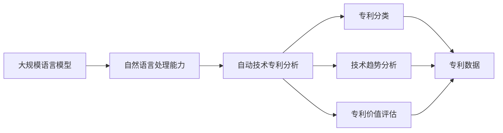

# 大规模语言模型在自动技术专利分析中的应用研究

> 关键词：大规模语言模型、自动技术专利分析、自然语言处理、知识图谱、机器学习

> 摘要：本文聚焦于大规模语言模型在自动技术专利分析中的应用。随着专利数量的急剧增长，传统的专利分析方法面临效率和准确性的挑战。大规模语言模型凭借其强大的自然语言处理能力，为自动技术专利分析带来了新的机遇。文章深入探讨了大规模语言模型的核心概念、相关算法原理，结合数学模型进行理论阐述，并通过项目实战展示其在专利分析中的具体应用。同时，分析了其实际应用场景，推荐了相关工具和资源，最后对未来发展趋势与挑战进行了总结，旨在为该领域的研究和实践提供全面且深入的参考。

## 1. 背景介绍 
### 1.1 目的和范围
随着科技的飞速发展，专利作为科技创新的重要产出，数量呈现出爆炸式增长。据世界知识产权组织（WIPO）统计，全球每年新增专利申请数量数以百万计。面对如此庞大的专利数据，传统的专利分析方法，如人工检索、分类和评估，不仅效率低下，而且容易出现人为误差，难以满足现代科技发展对快速、准确专利分析的需求。

本文的目的在于研究大规模语言模型在自动技术专利分析中的应用，旨在利用大规模语言模型的强大自然语言处理能力，实现专利数据的自动化分析，提高分析效率和准确性。具体范围包括大规模语言模型的核心概念、相关算法原理、数学模型，以及在专利分类、技术趋势分析、专利价值评估等方面的实际应用。

### 1.2 预期读者
本文预期读者包括从事专利分析、自然语言处理、人工智能等领域的研究人员、工程师和学者，以及对专利技术和人工智能应用感兴趣的相关从业者。对于希望了解大规模语言模型在专利分析中应用的专业人士，本文将提供系统的理论知识和实践案例；对于初学者，本文也将从基础概念入手，逐步引导读者深入理解相关技术和应用。

### 1.3 文档结构概述
本文将按照以下结构展开：
1. **背景介绍**：阐述研究的目的和范围、预期读者以及文档结构概述，并对相关术语进行解释。
2. **核心概念与联系**：介绍大规模语言模型和自动技术专利分析的核心概念，以及它们之间的联系，通过文本示意图和 Mermaid 流程图进行直观展示。
3. **核心算法原理 & 具体操作步骤**：详细讲解大规模语言模型的核心算法原理，并结合 Python 源代码进行具体操作步骤的阐述。
4. **数学模型和公式 & 详细讲解 & 举例说明**：介绍大规模语言模型相关的数学模型和公式，并通过具体例子进行详细讲解。
5. **项目实战：代码实际案例和详细解释说明**：通过实际项目案例，展示大规模语言模型在自动技术专利分析中的具体应用，包括开发环境搭建、源代码实现和代码解读。
6. **实际应用场景**：分析大规模语言模型在自动技术专利分析中的实际应用场景，如专利分类、技术趋势分析、专利价值评估等。
7. **工具和资源推荐**：推荐相关的学习资源、开发工具框架和论文著作，为读者进一步深入学习和研究提供参考。
8. **总结：未来发展趋势与挑战**：总结大规模语言模型在自动技术专利分析中的应用现状，分析未来发展趋势和面临的挑战。
9. **附录：常见问题与解答**：对读者可能遇到的常见问题进行解答。
10. **扩展阅读 & 参考资料**：提供相关的扩展阅读材料和参考资料，方便读者进一步深入研究。

### 1.4 术语表
#### 1.4.1 核心术语定义
- **大规模语言模型**：基于深度学习技术，通过在大规模文本数据上进行训练，学习语言的统计规律和语义信息，能够生成自然语言文本、进行文本分类、问答等多种自然语言处理任务的模型。例如，GPT - 3、BERT 等都是大规模语言模型的典型代表。
- **自动技术专利分析**：利用计算机技术和人工智能算法，对专利数据进行自动化的处理和分析，包括专利分类、技术趋势分析、专利价值评估等任务，以辅助专利决策和技术创新。
- **自然语言处理（NLP）**：计算机科学与人工智能领域的一个重要分支，旨在让计算机理解、处理和生成人类语言。它涵盖了多个任务，如文本分类、命名实体识别、机器翻译等。

#### 1.4.2 相关概念解释
- **知识图谱**：一种以图的形式表示知识的方法，将实体（如专利、技术术语、发明人等）作为节点，将实体之间的关系（如引用关系、合作关系等）作为边。知识图谱可以帮助整合和理解专利数据中的复杂信息，为专利分析提供更全面的视角。
- **机器学习**：一门多领域交叉学科，涉及概率论、统计学、逼近论、凸分析、算法复杂度理论等多门学科。它专门研究计算机怎样模拟或实现人类的学习行为，以获取新的知识或技能，重新组织已有的知识结构使之不断改善自身的性能。在自动技术专利分析中，机器学习算法可用于专利分类、专利价值评估等任务。

#### 1.4.3 缩略词列表
- **NLP**：Natural Language Processing（自然语言处理）
- **GPT**：Generative Pretrained Transformer（生成式预训练变换器）
- **BERT**：Bidirectional Encoder Representations from Transformers（基于变换器的双向编码器表示）

## 2. 核心概念与联系 

### 大规模语言模型核心概念
大规模语言模型是近年来自然语言处理领域的重要突破。它基于深度学习架构，通常采用Transformer架构，通过在大规模文本语料上进行无监督预训练，学习语言的通用特征和语义信息。这些模型具有强大的语言理解和生成能力，可以处理各种自然语言处理任务，如文本分类、情感分析、机器翻译等。

以GPT - 3为例，它是一个具有1750亿参数的大规模语言模型，能够根据输入的文本生成连贯、有逻辑的回复。其训练过程主要分为两个阶段：预训练和微调。在预训练阶段，模型在大规模的文本数据上进行无监督学习，学习语言的统计规律和语义信息；在微调阶段，模型在特定任务的数据集上进行有监督学习，对预训练的模型进行微调，以适应具体的任务需求。

### 自动技术专利分析核心概念
自动技术专利分析是利用计算机技术和人工智能算法，对专利数据进行自动化的处理和分析。专利数据包含了丰富的技术信息和创新成果，通过对专利数据的分析，可以了解技术发展趋势、评估专利价值、发现技术创新点等。

自动技术专利分析的主要任务包括专利分类、技术趋势分析、专利价值评估等。专利分类是将专利文档按照技术领域、主题等进行分类，以便于管理和检索；技术趋势分析是通过对专利数据的时间序列分析，了解技术的发展趋势和热点；专利价值评估是对专利的技术价值、经济价值等进行评估，为专利决策提供参考。

### 核心概念联系
大规模语言模型与自动技术专利分析之间存在着密切的联系。大规模语言模型的强大自然语言处理能力可以为自动技术专利分析提供有力的支持。例如，在专利分类任务中，大规模语言模型可以对专利文本进行语义理解和特征提取，提高分类的准确性；在技术趋势分析中，大规模语言模型可以对专利文本进行主题建模和情感分析，挖掘技术发展的趋势和热点；在专利价值评估中，大规模语言模型可以对专利文本进行知识提取和推理，评估专利的技术价值和经济价值。

### 文本示意图
```plaintext
大规模语言模型
  |
  | 自然语言处理能力
  v
自动技术专利分析
  |
  | 专利分类、技术趋势分析、专利价值评估等任务
  v
专利数据
```

### Mermaid 流程图


## 3. 核心算法原理 & 具体操作步骤 

### 核心算法原理 - Transformer 架构
Transformer 架构是大规模语言模型的核心基础，它主要由编码器和解码器组成。编码器负责对输入的文本进行特征提取和表示学习，解码器负责根据编码器的输出生成目标文本。

Transformer 架构的关键创新在于引入了注意力机制（Attention Mechanism）。注意力机制可以让模型在处理输入序列时，动态地关注序列中的不同部分，从而更好地捕捉序列中的长距离依赖关系。

注意力机制的计算公式如下：
$$Attention(Q, K, V) = softmax(\frac{QK^T}{\sqrt{d_k}})V$$
其中，$Q$ 是查询矩阵，$K$ 是键矩阵，$V$ 是值矩阵，$d_k$ 是键向量的维度。

### Python 代码实现注意力机制
```python
import torch
import torch.nn as nn
import torch.nn.functional as F

class Attention(nn.Module):
    def __init__(self, d_k):
        super(Attention, self).__init__()
        self.d_k = d_k

    def forward(self, Q, K, V):
        scores = torch.matmul(Q, K.transpose(-2, -1)) / torch.sqrt(torch.tensor(self.d_k, dtype=torch.float32))
        attention_weights = F.softmax(scores, dim=-1)
        output = torch.matmul(attention_weights, V)
        return output, attention_weights
```

### 具体操作步骤 - 基于大规模语言模型的专利分类
1. **数据预处理**：收集专利文本数据，并进行清洗、分词、去除停用词等预处理操作。
```python
import re
import nltk
from nltk.corpus import stopwords
from nltk.tokenize import word_tokenize

nltk.download('stopwords')
nltk.download('punkt')

def preprocess_text(text):
    text = re.sub(r'[^\w\s]', '', text)  # 去除标点符号
    text = text.lower()  # 转换为小写
    tokens = word_tokenize(text)  # 分词
    stop_words = set(stopwords.words('english'))
    filtered_tokens = [token for token in tokens if token not in stop_words]  # 去除停用词
    return ' '.join(filtered_tokens)
```
2. **特征提取**：使用大规模语言模型对预处理后的专利文本进行特征提取。
```python
from transformers import AutoTokenizer, AutoModel

tokenizer = AutoTokenizer.from_pretrained('bert-base-uncased')
model = AutoModel.from_pretrained('bert-base-uncased')

def extract_features(text):
    inputs = tokenizer(text, return_tensors='pt')
    outputs = model(**inputs)
    features = outputs.last_hidden_state.mean(dim=1).squeeze()
    return features.detach().numpy()
```
3. **模型训练**：使用提取的特征和对应的专利类别标签，训练分类模型。
```python
from sklearn.model_selection import train_test_split
from sklearn.svm import SVC
import numpy as np

# 假设 X 是特征矩阵，y 是标签向量
X = np.array([extract_features(text) for text in patent_texts])
y = np.array(patent_labels)

X_train, X_test, y_train, y_test = train_test_split(X, y, test_size=0.2, random_state=42)

clf = SVC()
clf.fit(X_train, y_train)
```
4. **模型评估**：使用测试集对训练好的分类模型进行评估。
```python
from sklearn.metrics import accuracy_score

y_pred = clf.predict(X_test)
accuracy = accuracy_score(y_test, y_pred)
print(f"Accuracy: {accuracy}")
```

## 4. 数学模型和公式 & 详细讲解 & 举例说明 

### 交叉熵损失函数
在大规模语言模型的训练过程中，交叉熵损失函数是常用的损失函数之一。交叉熵损失函数用于衡量模型预测的概率分布与真实标签的概率分布之间的差异。

交叉熵损失函数的公式如下：
$$H(p, q) = -\sum_{i=1}^{n} p_i \log(q_i)$$
其中，$p$ 是真实标签的概率分布，$q$ 是模型预测的概率分布，$n$ 是类别数。

### 详细讲解
交叉熵损失函数的核心思想是，当模型预测的概率分布与真实标签的概率分布越接近时，损失值越小；反之，损失值越大。在训练过程中，模型的目标是最小化交叉熵损失函数，从而使模型的预测结果更接近真实标签。

### 举例说明
假设我们有一个二分类问题，真实标签的概率分布为 $p = [0, 1]$，模型预测的概率分布为 $q = [0.2, 0.8]$。则交叉熵损失为：
$$H(p, q) = -(0 \times \log(0.2) + 1 \times \log(0.8)) \approx 0.223$$

如果模型预测的概率分布为 $q = [0.1, 0.9]$，则交叉熵损失为：
$$H(p, q) = -(0 \times \log(0.1) + 1 \times \log(0.9)) \approx 0.105$$

可以看到，当模型预测的概率分布更接近真实标签的概率分布时，交叉熵损失更小。

### 梯度下降算法
梯度下降算法是大规模语言模型训练中常用的优化算法。梯度下降算法的目标是通过迭代更新模型的参数，使得损失函数的值不断减小。

梯度下降算法的更新公式如下：
$$\theta_{t+1} = \theta_t - \alpha \nabla L(\theta_t)$$
其中，$\theta$ 是模型的参数，$\alpha$ 是学习率，$\nabla L(\theta_t)$ 是损失函数 $L$ 关于参数 $\theta_t$ 的梯度。

### 详细讲解
梯度下降算法的核心思想是，沿着损失函数的负梯度方向更新模型的参数，因为负梯度方向是损失函数下降最快的方向。学习率 $\alpha$ 控制了每次更新的步长，学习率过大可能导致模型无法收敛，学习率过小则会导致收敛速度过慢。

### 举例说明
假设我们有一个简单的损失函数 $L(\theta) = \theta^2$，其梯度为 $\nabla L(\theta) = 2\theta$。初始参数 $\theta_0 = 1$，学习率 $\alpha = 0.1$。

第一次迭代：
$$\theta_1 = \theta_0 - \alpha \nabla L(\theta_0) = 1 - 0.1 \times 2 \times 1 = 0.8$$

第二次迭代：
$$\theta_2 = \theta_1 - \alpha \nabla L(\theta_1) = 0.8 - 0.1 \times 2 \times 0.8 = 0.64$$

通过不断迭代，模型的参数 $\theta$ 会逐渐趋近于最优值 0。

## 5. 项目实战：代码实际案例和详细解释说明 

### 5.1  开发环境搭建
1. **安装 Python**：建议使用 Python 3.7 及以上版本。可以从 Python 官方网站（https://www.python.org/downloads/）下载并安装。
2. **创建虚拟环境**：使用 `venv` 或 `conda` 创建虚拟环境，以隔离项目的依赖。
```bash
# 使用 venv 创建虚拟环境
python -m venv myenv
# 激活虚拟环境
source myenv/bin/activate  # Linux/Mac
myenv\Scripts\activate  # Windows
```
3. **安装依赖库**：安装项目所需的依赖库，如 `transformers`、`torch`、`sklearn` 等。
```bash
pip install transformers torch scikit-learn nltk
```

### 5.2  源代码详细实现和代码解读
以下是一个基于大规模语言模型的专利分类项目的完整代码示例：

```python
import re
import nltk
from nltk.corpus import stopwords
from nltk.tokenize import word_tokenize
from transformers import AutoTokenizer, AutoModel
import torch
import numpy as np
from sklearn.model_selection import train_test_split
from sklearn.svm import SVC
from sklearn.metrics import accuracy_score

# 数据预处理
nltk.download('stopwords')
nltk.download('punkt')

def preprocess_text(text):
    text = re.sub(r'[^\w\s]', '', text)  # 去除标点符号
    text = text.lower()  # 转换为小写
    tokens = word_tokenize(text)  # 分词
    stop_words = set(stopwords.words('english'))
    filtered_tokens = [token for token in tokens if token not in stop_words]  # 去除停用词
    return ' '.join(filtered_tokens)

# 特征提取
tokenizer = AutoTokenizer.from_pretrained('bert-base-uncased')
model = AutoModel.from_pretrained('bert-base-uncased')

def extract_features(text):
    inputs = tokenizer(text, return_tensors='pt')
    outputs = model(**inputs)
    features = outputs.last_hidden_state.mean(dim=1).squeeze()
    return features.detach().numpy()

# 模拟专利数据
patent_texts = [
    "This patent describes a new method for data encryption.",
    "The invention is related to a novel battery technology.",
    "A new algorithm for image processing is presented in this patent."
]
patent_labels = [0, 1, 2]  # 