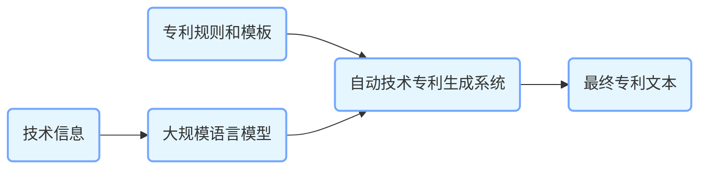

# 大规模语言模型在自动技术专利生成中的应用研究

> 关键词：大规模语言模型、自动技术专利生成、自然语言处理、专利撰写、人工智能应用

> 摘要：本文聚焦于大规模语言模型在自动技术专利生成中的应用。首先介绍了研究的背景、目的、预期读者及文档结构等内容。详细阐述了大规模语言模型和自动技术专利生成的核心概念及联系，通过流程图展示其架构。深入分析了核心算法原理，并给出 Python 代码示例。探讨了相关数学模型和公式，结合实际例子进行说明。通过项目实战，从开发环境搭建到源代码实现与解读，展示了大规模语言模型在自动技术专利生成中的具体应用。列举了该技术的实际应用场景，推荐了学习资源、开发工具框架以及相关论文著作。最后总结了未来发展趋势与挑战，并提供了常见问题解答和扩展阅读参考资料，旨在为相关领域的研究者和从业者提供全面深入的技术指导和研究参考。

## 1. 背景介绍 
### 1.1 目的和范围
随着科技的飞速发展，技术创新不断涌现，专利申请的数量也急剧增加。专利撰写是一项复杂且耗时的工作，需要专业的知识和丰富的经验。大规模语言模型的出现为自动技术专利生成提供了新的可能性。本研究的目的在于探索如何利用大规模语言模型提高自动技术专利生成的效率和质量，减少人工撰写的工作量。研究范围涵盖了大规模语言模型的原理、算法，自动技术专利生成的流程和方法，以及两者结合的具体应用和实践。

### 1.2 预期读者
本文的预期读者包括专利代理人、技术研发人员、人工智能研究者、知识产权律师以及对自动技术专利生成感兴趣的相关人员。这些读者可能具有不同的专业背景，但都希望了解大规模语言模型在自动技术专利生成中的应用，以提高工作效率或开展相关研究。

### 1.3 文档结构概述
本文将按照以下结构进行阐述：首先介绍核心概念与联系，包括大规模语言模型和自动技术专利生成的基本原理和架构；接着详细讲解核心算法原理和具体操作步骤，并给出 Python 代码示例；然后探讨相关的数学模型和公式，并举例说明；通过项目实战展示如何在实际中应用大规模语言模型进行自动技术专利生成；列举该技术的实际应用场景；推荐学习资源、开发工具框架和相关论文著作；最后总结未来发展趋势与挑战，提供常见问题解答和扩展阅读参考资料。

### 1.4 术语表
#### 1.4.1 核心术语定义
- **大规模语言模型**：是一种基于深度学习的人工智能模型，通过在大量文本数据上进行训练，学习语言的模式和规律，能够生成自然流畅的文本。例如 GPT - 3、BERT 等。
- **自动技术专利生成**：利用计算机技术和人工智能算法，根据给定的技术信息自动生成符合专利申请要求的文本文件。
- **专利权利要求书**：是专利文件的核心部分，明确了专利所保护的技术范围。

#### 1.4.2 相关概念解释
- **自然语言处理（NLP）**：是人工智能的一个重要领域，研究如何让计算机理解、处理和生成自然语言。大规模语言模型是自然语言处理的重要成果之一。
- **深度学习**：是一种基于人工神经网络的机器学习方法，通过多层神经网络对数据进行特征提取和模式识别。大规模语言模型通常采用深度学习技术进行训练。

#### 1.4.3 缩略词列表
- **NLP**：Natural Language Processing（自然语言处理）
- **GPT**：Generative Pretrained Transformer（生成式预训练变换器）
- **BERT**：Bidirectional Encoder Representations from Transformers（基于变换器的双向编码器表示）

## 2. 核心概念与联系 

### 大规模语言模型原理
大规模语言模型基于深度学习架构，通常采用变换器（Transformer）架构。变换器架构具有自注意力机制，能够捕捉文本中不同位置之间的依赖关系，从而更好地理解文本的语义。模型通过在大规模文本数据集上进行无监督学习，学习语言的统计规律和语义信息。训练过程中，模型的目标是预测下一个单词或字符，通过不断调整模型的参数，使得预测结果与真实文本尽可能接近。

### 自动技术专利生成原理
自动技术专利生成是一个复杂的过程，涉及到对技术信息的理解、专利规则的遵循和文本的生成。首先，需要将技术信息输入到系统中，系统对其进行分析和理解，提取关键信息。然后，根据专利规则和模板，将关键信息组织成符合要求的专利文本。最后，对生成的文本进行审核和修改，确保其质量和准确性。

### 核心概念架构的文本示意图
```plaintext
大规模语言模型
|
|-- 输入：技术信息文本
|
|-- 处理：基于预训练模型进行特征提取和语义理解
|
|-- 输出：专利文本初稿
|
自动技术专利生成系统
|
|-- 输入：技术信息、专利规则和模板
|
|-- 处理：结合大规模语言模型输出和规则模板进行文本生成和优化
|
|-- 输出：最终专利文本
```

### Mermaid 流程图


## 3. 核心算法原理 & 具体操作步骤 

### 核心算法原理
在自动技术专利生成中，主要使用大规模语言模型的生成能力。以 GPT 系列模型为例，其核心算法基于变换器架构。变换器由编码器和解码器组成，在生成任务中，通常只使用解码器。解码器包含多个解码层，每个解码层由多头自注意力机制和前馈神经网络组成。

多头自注意力机制允许模型在不同的表示子空间中关注输入序列的不同部分，从而捕捉更丰富的语义信息。前馈神经网络则对自注意力机制的输出进行非线性变换，进一步提取特征。

在生成专利文本时，模型根据输入的技术信息，通过逐步预测下一个单词的方式生成文本。具体来说，模型首先将输入的技术信息编码为向量表示，然后将该向量输入到解码器中。解码器根据当前的状态和输入向量，预测下一个单词的概率分布，选择概率最大的单词作为生成的结果，并将其添加到生成序列中。重复这个过程，直到生成完整的专利文本。

### 具体操作步骤
#### 步骤 1：数据预处理
将输入的技术信息进行清洗和标准化处理，去除无用的字符和噪声。例如，将文本转换为小写，去除标点符号等。

#### 步骤 2：加载预训练模型
选择合适的大规模语言模型，如 GPT - 3 或其开源替代模型，加载预训练的权重。

#### 步骤 3：输入技术信息
将预处理后的技术信息输入到模型中，得到模型的初始状态。

#### 步骤 4：文本生成
通过循环的方式，不断预测下一个单词，直到满足停止条件（如达到最大长度或生成特定的结束符号）。

#### 步骤 5：后处理
对生成的文本进行后处理，如检查语法错误、调整语句通顺度等。

### Python 源代码示例
```python
import torch
from transformers import GPT2LMHeadModel, GPT2Tokenizer

# 步骤 2：加载预训练模型和分词器
tokenizer = GPT2Tokenizer.from_pretrained('gpt2')
model = GPT2LMHeadModel.from_pretrained('gpt2')

# 步骤 1：数据预处理
def preprocess_text(text):
    text = text.lower().strip()
    return text

# 步骤 3：输入技术信息
input_text = "一种新型的电池充电技术，采用了特殊的电路设计，能够提高充电效率。"
input_text = preprocess_text(input_text)
input_ids = tokenizer.encode(input_text, return_tensors='pt')

# 步骤 4：文本生成
output = model.generate(input_ids, max_length=500, num_beams=5, no_repeat_ngram_size=2, early_stopping=True)

# 步骤 5：后处理
generated_text = tokenizer.decode(output[0], skip_special_tokens=True)
print(generated_text)
```

## 4. 数学模型和公式 & 详细讲解 & 举例说明 

### 变换器架构中的注意力机制
变换器中的注意力机制是核心组件之一，其数学模型可以表示为：

$$Attention(Q, K, V) = softmax(\frac{QK^T}{\sqrt{d_k}})V$$

其中，$Q$ 是查询矩阵，$K$ 是键矩阵，$V$ 是值矩阵，$d_k$ 是键向量的维度。

详细讲解：注意力机制的作用是计算查询向量与键向量之间的相似度，通过 $QK^T$ 计算相似度得分，然后除以 $\sqrt{d_k}$ 进行缩放，以避免点积结果过大。最后使用 softmax 函数将相似度得分转换为概率分布，乘以值矩阵 $V$ 得到注意力输出。

举例说明：假设我们有一个输入序列 $x = [x_1, x_2, x_3]$，我们可以将其转换为查询矩阵 $Q$、键矩阵 $K$ 和值矩阵 $V$。对于每个查询向量 $q_i$，通过计算与所有键向量 $k_j$ 的相似度，得到一个注意力分布，然后根据这个分布对值向量 $v_j$ 进行加权求和，得到该查询向量对应的输出。

### 多头注意力机制
多头注意力机制将注意力机制扩展到多个头，其数学模型可以表示为：

$$MultiHead(Q, K, V) = Concat(head_1, head_2, \cdots, head_h)W^O$$

其中，$head_i = Attention(QW_i^Q, KW_i^K, VW_i^V)$，$W_i^Q$、$W_i^K$、$W_i^V$ 是用于投影的权重矩阵，$W^O$ 是用于输出投影的权重矩阵，$h$ 是头的数量。

详细讲解：多头注意力机制通过多个独立的注意力头并行计算，每个头关注输入序列的不同部分，然后将所有头的输出拼接起来并进行线性变换，得到最终的多头注意力输出。这样可以捕捉更丰富的语义信息。

举例说明：假设我们有 8 个头，每个头计算一个独立的注意力输出，然后将这 8 个输出拼接起来，再通过 $W^O$ 进行线性变换，得到最终的多头注意力输出。

### 语言模型的损失函数
在训练大规模语言模型时，通常使用交叉熵损失函数。假设我们有一个输入序列 $x = [x_1, x_2, \cdots, x_n]$ 和对应的目标序列 $y = [y_1, y_2, \cdots, y_n]$，损失函数可以表示为：

$$L = -\frac{1}{n}\sum_{i=1}^{n}\log(P(y_i|x_1, x_2, \cdots, x_i))$$

其中，$P(y_i|x_1, x_2, \cdots, x_i)$ 是模型预测 $y_i$ 的概率。

详细讲解：交叉熵损失函数衡量了模型预测的概率分布与真实概率分布之间的差异。通过最小化损失函数，模型可以学习到更准确的语言模式和规律。

举例说明：假设模型预测下一个单词为“apple”的概率为 0.2，而真实的下一个单词就是“apple”，则这一步的损失为 $-\log(0.2)$。将所有步骤的损失求和并取平均值，得到最终的损失值。

## 5. 项目实战：代码实际案例和详细解释说明 

### 5.1  开发环境搭建
#### 操作系统
建议使用 Linux 或 macOS 系统，因为它们对 Python 开发和深度学习框架的支持更好。Windows 系统也可以使用，但可能会遇到一些兼容性问题。

#### Python 环境
安装 Python 3.7 或以上版本。可以使用 Anaconda 来管理 Python 环境，方便安装和管理各种依赖库。

#### 深度学习框架
安装 PyTorch 深度学习框架，可以根据自己的显卡情况选择合适的版本。如果有 NVIDIA 显卡，可以安装支持 CUDA 的版本，以加速训练和推理过程。

#### 相关库
安装 `transformers` 库，它提供了各种预训练的语言模型和相关工具。可以使用以下命令进行安装：
```sh
pip install transformers
```

### 5.2  源代码详细实现和代码解读
```python
import torch
from transformers import GPT2LMHeadModel, GPT2Tokenizer

# 加载预训练模型和分词器
tokenizer = GPT2Tokenizer.from_pretrained('gpt2')
model = GPT2LMHeadModel.from_pretrained('gpt2')

# 数据预处理函数
def preprocess_text(text):
    text = text.lower().strip()
    return text

# 输入技术信息
input_text = "一种新型的太阳能电池板，采用了特殊的材料和结构设计，能够提高光电转换效率。"
input_text = preprocess_text(input_text)

# 将输入文本转换为模型可以接受的输入格式
input_ids = tokenizer.encode(input_text, return_tensors='pt')

# 文本生成
output = model.generate(
    input_ids,
    max_length=1000,  # 生成文本的最大长度
    num_beams=5,  # 束搜索的束数
    no_repeat_ngram_size=2,  # 避免重复的 n - gram 大小
    early_stopping=True  # 是否提前停止生成
)

# 将生成的输出转换为文本
generated_text = tokenizer.decode(output[0], skip_special_tokens=True)

# 打印生成的专利文本
print(generated_text)
```

### 代码解读与分析
- **加载预训练模型和分词器**：使用 `transformers` 库的 `GPT2Tokenizer` 和 `GPT2LMHeadModel` 加载预训练的 GPT - 2 模型和对应的分词器。
- **数据预处理**：定义 `preprocess_text` 函数，将输入的技术信息进行小写转换和去除首尾空格的处理。
- **输入文本编码**：使用分词器将输入的技术信息编码为模型可以接受的输入格式，即 `input_ids`。
- **文本生成**：调用模型的 `generate` 方法进行文本生成，设置了生成文本的最大长度、束搜索的束数、避免重复的 n - gram 大小和是否提前停止生成等参数。
- **输出解码**：使用分词器将生成的输出解码为文本，并去除特殊符号。
- **打印结果**：将生成的专利文本打印输出。

需要注意的是，生成的专利文本可能需要进一步的人工审核和修改，以确保其符合专利申请的要求。

## 6. 实际应用场景 
### 专利代理机构
专利代理机构需要处理大量的专利申请案件，使用大规模语言模型进行自动技术专利生成可以提高工作效率，减少人工撰写的工作量。例如，在处理一些技术领域较为常见的专利申请时，可以利用模型快速生成专利文本初稿，然后由专利代理人进行审核和修改，从而缩短专利申请的周期。

### 企业研发部门
企业研发部门在进行技术创新时，需要及时申请专利来保护自己的技术成果。大规模语言模型可以帮助研发人员快速生成专利文本，提高专利申请的效率。同时，研发人员可以将更多的时间和精力投入到技术研发中，促进企业的创新发展。

### 科研机构
科研机构在进行科研项目时，也需要申请专利来保护科研成果。自动技术专利生成可以为科研人员提供便利，使得他们能够更加专注于科研工作。此外，大规模语言模型还可以帮助科研人员发现技术创新点，提供专利申请的思路。

### 知识产权服务平台
知识产权服务平台可以集成大规模语言模型，为用户提供自动技术专利生成服务。用户只需输入技术信息，平台即可快速生成专利文本，为用户提供一站式的知识产权服务。

## 7. 工具和资源推荐
### 7.1 学习资源推荐
#### 7.1.1 书籍推荐
- 《深度学习》（Deep Learning）：由 Ian Goodfellow、Yoshua Bengio 和 Aaron Courville 所著，是深度学习领域的经典教材，涵盖了深度学习的基本原理、算法和应用。
- 《自然语言处理入门》：帮助读者快速入门自然语言处理领域，了解相关的算法和技术。
- 《Python 自然语言处理》（Natural Language Processing with Python）：介绍了如何使用 Python 进行自然语言处理，包含了大量的代码示例和实践项目。

#### 7.1.2 在线课程
- Coursera 上的“深度学习专项课程”（Deep Learning Specialization）：由 Andrew Ng 教授授课，系统地介绍了深度学习的理论和实践。
- edX 上的“自然语言处理基础”（Foundations of Natural Language Processing）：讲解了自然语言处理的基本概念、算法和应用。
- 哔哩哔哩（B 站）上有许多关于深度学习和自然语言处理的免费视频教程，适合初学者学习。

#### 7.1.3 技术博客和网站
- Hugging Face 博客：提供了关于大规模语言模型和自然语言处理的最新研究成果和技术应用。
- arXiv 预印本平台：可以获取到最新的学术论文和研究报告，了解该领域的前沿动态。
- Medium 上有许多关于人工智能和自然语言处理的优质博客文章，作者来自世界各地的研究者和从业者。

### 7.2 开发工具框架推荐
#### 7.2.1 IDE和编辑器
- PyCharm：是一款专业的 Python 集成开发环境，提供了丰富的代码编辑、调试和项目管理功能。
- Visual Studio Code：是一款轻量级的代码编辑器，支持多种编程语言，通过安装插件可以实现强大的 Python 开发功能。

#### 7.2.2 调试和性能分析工具
- TensorBoard：是 TensorFlow 提供的可视化工具，可以用于查看模型的训练过程、损失曲线、准确率等指标。
- Py-Spy：是一个 Python 性能分析工具，可以帮助开发者找出代码中的性能瓶颈。

#### 7.2.3 相关框架和库
- Transformers：由 Hugging Face 开发的自然语言处理框架，提供了各种预训练的语言模型和相关工具，方便开发者进行模型的加载、微调和解码。
- NLTK：是 Python 中常用的自然语言处理库，提供了丰富的语料库和工具，用于文本处理、分词、词性标注等任务。
- SpaCy：是另一个流行的自然语言处理库，具有高效的处理速度和丰富的功能，适合大规模文本处理任务。

### 7.3 相关论文著作推荐
#### 7.3.1 经典论文
- “Attention Is All You Need”：介绍了变换器（Transformer）架构，是大规模语言模型的基础。
- “BERT: Pre-training of Deep Bidirectional Transformers for Language Understanding”：提出了 BERT 模型，在自然语言处理任务中取得了显著的成果。
- “Generative Pretrained Transformer 3”：介绍了 GPT - 3 模型，展示了大规模语言模型的强大生成能力。

#### 7.3.2 最新研究成果
可以通过 arXiv、ACM Digital Library、IEEE Xplore 等学术数据库搜索关于大规模语言模型和自动技术专利生成的最新研究论文，了解该领域的前沿进展。

#### 7.3.3 应用案例分析
一些学术会议和期刊会发表关于大规模语言模型在不同领域应用的案例分析，如专利申请、法律文书生成等。可以关注这些案例分析，学习如何将技术应用到实际场景中。

## 8. 总结：未来发展趋势与挑战
### 未来发展趋势
#### 模型性能不断提升
随着计算资源的不断增加和算法的不断改进，大规模语言模型的性能将不断提升。模型将能够更好地理解和处理复杂的技术信息，生成更加准确、高质量的专利文本。

#### 与其他技术融合
大规模语言模型将与其他技术如知识图谱、计算机视觉等融合，实现多模态的自动技术专利生成。例如，结合计算机视觉技术，可以对技术产品的图片进行分析，提取关键信息，用于专利生成。

#### 个性化定制服务
根据不同用户的需求和偏好，提供个性化的自动技术专利生成服务。例如，针对不同行业的专利申请，调整模型的参数和模板，生成符合行业特点的专利文本。

#### 跨语言应用
随着全球化的发展，跨语言的专利申请需求不断增加。大规模语言模型将具备更好的跨语言处理能力，支持多种语言的专利生成。

### 挑战
#### 数据质量和隐私问题
大规模语言模型的训练需要大量的数据，数据的质量和隐私问题是一个重要挑战。在自动技术专利生成中，涉及到企业和个人的技术秘密和知识产权，如何确保数据的安全性和隐私性是需要解决的问题。

#### 专利规则的复杂性
专利规则因国家和地区而异，且不断更新和变化。大规模语言模型需要准确理解和遵循这些复杂的规则，才能生成符合要求的专利文本。这对模型的学习能力和适应性提出了很高的要求。

#### 人工审核和干预
虽然大规模语言模型可以生成专利文本初稿，但最终的专利申请仍然需要人工审核和干预。如何在提高自动生成效率的同时，保证人工审核的质量和效率是一个需要平衡的问题。

#### 伦理和法律问题
大规模语言模型在自动技术专利生成中的应用可能会引发一些伦理和法律问题，如专利的原创性、责任归属等。需要建立相应的法律法规和伦理准则，规范其应用。

## 9. 附录：常见问题与解答
### 问题 1：大规模语言模型生成的专利文本是否具有法律效力？
解答：大规模语言模型生成的专利文本只是初稿，不具有法律效力。最终的专利申请需要经过专利局的审查和批准。生成的文本需要经过专利代理人或专业律师的审核和修改，确保其符合专利申请的要求。

### 问题 2：如何提高大规模语言模型生成专利文本的质量？
解答：可以从以下几个方面提高生成专利文本的质量：
- 提供高质量的输入技术信息，确保信息准确、完整。
- 对模型进行微调，使用相关领域的专利数据进行训练，使模型更好地适应专利生成任务。
- 人工审核和修改生成的文本，结合专业知识和经验，提高文本的质量。

### 问题 3：大规模语言模型是否可以替代专利代理人？
解答：目前大规模语言模型还不能完全替代专利代理人。虽然模型可以生成专利文本初稿，但专利申请涉及到复杂的法律和技术问题，需要专业的知识和经验。专利代理人可以对生成的文本进行审核和修改，提供专业的法律建议，确保专利申请的成功率。

### 问题 4：使用大规模语言模型进行自动技术专利生成是否需要支付费用？
解答：一些开源的大规模语言模型可以免费使用，但如果使用商业模型或云服务，可能需要支付一定的费用。具体费用取决于模型的提供商和使用方式。

## 10. 扩展阅读 & 参考资料
### 扩展阅读
- 《人工智能时代的知识产权保护》：探讨了人工智能技术对知识产权保护的影响和挑战。
- 《专利申请实务指南》：详细介绍了专利申请的流程和方法，适合初学者学习。

### 参考资料
- Goodfellow, I., Bengio, Y., & Courville, A. (2016). Deep Learning. MIT Press.
- Devlin, J., Chang, M. W., Lee, K., & Toutanova, K. (2018). BERT: Pre-training of Deep Bidirectional Transformers for Language Understanding. arXiv preprint arXiv:1810.04805.
- Brown, T. B., Mann, B., Ryder, N., Subbiah, M., Kaplan, J., Dhariwal, P.,... & Amodei, D. (2020). Language Models are Few-Shot Learners. arXiv preprint arXiv:2005.14165.

作者：AI天才研究院/AI Genius Institute & 禅与计算机程序设计艺术 /Zen And The Art of Computer Programming