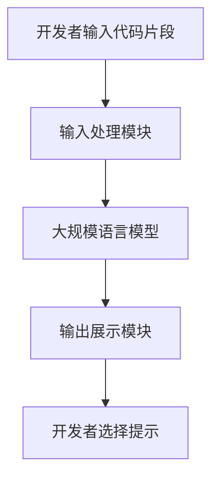

# 大规模语言模型在自动编程辅助中的智能提示应用

> 关键词：大规模语言模型、自动编程辅助、智能提示、代码生成、编程效率

> 摘要：本文聚焦于大规模语言模型在自动编程辅助中智能提示应用这一主题。首先介绍了相关背景，包括目的、预期读者等内容。接着阐述了核心概念，给出了原理和架构的示意图及流程图。详细讲解了核心算法原理，并通过Python代码进行说明，同时给出了数学模型和公式。通过项目实战展示了代码的实际案例和详细解释。探讨了其实际应用场景，推荐了学习、开发等方面的工具和资源。最后总结了未来发展趋势与挑战，解答了常见问题并提供了扩展阅读和参考资料，旨在为开发者和研究者全面深入地了解大规模语言模型在自动编程辅助智能提示应用提供有价值的信息。

## 1. 背景介绍 
### 1.1 目的和范围
随着软件开发行业的迅速发展，代码的复杂性和规模不断增加，开发者面临着巨大的编程压力。大规模语言模型（LLMs）的出现为自动编程辅助带来了新的机遇。本文章的目的在于深入探讨大规模语言模型在自动编程辅助中智能提示应用的原理、技术实现和实际应用场景，为开发者和研究者提供全面的技术指导和参考。

文章的范围涵盖了大规模语言模型的核心概念、智能提示的算法原理、数学模型、实际应用案例，以及相关的工具和资源推荐。同时，对未来的发展趋势和挑战进行了分析和展望。

### 1.2 预期读者
本文的预期读者主要包括以下几类人群：
- **软件开发人员**：希望借助大规模语言模型提高编程效率，解决编程过程中遇到的问题。
- **人工智能研究者**：对大规模语言模型在编程领域的应用感兴趣，希望深入了解其技术原理和研究进展。
- **计算机专业学生**：学习软件开发和人工智能相关课程，希望通过本文了解行业前沿技术和应用。

### 1.3 文档结构概述
本文将按照以下结构进行组织：
- **核心概念与联系**：介绍大规模语言模型和自动编程辅助智能提示的核心概念，以及它们之间的联系，并给出原理和架构的示意图及流程图。
- **核心算法原理 & 具体操作步骤**：详细讲解智能提示的核心算法原理，并通过Python代码进行具体的操作步骤说明。
- **数学模型和公式 & 详细讲解 & 举例说明**：给出智能提示的数学模型和公式，并进行详细讲解和举例说明。
- **项目实战：代码实际案例和详细解释说明**：通过实际项目案例，展示智能提示在编程中的应用，并对代码进行详细解释。
- **实际应用场景**：探讨大规模语言模型在自动编程辅助中智能提示的实际应用场景。
- **工具和资源推荐**：推荐学习、开发和研究相关的工具和资源。
- **总结：未来发展趋势与挑战**：总结大规模语言模型在自动编程辅助中智能提示应用的未来发展趋势和面临的挑战。
- **附录：常见问题与解答**：解答读者在阅读过程中可能遇到的常见问题。
- **扩展阅读 & 参考资料**：提供相关的扩展阅读材料和参考资料。

### 1.4 术语表
#### 1.4.1 核心术语定义
- **大规模语言模型（Large Language Model，LLM）**：基于深度学习技术，在大规模文本数据上进行训练的语言模型，具有强大的语言理解和生成能力。
- **自动编程辅助（Automated Programming Assistance）**：利用计算机技术和人工智能算法，为开发者提供编程过程中的帮助和支持，如代码生成、错误检查、智能提示等。
- **智能提示（Intelligent Suggestion）**：根据开发者的输入和上下文信息，自动提供相关的代码片段、函数调用、变量名等提示信息，帮助开发者快速完成编程任务。

#### 1.4.2 相关概念解释
- **预训练模型（Pretrained Model）**：在大规模无监督数据上进行预训练的模型，学习到了丰富的语言知识和模式。在实际应用中，可以基于预训练模型进行微调，以适应特定的任务。
- **微调（Fine-tuning）**：在预训练模型的基础上，使用特定的任务数据对模型进行进一步训练，以提高模型在该任务上的性能。
- **上下文信息（Context Information）**：指在编程过程中，当前代码行之前的代码内容，用于帮助智能提示系统理解开发者的意图和代码的上下文关系。

#### 1.4.3 缩略词列表
- **LLM**：Large Language Model，大规模语言模型
- **API**：Application Programming Interface，应用程序编程接口
- **NLP**：Natural Language Processing，自然语言处理

## 2. 核心概念与联系 

### 核心概念原理
大规模语言模型在自动编程辅助中的智能提示应用，主要基于其强大的语言理解和生成能力。通过对大量代码数据的学习，大规模语言模型能够理解代码的语法结构、语义信息和编程模式，从而根据开发者的输入和上下文信息，生成相关的代码提示。

具体来说，智能提示系统的工作原理如下：
1. **输入处理**：将开发者输入的代码片段作为输入，进行预处理，如分词、词法分析等，将其转换为模型能够理解的格式。
2. **特征提取**：利用大规模语言模型对输入的代码片段进行特征提取，得到代码的语义表示。
3. **提示生成**：根据代码的语义表示和上下文信息，模型生成相关的代码提示。提示可以是代码片段、函数调用、变量名等。
4. **输出展示**：将生成的提示信息展示给开发者，供其选择和使用。

### 架构的文本示意图
```plaintext
+----------------------+
| 开发者输入代码片段   |
+----------------------+
          |
          v
+----------------------+
| 输入处理模块         |
| （分词、词法分析等） |
+----------------------+
          |
          v
+----------------------+
| 大规模语言模型       |
| （特征提取、提示生成）|
+----------------------+
          |
          v
+----------------------+
| 输出展示模块         |
| （展示代码提示）     |
+----------------------+
```

### Mermaid 流程图


## 3. 核心算法原理 & 具体操作步骤 

### 核心算法原理
智能提示的核心算法主要基于大规模语言模型的生成能力。常见的大规模语言模型如GPT系列，采用了Transformer架构，通过自注意力机制学习文本的上下文信息。

在智能提示中，模型的目标是根据输入的代码片段和上下文信息，预测下一个可能的代码元素。具体来说，模型会计算每个可能的代码元素的概率，然后选择概率最高的元素作为提示。

### 具体操作步骤及Python源代码

以下是一个简单的示例，展示如何使用Hugging Face的`transformers`库调用GPT模型进行代码提示：

```python
from transformers import AutoTokenizer, AutoModelForCausalLM

# 加载预训练的GPT模型和分词器
model_name = "gpt2"
tokenizer = AutoTokenizer.from_pretrained(model_name)
model = AutoModelForCausalLM.from_pretrained(model_name)

# 开发者输入的代码片段
input_code = "def add(a, b):"

# 对输入代码进行编码
input_ids = tokenizer.encode(input_code, return_tensors="pt")

# 生成代码提示
output = model.generate(input_ids, max_length=50, num_return_sequences=1)

# 解码生成的代码
generated_code = tokenizer.decode(output[0], skip_special_tokens=True)

# 输出代码提示
print("代码提示：", generated_code)
```

### 代码解释
1. **加载模型和分词器**：使用`AutoTokenizer`和`AutoModelForCausalLM`从Hugging Face的模型库中加载预训练的GPT模型和分词器。
2. **输入编码**：使用分词器对开发者输入的代码片段进行编码，将其转换为模型能够理解的输入格式。
3. **代码生成**：使用模型的`generate`方法生成代码提示，设置最大长度和返回序列的数量。
4. **解码输出**：使用分词器对生成的代码进行解码，将其转换为可读的文本格式。
5. **输出提示**：将生成的代码提示输出给开发者。

## 4. 数学模型和公式 & 详细讲解 & 举例说明 

### 数学模型
智能提示的数学模型可以基于语言模型的概率分布。假设我们有一个输入序列 $x = (x_1, x_2, \cdots, x_n)$，模型的目标是预测下一个词 $x_{n+1}$ 的概率分布 $P(x_{n+1} | x_1, x_2, \cdots, x_n)$。

在大规模语言模型中，通常使用基于Transformer的架构，通过多层的自注意力机制和前馈神经网络来学习输入序列的表示。最终，模型会输出一个词表大小的向量，每个元素表示对应词的得分。通过softmax函数将得分转换为概率分布：

$$P(x_{n+1} = w_j | x_1, x_2, \cdots, x_n) = \frac{\exp(s_j)}{\sum_{k=1}^{V} \exp(s_k)}$$

其中，$s_j$ 是词表中第 $j$ 个词的得分，$V$ 是词表的大小。

### 详细讲解
- **自注意力机制**：自注意力机制允许模型在处理每个位置的输入时，考虑输入序列中其他位置的信息。通过计算查询（Query）、键（Key）和值（Value）之间的相似度，模型可以动态地分配不同位置的权重，从而捕捉输入序列的长距离依赖关系。
- **前馈神经网络**：在自注意力机制之后，模型会通过前馈神经网络对每个位置的表示进行进一步的变换和处理，提取更高级的特征。
- **Softmax函数**：Softmax函数用于将模型输出的得分转换为概率分布，使得所有概率之和为1。这样，我们可以根据概率选择最可能的词作为提示。

### 举例说明
假设我们有一个简单的词表 $V = \{ "return", "print", "a + b" \}$，模型输出的得分分别为 $s_1 = 2, s_2 = 1, s_3 = 3$。则通过softmax函数计算每个词的概率：

$$P("return") = \frac{\exp(2)}{\exp(2) + \exp(1) + \exp(3)} \approx 0.24$$
$$P("print") = \frac{\exp(1)}{\exp(2) + \exp(1) + \exp(3)} \approx 0.09$$
$$P("a + b") = \frac{\exp(3)}{\exp(2) + \exp(1) + \exp(3)} \approx 0.67$$

根据概率，我们可以选择概率最高的词 "a + b" 作为代码提示。

## 5. 项目实战：代码实际案例和详细解释说明 

### 5.1  开发环境搭建
为了实现大规模语言模型在自动编程辅助中的智能提示应用，我们需要搭建相应的开发环境。以下是具体的步骤：

#### 安装Python
首先，确保你已经安装了Python 3.6或更高版本。可以从Python官方网站（https://www.python.org/downloads/）下载并安装Python。

#### 创建虚拟环境
为了避免不同项目之间的依赖冲突，建议使用虚拟环境。可以使用`venv`模块创建虚拟环境：

```bash
python -m venv myenv
```

激活虚拟环境：
- 在Windows上：
```bash
myenv\Scripts\activate
```
- 在Linux和Mac上：
```bash
source myenv/bin/activate
```

#### 安装必要的库
在虚拟环境中，安装所需的库，包括`transformers`、`torch`等：

```bash
pip install transformers torch
```

### 5.2  源代码详细实现和代码解读
以下是一个更完整的代码示例，实现了一个简单的代码提示工具：

```python
from transformers import AutoTokenizer, AutoModelForCausalLM

# 加载预训练的GPT模型和分词器
model_name = "gpt2"
tokenizer = AutoTokenizer.from_pretrained(model_name)
model = AutoModelForCausalLM.from_pretrained(model_name)

def get_code_suggestion(input_code, max_length=50, num_return_sequences=1):
    # 对输入代码进行编码
    input_ids = tokenizer.encode(input_code, return_tensors="pt")
    
    # 生成代码提示
    output = model.generate(input_ids, max_length=max_length, num_return_sequences=num_return_sequences)
    
    # 解码生成的代码
    generated_code = tokenizer.decode(output[0], skip_special_tokens=True)
    
    # 提取提示部分
    suggestion = generated_code[len(input_code):]
    
    return suggestion

# 开发者输入的代码片段
input_code = "def multiply(a, b):"

# 获取代码提示
suggestion = get_code_suggestion(input_code)

# 输出代码提示
print("输入代码：", input_code)
print("代码提示：", suggestion)
```

### 代码解读
1. **加载模型和分词器**：使用`AutoTokenizer`和`AutoModelForCausalLM`从Hugging Face的模型库中加载预训练的GPT模型和分词器。
2. **定义`get_code_suggestion`函数**：该函数接受输入代码、最大长度和返回序列的数量作为参数，返回代码提示。
    - 对输入代码进行编码，将其转换为模型能够理解的输入格式。
    - 使用模型的`generate`方法生成代码提示。
    - 解码生成的代码，并提取提示部分。
3. **获取代码提示**：调用`get_code_suggestion`函数，传入开发者输入的代码片段，获取代码提示。
4. **输出提示**：将输入代码和代码提示输出给开发者。

### 5.3  代码解读与分析
- **优点**：
    - 简单易用：使用Hugging Face的`transformers`库，只需几行代码就可以实现代码提示功能。
    - 灵活性：可以根据需要调整模型的参数，如最大长度、返回序列的数量等，以获得不同的提示效果。
- **局限性**：
    - 模型依赖：代码提示的质量取决于所使用的大规模语言模型的性能。一些开源模型可能在特定领域的代码生成上表现不佳。
    - 缺乏上下文理解：虽然模型可以根据输入的代码片段生成提示，但可能缺乏对代码上下文的深入理解，导致提示的准确性不够高。

## 6. 实际应用场景 
大规模语言模型在自动编程辅助中的智能提示应用具有广泛的实际应用场景，以下是一些常见的场景：

### 代码补全
在开发者编写代码时，智能提示系统可以根据输入的代码片段，自动补全后续的代码。例如，当开发者输入`for i in range(`时，系统可以提示后续的代码，如`)`或具体的范围值。

### 函数调用提示
当开发者调用函数时，智能提示系统可以提供函数的参数列表、返回值类型等信息。例如，当开发者输入`print(`时，系统可以提示`print`函数的参数用法，如`print(*objects, sep=' ', end='\n', file=sys.stdout, flush=False)`。

### 错误检查和修复建议
智能提示系统可以检查代码中的语法错误和逻辑错误，并提供修复建议。例如，当开发者输入的代码存在拼写错误时，系统可以提示正确的拼写。

### 代码优化建议
系统可以分析开发者编写的代码，提供代码优化建议。例如，建议使用更高效的算法或数据结构，以提高代码的性能。

### 新手编程学习
对于编程新手来说，智能提示系统可以作为一个学习工具，帮助他们快速掌握编程语法和技巧。系统可以提供代码示例和解释，引导新手逐步完成编程任务。

## 7. 工具和资源推荐
### 7.1 学习资源推荐
#### 7.1.1 书籍推荐
- 《Python深度学习》：介绍了深度学习的基本概念和方法，以及如何使用Python和Keras进行深度学习模型的开发。
- 《自然语言处理入门》：全面介绍了自然语言处理的基本概念、算法和应用，适合初学者阅读。
- 《代码大全》：经典的软件开发书籍，涵盖了软件开发的各个方面，包括代码设计、编程风格、调试等。

#### 7.1.2 在线课程
- Coursera上的“深度学习专项课程”：由深度学习领域的知名专家Andrew Ng教授授课，系统介绍了深度学习的理论和实践。
- edX上的“自然语言处理基础”：讲解了自然语言处理的基本算法和技术，以及如何使用Python和相关库进行实践。
- Udemy上的“Python编程从入门到精通”：适合零基础的学习者，通过大量的实例和项目，帮助学习者快速掌握Python编程。

#### 7.1.3 技术博客和网站
- Hugging Face官方博客：提供了关于大规模语言模型的最新研究成果和应用案例，以及`transformers`库的使用教程。
- Towards Data Science：一个数据科学和人工智能领域的技术博客，发布了许多关于深度学习、自然语言处理等方面的高质量文章。
- Stack Overflow：一个程序员社区，开发者可以在上面提问、分享经验和解决问题。

### 7.2 开发工具框架推荐
#### 7.2.1 IDE和编辑器
- PyCharm：一款功能强大的Python集成开发环境，提供了代码编辑、调试、代码分析等功能，适合Python开发者使用。
- Visual Studio Code：一款轻量级的代码编辑器，支持多种编程语言，拥有丰富的插件生态系统，可以通过安装插件实现代码提示、调试等功能。
- Jupyter Notebook：一种交互式的开发环境，适合进行数据探索、模型训练和代码演示，支持Python、R等多种编程语言。

#### 7.2.2 调试和性能分析工具
- PDB：Python自带的调试器，可以帮助开发者定位代码中的错误。
- cProfile：Python标准库中的性能分析工具，可以分析代码的运行时间和函数调用情况。
- Py-Spy：一个用于分析Python程序性能的工具，可以实时监控程序的CPU使用率和函数调用情况。

#### 7.2.3 相关框架和库
- Transformers：Hugging Face开发的一个用于自然语言处理的开源库，提供了多种预训练的大规模语言模型，如GPT、BERT等，以及模型的训练和推理工具。
- PyTorch：一个深度学习框架，支持动态图计算，具有高效的计算性能和丰富的工具库，适合进行大规模语言模型的开发和训练。
- TensorFlow：另一个广泛使用的深度学习框架，提供了丰富的工具和接口，支持分布式训练和模型部署。

### 7.3 相关论文著作推荐
#### 7.3.1 经典论文
- 《Attention Is All You Need》：介绍了Transformer架构，是大规模语言模型的基础。
- 《Improving Language Understanding by Generative Pre-Training》：提出了GPT模型的预训练方法。
- 《BERT: Pre-training of Deep Bidirectional Transformers for Language Understanding》：介绍了BERT模型，开启了双向预训练语言模型的时代。

#### 7.3.2 最新研究成果
- 《Scaling Laws for Neural Language Models》：研究了大规模语言模型的缩放定律，揭示了模型规模和性能之间的关系。
- 《Training Language Models to Follow Instructions with Human Feedback》：介绍了通过人类反馈进行指令学习的方法，提高了模型的指令遵循能力。

#### 7.3.3 应用案例分析
- 《CodeBERT: A Pre-trained Model for Programming and Natural Languages》：介绍了CodeBERT模型，用于代码理解和生成任务。
- 《AlphaCode: Competitively Programming with AlphaCode》：介绍了AlphaCode系统，在编程竞赛中取得了优异的成绩。

## 8. 总结：未来发展趋势与挑战
### 未来发展趋势
- **更强大的模型**：随着计算资源的不断增加和算法的不断改进，未来的大规模语言模型将具有更强的语言理解和生成能力，能够提供更准确、更智能的代码提示。
- **多模态融合**：将大规模语言模型与图像、音频等多模态数据相结合，实现更全面的编程辅助。例如，通过分析代码截图或语音输入，提供相应的代码提示。
- **个性化提示**：根据开发者的编程习惯、技能水平和项目需求，提供个性化的代码提示。例如，对于新手开发者，提供更详细的代码示例和解释；对于高级开发者，提供更高级的代码优化建议。
- **与开发工具深度集成**：将智能提示功能深度集成到各种开发工具中，如IDE、代码编辑器等，实现无缝的编程体验。

### 挑战
- **数据隐私和安全**：大规模语言模型的训练需要大量的代码数据，这些数据可能包含敏感信息。如何保护数据的隐私和安全，是一个亟待解决的问题。
- **模型可解释性**：大规模语言模型通常是黑盒模型，其决策过程难以解释。在编程辅助中，开发者需要了解模型给出提示的依据，以便做出正确的决策。因此，提高模型的可解释性是一个重要的挑战。
- **性能和效率**：大规模语言模型的推理速度较慢，在实时编程辅助中可能会影响开发者的体验。如何提高模型的性能和效率，是一个需要解决的问题。
- **领域适应性**：不同领域的代码具有不同的特点和规范，现有的大规模语言模型在特定领域的代码生成上可能表现不佳。如何提高模型的领域适应性，是一个需要研究的方向。

## 9. 附录：常见问题与解答
### 问题1：智能提示的准确性如何保证？
智能提示的准确性主要取决于所使用的大规模语言模型的性能和训练数据的质量。可以通过以下方法提高准确性：
- 使用更强大的预训练模型，如GPT-3、Codex等。
- 对模型进行微调，使用特定领域的代码数据进行训练。
- 结合上下文信息，提高模型对代码意图的理解。

### 问题2：智能提示系统是否会替代开发者？
智能提示系统不会替代开发者，而是作为开发者的辅助工具，帮助他们提高编程效率和质量。开发者仍然需要具备编程的基础知识和技能，能够理解和评估智能提示的建议，并做出正确的决策。

### 问题3：如何选择适合的大规模语言模型？
选择适合的大规模语言模型需要考虑以下因素：
- 模型的性能和能力：不同的模型在语言理解和生成能力上有所差异，可以根据具体需求选择合适的模型。
- 训练数据：模型的训练数据会影响其在特定领域的表现，选择在相关领域有大量训练数据的模型。
- 开源性和易用性：开源模型可以方便地进行微调，选择易于使用和集成的模型。

### 问题4：智能提示系统是否支持多种编程语言？
一些大规模语言模型可以支持多种编程语言，如GPT-3、Codex等。这些模型在训练过程中使用了多种编程语言的代码数据，因此可以生成不同编程语言的代码提示。但不同模型对不同编程语言的支持程度可能有所差异。

## 10. 扩展阅读 & 参考资料
### 扩展阅读
- 《人工智能时代的编程革命》：探讨了人工智能技术在编程领域的应用和发展趋势。
- 《深度学习实战》：介绍了深度学习在各个领域的实际应用案例，包括自然语言处理、计算机视觉等。

### 参考资料
- Hugging Face官方文档：https://huggingface.co/docs
- PyTorch官方文档：https://pytorch.org/docs/stable/index.html
- TensorFlow官方文档：https://www.tensorflow.org/api_docs

作者：AI天才研究院/AI Genius Institute & 禅与计算机程序设计艺术 /Zen And The Art of Computer Programming