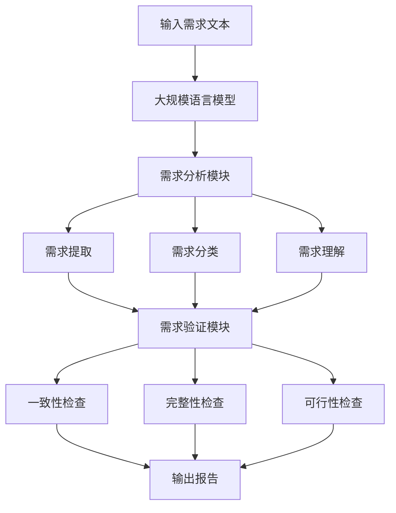

# 大规模语言模型在自动软件需求分析与验证中的应用

> 关键词：大规模语言模型、软件需求分析、需求验证、自然语言处理、软件工程

> 摘要：本文深入探讨了大规模语言模型在自动软件需求分析与验证中的应用。首先介绍了相关背景，包括研究目的、预期读者和文档结构等。接着阐述了核心概念，给出了原理和架构的示意图与流程图。详细讲解了核心算法原理，用 Python 代码进行了示例。分析了数学模型和公式，并举例说明。通过项目实战展示了代码的实际应用和解读。探讨了该技术在实际中的应用场景，推荐了学习资源、开发工具框架和相关论文著作。最后总结了未来发展趋势与挑战，解答了常见问题并提供了扩展阅读和参考资料，旨在为软件工程领域利用大规模语言模型进行需求分析与验证提供全面的技术指导。

## 1. 背景介绍 
### 1.1 目的和范围
在软件工程中，软件需求分析与验证是项目成功的关键环节。准确、清晰的需求定义能够避免后期开发过程中的大量返工和错误，提高软件质量和开发效率。然而，传统的需求分析与验证方法往往依赖人工，存在效率低、主观性强等问题。大规模语言模型（LLMs）如 GPT - 3、BERT 等的出现，为自动软件需求分析与验证带来了新的机遇。

本文的目的是深入研究大规模语言模型在自动软件需求分析与验证中的应用，探讨其原理、算法、实际应用场景等方面的内容。范围涵盖了从核心概念的介绍到具体代码实现，再到实际应用案例的分析，以及相关工具和资源的推荐。

### 1.2 预期读者
本文预期读者包括软件工程领域的专业人士，如软件开发者、软件测试人员、软件项目管理人员等；对自然语言处理和人工智能在软件工程中的应用感兴趣的研究人员；以及相关专业的学生，希望通过本文了解大规模语言模型在软件需求分析与验证中的具体应用和实现方法。

### 1.3 文档结构概述
本文将按照以下结构进行组织：
- 核心概念与联系：介绍大规模语言模型、软件需求分析与验证的核心概念，以及它们之间的联系，并给出原理和架构的示意图与流程图。
- 核心算法原理 & 具体操作步骤：详细讲解使用大规模语言模型进行需求分析与验证的核心算法原理，并用 Python 代码进行示例。
- 数学模型和公式 & 详细讲解 & 举例说明：分析相关的数学模型和公式，并通过具体例子进行说明。
- 项目实战：代码实际案例和详细解释说明：通过一个实际项目，展示如何使用大规模语言模型进行需求分析与验证的代码实现和解读。
- 实际应用场景：探讨大规模语言模型在软件需求分析与验证中的实际应用场景。
- 工具和资源推荐：推荐相关的学习资源、开发工具框架和论文著作。
- 总结：未来发展趋势与挑战：总结大规模语言模型在自动软件需求分析与验证中的未来发展趋势和面临的挑战。
- 附录：常见问题与解答：解答读者可能遇到的常见问题。
- 扩展阅读 & 参考资料：提供扩展阅读的建议和相关参考资料。

### 1.4 术语表
#### 1.4.1 核心术语定义
- **大规模语言模型（Large - Scale Language Model，LLM）**：是一种基于深度学习的自然语言处理模型，通过在大规模文本数据上进行训练，学习语言的模式和规律，能够生成自然流畅的文本、进行语言理解等任务。
- **软件需求分析（Software Requirement Analysis）**：是指对用户需求进行收集、分析、整理和定义的过程，旨在明确软件系统需要实现的功能、性能、约束等要求。
- **软件需求验证（Software Requirement Validation）**：是指对需求规格说明书进行审查，确保需求的正确性、完整性、一致性、可行性等的过程。

#### 1.4.2 相关概念解释
- **自然语言处理（Natural Language Processing，NLP）**：是一门研究如何让计算机理解、处理和生成自然语言的学科，大规模语言模型是自然语言处理领域的重要成果之一。
- **深度学习（Deep Learning）**：是一种基于人工神经网络的机器学习方法，大规模语言模型通常采用深度学习技术进行训练。

#### 1.4.3 缩略词列表
- **LLM**：Large - Scale Language Model，大规模语言模型
- **NLP**：Natural Language Processing，自然语言处理
- **SRA**：Software Requirement Analysis，软件需求分析
- **SRV**：Software Requirement Validation，软件需求验证

## 2. 核心概念与联系 

### 2.1 核心概念原理

#### 2.1.1 大规模语言模型原理
大规模语言模型基于深度学习架构，如 Transformer 架构。Transformer 由编码器和解码器组成，通过自注意力机制（Self - Attention Mechanism）来捕捉输入序列中不同位置之间的依赖关系。

自注意力机制允许模型在处理每个位置的输入时，考虑序列中其他位置的信息。对于输入序列 $\mathbf{x}=[x_1,x_2,\cdots,x_n]$，自注意力机制计算每个位置的输出向量 $\mathbf{z}_i$ 如下：

1. 首先，将输入向量 $\mathbf{x}_i$ 分别投影到查询向量 $\mathbf{q}_i$、键向量 $\mathbf{k}_i$ 和值向量 $\mathbf{v}_i$：
   - $\mathbf{q}_i = \mathbf{W}_q\mathbf{x}_i$
   - $\mathbf{k}_i = \mathbf{W}_k\mathbf{x}_i$
   - $\mathbf{v}_i = \mathbf{W}_v\mathbf{x}_i$
   其中，$\mathbf{W}_q$、$\mathbf{W}_k$ 和 $\mathbf{W}_v$ 是可学习的权重矩阵。

2. 然后，计算注意力分数：
   - $a_{ij}=\frac{\mathbf{q}_i^T\mathbf{k}_j}{\sqrt{d_k}}$
   其中，$d_k$ 是键向量的维度。

3. 接着，对注意力分数进行 softmax 归一化：
   - $\alpha_{ij}=\frac{\exp(a_{ij})}{\sum_{k = 1}^{n}\exp(a_{ik})}$

4. 最后，计算输出向量：
   - $\mathbf{z}_i=\sum_{j = 1}^{n}\alpha_{ij}\mathbf{v}_j$

大规模语言模型通过在大规模文本数据上进行无监督学习，学习到语言的语义和语法信息。训练过程通常采用自回归或自编码的方式，如 GPT 系列模型采用自回归方式，BERT 模型采用自编码方式。

#### 2.1.2 软件需求分析原理
软件需求分析的目标是从用户的模糊需求中提取出清晰、准确的软件需求。其过程包括需求收集、需求理解、需求规格说明等阶段。

需求收集通过与用户进行沟通、观察用户操作、分析业务流程等方式获取用户的需求信息。需求理解则是对收集到的需求信息进行分析和解释，识别出需求的关键要素，如功能需求、非功能需求等。需求规格说明是将理解后的需求以书面文档的形式进行规范描述，以便后续的开发和验证。

#### 2.1.3 软件需求验证原理
软件需求验证的目的是确保需求规格说明书中的需求是正确、完整、一致、可行的。验证方法包括评审、测试、分析等。

评审是指组织相关人员对需求规格说明书进行审查，发现其中的问题和缺陷。测试是通过设计测试用例，验证需求是否能够得到正确实现。分析则是通过对需求进行逻辑分析、一致性检查等，确保需求的合理性。

### 2.2 架构的文本示意图

```plaintext
                      +----------------+
                      |  大规模语言模型  |
                      +----------------+
                             |
                             | 输入需求文本
                             v
              +-------------------------------+
              |  需求分析模块                 |
              | - 需求提取                   |
              | - 需求分类                   |
              | - 需求理解                   |
              +-------------------------------+
                             |
                             | 分析结果
                             v
              +-------------------------------+
              |  需求验证模块                 |
              | - 一致性检查                 |
              | - 完整性检查                 |
              | - 可行性检查                 |
              +-------------------------------+
                             |
                             | 验证结果
                             v
                      +----------------+
                      |  输出报告      |
                      +----------------+
```

### 2.3 Mermaid 流程图



## 3. 核心算法原理 & 具体操作步骤 

### 3.1 核心算法原理

#### 3.1.1 需求提取算法
需求提取的目标是从自然语言描述的需求文本中提取出关键的需求信息。可以使用命名实体识别（Named Entity Recognition，NER）技术来识别需求中的实体，如功能名称、数据对象、用户角色等。

以使用 Hugging Face 的 Transformers 库中的预训练模型为例，假设我们使用 `bert - base - uncased` 模型进行命名实体识别。以下是一个简单的 Python 代码示例：

```python
from transformers import AutoTokenizer, AutoModelForTokenClassification
import torch

# 加载预训练模型和分词器
tokenizer = AutoTokenizer.from_pretrained("bert-base-uncased")
model = AutoModelForTokenClassification.from_pretrained("bert-base-uncased")

# 输入需求文本
text = "用户可以在系统中创建新的任务。"
tokens = tokenizer(text, return_tensors="pt")

# 进行命名实体识别
with torch.no_grad():
    outputs = model(**tokens)
    logits = outputs.logits
    predicted_ids = torch.argmax(logits, dim=-1)

# 解码预测结果
predicted_labels = [model.config.id2label[id.item()] for id in predicted_ids[0]]
print("需求文本:", text)
print("预测的标签:", predicted_labels)
```

#### 3.1.2 需求分类算法
需求分类是将提取的需求信息分为不同的类别，如功能需求、非功能需求等。可以使用文本分类算法，如基于深度学习的卷积神经网络（Convolutional Neural Network，CNN）或循环神经网络（Recurrent Neural Network，RNN）。

以下是一个使用 PyTorch 实现的简单 CNN 文本分类代码示例：

```python
import torch
import torch.nn as nn
import torch.optim as optim
from torch.utils.data import Dataset, DataLoader
from sklearn.model_selection import train_test_split
from sklearn.preprocessing import LabelEncoder
import numpy as np

# 定义数据集类
class DemandDataset(Dataset):
    def __init__(self, texts, labels):
        self.texts = texts
        self.labels = labels

    def __len__(self):
        return len(self.texts)

    def __getitem__(self, idx):
        text = self.texts[idx]
        label = self.labels[idx]
        return text, label

# 定义 CNN 模型
class CNNTextClassifier(nn.Module):
    def __init__(self, vocab_size, embedding_dim, num_filters, filter_sizes, output_dim, dropout):
        super().__init__()
        self.embedding = nn.Embedding(vocab_size, embedding_dim)
        self.convs = nn.ModuleList([
            nn.Conv2d(in_channels=1,
                      out_channels=num_filters,
                      kernel_size=(fs, embedding_dim))
            for fs in filter_sizes
        ])
        self.fc = nn.Linear(len(filter_sizes) * num_filters, output_dim)
        self.dropout = nn.Dropout(dropout)

    def forward(self, text):
        embedded = self.embedding(text)
        embedded = embedded.unsqueeze(1)
        conved = [nn.functional.relu(conv(embedded)).squeeze(3) for conv in self.convs]
        pooled = [nn.functional.max_pool1d(conv, conv.shape[2]).squeeze(2) for conv in conved]
        cat = self.dropout(torch.cat(pooled, dim=1))
        return self.fc(cat)

# 示例数据
texts = ["用户可以创建新的任务。", "系统需要具备高可用性。"]
labels = ["功能需求", "非功能需求"]

# 数据预处理
label_encoder = LabelEncoder()
encoded_labels = label_encoder.fit_transform(labels)

# 划分训练集和测试集
train_texts, test_texts, train_labels, test_labels = train_test_split(texts, encoded_labels, test_size=0.2, random_state=42)

# 创建数据集和数据加载器
train_dataset = DemandDataset(train_texts, train_labels)
test_dataset = DemandDataset(test_texts, test_labels)
train_loader = DataLoader(train_dataset, batch_size=2, shuffle=True)
test_loader = DataLoader(test_dataset, batch_size=2, shuffle=False)

# 模型参数
vocab_size = 1000
embedding_dim = 100
num_filters = 100
filter_sizes = [3, 4, 5]
output_dim = len(label_encoder.classes_)
dropout = 0.5

# 初始化模型、损失函数和优化器
model = CNNTextClassifier(vocab_size, embedding_dim, num_filters, filter_sizes, output_dim, dropout)
criterion = nn.CrossEntropyLoss()
optimizer = optim.Adam(model.parameters())

# 训练模型
num_epochs = 10
for epoch in range(num_epochs):
    model.train()
    for texts, labels in train_loader:
        optimizer.zero_grad()
        outputs = model(texts)
        loss = criterion(outputs, labels)
        loss.backward()
        optimizer.step()

    # 测试模型
    model.eval()
    correct = 0
    total = 0
    with torch.no_grad():
        for texts, labels in test_loader:
            outputs = model(texts)
            _, predicted = torch.max(outputs.data, 1)
            total += labels.size(0)
            correct += (predicted == labels).sum().item()

    print(f'Epoch {epoch + 1}/{num_epochs}, Accuracy: {100 * correct / total}%')
```

#### 3.1.3 需求验证算法
需求验证主要包括一致性检查、完整性检查和可行性检查。可以使用规则引擎来实现这些检查。以下是一个简单的规则引擎示例，用于检查需求之间的一致性：

```python
# 示例需求规则
rules = [
    {
        "name": "功能需求不能与非功能需求冲突",
        "condition": lambda func, non_func: not (func and non_func),
        "message": "功能需求和非功能需求存在冲突"
    }
]

# 示例需求信息
func_demand = True
non_func_demand = False

# 执行规则检查
for rule in rules:
    if not rule["condition"](func_demand, non_func_demand):
        print(rule["message"])
    else:
        print("需求符合规则:", rule["name"])
```

### 3.2 具体操作步骤

1. **数据准备**：收集和整理需求文本数据，并进行标注，用于训练需求提取和分类模型。
2. **模型选择和加载**：选择合适的大规模语言模型和相关的预训练模型，如 Hugging Face 中的模型，并加载到内存中。
3. **需求提取**：使用命名实体识别等技术从需求文本中提取关键信息。
4. **需求分类**：将提取的需求信息进行分类，使用文本分类算法进行训练和预测。
5. **需求验证**：使用规则引擎等方法对需求进行一致性、完整性和可行性检查。
6. **输出报告**：将需求分析和验证的结果以报告的形式输出，包括需求信息、分类结果、验证结论等。

## 4. 数学模型和公式 & 详细讲解 & 举例说明 

### 4.1 命名实体识别的数学模型

在命名实体识别中，通常使用条件随机场（Conditional Random Field，CRF）或基于深度学习的模型。以基于深度学习的模型为例，假设输入序列为 $\mathbf{x}=[x_1,x_2,\cdots,x_n]$，输出标签序列为 $\mathbf{y}=[y_1,y_2,\cdots,y_n]$。

模型的目标是最大化条件概率 $P(\mathbf{y}|\mathbf{x})$。可以使用交叉熵损失函数来训练模型：

$$L(\theta)=-\sum_{i = 1}^{N}\log P(\mathbf{y}^{(i)}|\mathbf{x}^{(i)};\theta)$$

其中，$N$ 是训练样本的数量，$\theta$ 是模型的参数。

### 4.2 文本分类的数学模型

对于文本分类问题，假设输入文本的特征向量为 $\mathbf{x}$，类别标签为 $y$。模型的输出是每个类别的概率分布 $\mathbf{p}=[p_1,p_2,\cdots,p_K]$，其中 $K$ 是类别的数量。

使用交叉熵损失函数来衡量模型预测结果与真实标签之间的差异：

$$L(\theta)=-\sum_{i = 1}^{N}\sum_{k = 1}^{K}y_{i,k}\log p_{i,k}$$

其中，$y_{i,k}$ 是第 $i$ 个样本的第 $k$ 个类别的真实标签（one - hot 编码），$p_{i,k}$ 是模型预测的第 $i$ 个样本属于第 $k$ 个类别的概率。

### 4.3 举例说明

#### 4.3.1 命名实体识别示例
假设输入需求文本为 "用户可以在系统中创建新的任务。"，经过分词后得到 `["用户", "可以", "在", "系统", "中", "创建", "新", "的", "任务", "。"]`。

假设模型预测的标签序列为 `["B - User", "O", "O", "B - System", "O", "B - Function", "O", "O", "B - Task", "O"]`，其中 "B - " 表示实体的开始，"O" 表示非实体。

这表明模型识别出了 "用户" 是用户实体，"系统" 是系统实体，"创建" 是功能实体，"任务" 是任务实体。

#### 4.3.2 文本分类示例
假设我们有一个需求文本 "系统需要在 1 秒内响应请求。"，经过文本分类模型预测，得到其属于 "非功能需求" 类别。

假设模型输出的概率分布为 `[0.1, 0.9]`，表示属于 "功能需求" 的概率为 0.1，属于 "非功能需求" 的概率为 0.9，因此将该需求分类为 "非功能需求"。

## 5. 项目实战：代码实际案例和详细解释说明 

### 5.1 开发环境搭建

#### 5.1.1 安装 Python
首先需要安装 Python 环境，建议使用 Python 3.7 及以上版本。可以从 Python 官方网站（https://www.python.org/downloads/）下载并安装。

#### 5.1.2 安装必要的库
使用 `pip` 安装以下必要的库：
```bash
pip install transformers torch scikit - learn numpy
```

### 5.2 源代码详细实现和代码解读

#### 5.2.1 需求提取代码

```python
from transformers import AutoTokenizer, AutoModelForTokenClassification
import torch

# 加载预训练模型和分词器
tokenizer = AutoTokenizer.from_pretrained("bert-base-uncased")
model = AutoModelForTokenClassification.from_pretrained("bert-base-uncased")

# 输入需求文本
text = "用户可以在系统中创建新的任务。"
tokens = tokenizer(text, return_tensors="pt")

# 进行命名实体识别
with torch.no_grad():
    outputs = model(**tokens)
    logits = outputs.logits
    predicted_ids = torch.argmax(logits, dim=-1)

# 解码预测结果
predicted_labels = [model.config.id2label[id.item()] for id in predicted_ids[0]]
print("需求文本:", text)
print("预测的标签:", predicted_labels)
```

**代码解读**：
- 首先，使用 `AutoTokenizer` 和 `AutoModelForTokenClassification` 从 Hugging Face 的模型库中加载预训练的 BERT 模型和分词器。
- 然后，将输入的需求文本进行分词，并转换为 PyTorch 张量。
- 接着，使用 `model` 进行命名实体识别，得到模型的输出 `logits`。
- 对 `logits` 进行 argmax 操作，得到预测的标签 ID。
- 最后，将预测的标签 ID 解码为标签名称，并打印输出。

#### 5.2.2 需求分类代码

```python
import torch
import torch.nn as nn
import torch.optim as optim
from torch.utils.data import Dataset, DataLoader
from sklearn.model_selection import train_test_split
from sklearn.preprocessing import LabelEncoder
import numpy as np

# 定义数据集类
class DemandDataset(Dataset):
    def __init__(self, texts, labels):
        self.texts = texts
        self.labels = labels

    def __len__(self):
        return len(self.texts)

    def __getitem__(self, idx):
        text = self.texts[idx]
        label = self.labels[idx]
        return text, label

# 定义 CNN 模型
class CNNTextClassifier(nn.Module):
    def __init__(self, vocab_size, embedding_dim, num_filters, filter_sizes, output_dim, dropout):
        super().__init__()
        self.embedding = nn.Embedding(vocab_size, embedding_dim)
        self.convs = nn.ModuleList([
            nn.Conv2d(in_channels=1,
                      out_channels=num_filters,
                      kernel_size=(fs, embedding_dim))
            for fs in filter_sizes
        ])
        self.fc = nn.Linear(len(filter_sizes) * num_filters, output_dim)
        self.dropout = nn.Dropout(dropout)

    def forward(self, text):
        embedded = self.embedding(text)
        embedded = embedded.unsqueeze(1)
        conved = [nn.functional.relu(conv(embedded)).squeeze(3) for conv in self.convs]
        pooled = [nn.functional.max_pool1d(conv, conv.shape[2]).squeeze(2) for conv in conved]
        cat = self.dropout(torch.cat(pooled, dim=1))
        return self.fc(cat)

# 示例数据
texts = ["用户可以创建新的任务。", "系统需要具备高可用性。"]
labels = ["功能需求", "非功能需求"]

# 数据预处理
label_encoder = LabelEncoder()
encoded_labels = label_encoder.fit_transform(labels)

# 划分训练集和测试集
train_texts, test_texts, train_labels, test_labels = train_test_split(texts, encoded_labels, test_size=0.2, random_state=42)

# 创建数据集和数据加载器
train_dataset = DemandDataset(train_texts, train_labels)
test_dataset = DemandDataset(test_texts, test_labels)
train_loader = DataLoader(train_dataset, batch_size=2, shuffle=True)
test_loader = DataLoader(test_dataset, batch_size=2, shuffle=False)

# 模型参数
vocab_size = 1000
embedding_dim = 100
num_filters = 100
filter_sizes = [3, 4, 5]
output_dim = len(label_encoder.classes_)
dropout = 0.5

# 初始化模型、损失函数和优化器
model = CNNTextClassifier(vocab_size, embedding_dim, num_filters, filter_sizes, output_dim, dropout)
criterion = nn.CrossEntropyLoss()
optimizer = optim.Adam(model.parameters())

# 训练模型
num_epochs = 10
for epoch in range(num_epochs):
    model.train()
    for texts, labels in train_loader:
        optimizer.zero_grad()
        outputs = model(texts)
        loss = criterion(outputs, labels)
        loss.backward()
        optimizer.step()

    # 测试模型
    model.eval()
    correct = 0
    total = 0
    with torch.no_grad():
        for texts, labels in test_loader:
            outputs = model(texts)
            _, predicted = torch.max(outputs.data, 1)
            total += labels.size(0)
            correct += (predicted == labels).sum().item()

    print(f'Epoch {epoch + 1}/{num_epochs}, Accuracy: {100 * correct / total}%')
```

**代码解读**：
- 首先，定义了 `DemandDataset` 类，用于封装数据集。
- 然后，定义了 `CNNTextClassifier` 类，实现了一个简单的 CNN 文本分类模型。
- 接着，准备了示例数据，并进行数据预处理，包括标签编码和划分训练集和测试集。
- 创建了数据集和数据加载器，用于批量加载数据。
- 初始化模型、损失函数和优化器。
- 进行模型训练，每个 epoch 中，使用训练集数据更新模型参数，并在测试集上进行评估，打印准确率。

#### 5.2.3 需求验证代码

```python
# 示例需求规则
rules = [
    {
        "name": "功能需求不能与非功能需求冲突",
        "condition": lambda func, non_func: not (func and non_func),
        "message": "功能需求和非功能需求存在冲突"
    }
]

# 示例需求信息
func_demand = True
non_func_demand = False

# 执行规则检查
for rule in rules:
    if not rule["condition"](func_demand, non_func_demand):
        print(rule["message"])
    else:
        print("需求符合规则:", rule["name"])
```

**代码解读**：
- 定义了一个需求规则列表 `rules`，每个规则包含规则名称、条件函数和错误信息。
- 给出了示例需求信息 `func_demand` 和 `non_func_demand`。
- 遍历规则列表，对每个规则进行条件检查，如果不满足条件，则打印错误信息，否则打印规则符合信息。

### 5.3 代码解读与分析

#### 5.3.1 需求提取代码分析
- 优点：使用预训练的 BERT 模型可以利用大规模文本数据学习到的语言知识，提高命名实体识别的准确性。
- 缺点：预训练模型的计算资源需求较大，对于大规模数据集的处理速度可能较慢。

#### 5.3.2 需求分类代码分析
- 优点：CNN 模型可以捕捉文本中的局部特征，对于文本分类任务具有较好的效果。
- 缺点：需要大量的训练数据和较长的训练时间，对于数据量较小的情况可能容易过拟合。

#### 5.3.3 需求验证代码分析
- 优点：规则引擎的实现简单，易于理解和扩展，可以根据不同的需求定义不同的规则。
- 缺点：规则的定义需要人工进行，对于复杂的需求验证可能需要定义大量的规则，维护成本较高。

## 6. 实际应用场景 

### 6.1 软件开发项目中的需求分析与验证
在软件开发项目中，大规模语言模型可以帮助开发团队自动从用户的需求文档、会议记录等文本中提取关键需求信息，并进行分类和验证。例如，在一个电商系统的开发项目中，通过需求提取可以识别出用户注册、商品浏览、购物车管理等功能需求，以及系统响应时间、并发处理能力等非功能需求。然后，通过需求分类将这些需求进行归类，便于后续的开发和管理。最后，使用需求验证规则检查需求之间是否存在冲突、是否完整等问题，确保需求的质量。

### 6.2 软件需求变更管理
在软件项目的开发过程中，需求可能会发生变更。大规模语言模型可以帮助分析需求变更的影响范围，验证变更后的需求是否与原有需求一致。例如，当用户提出增加新的功能需求时，系统可以自动检查该需求是否会与现有功能产生冲突，是否会影响系统的性能等。

### 6.3 软件需求文档生成
大规模语言模型可以根据提取和分类的需求信息，自动生成规范的需求文档。例如，将需求信息按照功能需求、非功能需求等类别进行整理，生成包含需求描述、优先级、验收标准等内容的需求规格说明书，提高文档生成的效率和准确性。

### 6.4 软件需求评审辅助
在软件需求评审过程中，大规模语言模型可以作为辅助工具，帮助评审人员快速发现需求中的问题和缺陷。例如，通过一致性检查和完整性检查，发现需求中的逻辑矛盾、遗漏等问题，并提供相应的建议和提示。

## 7. 工具和资源推荐

### 7.1 学习资源推荐

#### 7.1.1 书籍推荐
- 《自然语言处理入门》：介绍了自然语言处理的基本概念、算法和技术，适合初学者入门。
- 《深度学习》：详细讲解了深度学习的原理和方法，包括神经网络、卷积神经网络、循环神经网络等，对于理解大规模语言模型的原理有很大帮助。
- 《软件工程》：全面介绍了软件工程的各个方面，包括需求分析、设计、开发、测试等，对于了解软件需求分析与验证的流程和方法很有价值。

#### 7.1.2 在线课程
- Coursera 上的 “Natural Language Processing Specialization”：由顶尖高校的教授授课，系统地介绍了自然语言处理的相关知识和技术。
- edX 上的 “Deep Learning Fundamentals”：深入讲解了深度学习的基础知识和应用，对于学习大规模语言模型的训练和使用有很大帮助。
- Udemy 上的 “Software Requirements Engineering”：专门介绍了软件需求工程的方法和实践，包括需求分析、验证、管理等方面的内容。

#### 7.1.3 技术博客和网站
- Hugging Face 官方博客：提供了关于大规模语言模型的最新研究成果、应用案例和使用教程。
- Towards Data Science：发布了大量关于自然语言处理、深度学习等领域的技术文章和实践经验。
- ACM SIGSOFT（Association for Computing Machinery Special Interest Group on Software Engineering）：提供了软件工程领域的最新研究动态和学术资源。

### 7.2 开发工具框架推荐

#### 7.2.1 IDE和编辑器
- PyCharm：是一款专门为 Python 开发设计的集成开发环境，具有代码编辑、调试、版本控制等功能，适合开发使用 Python 实现的大规模语言模型应用。
- Jupyter Notebook：是一个交互式的开发环境，支持 Python、R 等多种编程语言，方便进行数据分析、模型训练和可视化展示。
- Visual Studio Code：是一款轻量级的代码编辑器，支持多种编程语言和插件扩展，可用于开发和调试大规模语言模型相关的代码。

#### 7.2.2 调试和性能分析工具
- TensorBoard：是 TensorFlow 提供的可视化工具，可以用于监控模型的训练过程、查看模型的性能指标等。
- PyTorch Profiler：是 PyTorch 提供的性能分析工具，可以帮助开发者找出代码中的性能瓶颈，优化代码性能。
- VS Code Debugger：可以方便地对 Python 代码进行调试，设置断点、查看变量值等。

#### 7.2.3 相关框架和库
- Hugging Face Transformers：提供了丰富的预训练语言模型和工具，方便开发者进行自然语言处理任务，如文本分类、命名实体识别等。
- PyTorch：是一个开源的深度学习框架，具有动态图、易于使用等优点，广泛应用于大规模语言模型的开发和训练。
- Scikit - learn：是一个用于机器学习的 Python 库，提供了各种机器学习算法和工具，可用于数据预处理、模型评估等任务。

### 7.3 相关论文著作推荐

#### 7.3.1 经典论文
- “Attention Is All You Need”：介绍了 Transformer 架构，是大规模语言模型的基础。
- “BERT: Pre - training of Deep Bidirectional Transformers for Language Understanding”：提出了 BERT 模型，开创了预训练语言模型在自然语言处理中的应用。
- “Software Requirements Engineering: A Roadmap”：对软件需求工程的发展历程和未来趋势进行了总结和展望。

#### 7.3.2 最新研究成果
- 关注 ACL（Association for Computational Linguistics）、ICSE（International Conference on Software Engineering）等学术会议的最新论文，了解大规模语言模型在软件需求分析与验证领域的最新研究进展。
- 关注顶级学术期刊，如 ACM Transactions on Software Engineering and Methodology（TOSEM）、IEEE Transactions on Software Engineering（TSE）等，获取相关领域的高质量研究成果。

#### 7.3.3 应用案例分析
- 可以查阅一些软件公司的技术博客和案例分享，了解他们在实际项目中如何应用大规模语言模型进行软件需求分析与验证。例如，谷歌、微软等公司的技术博客会发布一些关于自然语言处理和软件工程的应用案例。

## 8. 总结：未来发展趋势与挑战

### 8.1 未来发展趋势

#### 8.1.1 模型性能的提升
随着计算资源的不断增加和算法的不断改进，大规模语言模型的性能将不断提升。例如，模型的语言理解能力将更加准确，能够更好地处理复杂的自然语言文本；模型的生成能力将更加自然流畅，能够生成高质量的需求文档和代码。

#### 8.1.2 多模态融合
未来的大规模语言模型可能会与图像、音频等多模态数据进行融合，以更全面地理解用户的需求。例如，在软件需求分析中，除了文本描述外，还可以结合用户的操作视频、界面截图等信息，更准确地把握用户的需求。

#### 8.1.3 个性化需求分析
根据不同用户的背景、偏好和历史需求，为用户提供个性化的需求分析和验证服务。例如，对于不同行业的用户，模型可以自动调整分析方法和规则，提供更符合行业特点的需求分析结果。

#### 8.1.4 与软件工程工具的深度集成
大规模语言模型将与现有的软件工程工具，如需求管理工具、项目管理工具等进行深度集成，实现需求分析与验证的自动化和无缝衔接。例如，在需求管理工具中直接集成大规模语言模型，实时对需求进行分析和验证。

### 8.2 挑战

#### 8.2.1 数据质量和隐私问题
大规模语言模型的训练需要大量的高质量数据，但数据的收集、标注和管理存在一定的困难。同时，数据中可能包含用户的隐私信息，如何在保证模型性能的前提下，保护用户的隐私是一个重要的挑战。

#### 8.2.2 模型可解释性
大规模语言模型通常是黑盒模型，其决策过程难以解释。在软件需求分析与验证中，需要对模型的输出结果进行解释，以便开发人员和用户理解和信任模型的决策。因此，提高模型的可解释性是一个亟待解决的问题。

#### 8.2.3 规则的自动生成和更新
需求验证规则的定义和维护需要人工进行，对于复杂的需求和不断变化的业务场景，规则的生成和更新成本较高。如何实现规则的自动生成和更新，以适应不同的需求和场景，是一个挑战。

#### 8.2.4 模型的泛化能力
不同的软件项目和业务场景具有不同的特点和需求，大规模语言模型需要具备良好的泛化能力，能够在不同的项目中准确地进行需求分析与验证。然而，目前的模型在泛化能力方面还存在一定的不足。

## 9. 附录：常见问题与解答

### 9.1 大规模语言模型在需求分析与验证中的准确性如何保证？
可以通过以下方法保证准确性：
- 使用高质量的训练数据，包括大量的标注数据和领域相关的数据。
- 对模型进行调优和评估，选择合适的模型架构和参数。
- 结合多种技术和方法，如规则引擎、机器学习算法等，进行需求分析与验证。
- 定期对模型进行更新和维护，以适应不断变化的需求和业务场景。

### 9.2 如何选择适合的大规模语言模型？
选择适合的大规模语言模型可以考虑以下因素：
- 任务需求：根据需求分析与验证的具体任务，选择适合的模型，如用于命名实体识别的模型、用于文本分类的模型等。
- 模型性能：比较不同模型的性能指标，如准确率、召回率、F1 值等。
- 计算资源：考虑模型的计算资源需求，选择适合自己计算环境的模型。
- 可扩展性：选择具有良好可扩展性的模型，以便在未来进行模型的改进和扩展。

### 9.3 大规模语言模型在处理复杂需求时是否有效？
大规模语言模型在处理复杂需求时具有一定的有效性，但也存在一些挑战。对于复杂需求，模型可能需要更多的训练数据和更复杂的模型架构来提高处理能力。同时，可以结合人工分析和专家知识，对模型的输出结果进行进一步的验证和完善。

### 9.4 如何将大规模语言模型集成到现有的软件工程流程中？
可以通过以下步骤将大规模语言模型集成到现有的软件工程流程中：
- 确定集成的目标和范围，明确模型在流程中的作用和功能。
- 选择合适的集成方式，如 API 调用、插件集成等。
- 对现有的软件工程工具进行改造和扩展，以支持模型的集成。
- 进行集成测试和验证，确保模型与现有流程的兼容性和稳定性。

## 10. 扩展阅读 & 参考资料

### 10.1 扩展阅读
- 《Python 自然语言处理实战》：提供了更多自然语言处理的实战案例和代码实现。
- 《软件测试的艺术》：介绍了软件测试的方法和技术，对于需求验证有一定的参考价值。
- 《人工智能：现代方法》：全面介绍了人工智能的各个领域，包括自然语言处理和机器学习，有助于深入理解大规模语言模型的原理和应用。

### 10.2 参考资料
- Hugging Face 官方文档：https://huggingface.co/docs
- PyTorch 官方文档：https://pytorch.org/docs/stable/index.html
- Scikit - learn 官方文档：https://scikit - learn.org/stable/documentation.html

作者：AI天才研究院/AI Genius Institute & 禅与计算机程序设计艺术 /Zen And The Art of Computer Programming