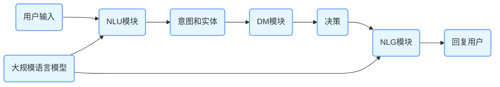

# 大规模语言模型在虚拟助手中的应用与优化

> 关键词：大规模语言模型、虚拟助手、应用、优化、自然语言处理

> 摘要：本文深入探讨了大规模语言模型在虚拟助手中的应用与优化。首先介绍了相关背景知识，包括目的、预期读者等。接着阐述了核心概念及联系，详细讲解了核心算法原理与操作步骤，运用数学模型和公式进行分析。通过项目实战给出代码案例及解释，探讨了实际应用场景。同时推荐了学习资源、开发工具框架和相关论文著作。最后总结了未来发展趋势与挑战，并提供了常见问题解答和扩展阅读参考资料，旨在为相关领域的研究和实践提供全面而深入的指导。

## 1. 背景介绍 
### 1.1 目的和范围
本文章的目的在于全面剖析大规模语言模型在虚拟助手中的应用方式以及如何对其进行优化。随着人工智能技术的飞速发展，大规模语言模型如GPT - 3、BERT等取得了显著的成果，虚拟助手作为其重要的应用场景之一，具有巨大的发展潜力。我们将研究大规模语言模型在虚拟助手不同功能模块中的应用，如对话管理、知识问答、任务执行等，同时探讨如何通过各种优化策略提升虚拟助手的性能，包括模型微调、数据增强、算法改进等。范围涵盖了从理论原理到实际项目开发，以及相关工具和资源的介绍。

### 1.2 预期读者
本文预期读者包括人工智能领域的研究人员、开发者、技术爱好者，以及对虚拟助手技术感兴趣的企业管理人员和产品经理。研究人员可以从中获取最新的研究思路和方法，开发者可以学习到具体的代码实现和优化技巧，技术爱好者能够了解大规模语言模型在虚拟助手中的应用原理，企业管理人员和产品经理可以从实际应用场景和发展趋势中获得产品规划和决策的参考。

### 1.3 文档结构概述
本文首先介绍背景知识，让读者对文章的目的、读者群体和结构有清晰的认识。接着阐述核心概念与联系，帮助读者理解大规模语言模型和虚拟助手的基本原理和架构。然后详细讲解核心算法原理和具体操作步骤，并运用数学模型和公式进行分析。通过项目实战部分，给出代码案例并进行详细解释。之后探讨实际应用场景，让读者了解大规模语言模型在虚拟助手中的实际用途。推荐学习资源、开发工具框架和相关论文著作，方便读者进一步深入学习。最后总结未来发展趋势与挑战，提供常见问题解答和扩展阅读参考资料。

### 1.4 术语表
#### 1.4.1 核心术语定义
- **大规模语言模型**：基于大量文本数据进行训练的深度学习模型，能够学习语言的统计规律和语义信息，具有强大的语言理解和生成能力，如GPT - 3、BLOOM等。
- **虚拟助手**：一种能够通过自然语言与用户进行交互，为用户提供信息、完成任务或提供服务的软件系统，常见的有Siri、小爱同学等。
- **微调（Fine - tuning）**：在预训练的大规模语言模型基础上，使用特定的数据集对模型进行进一步训练，以适应特定的任务或领域。
- **数据增强（Data Augmentation）**：通过对原始数据进行变换、扩充等操作，增加训练数据的多样性和数量，提高模型的泛化能力。

#### 1.4.2 相关概念解释
- **自然语言处理（NLP）**：研究如何让计算机理解和处理人类语言的技术领域，包括文本分类、命名实体识别、机器翻译等任务，大规模语言模型是NLP领域的重要研究成果。
- **深度学习**：一种基于人工神经网络的机器学习方法，通过构建多层神经网络模型，自动从数据中学习特征和模式，大规模语言模型通常采用深度学习技术进行训练。
- **Transformer架构**：一种用于处理序列数据的深度学习架构，具有并行计算能力和长序列处理能力，被广泛应用于大规模语言模型中。

#### 1.4.3 缩略词列表
- **NLP**：Natural Language Processing（自然语言处理）
- **GPT**：Generative Pretrained Transformer（生成式预训练变换器）
- **BERT**：Bidirectional Encoder Representations from Transformers（基于变换器的双向编码器表示）
- **API**：Application Programming Interface（应用程序编程接口）

## 2. 核心概念与联系 

### 核心概念原理
#### 大规模语言模型
大规模语言模型基于深度学习技术，通常采用Transformer架构。Transformer架构由编码器和解码器组成，编码器负责对输入的文本进行特征提取和表示，解码器则根据编码器的输出生成相应的文本。大规模语言模型通过在海量的文本数据上进行无监督学习，学习到语言的统计规律和语义信息。例如，在训练过程中，模型会学习到词语之间的共现关系、语法结构等。以GPT - 3为例，它通过自回归的方式进行训练，即根据前面的文本预测下一个词语的概率分布。

#### 虚拟助手
虚拟助手是一个综合性的系统，主要包括自然语言理解（NLU）、对话管理（DM）和自然语言生成（NLG）三个核心模块。自然语言理解模块负责将用户输入的自然语言文本转换为计算机能够理解的语义表示，例如识别用户的意图和提取关键信息。对话管理模块根据用户的意图和历史对话记录，决定如何回复用户，例如选择合适的回答策略和调用相应的服务。自然语言生成模块则将对话管理模块的决策转换为自然语言文本输出给用户。

### 架构的文本示意图
```plaintext
大规模语言模型
├── 预训练阶段
│   ├── 海量文本数据
│   ├── Transformer架构
│   └── 无监督学习
└── 微调阶段
    ├── 特定领域数据集
    └── 有监督学习

虚拟助手
├── 自然语言理解（NLU）
│   ├── 意图识别
│   └── 实体提取
├── 对话管理（DM）
│   ├── 对话策略选择
│   └── 服务调用
└── 自然语言生成（NLG）
    └── 文本生成
```

### Mermaid流程图


## 3. 核心算法原理 & 具体操作步骤 

### 核心算法原理
#### 大规模语言模型的训练算法
大规模语言模型通常采用基于Transformer架构的预训练和微调两个阶段的训练方法。在预训练阶段，使用无监督学习算法，如自回归语言模型（如GPT系列）或掩码语言模型（如BERT）。以自回归语言模型为例，其目标是最大化给定前面词语的情况下预测下一个词语的概率，即：

$$L = -\sum_{t = 1}^{T}\log P(w_t|w_1, w_2, \cdots, w_{t - 1})$$

其中，$w_t$ 表示第 $t$ 个词语，$T$ 是文本序列的长度，$P(w_t|w_1, w_2, \cdots, w_{t - 1})$ 是在给定前面 $t - 1$ 个词语的情况下预测第 $t$ 个词语的概率。

在微调阶段，使用有监督学习算法，根据具体的任务定义损失函数。例如，对于文本分类任务，通常使用交叉熵损失函数：

$$L = -\sum_{i = 1}^{N}\sum_{j = 1}^{C}y_{ij}\log\hat{y}_{ij}$$

其中，$N$ 是样本数量，$C$ 是类别数量，$y_{ij}$ 是第 $i$ 个样本的真实标签，$\hat{y}_{ij}$ 是模型预测的第 $i$ 个样本属于第 $j$ 类别的概率。

#### 虚拟助手的核心算法
虚拟助手的自然语言理解模块通常使用深度学习模型进行意图识别和实体提取。例如，可以使用基于Transformer的分类模型进行意图识别，将用户输入的文本编码为特征向量，然后通过全连接层进行分类。对话管理模块可以使用基于规则的方法或强化学习方法进行对话策略选择。自然语言生成模块则可以使用大规模语言模型进行文本生成。

### 具体操作步骤
#### 预训练大规模语言模型
1. **数据收集**：收集大量的文本数据，如维基百科、新闻文章等。
2. **数据预处理**：对收集到的数据进行清洗、分词等预处理操作。
3. **模型构建**：使用Transformer架构构建语言模型。
4. **模型训练**：使用无监督学习算法在预处理后的数据上进行训练。

#### 微调大规模语言模型用于虚拟助手
1. **特定领域数据集收集**：收集与虚拟助手任务相关的数据集，如对话数据集、问答数据集等。
2. **数据标注**：对特定领域数据集进行标注，例如标注用户意图和实体。
3. **模型微调**：在预训练的大规模语言模型基础上，使用有监督学习算法在特定领域数据集上进行微调。

#### 构建虚拟助手系统
1. **自然语言理解模块开发**：使用微调后的大规模语言模型或其他深度学习模型进行意图识别和实体提取。
2. **对话管理模块开发**：设计对话策略，使用规则或强化学习方法实现对话管理。
3. **自然语言生成模块开发**：使用微调后的大规模语言模型进行文本生成。
4. **系统集成**：将自然语言理解、对话管理和自然语言生成模块集成到一个系统中。

### Python源代码详细阐述
```python
import torch
import torch.nn as nn
from transformers import GPT2LMHeadModel, GPT2Tokenizer

# 加载预训练的GPT - 2模型和分词器
tokenizer = GPT2Tokenizer.from_pretrained('gpt2')
model = GPT2LMHeadModel.from_pretrained('gpt2')

# 定义输入文本
input_text = "Hello, how are you?"
input_ids = tokenizer.encode(input_text, return_tensors='pt')

# 生成回复
output = model.generate(input_ids, max_length=50, num_beams=5, no_repeat_ngram_size=2, early_stopping=True)
generated_text = tokenizer.decode(output[0], skip_special_tokens=True)

print("Generated text:", generated_text)
```
在上述代码中，首先使用 `transformers` 库加载预训练的GPT - 2模型和分词器。然后将输入文本编码为模型可以接受的输入格式，使用 `generate` 方法生成回复，最后将生成的回复解码为自然语言文本并打印输出。

## 4. 数学模型和公式 & 详细讲解 & 举例说明 

### 大规模语言模型的损失函数
#### 自回归语言模型损失函数
在自回归语言模型中，损失函数的目标是最大化给定前面词语的情况下预测下一个词语的概率。如前面所述，损失函数为：

$$L = -\sum_{t = 1}^{T}\log P(w_t|w_1, w_2, \cdots, w_{t - 1})$$

详细讲解：这个损失函数的核心思想是最小化模型预测的错误率。对于每个词语 $w_t$，模型会根据前面的词语 $w_1, w_2, \cdots, w_{t - 1}$ 预测其概率 $P(w_t|w_1, w_2, \cdots, w_{t - 1})$。通过取对数并求和，将多个词语的预测概率组合成一个损失值。负号的作用是将最大化概率问题转换为最小化损失问题。

举例说明：假设输入文本为 "I love programming"，模型在预测 "love" 时，需要根据前面的 "I" 来预测其概率 $P(\text{love}|\text{I})$。同样，在预测 "programming" 时，需要根据 "I love" 来预测其概率 $P(\text{programming}|\text{I}, \text{love})$。最终的损失值是所有词语预测概率对数的负值之和。

#### 交叉熵损失函数
在微调阶段，对于文本分类任务，交叉熵损失函数为：

$$L = -\sum_{i = 1}^{N}\sum_{j = 1}^{C}y_{ij}\log\hat{y}_{ij}$$

详细讲解：其中，$N$ 是样本数量，$C$ 是类别数量，$y_{ij}$ 是第 $i$ 个样本的真实标签，$\hat{y}_{ij}$ 是模型预测的第 $i$ 个样本属于第 $j$ 类别的概率。这个损失函数的作用是衡量模型预测的概率分布与真实标签之间的差异。当模型预测的概率分布与真实标签完全一致时，损失值为0；差异越大，损失值越大。

举例说明：假设有一个文本分类任务，类别有 "positive" 和 "negative" 两类，即 $C = 2$。有两个样本，即 $N = 2$。第一个样本的真实标签是 "positive"，即 $y_{11} = 1, y_{12} = 0$，模型预测该样本属于 "positive" 的概率为 $\hat{y}_{11} = 0.8$，属于 "negative" 的概率为 $\hat{y}_{12} = 0.2$。第二个样本的真实标签是 "negative"，即 $y_{21} = 0, y_{22} = 1$，模型预测该样本属于 "positive" 的概率为 $\hat{y}_{21} = 0.3$，属于 "negative" 的概率为 $\hat{y}_{22} = 0.7$。则损失值为：

$$L = -(1\times\log(0.8)+0\times\log(0.2)+0\times\log(0.3)+1\times\log(0.7))$$

### 注意力机制公式
在Transformer架构中，注意力机制是核心组件之一。注意力机制的公式为：

$$\text{Attention}(Q, K, V)=\text{softmax}\left(\frac{QK^T}{\sqrt{d_k}}\right)V$$

其中，$Q$ 是查询矩阵，$K$ 是键矩阵，$V$ 是值矩阵，$d_k$ 是键向量的维度。

详细讲解：注意力机制的作用是根据查询向量 $Q$ 从键值对 $(K, V)$ 中选择重要的信息。首先计算查询向量和键向量的相似度得分 $QK^T$，然后除以 $\sqrt{d_k}$ 进行缩放，以避免点积结果过大。接着使用softmax函数将相似度得分转换为概率分布，最后根据这个概率分布对值矩阵 $V$ 进行加权求和，得到注意力输出。

举例说明：假设有三个词向量 $v_1, v_2, v_3$，将它们分别作为键向量和值向量。查询向量 $q$ 用于计算与这些键向量的相似度。通过上述公式计算得到的注意力输出就是根据 $q$ 对 $v_1, v_2, v_3$ 进行加权组合的结果。

## 5. 项目实战：代码实际案例和详细解释说明 

### 5.1  开发环境搭建
#### 操作系统
可以选择Windows、Linux或macOS操作系统。这里以Ubuntu 20.04为例进行说明。

#### 安装Python
确保系统中安装了Python 3.7或更高版本。可以使用以下命令进行安装：
```bash
sudo apt update
sudo apt install python3 python3-pip
```

#### 安装必要的库
使用 `pip` 安装 `transformers`、`torch` 等必要的库：
```bash
pip install transformers torch
```

### 5.2  源代码详细实现和代码解读
```python
import torch
from transformers import GPT2LMHeadModel, GPT2Tokenizer

# 加载预训练的GPT - 2模型和分词器
tokenizer = GPT2Tokenizer.from_pretrained('gpt2')
model = GPT2LMHeadModel.from_pretrained('gpt2')

# 定义一个简单的虚拟助手类
class VirtualAssistant:
    def __init__(self, model, tokenizer):
        self.model = model
        self.tokenizer = tokenizer

    def generate_response(self, input_text):
        # 将输入文本编码为模型可以接受的输入格式
        input_ids = self.tokenizer.encode(input_text, return_tensors='pt')
        # 生成回复
        output = self.model.generate(input_ids, max_length=50, num_beams=5, no_repeat_ngram_size=2, early_stopping=True)
        # 将生成的回复解码为自然语言文本
        generated_text = self.tokenizer.decode(output[0], skip_special_tokens=True)
        return generated_text

# 创建虚拟助手实例
assistant = VirtualAssistant(model, tokenizer)

# 模拟用户输入
user_input = "What is the weather like today?"
# 生成回复
response = assistant.generate_response(user_input)

print("User input:", user_input)
print("Assistant response:", response)
```
### 代码解读与分析
1. **库的导入**：导入 `torch` 库用于深度学习计算，导入 `GPT2LMHeadModel` 和 `GPT2Tokenizer` 用于加载预训练的GPT - 2模型和分词器。
2. **模型和分词器的加载**：使用 `from_pretrained` 方法加载预训练的GPT - 2模型和分词器。
3. **虚拟助手类的定义**：定义了一个 `VirtualAssistant` 类，其中 `__init__` 方法用于初始化模型和分词器，`generate_response` 方法用于根据用户输入生成回复。在 `generate_response` 方法中，首先将用户输入的文本编码为模型可以接受的输入格式，然后使用 `generate` 方法生成回复，最后将生成的回复解码为自然语言文本。
4. **虚拟助手实例的创建**：创建 `VirtualAssistant` 类的实例。
5. **模拟用户输入和生成回复**：模拟用户输入一个问题，调用 `generate_response` 方法生成回复，并打印输出用户输入和助手回复。

## 6. 实际应用场景 
### 智能客服
大规模语言模型驱动的虚拟助手可以在智能客服场景中发挥重要作用。它可以自动回答客户的常见问题，如产品信息咨询、订单状态查询等。通过对大量的客户对话数据进行微调，虚拟助手可以更好地理解客户的意图，提供准确的回答。例如，在电商平台的客服系统中，虚拟助手可以快速响应客户的咨询，提高客户服务效率，降低人工客服的工作量。

### 智能家居控制
虚拟助手可以与智能家居设备集成，实现通过自然语言控制智能家居设备的功能。用户可以通过语音指令让虚拟助手打开灯光、调节温度、播放音乐等。大规模语言模型的强大语言理解能力可以确保虚拟助手准确理解用户的指令，并与智能家居设备进行有效的交互。例如，小米小爱同学可以与小米生态链的各种智能家居设备连接，为用户提供便捷的智能家居控制体验。

### 智能教育
在智能教育领域，虚拟助手可以作为学生的学习伙伴。它可以回答学生的问题，提供学习资料和建议，帮助学生解决学习中遇到的困难。例如，对于数学问题，虚拟助手可以给出解题思路和步骤；对于英语学习，虚拟助手可以进行单词解释、语法讲解等。通过对教育领域的文本数据进行微调，虚拟助手可以更好地适应教育场景的需求。

### 金融服务
在金融服务领域，虚拟助手可以为客户提供金融咨询服务，如股票行情查询、理财产品推荐等。它可以根据客户的财务状况和风险偏好，提供个性化的金融建议。同时，虚拟助手还可以帮助客户完成一些简单的金融操作，如转账、缴费等。通过对金融领域的专业知识和业务流程进行学习，虚拟助手可以提高金融服务的效率和质量。

## 7. 工具和资源推荐
### 7.1 学习资源推荐
#### 7.1.1 书籍推荐
- 《深度学习》（Deep Learning）：由Ian Goodfellow、Yoshua Bengio和Aaron Courville所著，是深度学习领域的经典教材，涵盖了深度学习的基本原理、算法和应用。
- 《自然语言处理入门》：何晗著，适合初学者入门自然语言处理领域，介绍了自然语言处理的基本概念、算法和实践案例。
- 《Python自然语言处理》（Natural Language Processing with Python）：Steven Bird、Ewan Klein和Edward Loper所著，详细介绍了使用Python进行自然语言处理的方法和技术。

#### 7.1.2 在线课程
- Coursera上的“深度学习专项课程”（Deep Learning Specialization）：由Andrew Ng教授授课，系统地介绍了深度学习的各个方面，包括神经网络、卷积神经网络、循环神经网络等。
- edX上的“自然语言处理基础”（Foundations of Natural Language Processing）：介绍了自然语言处理的基本概念、算法和应用，适合初学者学习。
- 哔哩哔哩上的一些自然语言处理和深度学习相关的视频教程，如李沐的《动手学深度学习》视频课程，通过实际代码演示帮助学习者理解和掌握相关知识。

#### 7.1.3 技术博客和网站
- Hugging Face博客：提供了关于大规模语言模型和自然语言处理的最新研究成果和技术动态，同时也有很多实用的教程和代码示例。
- Medium上的AI相关博客：有很多专业的技术人员分享自然语言处理和大规模语言模型的研究和实践经验。
- 机器之心、新智元等科技媒体网站：关注人工智能领域的最新发展，提供了很多关于大规模语言模型和虚拟助手的报道和分析。

### 7.2 开发工具框架推荐
#### 7.2.1 IDE和编辑器
- PyCharm：一款专业的Python集成开发环境，具有代码自动补全、调试、版本控制等功能，适合Python开发。
- Jupyter Notebook：一种交互式的开发环境，支持Python代码的编写、运行和可视化展示，非常适合进行数据分析和模型实验。
- Visual Studio Code：一款轻量级的代码编辑器，支持多种编程语言，通过安装插件可以扩展其功能，如Python开发、代码调试等。

#### 7.2.2 调试和性能分析工具
- TensorBoard：一个用于可视化深度学习模型训练过程和性能指标的工具，可以帮助开发者监控模型的训练进度、损失函数变化等。
- PyTorch Profiler：PyTorch提供的性能分析工具，可以帮助开发者找出模型训练和推理过程中的性能瓶颈，优化代码性能。
- cProfile：Python内置的性能分析模块，可以分析Python代码的运行时间和函数调用情况，帮助开发者找出代码中的性能问题。

#### 7.2.3 相关框架和库
- Transformers：Hugging Face开发的一个开源库，提供了多种预训练的大规模语言模型，如GPT - 2、BERT等，以及模型加载、微调、推理等功能。
- PyTorch：一个开源的深度学习框架，具有动态计算图、自动求导等特点，广泛应用于自然语言处理和深度学习领域。
- NLTK（Natural Language Toolkit）：一个Python库，提供了丰富的自然语言处理工具和数据集，如分词、词性标注、命名实体识别等。

### 7.3 相关论文著作推荐
#### 7.3.1 经典论文
- 《Attention Is All You Need》：提出了Transformer架构，是大规模语言模型的核心技术之一。
- 《BERT: Pre-training of Deep Bidirectional Transformers for Language Understanding》：介绍了BERT模型，开创了基于掩码语言模型的预训练方法。
- 《Improving Language Understanding by Generative Pre-Training》：介绍了GPT模型，提出了基于自回归语言模型的预训练方法。

#### 7.3.2 最新研究成果
- 关注顶级学术会议如ACL（Association for Computational Linguistics）、EMNLP（Conference on Empirical Methods in Natural Language Processing）等的论文，了解大规模语言模型和虚拟助手领域的最新研究进展。
- arXiv上的相关论文，很多研究人员会在arXiv上发布他们的最新研究成果。

#### 7.3.3 应用案例分析
- 一些知名科技公司的技术博客和研究报告，如Google、Microsoft、OpenAI等，会分享他们在大规模语言模型和虚拟助手应用方面的实践经验和案例分析。

## 8. 总结：未来发展趋势与挑战
### 未来发展趋势
#### 多模态融合
未来的虚拟助手将不仅仅局限于处理文本信息，而是会融合语音、图像、视频等多种模态的信息。例如，用户可以通过语音和手势同时与虚拟助手进行交互，虚拟助手可以根据用户提供的图像信息进行识别和回答。多模态融合将使虚拟助手的交互更加自然和便捷。

#### 个性化定制
随着用户数据的积累和分析技术的发展，虚拟助手将能够为用户提供更加个性化的服务。虚拟助手可以根据用户的兴趣、习惯、历史记录等信息，为用户提供个性化的推荐和建议。例如，在新闻推荐方面，虚拟助手可以根据用户的阅读偏好推送相关的新闻文章。

#### 知识增强
大规模语言模型虽然具有强大的语言生成能力，但在知识的准确性和深度方面还存在一定的不足。未来的虚拟助手将结合知识图谱等技术，对大规模语言模型进行知识增强，使其能够提供更加准确和专业的知识回答。例如，在医学领域，虚拟助手可以结合医学知识图谱，为用户提供准确的医学诊断和治疗建议。

#### 端侧部署
为了提高虚拟助手的响应速度和数据安全性，未来的虚拟助手将更多地采用端侧部署的方式。即把模型部署在用户的设备上，如手机、智能手表等，用户的输入数据不需要上传到云端进行处理，从而减少了延迟和数据泄露的风险。

### 挑战
#### 数据隐私和安全
大规模语言模型的训练需要大量的数据，这些数据可能包含用户的隐私信息。在虚拟助手的应用中，如何保护用户的数据隐私和安全是一个重要的挑战。需要采取有效的数据加密、访问控制等技术手段，确保用户数据不被泄露和滥用。

#### 模型可解释性
大规模语言模型通常是一个黑盒模型，其决策过程难以解释。在一些关键应用场景中，如医疗诊断、金融决策等，模型的可解释性非常重要。如何提高大规模语言模型的可解释性，让用户能够理解模型的决策依据，是当前面临的一个挑战。

#### 计算资源需求
大规模语言模型的训练和推理需要大量的计算资源，如GPU、TPU等。这不仅增加了开发和应用的成本，也对能源消耗和环境造成了一定的压力。如何优化模型结构和算法，降低计算资源需求，是未来需要解决的问题。

#### 语言和文化差异
不同的语言和文化具有不同的表达方式和语义理解。大规模语言模型在跨语言和跨文化应用中可能会遇到困难。如何让虚拟助手能够适应不同的语言和文化环境，提供准确和合适的回答，是一个具有挑战性的问题。

## 9. 附录：常见问题与解答
### 大规模语言模型在虚拟助手中的应用有哪些优势？
大规模语言模型具有强大的语言理解和生成能力，能够处理各种自然语言任务。在虚拟助手中应用大规模语言模型可以提高虚拟助手的对话能力、知识问答能力和任务执行能力，使其能够更好地理解用户的意图，提供准确和自然的回复。

### 如何对大规模语言模型进行微调以适应虚拟助手的任务？
首先需要收集与虚拟助手任务相关的数据集，并对数据集进行标注。然后在预训练的大规模语言模型基础上，使用有监督学习算法在标注好的数据集上进行微调。在微调过程中，需要选择合适的损失函数和优化器，调整学习率等超参数，以获得最佳的微调效果。

### 虚拟助手的自然语言理解模块和自然语言生成模块有什么区别？
自然语言理解模块负责将用户输入的自然语言文本转换为计算机能够理解的语义表示，例如识别用户的意图和提取关键信息。自然语言生成模块则将对话管理模块的决策转换为自然语言文本输出给用户。简单来说，自然语言理解是将文本转化为语义，而自然语言生成是将语义转化为文本。

### 大规模语言模型在虚拟助手中的应用存在哪些局限性？
大规模语言模型在虚拟助手中的应用存在一些局限性，如模型的可解释性较差，难以理解其决策过程；可能会生成一些不准确或不合理的回答；对计算资源的需求较大，导致成本较高；在处理特定领域的专业知识时可能不够准确等。

### 如何评估虚拟助手的性能？
可以从多个方面评估虚拟助手的性能，如准确率、召回率、F1值等指标用于评估自然语言理解模块的意图识别和实体提取性能；BLEU、ROUGE等指标用于评估自然语言生成模块的文本生成质量；用户满意度调查可以了解用户对虚拟助手的整体评价和使用体验。

## 10. 扩展阅读 & 参考资料
### 扩展阅读
- 《人工智能时代的语言与智能》：深入探讨了人工智能与自然语言处理的关系，以及大规模语言模型的发展趋势。
- 《智能时代》：介绍了人工智能在各个领域的应用，包括虚拟助手的发展现状和未来前景。
- 《第四次工业革命》：探讨了人工智能、大数据等技术对社会和经济的影响，以及虚拟助手在其中的作用。

### 参考资料
- Hugging Face官方文档：https://huggingface.co/docs
- PyTorch官方文档：https://pytorch.org/docs/stable/index.html
- NLTK官方文档：https://www.nltk.org/

作者：AI天才研究院/AI Genius Institute & 禅与计算机程序设计艺术 /Zen And The Art of Computer Programming