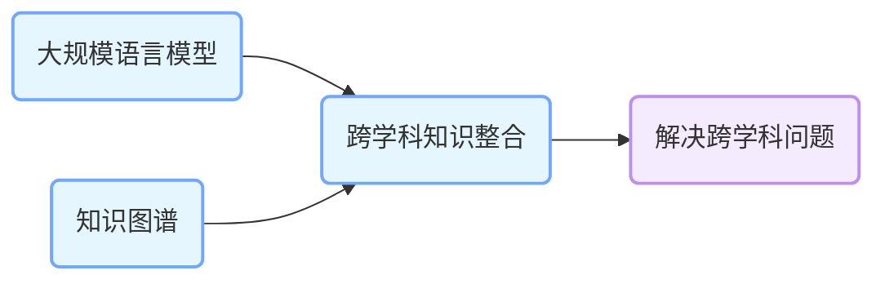

# 大规模语言模型在跨学科知识整合中的应用

> 关键词：大规模语言模型、跨学科知识整合、自然语言处理、知识图谱、应用场景

> 摘要：本文深入探讨了大规模语言模型在跨学科知识整合中的应用。首先介绍了相关背景，包括目的范围、预期读者等内容。接着阐述了核心概念与联系，分析了核心算法原理并给出具体操作步骤，同时详细讲解了数学模型和公式。通过项目实战展示了代码实现和解读，探讨了实际应用场景。还推荐了学习资源、开发工具框架以及相关论文著作。最后总结了未来发展趋势与挑战，并提供了常见问题解答和扩展阅读参考资料，旨在为利用大规模语言模型进行跨学科知识整合提供全面的技术指导和理论支持。

## 1. 背景介绍 
### 1.1 目的和范围
随着科学技术的不断发展，学科之间的交叉融合日益频繁。跨学科研究需要整合来自不同领域的知识，然而传统的知识整合方法面临着诸多挑战，如信息获取困难、知识表示不统一等。大规模语言模型的出现为跨学科知识整合提供了新的思路和方法。本文的目的在于深入研究大规模语言模型在跨学科知识整合中的应用，探讨其原理、方法和实际应用场景，为相关领域的研究和实践提供参考。
本文的范围涵盖了大规模语言模型的基本原理、跨学科知识整合的概念和方法，以及两者结合的具体应用。同时，通过实际案例展示了大规模语言模型在跨学科知识整合中的效果，并对未来的发展趋势和挑战进行了分析。

### 1.2 预期读者
本文预期读者包括计算机科学、自然语言处理、各学科领域的研究人员和从业者，以及对跨学科研究和大规模语言模型感兴趣的学生和爱好者。对于计算机科学和自然语言处理领域的专业人士，本文可以提供新的应用思路和技术方法；对于各学科领域的研究人员和从业者，本文可以帮助他们了解如何利用大规模语言模型进行跨学科知识整合，促进学科之间的交流与合作；对于学生和爱好者，本文可以作为学习和了解相关领域知识的参考资料。

### 1.3 文档结构概述
本文将按照以下结构进行组织：
- 核心概念与联系：介绍大规模语言模型和跨学科知识整合的核心概念，以及它们之间的联系。
- 核心算法原理 & 具体操作步骤：详细讲解大规模语言模型的核心算法原理，并给出利用大规模语言模型进行跨学科知识整合的具体操作步骤。
- 数学模型和公式 & 详细讲解 & 举例说明：介绍相关的数学模型和公式，并通过具体例子进行详细讲解。
- 项目实战：代码实际案例和详细解释说明：通过实际项目案例，展示如何使用代码实现大规模语言模型在跨学科知识整合中的应用，并对代码进行详细解释。
- 实际应用场景：探讨大规模语言模型在跨学科知识整合中的实际应用场景。
- 工具和资源推荐：推荐相关的学习资源、开发工具框架和论文著作。
- 总结：未来发展趋势与挑战：总结大规模语言模型在跨学科知识整合中的应用现状，分析未来的发展趋势和面临的挑战。
- 附录：常见问题与解答：提供常见问题的解答，帮助读者更好地理解和应用相关知识。
- 扩展阅读 & 参考资料：提供扩展阅读的建议和相关参考资料，方便读者进一步深入学习。

### 1.4 术语表
#### 1.4.1 核心术语定义
- **大规模语言模型**：是一种基于深度学习的自然语言处理模型，通过在大规模文本数据上进行训练，学习语言的模式和规律，能够生成自然流畅的文本、回答问题、进行文本分类等任务。
- **跨学科知识整合**：指的是将来自不同学科领域的知识进行有机结合，形成一个统一的知识体系，以解决复杂的跨学科问题。
- **知识图谱**：是一种以图的形式表示知识的方法，由节点和边组成，节点表示实体，边表示实体之间的关系，能够有效地组织和管理知识。

#### 1.4.2 相关概念解释
- **自然语言处理**：是计算机科学与语言学的交叉领域，旨在让计算机能够理解、处理和生成自然语言。大规模语言模型是自然语言处理中的一种重要技术。
- **深度学习**：是一种基于人工神经网络的机器学习方法，通过多层神经网络对数据进行学习和表示，能够自动提取数据中的特征和模式。大规模语言模型通常基于深度学习技术构建。

#### 1.4.3 缩略词列表
- **NLP**：Natural Language Processing，自然语言处理
- **LLM**：Large Language Model，大规模语言模型
- **KG**：Knowledge Graph，知识图谱

## 2. 核心概念与联系 

### 大规模语言模型
大规模语言模型是自然语言处理领域的重要成果。它通常基于Transformer架构，如GPT（Generative Pretrained Transformer）系列、BERT（Bidirectional Encoder Representations from Transformers）等。这些模型通过在海量的文本数据上进行无监督学习，学习到语言的语法、语义和语用等方面的知识。

Transformer架构的核心是多头自注意力机制（Multi - Head Self - Attention），它允许模型在处理输入序列时，动态地关注序列中的不同部分，从而捕捉长距离的依赖关系。图1展示了Transformer架构的示意图。


图1：Transformer架构示意图

### 跨学科知识整合
跨学科知识整合是指将来自不同学科领域的知识进行融合和关联，以解决复杂的问题。不同学科有着各自独特的知识体系、研究方法和术语，跨学科知识整合的挑战在于如何打破学科界限，实现知识的有效共享和协同。

### 两者的联系
大规模语言模型在跨学科知识整合中具有重要作用。首先，大规模语言模型可以作为知识的载体，它在训练过程中吸收了大量来自不同领域的文本信息，包含了丰富的跨学科知识。其次，大规模语言模型的文本生成和理解能力可以用于对跨学科知识进行梳理和表达。例如，它可以将不同学科的术语进行统一解释，将分散的知识进行整合和总结。

大规模语言模型还可以与知识图谱相结合，知识图谱可以将跨学科知识以结构化的方式表示，而大规模语言模型可以为知识图谱的构建和更新提供支持，如从文本中提取实体和关系，填充到知识图谱中。图2展示了大规模语言模型与跨学科知识整合的关系。


图2：大规模语言模型与跨学科知识整合的关系

## 3. 核心算法原理 & 具体操作步骤 

### 核心算法原理 - Transformer架构
Transformer架构主要由编码器（Encoder）和解码器（Decoder）组成。这里以GPT系列模型为例，主要使用解码器部分。

#### 多头自注意力机制
多头自注意力机制是Transformer的核心组件之一。对于输入序列 $X = [x_1, x_2, \cdots, x_n]$，首先通过线性变换将其映射到查询（Query）、键（Key）和值（Value）三个空间，分别得到 $Q = [q_1, q_2, \cdots, q_n]$，$K = [k_1, k_2, \cdots, k_n]$ 和 $V = [v_1, v_2, \cdots, v_n]$。

对于每个位置 $i$，其注意力得分计算如下：
$$
\text{Attention}(Q, K, V)_i = \text{softmax}\left(\frac{Q_iK^T}{\sqrt{d_k}}\right)V
$$
其中，$d_k$ 是键向量的维度。多头自注意力机制将输入分成多个头，每个头独立计算注意力，最后将结果拼接并通过线性变换得到最终输出。

以下是使用Python和PyTorch实现的多头自注意力机制代码：
```python
import torch
import torch.nn as nn

class MultiHeadAttention(nn.Module):
    def __init__(self, embed_size, num_heads):
        super(MultiHeadAttention, self).__init__()
        self.embed_size = embed_size
        self.num_heads = num_heads
        self.head_dim = embed_size // num_heads

        assert (
            self.head_dim * num_heads == embed_size
        ), "Embedding size needs to be divisible by number of heads"

        self.qkv_proj = nn.Linear(embed_size, 3 * embed_size)
        self.out_proj = nn.Linear(embed_size, embed_size)

    def forward(self, x):
        batch_size, seq_length, embed_size = x.size()
        qkv = self.qkv_proj(x)
        q, k, v = qkv.chunk(3, dim=-1)

        q = q.view(batch_size, seq_length, self.num_heads, self.head_dim).transpose(1, 2)
        k = k.view(batch_size, seq_length, self.num_heads, self.head_dim).transpose(1, 2)
        v = v.view(batch_size, seq_length, self.num_heads, self.head_dim).transpose(1, 2)

        attn_scores = torch.matmul(q, k.transpose(-2, -1)) / (self.head_dim ** 0.5)
        attn_probs = torch.softmax(attn_scores, dim=-1)
        output = torch.matmul(attn_probs, v)

        output = output.transpose(1, 2).contiguous().view(batch_size, seq_length, embed_size)
        return self.out_proj(output)


# 示例使用
embed_size = 512
num_heads = 8
model = MultiHeadAttention(embed_size, num_heads)
x = torch.randn(32, 10, embed_size)  # 批量大小为32，序列长度为10
output = model(x)
print(output.shape)
```

#### 前馈神经网络
前馈神经网络由两个线性层和一个非线性激活函数（通常是ReLU）组成。对于输入 $x$，前馈神经网络的计算如下：
$$
\text{FFN}(x) = \text{ReLU}(xW_1 + b_1)W_2 + b_2
$$
其中，$W_1$，$W_2$ 是权重矩阵，$b_1$，$b_2$ 是偏置向量。

### 具体操作步骤
#### 步骤1：数据收集与预处理
收集来自不同学科领域的文本数据，如学术论文、书籍、报告等。对数据进行清洗，去除噪声和无用信息，进行分词、词性标注等预处理操作。

#### 步骤2：模型训练
使用预处理后的数据对大规模语言模型进行训练。可以使用预训练模型进行微调，以适应跨学科知识整合的任务。训练过程中，使用合适的损失函数（如交叉熵损失）来优化模型参数。

#### 步骤3：知识提取与整合
使用训练好的模型对跨学科文本进行处理，提取实体、关系和知识。可以将提取的知识存储到知识图谱中，实现知识的结构化表示和整合。

#### 步骤4：应用与评估
将整合后的跨学科知识应用到实际问题中，如跨学科研究、智能问答等。同时，使用合适的评估指标（如准确率、召回率等）对知识整合的效果进行评估，根据评估结果对模型和方法进行优化。

## 4. 数学模型和公式 & 详细讲解 & 举例说明 

### 损失函数 - 交叉熵损失
在大规模语言模型的训练中，常用的损失函数是交叉熵损失。对于分类问题，假设模型的输出为 $\hat{y} = [\hat{y}_1, \hat{y}_2, \cdots, \hat{y}_C]$，其中 $\hat{y}_i$ 表示第 $i$ 类的预测概率，真实标签为 $y = [y_1, y_2, \cdots, y_C]$，其中 $y_i$ 是一个二进制向量，只有一个元素为 1，表示真实类别。

交叉熵损失的计算公式为：
$$
H(y, \hat{y}) = -\sum_{i = 1}^{C}y_i\log(\hat{y}_i)
$$

例如，假设我们有一个三分类问题，真实标签 $y = [0, 1, 0]$，模型的预测概率 $\hat{y} = [0.1, 0.7, 0.2]$。则交叉熵损失为：
$$
H(y, \hat{y}) = -(0\times\log(0.1)+1\times\log(0.7)+0\times\log(0.2)) \approx 0.357
$$

### 注意力机制的数学原理
在多头自注意力机制中，注意力得分的计算是基于查询（Query）、键（Key）和值（Value）的。假设查询向量 $q$，键向量 $k$，值向量 $v$，注意力得分 $s$ 的计算公式为：
$$
s = \frac{q\cdot k}{\sqrt{d_k}}
$$
其中，$d_k$ 是键向量的维度。除以 $\sqrt{d_k}$ 是为了防止点积结果过大，导致梯度消失或爆炸。

例如，假设 $q = [1, 2, 3]$，$k = [4, 5, 6]$，$d_k = 3$，则注意力得分 $s$ 为：
$$
s = \frac{1\times4 + 2\times5+3\times6}{\sqrt{3}}=\frac{4 + 10+18}{\sqrt{3}}=\frac{32}{\sqrt{3}}\approx18.47
$$

### 前馈神经网络的数学模型
前馈神经网络的计算公式为：
$$
\text{FFN}(x) = \text{ReLU}(xW_1 + b_1)W_2 + b_2
$$
假设输入 $x$ 是一个长度为 $n$ 的向量，$W_1$ 是一个 $n\times m$ 的矩阵，$b_1$ 是一个长度为 $m$ 的向量，$W_2$ 是一个 $m\times p$ 的矩阵，$b_2$ 是一个长度为 $p$ 的向量。

例如，假设 $x = [1, 2]$，$W_1=\begin{bmatrix}1 & 2\\3 & 4\end{bmatrix}$，$b_1 = [0.1, 0.2]$，$W_2=\begin{bmatrix}0.5 & 0.6\\0.7 & 0.8\end{bmatrix}$，$b_2 = [0.01, 0.02]$。

首先计算 $xW_1 + b_1$：
$$
xW_1 + b_1=[1, 2]\begin{bmatrix}1 & 2\\3 & 4\end{bmatrix}+[0.1, 0.2]=[1\times1 + 2\times3, 1\times2+2\times4]+[0.1, 0.2]=[7.1, 10.2]
$$
然后应用ReLU激活函数：
$$
\text{ReLU}([7.1, 10.2])=[7.1, 10.2]
$$
最后计算 $\text{ReLU}(xW_1 + b_1)W_2 + b_2$：
$$
[7.1, 10.2]\begin{bmatrix}0.5 & 0.6\\0.7 & 0.8\end{bmatrix}+[0.01, 0.02]=[7.1\times0.5 + 10.2\times0.7, 7.1\times0.6+10.2\times0.8]+[0.01, 0.02]=[10.99, 12.98]
$$


## 5. 项目实战：代码实际案例和详细解释说明 

### 5.1  开发环境搭建
#### 硬件环境
- 建议使用具有GPU加速的计算机，如NVIDIA GPU，以提高模型训练和推理的速度。例如，NVIDIA Tesla V100、NVIDIA RTX 3090等。
- 至少需要16GB以上的内存，以确保能够处理大规模的数据和模型。

#### 软件环境
- **操作系统**：推荐使用Linux系统，如Ubuntu 18.04或更高版本。
- **Python**：使用Python 3.7或更高版本。
- **深度学习框架**：使用PyTorch，可通过以下命令安装：
```bash
pip install torch torchvision torchaudio
```
- **其他依赖库**：安装`transformers`库，用于使用预训练的大规模语言模型：
```bash
pip install transformers
```

### 5.2  源代码详细实现和代码解读
以下是一个使用Hugging Face的`transformers`库进行跨学科知识问答的示例代码：
```python
from transformers import AutoTokenizer, AutoModelForQuestionAnswering
import torch

# 加载预训练的模型和分词器
tokenizer = AutoTokenizer.from_pretrained("bert-large-uncased-whole-word-masking-finetuned-squad")
model = AutoModelForQuestionAnswering.from_pretrained("bert-large-uncased-whole-word-masking-finetuned-squad")

# 跨学科知识文本
context = """
在物理学中，牛顿第二定律表明力等于质量乘以加速度（F = ma）。在生物学中，细胞是生命的基本单位。
化学中，水的化学式是H₂O。
"""

# 问题
question = "生物学中生命的基本单位是什么？"

# 对问题和文本进行编码
inputs = tokenizer(question, context, return_tensors='pt')

# 模型推理
with torch.no_grad():
    outputs = model(**inputs)

# 获取答案的起始和结束位置
answer_start_index = outputs.start_logits.argmax()
answer_end_index = outputs.end_logits.argmax()

# 提取答案
predict_answer_tokens = inputs.input_ids[0, answer_start_index : answer_end_index + 1]
answer = tokenizer.decode(predict_answer_tokens)

print("问题:", question)
print("答案:", answer)
```

### 5.3  代码解读与分析
- **加载模型和分词器**：使用`AutoTokenizer`和`AutoModelForQuestionAnswering`从Hugging Face的模型库中加载预训练的BERT模型和对应的分词器。这里使用的是在SQuAD数据集上微调过的`bert-large-uncased-whole-word-masking-finetuned-squad`模型。
- **定义跨学科知识文本和问题**：`context`中包含了来自物理学、生物学和化学的跨学科知识，`question`是一个关于生物学的问题。
- **编码输入**：使用分词器对问题和文本进行编码，将其转换为模型可以接受的输入格式。
- **模型推理**：使用`torch.no_grad()`上下文管理器关闭梯度计算，提高推理速度。调用模型进行推理，得到答案的起始和结束位置的对数概率。
- **提取答案**：通过`argmax()`方法找到起始和结束位置的索引，从输入的编码中提取答案的标记，最后使用分词器将标记解码为文本。

这个示例展示了如何使用大规模语言模型进行跨学科知识问答，通过简单的代码实现了从跨学科文本中提取相关知识的功能。

## 6. 实际应用场景 
### 跨学科研究辅助
在跨学科研究中，研究人员需要了解不同学科领域的知识。大规模语言模型可以作为研究辅助工具，帮助研究人员快速获取相关领域的知识。例如，在环境科学与经济学的交叉研究中，研究人员可以使用大规模语言模型查询环境政策对经济发展的影响等相关知识。模型可以整合不同学科的文献和数据，为研究人员提供全面的信息支持。

### 智能教育
在教育领域，大规模语言模型可以用于开发智能教学系统。例如，在综合课程的教学中，教师可以利用大规模语言模型为学生提供跨学科的学习资源和解答问题。模型可以将不同学科的知识进行整合，以生动易懂的方式呈现给学生，帮助学生建立跨学科的思维方式。

### 跨学科知识管理
企业和机构在运营过程中可能涉及多个学科领域的知识。大规模语言模型可以用于构建跨学科知识管理系统，对企业内部的文档、报告等知识资源进行整合和管理。模型可以自动提取知识，建立知识图谱，方便员工快速查询和利用跨学科知识。

### 医疗领域的跨学科应用
在医疗领域，疾病的诊断和治疗往往需要综合考虑生物学、医学、化学等多个学科的知识。大规模语言模型可以整合这些跨学科知识，为医生提供辅助诊断和治疗建议。例如，在癌症治疗中，模型可以结合肿瘤生物学、药物化学和临床治疗经验，为医生提供个性化的治疗方案。

## 7. 工具和资源推荐
### 7.1 学习资源推荐
#### 7.1.1 书籍推荐
- 《深度学习》（Deep Learning）：由Ian Goodfellow、Yoshua Bengio和Aaron Courville所著，是深度学习领域的经典教材，详细介绍了深度学习的基本原理和方法。
- 《自然语言处理入门》：作者何晗，这本书适合初学者，系统地介绍了自然语言处理的基本概念、算法和应用。
- 《人工智能：一种现代的方法》（Artificial Intelligence: A Modern Approach）：由Stuart Russell和Peter Norvig编写，涵盖了人工智能的各个方面，包括自然语言处理和大规模语言模型的相关内容。

#### 7.1.2 在线课程
- Coursera上的“Deep Learning Specialization”：由Andrew Ng教授授课，提供了深度学习的全面介绍，包括神经网络、卷积神经网络和循环神经网络等内容。
- edX上的“Natural Language Processing with Deep Learning”：介绍了自然语言处理中深度学习的应用，包括词嵌入、序列模型和注意力机制等。
- Hugging Face的官方教程：提供了关于使用`transformers`库进行自然语言处理的详细教程，包括模型的使用、微调等内容。

#### 7.1.3 技术博客和网站
- Medium：有很多关于自然语言处理和大规模语言模型的技术文章，作者来自不同的领域和公司。
- arXiv：是一个预印本数据库，包含了大量最新的学术研究论文，特别是关于人工智能和自然语言处理的研究。
- Hugging Face的博客：发布了关于大规模语言模型的最新进展和应用案例。

### 7.2 开发工具框架推荐
#### 7.2.1 IDE和编辑器
- PyCharm：是一款专业的Python集成开发环境，提供了丰富的代码编辑、调试和版本控制功能。
- Visual Studio Code：是一款轻量级的代码编辑器，支持多种编程语言和插件，适合快速开发和调试。

#### 7.2.2 调试和性能分析工具
- TensorBoard：是TensorFlow的可视化工具，也可以用于PyTorch项目。它可以帮助开发者可视化模型的训练过程、损失函数变化和性能指标等。
- PyTorch Profiler：可以用于分析PyTorch模型的性能瓶颈，找出耗时的操作和内存使用情况。

#### 7.2.3 相关框架和库
- Hugging Face `transformers`：提供了大量预训练的语言模型和工具，方便开发者进行自然语言处理任务的开发。
- AllenNLP：是一个用于自然语言处理的深度学习框架，提供了丰富的模型和工具，支持快速实验和开发。
- spaCy：是一个高效的自然语言处理库，提供了分词、词性标注、命名实体识别等功能，适合处理大规模文本数据。

### 7.3 相关论文著作推荐
#### 7.3.1 经典论文
- “Attention Is All You Need”：提出了Transformer架构，是大规模语言模型的基础。
- “BERT: Pre-training of Deep Bidirectional Transformers for Language Understanding”：介绍了BERT模型，开创了预训练 - 微调的自然语言处理范式。
- “GPT: Generative Pretrained Transformer”：首次提出了GPT模型，展示了生成式预训练模型在自然语言处理中的强大能力。

#### 7.3.2 最新研究成果
- 关注ACL（Association for Computational Linguistics）、EMNLP（Conference on Empirical Methods in Natural Language Processing）等自然语言处理领域的顶级会议，这些会议上会发表最新的研究成果。
- 可以在arXiv上搜索关于大规模语言模型和跨学科知识整合的最新论文。

#### 7.3.3 应用案例分析
- 一些知名科技公司的博客和研究报告中会分享大规模语言模型在不同领域的应用案例，如Google、Microsoft、OpenAI等公司的官方网站。
- 相关的行业报告和白皮书也会介绍大规模语言模型在跨学科知识整合中的实际应用情况。

## 8. 总结：未来发展趋势与挑战
### 未来发展趋势
#### 模型性能提升
随着计算资源的不断增加和算法的不断改进，大规模语言模型的性能将不断提升。模型将能够更好地理解和处理跨学科知识，生成更加准确和自然的文本。

#### 多模态融合
未来的大规模语言模型将不仅仅局限于处理文本数据，还将与图像、音频等多模态数据进行融合。例如，在医学领域，模型可以结合医学影像和病历文本进行综合分析，提供更准确的诊断和治疗建议。

#### 个性化应用
大规模语言模型将向个性化方向发展，能够根据用户的需求和背景提供定制化的跨学科知识服务。例如，在教育领域，为不同学习阶段和兴趣的学生提供个性化的学习资源和辅导。

### 挑战
#### 数据质量和多样性
大规模语言模型的性能高度依赖于训练数据的质量和多样性。在跨学科知识整合中，需要收集来自不同学科领域的高质量数据，并且要保证数据的平衡和多样性。否则，模型可能会出现偏见和局限性。

#### 计算资源需求
训练和运行大规模语言模型需要大量的计算资源，包括高性能的GPU和大规模的存储设备。这对于一些研究机构和企业来说是一个巨大的挑战，限制了模型的广泛应用。

#### 伦理和安全问题
大规模语言模型的应用也带来了一些伦理和安全问题。例如，模型可能会生成虚假信息、传播偏见等。此外，模型的安全性也面临着挑战，如数据泄露、模型被攻击等问题。

## 9. 附录：常见问题与解答
### 问题1：大规模语言模型在跨学科知识整合中的准确性如何保证？
解答：可以通过以下几种方式保证准确性：一是使用高质量、多样化的训练数据，涵盖不同学科领域的权威知识；二是进行模型微调，在跨学科数据集上对预训练模型进行进一步训练；三是结合知识图谱等结构化知识表示方法，对模型的输出进行验证和修正。

### 问题2：大规模语言模型在跨学科知识整合中的计算成本高吗？
解答：计算成本相对较高。训练大规模语言模型需要大量的计算资源，包括GPU集群和大规模的存储设备。在推理阶段，模型的计算成本也会随着模型规模的增大而增加。不过，可以通过模型压缩、量化等技术降低计算成本。

### 问题3：如何选择适合跨学科知识整合的大规模语言模型？
解答：可以考虑以下因素：一是模型的性能和能力，如语言理解、生成能力等；二是模型的领域适应性，是否在相关学科领域有较好的表现；三是模型的可扩展性和易用性，是否方便进行微调、部署等操作。

### 问题4：大规模语言模型在跨学科知识整合中会存在哪些伦理问题？
解答：可能存在以下伦理问题：一是生成虚假信息，误导用户；二是传播偏见和歧视，因为模型的训练数据可能存在偏见；三是侵犯隐私，如在处理包含个人信息的跨学科数据时可能会导致隐私泄露。

## 10. 扩展阅读 & 参考资料
### 扩展阅读
- 《知识图谱：方法、实践与应用》：深入介绍了知识图谱的构建、应用等方面的内容，对于将知识图谱与大规模语言模型结合进行跨学科知识整合有很大的帮助。
- 《机器学习实战》：通过实际案例介绍了机器学习的算法和应用，有助于理解大规模语言模型背后的机器学习原理。

### 参考资料
- Goodfellow, I., Bengio, Y., & Courville, A. (2016). Deep Learning. MIT Press.
- Devlin, J., Chang, M. W., Lee, K., & Toutanova, K. (2018). BERT: Pre-training of Deep Bidirectional Transformers for Language Understanding. arXiv preprint arXiv:1810.04805.
- Vaswani, A., Shazeer, N., Parmar, N., Uszkoreit, J., Jones, L., Gomez, A. N.,... & Polosukhin, I. (2017). Attention Is All You Need. In Advances in neural information processing systems (pp. 5998-6008).

作者：AI天才研究院/AI Genius Institute & 禅与计算机程序设计艺术 /Zen And The Art of Computer Programming