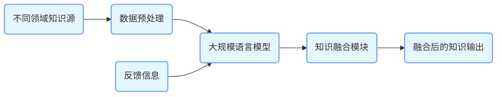

# 大规模语言模型在跨领域知识融合中的创新应用

> 关键词：大规模语言模型、跨领域知识融合、创新应用、知识表示、信息交互

> 摘要：本文聚焦于大规模语言模型在跨领域知识融合中的创新应用。随着人工智能技术的发展，大规模语言模型展现出强大的语言理解和生成能力。跨领域知识融合旨在打破不同领域知识之间的壁垒，实现知识的高效整合与利用。文章深入探讨了大规模语言模型在跨领域知识融合中的核心概念、算法原理、数学模型，并结合实际案例分析其应用场景，同时推荐了相关的学习资源、开发工具和研究论文，最后对未来发展趋势与挑战进行了总结，为相关领域的研究和实践提供了全面的参考。

## 1. 背景介绍 
### 1.1 目的和范围
本文章的主要目的是深入探讨大规模语言模型在跨领域知识融合方面的创新应用。随着科技的飞速发展，各个领域产生的数据和知识呈爆炸式增长，不同领域之间的知识壁垒阻碍了知识的综合利用和创新发展。大规模语言模型凭借其强大的语言处理能力，为跨领域知识融合提供了新的思路和方法。本文将涵盖大规模语言模型的基本原理、跨领域知识融合的概念和方法，以及两者结合的具体应用场景和案例分析，旨在为研究人员、开发者和相关从业者提供全面的技术参考和实践指导。

### 1.2 预期读者
本文的预期读者包括人工智能领域的研究人员、软件开发者、数据科学家、相关专业的学生以及对大规模语言模型和跨领域知识融合感兴趣的技术爱好者。无论是希望深入了解技术原理的专业人士，还是想要探索创新应用的初学者，都能从本文中获得有价值的信息。

### 1.3 文档结构概述
本文将按照以下结构进行组织：首先介绍大规模语言模型和跨领域知识融合的核心概念及其联系，包括相关的原理和架构示意图；接着详细阐述核心算法原理和具体操作步骤，并使用 Python 源代码进行说明；然后介绍相关的数学模型和公式，并通过举例进行详细讲解；之后通过实际项目案例展示大规模语言模型在跨领域知识融合中的应用，包括开发环境搭建、源代码实现和代码解读；再分析实际应用场景；推荐相关的学习资源、开发工具和研究论文；最后总结未来发展趋势与挑战，并提供常见问题的解答和扩展阅读参考资料。

### 1.4 术语表
#### 1.4.1 核心术语定义
- **大规模语言模型（Large Language Model, LLM）**：基于深度学习技术，通过在大规模文本数据上进行训练得到的具有强大语言理解和生成能力的模型。例如 GPT - 3、BERT 等。
- **跨领域知识融合（Cross - domain Knowledge Fusion）**：将来自不同领域的知识进行整合、关联和交互，以实现知识的互补和协同，从而产生新的知识和价值。
- **知识表示（Knowledge Representation）**：将知识以计算机可处理的形式进行表达，以便于知识的存储、检索和推理。

#### 1.4.2 相关概念解释
- **预训练（Pre - training）**：大规模语言模型在大规模无监督数据上进行的初始训练过程，旨在学习语言的通用模式和语义信息。
- **微调（Fine - tuning）**：在预训练的基础上，使用特定领域的有监督数据对模型进行进一步训练，以适应特定任务的需求。
- **知识图谱（Knowledge Graph）**：一种以图的形式表示知识的方法，节点表示实体，边表示实体之间的关系，可用于知识的结构化存储和推理。

#### 1.4.3 缩略词列表
- **LLM**：Large Language Model（大规模语言模型）
- **BERT**：Bidirectional Encoder Representations from Transformers（基于变换器的双向编码器表示）
- **GPT**：Generative Pretrained Transformer（生成式预训练变换器）

## 2. 核心概念与联系 

### 大规模语言模型原理
大规模语言模型通常基于变换器（Transformer）架构，该架构由编码器和解码器组成。以 GPT 系列为代表的生成式模型主要使用解码器，而以 BERT 为代表的模型主要使用编码器。

变换器的核心是多头自注意力机制（Multi - Head Self - Attention），它允许模型在处理序列时关注不同位置的信息。多头自注意力机制的计算公式如下：

$$Attention(Q, K, V) = softmax(\frac{QK^T}{\sqrt{d_k}})V$$

其中，$Q$ 是查询矩阵，$K$ 是键矩阵，$V$ 是值矩阵，$d_k$ 是键向量的维度。

通过预训练过程，大规模语言模型在大规模文本数据上学习到语言的统计规律和语义信息，能够生成自然流畅的文本、回答问题等。

### 跨领域知识融合概念
跨领域知识融合旨在打破不同领域知识之间的隔阂，将来自多个领域的知识进行整合和关联。不同领域的知识可能具有不同的表示形式和语义，跨领域知识融合需要解决知识的异构性问题，实现知识的互操作性和协同工作。

### 两者联系
大规模语言模型为跨领域知识融合提供了强大的工具。它可以处理来自不同领域的文本数据，理解不同领域的语言表达和语义信息。通过微调，大规模语言模型可以适应特定领域的知识融合任务，例如将医学知识和生物学知识进行融合，辅助疾病诊断和研究。

同时，跨领域知识融合也为大规模语言模型的发展提供了新的挑战和机遇。通过融合不同领域的知识，大规模语言模型可以学习到更广泛、更深入的知识，提高其性能和应用范围。

### 架构示意图


该流程图展示了大规模语言模型在跨领域知识融合中的基本架构。不同领域的知识源经过数据预处理后输入到大规模语言模型中，模型对其进行处理和理解，然后通过知识融合模块将不同领域的知识进行整合，最终输出融合后的知识。反馈信息可以用于对模型进行进一步的优化。

## 3. 核心算法原理 & 具体操作步骤 

### 核心算法原理
在跨领域知识融合中，我们可以使用大规模语言模型进行知识的表示和匹配。以 BERT 模型为例，其核心算法步骤如下：

1. **输入编码**：将输入的文本进行分词处理，并转换为词嵌入（Token Embeddings）、段嵌入（Segment Embeddings）和位置嵌入（Position Embeddings）的组合。

```python
import torch
from transformers import BertTokenizer, BertModel

# 加载预训练的 BERT 模型和分词器
tokenizer = BertTokenizer.from_pretrained('bert-base-uncased')
model = BertModel.from_pretrained('bert-base-uncased')

# 输入文本
text = "This is an example sentence."
# 分词
tokens = tokenizer.tokenize(text)
# 添加特殊标记
tokens = ['[CLS]'] + tokens + ['[SEP]']
# 转换为词索引
input_ids = tokenizer.convert_tokens_to_ids(tokens)
# 转换为 PyTorch 张量
input_ids = torch.tensor([input_ids])
```

2. **模型推理**：将编码后的输入送入 BERT 模型，得到每个词的隐藏状态。

```python
# 模型推理
with torch.no_grad():
    outputs = model(input_ids)
    # 获取最后一层的隐藏状态
    last_hidden_states = outputs.last_hidden_state
```

3. **知识表示**：可以使用 [CLS] 标记的隐藏状态作为整个句子的表示。

```python
# 获取 [CLS] 标记的隐藏状态
sentence_embedding = last_hidden_states[:, 0, :]
```

### 具体操作步骤
1. **数据收集**：从不同领域收集相关的文本数据，例如医学文献、科技新闻、历史资料等。
2. **数据预处理**：对收集到的数据进行清洗、分词、标注等处理，以便于模型处理。
3. **模型选择和微调**：选择合适的大规模语言模型，如 GPT - 3、BERT 等，并使用收集到的数据对模型进行微调。

```python
from transformers import TrainingArguments, Trainer

# 定义训练参数
training_args = TrainingArguments(
    output_dir='./results',          # 输出目录
    num_train_epochs=3,              # 训练轮数
    per_device_train_batch_size=16,  # 每个设备的训练批次大小
    per_device_eval_batch_size=64,   # 每个设备的评估批次大小
    warmup_steps=500,                # 热身步数
    weight_decay=0.01,               # 权重衰减率
    logging_dir='./logs',            # 日志目录
    logging_steps=10
)

# 定义训练器
trainer = Trainer(
    model=model,                         # 模型
    args=training_args,                  # 训练参数
    train_dataset=train_dataset,         # 训练数据集
    eval_dataset=eval_dataset            # 评估数据集
)

# 开始训练
trainer.train()
```

4. **知识融合**：使用微调后的模型对不同领域的知识进行处理和融合，例如通过相似度计算找到相关的知识并进行关联。

```python
from sklearn.metrics.pairwise import cosine_similarity

# 计算两个句子的相似度
sentence1 = "Medical knowledge about heart disease."
sentence2 = "Biological research on cardiovascular system."

# 编码句子
input_ids1 = tokenizer.encode(sentence1, return_tensors='pt')
input_ids2 = tokenizer.encode(sentence2, return_tensors='pt')

# 模型推理
with torch.no_grad():
    outputs1 = model(input_ids1)
    outputs2 = model(input_ids2)

# 获取句子表示
embedding1 = outputs1.last_hidden_state[:, 0, :]
embedding2 = outputs2.last_hidden_state[:, 0, :]

# 计算相似度
similarity = cosine_similarity(embedding1, embedding2)
print("Similarity:", similarity)
```

## 4. 数学模型和公式 & 详细讲解 & 举例说明 

### 多头自注意力机制公式
多头自注意力机制是变换器架构的核心，其公式为：

$$Attention(Q, K, V) = softmax(\frac{QK^T}{\sqrt{d_k}})V$$

其中，$Q$ 是查询矩阵，$K$ 是键矩阵，$V$ 是值矩阵，$d_k$ 是键向量的维度。

详细讲解：
- $QK^T$ 计算了查询向量和键向量之间的相似度得分。
- $\frac{1}{\sqrt{d_k}}$ 是缩放因子，用于防止点积结果过大，避免 softmax 函数的梯度消失问题。
- $softmax$ 函数将相似度得分转换为概率分布，使得所有得分之和为 1。
- 最后，将概率分布与值矩阵 $V$ 相乘，得到加权和作为输出。

举例说明：
假设我们有一个输入序列 $x = [x_1, x_2, x_3]$，每个元素的维度为 $d = 4$。我们将其分别投影到查询、键和值空间，得到 $Q$、$K$ 和 $V$ 矩阵。

```python
import torch
import torch.nn.functional as F

# 输入序列
x = torch.randn(3, 4)

# 投影矩阵
W_q = torch.randn(4, 4)
W_k = torch.randn(4, 4)
W_v = torch.randn(4, 4)

# 计算 Q、K、V
Q = torch.matmul(x, W_q)
K = torch.matmul(x, W_k)
V = torch.matmul(x, W_v)

# 计算相似度得分
scores = torch.matmul(Q, K.transpose(-2, -1)) / torch.sqrt(torch.tensor(Q.size(-1)).float())

# 应用 softmax 函数
attn_probs = F.softmax(scores, dim=-1)

# 计算输出
output = torch.matmul(attn_probs, V)

print("Output:", output)
```

### 损失函数
在微调大规模语言模型时，通常使用交叉熵损失函数。对于分类任务，交叉熵损失函数的公式为：

$$L = -\sum_{i=1}^{N} y_i \log(p_i)$$

其中，$N$ 是类别数，$y_i$ 是真实标签的 one - hot 编码，$p_i$ 是模型预测的概率分布。

详细讲解：
交叉熵损失函数衡量了模型预测的概率分布与真实标签之间的差异。当模型预测正确时，损失值较小；当预测错误时，损失值较大。通过最小化损失函数，可以调整模型的参数，提高模型的性能。

举例说明：
假设我们有一个二分类任务，真实标签为 $y = [1, 0]$，模型预测的概率分布为 $p = [0.8, 0.2]$。

```python
import torch
import torch.nn as nn

# 真实标签
y = torch.tensor([1, 0], dtype=torch.float32)
# 模型预测的概率分布
p = torch.tensor([0.8, 0.2], dtype=torch.float32)

# 定义交叉熵损失函数
criterion = nn.BCELoss()

# 计算损失
loss = criterion(p, y)

print("Loss:", loss.item())
```

## 5. 项目实战：代码实际案例和详细解释说明 

### 5.1  开发环境搭建
1. **安装 Python**：确保系统中安装了 Python 3.7 或更高版本。可以从 Python 官方网站（https://www.python.org/downloads/）下载并安装。
2. **创建虚拟环境**：使用 `venv` 或 `conda` 创建一个虚拟环境，以隔离项目的依赖。

```bash
# 使用 venv 创建虚拟环境
python -m venv myenv

# 激活虚拟环境
source myenv/bin/activate  # Linux/Mac
myenv\Scripts\activate  # Windows
```

3. **安装依赖库**：安装所需的 Python 库，如 `transformers`、`torch`、`sklearn` 等。

```bash
pip install transformers torch scikit-learn
```

### 5.2  源代码详细实现和代码解读
以下是一个使用 BERT 模型进行跨领域知识融合的示例代码：

```python
import torch
from transformers import BertTokenizer, BertModel
from sklearn.metrics.pairwise import cosine_similarity

# 加载预训练的 BERT 模型和分词器
tokenizer = BertTokenizer.from_pretrained('bert-base-uncased')
model = BertModel.from_pretrained('bert-base-uncased')

# 定义两个不同领域的句子
medical_sentence = "The treatment of diabetes requires a balanced diet and regular exercise."
biological_sentence = "Insulin is a hormone that regulates blood sugar levels in the body."

# 分词和编码
medical_tokens = tokenizer.tokenize(medical_sentence)
medical_tokens = ['[CLS]'] + medical_tokens + ['[SEP]']
medical_input_ids = tokenizer.convert_tokens_to_ids(medical_tokens)
medical_input_ids = torch.tensor([medical_input_ids])

biological_tokens = tokenizer.tokenize(biological_sentence)
biological_tokens = ['[CLS]'] + biological_tokens + ['[SEP]']
biological_input_ids = tokenizer.convert_tokens_to_ids(biological_tokens)
biological_input_ids = torch.tensor([biological_input_ids])

# 模型推理
with torch.no_grad():
    medical_outputs = model(medical_input_ids)
    biological_outputs = model(biological_input_ids)

# 获取句子表示
medical_embedding = medical_outputs.last_hidden_state[:, 0, :]
biological_embedding = biological_outputs.last_hidden_state[:, 0, :]

# 计算相似度
similarity = cosine_similarity(medical_embedding, biological_embedding)

print("Similarity between medical and biological sentences:", similarity)
```

代码解读：
1. **加载模型和分词器**：使用 `transformers` 库加载预训练的 BERT 模型和分词器。
2. **定义句子**：定义两个不同领域的句子，分别代表医学和生物学领域的知识。
3. **分词和编码**：对句子进行分词处理，并添加特殊标记 `[CLS]` 和 `[SEP]`，然后将分词转换为词索引。
4. **模型推理**：将编码后的输入送入 BERT 模型，得到每个句子的隐藏状态。
5. **获取句子表示**：使用 `[CLS]` 标记的隐藏状态作为整个句子的表示。
6. **计算相似度**：使用余弦相似度计算两个句子表示之间的相似度，相似度越高表示两个句子的相关性越强。

### 5.3  代码解读与分析
- **优点**：
    - 使用预训练的 BERT 模型可以利用其在大规模文本数据上学习到的语言知识，提高句子表示的质量。
    - 余弦相似度是一种简单有效的相似度计算方法，可以快速评估两个句子之间的相关性。
- **局限性**：
    - 该方法仅考虑了句子的语义相似度，没有考虑句子之间的逻辑关系和知识结构。
    - BERT 模型的计算成本较高，对于大规模数据的处理可能存在性能问题。

为了克服这些局限性，可以进一步引入知识图谱来表示句子之间的逻辑关系，或者使用更轻量级的模型进行快速计算。

## 6. 实际应用场景 
### 医疗领域
在医疗领域，大规模语言模型可以将医学知识与生物学、遗传学等领域的知识进行融合。例如，在疾病诊断方面，结合医学症状描述和生物学基因信息，帮助医生更准确地判断疾病类型和制定治疗方案。同时，还可以辅助医学研究，整合不同来源的医学文献和研究成果，发现新的治疗方法和药物靶点。

### 教育领域
在教育领域，跨领域知识融合可以为学生提供更全面的学习体验。大规模语言模型可以将历史、地理、文学等不同学科的知识进行整合，生成综合性的学习材料。例如，在学习历史事件时，结合地理信息和文学作品中的描写，帮助学生更好地理解历史背景和文化内涵。

### 金融领域
在金融领域，大规模语言模型可以融合金融市场数据、宏观经济信息和行业研究报告等不同领域的知识。通过分析这些信息，预测金融市场的走势，评估投资风险，为投资者提供决策支持。

### 科技研发领域
在科技研发领域，跨领域知识融合可以促进创新。例如，将计算机科学、物理学和材料科学的知识相结合，推动人工智能芯片的研发。大规模语言模型可以帮助研究人员快速获取和整合不同领域的知识，加速研发进程。

## 7. 工具和资源推荐
### 7.1 学习资源推荐
#### 7.1.1 书籍推荐
- 《深度学习》（Deep Learning）：由 Ian Goodfellow、Yoshua Bengio 和 Aaron Courville 所著，是深度学习领域的经典教材，涵盖了神经网络、优化算法、深度学习应用等方面的内容。
- 《自然语言处理入门》：由何晗所著，适合初学者了解自然语言处理的基本概念和方法，包括分词、词性标注、命名实体识别等。
- 《Transformer 自然语言处理实战》：介绍了 Transformer 架构的原理和应用，以及如何使用相关工具进行自然语言处理任务的开发。

#### 7.1.2 在线课程
- Coursera 上的 “深度学习专项课程”（Deep Learning Specialization）：由 Andrew Ng 教授授课，包括神经网络基础、卷积神经网络、循环神经网络等内容。
- edX 上的 “自然语言处理基础”（Foundations of Natural Language Processing）：系统地介绍了自然语言处理的基本理论和方法。
- 哔哩哔哩上有许多关于大规模语言模型和自然语言处理的教学视频，适合初学者快速入门。

#### 7.1.3 技术博客和网站
- Hugging Face Blog（https://huggingface.co/blog）：提供了关于大规模语言模型、自然语言处理等方面的最新研究成果和技术应用案例。
- arXiv（https://arxiv.org/）：一个开放获取的学术预印本平台，包含了大量关于人工智能、机器学习等领域的研究论文。
- Towards Data Science（https://towardsdatascience.com/）：有许多数据科学和人工智能领域的技术文章和教程。

### 7.2 开发工具框架推荐
#### 7.2.1 IDE和编辑器
- PyCharm：一款功能强大的 Python 集成开发环境，提供了代码编辑、调试、版本控制等功能，适合开发大规模的 Python 项目。
- Visual Studio Code：一个轻量级的代码编辑器，支持多种编程语言，通过安装插件可以扩展其功能，如 Python 开发、代码调试等。

#### 7.2.2 调试和性能分析工具
- TensorBoard：一个可视化工具，可用于监控深度学习模型的训练过程，如损失函数的变化、模型参数的分布等。
- PyTorch Profiler：PyTorch 提供的性能分析工具，可以帮助开发者找出代码中的性能瓶颈，优化代码性能。

#### 7.2.3 相关框架和库
- Transformers：Hugging Face 开发的一个开源库，提供了多种预训练的大规模语言模型，如 GPT - 3、BERT 等，以及相应的工具和接口，方便开发者进行模型的使用和微调。
- PyTorch：一个开源的深度学习框架，具有动态图机制，易于使用和调试，广泛应用于自然语言处理、计算机视觉等领域。
- scikit - learn：一个用于机器学习的 Python 库，提供了多种机器学习算法和工具，如分类、回归、聚类等，可用于数据预处理和模型评估。

### 7.3 相关论文著作推荐
#### 7.3.1 经典论文
- “Attention Is All You Need”：介绍了 Transformer 架构，为大规模语言模型的发展奠定了基础。
- “BERT: Pre - training of Deep Bidirectional Transformers for Language Understanding”：提出了 BERT 模型，在自然语言处理任务中取得了显著的效果。
- “Generative Pretrained Transformer 3 (GPT - 3): Language Models are Few - Shot Learners”：介绍了 GPT - 3 模型，展示了其强大的语言生成能力和少样本学习能力。

#### 7.3.2 最新研究成果
- 关注顶级学术会议如 ACL（Association for Computational Linguistics）、NeurIPS（Neural Information Processing Systems）等的论文，了解大规模语言模型和跨领域知识融合的最新研究进展。
- arXiv 上经常会发布相关领域的最新预印本论文，可以及时跟踪研究动态。

#### 7.3.3 应用案例分析
- 许多公司和研究机构会发布大规模语言模型在实际应用中的案例分析报告，如 Google、Microsoft、OpenAI 等。这些报告可以帮助我们了解模型在不同场景下的应用效果和挑战。

## 8. 总结：未来发展趋势与挑战
### 未来发展趋势
- **更强大的模型**：随着计算资源的不断增加和算法的不断改进，未来的大规模语言模型将具有更强的语言理解和生成能力，能够处理更复杂的跨领域知识融合任务。
- **多模态融合**：除了文本数据，未来的模型将能够融合图像、音频、视频等多模态数据，实现更全面的跨领域知识融合。例如，在医疗领域，结合医学影像和病历文本进行疾病诊断。
- **个性化应用**：根据用户的需求和偏好，为用户提供个性化的跨领域知识融合服务。例如，在教育领域，为不同学习水平和兴趣的学生生成定制化的学习材料。
- **知识图谱与语言模型的深度融合**：知识图谱可以提供结构化的知识表示和推理能力，与大规模语言模型相结合，可以更好地处理知识的异构性和逻辑关系，提高跨领域知识融合的效果。

### 挑战
- **数据隐私和安全**：大规模语言模型需要大量的数据进行训练，其中可能包含敏感信息。如何保护数据的隐私和安全是一个重要的挑战。
- **计算资源需求**：训练和部署大规模语言模型需要大量的计算资源，这对于一些小型企业和研究机构来说是一个巨大的负担。如何降低计算成本是一个亟待解决的问题。
- **知识的准确性和可靠性**：跨领域知识融合可能会引入错误的知识或信息，如何保证融合后的知识的准确性和可靠性是一个关键问题。
- **伦理和社会影响**：大规模语言模型的广泛应用可能会带来一些伦理和社会问题，如虚假信息传播、就业结构变化等。需要制定相应的政策和规范来引导其健康发展。

## 9. 附录：常见问题与解答
### 问题 1：如何选择适合跨领域知识融合的大规模语言模型？
解答：选择适合的大规模语言模型需要考虑以下因素：
- **任务需求**：如果是文本生成任务，可以选择 GPT 系列模型；如果是文本分类、问答等任务，可以选择 BERT 系列模型。
- **数据规模**：如果数据规模较小，可以选择预训练模型进行微调；如果数据规模较大，可以考虑在预训练模型的基础上进行进一步的训练。
- **计算资源**：不同的模型对计算资源的需求不同，需要根据自己的计算资源选择合适的模型。

### 问题 2：如何处理跨领域知识的异构性？
解答：可以采用以下方法处理跨领域知识的异构性：
- **知识表示转换**：将不同领域的知识转换为统一的表示形式，如向量表示。
- **本体映射**：建立不同领域本体之间的映射关系，实现知识的语义对齐。
- **多模态融合**：结合多种模态的数据，从不同角度描述知识，提高知识的互补性。

### 问题 3：大规模语言模型在跨领域知识融合中的性能如何评估？
解答：可以从以下几个方面评估大规模语言模型在跨领域知识融合中的性能：
- **准确率**：评估模型在分类、问答等任务中的准确率。
- **召回率**：衡量模型能够正确召回的相关知识的比例。
- **F1 值**：综合考虑准确率和召回率的指标。
- **相似度指标**：如余弦相似度、欧氏距离等，评估模型生成的知识与真实知识之间的相似度。

### 问题 4：如何解决大规模语言模型的计算资源问题？
解答：可以采取以下措施解决大规模语言模型的计算资源问题：
- **模型压缩**：采用量化、剪枝等技术对模型进行压缩，减少模型的参数数量和计算量。
- **分布式训练**：使用多个计算设备进行分布式训练，提高训练效率。
- **选择轻量级模型**：选择一些轻量级的大规模语言模型，如 DistilBERT 等，降低计算成本。

## 10. 扩展阅读 & 参考资料
1. 《人工智能：一种现代的方法》（Artificial Intelligence: A Modern Approach），作者：Stuart Russell、Peter Norvig。
2. 《动手学深度学习》（Dive into Deep Learning），作者：阿斯顿·张、李沐等。
3. Hugging Face 官方文档（https://huggingface.co/docs）。
4. PyTorch 官方文档（https://pytorch.org/docs/stable/index.html）。
5. ACL、NeurIPS 等学术会议的论文集。

作者：AI天才研究院/AI Genius Institute & 禅与计算机程序设计艺术 /Zen And The Art of Computer Programming