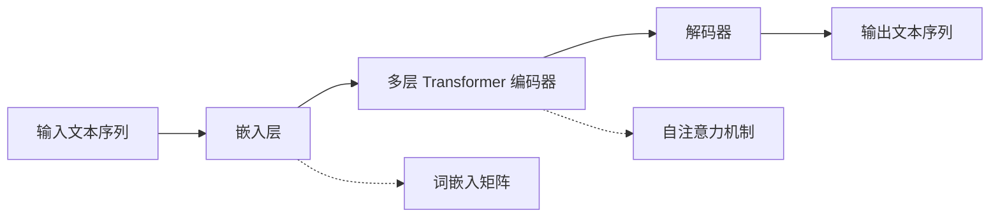

# 大规模语言模型推理能力的瓶颈与突破

> 关键词：大规模语言模型、推理能力、瓶颈、突破、自然语言处理

> 摘要：本文聚焦于大规模语言模型推理能力的相关问题，深入探讨了当前大规模语言模型在推理过程中面临的各种瓶颈，包括计算资源限制、数据质量与多样性不足、模型架构缺陷等。同时，详细分析了为突破这些瓶颈所采用的一系列方法，如模型压缩与加速技术、数据增强与预处理、新型模型架构设计等。通过实际案例和理论分析相结合，展示了大规模语言模型推理能力提升的重要性和可行性，为该领域的进一步发展提供了有价值的参考。

## 1. 背景介绍 
### 1.1 目的和范围
本文章的主要目的是全面且深入地剖析大规模语言模型推理能力方面的瓶颈，并探索有效的突破方法。随着自然语言处理技术的飞速发展，大规模语言模型在众多任务中展现出了强大的性能，但在推理能力上仍存在诸多挑战。本文将涵盖从模型的基本原理到实际应用场景的多个层面，详细分析推理能力瓶颈的成因，并介绍当前研究和实践中涌现出的突破策略。

### 1.2 预期读者
本文预期读者包括自然语言处理领域的研究人员、开发者、数据科学家，以及对人工智能和大规模语言模型感兴趣的技术爱好者。对于研究人员，本文可提供关于推理能力瓶颈的深入分析和前沿突破思路；对于开发者和数据科学家，有助于他们在实际项目中更好地理解和解决模型推理相关的问题；对于技术爱好者，能帮助他们了解大规模语言模型推理能力的现状和发展趋势。

### 1.3 文档结构概述
本文将按照以下结构展开：首先介绍核心概念与联系，阐述大规模语言模型推理能力的基本原理和相关架构；接着详细讲解核心算法原理和具体操作步骤，并结合 Python 代码进行说明；然后介绍数学模型和公式，通过具体例子加深理解；再通过项目实战展示代码实际案例和详细解释；之后探讨实际应用场景；推荐相关的工具和资源；最后进行总结，展望未来发展趋势与挑战，并提供常见问题与解答以及扩展阅读和参考资料。

### 1.4 术语表
#### 1.4.1 核心术语定义
- **大规模语言模型**：指具有大量参数和强大语言理解与生成能力的深度学习模型，如 GPT - 3、BERT 等。
- **推理能力**：模型根据给定的输入信息，运用逻辑、知识和规则进行思考和推导，得出合理结论的能力。
- **模型压缩**：通过减少模型参数数量、降低计算复杂度等方式，在不显著损失模型性能的前提下，减小模型的存储空间和计算量。
- **数据增强**：对原始数据进行扩充和变换，以增加数据的多样性和数量，提高模型的泛化能力。

#### 1.4.2 相关概念解释
- **Transformer 架构**：一种基于自注意力机制的深度学习架构，在大规模语言模型中广泛应用，具有并行计算能力强、长序列处理能力好等优点。
- **预训练 - 微调范式**：先在大规模无监督数据上进行预训练，学习通用的语言知识和模式，然后在特定任务的有监督数据上进行微调，以适应具体任务需求。

#### 1.4.3 缩略词列表
- **NLP**：Natural Language Processing，自然语言处理
- **GPT**：Generative Pretrained Transformer，生成式预训练变换器
- **BERT**：Bidirectional Encoder Representations from Transformers，基于变换器的双向编码器表示

## 2. 核心概念与联系 

### 大规模语言模型推理能力的基本原理
大规模语言模型的推理过程本质上是一个基于概率的序列生成过程。以 Transformer 架构为例，模型通过多层的自注意力机制和前馈神经网络，对输入的文本序列进行编码和解码，学习到文本中的语义信息和语言模式。在推理时，模型根据输入的上下文信息，预测下一个可能的单词或字符，直到生成完整的输出序列。

### 推理能力与模型架构的关系
模型架构对推理能力有着至关重要的影响。例如，Transformer 架构中的多头自注意力机制能够捕捉文本中不同位置之间的依赖关系，有助于模型理解语义和进行推理。而模型的层数和隐藏单元数量等超参数也会影响推理能力，层数越多、隐藏单元数量越大，模型能够学习到的信息就越复杂，但同时也会增加计算量和训练难度。

### 文本示意图
```plaintext
输入文本序列 -> 嵌入层 -> 多层 Transformer 编码器 -> 解码器 -> 输出文本序列
|                          |
|                          |
V                          V
词嵌入矩阵              自注意力机制
```

### Mermaid 流程图


## 3. 核心算法原理 & 具体操作步骤 

### 自注意力机制原理
自注意力机制是 Transformer 架构的核心组成部分，它允许模型在处理输入序列时，关注序列中不同位置的信息。具体来说，对于输入序列中的每个位置，自注意力机制会计算该位置与其他位置之间的相关性，并根据相关性对其他位置的信息进行加权求和，得到该位置的表示。

以下是自注意力机制的 Python 代码实现：
```python
import torch
import torch.nn as nn

class SelfAttention(nn.Module):
    def __init__(self, input_dim, output_dim):
        super(SelfAttention, self).__init__()
        self.W_q = nn.Linear(input_dim, output_dim)
        self.W_k = nn.Linear(input_dim, output_dim)
        self.W_v = nn.Linear(input_dim, output_dim)
        self.softmax = nn.Softmax(dim=-1)

    def forward(self, x):
        queries = self.W_q(x)
        keys = self.W_k(x)
        values = self.W_v(x)

        scores = torch.matmul(queries, keys.transpose(-2, -1))
        attention_weights = self.softmax(scores)
        output = torch.matmul(attention_weights, values)
        return output
```

### 具体操作步骤
1. **输入处理**：将输入的文本序列转换为词嵌入矩阵，每个单词用一个向量表示。
2. **自注意力计算**：通过上述的自注意力机制，对词嵌入矩阵进行处理，得到每个位置的新表示。
3. **前馈神经网络**：将自注意力机制的输出通过一个前馈神经网络进行进一步处理，增加模型的非线性表达能力。
4. **多层堆叠**：将上述步骤重复多次，形成多层的 Transformer 架构。
5. **输出生成**：在解码器部分，根据输入的上下文信息，通过 Softmax 函数预测下一个可能的单词或字符。

## 4. 数学模型和公式 & 详细讲解 & 举例说明 

### 自注意力机制的数学公式
自注意力机制的计算过程可以用以下公式表示：

$$Attention(Q, K, V) = softmax(\frac{QK^T}{\sqrt{d_k}})V$$

其中，$Q$ 是查询矩阵，$K$ 是键矩阵，$V$ 是值矩阵，$d_k$ 是键向量的维度。

### 详细讲解
- **查询、键和值矩阵**：对于输入序列 $x = [x_1, x_2,..., x_n]$，通过线性变换 $W_q$、$W_k$ 和 $W_v$ 分别得到查询矩阵 $Q$、键矩阵 $K$ 和值矩阵 $V$。
- **分数计算**：计算查询矩阵 $Q$ 和键矩阵 $K$ 的转置的乘积，得到分数矩阵 $scores$。
- **注意力权重**：对分数矩阵进行 Softmax 操作，得到注意力权重矩阵 $attention\_weights$。
- **输出计算**：将注意力权重矩阵与值矩阵相乘，得到最终的输出。

### 举例说明
假设输入序列为 $x = [“hello”, “world”]$，词嵌入维度为 3，经过线性变换后得到查询矩阵 $Q$、键矩阵 $K$ 和值矩阵 $V$ 如下：

$$Q = \begin{bmatrix}
1 & 2 & 3 \\
4 & 5 & 6
\end{bmatrix}$$

$$K = \begin{bmatrix}
7 & 8 & 9 \\
10 & 11 & 12
\end{bmatrix}$$

$$V = \begin{bmatrix}
13 & 14 & 15 \\
16 & 17 & 18
\end{bmatrix}$$

首先计算分数矩阵：

$$scores = QK^T = \begin{bmatrix}
1\times7 + 2\times10 + 3\times12 & 1\times8 + 2\times11 + 3\times12 \\
4\times7 + 5\times10 + 6\times12 & 4\times8 + 5\times11 + 6\times12
\end{bmatrix} = \begin{bmatrix}
63 & 66 \\
150 & 159
\end{bmatrix}$$

假设 $d_k = 3$，则经过缩放后的分数矩阵为：

$$scores_{scaled} = \frac{scores}{\sqrt{3}} = \begin{bmatrix}
\frac{63}{\sqrt{3}} & \frac{66}{\sqrt{3}} \\
\frac{150}{\sqrt{3}} & \frac{159}{\sqrt{3}}
\end{bmatrix}$$

然后计算注意力权重矩阵：

$$attention\_weights = softmax(scores_{scaled})$$

最后计算输出：

$$output = attention\_weightsV$$

## 5. 项目实战：代码实际案例和详细解释说明 

### 5.1  开发环境搭建
- **操作系统**：推荐使用 Linux 系统，如 Ubuntu 18.04 及以上版本。
- **Python 环境**：使用 Python 3.7 及以上版本。
- **深度学习框架**：使用 PyTorch 深度学习框架，可通过以下命令安装：
```bash
pip install torch torchvision
```
- **其他依赖库**：安装 Transformers 库，用于加载预训练的大规模语言模型：
```bash
pip install transformers
```

### 5.2  源代码详细实现和代码解读
以下是一个使用 Transformers 库进行文本生成的简单示例：
```python
from transformers import GPT2LMHeadModel, GPT2Tokenizer

# 加载预训练的 GPT - 2 模型和分词器
tokenizer = GPT2Tokenizer.from_pretrained('gpt2')
model = GPT2LMHeadModel.from_pretrained('gpt2')

# 输入文本
input_text = "Once upon a time"
input_ids = tokenizer.encode(input_text, return_tensors='pt')

# 生成文本
output = model.generate(input_ids, max_length=100, num_beams=5, no_repeat_ngram_size=2, early_stopping=True)

# 解码输出
generated_text = tokenizer.decode(output[0], skip_special_tokens=True)
print(generated_text)
```

### 代码解读与分析
1. **模型和分词器加载**：使用 `GPT2Tokenizer.from_pretrained('gpt2')` 加载预训练的 GPT - 2 分词器，使用 `GPT2LMHeadModel.from_pretrained('gpt2')` 加载预训练的 GPT - 2 模型。
2. **输入文本编码**：将输入文本 `input_text` 编码为输入 ID 序列 `input_ids`。
3. **文本生成**：使用 `model.generate()` 方法生成文本，设置了最大长度、束搜索的束数、避免重复的 n - gram 大小等参数。
4. **输出解码**：将生成的 ID 序列解码为文本，并打印输出。

## 6. 实际应用场景 
### 智能客服
大规模语言模型可以用于构建智能客服系统，通过对用户问题的理解和推理，提供准确的回答和解决方案。例如，在电商平台的客服场景中，模型可以根据用户的咨询内容，推理出用户的需求，如查询商品信息、处理订单问题等，并自动生成合适的回复。

### 机器翻译
在机器翻译任务中，模型需要对源语言文本进行理解和推理，然后将其翻译成目标语言。大规模语言模型可以学习到不同语言之间的语义和语法对应关系，提高翻译的准确性和流畅性。

### 文本摘要
通过对长文本的理解和推理，大规模语言模型可以提取出文本的关键信息，生成简洁的摘要。这在新闻、论文等领域有着广泛的应用，可以帮助用户快速了解文本的主要内容。

### 智能写作
模型可以根据用户提供的主题和要求，进行推理和创作，生成各种类型的文本，如故事、诗歌、文章等。这对于内容创作领域具有重要的价值，可以提高创作效率和质量。

## 7. 工具和资源推荐
### 7.1 学习资源推荐
#### 7.1.1 书籍推荐
- 《深度学习》（Deep Learning）：由 Ian Goodfellow、Yoshua Bengio 和 Aaron Courville 所著，是深度学习领域的经典教材，涵盖了神经网络、优化算法等基础知识。
- 《自然语言处理入门》：介绍了自然语言处理的基本概念、算法和应用，适合初学者入门。
- 《Transformer 自然语言处理》：深入讲解了 Transformer 架构及其在自然语言处理中的应用。

#### 7.1.2 在线课程
- Coursera 上的“Natural Language Processing Specialization”：由顶尖高校的教授授课，系统地介绍了自然语言处理的各个方面。
- edX 上的“Deep Learning for Natural Language Processing”：重点讲解了深度学习在自然语言处理中的应用。

#### 7.1.3 技术博客和网站
- Hugging Face Blog：提供了关于大规模语言模型和自然语言处理的最新研究成果和技术文章。
- Towards Data Science：有许多关于人工智能和自然语言处理的高质量博客文章。

### 7.2 开发工具框架推荐
#### 7.2.1 IDE和编辑器
- PyCharm：一款专业的 Python 集成开发环境，具有代码编辑、调试、版本控制等功能。
- Jupyter Notebook：适合进行交互式编程和数据分析，方便展示代码和结果。

#### 7.2.2 调试和性能分析工具
- TensorBoard：用于可视化深度学习模型的训练过程和性能指标。
- PyTorch Profiler：可以帮助分析 PyTorch 模型的性能瓶颈。

#### 7.2.3 相关框架和库
- Transformers：由 Hugging Face 开发，提供了丰富的预训练模型和工具，方便进行自然语言处理任务。
- AllenNLP：一个用于自然语言处理的深度学习框架，提供了许多预定义的模型和工具。

### 7.3 相关论文著作推荐
#### 7.3.1 经典论文
- “Attention Is All You Need”：介绍了 Transformer 架构，为大规模语言模型的发展奠定了基础。
- “BERT: Pre-training of Deep Bidirectional Transformers for Language Understanding”：提出了 BERT 模型，在自然语言处理任务中取得了显著的效果。

#### 7.3.2 最新研究成果
- 关注 arXiv 上关于自然语言处理和大规模语言模型的最新论文，了解该领域的前沿研究动态。

#### 7.3.3 应用案例分析
- 可以查阅 ACM SIGKDD、ACL 等会议上的相关论文，了解大规模语言模型在实际应用中的案例和经验。

## 8. 总结：未来发展趋势与挑战
### 未来发展趋势
- **模型规模继续扩大**：随着计算资源的不断提升，大规模语言模型的参数数量可能会继续增加，以进一步提高模型的性能和推理能力。
- **多模态融合**：将语言信息与图像、音频等其他模态的信息进行融合，使模型能够处理更加复杂的任务，如视觉问答、视频理解等。
- **个性化和定制化**：根据不同用户的需求和偏好，为用户提供个性化的语言服务，提高用户体验。

### 挑战
- **计算资源限制**：大规模语言模型的训练和推理需要大量的计算资源，如何在有限的资源下提高模型的效率是一个重要的挑战。
- **数据隐私和安全**：大规模语言模型的训练需要大量的数据，如何保护数据的隐私和安全是一个亟待解决的问题。
- **可解释性**：目前大规模语言模型大多是黑盒模型，缺乏可解释性，如何提高模型的可解释性，让用户更好地理解模型的决策过程是一个重要的研究方向。

## 9. 附录：常见问题与解答
### 问题 1：大规模语言模型的推理速度如何提高？
答：可以采用模型压缩技术，如剪枝、量化等，减少模型的参数数量和计算量；也可以使用并行计算和硬件加速，如 GPU、TPU 等。

### 问题 2：如何评估大规模语言模型的推理能力？
答：可以使用一些基准测试数据集，如 GLUE、SuperGLUE 等，评估模型在不同任务上的性能；也可以通过人工评估，观察模型生成的文本是否合理、准确。

### 问题 3：大规模语言模型在小数据集上的表现如何？
答：在小数据集上，大规模语言模型可能会出现过拟合的问题。可以采用迁移学习的方法，先在大规模无监督数据上进行预训练，然后在小数据集上进行微调，提高模型的性能。

## 10. 扩展阅读 & 参考资料
- Vaswani, Ashish, et al. "Attention is all you need." Advances in neural information processing systems. 2017.
- Devlin, Jacob, et al. "BERT: Pre-training of deep bidirectional transformers for language understanding." arXiv preprint arXiv:1810.04805 (2018).
- Hugging Face官方文档：https://huggingface.co/docs
- PyTorch官方文档：https://pytorch.org/docs/stable/index.html

作者：AI天才研究院/AI Genius Institute & 禅与计算机程序设计艺术 /Zen And The Art of Computer Programming