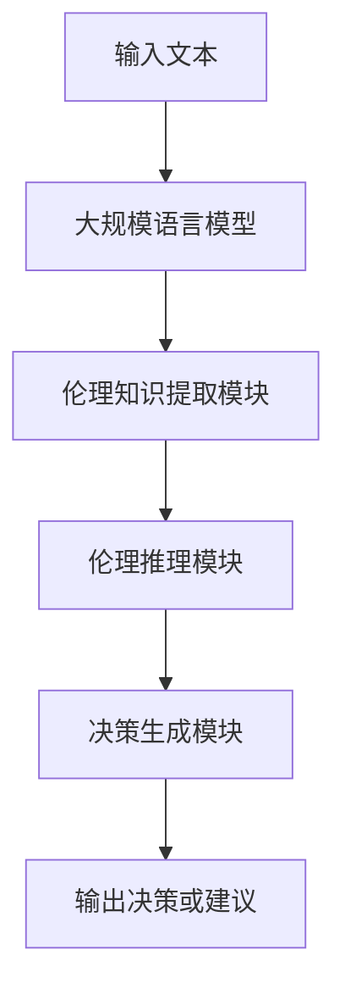

# 大规模语言模型的伦理推理与决策能力在AI治理中的应用

> 关键词：大规模语言模型、伦理推理、决策能力、AI治理、应用

> 摘要：本文深入探讨了大规模语言模型的伦理推理与决策能力在AI治理中的应用。首先介绍了相关背景，包括目的范围、预期读者等内容。接着阐述了核心概念及联系，详细讲解了核心算法原理与操作步骤，结合数学模型和公式进行说明。通过项目实战案例展示其具体应用，并分析了实际应用场景。同时推荐了学习资源、开发工具框架以及相关论文著作。最后总结了未来发展趋势与挑战，还提供了常见问题解答和扩展阅读参考资料，旨在全面展现大规模语言模型在AI治理中的重要性与应用方式。

## 1. 背景介绍 
### 1.1 目的和范围
随着人工智能技术的飞速发展，大规模语言模型如ChatGPT、文心一言等不断涌现，展现出强大的语言处理和知识应用能力。然而，这些模型在使用过程中也引发了诸多伦理问题，如偏见、虚假信息传播、隐私侵犯等。本文章的目的在于研究大规模语言模型的伦理推理与决策能力，并探讨其在AI治理中的具体应用。范围涵盖了大规模语言模型的伦理推理原理、相关算法、实际应用场景以及对AI治理的影响等方面。

### 1.2 预期读者
本文预期读者包括人工智能领域的研究人员、开发者、政策制定者、伦理学家以及对AI伦理和治理感兴趣的普通读者。研究人员可以从本文中获取关于大规模语言模型伦理推理的最新研究成果和技术趋势；开发者可以学习如何在实际项目中应用伦理推理与决策能力；政策制定者可以参考本文的内容制定相关的AI治理政策；伦理学家可以从技术角度深入理解大规模语言模型的伦理问题；普通读者则可以通过本文了解AI伦理和治理的基本概念和重要性。

### 1.3 文档结构概述
本文将按照以下结构进行组织：首先介绍背景信息，包括目的范围、预期读者等；接着阐述核心概念与联系，通过文本示意图和Mermaid流程图展示大规模语言模型伦理推理与决策的原理和架构；然后详细讲解核心算法原理和具体操作步骤，使用Python源代码进行说明；再结合数学模型和公式对伦理推理进行分析，并举例说明；通过项目实战案例展示代码实现和详细解释；分析大规模语言模型在不同场景下的实际应用；推荐相关的学习资源、开发工具框架和论文著作；最后总结未来发展趋势与挑战，提供常见问题解答和扩展阅读参考资料。

### 1.4 术语表
#### 1.4.1 核心术语定义
- **大规模语言模型（Large Language Model, LLM）**：是一种基于深度学习的人工智能模型，通过在大量文本数据上进行训练，学习语言的统计规律和语义信息，能够生成自然流畅的文本。
- **伦理推理（Ethical Reasoning）**：指的是依据伦理原则和价值观，对行为、决策或事件进行分析和判断，以确定其是否符合道德标准的过程。
- **决策能力（Decision - Making Ability）**：是指在面对多种选择时，根据一定的目标和准则，选择最优方案的能力。在大规模语言模型中，决策能力体现为根据伦理推理结果做出合适决策的能力。
- **AI治理（AI Governance）**：是指通过制定政策、法规、标准和道德准则等手段，对人工智能技术的研发、应用和发展进行规范和管理，以确保其符合人类的利益和价值观。

#### 1.4.2 相关概念解释
- **偏见（Bias）**：在大规模语言模型中，偏见指的是模型在训练数据中学习到的不公正、片面的观点或倾向，可能导致生成的文本存在歧视性、刻板印象等问题。
- **可解释性（Interpretability）**：指的是模型的决策过程和输出结果能够被人类理解和解释的程度。在伦理推理中，可解释性对于确保模型的决策符合伦理原则至关重要。
- **透明度（Transparency）**：与可解释性相关，透明度强调模型的训练数据、算法结构和决策过程能够公开和可访问，以便外界进行监督和评估。

#### 1.4.3 缩略词列表
- **LLM**：Large Language Model，大规模语言模型
- **AI**：Artificial Intelligence，人工智能

## 2. 核心概念与联系 
### 核心概念原理
大规模语言模型的伦理推理与决策能力是基于对伦理原则和价值观的理解和应用。模型通过学习大量包含伦理信息的文本数据，掌握不同伦理场景下的正确行为和决策方式。在实际应用中，当模型接收到一个输入时，它会对输入进行分析，识别其中可能涉及的伦理问题，并依据所学的伦理知识进行推理。推理过程包括对不同伦理原则的权衡和比较，以确定最符合道德标准的决策。

例如，在处理涉及隐私保护的问题时，模型会考虑到隐私原则的重要性，评估不同决策对用户隐私的影响。如果一个决策可能导致用户隐私泄露，模型会根据伦理推理判断该决策不符合道德标准，并选择更合适的方案。

### 架构的文本示意图
```plaintext
输入（包含伦理问题的文本）
|
|__ 大规模语言模型（预训练模型）
    |
    |__ 伦理知识提取模块（从训练数据中提取伦理原则和案例）
    |
    |__ 伦理推理模块（根据伦理知识对输入进行推理）
    |
    |__ 决策生成模块（根据推理结果生成决策）
    |
    |__ 输出（符合伦理标准的决策或建议）
```

### Mermaid流程图


## 3. 核心算法原理 & 具体操作步骤 
### 核心算法原理
在大规模语言模型中实现伦理推理与决策能力的核心算法可以基于强化学习和规则引擎相结合的方式。强化学习可以让模型通过与环境的交互不断优化决策策略，而规则引擎则可以将明确的伦理原则和规则编码到模型中。

以下是一个简化的基于Python的示例代码，用于演示如何实现一个简单的伦理推理与决策过程：

```python
import random

# 定义伦理规则
ethical_rules = {
    "privacy": "保护用户隐私，不泄露用户个人信息",
    "fairness": "对待所有用户公平，不产生歧视性内容"
}

# 定义决策函数
def ethical_decision_making(input_text):
    # 模拟伦理知识提取
    detected_ethical_issues = []
    if "用户信息" in input_text:
        detected_ethical_issues.append("privacy")
    if "歧视" in input_text:
        detected_ethical_issues.append("fairness")

    # 伦理推理
    decisions = []
    for issue in detected_ethical_issues:
        if issue == "privacy":
            decision = "确保不泄露用户信息"
        elif issue == "fairness":
            decision = "避免产生歧视性内容"
        decisions.append(decision)

    # 决策生成
    if decisions:
        final_decision = random.choice(decisions)
    else:
        final_decision = "未检测到伦理问题，正常处理"

    return final_decision

# 测试输入
test_input = "需要处理用户信息，避免歧视某些群体"
result = ethical_decision_making(test_input)
print(result)
```

### 具体操作步骤
1. **伦理知识提取**：从大规模语言模型的训练数据中提取与伦理相关的信息，如伦理原则、案例等。可以使用自然语言处理技术，如命名实体识别、关系抽取等，来识别和提取这些信息。
2. **伦理规则编码**：将提取的伦理知识转化为具体的规则，存储在规则引擎中。规则可以是基于条件判断的，例如“如果输入文本中包含用户隐私信息，则采取保护措施”。
3. **伦理推理**：当模型接收到输入时，对输入进行分析，检测其中可能涉及的伦理问题。根据规则引擎中的规则，对这些问题进行推理，确定不同决策的伦理合理性。
4. **决策生成**：根据伦理推理的结果，生成符合伦理标准的决策或建议。可以使用强化学习算法来优化决策策略，以提高决策的质量。

## 4. 数学模型和公式 & 详细讲解 & 举例说明 
### 数学模型
在大规模语言模型的伦理推理中，可以使用多目标优化模型来进行决策。假设存在多个伦理目标 $G_1, G_2, \cdots, G_n$，每个目标都有一个对应的权重 $w_1, w_2, \cdots, w_n$，表示其重要性。对于一个决策 $d$，可以定义一个效用函数 $U(d)$ 来衡量该决策对各个伦理目标的满足程度：

$$U(d)=\sum_{i = 1}^{n}w_i\cdot f_i(d)$$

其中，$f_i(d)$ 是决策 $d$ 对第 $i$ 个伦理目标的满足度函数。

### 详细讲解
- **伦理目标**：例如，$G_1$ 可以表示隐私保护目标，$G_2$ 可以表示公平性目标。不同的伦理目标反映了不同的道德原则和价值观。
- **权重**：权重 $w_i$ 表示每个伦理目标的相对重要性。例如，如果隐私保护在某个场景下更为重要，可以将 $w_1$ 设置为较大的值。
- **满足度函数**：$f_i(d)$ 衡量决策 $d$ 对第 $i$ 个伦理目标的满足程度。例如，对于隐私保护目标，$f_1(d)$ 可以根据决策 $d$ 导致的隐私泄露风险来定义。

### 举例说明
假设存在两个伦理目标：隐私保护（$G_1$）和公平性（$G_2$），权重分别为 $w_1 = 0.6$ 和 $w_2 = 0.4$。对于一个决策 $d$，其对隐私保护目标的满足度 $f_1(d)=0.8$，对公平性目标的满足度 $f_2(d)=0.7$。则该决策的效用值为：

$$U(d)=0.6\times0.8 + 0.4\times0.7=0.48 + 0.28 = 0.76$$

通过比较不同决策的效用值，可以选择效用值最大的决策作为最优决策。

## 5. 项目实战：代码实际案例和详细解释说明 
### 5.1  开发环境搭建
为了实现大规模语言模型的伦理推理与决策能力的项目，我们可以使用Python作为开发语言，并借助一些常见的深度学习库和自然语言处理库。以下是具体的开发环境搭建步骤：

1. **安装Python**：建议安装Python 3.7及以上版本。可以从Python官方网站（https://www.python.org/downloads/）下载并安装。
2. **创建虚拟环境**：使用`venv`或`conda`创建虚拟环境，以隔离项目的依赖。例如，使用`venv`创建虚拟环境的命令如下：
```bash
python -m venv ethical_project_env
source ethical_project_env/bin/activate  # 激活虚拟环境（Windows系统使用 ethical_project_env\Scripts\activate）
```
3. **安装依赖库**：安装必要的库，如`transformers`用于处理大规模语言模型，`numpy`用于数值计算，`pandas`用于数据处理等。可以使用`pip`进行安装：
```bash
pip install transformers numpy pandas
```

### 5.2  源代码详细实现和代码解读
以下是一个更完整的项目实战代码示例，用于演示如何使用大规模语言模型进行伦理推理与决策：

```python
from transformers import AutoTokenizer, AutoModelForSequenceClassification
import torch

# 加载预训练的语言模型和分词器
model_name = "bert-base-uncased"
tokenizer = AutoTokenizer.from_pretrained(model_name)
model = AutoModelForSequenceClassification.from_pretrained(model_name, num_labels=2)

# 定义伦理规则和标签
ethical_rules = {
    "privacy": "保护用户隐私，不泄露用户个人信息",
    "fairness": "对待所有用户公平，不产生歧视性内容"
}
labels = {
    "privacy": 0,
    "fairness": 1
}

# 定义伦理推理函数
def ethical_reasoning(input_text):
    # 对输入文本进行分词
    inputs = tokenizer(input_text, return_tensors="pt")

    # 使用模型进行预测
    with torch.no_grad():
        outputs = model(**inputs)
    logits = outputs.logits
    predicted_label = torch.argmax(logits, dim=1).item()

    # 根据预测标签生成决策
    for rule, label in labels.items():
        if label == predicted_label:
            decision = ethical_rules[rule]
            break
    else:
        decision = "未检测到伦理问题，正常处理"

    return decision

# 测试输入
test_input = "需要处理用户信息，确保公平对待所有用户"
result = ethical_reasoning(test_input)
print(result)
```

### 代码解读与分析
1. **加载预训练模型和分词器**：使用`transformers`库加载预训练的BERT模型和对应的分词器。BERT模型在大规模文本数据上进行了预训练，具有强大的语言理解能力。
2. **定义伦理规则和标签**：定义了两个伦理规则（隐私保护和公平性），并为每个规则分配了一个标签。
3. **伦理推理函数**：该函数接收输入文本，对其进行分词处理，然后使用模型进行预测。根据预测结果，查找对应的伦理规则并生成决策。
4. **测试输入**：提供一个测试输入文本，调用伦理推理函数进行测试，并打印决策结果。

需要注意的是，这个示例代码只是一个简化的演示，实际应用中可能需要更复杂的模型和训练过程，以提高伦理推理的准确性和可靠性。

## 6. 实际应用场景 
### 智能客服
在智能客服场景中，大规模语言模型的伦理推理与决策能力可以确保客服回复符合伦理标准。例如，当用户咨询涉及个人隐私的问题时，模型可以根据伦理推理判断不能随意泄露用户信息，并给出合适的回复，如“关于您的隐私信息，我们会严格保密，请您放心”。同时，在处理不同用户的问题时，模型可以保证公平对待，不产生歧视性回复。

### 内容审核
在内容审核场景中，模型可以对文本、图像等内容进行伦理审查。例如，对于社交媒体上的帖子，模型可以检测其中是否包含歧视性语言、虚假信息等违反伦理原则的内容。如果检测到问题，模型可以根据伦理决策能力决定是否屏蔽该内容，并给出相应的提示信息。

### 智能推荐系统
在智能推荐系统中，伦理推理与决策能力可以避免推荐过程中的偏见和不公平现象。例如，模型可以根据用户的兴趣和需求进行推荐，同时确保推荐的内容不会对某些群体造成歧视或误导。如果推荐的内容可能涉及伦理问题，模型可以调整推荐策略，选择更合适的内容进行推荐。

## 7. 工具和资源推荐
### 7.1 学习资源推荐
#### 7.1.1 书籍推荐
- 《人工智能伦理》：本书全面介绍了人工智能领域的伦理问题，包括隐私保护、公平性、透明度等方面，为读者提供了深入理解AI伦理的理论基础。
- 《深度学习》：虽然主要侧重于深度学习的技术原理，但其中也涉及到了一些与人工智能伦理相关的内容，如模型的可解释性和偏见问题。

#### 7.1.2 在线课程
- Coursera上的“AI Ethics”课程：由知名学者授课，系统讲解了人工智能伦理的各个方面，包括伦理原则、决策方法和治理框架。
- edX上的“Deep Learning Specialization”：该课程涵盖了深度学习的基础知识和应用，其中也涉及到了一些与大规模语言模型相关的伦理问题的讨论。

#### 7.1.3 技术博客和网站
- OpenAI博客：OpenAI是人工智能领域的领先研究机构，其博客上经常发布关于大规模语言模型和AI伦理的最新研究成果和观点。
- AI Now Institute网站：专注于人工智能的社会影响和伦理问题研究，提供了丰富的研究报告和案例分析。

### 7.2 开发工具框架推荐
#### 7.2.1 IDE和编辑器
- PyCharm：是一款功能强大的Python集成开发环境，提供了代码编辑、调试、版本控制等一系列功能，适合开发大规模的Python项目。
- Jupyter Notebook：交互式的开发环境，非常适合进行数据探索、模型训练和代码演示。

#### 7.2.2 调试和性能分析工具
- TensorBoard：是TensorFlow提供的可视化工具，可以用于监控模型的训练过程、分析模型的性能指标等。
- Py-Spy：一个轻量级的Python性能分析工具，可以帮助开发者找出代码中的性能瓶颈。

#### 7.2.3 相关框架和库
- Transformers：由Hugging Face开发的用于自然语言处理的Python库，提供了大量预训练的语言模型，方便开发者进行模型的加载和微调。
- AllenNLP：一个用于自然语言处理的深度学习框架，提供了丰富的工具和组件，帮助开发者快速构建和训练自然语言处理模型。

### 7.3 相关论文著作推荐
#### 7.3.1 经典论文
- “BERT: Pre-training of Deep Bidirectional Transformers for Language Understanding”：介绍了BERT模型的预训练方法和架构，为大规模语言模型的发展奠定了基础。
- “On the Measure of Intelligence”：探讨了人工智能的智能度量问题，对理解大规模语言模型的能力和局限性具有重要意义。

#### 7.3.2 最新研究成果
- “Ethical AI: A Framework for Responsible Design and Development”：提出了一个用于负责任设计和开发人工智能的框架，强调了伦理推理和决策在AI开发中的重要性。
- “Addressing Bias in AI: A Survey of Methods and Approaches”：对解决人工智能中偏见问题的方法和途径进行了全面的综述。

#### 7.3.3 应用案例分析
- “Case Studies in AI Ethics: Real-World Examples and Lessons Learned”：通过实际案例分析，展示了人工智能在不同领域应用中遇到的伦理问题和解决方案。

## 8. 总结：未来发展趋势与挑战
### 未来发展趋势
- **伦理推理能力的提升**：未来大规模语言模型将不断提升其伦理推理能力，能够更准确地识别和处理复杂的伦理问题。通过引入更多的伦理知识和案例，模型可以学习到更丰富的伦理决策策略。
- **与多学科的融合**：大规模语言模型的伦理推理与决策能力将与伦理学、法学、社会学等多学科进行更深入的融合。跨学科的研究将为AI治理提供更全面、更科学的方法和理论支持。
- **自动化伦理决策系统的建立**：随着技术的发展，有望建立自动化的伦理决策系统，将伦理推理和决策过程集成到大规模语言模型的开发和应用中。这样可以实现实时的伦理审查和决策，提高AI系统的伦理合规性。

### 挑战
- **伦理标准的多样性**：不同文化、社会和群体对伦理标准的理解和定义存在差异，这给大规模语言模型的伦理推理带来了挑战。如何在模型中兼顾不同的伦理标准，是一个需要解决的问题。
- **数据的局限性**：大规模语言模型的伦理推理能力依赖于训练数据，如果训练数据存在偏见或不完整，可能导致模型的伦理决策出现偏差。因此，如何获取高质量、无偏见的训练数据是一个关键挑战。
- **可解释性和透明度问题**：虽然大规模语言模型在语言处理方面取得了很大进展，但模型的决策过程往往缺乏可解释性和透明度。在伦理推理中，可解释性和透明度对于确保模型的决策符合伦理原则至关重要，如何提高模型的可解释性是一个亟待解决的问题。

## 9. 附录：常见问题与解答
### 大规模语言模型的伦理推理能力能否完全替代人类的伦理判断？
不能。虽然大规模语言模型可以学习和应用伦理知识进行推理和决策，但它缺乏人类的情感、直觉和生活经验。在一些复杂的伦理场景中，人类的伦理判断仍然具有不可替代的作用。例如，在涉及到道德困境和价值冲突的问题时，人类可以根据自己的价值观和情感做出更合适的决策。

### 如何确保大规模语言模型的伦理决策符合不同地区和文化的伦理标准？
可以通过以下几种方式：一是收集不同地区和文化的伦理知识和案例，将其纳入模型的训练数据中，让模型学习到多样化的伦理标准；二是与不同地区的伦理专家合作，对模型的伦理决策进行评估和调整；三是建立可定制的伦理规则和参数，让用户可以根据自己的需求和文化背景对模型的伦理决策进行调整。

### 大规模语言模型的伦理推理与决策能力对AI治理有哪些重要意义？
大规模语言模型的伦理推理与决策能力可以帮助AI系统更好地遵守伦理原则和法律法规，减少伦理风险和社会负面影响。通过在模型中内置伦理推理和决策机制，可以实现AI系统的自我约束和自我管理，提高AI系统的可靠性和可信任性。同时，这也有助于建立公众对AI技术的信任，促进AI技术的健康发展。

## 10. 扩展阅读 & 参考资料
### 扩展阅读
- 《人类简史：从动物到上帝》：虽然不是专门关于人工智能的书籍，但它探讨了人类的进化和发展，对于理解人类的伦理观念和价值观的形成具有重要意义。
- 《未来简史：从智人到神人》：对未来人工智能和生物技术的发展进行了大胆的预测，引发读者对未来社会伦理问题的思考。

### 参考资料
- Hugging Face官方文档：https://huggingface.co/docs/transformers/index
- TensorFlow官方文档：https://www.tensorflow.org/api_docs
- AI Now Institute研究报告：https://ainowinstitute.org/research.html

作者：AI天才研究院/AI Genius Institute & 禅与计算机程序设计艺术 /Zen And The Art of Computer Programming