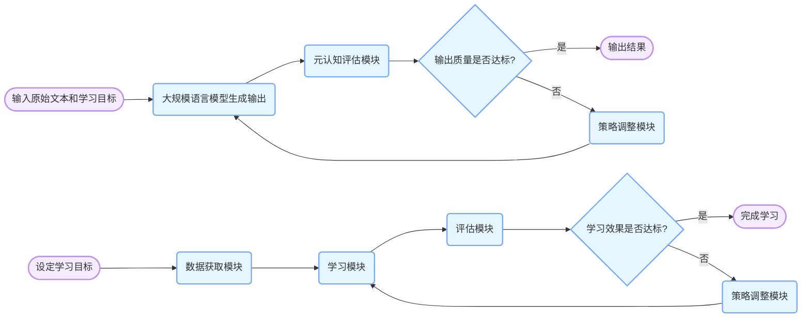

# 大规模语言模型的元认知能力在自主学习系统中的应用

> 关键词：大规模语言模型、元认知能力、自主学习系统、应用、认知反馈

> 摘要：本文深入探讨了大规模语言模型的元认知能力在自主学习系统中的应用。首先介绍了相关背景，包括目的范围、预期读者等。接着阐述了核心概念及联系，分析了核心算法原理与具体操作步骤，并给出了相应的数学模型和公式。通过项目实战案例展示了在实际开发中的应用，同时探讨了实际应用场景。还推荐了相关的工具和资源，最后总结了未来发展趋势与挑战，并对常见问题进行了解答，为该领域的研究和实践提供了全面且深入的参考。

## 1. 背景介绍 
### 1.1 目的和范围
本文章的目的在于详细研究大规模语言模型的元认知能力如何在自主学习系统中发挥作用。随着人工智能技术的飞速发展，大规模语言模型如GPT - 3、BERT等展现出了强大的语言处理能力。而元认知能力作为人类高级认知的重要组成部分，将其引入到大规模语言模型并应用于自主学习系统，有望推动自主学习系统向更智能、更高效的方向发展。本文的范围涵盖了从理论概念的阐述到实际应用案例的分析，以及相关工具资源的推荐等方面，力求为读者提供一个全面的视角来理解和应用这一新兴技术。

### 1.2 预期读者
本文预期读者包括人工智能领域的研究人员、开发者，对自主学习系统感兴趣的教育工作者，以及希望深入了解大规模语言模型和元认知能力结合应用的技术爱好者。这些读者可能具备一定的计算机科学、机器学习等相关知识背景，通过阅读本文能够获取到有价值的信息和技术思路。

### 1.3 文档结构概述
本文将按照以下结构进行阐述：首先介绍核心概念与联系，明确大规模语言模型的元认知能力和自主学习系统的定义及相互关系；接着讲解核心算法原理和具体操作步骤，通过Python代码进行详细说明；然后给出数学模型和公式，并结合具体例子进行讲解；之后通过项目实战展示代码实现和详细解读；再探讨实际应用场景；推荐相关的工具和资源；最后总结未来发展趋势与挑战，解答常见问题，并提供扩展阅读和参考资料。

### 1.4 术语表
#### 1.4.1 核心术语定义
- **大规模语言模型（Large - Scale Language Model）**：指基于大量文本数据进行训练的语言模型，通常具有数十亿甚至数万亿的参数，能够处理各种自然语言处理任务，如文本生成、问答系统等。
- **元认知能力（Metacognitive Ability）**：是指对自己认知过程的认知和调节能力，包括对自己的知识、技能、思维过程的监控和评估，以及根据评估结果进行调整和改进的能力。在大规模语言模型中，元认知能力表现为模型对自身输出的评估和调整能力。
- **自主学习系统（Autonomous Learning System）**：是一种能够自主获取知识、进行学习和改进的系统，无需人工过多干预。该系统可以根据自身的目标和环境反馈，自动调整学习策略和方法。

#### 1.4.2 相关概念解释
- **认知反馈（Cognitive Feedback）**：是指在学习过程中，系统根据自身的认知结果给予的反馈信息。在大规模语言模型的元认知能力中，认知反馈可以帮助模型评估自身的输出质量，并进行相应的调整。
- **学习策略调整（Learning Strategy Adjustment）**：自主学习系统根据自身的学习情况和目标，对学习策略进行调整的过程。例如，当系统发现某种学习方法效果不佳时，会尝试采用其他方法。

#### 1.4.3 缩略词列表
- **LLM**：大规模语言模型（Large - Scale Language Model）
- **ALS**：自主学习系统（Autonomous Learning System）

## 2. 核心概念与联系 
### 核心概念原理
#### 大规模语言模型的元认知能力原理
大规模语言模型的元认知能力主要基于模型对自身输出的评估和调整机制。在传统的大规模语言模型中，模型通常只是根据输入生成输出，而缺乏对输出质量的评估。具有元认知能力的大规模语言模型会在生成输出后，对输出进行评估，判断其是否符合预期。例如，模型可以通过比较输出与参考标准（如知识库中的信息），或者使用内部的评估指标（如困惑度、语义相似度等）来评估输出质量。如果评估结果表明输出质量不佳，模型会尝试调整自身的参数或生成策略，以生成更符合要求的输出。

#### 自主学习系统的原理
自主学习系统的核心原理是基于目标驱动和反馈机制。系统首先设定学习目标，然后通过与环境的交互获取数据，并使用这些数据进行学习。在学习过程中，系统会不断地对自身的学习效果进行评估，根据评估结果调整学习策略。例如，一个自主学习的智能机器人可以根据自身的运动目标（如到达某个地点），通过传感器获取环境信息，学习如何规划路径。如果在运动过程中遇到障碍物，机器人会根据反馈信息调整路径规划策略。

### 架构的文本示意图
```plaintext
大规模语言模型的元认知能力
├── 输入层
│   ├── 原始文本输入
│   ├── 学习目标输入
├── 处理层
│   ├── 语言模型生成输出
│   ├── 元认知评估模块
│       ├── 输出质量评估
│       ├── 认知反馈生成
│   ├── 策略调整模块
│       ├── 根据反馈调整参数
│       ├── 调整生成策略
├── 输出层
│   ├── 调整后的输出

自主学习系统
├── 目标设定模块
│   ├── 设定学习目标
├── 数据获取模块
│   ├── 与环境交互获取数据
├── 学习模块
│   ├── 使用数据进行学习
├── 评估模块
│   ├── 评估学习效果
├── 策略调整模块
│   ├── 根据评估结果调整学习策略
```

### Mermaid 流程图


## 3. 核心算法原理 & 具体操作步骤 
### 核心算法原理
#### 元认知评估算法
元认知评估算法主要用于评估大规模语言模型的输出质量。一种常用的方法是使用语义相似度算法，比较模型输出与参考标准之间的语义相似度。例如，我们可以使用余弦相似度来计算两个文本向量之间的相似度。

```python
import numpy as np
from sklearn.feature_extraction.text import TfidfVectorizer

def cosine_similarity(text1, text2):
    vectorizer = TfidfVectorizer()
    vectors = vectorizer.fit_transform([text1, text2])
    vectors = vectors.toarray()
    cos_sim = np.dot(vectors[0], vectors[1]) / (np.linalg.norm(vectors[0]) * np.linalg.norm(vectors[1]))
    return cos_sim

# 示例
output_text = "这是模型的输出文本"
reference_text = "这是参考标准文本"
similarity = cosine_similarity(output_text, reference_text)
print(f"语义相似度: {similarity}")
```

#### 策略调整算法
策略调整算法根据元认知评估的结果来调整模型的参数或生成策略。一种简单的方法是使用梯度下降法来调整模型的参数。假设我们有一个损失函数 $L$ 来衡量模型输出与参考标准之间的差异，我们可以通过以下步骤来调整模型的参数 $\theta$：

1. 计算损失函数关于参数 $\theta$ 的梯度 $\nabla_{\theta}L$。
2. 更新参数 $\theta$：$\theta = \theta - \alpha \nabla_{\theta}L$，其中 $\alpha$ 是学习率。

```python
import torch
import torch.nn as nn
import torch.optim as optim

# 假设我们有一个简单的线性模型
class SimpleModel(nn.Module):
    def __init__(self):
        super(SimpleModel, self).__init__()
        self.linear = nn.Linear(10, 1)

    def forward(self, x):
        return self.linear(x)

model = SimpleModel()
criterion = nn.MSELoss()
optimizer = optim.SGD(model.parameters(), lr=0.01)

# 假设我们有输入数据和目标数据
input_data = torch.randn(1, 10)
target_data = torch.randn(1, 1)

# 前向传播
output = model(input_data)
loss = criterion(output, target_data)

# 反向传播和参数更新
optimizer.zero_grad()
loss.backward()
optimizer.step()
```

### 具体操作步骤
1. **输入准备**：将原始文本和学习目标输入到大规模语言模型中。
2. **模型输出生成**：大规模语言模型根据输入生成初始输出。
3. **元认知评估**：使用元认知评估算法对模型输出进行评估，计算输出质量指标（如语义相似度）。
4. **判断输出质量**：根据设定的阈值判断输出质量是否达标。如果达标，则输出结果；否则，进入策略调整步骤。
5. **策略调整**：使用策略调整算法调整模型的参数或生成策略。
6. **重复步骤2 - 5**：直到输出质量达标为止。

## 4. 数学模型和公式 & 详细讲解 & 举例说明 
### 语义相似度模型
语义相似度可以使用余弦相似度来计算。假设有两个文本向量 $\mathbf{x}=(x_1,x_2,\cdots,x_n)$ 和 $\mathbf{y}=(y_1,y_2,\cdots,y_n)$，它们的余弦相似度 $S$ 定义为：

$$S(\mathbf{x},\mathbf{y})=\frac{\mathbf{x}\cdot\mathbf{y}}{\|\mathbf{x}\|\|\mathbf{y}\|}=\frac{\sum_{i = 1}^{n}x_iy_i}{\sqrt{\sum_{i = 1}^{n}x_i^2}\sqrt{\sum_{i = 1}^{n}y_i^2}}$$

详细讲解：余弦相似度衡量了两个向量之间的夹角余弦值，取值范围在 $[-1, 1]$ 之间。当两个向量方向相同时，余弦相似度为 $1$；当两个向量方向相反时，余弦相似度为 $-1$；当两个向量正交时，余弦相似度为 $0$。在文本处理中，我们通常使用TF - IDF（词频 - 逆文档频率）方法将文本转换为向量，然后计算余弦相似度。

举例说明：假设我们有两个文本 “苹果是一种水果” 和 “苹果是水果的一种”，使用TF - IDF方法将它们转换为向量后，计算得到的余弦相似度会接近 $1$，说明这两个文本语义非常相似。

### 损失函数和梯度下降法
在深度学习中，我们通常使用损失函数来衡量模型输出与目标值之间的差异。常见的损失函数有均方误差损失（MSE）、交叉熵损失等。以均方误差损失为例，假设我们有 $N$ 个样本，模型的输出为 $\hat{y}_i$，目标值为 $y_i$，则均方误差损失 $L$ 定义为：

$$L=\frac{1}{N}\sum_{i = 1}^{N}(\hat{y}_i - y_i)^2$$

梯度下降法是一种常用的优化算法，用于最小化损失函数。假设我们要优化的参数为 $\theta$，损失函数关于参数 $\theta$ 的梯度为 $\nabla_{\theta}L$，则参数更新公式为：

$$\theta_{t + 1}=\theta_t-\alpha\nabla_{\theta}L$$

其中，$\theta_t$ 是第 $t$ 次迭代时的参数值，$\alpha$ 是学习率。

详细讲解：均方误差损失衡量了模型输出与目标值之间的平均平方误差。梯度下降法通过不断地沿着损失函数的负梯度方向更新参数，使得损失函数逐渐减小。学习率 $\alpha$ 控制了每次参数更新的步长，如果学习率过大，可能会导致算法无法收敛；如果学习率过小，算法收敛速度会很慢。

举例说明：假设我们有一个简单的线性回归模型 $y = wx + b$，目标是通过最小化均方误差损失来学习参数 $w$ 和 $b$。我们可以使用梯度下降法不断更新 $w$ 和 $b$ 的值，直到损失函数达到最小值。

## 5. 项目实战：代码实际案例和详细解释说明 
### 5.1  开发环境搭建
#### 安装Python
首先，确保你已经安装了Python 3.7 或更高版本。你可以从Python官方网站（https://www.python.org/downloads/）下载并安装Python。

#### 安装必要的库
我们需要安装一些必要的Python库，如 `torch`、`sklearn` 等。可以使用以下命令进行安装：
```sh
pip install torch scikit-learn
```

### 5.2  源代码详细实现和代码解读
```python
import torch
import torch.nn as nn
import torch.optim as optim
from sklearn.feature_extraction.text import TfidfVectorizer
import numpy as np

# 定义简单的语言模型
class SimpleLanguageModel(nn.Module):
    def __init__(self, input_size, hidden_size, output_size):
        super(SimpleLanguageModel, self).__init__()
        self.fc1 = nn.Linear(input_size, hidden_size)
        self.relu = nn.ReLU()
        self.fc2 = nn.Linear(hidden_size, output_size)

    def forward(self, x):
        out = self.fc1(x)
        out = self.relu(out)
        out = self.fc2(out)
        return out

# 元认知评估函数
def metacognitive_evaluation(output_text, reference_text):
    vectorizer = TfidfVectorizer()
    vectors = vectorizer.fit_transform([output_text, reference_text])
    vectors = vectors.toarray()
    cos_sim = np.dot(vectors[0], vectors[1]) / (np.linalg.norm(vectors[0]) * np.linalg.norm(vectors[1]))
    return cos_sim

# 主函数
def main():
    # 输入数据
    input_text = "这是输入文本"
    reference_text = "这是参考标准文本"

    # 将文本转换为向量
    vectorizer = TfidfVectorizer()
    input_vector = vectorizer.fit_transform([input_text]).toarray()[0]

    # 初始化模型
    input_size = len(input_vector)
    hidden_size = 10
    output_size = 1
    model = SimpleLanguageModel(input_size, hidden_size, output_size)

    # 定义损失函数和优化器
    criterion = nn.MSELoss()
    optimizer = optim.SGD(model.parameters(), lr=0.01)

    # 训练模型
    num_epochs = 100
    for epoch in range(num_epochs):
        # 前向传播
        input_tensor = torch.FloatTensor(input_vector)
        output = model(input_tensor)
        output_text = "生成的输出文本"  # 这里只是示例，实际需要根据输出进行转换
        similarity = metacognitive_evaluation(output_text, reference_text)
        target = torch.FloatTensor([similarity])
        loss = criterion(output, target)

        # 反向传播和参数更新
        optimizer.zero_grad()
        loss.backward()
        optimizer.step()

        if (epoch + 1) % 10 == 0:
            print(f'Epoch [{epoch + 1}/{num_epochs}], Loss: {loss.item():.4f}')

if __name__ == "__main__":
    main()
```

### 5.3  代码解读与分析
#### 代码结构
- **SimpleLanguageModel类**：定义了一个简单的语言模型，包含一个输入层、一个隐藏层和一个输出层。
- **metacognitive_evaluation函数**：用于评估模型输出与参考标准之间的语义相似度。
- **main函数**：主函数，负责数据处理、模型初始化、训练等操作。

#### 详细分析
1. **数据处理**：将输入文本和参考文本使用TF - IDF方法转换为向量。
2. **模型初始化**：初始化一个简单的语言模型，并定义损失函数和优化器。
3. **训练过程**：在每个训练周期中，进行前向传播得到模型输出，使用元认知评估函数计算输出与参考标准之间的语义相似度，将其作为目标值，计算损失函数。然后进行反向传播和参数更新。
4. **输出结果**：每10个训练周期打印一次损失值，观察模型的训练效果。

## 6. 实际应用场景 
### 智能教育系统
在智能教育系统中，大规模语言模型的元认知能力可以帮助学生进行自主学习。例如，系统可以根据学生的学习情况和问题，生成相应的学习材料和解答。同时，模型可以对自身的解答进行评估，判断是否清晰易懂，如果解答质量不佳，模型可以调整表达方式。学生也可以通过与系统的交互，不断反馈学习效果，系统根据反馈调整学习策略，提供更个性化的学习方案。

### 智能客服系统
智能客服系统可以利用大规模语言模型的元认知能力来提高服务质量。当客户提出问题时，模型生成回答后，会对回答进行评估，判断是否准确、完整地回答了客户的问题。如果回答质量不高，模型会尝试调整回答内容。此外，系统还可以根据客户的反馈，不断学习和改进，提高对不同问题的处理能力。

### 智能写作辅助系统
在智能写作辅助系统中，模型可以帮助用户生成文章内容，并对生成的内容进行评估。例如，评估文章的语法正确性、逻辑连贯性、语义准确性等。如果发现问题，模型可以提供修改建议，帮助用户提高写作质量。同时，系统可以根据用户的写作习惯和反馈，不断调整生成策略，提供更符合用户需求的写作建议。

## 7. 工具和资源推荐
### 7.1 学习资源推荐
#### 7.1.1 书籍推荐
- 《深度学习》（Deep Learning）：由Ian Goodfellow、Yoshua Bengio和Aaron Courville所著，是深度学习领域的经典教材，涵盖了神经网络、卷积神经网络、循环神经网络等重要内容。
- 《Python机器学习》（Python Machine Learning）：由Sebastian Raschka和Vahid Mirjalili所著，详细介绍了使用Python进行机器学习的方法和技巧，包括数据预处理、模型选择、评估等方面。
- 《自然语言处理入门》：作者何晗，本书以入门为导向，介绍了自然语言处理的基本概念、算法和应用，适合初学者阅读。

#### 7.1.2 在线课程
- Coursera上的“深度学习专项课程”（Deep Learning Specialization）：由Andrew Ng教授授课，包含了深度学习的多个方面，如神经网络、卷积神经网络、循环神经网络等。
- edX上的“自然语言处理基础”（Foundations of Natural Language Processing）：介绍了自然语言处理的基本概念、算法和技术，适合对自然语言处理感兴趣的学习者。
- 哔哩哔哩（Bilibili）上有很多关于人工智能和机器学习的视频教程，其中不乏一些高质量的讲解和实践案例。

#### 7.1.3 技术博客和网站
- Medium：是一个技术博客平台，上面有很多关于人工智能、机器学习、自然语言处理等领域的优秀文章。
- Towards Data Science：专注于数据科学和机器学习领域，提供了大量的技术文章、案例分析和实践经验。
- 机器之心：是国内专注于人工智能领域的媒体平台，提供了最新的技术动态、研究成果和行业资讯。

### 7.2 开发工具框架推荐
#### 7.2.1 IDE和编辑器
- PyCharm：是一款专门为Python开发设计的集成开发环境（IDE），具有代码编辑、调试、自动完成等功能，适合专业的Python开发者。
- Jupyter Notebook：是一个交互式的开发环境，支持Python、R等多种编程语言。它以笔记本的形式展示代码和结果，方便进行数据分析和实验。
- Visual Studio Code：是一款轻量级的代码编辑器，支持多种编程语言和插件扩展。它具有丰富的功能和良好的用户体验，适合初学者和专业开发者。

#### 7.2.2 调试和性能分析工具
- Py-Spy：是一个Python性能分析工具，可以帮助开发者找出代码中的性能瓶颈。
- TensorBoard：是TensorFlow提供的可视化工具，可以用于监控模型的训练过程、可视化模型结构和参数等。
- PDB：是Python自带的调试器，可以帮助开发者在代码中设置断点、查看变量值等，进行调试。

#### 7.2.3 相关框架和库
- PyTorch：是一个开源的深度学习框架，具有动态计算图、易于使用等特点，广泛应用于自然语言处理、计算机视觉等领域。
- TensorFlow：是Google开发的开源深度学习框架，具有强大的分布式计算能力和丰富的工具集。
- Hugging Face Transformers：是一个用于自然语言处理的开源库，提供了多种预训练的语言模型，如GPT - 2、BERT等，方便开发者进行模型的微调和平移学习。

### 7.3 相关论文著作推荐
#### 7.3.1 经典论文
- 《Attention Is All You Need》：提出了Transformer架构，是自然语言处理领域的重要突破，为后续的大规模语言模型发展奠定了基础。
- 《BERT: Pre-training of Deep Bidirectional Transformers for Language Understanding》：介绍了BERT模型，通过预训练和微调的方式，在多个自然语言处理任务上取得了优异的成绩。
- 《Generative Pretrained Transformer 3》：介绍了GPT - 3模型，展示了大规模语言模型在语言生成任务上的强大能力。

#### 7.3.2 最新研究成果
- 关注arXiv（https://arxiv.org/）上关于自然语言处理、元认知、自主学习等领域的最新研究论文。这些论文通常包含了最新的技术和方法。
- 参加国际顶级学术会议，如ACL（Association for Computational Linguistics）、NeurIPS（Conference on Neural Information Processing Systems）等，了解最新的研究动态。

#### 7.3.3 应用案例分析
- 《自然语言处理实战：基于Transformer的原理与TensorFlow实现》：通过实际案例介绍了自然语言处理的应用和实现方法，包括文本分类、情感分析等。
- 《智能客服系统实战》：详细介绍了智能客服系统的架构、算法和实现，提供了丰富的应用案例和实践经验。

## 8. 总结：未来发展趋势与挑战
### 未来发展趋势
#### 更强的元认知能力
未来的大规模语言模型将具备更强的元认知能力，能够更准确地评估自身的输出质量，并进行更有效的调整。例如，模型可以根据不同的应用场景和用户需求，动态调整评估标准和策略。

#### 更智能的自主学习系统
自主学习系统将与大规模语言模型的元认知能力更紧密地结合，实现更智能的学习。系统可以自动发现问题、提出假设、进行实验和验证，不断优化自身的学习策略和知识体系。

#### 跨领域应用
大规模语言模型的元认知能力在自主学习系统中的应用将拓展到更多的领域，如医疗、金融、交通等。例如，在医疗领域，智能诊断系统可以利用元认知能力不断学习和改进诊断方法，提高诊断准确率。

### 挑战
#### 数据质量和数量
大规模语言模型的训练需要大量高质量的数据。然而，获取和标注这些数据是一项具有挑战性的任务。此外，数据的质量也会影响模型的性能和元认知能力的发挥。

#### 计算资源需求
训练和运行大规模语言模型需要大量的计算资源，包括GPU、TPU等。这不仅增加了成本，也限制了技术的普及和应用。

#### 伦理和安全问题
随着大规模语言模型的广泛应用，伦理和安全问题也日益凸显。例如，模型可能会生成虚假信息、偏见性内容等，对社会造成不良影响。如何确保模型的安全性和可靠性是一个亟待解决的问题。

## 9. 附录：常见问题与解答
### 问题1：大规模语言模型的元认知能力与传统的机器学习方法有什么区别？
解答：传统的机器学习方法主要关注模型的训练和预测，缺乏对自身输出的评估和调整能力。而大规模语言模型的元认知能力使模型能够对自身的输出进行评估，判断其质量，并根据评估结果进行调整。这种能力使得模型更加智能和灵活，能够适应不同的应用场景。

### 问题2：如何衡量大规模语言模型的元认知能力？
解答：可以使用多种指标来衡量大规模语言模型的元认知能力，如语义相似度、困惑度、准确率等。语义相似度可以衡量模型输出与参考标准之间的语义接近程度；困惑度可以衡量模型对输入文本的理解程度；准确率可以衡量模型在特定任务上的正确预测比例。

### 问题3：自主学习系统在实际应用中会遇到哪些困难？
解答：自主学习系统在实际应用中可能会遇到以下困难：数据获取困难，特别是在一些特定领域，数据可能非常稀缺；学习效率低下，系统可能需要很长时间才能收敛到最优解；环境变化快，系统可能无法及时适应环境的变化。

### 问题4：如何提高大规模语言模型的元认知能力？
解答：可以通过以下方法提高大规模语言模型的元认知能力：增加训练数据的多样性和质量，使模型能够学习到更多的知识和模式；设计更有效的评估指标和策略，使模型能够更准确地评估自身的输出质量；引入强化学习等方法，让模型在与环境的交互中不断学习和改进。

## 10. 扩展阅读 & 参考资料
### 扩展阅读
- 《人工智能：现代方法》（Artificial Intelligence: A Modern Approach）：全面介绍了人工智能的各个领域，包括知识表示、推理、学习、规划等。
- 《智能时代》：作者吴军，探讨了人工智能对社会、经济和人类生活的影响。
- 《未来简史：从智人到智神》：作者尤瓦尔·赫拉利，从宏观的角度探讨了人类的未来发展，其中涉及到人工智能和技术变革的影响。

### 参考资料
- Goodfellow, I., Bengio, Y., & Courville, A. (2016). Deep Learning. MIT Press.
- Raschka, S., & Mirjalili, V. (2017). Python Machine Learning. Packt Publishing.
- Vaswani, A., Shazeer, N., Parmar, N., Uszkoreit, J., Jones, L., Gomez, A. N.,... & Polosukhin, I. (2017). Attention is all you need. Advances in neural information processing systems, 5998 - 6008.
- Devlin, J., Chang, M. W., Lee, K., & Toutanova, K. (2018). Bert: Pre - training of deep bidirectional transformers for language understanding. arXiv preprint arXiv:1810.04805.
- Brown, T. B., Mann, B., Ryder, N., Subbiah, M., Kaplan, J., Dhariwal, P.,... & Amodei, D. (2020). Language models are few - shot learners. Advances in neural information processing systems, 1877 - 1901.

作者：AI天才研究院/AI Genius Institute & 禅与计算机程序设计艺术 /Zen And The Art of Computer Programming