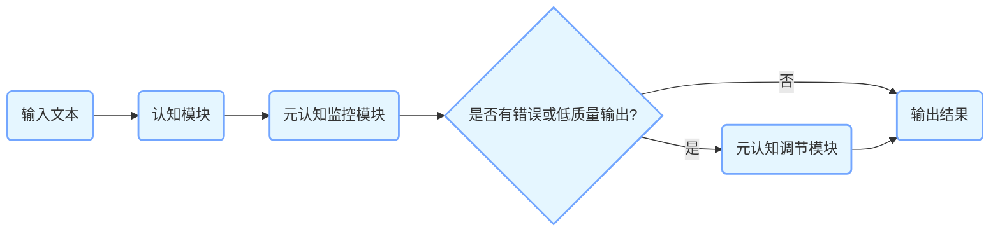

# 大规模语言模型的元认知能力评估与增强

> 关键词：大规模语言模型、元认知能力、能力评估、能力增强、自然语言处理

> 摘要：本文聚焦于大规模语言模型的元认知能力，旨在深入探讨其评估与增强的相关问题。首先介绍了研究背景、目的和范围，明确预期读者及文档结构。接着阐述核心概念与联系，包括元认知能力在大规模语言模型中的原理和架构，并给出相应的文本示意图和Mermaid流程图。详细讲解核心算法原理，用Python代码进行说明，同时给出相关数学模型和公式并举例。通过项目实战展示代码实现及解读，分析实际应用场景。推荐了学习资源、开发工具框架和相关论文著作。最后总结未来发展趋势与挑战，提供常见问题解答及扩展阅读和参考资料，帮助读者全面了解大规模语言模型元认知能力的评估与增强。

## 1. 背景介绍 
### 1.1 目的和范围
近年来，大规模语言模型如GPT - 3、ChatGPT等取得了显著的成果，在自然语言处理的多个任务中展现出强大的能力。然而，这些模型在处理复杂问题时，其元认知能力，即对自身认知过程的理解和调控能力，还存在一定的局限性。本研究的目的在于建立一套科学有效的评估体系来衡量大规模语言模型的元认知能力，并探索增强其元认知能力的方法和策略。

研究范围涵盖了多种主流的大规模语言模型，包括基于Transformer架构的模型，研究内容涉及元认知能力的多个维度，如自我评估、错误检测、学习策略调整等。同时，探讨如何通过训练数据、模型架构和训练方法的改进来增强模型的元认知能力。

### 1.2 预期读者
本文的预期读者包括自然语言处理领域的研究人员、开发者、对人工智能技术感兴趣的学者以及相关企业的技术人员。对于研究人员来说，本文可以为他们在大规模语言模型元认知能力的研究方面提供新的思路和方法；开发者可以借鉴文中的技术和代码实现来改进自己的模型；学者可以从理论层面深入了解元认知能力的相关概念和研究进展；企业技术人员则可以将这些研究成果应用到实际的产品开发中。

### 1.3 文档结构概述
本文共分为十个部分。第一部分为背景介绍，阐述研究的目的、范围、预期读者和文档结构；第二部分介绍核心概念与联系，解释元认知能力的原理和架构，并给出相应的示意图和流程图；第三部分讲解核心算法原理，并使用Python代码详细阐述；第四部分给出数学模型和公式，并进行详细讲解和举例说明；第五部分通过项目实战展示代码实现和详细解释；第六部分探讨实际应用场景；第七部分推荐学习资源、开发工具框架和相关论文著作；第八部分总结未来发展趋势与挑战；第九部分为附录，解答常见问题；第十部分提供扩展阅读和参考资料。

### 1.4 术语表
#### 1.4.1 核心术语定义
- **大规模语言模型（Large - Scale Language Model）**：指具有大量参数和强大语言处理能力的深度学习模型，通常在大规模文本数据上进行预训练，能够完成多种自然语言处理任务，如文本生成、问答系统等。
- **元认知能力（Metacognitive Ability）**：在大规模语言模型中，元认知能力是指模型对自身认知过程（如推理、决策、学习等）的理解和调控能力，包括自我评估、错误检测、学习策略调整等方面。
- **自我评估（Self - Assessment）**：模型对自身在完成特定任务时的表现进行评价的能力，例如判断自己的回答是否准确、可靠。
- **错误检测（Error Detection）**：模型识别自身在处理任务过程中产生错误的能力，如检测回答中的逻辑错误、事实错误等。
- **学习策略调整（Learning Strategy Adjustment）**：根据任务反馈和自我评估结果，模型调整自身学习方式和参数更新策略的能力。

#### 1.4.2 相关概念解释
- **认知能力（Cognitive Ability）**：模型处理和理解信息、进行推理和决策的基本能力，是元认知能力的基础。元认知能力是在认知能力的基础上，对认知过程进行监控和调节的能力。
- **预训练（Pretraining）**：大规模语言模型在大规模无监督文本数据上进行的初始训练，目的是学习语言的通用特征和模式。预训练可以为模型提供强大的语言基础，但不一定能直接赋予模型元认知能力。
- **微调（Fine - Tuning）**：在预训练的基础上，使用特定任务的有监督数据对模型进行进一步训练，以适应具体的任务需求。微调可以提高模型在特定任务上的性能，但对于元认知能力的提升可能需要特殊的设计。

#### 1.4.3 缩略词列表
- **GPT（Generative Pretrained Transformer）**：生成式预训练变换器，是一种基于Transformer架构的大规模语言模型。
- **NLP（Natural Language Processing）**：自然语言处理，是人工智能领域中研究如何让计算机理解和处理人类自然语言的学科。
- **API（Application Programming Interface）**：应用程序编程接口，是一组允许不同软件系统之间进行交互和通信的规则和工具。

## 2. 核心概念与联系 
### 核心概念原理
大规模语言模型的元认知能力是建立在其认知能力基础之上的。认知能力使模型能够处理和理解输入的文本信息，进行推理和生成输出。而元认知能力则负责对这个认知过程进行监控和调节。

从原理上讲，元认知能力可以分为三个主要方面：自我评估、错误检测和学习策略调整。自我评估是模型对自身输出的质量和可靠性进行判断的过程。例如，在回答一个问题时，模型可以根据自身的知识和推理过程，对回答的准确性进行打分。错误检测则是识别输出中存在的错误，这些错误可能包括逻辑错误、事实错误或语法错误等。模型可以通过比较输出与已知的正确答案或知识图谱来检测错误。学习策略调整是根据自我评估和错误检测的结果，调整模型的学习方式和参数更新策略。如果模型发现自己在某个任务上的表现不佳，它可以增加对相关数据的学习，或者调整优化算法的参数。

### 架构的文本示意图
```plaintext
大规模语言模型元认知能力架构

输入文本 -> 认知模块（处理和理解文本，进行推理和生成输出）
       |
       v
元认知监控模块（自我评估、错误检测）
       |
       v
元认知调节模块（学习策略调整）
       |
       v
输出结果（调整后的回答或学习策略）
```

### Mermaid流程图


在这个流程图中，输入文本首先经过认知模块进行处理和理解，生成输出。然后元认知监控模块对输出进行自我评估和错误检测。如果发现输出存在错误或质量较低，元认知调节模块会对学习策略进行调整，并重新生成输出。如果输出质量合格，则直接输出结果。

## 3. 核心算法原理 & 具体操作步骤 
### 自我评估算法原理
自我评估的目标是让模型对自己的输出进行质量评估。一种简单的方法是使用一个辅助模型来评估主模型的输出。假设主模型为 $M$，辅助模型为 $E$。辅助模型 $E$ 可以是一个经过训练的分类器，用于判断主模型的输出是否准确。

以下是使用Python实现的一个简单示例：
```python
import torch
import torch.nn as nn

# 定义主模型（简单示例，这里用一个全连接层代替）
class MainModel(nn.Module):
    def __init__(self, input_size, output_size):
        super(MainModel, self).__init__()
        self.fc = nn.Linear(input_size, output_size)

    def forward(self, x):
        return self.fc(x)

# 定义辅助评估模型
class EvaluationModel(nn.Module):
    def __init__(self, input_size):
        super(EvaluationModel, self).__init__()
        self.fc = nn.Linear(input_size, 1)
        self.sigmoid = nn.Sigmoid()

    def forward(self, x):
        x = self.fc(x)
        return self.sigmoid(x)

# 初始化模型
input_size = 10
output_size = 5
main_model = MainModel(input_size, output_size)
evaluation_model = EvaluationModel(output_size)

# 生成输入数据
input_data = torch.randn(1, input_size)

# 主模型进行推理
output = main_model(input_data)

# 辅助模型进行评估
score = evaluation_model(output)
print(f"评估分数: {score.item()}")
```
### 错误检测算法原理
错误检测可以通过与已知的正确答案或知识图谱进行比较来实现。例如，在问答系统中，可以将模型的回答与预先定义的标准答案进行对比，计算它们之间的相似度。如果相似度低于某个阈值，则认为模型的回答存在错误。

以下是一个简单的错误检测示例：
```python
import torch
from torch.nn.functional import cosine_similarity

# 假设这是标准答案的嵌入向量
correct_answer_embedding = torch.randn(1, 10)

# 模型生成的回答的嵌入向量
model_answer_embedding = torch.randn(1, 10)

# 计算余弦相似度
similarity = cosine_similarity(model_answer_embedding, correct_answer_embedding)

# 设定相似度阈值
threshold = 0.5

if similarity < threshold:
    print("检测到错误回答")
else:
    print("回答正确")
```
### 学习策略调整算法原理
学习策略调整可以根据自我评估和错误检测的结果来进行。例如，如果模型的评估分数较低或检测到错误回答，可以增加学习率或增加对相关数据的训练次数。

以下是一个简单的学习策略调整示例：
```python
import torch.optim as optim

# 初始化优化器
optimizer = optim.SGD(main_model.parameters(), lr=0.01)

# 假设这是评估分数
evaluation_score = 0.2

# 如果评估分数低于阈值，增加学习率
threshold = 0.5
if evaluation_score < threshold:
    for param_group in optimizer.param_groups:
        param_group['lr'] *= 1.1
    print(f"学习率调整为: {optimizer.param_groups[0]['lr']}")
```

## 4. 数学模型和公式 & 详细讲解 & 举例说明 
### 自我评估的数学模型
设主模型的输出为 $\mathbf{y} \in \mathbb{R}^n$，辅助评估模型的参数为 $\mathbf{W} \in \mathbb{R}^{n \times 1}$ 和 $b \in \mathbb{R}$。辅助评估模型的输出 $s$ 可以表示为：
$$s = \sigma(\mathbf{W}^T\mathbf{y} + b)$$
其中 $\sigma$ 是 sigmoid 函数，定义为 $\sigma(x)=\frac{1}{1 + e^{-x}}$。$s$ 的取值范围在 $[0, 1]$ 之间，越接近 1 表示评估分数越高，即主模型的输出质量越好。

例如，假设 $\mathbf{y} = [0.1, 0.2, 0.3]^T$，$\mathbf{W} = [0.4, 0.5, 0.6]^T$，$b = 0.1$。则：
$$\mathbf{W}^T\mathbf{y}=(0.4\times0.1 + 0.5\times0.2+0.6\times0.3)=0.32$$
$$s=\sigma(0.32 + 0.1)=\frac{1}{1 + e^{-(0.32 + 0.1)}}\approx0.603$$

### 错误检测的数学模型
设标准答案的嵌入向量为 $\mathbf{c} \in \mathbb{R}^m$，模型回答的嵌入向量为 $\mathbf{a} \in \mathbb{R}^m$。余弦相似度 $sim$ 可以表示为：
$$sim=\frac{\mathbf{c}^T\mathbf{a}}{\|\mathbf{c}\|\|\mathbf{a}\|}$$
其中 $\|\cdot\|$ 表示向量的 $L_2$ 范数。

例如，假设 $\mathbf{c} = [1, 0, 0]^T$，$\mathbf{a} = [0.8, 0.6, 0]^T$。则：
$$\|\mathbf{c}\|=\sqrt{1^2 + 0^2+0^2}=1$$
$$\|\mathbf{a}\|=\sqrt{0.8^2 + 0.6^2+0^2}=1$$
$$\mathbf{c}^T\mathbf{a}=1\times0.8+0\times0.6 + 0\times0=0.8$$
$$sim=\frac{0.8}{1\times1}=0.8$$

### 学习策略调整的数学模型
设初始学习率为 $\eta_0$，评估分数为 $s$，阈值为 $s_{th}$。如果 $s < s_{th}$，则调整后的学习率 $\eta$ 可以表示为：
$$\eta=\alpha\eta_0$$
其中 $\alpha > 1$ 是学习率调整因子。

例如，假设 $\eta_0 = 0.01$，$s = 0.2$，$s_{th}=0.5$，$\alpha = 1.1$。则调整后的学习率 $\eta = 1.1\times0.01 = 0.011$。

## 5. 项目实战：代码实际案例和详细解释说明 
### 5.1  开发环境搭建
#### 操作系统
建议使用 Linux 系统，如 Ubuntu 18.04 或更高版本，因为 Linux 系统在深度学习开发中具有良好的稳定性和兼容性。

#### 编程语言和版本
使用 Python 3.7 或更高版本，Python 是深度学习领域最常用的编程语言，具有丰富的库和工具。

#### 深度学习框架
使用 PyTorch 1.7 或更高版本，PyTorch 是一个开源的深度学习框架，具有动态图机制，易于使用和调试。

#### 安装依赖库
可以使用以下命令安装所需的依赖库：
```bash
pip install torch torchvision numpy scikit-learn
```

### 5.2  源代码详细实现和代码解读
#### 数据准备
假设我们有一个简单的问答数据集，包含问题、标准答案和模型回答。以下是一个简单的数据加载函数：
```python
import numpy as np

def load_data():
    # 模拟问题、标准答案和模型回答
    questions = ["What is the capital of France?", "What is the largest ocean?"]
    correct_answers = ["Paris", "Pacific Ocean"]
    model_answers = ["Paris", "Atlantic Ocean"]
    return questions, correct_answers, model_answers
```
#### 嵌入向量生成
使用预训练的语言模型（如 BERT）将文本转换为嵌入向量：
```python
from transformers import AutoTokenizer, AutoModel

tokenizer = AutoTokenizer.from_pretrained('bert-base-uncased')
model = AutoModel.from_pretrained('bert-base-uncased')

def get_embedding(text):
    inputs = tokenizer(text, return_tensors='pt')
    outputs = model(**inputs)
    # 取 [CLS] 标记的输出作为文本的嵌入向量
    embedding = outputs.last_hidden_state[:, 0, :].detach().numpy()
    return embedding
```
#### 错误检测和自我评估
```python
from torch.nn.functional import cosine_similarity

def evaluate_model(correct_answers, model_answers):
    scores = []
    error_flags = []
    for correct_answer, model_answer in zip(correct_answers, model_answers):
        correct_embedding = get_embedding(correct_answer)
        model_embedding = get_embedding(model_answer)
        correct_embedding = torch.tensor(correct_embedding)
        model_embedding = torch.tensor(model_embedding)
        similarity = cosine_similarity(model_embedding, correct_embedding)
        score = similarity.item()
        scores.append(score)
        # 设定相似度阈值
        threshold = 0.5
        if score < threshold:
            error_flags.append(True)
        else:
            error_flags.append(False)
    return scores, error_flags
```
#### 学习策略调整
```python
import torch.optim as optim

def adjust_learning_rate(optimizer, scores):
    average_score = np.mean(scores)
    # 设定评估分数阈值
    threshold = 0.5
    if average_score < threshold:
        for param_group in optimizer.param_groups:
            param_group['lr'] *= 1.1
        print(f"学习率调整为: {optimizer.param_groups[0]['lr']}")
    return optimizer
```
#### 主函数
```python
def main():
    questions, correct_answers, model_answers = load_data()
    scores, error_flags = evaluate_model(correct_answers, model_answers)
    # 初始化一个简单的模型和优化器
    input_size = 768
    output_size = 10
    simple_model = torch.nn.Linear(input_size, output_size)
    optimizer = optim.SGD(simple_model.parameters(), lr=0.01)
    optimizer = adjust_learning_rate(optimizer, scores)
    print("评估分数:", scores)
    print("错误标记:", error_flags)

if __name__ == "__main__":
    main()
```
### 5.3  代码解读与分析
- **数据准备**：`load_data` 函数模拟了一个简单的问答数据集，包含问题、标准答案和模型回答。
- **嵌入向量生成**：`get_embedding` 函数使用预训练的 BERT 模型将文本转换为嵌入向量，方便后续的相似度计算。
- **错误检测和自我评估**：`evaluate_model` 函数计算模型回答与标准答案的余弦相似度，根据相似度判断是否存在错误，并给出评估分数。
- **学习策略调整**：`adjust_learning_rate` 函数根据评估分数的平均值调整学习率，如果平均分数低于阈值，则增加学习率。
- **主函数**：`main` 函数调用上述函数完成整个流程，包括数据加载、评估和学习率调整，并输出评估分数和错误标记。

## 6. 实际应用场景 
### 智能问答系统
在智能问答系统中，大规模语言模型的元认知能力可以提高回答的准确性和可靠性。通过自我评估和错误检测，模型可以判断自己的回答是否合理，避免给出错误或不准确的信息。如果检测到错误，模型可以通过学习策略调整来改进自己的回答。例如，在医疗问答系统中，元认知能力可以帮助模型避免给出错误的医疗建议，保障用户的健康安全。

### 文本生成任务
在文本生成任务中，如文章写作、故事生成等，元认知能力可以使模型对生成的文本进行质量评估。模型可以检查文本的逻辑连贯性、语法正确性和内容相关性等方面。如果发现问题，模型可以调整生成策略，生成更优质的文本。例如，在新闻写作中，模型可以自我评估生成的新闻报道是否客观、准确，避免出现虚假信息。

### 智能教育辅助
在智能教育辅助系统中，大规模语言模型的元认知能力可以用于评估学生的回答和学习情况。模型可以判断学生的回答是否正确，分析学生的学习困难，并根据评估结果调整教学策略。例如，在在线学习平台中，模型可以根据学生的作业和测试回答，为学生提供个性化的学习建议和辅导。

### 信息检索系统
在信息检索系统中，元认知能力可以帮助模型评估检索结果的相关性和可靠性。模型可以对检索到的文档进行自我评估，判断其是否满足用户的需求。如果检索结果不理想，模型可以调整检索策略，提高检索的准确性。例如，在学术文献检索中，模型可以评估文献的质量和相关性，为用户提供更有价值的检索结果。

## 7. 工具和资源推荐
### 7.1 学习资源推荐
#### 7.1.1 书籍推荐
- 《深度学习》（Deep Learning）：由 Ian Goodfellow、Yoshua Bengio 和 Aaron Courville 所著，是深度学习领域的经典教材，涵盖了神经网络、优化算法、深度学习应用等方面的内容，对于理解大规模语言模型的原理和技术有很大帮助。
- 《自然语言处理入门》（Natural Language Processing with Python）：由 Steven Bird、Ewan Klein 和 Edward Loper 所著，介绍了使用 Python 进行自然语言处理的基础知识和技术，包括文本处理、词法分析、句法分析等内容，适合初学者入门。
- 《动手学深度学习》（Dive into Deep Learning）：由 Aston Zhang、Zachary C. Lipton、Mu Li 和 Alexander J. Smola 所著，提供了丰富的深度学习实践案例和代码实现，帮助读者快速上手深度学习开发。

#### 7.1.2 在线课程
- Coursera 上的“深度学习专项课程”（Deep Learning Specialization）：由 Andrew Ng 教授授课，包括神经网络、卷积神经网络、循环神经网络等多个方面的内容，是学习深度学习的优质课程。
- edX 上的“自然语言处理基础”（Foundations of Natural Language Processing）：介绍了自然语言处理的基本概念、算法和技术，适合对自然语言处理感兴趣的学习者。
- 哔哩哔哩（B 站）上有很多关于深度学习和自然语言处理的教学视频，如“李宏毅机器学习课程”，内容生动易懂，适合初学者学习。

#### 7.1.3 技术博客和网站
- arXiv.org：是一个收集物理学、数学、计算机科学等领域预印本论文的网站，提供了大量关于大规模语言模型和元认知能力的最新研究成果。
- Medium：有很多技术博客作者分享关于深度学习和自然语言处理的经验和见解，如 Towards Data Science 板块，经常发布高质量的技术文章。
- 机器之心：是一个专注于人工智能领域的媒体平台，提供了丰富的技术资讯、研究报告和行业动态。

### 7.2 开发工具框架推荐
#### 7.2.1 IDE和编辑器
- PyCharm：是一款专业的 Python 集成开发环境（IDE），具有代码自动补全、调试、版本控制等功能，适合大规模 Python 项目的开发。
- Jupyter Notebook：是一个交互式的开发环境，支持代码、文本、图表等多种形式的展示，方便进行数据探索和模型实验。
- Visual Studio Code：是一款轻量级的代码编辑器，支持多种编程语言和插件扩展，具有丰富的代码编辑和调试功能。

#### 7.2.2 调试和性能分析工具
- TensorBoard：是 TensorFlow 提供的可视化工具，也可以与 PyTorch 结合使用，用于可视化模型的训练过程、损失函数变化、参数分布等信息，帮助开发者调试和优化模型。
- PyTorch Profiler：是 PyTorch 自带的性能分析工具，可以分析模型的运行时间、内存使用情况等，帮助开发者找出性能瓶颈。
- NVIDIA Nsight Systems：是 NVIDIA 提供的性能分析工具，专门用于分析 GPU 加速的深度学习应用程序，能够详细分析 GPU 的使用情况和性能指标。

#### 7.2.3 相关框架和库
- PyTorch：是一个开源的深度学习框架，具有动态图机制，易于使用和调试，广泛应用于自然语言处理、计算机视觉等领域。
- Hugging Face Transformers：是一个提供预训练模型和工具的库，包含了多种大规模语言模型，如 BERT、GPT - 2 等，方便开发者快速使用和微调这些模型。
- AllenNLP：是一个用于自然语言处理的深度学习框架，提供了丰富的工具和组件，帮助开发者构建和训练自然语言处理模型。

### 7.3 相关论文著作推荐
#### 7.3.1 经典论文
- “Attention Is All You Need”：提出了 Transformer 架构，是大规模语言模型的基础，为自然语言处理带来了革命性的变化。
- “BERT: Pre - training of Deep Bidirectional Transformers for Language Understanding”：介绍了 BERT 模型的预训练方法和架构，显著提高了自然语言处理任务的性能。
- “Improving Language Understanding by Generative Pre - Training”：提出了 GPT 模型的预训练方法，开启了生成式预训练语言模型的研究热潮。

#### 7.3.2 最新研究成果
- 关注 arXiv.org 上关于大规模语言模型元认知能力的最新论文，如探讨如何在模型中引入元认知机制、如何评估模型的元认知能力等方面的研究。
- 顶级学术会议如 ACL（Association for Computational Linguistics）、NeurIPS（Neural Information Processing Systems）等上发表的相关论文，代表了该领域的最新研究进展。

#### 7.3.3 应用案例分析
- 可以在 ACM Digital Library、IEEE Xplore 等数据库中查找大规模语言模型元认知能力在实际应用中的案例分析论文，了解这些技术在不同领域的应用效果和挑战。

## 8. 总结：未来发展趋势与挑战
### 未来发展趋势
#### 更强大的元认知能力
未来的大规模语言模型将具备更强大的元认知能力，能够更准确地进行自我评估和错误检测，并且能够更灵活地调整学习策略。例如，模型可以根据不同的任务和输入动态地调整自己的推理过程和输出方式。

#### 与其他技术的融合
大规模语言模型的元认知能力将与其他技术如知识图谱、强化学习等进行更深入的融合。知识图谱可以为模型提供更丰富的背景知识，帮助模型更好地进行错误检测和推理；强化学习可以用于优化模型的学习策略，提高模型的学习效率和性能。

#### 应用领域的拓展
随着元认知能力的提升，大规模语言模型将在更多领域得到应用，如金融、法律、科学研究等。在金融领域，模型可以用于风险评估和投资决策；在法律领域，模型可以用于法律文书的审查和法律咨询；在科学研究领域，模型可以用于文献综述和研究思路的启发。

### 挑战
#### 评估标准的统一
目前，对于大规模语言模型元认知能力的评估还没有统一的标准和方法。不同的研究和应用可能采用不同的评估指标和数据集，导致评估结果缺乏可比性。未来需要建立一套科学、统一的评估标准，以便更好地衡量模型的元认知能力。

#### 计算资源的需求
提高大规模语言模型的元认知能力通常需要更多的计算资源和数据。训练和优化具有元认知能力的模型需要大量的 GPU 计算资源和存储空间，这对于许多研究机构和企业来说是一个巨大的挑战。未来需要开发更高效的算法和模型架构，降低计算资源的需求。

#### 伦理和安全问题
随着大规模语言模型在各个领域的广泛应用，其元认知能力可能会带来一些伦理和安全问题。例如，模型可能会产生偏见和歧视性的输出，或者被恶意利用进行虚假信息传播。未来需要加强对模型的伦理和安全监管，确保模型的使用符合人类的价值观和利益。

## 9. 附录：常见问题与解答
### 什么是大规模语言模型的元认知能力？
大规模语言模型的元认知能力是指模型对自身认知过程的理解和调控能力，包括自我评估、错误检测、学习策略调整等方面。它可以帮助模型提高回答的准确性和可靠性，更好地适应不同的任务和输入。

### 如何评估大规模语言模型的元认知能力？
可以从多个方面评估大规模语言模型的元认知能力，如自我评估能力可以通过辅助模型对主模型的输出进行打分；错误检测能力可以通过比较模型回答与标准答案的相似度来评估；学习策略调整能力可以观察模型在不同任务和反馈下的学习率和参数更新情况。

### 增强大规模语言模型元认知能力有哪些方法？
增强大规模语言模型元认知能力的方法包括设计特殊的训练数据和任务，引入辅助模型进行评估和监督，采用强化学习等优化算法来调整学习策略等。

### 大规模语言模型的元认知能力在实际应用中有哪些局限性？
目前大规模语言模型的元认知能力还存在一定的局限性，如评估标准不统一、计算资源需求大、可能产生偏见和歧视性输出等。此外，模型在处理复杂问题和新领域任务时，元认知能力可能还不够强大。

## 10. 扩展阅读 & 参考资料
### 扩展阅读
- 《人工智能：现代方法》（Artificial Intelligence: A Modern Approach）：全面介绍了人工智能的各个领域，包括知识表示、推理、学习等内容，有助于深入理解大规模语言模型的基础理论。
- 《深度学习实战》（Deep Learning in Practice）：通过实际案例介绍了深度学习在不同领域的应用，为大规模语言模型的实际应用提供了参考。

### 参考资料
- Goodfellow, I., Bengio, Y., & Courville, A. (2016). Deep Learning. MIT Press.
- Bird, S., Klein, E., & Loper, E. (2009). Natural Language Processing with Python. O'Reilly Media.
- Vaswani, A., Shazeer, N., Parmar, N., Uszkoreit, J., Jones, L., Gomez, A. N.,... & Polosukhin, I. (2017). Attention is all you need. Advances in neural information processing systems, 5998 - 6008.
- Devlin, J., Chang, M. W., Lee, K., & Toutanova, K. (2018). Bert: Pre - training of deep bidirectional transformers for language understanding. arXiv preprint arXiv:1810.04805.
- Radford, A., Narasimhan, K., Salimans, T., & Sutskever, I. (2018). Improving language understanding by generative pre - training.

作者：AI天才研究院/AI Genius Institute & 禅与计算机程序设计艺术 /Zen And The Art of Computer Programming