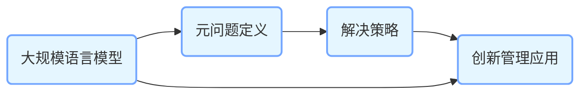

# 大规模语言模型的元问题定义与解决策略在创新管理中的应用

> 关键词：大规模语言模型、元问题定义、解决策略、创新管理、应用

> 摘要：本文聚焦于大规模语言模型的元问题定义与解决策略在创新管理中的应用。首先介绍了相关背景，包括目的范围、预期读者等内容。接着阐述了核心概念及其联系，分析了核心算法原理并给出具体操作步骤，同时借助数学模型和公式进行详细讲解与举例。通过项目实战展示了代码实现及解读，探讨了实际应用场景。还推荐了相关工具和资源，最后总结了未来发展趋势与挑战，解答了常见问题并提供了扩展阅读与参考资料，旨在为创新管理领域有效利用大规模语言模型提供全面的指导和深入的见解。

## 1. 背景介绍 
### 1.1 目的和范围
在当今数字化时代，大规模语言模型如ChatGPT、文心一言等取得了巨大的进展，展现出强大的语言理解和生成能力。本研究的目的在于深入探讨大规模语言模型的元问题定义与解决策略在创新管理中的应用，旨在揭示如何利用这些先进技术提升创新管理的效率和质量，推动企业和组织的创新发展。

研究范围涵盖了大规模语言模型的基本原理、元问题的定义方法、解决策略的构建，以及在创新管理的各个环节，如创意生成、项目评估、风险管理等方面的具体应用。同时，也会涉及到相关技术的发展趋势和面临的挑战。

### 1.2 预期读者
本文预期读者包括创新管理领域的从业者，如企业的创新主管、项目经理、研发人员等，他们可以从文中了解如何借助大规模语言模型改进创新管理流程和方法。同时，也适合对人工智能技术在管理领域应用感兴趣的学者和研究人员，为他们的学术研究提供参考。此外，对于从事大规模语言模型开发和优化的技术人员，本文关于在创新管理场景中的应用需求分析也具有一定的借鉴意义。

### 1.3 文档结构概述
本文将按照以下结构进行阐述：首先介绍相关背景信息，让读者了解研究的目的、范围、预期读者和文档整体结构。接着深入讲解核心概念与联系，包括大规模语言模型、元问题定义等核心概念的原理和架构，并通过示意图和流程图进行直观展示。然后详细分析核心算法原理，给出具体操作步骤，并使用Python代码进行说明。之后介绍数学模型和公式，结合实际例子进行详细讲解。通过项目实战部分，展示代码的实际案例，包括开发环境搭建、源代码实现和解读。探讨大规模语言模型在创新管理中的实际应用场景，推荐相关的工具和资源。最后总结未来发展趋势与挑战，解答常见问题，并提供扩展阅读和参考资料。

### 1.4 术语表
#### 1.4.1 核心术语定义
- **大规模语言模型（Large Language Model, LLM）**：是一种基于深度学习技术，通过在大规模文本数据上进行训练，学习语言的统计规律和语义信息，从而具备强大的语言理解和生成能力的模型。例如GPT - 3、BERT等。
- **元问题（Meta - problem）**：是指关于问题的问题，即对问题本身的定义、性质、结构等方面进行思考和研究的问题。在本文中，大规模语言模型的元问题是指与大规模语言模型相关的各类问题的抽象和概括。
- **创新管理（Innovation Management）**：是指企业或组织为了实现创新目标，对创新活动进行规划、组织、协调、控制等一系列管理活动的过程，包括创意产生、研发、商业化等环节。

#### 1.4.2 相关概念解释
- **语言理解（Language Understanding）**：是指大规模语言模型能够分析和理解输入文本的语义、语法、语用等信息，从而准确把握文本的含义。例如，能够识别文本中的实体、关系、情感等。
- **语言生成（Language Generation）**：是指模型根据输入的提示或上下文信息，生成符合语法和语义规则的文本内容。比如生成文章、对话回复等。
- **解决策略（Solution Strategy）**：是指针对特定问题所制定的一系列解决方案和方法，旨在有效地解决问题并达到预期目标。在本文中，是指针对大规模语言模型元问题的解决办法。

#### 1.4.3 缩略词列表
- **LLM**：Large Language Model（大规模语言模型）
- **GPT**：Generative Pretrained Transformer（生成式预训练变换器）
- **BERT**：Bidirectional Encoder Representations from Transformers（基于变换器的双向编码器表示）

## 2. 核心概念与联系 
### 大规模语言模型原理
大规模语言模型通常基于深度学习架构，如Transformer架构。Transformer架构由编码器和解码器组成，其核心是多头注意力机制（Multi - Head Attention）。多头注意力机制允许模型在处理输入序列时，同时关注不同位置的信息，从而捕捉序列中的长距离依赖关系。

其工作流程大致如下：首先，输入文本被分词（Tokenization）成一系列的词元（Tokens），每个词元被映射为一个低维向量表示（Embedding）。然后，这些向量通过多层的Transformer块进行处理，在每个块中，多头注意力机制和前馈神经网络（Feed - Forward Network）交替作用，不断提取和转换特征。最后，经过处理的向量被用于语言理解任务（如分类、问答等）或语言生成任务（如文本生成、对话生成等）。

### 元问题定义原理
元问题定义是对大规模语言模型相关问题进行抽象和概括的过程。在创新管理中，元问题可能涉及到模型的适用性、准确性、效率等方面。例如，“如何评估大规模语言模型在创意生成任务中的有效性”就是一个元问题。元问题的定义需要考虑问题的背景、目标、约束条件等因素，通过对具体问题的分析和归纳，提炼出具有普遍性和代表性的问题。

### 解决策略原理
解决策略是针对元问题而制定的一系列解决方案。对于大规模语言模型的元问题，解决策略可能包括模型选择、参数调整、数据增强等方法。例如，针对模型在创意生成任务中准确性不高的问题，可以通过选择更适合的模型架构、调整模型的超参数、使用更多样化的训练数据等策略来解决。

### 核心概念架构示意图

该流程图展示了核心概念之间的联系。大规模语言模型是基础，基于此可以定义出相关的元问题，针对元问题制定解决策略，最终将这些应用到创新管理中。同时，大规模语言模型也可以直接应用于创新管理。

## 3. 核心算法原理 & 具体操作步骤 
### 核心算法原理 - 多头注意力机制
多头注意力机制是大规模语言模型中的关键算法之一。其核心思想是将输入的查询（Query）、键（Key）和值（Value）向量分别通过多个线性变换得到多个头（Head），每个头独立地计算注意力分数，然后将这些分数进行拼接和线性变换得到最终的输出。

以下是多头注意力机制的Python代码实现：
```python
import torch
import torch.nn as nn

class MultiHeadAttention(nn.Module):
    def __init__(self, d_model, num_heads):
        super(MultiHeadAttention, self).__init__()
        assert d_model % num_heads == 0, "d_model must be divisible by num_heads"

        self.d_model = d_model
        self.num_heads = num_heads
        self.d_k = d_model // num_heads

        self.W_q = nn.Linear(d_model, d_model)
        self.W_k = nn.Linear(d_model, d_model)
        self.W_v = nn.Linear(d_model, d_model)
        self.W_o = nn.Linear(d_model, d_model)

    def scaled_dot_product_attention(self, Q, K, V, mask=None):
        attn_scores = torch.matmul(Q, K.transpose(-2, -1)) / torch.sqrt(torch.tensor(self.d_k, dtype=torch.float32))
        if mask is not None:
            attn_scores = attn_scores.masked_fill(mask == 0, -1e9)
        attn_probs = torch.softmax(attn_scores, dim=-1)
        output = torch.matmul(attn_probs, V)
        return output

    def split_heads(self, x):
        batch_size, seq_length, d_model = x.size()
        return x.view(batch_size, seq_length, self.num_heads, self.d_k).transpose(1, 2)

    def combine_heads(self, x):
        batch_size, num_heads, seq_length, d_k = x.size()
        return x.transpose(1, 2).contiguous().view(batch_size, seq_length, self.d_model)

    def forward(self, Q, K, V, mask=None):
        Q = self.split_heads(self.W_q(Q))
        K = self.split_heads(self.W_k(K))
        V = self.split_heads(self.W_v(V))

        attn_output = self.scaled_dot_product_attention(Q, K, V, mask)
        output = self.W_o(self.combine_heads(attn_output))
        return output
```
### 具体操作步骤
1. **数据预处理**：将输入的文本数据进行分词处理，将其转换为词元序列，并将词元映射为对应的向量表示。
```python
import torch
from transformers import AutoTokenizer

tokenizer = AutoTokenizer.from_pretrained('bert-base-uncased')
text = "This is an example sentence."
inputs = tokenizer(text, return_tensors='pt')
```
2. **模型初始化**：初始化大规模语言模型，这里以BERT为例。
```python
from transformers import AutoModel

model = AutoModel.from_pretrained('bert-base-uncased')
```
3. **前向传播**：将预处理后的输入数据传入模型进行前向传播，得到模型的输出。
```python
outputs = model(**inputs)
last_hidden_state = outputs.last_hidden_state
```
4. **应用元问题定义和解决策略**：根据具体的元问题，如模型输出的准确性评估，可以使用相应的指标（如准确率、召回率等）进行评估，并根据评估结果调整模型的参数或选择更合适的模型。

## 4. 数学模型和公式 & 详细讲解 & 举例说明 
### 多头注意力机制数学模型
多头注意力机制的数学模型可以表示为：

$$\text{MultiHead}(Q, K, V)=\text{Concat}(\text{head}_1,\cdots,\text{head}_h)W^O$$

其中，$\text{head}_i=\text{Attention}(QW_i^Q, KW_i^K, VW_i^V)$，$\text{Attention}(Q, K, V)=\text{softmax}\left(\frac{QK^T}{\sqrt{d_k}}\right)V$。

- $Q$、$K$、$V$ 分别是查询、键和值矩阵。
- $W_i^Q$、$W_i^K$、$W_i^V$ 是第 $i$ 个头的线性变换矩阵。
- $W^O$ 是最终的线性变换矩阵。
- $d_k$ 是键向量的维度。

### 详细讲解
1. **缩放点积注意力**：$\text{Attention}(Q, K, V)$ 计算了查询和键之间的相似度，通过 $\frac{QK^T}{\sqrt{d_k}}$ 得到注意力分数，然后使用 $\text{softmax}$ 函数将分数归一化得到注意力概率，最后将注意力概率与值矩阵相乘得到输出。
2. **多头注意力**：通过多个头独立地计算注意力，每个头关注不同的信息，然后将这些头的输出拼接起来并进行线性变换得到最终的多头注意力输出。

### 举例说明
假设我们有一个输入序列 $x = [x_1, x_2, x_3]$，每个 $x_i$ 是一个长度为 $d_{model}=128$ 的向量。我们设置头的数量 $h = 8$，则 $d_k=\frac{d_{model}}{h}=16$。

- **查询、键和值的线性变换**：对于每个头 $i$，我们有 $W_i^Q$、$W_i^K$、$W_i^V$ 矩阵，将输入 $x$ 分别与这些矩阵相乘得到 $QW_i^Q$、$KW_i^K$、$VW_i^V$。
- **缩放点积注意力计算**：对于每个头，计算 $\text{Attention}(QW_i^Q, KW_i^K, VW_i^V)$，得到每个头的输出。
- **多头拼接和线性变换**：将所有头的输出拼接起来，然后与 $W^O$ 矩阵相乘得到最终的多头注意力输出。

## 5. 项目实战：代码实际案例和详细解释说明 
### 5.1  开发环境搭建
#### 安装Python
首先，确保你已经安装了Python 3.7及以上版本。可以从Python官方网站（https://www.python.org/downloads/）下载并安装。

#### 安装必要的库
使用pip安装以下必要的库：
```bash
pip install torch transformers numpy pandas
```
- `torch`：PyTorch深度学习框架，用于构建和训练神经网络。
- `transformers`：Hugging Face提供的用于自然语言处理的库，包含了多种预训练的大规模语言模型。
- `numpy`：用于数值计算。
- `pandas`：用于数据处理和分析。

### 5.2  源代码详细实现和代码解读
#### 创意生成任务示例
以下是一个使用大规模语言模型进行创意生成的代码示例：
```python
from transformers import AutoModelForCausalLM, AutoTokenizer

# 加载预训练模型和分词器
model_name = "gpt2"
tokenizer = AutoTokenizer.from_pretrained(model_name)
model = AutoModelForCausalLM.from_pretrained(model_name)

# 输入提示
prompt = "请生成一个关于新产品的创意："

# 对提示进行分词
input_ids = tokenizer.encode(prompt, return_tensors='pt')

# 生成文本
output = model.generate(input_ids, max_length=100, num_return_sequences=1)

# 解码生成的文本
generated_text = tokenizer.decode(output[0], skip_special_tokens=True)

print(generated_text)
```
#### 代码解读
1. **加载预训练模型和分词器**：使用 `AutoTokenizer` 和 `AutoModelForCausalLM` 从Hugging Face的模型库中加载预训练的GPT - 2模型和对应的分词器。
2. **输入提示**：定义一个创意生成的提示文本，作为模型生成的起始点。
3. **分词**：使用分词器将提示文本转换为模型可以接受的输入ID序列。
4. **文本生成**：调用模型的 `generate` 方法，设置生成文本的最大长度和返回序列的数量，生成文本。
5. **解码**：使用分词器将生成的ID序列解码为可读的文本。

### 5.3  代码解读与分析
- **模型选择**：选择GPT - 2作为示例模型，是因为它是一个广泛使用的生成式预训练模型，具有较强的文本生成能力。
- **参数设置**：`max_length` 参数控制生成文本的最大长度，`num_return_sequences` 参数控制返回的生成序列数量。可以根据具体需求调整这些参数。
- **局限性**：当前代码只是一个简单的示例，生成的创意可能不够新颖或符合实际需求。可以通过调整模型、增加训练数据、使用更复杂的生成策略等方法来改进。

## 6. 实际应用场景 
### 创意生成
大规模语言模型可以为创新管理中的创意生成提供丰富的灵感。例如，在新产品研发阶段，企业可以使用语言模型生成关于产品功能、设计、营销方案等方面的创意。通过输入相关的关键词和约束条件，模型可以生成多个不同的创意方案，供研发团队参考和筛选。

### 项目评估
在创新项目评估过程中，语言模型可以帮助评估项目的可行性、创新性和市场潜力。模型可以分析项目的文档、报告等文本信息，提取关键信息并进行评估。例如，通过分析项目的技术方案和市场调研报告，模型可以预测项目的成功率和潜在风险。

### 风险管理
语言模型可以用于识别和评估创新项目中的风险。通过对历史项目数据和相关文献的学习，模型可以识别出可能导致项目失败的风险因素，并提供相应的应对策略。例如，模型可以分析市场趋势、竞争对手动态等信息，预测项目可能面临的市场风险，并建议企业采取相应的措施来降低风险。

### 知识管理
在创新管理中，知识管理是非常重要的。大规模语言模型可以帮助企业整合和管理内部的知识资源。模型可以对企业的文档、报告、专利等知识资产进行语义分析，建立知识图谱，方便员工查询和共享知识。同时，模型还可以根据员工的查询需求，生成相关的知识推荐和解答。

## 7. 工具和资源推荐
### 7.1 学习资源推荐
#### 7.1.1 书籍推荐
- 《深度学习》（Deep Learning）：由Ian Goodfellow、Yoshua Bengio和Aaron Courville撰写，是深度学习领域的经典教材，涵盖了深度学习的基本原理、算法和应用。
- 《自然语言处理入门》（Natural Language Processing with Python）：介绍了使用Python进行自然语言处理的基本方法和技术，适合初学者入门。
- 《Transformers for Natural Language Processing》：详细介绍了Transformer架构在自然语言处理中的应用，包括大规模语言模型的训练和使用。

#### 7.1.2 在线课程
- Coursera上的“Deep Learning Specialization”：由Andrew Ng教授讲授，是深度学习领域的经典在线课程，涵盖了深度学习的各个方面。
- edX上的“Natural Language Processing”：提供了自然语言处理的系统学习课程，包括语言模型、文本分类、机器翻译等内容。
- Hugging Face的官方教程：提供了关于使用Hugging Face库进行大规模语言模型开发的详细教程和示例代码。

#### 7.1.3 技术博客和网站
- Hugging Face博客（https://huggingface.co/blog）：发布了关于大规模语言模型的最新研究成果、技术应用和工具介绍。
- Towards Data Science（https://towardsdatascience.com/）：汇集了大量的数据科学和人工智能领域的技术文章和案例分析。
- arXiv（https://arxiv.org/）：提供了最新的学术论文预印本，包括大规模语言模型的研究论文。

### 7.2 开发工具框架推荐
#### 7.2.1 IDE和编辑器
- PyCharm：是一款专业的Python集成开发环境，提供了丰富的代码编辑、调试和项目管理功能。
- Jupyter Notebook：是一个交互式的开发环境，适合进行数据分析、模型训练和实验验证。
- Visual Studio Code：是一款轻量级的代码编辑器，支持多种编程语言和插件扩展，可用于大规模语言模型的开发。

#### 7.2.2 调试和性能分析工具
- PyTorch Profiler：是PyTorch提供的性能分析工具，可以帮助开发者分析模型的训练和推理过程中的性能瓶颈。
- TensorBoard：是TensorFlow提供的可视化工具，也可以与PyTorch集成，用于可视化模型的训练过程和性能指标。
- cProfile：是Python标准库中的性能分析工具，可以分析Python代码的执行时间和调用关系。

#### 7.2.3 相关框架和库
- PyTorch：是一个开源的深度学习框架，具有动态图机制，方便模型的开发和调试。
- Hugging Face Transformers：提供了多种预训练的大规模语言模型和相关工具，方便开发者快速使用和微调模型。
- AllenNLP：是一个用于自然语言处理的深度学习框架，提供了丰富的模型和工具，可用于文本分类、命名实体识别等任务。

### 7.3 相关论文著作推荐
#### 7.3.1 经典论文
- “Attention Is All You Need”：提出了Transformer架构，是大规模语言模型的基础。
- “BERT: Pre-training of Deep Bidirectional Transformers for Language Understanding”：介绍了BERT模型，开启了预训练语言模型在自然语言处理中的广泛应用。
- “Generative Pretrained Transformer 3”：介绍了GPT - 3模型，展示了大规模语言模型在语言生成任务中的强大能力。

#### 7.3.2 最新研究成果
- 关注ACL（Association for Computational Linguistics）、EMNLP（Conference on Empirical Methods in Natural Language Processing）等自然语言处理领域的顶级会议，获取最新的研究成果。
- 关注arXiv上关于大规模语言模型的最新论文，了解技术的发展趋势。

#### 7.3.3 应用案例分析
- 企业的技术博客和研究报告：许多科技公司会分享他们在大规模语言模型应用方面的案例和经验，如Google、Microsoft等。
- 学术期刊和会议论文中的应用案例：研究人员会发表关于大规模语言模型在不同领域应用的案例分析，为实际应用提供参考。

## 8. 总结：未来发展趋势与挑战
### 未来发展趋势
#### 模型性能提升
随着计算资源的不断增加和算法的不断改进，大规模语言模型的性能将不断提升。模型的语言理解和生成能力将更加准确和自然，能够处理更加复杂和多样化的任务。

#### 跨领域应用拓展
大规模语言模型将在更多的领域得到应用，如医疗、金融、教育等。在创新管理中，也将与其他技术如物联网、大数据等深度融合，为企业提供更加全面和智能的解决方案。

#### 个性化定制
未来的大规模语言模型将更加注重个性化定制。根据不同用户的需求和偏好，模型可以提供个性化的创意生成、项目评估等服务，提高创新管理的效率和效果。

### 挑战
#### 数据隐私和安全
大规模语言模型需要大量的数据进行训练，这些数据可能包含用户的敏感信息。如何保护数据的隐私和安全，防止数据泄露和滥用，是一个亟待解决的问题。

#### 模型可解释性
大规模语言模型通常是黑盒模型，其决策过程和输出结果难以解释。在创新管理中，需要对模型的决策进行解释和验证，以确保决策的可靠性和合理性。

#### 伦理和社会影响
大规模语言模型的广泛应用可能会带来一些伦理和社会问题，如虚假信息传播、就业结构变化等。需要建立相应的伦理准则和监管机制，引导技术的健康发展。

## 9. 附录：常见问题与解答
### 问题1：大规模语言模型在创意生成中的效果如何评估？
可以从多个方面进行评估，如创意的新颖性、可行性、实用性等。可以邀请专业人士进行主观评估，也可以使用一些客观指标，如与已有创意的相似度等进行评估。

### 问题2：如何选择适合创新管理的大规模语言模型？
需要考虑模型的性能、适用场景、训练数据等因素。对于创意生成任务，可以选择具有较强生成能力的模型，如GPT系列；对于文本分类和信息提取任务，可以选择BERT等模型。

### 问题3：大规模语言模型的训练成本高吗？
大规模语言模型的训练需要大量的计算资源和数据，训练成本相对较高。可以使用预训练模型进行微调，降低训练成本。

### 问题4：如何解决大规模语言模型的可解释性问题？
可以采用一些方法来提高模型的可解释性，如特征重要性分析、决策树等。同时，也可以结合人类的专业知识和经验，对模型的决策进行解释和验证。

## 10. 扩展阅读 & 参考资料
### 扩展阅读
- 《人工智能时代的创新管理》：探讨了人工智能技术在创新管理中的应用和挑战。
- 《智能时代：大数据与智能革命重新定义未来》：介绍了大数据和人工智能技术对社会和经济的影响。

### 参考资料
- Hugging Face官方文档（https://huggingface.co/docs）
- PyTorch官方文档（https://pytorch.org/docs/stable/index.html）
- 相关学术论文和研究报告

作者：AI天才研究院/AI Genius Institute & 禅与计算机程序设计艺术 /Zen And The Art of Computer Programming