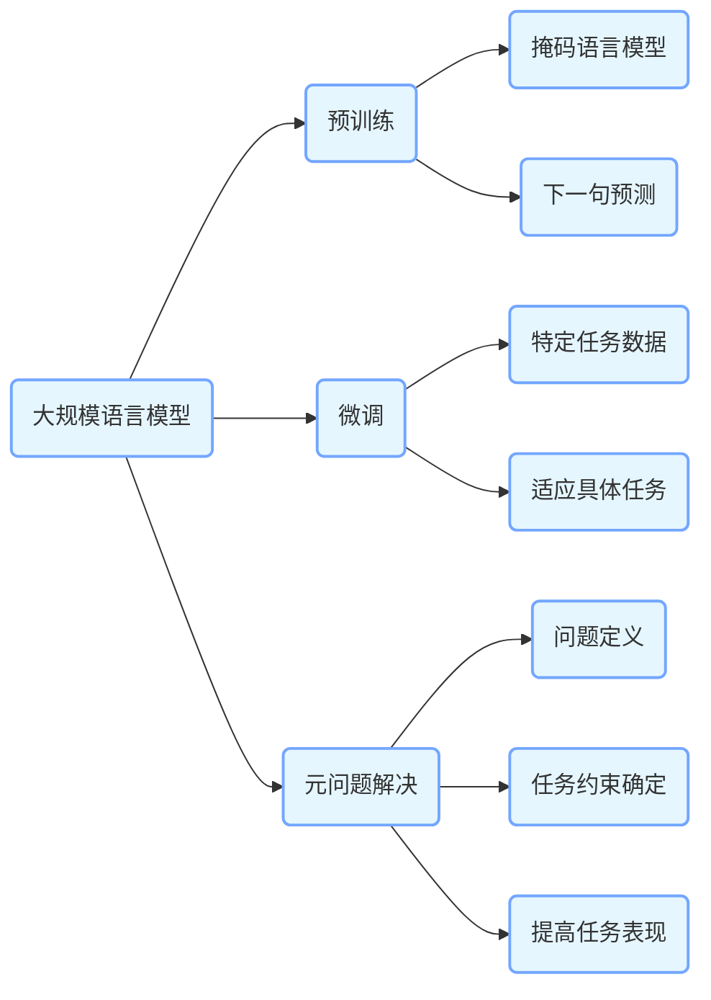

# 大规模语言模型的元问题定义与解决能力

> 关键词：大规模语言模型、元问题定义、解决能力、自然语言处理、人工智能

> 摘要：本文围绕大规模语言模型的元问题定义与解决能力展开深入探讨。首先介绍了研究的背景、目的、预期读者和文档结构等内容。接着阐述了大规模语言模型及元问题的核心概念与联系，包括其原理和架构，并以示意图和流程图展示。详细讲解了相关核心算法原理及具体操作步骤，辅以Python源代码说明。同时给出了数学模型和公式，并举例进行解释。通过项目实战，展示了代码的实际案例及详细解读。分析了大规模语言模型在实际中的应用场景，推荐了相关的学习资源、开发工具框架和论文著作。最后总结了其未来发展趋势与挑战，还提供了常见问题解答和扩展阅读参考资料，旨在全面深入地剖析大规模语言模型在元问题定义与解决方面的能力。

## 1. 背景介绍 
### 1.1 目的和范围
近年来，大规模语言模型（LLMs）如GPT - 3、BERT等取得了令人瞩目的进展，在自然语言处理的多个任务中展现出强大的能力。然而，对于大规模语言模型如何定义元问题以及其解决元问题的能力，目前还缺乏系统的研究。本文的目的在于深入探讨大规模语言模型的元问题定义方式以及其在解决这些元问题上的表现和局限性。

研究范围涵盖了大规模语言模型的基本原理、核心算法、数学模型，以及在实际项目中的应用。同时，还会分析不同场景下大规模语言模型解决元问题的有效性和潜在挑战。

### 1.2 预期读者
本文预期读者包括自然语言处理领域的研究人员、人工智能开发者、对大规模语言模型感兴趣的学生以及相关行业的从业者。对于希望深入了解大规模语言模型在元问题解决方面能力的专业人士，本文将提供有价值的技术参考和思路。

### 1.3 文档结构概述
本文共分为十个部分。第一部分为背景介绍，阐述研究的目的、范围、预期读者和文档结构。第二部分介绍大规模语言模型和元问题的核心概念与联系，通过示意图和流程图展示其原理和架构。第三部分详细讲解核心算法原理和具体操作步骤，并给出Python源代码。第四部分介绍相关的数学模型和公式，并举例说明。第五部分通过项目实战，展示代码的实际案例和详细解释。第六部分分析大规模语言模型的实际应用场景。第七部分推荐相关的学习资源、开发工具框架和论文著作。第八部分总结大规模语言模型的未来发展趋势与挑战。第九部分为附录，提供常见问题与解答。第十部分列出扩展阅读和参考资料。

### 1.4 术语表
#### 1.4.1 核心术语定义
- **大规模语言模型（Large - Scale Language Model, LLM）**：基于深度学习技术，使用大量文本数据进行训练的语言模型，通常具有数十亿甚至数万亿的参数，能够在多种自然语言处理任务中表现出色。
- **元问题（Meta - problem）**：指关于问题本身的问题，即对问题的定义、分类、特征等方面进行研究和探讨的问题。例如，如何准确地定义一个自然语言处理任务的问题边界，就属于元问题的范畴。
- **自然语言处理（Natural Language Processing, NLP）**：研究如何让计算机理解、处理和生成人类语言的技术领域，包括文本分类、情感分析、机器翻译等多个任务。

#### 1.4.2 相关概念解释
- **预训练（Pretraining）**：大规模语言模型在大规模无监督文本数据上进行的训练过程，旨在学习语言的通用特征和模式。
- **微调（Fine - tuning）**：在预训练模型的基础上，使用特定任务的有监督数据对模型进行进一步训练，以适应具体的任务需求。

#### 1.4.3 缩略词列表
- **LLM**：Large - Scale Language Model
- **NLP**：Natural Language Processing
- **GPT**：Generative Pretrained Transformer
- **BERT**：Bidirectional Encoder Representations from Transformers

## 2. 核心概念与联系 

### 大规模语言模型的原理
大规模语言模型通常基于深度学习架构，如Transformer。Transformer架构由编码器和解码器组成，其中编码器用于对输入文本进行特征提取，解码器用于生成输出文本。

在预训练阶段，大规模语言模型使用海量的文本数据进行无监督学习。常见的预训练任务包括掩码语言模型（Masked Language Model, MLM）和下一句预测（Next Sentence Prediction, NSP）。在掩码语言模型任务中，模型需要预测被掩码的词；在下一句预测任务中，模型需要判断两个句子是否是连续的。

### 元问题的定义
元问题是关于问题本身的问题。在大规模语言模型的语境中，元问题可以包括如何准确地定义一个自然语言处理任务的输入输出、任务的目标和约束条件等。例如，在文本分类任务中，元问题可能是如何确定合适的类别标签集合，以及如何定义每个类别标签的语义边界。

### 核心概念的联系
大规模语言模型的能力为解决元问题提供了强大的工具。通过学习大量的文本数据，模型可以理解语言的语义和语法结构，从而更好地定义元问题。同时，元问题的准确定义也有助于提高大规模语言模型在具体任务中的表现。例如，如果能够准确地定义文本分类任务的类别标签集合，那么模型在进行分类时就能够更加准确。

### 文本示意图
```plaintext
大规模语言模型
├── 预训练
│   ├── 掩码语言模型
│   ├── 下一句预测
├── 微调
│   ├── 特定任务数据
│   ├── 适应具体任务
└── 元问题解决
    ├── 问题定义
    ├── 任务约束确定
    └── 提高任务表现
```

### Mermaid流程图


## 3. 核心算法原理 & 具体操作步骤 

### 核心算法原理 - Transformer架构
Transformer架构是大规模语言模型的核心。它主要由多头自注意力机制（Multi - Head Self - Attention）和前馈神经网络（Feed - Forward Neural Network）组成。

多头自注意力机制允许模型在不同的表示子空间中并行地关注输入序列的不同部分。其计算公式如下：

$$Attention(Q, K, V) = softmax(\frac{QK^T}{\sqrt{d_k}})V$$

其中，$Q$ 是查询矩阵，$K$ 是键矩阵，$V$ 是值矩阵，$d_k$ 是键向量的维度。

多头自注意力机制将多个自注意力头的输出拼接起来，然后通过一个线性变换得到最终的输出。

前馈神经网络由两个线性层和一个非线性激活函数（通常是ReLU）组成。

### 具体操作步骤
1. **数据预处理**：将输入文本进行分词处理，将其转换为词向量序列。
2. **输入嵌入**：将词向量序列通过嵌入层转换为低维向量表示。
3. **编码器处理**：使用Transformer编码器对输入嵌入进行处理，提取文本的特征表示。
4. **解码器处理（可选）**：如果是生成任务，使用Transformer解码器根据编码器的输出生成输出文本。
5. **输出处理**：将解码器的输出转换为最终的文本结果。

### Python源代码示例
```python
import torch
import torch.nn as nn
import torch.nn.functional as F

# 多头自注意力机制
class MultiHeadSelfAttention(nn.Module):
    def __init__(self, embed_size, num_heads):
        super(MultiHeadSelfAttention, self).__init__()
        self.embed_size = embed_size
        self.num_heads = num_heads
        self.head_dim = embed_size // num_heads

        assert (
            self.head_dim * num_heads == embed_size
        ), "Embedding size needs to be divisible by num_heads"

        self.values = nn.Linear(self.head_dim, self.head_dim, bias=False)
        self.keys = nn.Linear(self.head_dim, self.head_dim, bias=False)
        self.queries = nn.Linear(self.head_dim, self.head_dim, bias=False)
        self.fc_out = nn.Linear(num_heads * self.head_dim, embed_size)

    def forward(self, values, keys, query, mask):
        N = query.shape[0]
        value_len, key_len, query_len = values.shape[1], keys.shape[1], query.shape[1]

        # Split the embedding into self.num_heads different pieces
        values = values.reshape(N, value_len, self.num_heads, self.head_dim)
        keys = keys.reshape(N, key_len, self.num_heads, self.head_dim)
        queries = query.reshape(N, query_len, self.num_heads, self.head_dim)

        values = self.values(values)
        keys = self.keys(keys)
        queries = self.queries(queries)

        # Scaled dot-product attention
        energy = torch.einsum("nqhd,nkhd->nhqk", [queries, keys])
        if mask is not None:
            energy = energy.masked_fill(mask == 0, float("-1e20"))

        attention = torch.softmax(energy / (self.embed_size ** (1 / 2)), dim=3)

        out = torch.einsum("nhql,nlhd->nqhd", [attention, values]).reshape(
            N, query_len, self.num_heads * self.head_dim
        )

        out = self.fc_out(out)
        return out

# 前馈神经网络
class PositionwiseFeedForward(nn.Module):
    def __init__(self, embed_size, ff_dim):
        super(PositionwiseFeedForward, self).__init__()
        self.fc1 = nn.Linear(embed_size, ff_dim)
        self.fc2 = nn.Linear(ff_dim, embed_size)
        self.relu = nn.ReLU()

    def forward(self, x):
        return self.fc2(self.relu(self.fc1(x)))

# Transformer编码器层
class TransformerEncoderLayer(nn.Module):
    def __init__(self, embed_size, num_heads, ff_dim, dropout=0.1):
        super(TransformerEncoderLayer, self).__init__()
        self.self_attn = MultiHeadSelfAttention(embed_size, num_heads)
        self.feed_forward = PositionwiseFeedForward(embed_size, ff_dim)
        self.norm1 = nn.LayerNorm(embed_size)
        self.norm2 = nn.LayerNorm(embed_size)
        self.dropout = nn.Dropout(dropout)

    def forward(self, src, src_mask=None):
        attn_output = self.self_attn(src, src, src, src_mask)
        src = self.norm1(src + self.dropout(attn_output))
        ff_output = self.feed_forward(src)
        src = self.norm2(src + self.dropout(ff_output))
        return src


# 示例使用
embed_size = 512
num_heads = 8
ff_dim = 2048
batch_size = 32
seq_len = 10

encoder_layer = TransformerEncoderLayer(embed_size, num_heads, ff_dim)
src = torch.randn(batch_size, seq_len, embed_size)
output = encoder_layer(src)
print(output.shape)
```

## 4. 数学模型和公式 & 详细讲解 & 举例说明 

### 掩码语言模型（MLM）
在掩码语言模型中，模型需要预测被掩码的词。设输入序列为 $x = [x_1, x_2, \cdots, x_n]$，其中部分词被掩码。模型的目标是最大化被掩码词的条件概率：

$$\max_{\theta} \sum_{i \in M} \log P(x_i | x_{-M}, \theta)$$

其中，$M$ 是被掩码的词的索引集合，$x_{-M}$ 是未被掩码的词的序列，$\theta$ 是模型的参数。

例如，输入序列为 "The [MASK] dog is running"，模型需要预测 [MASK] 位置的词。假设词汇表为 $\{ "big", "small", "red", "blue" \}$，模型会计算每个词在 [MASK] 位置的概率，然后选择概率最大的词作为预测结果。

### 下一句预测（NSP）
在下一句预测任务中，模型需要判断两个句子是否是连续的。设输入为两个句子 $A$ 和 $B$，模型的输出是一个二分类结果，表示 $B$ 是否是 $A$ 的下一句。模型的目标是最小化交叉熵损失：

$$L_{NSP} = - \frac{1}{N} \sum_{i = 1}^{N} [y_i \log \hat{y}_i + (1 - y_i) \log (1 - \hat{y}_i)]$$

其中，$N$ 是样本数量，$y_i$ 是真实标签（0 或 1），$\hat{y}_i$ 是模型的预测概率。

例如，给定句子对 ("I went to the park today.", "I saw a beautiful flower there.")，模型需要判断第二句是否是第一句的下一句。

### 多头自注意力机制的数学推导
多头自注意力机制的核心是计算注意力分数。首先，计算查询、键和值矩阵：

$$Q = W_Q X$$
$$K = W_K X$$
$$V = W_V X$$

其中，$X$ 是输入序列的嵌入表示，$W_Q$、$W_K$ 和 $W_V$ 是可学习的权重矩阵。

然后，计算注意力分数：

$$Attention(Q, K, V) = softmax(\frac{QK^T}{\sqrt{d_k}})V$$

最后，将多个头的输出拼接起来并通过线性变换得到最终的输出：

$$MultiHead(Q, K, V) = Concat(head_1, \cdots, head_h)W_O$$

其中，$head_i = Attention(Q_i, K_i, V_i)$，$W_O$ 是可学习的权重矩阵。

## 5. 项目实战：代码实际案例和详细解释说明 

### 5.1  开发环境搭建
- **操作系统**：推荐使用Linux系统，如Ubuntu 18.04或更高版本。
- **Python版本**：Python 3.7或更高版本。
- **深度学习框架**：PyTorch 1.7或更高版本。
- **依赖库**：安装`transformers`库，用于使用预训练的大规模语言模型。

可以使用以下命令安装所需的库：
```bash
pip install torch transformers
```

### 5.2  源代码详细实现和代码解读
以下是一个使用Hugging Face的`transformers`库进行文本分类的示例代码：
```python
from transformers import AutoTokenizer, AutoModelForSequenceClassification
import torch

# 加载预训练的模型和分词器
model_name = "distilbert-base-uncased-finetuned-sst-2-english"
tokenizer = AutoTokenizer.from_pretrained(model_name)
model = AutoModelForSequenceClassification.from_pretrained(model_name)

# 输入文本
text = "This movie is really great!"

# 对输入文本进行分词处理
inputs = tokenizer(text, return_tensors="pt")

# 使用模型进行预测
with torch.no_grad():
    outputs = model(**inputs)

# 获取预测结果
logits = outputs.logits
predicted_class_id = logits.argmax().item()
label = model.config.id2label[predicted_class_id]

print(f"Predicted label: {label}")
```

### 代码解读与分析
1. **加载预训练的模型和分词器**：使用`AutoTokenizer`和`AutoModelForSequenceClassification`从Hugging Face的模型库中加载预训练的模型和分词器。这里使用的是`distilbert-base-uncased-finetuned-sst-2-english`模型，它是一个在情感分析任务上微调过的模型。
2. **输入文本处理**：使用分词器对输入文本进行分词处理，并将其转换为模型可以接受的张量格式。
3. **模型预测**：使用`torch.no_grad()`上下文管理器，避免在预测过程中计算梯度。调用模型的前向传播函数，得到模型的输出。
4. **结果处理**：从模型的输出中获取logits，使用`argmax()`函数找到预测概率最大的类别索引，然后根据模型的配置将索引转换为标签。

## 6. 实际应用场景 
### 文本分类
大规模语言模型在文本分类任务中表现出色。例如，在新闻分类中，可以将新闻文章分为政治、经济、体育等不同类别；在情感分析中，可以判断文本的情感倾向是积极、消极还是中性。

### 机器翻译
大规模语言模型可以学习不同语言之间的语义和语法结构，从而实现高质量的机器翻译。例如，将英文句子翻译成中文，或者将中文句子翻译成英文。

### 问答系统
在问答系统中，大规模语言模型可以理解用户的问题，并从知识库中找到合适的答案。例如，智能客服系统可以使用大规模语言模型来回答用户的常见问题。

### 文本生成
大规模语言模型可以生成自然流畅的文本。例如，自动生成新闻报道、故事、诗歌等。

## 7. 工具和资源推荐
### 7.1 学习资源推荐
#### 7.1.1 书籍推荐
- 《深度学习》（Deep Learning）：由Ian Goodfellow、Yoshua Bengio和Aaron Courville撰写，是深度学习领域的经典教材。
- 《自然语言处理入门》：详细介绍了自然语言处理的基本概念、算法和应用。

#### 7.1.2 在线课程
- Coursera上的“Natural Language Processing Specialization”：由顶尖大学的教授授课，涵盖了自然语言处理的多个方面。
- edX上的“Deep Learning for Natural Language Processing”：深入讲解了深度学习在自然语言处理中的应用。

#### 7.1.3 技术博客和网站
- Hugging Face博客：提供了关于大规模语言模型的最新研究成果和应用案例。
- Towards Data Science：发布了许多关于人工智能和自然语言处理的技术文章。

### 7.2 开发工具框架推荐
#### 7.2.1 IDE和编辑器
- PyCharm：功能强大的Python集成开发环境，支持代码调试、自动补全、版本控制等功能。
- Jupyter Notebook：交互式的开发环境，适合进行数据分析和模型实验。

#### 7.2.2 调试和性能分析工具
- TensorBoard：用于可视化深度学习模型的训练过程和性能指标。
- PyTorch Profiler：可以分析PyTorch模型的性能瓶颈，帮助优化代码。

#### 7.2.3 相关框架和库
- Hugging Face Transformers：提供了丰富的预训练模型和工具，方便进行自然语言处理任务的开发。
- AllenNLP：一个用于自然语言处理的深度学习框架，提供了许多实用的工具和模型。

### 7.3 相关论文著作推荐
#### 7.3.1 经典论文
- “Attention Is All You Need”：介绍了Transformer架构，是大规模语言模型的基础。
- “BERT: Pre-training of Deep Bidirectional Transformers for Language Understanding”：提出了BERT模型，开创了预训练语言模型的新纪元。

#### 7.3.2 最新研究成果
- 关注顶级学术会议如ACL、EMNLP等的最新论文，了解大规模语言模型的最新研究进展。

#### 7.3.3 应用案例分析
- 一些知名科技公司如Google、Microsoft等会发布关于大规模语言模型应用的案例分析报告，可以从中学习到实际应用中的经验和技巧。

## 8. 总结：未来发展趋势与挑战
### 未来发展趋势
- **模型规模持续增大**：随着计算资源的不断提升，大规模语言模型的参数数量可能会继续增加，从而进一步提高模型的性能。
- **多模态融合**：将语言与图像、音频等其他模态的信息进行融合，实现更加智能的交互和应用。
- **个性化服务**：根据用户的个性化需求和偏好，提供更加精准的服务和回答。

### 挑战
- **计算资源需求**：大规模语言模型的训练和推理需要大量的计算资源，这限制了其在一些场景下的应用。
- **数据隐私和安全**：大规模语言模型需要使用大量的数据进行训练，如何保护数据的隐私和安全是一个重要的问题。
- **可解释性**：大规模语言模型通常是黑盒模型，其决策过程难以解释，这在一些对可解释性要求较高的场景下是一个挑战。

## 9. 附录：常见问题与解答
### 问题1：大规模语言模型的训练成本高吗？
答：是的，大规模语言模型的训练成本非常高。训练过程需要大量的计算资源，包括高性能的GPU或TPU，以及大量的电力消耗。同时，还需要大量的标注数据和较长的训练时间。

### 问题2：如何选择合适的大规模语言模型？
答：选择合适的大规模语言模型需要考虑多个因素，如任务类型、数据规模、计算资源等。如果是简单的文本分类任务，可以选择一些轻量级的预训练模型；如果是复杂的生成任务，可能需要选择参数规模较大的模型。

### 问题3：大规模语言模型会取代人类的工作吗？
答：大规模语言模型虽然在许多任务中表现出色，但目前还不能完全取代人类的工作。人类具有创造力、情感理解和社交能力等，这些是大规模语言模型所不具备的。大规模语言模型更适合作为人类的辅助工具，帮助人类提高工作效率。

## 10. 扩展阅读 & 参考资料
- Vaswani, A., Shazeer, N., Parmar, N., Uszkoreit, J., Jones, L., Gomez, A. N.,... & Polosukhin, I. (2017). Attention is all you need. Advances in neural information processing systems.
- Devlin, J., Chang, M. W., Lee, K., & Toutanova, K. (2018). Bert: Pre-training of deep bidirectional transformers for language understanding. arXiv preprint arXiv:1810.04805.
- Hugging Face官方文档：https://huggingface.co/docs/transformers/index
- PyTorch官方文档：https://pytorch.org/docs/stable/index.html

作者：AI天才研究院/AI Genius Institute & 禅与计算机程序设计艺术 /Zen And The Art of Computer Programming