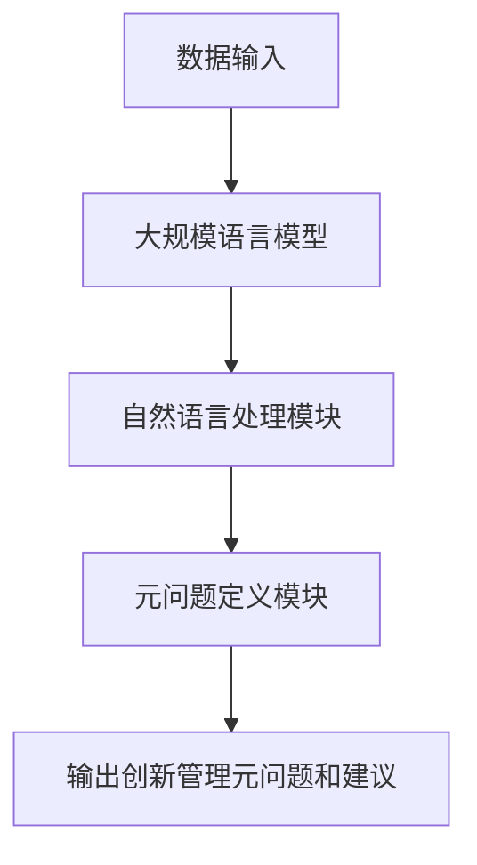

# 大规模语言模型的元问题定义在创新管理中的实践应用

> 关键词：大规模语言模型、元问题定义、创新管理、实践应用、人工智能

> 摘要：本文聚焦于大规模语言模型的元问题定义在创新管理中的实践应用。首先介绍了相关背景，包括目的、预期读者、文档结构和术语表。接着阐述了核心概念与联系，详细讲解了核心算法原理及操作步骤，并给出了数学模型和公式。通过项目实战案例展示了具体的代码实现和分析。探讨了其在实际场景中的应用，推荐了相关的学习资源、开发工具和论文著作。最后总结了未来发展趋势与挑战，提供了常见问题解答和扩展阅读参考。旨在为创新管理领域利用大规模语言模型的元问题定义提供全面的技术指导和实践思路。

## 1. 背景介绍 
### 1.1 目的和范围
在当今快速发展的科技时代，创新管理对于企业和组织的生存与发展至关重要。大规模语言模型（LLMs）如GPT系列、BERT等展现出了强大的自然语言处理能力。而元问题定义作为一种对问题本质进行深入挖掘和抽象的方法，将其与大规模语言模型相结合应用于创新管理领域，具有巨大的潜力。本文的目的在于探讨如何利用大规模语言模型的元问题定义来推动创新管理实践，涵盖从理论概念到实际应用案例的全面内容，为创新管理者、研究者和技术人员提供有价值的参考。

### 1.2 预期读者
本文的预期读者包括创新管理领域的专业人士，如企业创新经理、产品经理等，他们希望借助新技术提升创新管理的效率和效果；人工智能领域的研究者和开发者，对大规模语言模型在不同领域的应用感兴趣；以及相关专业的学生，希望通过本文了解前沿的技术应用和创新管理理念。

### 1.3 文档结构概述
本文将按照以下结构进行阐述：首先介绍相关背景知识，包括目的、读者群体和文档结构等；接着详细讲解核心概念与联系，通过示意图和流程图帮助读者理解；然后阐述核心算法原理和具体操作步骤，并给出Python代码示例；再介绍数学模型和公式，结合实例进行说明；通过项目实战展示代码实现和解读；探讨实际应用场景；推荐相关的学习资源、开发工具和论文著作；最后总结未来发展趋势与挑战，提供常见问题解答和扩展阅读参考。

### 1.4 术语表
#### 1.4.1 核心术语定义
- **大规模语言模型（Large Language Model，LLM）**：是一种基于深度学习的自然语言处理模型，通过在大规模文本数据上进行训练，学习语言的模式和规律，能够生成自然流畅的文本、回答问题、进行文本分类等多种任务。
- **元问题定义（Meta - Problem Definition）**：是指对问题进行更高层次的抽象和分析，找出问题的本质和关键要素，以便更好地理解问题和制定解决方案。
- **创新管理（Innovation Management）**：是指企业或组织为了实现创新目标，对创新活动进行规划、组织、协调、控制和评价等一系列管理活动。

#### 1.4.2 相关概念解释
- **自然语言处理（Natural Language Processing，NLP）**：是人工智能的一个重要领域，旨在让计算机能够理解、处理和生成人类语言。大规模语言模型是自然语言处理的一种重要技术手段。
- **深度学习（Deep Learning）**：是一种基于人工神经网络的机器学习方法，通过构建多层神经网络来学习数据的复杂特征和模式。大规模语言模型通常采用深度学习技术进行训练。

#### 1.4.3 缩略词列表
- **LLM**：Large Language Model（大规模语言模型）
- **NLP**：Natural Language Processing（自然语言处理）

## 2. 核心概念与联系 

### 核心概念原理
大规模语言模型的元问题定义在创新管理中的应用，核心在于利用大规模语言模型强大的自然语言理解和生成能力，对创新管理过程中的各种问题进行元问题定义。大规模语言模型可以处理大量的文本数据，包括市场调研报告、用户反馈、行业新闻等，从中提取关键信息和模式。元问题定义则帮助我们从这些信息中抽象出问题的本质，识别出创新管理中的核心挑战和机遇。

例如，在产品创新过程中，企业可能会收到大量用户对产品的反馈，这些反馈可能涉及产品的功能、性能、易用性等多个方面。大规模语言模型可以对这些反馈进行分析和总结，而元问题定义则可以进一步将这些具体的反馈抽象为“如何提高产品的用户体验”这样的元问题，从而为创新管理提供更清晰的方向。

### 架构的文本示意图
```plaintext
大规模语言模型（LLM）
|
|-- 数据输入（市场报告、用户反馈等文本数据）
|
|-- 自然语言处理模块（文本分类、情感分析、信息提取等）
|
|-- 元问题定义模块（抽象问题本质，识别核心问题）
|
|-- 输出（创新管理的元问题和建议）
```

### Mermaid流程图


## 3. 核心算法原理 & 具体操作步骤 

### 核心算法原理
在利用大规模语言模型进行元问题定义时，主要涉及以下几个核心算法：
- **文本嵌入（Text Embedding）**：将文本数据转换为向量表示，以便计算机能够处理和分析。常见的文本嵌入方法有Word2Vec、GloVe和BERT等。例如，BERT模型可以将输入的文本转换为固定长度的向量，这些向量包含了文本的语义信息。
- **文本分类（Text Classification）**：将文本数据分类到不同的类别中。在创新管理中，可以根据文本的主题将用户反馈分为产品功能、用户体验、市场需求等类别。常用的文本分类算法有朴素贝叶斯、支持向量机和深度学习模型等。
- **聚类分析（Clustering Analysis）**：将相似的文本数据聚为一类，以便发现数据中的模式和规律。在元问题定义中，可以将相关的用户反馈聚类在一起，从而找出潜在的问题和需求。常见的聚类算法有K - Means、DBSCAN等。

### 具体操作步骤

#### 步骤1：数据收集
收集与创新管理相关的文本数据，包括市场调研报告、用户反馈、行业新闻等。可以通过网络爬虫、问卷调查、数据库查询等方式获取数据。

#### 步骤2：数据预处理
对收集到的数据进行预处理，包括去除噪声、分词、去除停用词等。以下是一个使用Python的`nltk`库进行数据预处理的示例代码：
```python
import nltk
from nltk.corpus import stopwords
from nltk.tokenize import word_tokenize
import string

nltk.download('punkt')
nltk.download('stopwords')

def preprocess_text(text):
    # 转换为小写
    text = text.lower()
    # 去除标点符号
    text = text.translate(str.maketrans('', '', string.punctuation))
    # 分词
    tokens = word_tokenize(text)
    # 去除停用词
    stop_words = set(stopwords.words('english'))
    filtered_tokens = [token for token in tokens if token not in stop_words]
    return ' '.join(filtered_tokens)

# 示例文本
text = "This is an example sentence! It contains some punctuation."
preprocessed_text = preprocess_text(text)
print(preprocessed_text)
```

#### 步骤3：文本嵌入
使用预训练的文本嵌入模型将预处理后的文本转换为向量表示。以下是一个使用`transformers`库加载BERT模型进行文本嵌入的示例代码：
```python
from transformers import AutoTokenizer, AutoModel
import torch

# 加载预训练的BERT模型和分词器
tokenizer = AutoTokenizer.from_pretrained('bert-base-uncased')
model = AutoModel.from_pretrained('bert-base-uncased')

# 示例文本
text = "This is an example sentence."
# 分词
inputs = tokenizer(text, return_tensors='pt')
# 输入模型
outputs = model(**inputs)
# 获取最后一层的隐藏状态
embedding = outputs.last_hidden_state.mean(dim=1).squeeze()
print(embedding)
```

#### 步骤4：文本分类和聚类分析
使用分类算法对文本进行分类，使用聚类算法将相似的文本聚为一类。以下是一个使用`scikit - learn`库进行K - Means聚类的示例代码：
```python
from sklearn.cluster import KMeans
import numpy as np

# 示例文本嵌入向量
embeddings = np.random.rand(10, 768)  # 假设有10个文本，每个文本的嵌入向量维度为768
# 创建K - Means模型
kmeans = KMeans(n_clusters=3)
# 进行聚类
labels = kmeans.fit_predict(embeddings)
print(labels)
```

#### 步骤5：元问题定义
根据文本分类和聚类的结果，抽象出问题的本质，定义元问题。例如，如果聚类结果显示大部分用户反馈都集中在产品的某个功能上，那么可以将元问题定义为“如何优化该功能以提高用户满意度”。

## 4. 数学模型和公式 & 详细讲解 & 举例说明 

### 文本嵌入模型
#### Word2Vec模型
Word2Vec模型通过神经网络学习单词的向量表示。它有两种主要的架构：连续词袋模型（Continuous Bag - of - Words，CBOW）和跳字模型（Skip - Gram）。

- **CBOW模型**：根据上下文单词预测当前单词。其目标函数是最大化给定上下文单词 $w_{c - m}, \cdots, w_{c - 1}, w_{c+1}, \cdots, w_{c + m}$ 时，中心单词 $w_c$ 的概率：
$$
\max_{\theta} \prod_{t = 1}^{T} \prod_{-m \leq j \leq m, j \neq 0} P(w_{t + j} | w_t; \theta)
$$
其中，$\theta$ 是模型的参数，$T$ 是文本的长度，$m$ 是上下文窗口的大小。

- **Skip - Gram模型**：根据当前单词预测上下文单词。其目标函数是最大化给定中心单词 $w_c$ 时，上下文单词 $w_{c - m}, \cdots, w_{c - 1}, w_{c+1}, \cdots, w_{c + m}$ 的概率：
$$
\max_{\theta} \prod_{t = 1}^{T} \prod_{-m \leq j \leq m, j \neq 0} P(w_{t + j} | w_t; \theta)
$$

#### BERT模型
BERT模型是一种基于Transformer架构的预训练语言模型。它通过掩码语言模型（Masked Language Model，MLM）和下一句预测（Next Sentence Prediction，NSP）两个任务进行预训练。

- **MLM任务**：随机掩码输入文本中的一些单词，然后让模型预测这些掩码单词。其目标函数是最大化预测掩码单词的概率：
$$
\max_{\theta} \sum_{i = 1}^{N} \log P(w_i^{mask} | \mathbf{x}_{mask}; \theta)
$$
其中，$w_i^{mask}$ 是第 $i$ 个掩码单词，$\mathbf{x}_{mask}$ 是掩码后的输入文本，$\theta$ 是模型的参数。

- **NSP任务**：判断两个句子是否是连续的。其目标函数是最大化正确预测句子关系的概率：
$$
\max_{\theta} \sum_{i = 1}^{M} \log P(y_i | \mathbf{x}_1^i, \mathbf{x}_2^i; \theta)
$$
其中，$y_i$ 是第 $i$ 个样本的句子关系标签，$\mathbf{x}_1^i$ 和 $\mathbf{x}_2^i$ 是第 $i$ 个样本的两个句子，$\theta$ 是模型的参数。

### 聚类分析模型
#### K - Means模型
K - Means模型的目标是将 $n$ 个样本 $\mathbf{x}_1, \mathbf{x}_2, \cdots, \mathbf{x}_n$ 划分为 $k$ 个簇 $C_1, C_2, \cdots, C_k$，使得簇内样本的平方误差之和最小：
$$
\min_{C_1, C_2, \cdots, C_k} \sum_{i = 1}^{k} \sum_{\mathbf{x} \in C_i} \|\mathbf{x} - \mu_i\|^2
$$
其中，$\mu_i$ 是第 $i$ 个簇的质心，$\|\cdot\|$ 是欧几里得距离。

### 举例说明
假设我们有以下三个文本：
- $w_1$: "The product has a great user interface."
- $w_2$: "The user experience of this product is terrible."
- $w_3$: "The functionality of the product needs improvement."

首先，使用BERT模型将这三个文本转换为向量 $\mathbf{v}_1, \mathbf{v}_2, \mathbf{v}_3$。然后，使用K - Means模型将这三个向量聚为两类。假设聚类结果为 $C_1 = \{w_1\}$ 和 $C_2 = \{w_2, w_3\}$。我们可以根据聚类结果定义元问题：对于簇 $C_1$，元问题可以是“如何保持产品的良好用户界面”；对于簇 $C_2$，元问题可以是“如何提高产品的用户体验和功能”。

## 5. 项目实战：代码实际案例和详细解释说明 

### 5.1  开发环境搭建
#### 操作系统
可以选择Windows、Linux或macOS操作系统。建议使用Linux系统，如Ubuntu，因为它在开发和部署方面具有更好的稳定性和兼容性。

#### Python环境
安装Python 3.7或以上版本。可以使用Anaconda或Miniconda来管理Python环境。以下是创建一个新的Python虚拟环境的示例命令：
```bash
conda create -n innovation_management python=3.8
conda activate innovation_management
```

#### 安装必要的库
安装以下必要的Python库：
```bash
pip install transformers scikit-learn nltk pandas numpy
```

### 5.2  源代码详细实现和代码解读

#### 数据收集和预处理
```python
import pandas as pd
from nltk.corpus import stopwords
from nltk.tokenize import word_tokenize
import string
import nltk

nltk.download('punkt')
nltk.download('stopwords')

# 假设数据存储在CSV文件中
data = pd.read_csv('user_feedback.csv')

def preprocess_text(text):
    text = text.lower()
    text = text.translate(str.maketrans('', '', string.punctuation))
    tokens = word_tokenize(text)
    stop_words = set(stopwords.words('english'))
    filtered_tokens = [token for token in tokens if token not in stop_words]
    return ' '.join(filtered_tokens)

data['preprocessed_text'] = data['feedback_text'].apply(preprocess_text)
```
代码解读：首先使用`pandas`库读取CSV文件中的用户反馈数据。然后定义了一个`preprocess_text`函数，用于对文本进行预处理，包括转换为小写、去除标点符号、分词和去除停用词。最后将预处理后的文本添加到数据框中。

#### 文本嵌入
```python
from transformers import AutoTokenizer, AutoModel
import torch

tokenizer = AutoTokenizer.from_pretrained('bert-base-uncased')
model = AutoModel.from_pretrained('bert-base-uncased')

def get_embedding(text):
    inputs = tokenizer(text, return_tensors='pt')
    outputs = model(**inputs)
    embedding = outputs.last_hidden_state.mean(dim=1).squeeze()
    return embedding.detach().numpy()

data['embedding'] = data['preprocessed_text'].apply(get_embedding)
```
代码解读：使用`transformers`库加载预训练的BERT模型和分词器。定义了一个`get_embedding`函数，用于将文本转换为向量表示。最后将每个文本的嵌入向量添加到数据框中。

#### 聚类分析
```python
from sklearn.cluster import KMeans
import numpy as np

embeddings = np.array(data['embedding'].tolist())
kmeans = KMeans(n_clusters=3)
data['cluster_label'] = kmeans.fit_predict(embeddings)
```
代码解读：将数据框中的嵌入向量转换为NumPy数组。创建一个K - Means模型，将文本分为3类。最后将聚类标签添加到数据框中。

#### 元问题定义
```python
# 根据聚类结果定义元问题
cluster_0_feedback = data[data['cluster_label'] == 0]['feedback_text'].tolist()
cluster_1_feedback = data[data['cluster_label'] == 1]['feedback_text'].tolist()
cluster_2_feedback = data[data['cluster_label'] == 2]['feedback_text'].tolist()

# 简单示例：手动定义元问题
meta_problem_0 = "How to improve the product's performance based on these feedbacks?"
meta_problem_1 = "How to enhance the user interface according to these suggestions?"
meta_problem_2 = "How to address the customer service issues mentioned?"

print("Meta Problem 0:", meta_problem_0)
print("Meta Problem 1:", meta_problem_1)
print("Meta Problem 2:", meta_problem_2)
```
代码解读：根据聚类标签将用户反馈分为不同的簇。手动定义每个簇对应的元问题，并打印输出。

### 5.3  代码解读与分析
- **数据预处理**：通过去除噪声和停用词，减少了无关信息的干扰，提高了后续分析的准确性。
- **文本嵌入**：使用BERT模型将文本转换为向量表示，能够捕捉文本的语义信息，为聚类分析提供了有效的特征。
- **聚类分析**：K - Means模型将相似的文本聚为一类，有助于发现数据中的模式和规律。
- **元问题定义**：根据聚类结果手动定义元问题，为创新管理提供了具体的方向。

## 6. 实际应用场景 
### 产品创新
在产品创新过程中，大规模语言模型的元问题定义可以帮助企业更好地理解用户需求和市场趋势。通过分析用户反馈和市场调研报告，找出产品存在的问题和潜在的改进方向，如“如何提高产品的易用性”“如何增加产品的新功能”等元问题，为产品创新提供指导。

### 服务创新
在服务行业，利用大规模语言模型对客户反馈进行元问题定义，可以发现服务过程中存在的痛点和不足。例如，通过分析客户投诉和评价，将问题抽象为“如何提高服务响应速度”“如何提升服务质量”等元问题，从而推动服务创新。

### 市场创新
在市场竞争激烈的环境下，企业需要不断进行市场创新。大规模语言模型可以分析行业新闻、竞争对手动态等文本数据，帮助企业定义市场创新的元问题，如“如何开拓新的市场细分领域”“如何提高品牌知名度”等，为企业制定市场策略提供支持。

### 组织创新
在企业内部，大规模语言模型的元问题定义可以应用于组织创新。通过分析员工反馈和内部文档，找出组织管理中存在的问题，如“如何提高团队协作效率”“如何优化组织架构”等元问题，促进组织的变革和发展。

## 7. 工具和资源推荐
### 7.1 学习资源推荐
#### 7.1.1 书籍推荐
- 《自然语言处理入门》：介绍了自然语言处理的基本概念、算法和技术，适合初学者入门。
- 《深度学习》：详细讲解了深度学习的原理和应用，包括神经网络、卷积神经网络、循环神经网络等，对于理解大规模语言模型的技术基础有很大帮助。
- 《创新管理》：系统阐述了创新管理的理论和方法，结合实际案例分析，有助于读者将大规模语言模型的应用与创新管理实践相结合。

#### 7.1.2 在线课程
- Coursera上的“Natural Language Processing Specialization”：由顶尖大学的教授授课，涵盖了自然语言处理的各个方面，包括文本分类、情感分析、机器翻译等。
- edX上的“Deep Learning for Natural Language Processing”：深入介绍了深度学习在自然语言处理中的应用，包括Transformer架构、预训练语言模型等。
- Udemy上的“Innovation Management Masterclass”：提供了创新管理的实战经验和方法，帮助学员提升创新管理能力。

#### 7.1.3 技术博客和网站
- Hugging Face Blog：提供了关于大规模语言模型的最新研究成果和应用案例，以及相关的技术教程和代码示例。
- Towards Data Science：发布了大量关于数据科学、机器学习和自然语言处理的文章，涵盖了从基础理论到实际应用的各个层面。
- MIT Sloan Management Review：专注于管理和创新领域的研究和实践，提供了关于创新管理的前沿观点和案例分析。

### 7.2 开发工具框架推荐
#### 7.2.1 IDE和编辑器
- PyCharm：是一款专业的Python集成开发环境，提供了丰富的代码编辑、调试和版本控制功能，适合开发大规模的Python项目。
- Jupyter Notebook：是一种交互式的开发环境，支持Python、R等多种编程语言，方便进行数据探索、模型训练和结果展示。
- Visual Studio Code：是一款轻量级的代码编辑器，支持多种编程语言和插件扩展，具有良好的代码编辑和调试体验。

#### 7.2.2 调试和性能分析工具
- TensorBoard：是TensorFlow提供的可视化工具，用于监控模型训练过程中的各种指标，如损失函数、准确率等，帮助开发者调试和优化模型。
- Py-Spy：是一个用于Python程序的性能分析工具，可以实时监控程序的CPU使用率、函数调用时间等，帮助开发者找出性能瓶颈。
- cProfile：是Python标准库中的性能分析模块，用于分析Python程序的执行时间和函数调用次数，帮助开发者优化代码性能。

#### 7.2.3 相关框架和库
- Transformers：由Hugging Face开发的自然语言处理库，提供了丰富的预训练语言模型和工具，方便开发者进行文本分类、情感分析、文本生成等任务。
- scikit - learn：是一个简单易用的机器学习库，提供了多种机器学习算法和工具，如分类、回归、聚类等，适合初学者和快速开发。
- PyTorch：是一个开源的深度学习框架，具有动态计算图和易于使用的API，广泛应用于自然语言处理、计算机视觉等领域。

### 7.3 相关论文著作推荐
#### 7.3.1 经典论文
- “Attention Is All You Need”：提出了Transformer架构，为大规模语言模型的发展奠定了基础。
- “BERT: Pre-training of Deep Bidirectional Transformers for Language Understanding”：介绍了BERT模型的预训练方法和应用，开启了预训练语言模型的新时代。
- “The Innovator's Dilemma: When New Technologies Cause Great Firms to Fail”：探讨了创新管理中的困境和挑战，提出了颠覆性创新的概念。

#### 7.3.2 最新研究成果
- 关注顶级学术会议如ACL（Association for Computational Linguistics）、NeurIPS（Neural Information Processing Systems）等的论文，了解大规模语言模型和创新管理领域的最新研究进展。
- 查阅知名学术期刊如Journal of Management Information Systems、Research Policy等的文章，获取相关领域的前沿研究成果。

#### 7.3.3 应用案例分析
- 分析一些成功的企业案例，如谷歌、亚马逊等如何利用大规模语言模型进行创新管理。可以通过企业的官方博客、新闻报道和学术研究来获取相关案例信息。

## 8. 总结：未来发展趋势与挑战
### 未来发展趋势
- **模型性能提升**：随着技术的不断进步，大规模语言模型的性能将不断提升，能够更准确地理解和生成自然语言，为元问题定义提供更可靠的支持。
- **多模态融合**：未来的大规模语言模型将不仅仅局限于文本数据，还将融合图像、音频、视频等多模态数据，为创新管理提供更全面的信息。
- **个性化应用**：根据不同企业和组织的需求，大规模语言模型将实现个性化的元问题定义和创新管理方案，提高应用的针对性和有效性。
- **与其他技术融合**：大规模语言模型将与区块链、物联网等技术融合，创造出更多的创新应用场景，推动创新管理的发展。

### 挑战
- **数据隐私和安全**：大规模语言模型需要大量的文本数据进行训练，这些数据可能包含用户的敏感信息。如何保护数据隐私和安全是一个重要的挑战。
- **模型解释性**：大规模语言模型通常是黑盒模型，难以解释其决策过程和结果。在创新管理中，需要模型具有良好的解释性，以便决策者理解和应用。
- **计算资源需求**：训练和运行大规模语言模型需要大量的计算资源，包括GPU、TPU等。如何降低计算成本和提高资源利用率是一个亟待解决的问题。
- **伦理和社会问题**：大规模语言模型的应用可能会带来一些伦理和社会问题，如虚假信息传播、偏见和歧视等。需要建立相应的伦理和监管机制来规范其应用。

## 9. 附录：常见问题与解答
### 问题1：大规模语言模型的元问题定义与传统的问题定义方法有什么区别？
传统的问题定义方法通常依赖于人工经验和专业知识，效率较低且容易受到主观因素的影响。而大规模语言模型的元问题定义利用了模型强大的自然语言处理能力，能够处理大量的文本数据，从更广泛的信息中抽象出问题的本质，具有更高的效率和客观性。

### 问题2：如何选择合适的大规模语言模型进行元问题定义？
选择合适的大规模语言模型需要考虑以下因素：模型的性能、适用场景、训练数据、计算资源等。对于一般的自然语言处理任务，可以选择如BERT、GPT等预训练模型；对于特定领域的任务，可以选择在该领域有针对性训练的模型。

### 问题3：大规模语言模型的元问题定义在实际应用中可能会遇到哪些问题？
可能会遇到以下问题：数据质量不高，导致模型分析结果不准确；模型的解释性不足，难以理解模型的决策过程；计算资源不足，无法支持模型的训练和运行；以及伦理和社会问题，如虚假信息传播等。

### 问题4：如何评估大规模语言模型的元问题定义的效果？
可以从以下几个方面进行评估：元问题的准确性，即定义的元问题是否准确反映了实际问题的本质；元问题的实用性，即元问题是否能够为创新管理提供有价值的指导；以及模型的稳定性和可靠性，即模型在不同数据集和场景下的表现是否一致。

## 10. 扩展阅读 & 参考资料
### 扩展阅读
- 《Generative AI: The Future of Innovation》：深入探讨了生成式人工智能在创新领域的应用和发展前景。
- 《AI in Management: A Strategic Perspective》：从战略角度分析了人工智能在管理领域的应用和影响。

### 参考资料
- Hugging Face官方文档：https://huggingface.co/docs
- scikit - learn官方文档：https://scikit-learn.org/stable/documentation.html
- PyTorch官方文档：https://pytorch.org/docs/stable/index.html

作者：AI天才研究院/AI Genius Institute & 禅与计算机程序设计艺术 /Zen And The Art of Computer Programming