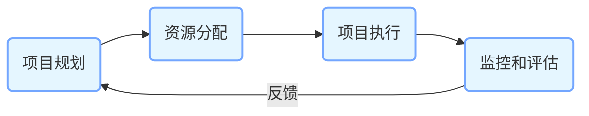

# 大规模语言模型的元问题定义在科技创新管理中的实践应用

> 关键词：大规模语言模型、元问题定义、科技创新管理、实践应用、问题解决

> 摘要：本文聚焦于大规模语言模型的元问题定义在科技创新管理中的实践应用。首先介绍了相关背景，包括目的范围、预期读者等内容。接着阐述了核心概念及联系，通过示意图和流程图展示其架构。详细讲解了核心算法原理与操作步骤，并给出Python代码示例。分析了数学模型和公式，辅以具体实例。通过项目实战展示代码实现与解读。探讨了实际应用场景，推荐了学习资源、开发工具和相关论文著作。最后总结未来发展趋势与挑战，提供常见问题解答和扩展阅读参考资料，旨在为科技创新管理中有效利用大规模语言模型的元问题定义提供全面的指导和借鉴。

## 1. 背景介绍 
### 1.1 目的和范围
在当今科技飞速发展的时代，科技创新管理面临着诸多挑战和机遇。大规模语言模型如GPT系列、BERT等的出现，为科技创新管理带来了新的思路和方法。本文的目的在于深入探讨大规模语言模型的元问题定义在科技创新管理中的实践应用，明确如何利用大规模语言模型来准确识别、定义和解决科技创新管理中的关键问题。

范围涵盖了从大规模语言模型元问题定义的基本概念出发，到其在科技创新管理各个环节的具体应用，包括项目规划、资源分配、风险评估等。同时，也会涉及到相关技术的原理、算法以及实际案例的分析。

### 1.2 预期读者
本文预期读者主要包括科技创新管理领域的从业者，如科技企业的管理者、项目经理、研发人员等，他们希望借助大规模语言模型提升科技创新管理的效率和质量。此外，对人工智能技术在管理领域应用感兴趣的研究者、学生也可以从本文中获取有价值的信息。

### 1.3 文档结构概述
本文首先介绍背景知识，为后续内容奠定基础。接着阐述核心概念与联系，帮助读者理解大规模语言模型的元问题定义与科技创新管理之间的关系。然后详细讲解核心算法原理和具体操作步骤，通过Python代码进行说明。之后分析数学模型和公式，并举例说明。项目实战部分展示代码实际案例和详细解释。探讨实际应用场景，为读者提供实践方向。推荐相关的工具和资源，方便读者进一步学习和应用。最后总结未来发展趋势与挑战，提供常见问题解答和扩展阅读参考资料。

### 1.4 术语表
#### 1.4.1 核心术语定义
- **大规模语言模型**：指具有大量参数和强大语言理解与生成能力的人工智能模型，如GPT - 3、T5等，能够处理自然语言文本的各种任务。
- **元问题定义**：是指对问题本身进行深入分析和定义，识别问题的本质、边界和关键要素，以便更好地解决问题。在大规模语言模型的背景下，元问题定义可以帮助确定模型的输入、输出和应用场景。
- **科技创新管理**：是对科技创新活动进行规划、组织、协调、控制和评价等一系列活动的过程，旨在提高科技创新的效率和成功率，促进科技成果的转化和应用。

#### 1.4.2 相关概念解释
- **自然语言处理**：是人工智能的一个重要领域，研究如何让计算机理解、处理和生成自然语言文本。大规模语言模型是自然语言处理技术的重要成果之一。
- **问题解决策略**：是指在面对问题时，为了达到解决问题的目标而采取的一系列方法和步骤。在科技创新管理中，问题解决策略的制定需要考虑到问题的特点和可用的资源。

#### 1.4.3 缩略词列表
- **NLP**：Natural Language Processing，自然语言处理
- **LLM**：Large Language Model，大规模语言模型

## 2. 核心概念与联系 

### 大规模语言模型的元问题定义原理
大规模语言模型的元问题定义主要基于对文本数据的理解和分析。模型通过学习大量的文本语料，掌握语言的语法、语义和上下文信息，从而能够对输入的问题进行解析和理解。在科技创新管理中，元问题定义的关键在于将实际问题转化为模型能够处理的文本形式，并明确问题的目标和约束条件。

例如，在科技创新项目的规划阶段，我们可能需要确定项目的目标、范围和关键指标。可以将这些信息整理成文本，输入到大规模语言模型中，让模型分析问题的本质和关键要素。模型可以根据学习到的知识，提供相关的建议和解决方案。

### 科技创新管理的架构
科技创新管理通常包括项目规划、资源分配、项目执行、监控和评估等环节。每个环节都涉及到不同的问题和决策，需要有效的问题解决方法。大规模语言模型的元问题定义可以在各个环节中发挥作用，帮助管理者更好地理解和解决问题。

下面是科技创新管理的架构示意图：



### 大规模语言模型的元问题定义与科技创新管理的联系
大规模语言模型的元问题定义与科技创新管理的联系在于，通过准确的元问题定义，能够为科技创新管理提供更有效的决策支持。在项目规划阶段，模型可以帮助识别项目的潜在风险和机遇，优化项目目标和计划。在资源分配阶段，模型可以根据项目需求和资源状况，提供合理的资源分配方案。在项目执行和监控评估阶段，模型可以实时分析项目进展情况，及时发现问题并提供解决方案。

例如，在一个科技创新项目中，通过大规模语言模型对项目需求进行元问题定义，模型可以分析出项目的关键技术难点和市场需求趋势，为项目团队提供针对性的建议。在资源分配时，模型可以根据项目的优先级和资源的可用性，合理分配人力、物力和财力资源，提高资源利用效率。

## 3. 核心算法原理 & 具体操作步骤 

### 核心算法原理
大规模语言模型的核心算法通常基于深度学习中的Transformer架构。Transformer架构采用了自注意力机制（Self - Attention Mechanism），能够有效地捕捉文本中的长距离依赖关系。

自注意力机制的原理是，对于输入的文本序列，模型会计算每个位置的向量表示，通过对不同位置的向量进行加权求和，得到每个位置的上下文表示。具体来说，对于输入序列 $\mathbf{x} = [x_1, x_2, \cdots, x_n]$，其中 $x_i$ 是第 $i$ 个位置的词向量，自注意力机制的计算过程如下：

1. 计算查询（Query）、键（Key）和值（Value）矩阵：
   - $\mathbf{Q} = \mathbf{X} \mathbf{W}^Q$
   - $\mathbf{K} = \mathbf{X} \mathbf{W}^K$
   - $\mathbf{V} = \mathbf{X} \mathbf{W}^V$
   其中，$\mathbf{X} = [x_1^T, x_2^T, \cdots, x_n^T]^T$ 是输入序列的矩阵表示，$\mathbf{W}^Q$、$\mathbf{W}^K$ 和 $\mathbf{W}^V$ 是可学习的权重矩阵。

2. 计算注意力分数：
   - $\mathbf{S} = \frac{\mathbf{Q} \mathbf{K}^T}{\sqrt{d_k}}$
   其中，$d_k$ 是键向量的维度。

3. 应用Softmax函数进行归一化：
   - $\mathbf{A} = \text{Softmax}(\mathbf{S})$

4. 计算输出：
   - $\mathbf{Z} = \mathbf{A} \mathbf{V}$

### Python代码实现自注意力机制
```python
import torch
import torch.nn as nn
import torch.nn.functional as F

class SelfAttention(nn.Module):
    def __init__(self, input_dim, d_k):
        super(SelfAttention, self).__init__()
        self.W_q = nn.Linear(input_dim, d_k)
        self.W_k = nn.Linear(input_dim, d_k)
        self.W_v = nn.Linear(input_dim, d_k)

    def forward(self, x):
        Q = self.W_q(x)
        K = self.W_k(x)
        V = self.W_v(x)

        d_k = Q.size(-1)
        scores = torch.matmul(Q, K.transpose(-2, -1)) / torch.sqrt(torch.tensor(d_k, dtype=torch.float32))
        attention_weights = F.softmax(scores, dim=-1)
        output = torch.matmul(attention_weights, V)

        return output

# 示例使用
input_dim = 128
d_k = 64
batch_size = 32
seq_length = 10

x = torch.randn(batch_size, seq_length, input_dim)
self_attn = SelfAttention(input_dim, d_k)
output = self_attn(x)
print(output.shape)
```

### 具体操作步骤
1. **问题转化**：将科技创新管理中的实际问题转化为文本形式，明确问题的描述、目标和约束条件。
2. **数据预处理**：对输入的文本数据进行预处理，包括分词、去除停用词、词向量编码等操作。
3. **模型选择与加载**：选择合适的大规模语言模型，如GPT - 3、BERT等，并加载模型。
4. **输入模型**：将预处理后的文本数据输入到模型中，得到模型的输出。
5. **结果分析与应用**：分析模型的输出结果，提取有用的信息，并将其应用到科技创新管理的决策中。

## 4. 数学模型和公式 & 详细讲解 & 举例说明 

### 数学模型
在大规模语言模型中，通常使用概率模型来描述语言的生成过程。以基于Transformer的语言模型为例，其目标是最大化给定输入序列 $x_1, x_2, \cdots, x_n$ 下输出序列 $y_1, y_2, \cdots, y_m$ 的概率：

$$P(y_1, y_2, \cdots, y_m | x_1, x_2, \cdots, x_n) = \prod_{i = 1}^{m} P(y_i | y_1, \cdots, y_{i - 1}, x_1, \cdots, x_n)$$

其中，$P(y_i | y_1, \cdots, y_{i - 1}, x_1, \cdots, x_n)$ 表示在给定前面的输出序列 $y_1, \cdots, y_{i - 1}$ 和输入序列 $x_1, \cdots, x_n$ 的条件下，生成第 $i$ 个输出词 $y_i$ 的概率。

### 详细讲解
这个概率模型的核心思想是，语言模型通过学习大量的文本数据，估计每个词在给定上下文下出现的概率。在训练过程中，模型会调整其参数，使得生成的文本序列的概率尽可能大。在推理过程中，模型根据输入的文本，按照概率最大的原则生成输出文本。

### 举例说明
假设我们有一个科技创新项目的描述文本 $x$，我们希望模型根据这个描述生成项目的风险评估报告 $y$。模型会首先对输入文本 $x$ 进行编码，然后根据编码后的表示，依次生成输出文本 $y$ 的每个词。例如，当生成第一个词 $y_1$ 时，模型会计算 $P(y_1 | x)$，选择概率最大的词作为 $y_1$。接着，在生成第二个词 $y_2$ 时，模型会计算 $P(y_2 | y_1, x)$，依此类推，直到生成完整的风险评估报告。

## 5. 项目实战：代码实际案例和详细解释说明 

### 5.1  开发环境搭建
1. **安装Python**：推荐使用Python 3.7及以上版本，可以从Python官方网站（https://www.python.org/downloads/）下载安装。
2. **安装深度学习框架**：使用PyTorch作为深度学习框架，可以通过以下命令安装：
```sh
pip install torch torchvision
```
3. **安装自然语言处理库**：安装Hugging Face的Transformers库，用于加载和使用大规模语言模型：
```sh
pip install transformers
```

### 5.2  源代码详细实现和代码解读
以下是一个使用Hugging Face的Transformers库进行科技创新项目问题分析的示例代码：

```python
from transformers import AutoTokenizer, AutoModelForSequenceClassification
import torch

# 加载预训练的模型和分词器
model_name = "bert-base-uncased"
tokenizer = AutoTokenizer.from_pretrained(model_name)
model = AutoModelForSequenceClassification.from_pretrained(model_name, num_labels=2)

# 定义科技创新项目问题文本
project_problem = "在项目研发过程中，遇到了技术难题，导致进度延迟，如何解决？"

# 对文本进行分词和编码
inputs = tokenizer(project_problem, return_tensors="pt")

# 模型推理
with torch.no_grad():
    outputs = model(**inputs)

# 获取预测结果
logits = outputs.logits
predicted_class_id = logits.argmax().item()

# 输出结果
if predicted_class_id == 0:
    print("问题可能是技术层面的，需要技术专家介入。")
else:
    print("问题可能是管理层面的，需要优化项目管理流程。")
```

### 代码解读与分析
1. **模型和分词器加载**：使用 `AutoTokenizer` 和 `AutoModelForSequenceClassification` 从Hugging Face的模型库中加载预训练的BERT模型和对应的分词器。
2. **文本编码**：使用分词器对科技创新项目问题文本进行分词和编码，将文本转换为模型可以接受的输入格式。
3. **模型推理**：使用 `torch.no_grad()` 上下文管理器进行无梯度计算，避免在推理过程中更新模型参数。将编码后的输入传入模型，得到模型的输出。
4. **结果处理**：从模型的输出中获取logits，使用 `argmax()` 函数找到概率最大的类别，将其作为预测结果。
5. **结果输出**：根据预测结果，输出相应的问题分析结论。

## 6. 实际应用场景 
### 项目规划
在科技创新项目的规划阶段，大规模语言模型的元问题定义可以帮助项目团队准确识别项目的目标、范围和关键指标。例如，通过对市场需求、技术趋势和竞争情况的文本分析，模型可以提供项目的潜在价值和风险评估，为项目规划提供决策支持。

### 资源分配
在资源分配方面，模型可以根据项目的需求和资源的可用性，提供合理的资源分配方案。例如，分析项目的技术难度、工作量和时间要求，结合团队成员的技能和经验，模型可以推荐最佳的人员配置和资源分配策略。

### 风险评估
大规模语言模型可以对科技创新项目的风险进行评估。通过对项目文档、技术报告和市场数据的分析，模型可以识别潜在的风险因素，如技术风险、市场风险和管理风险等，并提供相应的风险应对措施。

### 创新创意生成
在创新创意生成方面，模型可以根据给定的主题和约束条件，生成相关的创新思路和解决方案。例如，在新产品研发过程中，模型可以提供产品的功能设计、外观设计和营销策略等方面的创意建议。

## 7. 工具和资源推荐
### 7.1 学习资源推荐
#### 7.1.1 书籍推荐
- 《深度学习》（Deep Learning）：由Ian Goodfellow、Yoshua Bengio和Aaron Courville合著，是深度学习领域的经典教材，涵盖了神经网络、卷积神经网络、循环神经网络等重要内容。
- 《自然语言处理入门》：何晗著，适合初学者快速入门自然语言处理领域，介绍了自然语言处理的基本概念、算法和应用。

#### 7.1.2 在线课程
- Coursera上的“深度学习专项课程”（Deep Learning Specialization）：由Andrew Ng教授授课，系统地介绍了深度学习的理论和实践。
- edX上的“自然语言处理基础”（Foundations of Natural Language Processing）：帮助学习者掌握自然语言处理的基本技术和方法。

#### 7.1.3 技术博客和网站
- Hugging Face博客（https://huggingface.co/blog）：提供了关于大规模语言模型和自然语言处理的最新研究成果和应用案例。
- Medium上的AI相关专栏：有很多关于人工智能和自然语言处理的高质量文章。

### 7.2 开发工具框架推荐
#### 7.2.1 IDE和编辑器
- PyCharm：是一款功能强大的Python集成开发环境，提供了代码编辑、调试、版本控制等功能，适合Python开发。
- Jupyter Notebook：是一个交互式的开发环境，支持Python、R等多种编程语言，方便进行数据分析和模型实验。

#### 7.2.2 调试和性能分析工具
- TensorBoard：是TensorFlow提供的可视化工具，可以用于监控模型的训练过程、分析模型的性能和查看模型的结构。
- PyTorch Profiler：可以帮助开发者分析PyTorch模型的性能瓶颈，优化模型的运行效率。

#### 7.2.3 相关框架和库
- Hugging Face Transformers：提供了丰富的预训练模型和工具，方便开发者使用大规模语言模型进行自然语言处理任务。
- NLTK（Natural Language Toolkit）：是Python中常用的自然语言处理库，提供了各种文本处理工具和语料库。

### 7.3 相关论文著作推荐
#### 7.3.1 经典论文
- “Attention Is All You Need”：介绍了Transformer架构，是大规模语言模型的基础。
- “BERT: Pre-training of Deep Bidirectional Transformers for Language Understanding”：提出了BERT模型，开创了预训练语言模型的新纪元。

#### 7.3.2 最新研究成果
- 关注顶级学术会议如ACL（Association for Computational Linguistics）、NeurIPS（Conference on Neural Information Processing Systems）上的相关论文，了解大规模语言模型在科技创新管理中的最新应用研究。

#### 7.3.3 应用案例分析
- 一些知名科技企业的技术博客会分享大规模语言模型在实际业务中的应用案例，可以从中学习到实际应用的经验和技巧。

## 8. 总结：未来发展趋势与挑战
### 未来发展趋势
- **模型能力提升**：大规模语言模型的性能将不断提升，能够处理更加复杂和多样化的科技创新管理问题。例如，模型的理解能力和推理能力将进一步增强，能够提供更准确和深入的决策建议。
- **与其他技术融合**：大规模语言模型将与计算机视觉、物联网等技术融合，实现多模态的科技创新管理。例如，在智能工厂中，结合视觉数据和文本数据，模型可以更好地进行生产过程监控和质量控制。
- **行业定制化**：针对不同的科技创新行业，将开发定制化的大规模语言模型。这些模型将结合行业的特点和需求，提供更专业和精准的服务。

### 挑战
- **数据隐私和安全**：大规模语言模型需要大量的数据进行训练，如何保证数据的隐私和安全是一个重要的挑战。在科技创新管理中，涉及到企业的核心机密和敏感信息，需要采取有效的措施来保护数据。
- **模型可解释性**：大规模语言模型通常是黑盒模型，其决策过程难以解释。在科技创新管理中，管理者需要了解模型的决策依据，以便做出合理的决策。因此，提高模型的可解释性是一个亟待解决的问题。
- **伦理和法律问题**：随着大规模语言模型在科技创新管理中的广泛应用，可能会引发一系列伦理和法律问题，如模型的偏见、虚假信息传播等。需要建立相应的伦理和法律规范，确保模型的合理使用。

## 9. 附录：常见问题与解答
### 问题1：大规模语言模型的元问题定义是否适用于所有类型的科技创新管理问题？
解答：虽然大规模语言模型的元问题定义具有很强的通用性，但并不是适用于所有类型的问题。对于一些涉及复杂物理实验、硬件设计等需要专业知识和实际操作的问题，模型可能无法提供全面和准确的解决方案。不过，在问题的分析和决策支持方面，模型仍然可以发挥重要作用。

### 问题2：如何选择合适的大规模语言模型用于科技创新管理？
解答：选择合适的模型需要考虑多个因素，如模型的性能、应用场景、数据需求等。如果对模型的性能要求较高，可以选择一些预训练的大型模型，如GPT - 3。如果需要处理特定领域的问题，可以选择针对该领域进行微调的模型。此外，还需要考虑模型的计算资源需求和成本。

### 问题3：大规模语言模型的元问题定义在实际应用中会遇到哪些困难？
解答：实际应用中可能会遇到以下困难：数据质量问题，低质量的数据会影响模型的性能；模型的泛化能力问题，模型在训练数据上表现良好，但在实际应用中可能出现过拟合或欠拟合的情况；模型的可解释性问题，难以理解模型的决策过程。

## 10. 扩展阅读 & 参考资料
### 扩展阅读
- 《人工智能时代的科技创新》：探讨了人工智能技术对科技创新的影响和推动作用。
- 《科技创新管理前沿》：介绍了科技创新管理领域的最新理论和实践成果。

### 参考资料
- Hugging Face官方文档（https://huggingface.co/docs/transformers/index）
- PyTorch官方文档（https://pytorch.org/docs/stable/index.html）
- ACL、NeurIPS等学术会议的论文集

作者：AI天才研究院/AI Genius Institute & 禅与计算机程序设计艺术 /Zen And The Art of Computer Programming