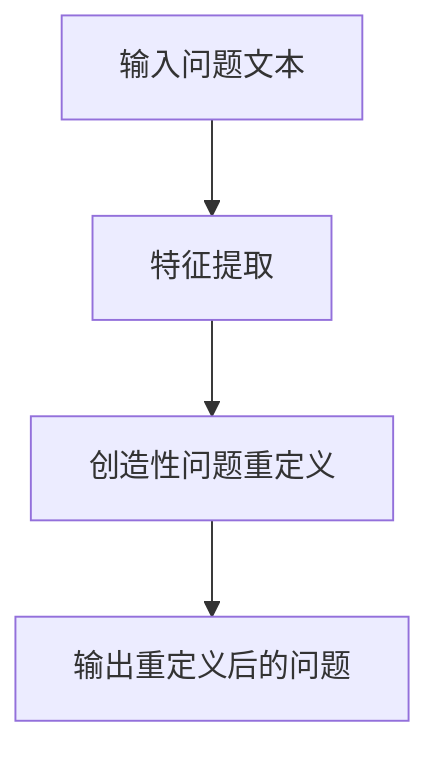

# 大规模语言模型的创造性问题重定义能力培养

> 关键词：大规模语言模型、创造性问题重定义、能力培养、自然语言处理、人工智能

> 摘要：本文聚焦于大规模语言模型的创造性问题重定义能力培养。首先介绍了相关背景，包括目的、预期读者等内容。接着阐述了核心概念及联系，分析了核心算法原理与具体操作步骤，结合数学模型和公式进行深入讲解。通过项目实战展示代码案例及详细解释，探讨了实际应用场景。同时推荐了学习、开发等方面的工具和资源，最后总结了未来发展趋势与挑战，还提供了常见问题解答及扩展阅读参考资料，旨在全面深入地探讨如何培养大规模语言模型的创造性问题重定义能力。

## 1. 背景介绍 
### 1.1 目的和范围
随着人工智能技术的飞速发展，大规模语言模型在自然语言处理领域取得了显著成就。然而，当前的语言模型在面对复杂问题时，往往缺乏创造性的问题重定义能力。本文章的目的在于深入探讨如何培养大规模语言模型的创造性问题重定义能力，以提升其在解决复杂问题时的灵活性和有效性。

文章的范围涵盖了从核心概念的阐述、算法原理的分析、数学模型的构建，到项目实战案例的展示以及实际应用场景的探讨。同时，还会推荐相关的学习资源、开发工具和研究论文，为读者提供一个全面的学习和研究框架。

### 1.2 预期读者
本文预期读者包括人工智能领域的研究人员、开发者、学生以及对大规模语言模型感兴趣的技术爱好者。对于研究人员，本文可以提供新的研究思路和方法；对于开发者，能够帮助他们在实际项目中应用创造性问题重定义能力；对于学生，有助于他们深入理解大规模语言模型的相关知识；对于技术爱好者，则可以拓宽他们对人工智能技术的认知。

### 1.3 文档结构概述
本文将按照以下结构进行组织：首先介绍核心概念与联系，包括相关概念的定义和它们之间的关系；接着分析核心算法原理和具体操作步骤，并使用Python代码进行详细阐述；然后讲解数学模型和公式，并举例说明；通过项目实战展示代码实际案例和详细解释；探讨实际应用场景；推荐相关的工具和资源；总结未来发展趋势与挑战；提供常见问题与解答；最后给出扩展阅读和参考资料。

### 1.4 术语表
#### 1.4.1 核心术语定义
- **大规模语言模型**：指基于深度学习技术，在大规模文本数据上进行训练的语言模型，如GPT、BERT等，具有强大的语言理解和生成能力。
- **创造性问题重定义**：指对给定问题进行重新审视和思考，从不同的角度提出新的问题表述方式，以更有效地解决问题。
- **自然语言处理**：是人工智能的一个重要领域，旨在让计算机理解、处理和生成自然语言。

#### 1.4.2 相关概念解释
- **注意力机制**：是一种在神经网络中广泛应用的技术，用于模拟人类的注意力分配，能够自动关注输入序列中的重要部分。
- **强化学习**：是一种机器学习方法，通过智能体与环境进行交互，根据环境反馈的奖励信号来学习最优策略。

#### 1.4.3 缩略词列表
- **NLP**：Natural Language Processing，自然语言处理
- **GPT**：Generative Pretrained Transformer，生成式预训练变换器
- **BERT**：Bidirectional Encoder Representations from Transformers，基于变换器的双向编码器表示

## 2. 核心概念与联系 
### 核心概念原理
#### 大规模语言模型
大规模语言模型通常基于深度学习架构，如Transformer。Transformer架构采用了注意力机制，能够捕捉输入序列中不同位置之间的依赖关系。在大规模文本数据上进行预训练后，模型可以学习到丰富的语言知识和模式。

例如，GPT系列模型通过自监督学习，在大量的文本数据上进行无监督训练，学习到了语言的统计规律和语义信息。当输入一个文本序列时，模型可以根据学到的知识生成下一个可能的词。

#### 创造性问题重定义
创造性问题重定义的核心在于打破传统的思维定式，从多个维度对问题进行重新表述。这需要模型具备一定的推理能力、联想能力和创新能力。例如，对于一个问题“如何提高某产品的销量”，创造性的问题重定义可能是“如何通过挖掘产品的潜在价值来吸引新的客户群体以提高销量”。

### 架构的文本示意图
```plaintext
大规模语言模型
|-- 输入层：接收问题文本
|-- 特征提取层：使用Transformer架构提取文本特征
|-- 创造性问题重定义模块：基于特征进行问题重定义
|-- 输出层：输出重定义后的问题
```

### Mermaid流程图


## 3. 核心算法原理 & 具体操作步骤 
### 核心算法原理
为了培养大规模语言模型的创造性问题重定义能力，我们可以结合强化学习和提示学习的方法。具体来说，通过设计合适的奖励函数，让模型在生成问题重定义时能够得到正向反馈，从而不断优化其生成策略。

### 具体操作步骤
#### 步骤1：数据准备
收集大量的问题文本数据，并为每个问题提供多个不同的重定义示例。将数据划分为训练集、验证集和测试集。

#### 步骤2：模型初始化
使用预训练的大规模语言模型，如GPT-3，作为基础模型。

#### 步骤3：强化学习训练
定义奖励函数，例如，根据重定义问题的新颖性、合理性和有效性来计算奖励。在训练过程中，模型生成问题重定义，根据奖励函数计算奖励，并使用强化学习算法（如PPO）更新模型参数。

### Python源代码详细阐述
```python
import torch
import torch.nn as nn
import torch.optim as optim
from transformers import GPT2LMHeadModel, GPT2Tokenizer

# 初始化模型和分词器
model = GPT2LMHeadModel.from_pretrained('gpt2')
tokenizer = GPT2Tokenizer.from_pretrained('gpt2')

# 定义奖励函数（示例）
def reward_function(original_question, redefined_question):
    # 这里简单返回一个随机奖励，实际应用中需要根据具体情况设计
    return torch.rand(1)

# 定义强化学习训练函数
def train_model(model, tokenizer, data, epochs=10):
    optimizer = optim.Adam(model.parameters(), lr=1e-5)
    for epoch in range(epochs):
        for original_question, redefined_questions in data:
            input_ids = tokenizer.encode(original_question, return_tensors='pt')
            output = model.generate(input_ids)
            generated_question = tokenizer.decode(output[0], skip_special_tokens=True)
            reward = reward_function(original_question, generated_question)
            # 根据奖励更新模型参数
            optimizer.zero_grad()
            loss = -reward  # 负奖励作为损失
            loss.backward()
            optimizer.step()

# 示例数据
data = [("如何提高学习效率", ["怎样通过优化学习方法提升学习效率", "如何利用时间管理提高学习效率"])]

# 训练模型
train_model(model, tokenizer, data)
```

## 4. 数学模型和公式 & 详细讲解 & 举例说明 
### 数学模型和公式
#### 强化学习中的策略梯度算法
在强化学习中，我们使用策略梯度算法来更新模型参数。策略梯度定理表明，策略的期望奖励的梯度可以表示为：

$$\nabla_{\theta} J(\theta) = \mathbb{E}_{\tau \sim \pi_{\theta}(\tau)} \left[ \sum_{t=0}^{T} \nabla_{\theta} \log \pi_{\theta}(a_t|s_t) R(\tau) \right]$$

其中，$\theta$ 是模型的参数，$\pi_{\theta}$ 是策略函数，$\tau$ 是一个轨迹（状态-动作序列），$R(\tau)$ 是轨迹的累积奖励。

#### 奖励函数设计
奖励函数可以根据不同的指标进行设计，例如新颖性、合理性和有效性。假设我们用 $N$ 表示新颖性得分，$R$ 表示合理性得分，$E$ 表示有效性得分，则奖励函数可以表示为：

$$r = \alpha N + \beta R + \gamma E$$

其中，$\alpha$、$\beta$ 和 $\gamma$ 是权重系数，满足 $\alpha + \beta + \gamma = 1$。

### 详细讲解
在策略梯度算法中，我们的目标是最大化期望奖励 $J(\theta)$。通过计算策略梯度 $\nabla_{\theta} J(\theta)$，我们可以使用梯度上升法来更新模型参数 $\theta$。

奖励函数的设计是培养创造性问题重定义能力的关键。新颖性得分可以通过计算生成的问题重定义与原始问题以及已有重定义之间的相似度来衡量；合理性得分可以通过语法检查、语义理解等方法来评估；有效性得分可以根据问题重定义对解决问题的帮助程度来确定。

### 举例说明
假设原始问题是“如何提高某产品的销量”，模型生成的问题重定义是“如何通过社交媒体营销提高某产品的销量”。

- **新颖性得分**：通过计算该重定义与原始问题以及已有重定义的余弦相似度，假设相似度为 0.3，则新颖性得分 $N = 0.7$。
- **合理性得分**：经过语法检查和语义理解，发现该重定义符合语法规则且语义合理，合理性得分 $R = 0.9$。
- **有效性得分**：考虑到社交媒体营销在提高产品销量方面的有效性，假设有效性得分 $E = 0.8$。

假设 $\alpha = 0.3$，$\beta = 0.3$，$\gamma = 0.4$，则奖励 $r = 0.3 \times 0.7 + 0.3 \times 0.9 + 0.4 \times 0.8 = 0.8$。

## 5. 项目实战：代码实际案例和详细解释说明 
### 5.1  开发环境搭建
#### 操作系统
建议使用Linux系统，如Ubuntu 18.04及以上版本。

#### Python环境
安装Python 3.7及以上版本，可以使用Anaconda进行Python环境的管理。

#### 依赖库安装
使用以下命令安装所需的依赖库：
```bash
pip install torch transformers
```

### 5.2  源代码详细实现和代码解读
```python
import torch
import torch.nn as nn
import torch.optim as optim
from transformers import GPT2LMHeadModel, GPT2Tokenizer

# 初始化模型和分词器
model = GPT2LMHeadModel.from_pretrained('gpt2')
tokenizer = GPT2Tokenizer.from_pretrained('gpt2')

# 定义奖励函数（示例）
def reward_function(original_question, redefined_question):
    # 这里简单返回一个随机奖励，实际应用中需要根据具体情况设计
    return torch.rand(1)

# 定义强化学习训练函数
def train_model(model, tokenizer, data, epochs=10):
    optimizer = optim.Adam(model.parameters(), lr=1e-5)
    for epoch in range(epochs):
        for original_question, redefined_questions in data:
            input_ids = tokenizer.encode(original_question, return_tensors='pt')
            output = model.generate(input_ids)
            generated_question = tokenizer.decode(output[0], skip_special_tokens=True)
            reward = reward_function(original_question, generated_question)
            # 根据奖励更新模型参数
            optimizer.zero_grad()
            loss = -reward  # 负奖励作为损失
            loss.backward()
            optimizer.step()

# 示例数据
data = [("如何提高学习效率", ["怎样通过优化学习方法提升学习效率", "如何利用时间管理提高学习效率"])]

# 训练模型
train_model(model, tokenizer, data)
```

#### 代码解读
1. **模型和分词器初始化**：使用 `GPT2LMHeadModel` 和 `GPT2Tokenizer` 从预训练的GPT-2模型中加载模型和分词器。
2. **奖励函数**：`reward_function` 是一个简单的示例，实际应用中需要根据新颖性、合理性和有效性等指标进行设计。
3. **强化学习训练函数**：`train_model` 函数实现了强化学习的训练过程。在每个epoch中，模型根据输入的原始问题生成问题重定义，计算奖励，并根据奖励更新模型参数。
4. **示例数据**：`data` 是一个包含原始问题和对应重定义示例的列表。
5. **训练模型**：调用 `train_model` 函数进行模型训练。

### 5.3  代码解读与分析
#### 优点
- **基于预训练模型**：使用预训练的GPT-2模型作为基础，能够利用模型已经学习到的语言知识，减少训练时间和数据需求。
- **强化学习方法**：通过强化学习，模型可以根据奖励信号不断优化生成策略，提高创造性问题重定义的能力。

#### 缺点
- **奖励函数设计困难**：奖励函数的设计需要综合考虑多个指标，并且不同的问题可能需要不同的奖励函数，设计难度较大。
- **计算资源需求高**：训练大规模语言模型需要大量的计算资源，包括GPU和内存。

## 6. 实际应用场景 
### 科研领域
在科研中，研究人员经常需要提出新的研究问题。大规模语言模型的创造性问题重定义能力可以帮助研究人员从不同的角度审视已有的研究问题，提出新颖的研究方向。例如，在生物学研究中，模型可以将“如何提高某种作物的产量”重定义为“如何通过基因编辑技术优化作物的光合作用效率来提高产量”。

### 商业领域
在商业决策中，创造性问题重定义能力可以帮助企业发现新的商业机会。例如，对于一个餐饮企业，模型可以将“如何提高餐厅的客流量”重定义为“如何通过打造特色主题餐厅吸引年轻消费群体以提高客流量”。

### 教育领域
在教育中，教师可以利用模型的创造性问题重定义能力设计更具挑战性和启发性的问题，培养学生的创新思维。例如，将“如何理解数学公式”重定义为“如何通过实际生活中的例子来解释数学公式的应用”。

## 7. 工具和资源推荐
### 7.1 学习资源推荐
#### 7.1.1 书籍推荐
- 《深度学习》（Deep Learning）：由Ian Goodfellow、Yoshua Bengio和Aaron Courville所著，是深度学习领域的经典教材，涵盖了神经网络、卷积神经网络、循环神经网络等内容。
- 《自然语言处理入门》（Natural Language Processing with Python）：介绍了使用Python进行自然语言处理的基本方法和技术，包括文本处理、词性标注、命名实体识别等。

#### 7.1.2 在线课程
- Coursera上的“深度学习专项课程”（Deep Learning Specialization）：由Andrew Ng教授授课，全面介绍了深度学习的理论和实践。
- edX上的“自然语言处理”（Natural Language Processing）：课程内容包括自然语言处理的基本概念、算法和应用。

#### 7.1.3 技术博客和网站
- Medium上的Towards Data Science：提供了大量关于数据科学、机器学习和人工智能的文章和教程。
- arXiv.org：是一个预印本服务器，包含了许多最新的学术研究论文，特别是在人工智能和自然语言处理领域。

### 7.2 开发工具框架推荐
#### 7.2.1 IDE和编辑器
- PyCharm：是一款专门为Python开发设计的集成开发环境，具有代码自动补全、调试、版本控制等功能。
- Jupyter Notebook：是一个交互式的开发环境，适合进行数据分析和模型实验，支持多种编程语言。

#### 7.2.2 调试和性能分析工具
- TensorBoard：是TensorFlow的可视化工具，可以用于查看模型的训练过程、损失曲线、梯度分布等信息。
- Py-Spy：是一个用于Python代码性能分析的工具，可以帮助开发者找出代码中的性能瓶颈。

#### 7.2.3 相关框架和库
- PyTorch：是一个开源的深度学习框架，具有动态计算图、易于使用等优点，广泛应用于自然语言处理和计算机视觉领域。
- Hugging Face Transformers：提供了丰富的预训练模型和工具，方便开发者进行自然语言处理任务的开发。

### 7.3 相关论文著作推荐
#### 7.3.1 经典论文
- “Attention Is All You Need”：提出了Transformer架构，是大规模语言模型的基础。
- “BERT: Pre-training of Deep Bidirectional Transformers for Language Understanding”：介绍了BERT模型，开创了预训练语言模型的新纪元。

#### 7.3.2 最新研究成果
- 关注顶级学术会议如ACL（Association for Computational Linguistics）、NeurIPS（Neural Information Processing Systems）上的最新研究论文，了解大规模语言模型的最新发展趋势。

#### 7.3.3 应用案例分析
- 可以参考一些实际应用案例的研究报告，了解大规模语言模型在不同领域的应用效果和挑战。

## 8. 总结：未来发展趋势与挑战
### 未来发展趋势
#### 多模态融合
未来的大规模语言模型可能会与图像、音频等多模态数据进行融合，进一步提升其创造性问题重定义能力。例如，结合图像信息可以更准确地理解问题的背景，从而生成更具针对性的问题重定义。

#### 个性化定制
根据用户的需求和偏好，为不同的用户提供个性化的问题重定义服务。例如，针对科研人员、商业人士和教育工作者，分别提供适合他们领域的问题重定义策略。

#### 可解释性增强
提高大规模语言模型的可解释性，让用户能够理解模型为什么会生成这样的问题重定义。这有助于增强用户对模型的信任，推动模型在更多领域的应用。

### 挑战
#### 数据质量和隐私问题
大规模语言模型的训练需要大量的数据，数据的质量和隐私问题是一个重要的挑战。如何确保数据的准确性、完整性和安全性，是需要解决的问题。

#### 计算资源需求
训练和部署大规模语言模型需要大量的计算资源，包括GPU和内存。如何降低计算成本，提高计算效率，是一个亟待解决的问题。

#### 伦理和法律问题
随着大规模语言模型的广泛应用，伦理和法律问题也日益凸显。例如，模型生成的问题重定义可能会导致虚假信息的传播，或者侵犯他人的知识产权。如何制定相应的伦理和法律规范，是需要关注的问题。

## 9. 附录：常见问题与解答
### 问题1：如何设计一个有效的奖励函数？
解答：设计有效的奖励函数需要综合考虑多个指标，如新颖性、合理性和有效性。可以使用自然语言处理技术来计算这些指标，例如通过计算文本相似度来衡量新颖性，通过语法检查和语义理解来评估合理性。同时，需要根据具体的应用场景和问题来调整指标的权重。

### 问题2：训练大规模语言模型需要多少计算资源？
解答：训练大规模语言模型需要大量的计算资源，具体的需求取决于模型的规模和训练数据的大小。一般来说，需要使用多个GPU进行并行训练，并且需要较大的内存来存储模型参数和训练数据。

### 问题3：如何提高模型的创造性问题重定义能力？
解答：可以通过以下方法提高模型的创造性问题重定义能力：使用更多的训练数据，设计更合理的奖励函数，结合强化学习和提示学习等方法，以及对模型进行持续的优化和改进。

## 10. 扩展阅读 & 参考资料
### 扩展阅读
- 《人工智能：现代方法》（Artificial Intelligence: A Modern Approach）：全面介绍了人工智能的理论和方法，包括搜索算法、机器学习、自然语言处理等内容。
- 《智能时代》（The Age of Intelligence）：探讨了人工智能对社会和经济的影响，以及未来的发展趋势。

### 参考资料
- Goodfellow, I., Bengio, Y., & Courville, A. (2016). Deep Learning. MIT Press.
- Bird, S., Klein, E., & Loper, E. (2009). Natural Language Processing with Python. O'Reilly Media.
- Vaswani, A., Shazeer, N., Parmar, N., Uszkoreit, J., Jones, L., Gomez, A. N.,... & Polosukhin, I. (2017). Attention is all you need. In Advances in neural information processing systems (pp. 5998-6008).
- Devlin, J., Chang, M. W., Lee, K., & Toutanova, K. (2018). BERT: Pre-training of deep bidirectional transformers for language understanding. arXiv preprint arXiv:1810.04805.

作者：AI天才研究院/AI Genius Institute & 禅与计算机程序设计艺术 /Zen And The Art of Computer Programming