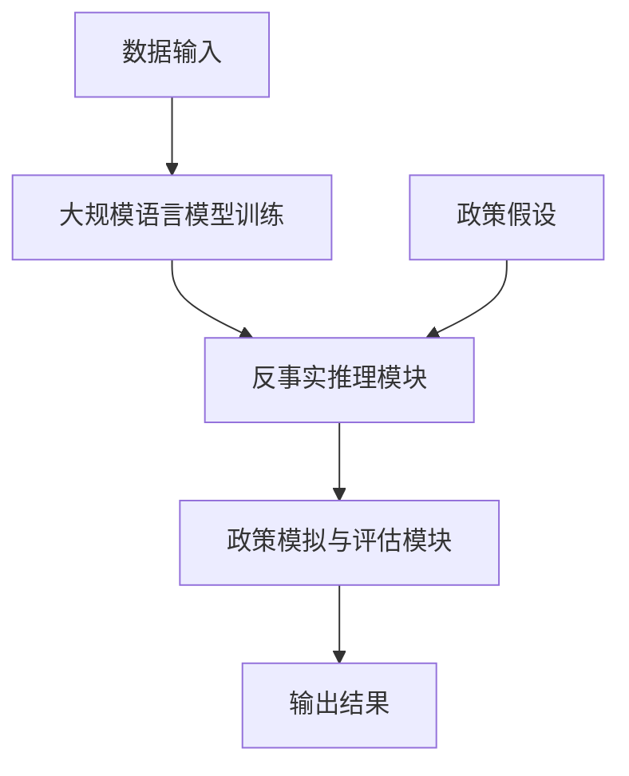

# 大规模语言模型的反事实推理在政策模拟与评估中的多维度应用

> 关键词：大规模语言模型、反事实推理、政策模拟、政策评估、多维度应用

> 摘要：本文聚焦于大规模语言模型的反事实推理在政策模拟与评估领域的多维度应用。首先介绍了研究的背景、目的、预期读者等内容。详细阐述了大规模语言模型和反事实推理的核心概念及其联系，给出了原理和架构的示意图与流程图。深入探讨了核心算法原理，并用Python代码进行说明，同时讲解了相关数学模型和公式。通过项目实战展示了代码的实际案例及详细解释。分析了该技术在不同场景下的实际应用，推荐了学习、开发工具框架和相关论文著作等资源。最后总结了未来发展趋势与挑战，还提供了常见问题解答和扩展阅读参考资料。旨在为政策制定者和研究者提供全面深入的技术支持和应用思路。

## 1. 背景介绍 
### 1.1 目的和范围
在当今复杂多变的社会经济环境下，政策的制定和评估面临着诸多挑战。政策的实施效果往往受到多种因素的影响，传统的政策模拟与评估方法在处理复杂情况时存在一定的局限性。大规模语言模型的反事实推理为政策模拟与评估提供了新的思路和方法。

本文的目的在于全面探讨大规模语言模型的反事实推理在政策模拟与评估中的多维度应用。具体范围包括介绍相关核心概念、阐述算法原理、展示数学模型、通过项目实战说明应用方法、分析实际应用场景、推荐学习和开发资源，以及总结未来发展趋势与挑战等方面。

### 1.2 预期读者
本文的预期读者主要包括政策制定者、政策研究人员、数据科学家、人工智能研究者以及对政策模拟与评估和大规模语言模型技术感兴趣的相关专业人士。政策制定者可以从中了解如何利用新的技术手段提高政策制定的科学性和合理性；政策研究人员可以获取更多的研究方法和思路；数据科学家和人工智能研究者可以深入探讨技术在实际应用中的细节和挑战。

### 1.3 文档结构概述
本文将按照以下结构进行阐述：
- 核心概念与联系：介绍大规模语言模型和反事实推理的核心概念，以及它们之间的联系，并给出相应的示意图和流程图。
- 核心算法原理 & 具体操作步骤：详细讲解核心算法原理，并用Python代码进行说明，同时给出具体的操作步骤。
- 数学模型和公式 & 详细讲解 & 举例说明：介绍相关的数学模型和公式，并进行详细讲解和举例说明。
- 项目实战：通过实际案例展示代码的实现和应用，并进行详细的解释说明。
- 实际应用场景：分析大规模语言模型的反事实推理在政策模拟与评估中的实际应用场景。
- 工具和资源推荐：推荐学习、开发工具框架和相关论文著作等资源。
- 总结：未来发展趋势与挑战：总结该技术的未来发展趋势和面临的挑战。
- 附录：常见问题与解答：提供常见问题的解答。
- 扩展阅读 & 参考资料：提供扩展阅读的资料和参考文献。

### 1.4 术语表
#### 1.4.1 核心术语定义
- **大规模语言模型**：是一种基于深度学习技术，通过在大规模文本数据上进行训练得到的语言模型，能够学习到语言的语法、语义和上下文信息，具有强大的语言理解和生成能力。例如，GPT - 3、BERT等。
- **反事实推理**：是指在已知事实的基础上，通过假设某些条件发生改变，来推断可能出现的结果。在政策模拟与评估中，反事实推理可以帮助我们评估如果政策没有实施或者政策发生改变，会产生怎样的不同结果。
- **政策模拟**：是指通过建立模型来模拟政策的实施过程和效果，以便在政策实施之前对其进行评估和优化。
- **政策评估**：是指对已经实施的政策进行评价，分析其实施效果、影响因素和存在的问题，为政策的调整和完善提供依据。

#### 1.4.2 相关概念解释
- **因果推断**：因果推断是研究变量之间因果关系的方法，反事实推理是因果推断的一种重要手段。通过反事实推理，我们可以判断某个因素是否是导致某个结果的原因。
- **机器学习**：机器学习是一门多领域交叉学科，涉及概率论、统计学、逼近论、凸分析、算法复杂度理论等多门学科。它专门研究计算机怎样模拟或实现人类的学习行为，以获取新的知识或技能，重新组织已有的知识结构使之不断改善自身的性能。大规模语言模型是机器学习在自然语言处理领域的重要应用。

#### 1.4.3 缩略词列表
- **LLM**：Large Language Model，大规模语言模型
- **NLP**：Natural Language Processing，自然语言处理

## 2. 核心概念与联系 
### 核心概念原理
#### 大规模语言模型
大规模语言模型通常基于Transformer架构，通过在大规模文本数据上进行无监督学习来学习语言的模式和规律。其核心原理是利用注意力机制来捕捉文本中的上下文信息，从而实现对文本的理解和生成。

例如，在GPT - 3中，模型通过多层的Transformer块对输入的文本进行处理。每个Transformer块包含多头自注意力机制和前馈神经网络，多头自注意力机制可以并行地计算不同位置的注意力权重，从而更好地捕捉文本中的长距离依赖关系。

#### 反事实推理
反事实推理的原理是基于因果关系的假设。在政策模拟与评估中，我们通常假设政策是一个干预变量，其他因素是协变量。通过构建反事实场景，即假设政策没有实施或者政策发生改变，我们可以推断出在这些情况下可能出现的结果，从而评估政策的效果。

例如，假设我们要评估一项税收政策对企业投资的影响。我们可以构建一个反事实场景，即假设没有实施这项税收政策，然后通过反事实推理来预测企业的投资情况。将预测结果与实际情况进行比较，就可以评估税收政策的效果。

### 架构的文本示意图
```plaintext
大规模语言模型反事实推理在政策模拟与评估中的架构

|----------------------|
|  大规模语言模型      |
|----------------------|
|  数据输入（政策文本、历史数据等） |
|----------------------|
|  模型训练（无监督学习） |
|----------------------|
|  反事实推理模块      |
|----------------------|
|  政策模拟与评估模块  |
|----------------------|
|  输出结果（政策效果评估、预测等） |
|----------------------|
```

### Mermaid流程图


## 3. 核心算法原理 & 具体操作步骤 
### 核心算法原理
在大规模语言模型的反事实推理中，核心算法主要包括以下几个方面：

#### 文本编码
将输入的政策文本和相关数据进行编码，转换为模型可以处理的向量表示。通常使用预训练的语言模型进行编码，例如BERT。

```python
import torch
from transformers import BertTokenizer, BertModel

# 加载预训练的BERT模型和分词器
tokenizer = BertTokenizer.from_pretrained('bert-base-uncased')
model = BertModel.from_pretrained('bert-base-uncased')

# 输入文本
text = "This is a sample policy text."
# 分词
inputs = tokenizer(text, return_tensors='pt')
# 编码
outputs = model(**inputs)
# 获取最后一层的隐藏状态
last_hidden_states = outputs.last_hidden_state
```

#### 反事实生成
根据政策假设，生成反事实场景的文本描述。可以使用模板匹配、规则生成等方法。

```python
# 假设政策文本为 "Increase tax rate by 10%."
policy_text = "Increase tax rate by 10%."
# 生成反事实场景
counterfactual_text = "Keep tax rate unchanged."
```

#### 推理和预测
将反事实场景的文本输入到大规模语言模型中，进行推理和预测，得到反事实结果。

```python
# 对反事实文本进行编码
counterfactual_inputs = tokenizer(counterfactual_text, return_tensors='pt')
counterfactual_outputs = model(**counterfactual_inputs)
counterfactual_last_hidden_states = counterfactual_outputs.last_hidden_state

# 这里可以使用一个简单的线性层进行预测
from torch import nn

linear_layer = nn.Linear(model.config.hidden_size, 1)
prediction = linear_layer(counterfactual_last_hidden_states.mean(dim=1))
```

### 具体操作步骤
1. **数据收集和预处理**：收集政策文本、历史数据等相关信息，并进行清洗、标注等预处理操作。
2. **模型选择和训练**：选择合适的大规模语言模型，并在收集的数据上进行微调或训练。
3. **反事实场景构建**：根据政策评估的需求，构建反事实场景的文本描述。
4. **推理和预测**：将反事实场景的文本输入到模型中，进行推理和预测，得到反事实结果。
5. **政策评估**：将反事实结果与实际情况进行比较，评估政策的效果。

## 4. 数学模型和公式 & 详细讲解 & 举例说明 
### 数学模型
在大规模语言模型的反事实推理中，常用的数学模型是潜在结果模型（Potential Outcomes Model）。

假设 $Y$ 是我们关注的结果变量，$T$ 是政策干预变量（$T = 1$ 表示实施政策，$T = 0$ 表示未实施政策），$X$ 是协变量。潜在结果模型定义了两个潜在结果：$Y(1)$ 表示实施政策时的结果，$Y(0)$ 表示未实施政策时的结果。

### 数学公式
- **个体因果效应（Individual Causal Effect, ICE）**：
$$\tau_i = Y_i(1) - Y_i(0)$$
其中，$\tau_i$ 表示第 $i$ 个个体的因果效应。

- **平均因果效应（Average Causal Effect, ACE）**：
$$\tau = E[Y(1) - Y(0)] = E[Y(1)] - E[Y(0)]$$

### 详细讲解
个体因果效应表示对于某个特定个体，实施政策和未实施政策所产生的结果差异。然而，在实际中，我们无法同时观察到一个个体在实施政策和未实施政策两种情况下的结果，因此个体因果效应是不可直接观测的。

平均因果效应是对所有个体的个体因果效应的期望，它反映了政策对总体的平均影响。在大规模语言模型的反事实推理中，我们的目标是通过模型预测 $E[Y(1)]$ 和 $E[Y(0)]$，从而估计平均因果效应。

### 举例说明
假设我们要评估一项教育政策对学生成绩的影响。$Y$ 表示学生的成绩，$T$ 表示是否实施教育政策（$T = 1$ 表示实施，$T = 0$ 表示未实施），$X$ 表示学生的一些特征，如年龄、性别、家庭背景等。

我们可以使用大规模语言模型来预测 $E[Y(1)]$ 和 $E[Y(0)]$。例如，我们可以将实施政策的学生数据输入到模型中，得到 $E[Y(1)]$ 的预测值；将未实施政策的学生数据（通过构建反事实场景）输入到模型中，得到 $E[Y(0)]$ 的预测值。然后，通过计算两者的差值，就可以估计出教育政策对学生成绩的平均因果效应。

## 5. 项目实战：代码实际案例和详细解释说明 
### 5.1  开发环境搭建
#### 操作系统
可以选择Windows、Linux或macOS等操作系统。建议使用Linux系统，因为它在深度学习开发中具有更好的稳定性和兼容性。

#### Python环境
安装Python 3.7及以上版本。可以使用Anaconda来管理Python环境，以下是创建和激活虚拟环境的命令：
```bash
conda create -n policy_eval python=3.8
conda activate policy_eval
```

#### 安装依赖库
安装必要的深度学习库和自然语言处理库，如PyTorch、transformers等：
```bash
pip install torch transformers pandas numpy scikit-learn
```

### 5.2  源代码详细实现和代码解读
```python
import torch
from transformers import BertTokenizer, BertModel
import pandas as pd
import numpy as np
from sklearn.linear_model import LinearRegression

# 加载预训练的BERT模型和分词器
tokenizer = BertTokenizer.from_pretrained('bert-base-uncased')
model = BertModel.from_pretrained('bert-base-uncased')

# 加载数据
data = pd.read_csv('policy_data.csv')
policy_texts = data['policy_text'].tolist()
outcomes = data['outcome'].tolist()

# 文本编码
encoded_texts = []
for text in policy_texts:
    inputs = tokenizer(text, return_tensors='pt')
    outputs = model(**inputs)
    last_hidden_states = outputs.last_hidden_state
    encoded_texts.append(last_hidden_states.mean(dim=1).detach().numpy())

encoded_texts = np.vstack(encoded_texts)

# 划分训练集和测试集
train_size = int(len(encoded_texts) * 0.8)
X_train = encoded_texts[:train_size]
y_train = outcomes[:train_size]
X_test = encoded_texts[train_size:]
y_test = outcomes[train_size:]

# 训练线性回归模型
model = LinearRegression()
model.fit(X_train, y_train)

# 构建反事实场景
counterfactual_policy_text = "Change policy to another way."
counterfactual_inputs = tokenizer(counterfactual_policy_text, return_tensors='pt')
counterfactual_outputs = model(**counterfactual_inputs)
counterfactual_last_hidden_states = counterfactual_outputs.last_hidden_state
counterfactual_encoded_text = counterfactual_last_hidden_states.mean(dim=1).detach().numpy()

# 预测反事实结果
counterfactual_prediction = model.predict(counterfactual_encoded_text)

print("Counterfactual prediction:", counterfactual_prediction)
```

### 代码解读与分析
1. **数据加载和预处理**：使用 `pandas` 库加载包含政策文本和结果的CSV文件，并将政策文本转换为列表。
2. **文本编码**：使用预训练的BERT模型对政策文本进行编码，将文本转换为向量表示。
3. **划分训练集和测试集**：将编码后的文本和结果数据划分为训练集和测试集，用于模型训练和评估。
4. **模型训练**：使用 `sklearn` 库中的线性回归模型对训练集进行训练。
5. **反事实场景构建**：构建一个反事实场景的政策文本，并对其进行编码。
6. **预测反事实结果**：将反事实场景的编码输入到训练好的线性回归模型中，进行预测。

## 6. 实际应用场景 
### 经济政策评估
在经济政策评估中，大规模语言模型的反事实推理可以帮助评估不同经济政策对宏观经济指标（如GDP、通货膨胀率、失业率等）的影响。例如，通过构建反事实场景，预测如果没有实施某项税收政策，经济增长会受到怎样的影响。

### 教育政策模拟
在教育政策模拟中，可以使用该技术评估不同教育政策对学生成绩、入学率、辍学率等指标的影响。例如，预测如果实施一项新的教育资源分配政策，不同地区学生的学习效果会发生怎样的变化。

### 环境政策制定
在环境政策制定中，反事实推理可以帮助评估不同环境政策对环境质量（如空气质量、水质等）的影响。例如，预测如果加大对污染企业的监管力度，环境质量会得到怎样的改善。

### 公共卫生政策评估
在公共卫生政策评估中，可以使用该技术评估不同公共卫生政策对疫情防控效果、疾病发病率等指标的影响。例如，预测如果提前实施某项社交隔离政策，疫情的传播速度会受到怎样的抑制。

## 7. 工具和资源推荐
### 7.1 学习资源推荐
#### 7.1.1 书籍推荐
- 《深度学习》（Deep Learning）：由Ian Goodfellow、Yoshua Bengio和Aaron Courville所著，是深度学习领域的经典教材，涵盖了深度学习的基本原理、算法和应用。
- 《自然语言处理入门》：由何晗所著，适合初学者了解自然语言处理的基本概念和技术。
- 《因果推断：基础与学习算法》（Causal Inference: What If）：由Miguel A. Hernán和James M. Robins所著，详细介绍了因果推断的理论和方法。

#### 7.1.2 在线课程
- Coursera上的“Deep Learning Specialization”：由Andrew Ng教授授课，是深度学习领域的经典在线课程。
- edX上的“Natural Language Processing with Deep Learning”：介绍了自然语言处理中深度学习的应用。
- Udemy上的“Causal Inference for Data Science”：专门讲解因果推断在数据科学中的应用。

#### 7.1.3 技术博客和网站
- Hugging Face博客：提供了关于大规模语言模型的最新研究成果和应用案例。
- arXiv：一个预印本数据库，包含了大量的学术论文，可用于了解最新的研究动态。
- Medium上的AI相关博客：有很多关于人工智能和自然语言处理的技术文章。

### 7.2 开发工具框架推荐
#### 7.2.1 IDE和编辑器
- PyCharm：是一款专门为Python开发设计的集成开发环境，具有强大的代码编辑、调试和项目管理功能。
- Jupyter Notebook：是一个交互式的开发环境，适合进行数据分析和模型实验。
- Visual Studio Code：是一款轻量级的代码编辑器，支持多种编程语言，并且有丰富的插件扩展。

#### 7.2.2 调试和性能分析工具
- TensorBoard：是TensorFlow的可视化工具，可以用于监控模型训练过程中的各种指标。
- Py-Spy：是一个用于Python代码性能分析的工具，可以帮助找出代码中的性能瓶颈。
- cProfile：是Python标准库中的性能分析工具，可以分析函数的调用时间和调用次数。

#### 7.2.3 相关框架和库
- PyTorch：是一个开源的深度学习框架，具有动态图的特点，易于使用和调试。
- Transformers：是Hugging Face开发的自然语言处理库，提供了多种预训练的语言模型和工具。
- Scikit-learn：是一个用于机器学习的Python库，提供了丰富的机器学习算法和工具。

### 7.3 相关论文著作推荐
#### 7.3.1 经典论文
- “Attention Is All You Need”：介绍了Transformer架构，是大规模语言模型的基础。
- “BERT: Pre-training of Deep Bidirectional Transformers for Language Understanding”：提出了BERT模型，在自然语言处理领域取得了巨大的成功。
- “Causal Inference Using Potential Outcomes: Design, Modeling, Decisions”：对潜在结果模型和因果推断进行了详细的阐述。

#### 7.3.2 最新研究成果
- 关注顶级学术会议（如NeurIPS、ICML、ACL等）上的相关论文，了解大规模语言模型和反事实推理的最新研究进展。
- 关注知名研究机构（如OpenAI、Google Research等）发布的研究报告。

#### 7.3.3 应用案例分析
- 一些政府机构和研究机构会发布政策评估的案例报告，可以从中了解大规模语言模型的反事实推理在实际政策中的应用情况。

## 8. 总结：未来发展趋势与挑战
### 未来发展趋势
- **模型性能提升**：随着计算资源的不断增加和算法的不断改进，大规模语言模型的性能将不断提升，能够处理更复杂的任务和数据。
- **多模态融合**：未来的大规模语言模型可能会融合图像、音频等多模态信息，从而在政策模拟与评估中提供更全面的信息。
- **可解释性增强**：提高大规模语言模型的可解释性将是未来的一个重要发展方向，使得政策制定者能够更好地理解模型的决策过程。
- **跨领域应用拓展**：大规模语言模型的反事实推理将在更多领域得到应用，如交通、能源等，为不同领域的政策制定和评估提供支持。

### 挑战
- **数据质量和隐私问题**：大规模语言模型需要大量的数据进行训练，数据的质量和隐私问题是一个重要的挑战。如何获取高质量、可靠的数据，同时保护数据的隐私，是需要解决的问题。
- **模型可解释性**：目前大规模语言模型的可解释性较差，政策制定者难以理解模型的决策过程和结果。如何提高模型的可解释性，是一个亟待解决的问题。
- **计算资源需求**：训练和运行大规模语言模型需要大量的计算资源，这对于一些小型机构和研究人员来说是一个挑战。如何降低计算资源的需求，提高模型的效率，是未来的一个研究方向。
- **因果关系识别**：在反事实推理中，准确识别因果关系是一个关键问题。由于现实世界中的因果关系复杂多样，如何提高模型对因果关系的识别能力，是需要解决的挑战。

## 9. 附录：常见问题与解答
### 问题1：大规模语言模型的反事实推理和传统的政策评估方法有什么区别？
答：传统的政策评估方法通常基于统计分析和实验设计，如随机对照试验等。而大规模语言模型的反事实推理可以利用文本数据和强大的语言理解能力，构建更复杂的反事实场景，并且能够处理非结构化数据。此外，大规模语言模型可以自动学习语言中的模式和规律，减少了人工特征工程的工作量。

### 问题2：如何选择合适的大规模语言模型进行反事实推理？
答：选择合适的大规模语言模型需要考虑多个因素，如模型的性能、适用场景、计算资源等。一般来说，可以选择一些预训练的通用语言模型，如GPT - 3、BERT等，然后根据具体任务进行微调。如果计算资源有限，可以选择一些轻量级的模型。

### 问题3：大规模语言模型的反事实推理结果可靠吗？
答：大规模语言模型的反事实推理结果的可靠性受到多种因素的影响，如数据质量、模型性能、因果关系识别等。为了提高结果的可靠性，需要确保数据的质量和多样性，选择合适的模型，并进行充分的验证和评估。同时，结合其他方法进行综合分析也是提高结果可靠性的有效途径。

### 问题4：在实际应用中，如何处理大规模语言模型的计算资源需求？
答：可以采用以下方法处理计算资源需求：
- **使用云计算平台**：如Amazon Web Services（AWS）、Google Cloud Platform（GCP）等，提供了强大的计算资源和灵活的计费方式。
- **模型压缩和优化**：采用模型剪枝、量化等技术，减少模型的参数数量和计算量。
- **分布式训练**：使用多个计算节点进行分布式训练，提高训练效率。

## 10. 扩展阅读 & 参考资料
### 扩展阅读
- 《人工智能时代的政策制定》：探讨了人工智能技术在政策制定中的应用和挑战。
- 《数据驱动的政策评估》：介绍了数据驱动的政策评估方法和案例。

### 参考资料
- Goodfellow, I., Bengio, Y., & Courville, A. (2016). Deep Learning. MIT Press.
- Devlin, J., Chang, M. W., Lee, K., & Toutanova, K. (2018). BERT: Pre-training of Deep Bidirectional Transformers for Language Understanding. arXiv preprint arXiv:1810.04805.
- Hernán, M. A., & Robins, J. M. (2020). Causal Inference: What If. Chapman and Hall/CRC.

作者：AI天才研究院/AI Genius Institute & 禅与计算机程序设计艺术 /Zen And The Art of Computer Programming