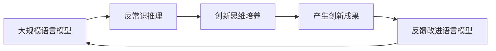

# 大规模语言模型的反常识推理在创新思维培养中的应用

> 关键词：大规模语言模型、反常识推理、创新思维培养、知识表征、认知突破

> 摘要：本文深入探讨了大规模语言模型的反常识推理在创新思维培养中的应用。首先介绍了相关背景知识，包括研究目的、预期读者等。接着阐述了大规模语言模型、反常识推理和创新思维培养的核心概念及其联系。详细讲解了反常识推理的核心算法原理，结合Python代码进行说明，并给出相应的数学模型和公式。通过项目实战展示了如何利用大规模语言模型进行反常识推理以培养创新思维。分析了其在不同领域的实际应用场景，推荐了学习资源、开发工具框架以及相关论文著作。最后总结了未来发展趋势与挑战，还提供了常见问题解答和扩展阅读参考资料，旨在为相关研究和实践提供全面的指导。

## 1. 背景介绍 
### 1.1 目的和范围
本研究的目的在于探索大规模语言模型的反常识推理能力在创新思维培养方面的潜在应用，为教育、科研、企业创新等领域提供新的思路和方法。范围涵盖了大规模语言模型的技术原理、反常识推理的实现机制、创新思维培养的理论和实践，以及三者之间的相互关系和应用场景。

### 1.2 预期读者
本文预期读者包括教育工作者、科研人员、企业创新管理者、人工智能开发者以及对创新思维培养和人工智能应用感兴趣的人士。

### 1.3 文档结构概述
本文将首先介绍相关的核心概念，包括大规模语言模型、反常识推理和创新思维培养，并阐述它们之间的联系。接着详细讲解反常识推理的核心算法原理和具体操作步骤，给出相应的数学模型和公式。通过项目实战展示如何利用大规模语言模型进行反常识推理以培养创新思维。分析其在不同领域的实际应用场景，推荐学习资源、开发工具框架和相关论文著作。最后总结未来发展趋势与挑战，提供常见问题解答和扩展阅读参考资料。

### 1.4 术语表
#### 1.4.1 核心术语定义
- **大规模语言模型**：基于大量文本数据训练得到的具有强大语言理解和生成能力的人工智能模型，如GPT - 3、BERT等。
- **反常识推理**：突破常规认知和思维定式，从不同角度对信息进行分析和推理，得出与常识不同的结论。
- **创新思维培养**：通过各种方法和手段激发和引导个体产生新颖、独特的思维方式和解决方案的过程。

#### 1.4.2 相关概念解释
- **知识表征**：将知识以计算机可处理的形式进行表示，以便大规模语言模型进行学习和推理。
- **认知突破**：打破原有的认知模式和思维局限，形成新的认知和理解。

#### 1.4.3 缩略词列表
- **GPT**：Generative Pretrained Transformer，生成式预训练变换器。
- **BERT**：Bidirectional Encoder Representations from Transformers，基于变换器的双向编码器表征。

## 2. 核心概念与联系 

### 大规模语言模型
大规模语言模型是人工智能领域的重要成果，它通过在海量文本数据上进行预训练，学习到丰富的语言知识和模式。其架构通常基于Transformer，具有强大的并行计算能力和长序列处理能力。例如，GPT - 3拥有1750亿个参数，能够生成高质量的文本，完成各种自然语言处理任务，如文本生成、问答系统、机器翻译等。

### 反常识推理
反常识推理是一种独特的思维方式，它不依赖于常规的逻辑和经验，而是通过挑战既定的认知和假设，寻找新的可能性。在大规模语言模型中，反常识推理可以通过对输入信息的重新组合、变形和拓展来实现。例如，对于“鸟会飞”这个常识，反常识推理可以思考“有没有不会飞的鸟”，并通过模型的知识储备给出鸵鸟等答案。

### 创新思维培养
创新思维培养旨在激发个体的创造力和想象力，使他们能够提出新颖、独特的想法和解决方案。它需要打破传统的思维模式，鼓励多元化的思考和探索。大规模语言模型的反常识推理可以为创新思维培养提供新的素材和启发，帮助个体突破思维局限。

### 核心概念联系示意图


从图中可以看出，大规模语言模型为反常识推理提供了技术支持，反常识推理为创新思维培养提供了手段，创新思维培养产生的创新成果又可以反馈到语言模型的训练中，促进语言模型的不断改进。

## 3. 核心算法原理 & 具体操作步骤 

### 反常识推理的核心算法原理
反常识推理的核心在于打破常规的知识关联，重新组合和挖掘信息。在大规模语言模型中，可以通过以下步骤实现：
1. **知识提取**：从大规模语言模型的知识库中提取与输入信息相关的知识。
2. **知识扰动**：对提取的知识进行扰动，例如改变概念的属性、关系等，以打破常规的知识关联。
3. **推理生成**：利用扰动后的知识进行推理，生成反常识的结论。

### Python代码实现
```python
import torch
from transformers import GPT2LMHeadModel, GPT2Tokenizer

# 加载预训练的GPT - 2模型和分词器
tokenizer = GPT2Tokenizer.from_pretrained('gpt2')
model = GPT2LMHeadModel.from_pretrained('gpt2')

def counterintuitive_reasoning(input_text):
    # 对输入文本进行分词
    input_ids = tokenizer.encode(input_text, return_tensors='pt')
    
    # 生成反常识推理的提示
    prompt = "打破常规思考，与“" + input_text + "”不同的情况是"
    
    # 对提示进行分词
    prompt_ids = tokenizer.encode(prompt, return_tensors='pt')
    
    # 拼接输入和提示
    combined_ids = torch.cat([input_ids, prompt_ids[:, 1:]], dim=1)
    
    # 生成反常识推理结果
    output = model.generate(combined_ids, max_length=100, num_beams=5, no_repeat_ngram_size=2)
    
    # 解码输出结果
    result = tokenizer.decode(output[0], skip_special_tokens=True)
    
    return result

# 示例输入
input_text = "苹果是红色的"
result = counterintuitive_reasoning(input_text)
print(result)
```

### 代码解释
1. **加载模型和分词器**：使用`transformers`库加载预训练的GPT - 2模型和分词器。
2. **定义反常识推理函数**：`counterintuitive_reasoning`函数接受输入文本，生成反常识推理的提示，并将输入和提示拼接在一起。
3. **生成反常识推理结果**：使用`model.generate`方法生成反常识推理结果，并将其解码为文本。
4. **示例运行**：输入“苹果是红色的”，调用反常识推理函数并打印结果。

## 4. 数学模型和公式 & 详细讲解 & 举例说明 

### 知识表征模型
大规模语言模型通常使用向量空间模型来表征知识。每个单词或概念可以表示为一个高维向量，向量之间的距离可以表示它们之间的语义相似度。设单词 $w$ 的向量表示为 $\mathbf{v}_w$，则两个单词 $w_1$ 和 $w_2$ 之间的余弦相似度可以表示为：
$$
\cos(\mathbf{v}_{w_1}, \mathbf{v}_{w_2}) = \frac{\mathbf{v}_{w_1} \cdot \mathbf{v}_{w_2}}{\|\mathbf{v}_{w_1}\| \|\mathbf{v}_{w_2}\|}
$$
其中，$\cdot$ 表示向量点积，$\|\cdot\|$ 表示向量的模。

### 反常识推理的概率模型
在反常识推理中，可以使用概率模型来评估生成的反常识结论的合理性。设输入信息为 $I$，生成的反常识结论为 $C$，则生成 $C$ 的概率可以表示为：
$$
P(C|I) = \frac{P(I|C)P(C)}{P(I)}
$$
其中，$P(I|C)$ 表示在给定反常识结论 $C$ 的情况下，输入信息 $I$ 出现的概率，$P(C)$ 表示反常识结论 $C$ 出现的先验概率，$P(I)$ 表示输入信息 $I$ 出现的概率。

### 举例说明
假设输入信息 $I$ 为“鸟会飞”，生成的反常识结论 $C$ 为“鸵鸟不会飞”。在大规模语言模型的知识库中，“鸵鸟”和“鸟”的向量表示相近，且有关于“鸵鸟不会飞”的知识。通过计算 $P(C|I)$，可以评估“鸵鸟不会飞”这个反常识结论的合理性。

## 5. 项目实战：代码实际案例和详细解释说明 

### 5.1  开发环境搭建
1. **安装Python**：确保系统中安装了Python 3.6或更高版本。
2. **安装依赖库**：使用`pip`安装`torch`和`transformers`库。
```bash
pip install torch transformers
```

### 5.2  源代码详细实现和代码解读
```python
import torch
from transformers import GPT2LMHeadModel, GPT2Tokenizer

# 加载预训练的GPT - 2模型和分词器
tokenizer = GPT2Tokenizer.from_pretrained('gpt2')
model = GPT2LMHeadModel.from_pretrained('gpt2')

def generate_counterintuitive_ideas(topic, num_ideas=5):
    ideas = []
    for _ in range(num_ideas):
        # 生成反常识推理的提示
        prompt = "打破常规思考，关于“" + topic + "”的不同想法是"
        
        # 对提示进行分词
        input_ids = tokenizer.encode(prompt, return_tensors='pt')
        
        # 生成反常识想法
        output = model.generate(input_ids, max_length=100, num_beams=5, no_repeat_ngram_size=2)
        
        # 解码输出结果
        result = tokenizer.decode(output[0], skip_special_tokens=True)
        
        # 提取生成的想法
        idea = result.replace(prompt, "").strip()
        ideas.append(idea)
    
    return ideas

# 示例主题
topic = "交通出行"
ideas = generate_counterintuitive_ideas(topic)

# 打印生成的反常识想法
for i, idea in enumerate(ideas):
    print(f"想法 {i + 1}: {idea}")
```

### 代码解读与分析
1. **加载模型和分词器**：使用`transformers`库加载预训练的GPT - 2模型和分词器。
2. **定义生成反常识想法的函数**：`generate_counterintuitive_ideas`函数接受一个主题和要生成的想法数量作为输入，通过多次调用`model.generate`方法生成反常识想法。
3. **生成反常识想法**：对于每个想法，生成反常识推理的提示，对提示进行分词，使用`model.generate`方法生成想法，并将其解码为文本。
4. **提取和存储想法**：从生成的文本中提取想法，并将其存储在列表中。
5. **示例运行**：输入“交通出行”作为主题，调用`generate_counterintuitive_ideas`函数生成5个反常识想法，并打印结果。

## 6. 实际应用场景 
### 教育领域
在教育中，大规模语言模型的反常识推理可以用于培养学生的创新思维。例如，在课堂上，教师可以提出一个常识性的问题，让学生使用大规模语言模型进行反常识推理，然后引导学生讨论和分析这些反常识的结论，激发学生的创造力和想象力。

### 科研领域
在科研中，反常识推理可以帮助研究人员突破传统思维的束缚，发现新的研究方向和问题。例如，在生物学研究中，通过反常识推理可以思考一些与传统生物学理论不同的现象和机制，从而推动生物学的发展。

### 企业创新领域
在企业创新中，大规模语言模型的反常识推理可以为产品设计、营销策略等方面提供新的思路。例如，企业可以使用反常识推理来思考如何改进现有产品，或者开发出与市场上现有产品不同的新产品。

## 7. 工具和资源推荐
### 7.1 学习资源推荐
#### 7.1.1 书籍推荐
- 《人工智能：一种现代的方法》：全面介绍了人工智能的基本概念、算法和应用。
- 《深度学习》：深入讲解了深度学习的理论和实践。
- 《创新者的窘境》：探讨了创新的本质和企业如何应对创新挑战。

#### 7.1.2 在线课程
- Coursera上的“人工智能基础”课程：由知名教授授课，系统介绍人工智能的基础知识。
- edX上的“深度学习专项课程”：深入学习深度学习的算法和应用。
- 中国大学MOOC上的“创新思维与方法”课程：培养创新思维的实用课程。

#### 7.1.3 技术博客和网站
- Medium：有许多关于人工智能和创新思维的优质博客文章。
- arXiv：提供最新的人工智能研究论文。
- 机器之心：专注于人工智能领域的资讯和技术分享。

### 7.2 开发工具框架推荐
#### 7.2.1 IDE和编辑器
- PyCharm：功能强大的Python集成开发环境，适合大规模语言模型的开发。
- Jupyter Notebook：交互式编程环境，方便进行代码调试和数据分析。
- Visual Studio Code：轻量级的代码编辑器，支持多种编程语言和插件。

#### 7.2.2 调试和性能分析工具
- TensorBoard：用于可视化深度学习模型的训练过程和性能指标。
- Py-Spy：用于分析Python代码的性能瓶颈。
- cProfile：Python内置的性能分析工具。

#### 7.2.3 相关框架和库
- Transformers：由Hugging Face开发的用于自然语言处理的库，支持多种预训练模型。
- PyTorch：开源的深度学习框架，广泛应用于大规模语言模型的开发。
- NLTK：自然语言处理工具包，提供了丰富的文本处理功能。

### 7.3 相关论文著作推荐
#### 7.3.1 经典论文
- 《Attention Is All You Need》：介绍了Transformer架构，是大规模语言模型的基础。
- 《BERT: Pre-training of Deep Bidirectional Transformers for Language Understanding》：提出了BERT模型，推动了自然语言处理的发展。
- 《Generative Adversarial Nets》：提出了生成对抗网络，为生成式模型的发展奠定了基础。

#### 7.3.2 最新研究成果
- 关注arXiv上关于大规模语言模型和反常识推理的最新论文，了解该领域的前沿研究。
- 参加国际人工智能会议，如NeurIPS、ICML等，获取最新的研究成果。

#### 7.3.3 应用案例分析
- 阅读相关的企业案例和研究报告，了解大规模语言模型的反常识推理在实际应用中的效果和经验。

## 8. 总结：未来发展趋势与挑战
### 未来发展趋势
- **模型性能提升**：随着计算能力的不断提高和算法的不断改进，大规模语言模型的性能将不断提升，反常识推理的准确性和可靠性也将得到提高。
- **多模态融合**：未来的大规模语言模型将不仅仅局限于文本处理，还将融合图像、音频等多种模态的信息，为反常识推理提供更丰富的素材。
- **个性化应用**：根据用户的需求和偏好，提供个性化的反常识推理服务，更好地满足不同用户的创新思维培养需求。

### 挑战
- **知识准确性**：大规模语言模型的知识来源于大量的文本数据，可能存在知识不准确或过时的问题，需要进行有效的知识验证和更新。
- **伦理和法律问题**：反常识推理可能会产生一些不符合伦理和法律规范的结论，需要建立相应的伦理和法律框架来规范其应用。
- **计算资源需求**：大规模语言模型的训练和推理需要大量的计算资源，如何降低计算成本是一个亟待解决的问题。

## 9. 附录：常见问题与解答
### 问题1：大规模语言模型的反常识推理结果一定正确吗？
答：不一定。大规模语言模型的反常识推理结果是基于其学习到的知识和模式生成的，可能存在不准确或不合理的情况。需要对生成的结果进行进一步的分析和验证。

### 问题2：如何评估反常识推理结果的合理性？
答：可以从多个角度评估反常识推理结果的合理性，如逻辑一致性、与现有知识的兼容性、实际可行性等。可以结合领域专家的意见和实际数据进行综合评估。

### 问题3：大规模语言模型的反常识推理在所有领域都适用吗？
答：不是。不同领域的知识和思维方式存在差异，大规模语言模型的反常识推理在某些领域可能更有效，而在某些领域可能需要结合特定的领域知识和方法进行改进。

## 10. 扩展阅读 & 参考资料
### 扩展阅读
- 《思考，快与慢》：探讨了人类思维的两种模式，对理解反常识推理有一定的帮助。
- 《创新的艺术》：介绍了创新的方法和技巧，可与大规模语言模型的反常识推理相结合。

### 参考资料
- Hugging Face官方文档：https://huggingface.co/docs
- PyTorch官方文档：https://pytorch.org/docs/stable/index.html
- 相关学术期刊和会议论文

作者：AI天才研究院/AI Genius Institute & 禅与计算机程序设计艺术 /Zen And The Art of Computer Programming