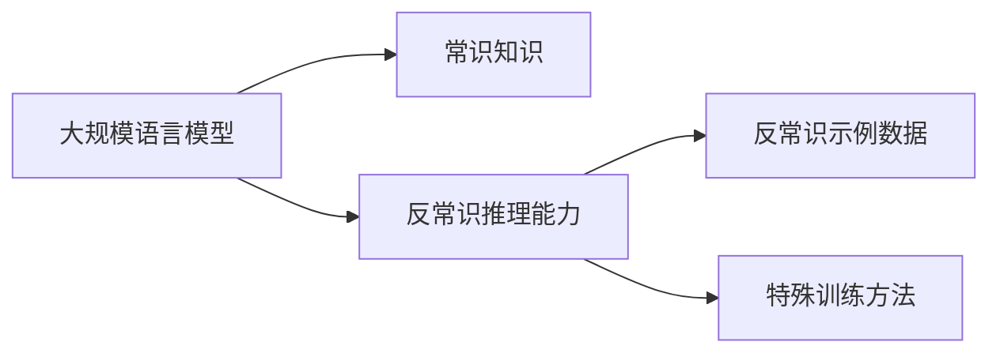

# 大规模语言模型的反常识推理能力培养

> 关键词：大规模语言模型、反常识推理、认知偏差、知识图谱、强化学习

> 摘要：本文围绕大规模语言模型的反常识推理能力培养展开深入探讨。首先介绍了相关背景，包括研究目的、预期读者等内容。接着阐述了核心概念与联系，明确反常识推理的原理和架构。详细讲解了核心算法原理及具体操作步骤，并给出Python代码示例。通过数学模型和公式进一步剖析，结合实际案例说明。在项目实战部分，给出了开发环境搭建、源代码实现及解读。还探讨了实际应用场景，推荐了相关工具和资源。最后总结了未来发展趋势与挑战，提供常见问题解答和参考资料，旨在全面深入地研究如何培养大规模语言模型的反常识推理能力。

## 1. 背景介绍 
### 1.1 目的和范围
随着大规模语言模型在自然语言处理领域的广泛应用，其在常识推理方面已经取得了一定的进展，但在反常识推理能力上还存在明显不足。本研究的目的在于探索如何有效地培养大规模语言模型的反常识推理能力，以使其能够处理更加复杂、多样化的自然语言任务。范围涵盖了从理论原理的阐述到实际应用场景的分析，以及相关工具和资源的推荐等多个方面。

### 1.2 预期读者
本文预期读者包括自然语言处理领域的研究人员、开发者、对人工智能技术有深入兴趣的学生和从业者。对于希望了解大规模语言模型技术前沿动态，尤其是关注反常识推理能力培养的人群具有较高的参考价值。

### 1.3 文档结构概述
本文首先介绍背景信息，包括目的、读者和文档结构。接着阐述核心概念与联系，让读者了解反常识推理的基本原理和架构。然后详细讲解核心算法原理及操作步骤，并给出Python代码示例。通过数学模型和公式进一步解释相关理论。在项目实战部分，从开发环境搭建到源代码实现及解读都有详细说明。之后探讨实际应用场景，推荐相关工具和资源。最后总结未来发展趋势与挑战，提供常见问题解答和参考资料。

### 1.4 术语表
#### 1.4.1 核心术语定义
- **大规模语言模型**：基于大量文本数据进行训练的深度学习模型，能够处理自然语言相关任务，如文本生成、问答系统等。
- **反常识推理**：突破常规常识的限制，根据给定的条件和信息，推理出与常识不符但在特定情境下合理的结论。
- **认知偏差**：人们在认知过程中由于各种因素导致的偏离客观事实的倾向。

#### 1.4.2 相关概念解释
- **知识图谱**：一种语义网络，用于表示实体之间的关系和知识，能够为语言模型提供结构化的知识支持。
- **强化学习**：通过智能体与环境进行交互，根据环境反馈的奖励信号来学习最优策略的机器学习方法。

#### 1.4.3 缩略词列表
- **NLP**：Natural Language Processing（自然语言处理）
- **LLM**：Large Language Model（大规模语言模型）

## 2. 核心概念与联系 
### 反常识推理的原理
反常识推理是在给定的信息基础上，通过逻辑分析和推理，得出与常规常识不同的结论。其原理在于打破固有的思维模式，考虑到各种特殊情况和潜在因素。例如，在常识中，鸟通常是会飞的，但在某些特殊情况下，如企鹅这种鸟就不会飞。反常识推理就是要能够识别出这种特殊情况，并基于合理的逻辑进行推理。

### 反常识推理与大规模语言模型的联系
大规模语言模型是实现反常识推理的重要工具。语言模型通过学习大量的文本数据，获取了丰富的知识和语言模式。然而，这些知识往往是基于常识的，要实现反常识推理，就需要对语言模型进行进一步的训练和优化。通过在训练数据中引入反常识的示例，以及采用特殊的训练方法，可以使语言模型具备反常识推理的能力。

### 文本示意图
```plaintext
大规模语言模型
|
|-- 常识知识（常规训练数据获取）
|
|-- 反常识推理能力（特殊训练和优化）
|   |
|   |-- 反常识示例数据
|   |
|   |-- 特殊训练方法（如强化学习）
```

### Mermaid 流程图


## 3. 核心算法原理 & 具体操作步骤 
### 核心算法原理
在培养大规模语言模型的反常识推理能力时，可以采用强化学习算法。强化学习的基本思想是智能体在环境中进行交互，根据环境反馈的奖励信号来调整自己的行为，以最大化长期累积奖励。在反常识推理的场景中，智能体就是语言模型，环境可以是一个包含各种问题和答案的数据集。语言模型根据输入的问题生成回答，环境根据回答的合理性和反常识程度给出奖励信号。

### 具体操作步骤
1. **数据准备**：收集包含反常识信息的数据集。可以从一些特殊的领域、科幻小说、悖论等来源获取数据。例如，收集一些关于时间旅行、平行宇宙等违反常规常识的故事和问题。
2. **环境构建**：构建一个模拟环境，用于评估语言模型的回答。环境可以根据回答的准确性、创新性和反常识程度给出奖励分数。
3. **模型训练**：使用强化学习算法对语言模型进行训练。在训练过程中，语言模型不断与环境进行交互，根据奖励信号调整自己的参数，以提高反常识推理能力。

### Python 源代码示例
```python
import torch
import torch.nn as nn
import torch.optim as optim
from torch.distributions import Categorical

# 定义语言模型
class LanguageModel(nn.Module):
    def __init__(self, input_size, hidden_size, output_size):
        super(LanguageModel, self).__init__()
        self.lstm = nn.LSTM(input_size, hidden_size, batch_first=True)
        self.fc = nn.Linear(hidden_size, output_size)

    def forward(self, x):
        out, _ = self.lstm(x)
        out = self.fc(out[:, -1, :])
        return out

# 定义强化学习智能体
class Agent:
    def __init__(self, input_size, hidden_size, output_size):
        self.model = LanguageModel(input_size, hidden_size, output_size)
        self.optimizer = optim.Adam(self.model.parameters(), lr=0.001)
        self.gamma = 0.9

    def select_action(self, state):
        state = torch.FloatTensor(state).unsqueeze(0)
        probs = torch.softmax(self.model(state), dim=1)
        m = Categorical(probs)
        action = m.sample()
        log_prob = m.log_prob(action)
        return action.item(), log_prob

    def update(self, rewards, log_probs):
        discounted_rewards = []
        for t in range(len(rewards)):
            Gt = 0
            pw = 0
            for r in rewards[t:]:
                Gt = Gt + self.gamma**pw * r
                pw = pw + 1
            discounted_rewards.append(Gt)

        discounted_rewards = torch.FloatTensor(discounted_rewards)
        discounted_rewards = (discounted_rewards - discounted_rewards.mean()) / (discounted_rewards.std() + 1e-9)

        policy_gradient = []
        for log_prob, Gt in zip(log_probs, discounted_rewards):
            policy_gradient.append(-log_prob * Gt)

        self.optimizer.zero_grad()
        policy_gradient = torch.stack(policy_gradient).sum()
        policy_gradient.backward()
        self.optimizer.step()
```

## 4. 数学模型和公式 & 详细讲解 & 举例说明 
### 数学模型
在强化学习中，我们可以用马尔可夫决策过程（MDP）来描述智能体与环境的交互过程。MDP 由一个五元组 $(S, A, P, R, \gamma)$ 组成，其中：
- $S$ 是状态空间，表示环境的所有可能状态。
- $A$ 是动作空间，表示智能体可以采取的所有动作。
- $P(s'|s, a)$ 是状态转移概率，表示在状态 $s$ 下采取动作 $a$ 后转移到状态 $s'$ 的概率。
- $R(s, a)$ 是奖励函数，表示在状态 $s$ 下采取动作 $a$ 后获得的即时奖励。
- $\gamma$ 是折扣因子，用于衡量未来奖励的重要性。

### 公式
智能体的目标是最大化长期累积奖励，即：
$$J(\theta) = \mathbb{E}_{\tau \sim \pi_{\theta}} \left[ \sum_{t=0}^{T} \gamma^t R(s_t, a_t) \right]$$
其中，$\tau = (s_0, a_0, s_1, a_1, \cdots, s_T, a_T)$ 是一个轨迹，$\pi_{\theta}$ 是智能体的策略，由参数 $\theta$ 决定。

为了更新策略参数 $\theta$，我们可以使用策略梯度算法，其更新公式为：
$$\theta \leftarrow \theta + \alpha \nabla_{\theta} J(\theta)$$
其中，$\alpha$ 是学习率，$\nabla_{\theta} J(\theta)$ 是目标函数 $J(\theta)$ 关于参数 $\theta$ 的梯度。

### 详细讲解
在反常识推理的场景中，状态 $s$ 可以表示输入的问题，动作 $a$ 可以表示语言模型生成的回答。奖励函数 $R(s, a)$ 根据回答的合理性和反常识程度来计算。折扣因子 $\gamma$ 用于平衡即时奖励和未来奖励的重要性。策略梯度算法通过不断调整策略参数 $\theta$，使得智能体能够在环境中获得更高的长期累积奖励，从而提高反常识推理能力。

### 举例说明
假设我们有一个关于时间旅行的问题：“如果一个人回到过去杀死了自己的祖父，会发生什么？” 语言模型生成的回答可能有多种。如果回答能够合理地探讨时间悖论等反常识的概念，如 “会产生时间悖论，可能导致时间线分裂成平行宇宙”，则可以获得较高的奖励。反之，如果回答只是基于常规常识，没有涉及反常识的思考，则奖励较低。通过不断地与环境交互和更新策略参数，语言模型会逐渐学会生成更具反常识推理能力的回答。

## 5. 项目实战：代码实际案例和详细解释说明 
### 5.1  开发环境搭建
1. **安装 Python**：建议使用 Python 3.7 及以上版本。可以从 Python 官方网站（https://www.python.org/downloads/） 下载并安装。
2. **安装深度学习框架**：本项目使用 PyTorch 作为深度学习框架。可以使用以下命令安装：
```bash
pip install torch torchvision
```
3. **安装其他依赖库**：根据项目需要，可能还需要安装一些其他的库，如 `numpy`、`matplotlib` 等。可以使用以下命令安装：
```bash
pip install numpy matplotlib
```

### 5.2  源代码详细实现和代码解读
```python
import torch
import torch.nn as nn
import torch.optim as optim
from torch.distributions import Categorical
import numpy as np

# 定义语言模型
class LanguageModel(nn.Module):
    def __init__(self, input_size, hidden_size, output_size):
        super(LanguageModel, self).__init__()
        self.lstm = nn.LSTM(input_size, hidden_size, batch_first=True)
        self.fc = nn.Linear(hidden_size, output_size)

    def forward(self, x):
        out, _ = self.lstm(x)
        out = self.fc(out[:, -1, :])
        return out

# 定义强化学习智能体
class Agent:
    def __init__(self, input_size, hidden_size, output_size):
        self.model = LanguageModel(input_size, hidden_size, output_size)
        self.optimizer = optim.Adam(self.model.parameters(), lr=0.001)
        self.gamma = 0.9

    def select_action(self, state):
        state = torch.FloatTensor(state).unsqueeze(0)
        probs = torch.softmax(self.model(state), dim=1)
        m = Categorical(probs)
        action = m.sample()
        log_prob = m.log_prob(action)
        return action.item(), log_prob

    def update(self, rewards, log_probs):
        discounted_rewards = []
        for t in range(len(rewards)):
            Gt = 0
            pw = 0
            for r in rewards[t:]:
                Gt = Gt + self.gamma**pw * r
                pw = pw + 1
            discounted_rewards.append(Gt)

        discounted_rewards = torch.FloatTensor(discounted_rewards)
        discounted_rewards = (discounted_rewards - discounted_rewards.mean()) / (discounted_rewards.std() + 1e-9)

        policy_gradient = []
        for log_prob, Gt in zip(log_probs, discounted_rewards):
            policy_gradient.append(-log_prob * Gt)

        self.optimizer.zero_grad()
        policy_gradient = torch.stack(policy_gradient).sum()
        policy_gradient.backward()
        self.optimizer.step()

# 模拟环境
class Environment:
    def __init__(self):
        self.states = np.random.rand(100, 10)  # 模拟状态数据
        self.rewards = np.random.randint(0, 10, 100)  # 模拟奖励数据
        self.current_state_index = 0

    def reset(self):
        self.current_state_index = 0
        return self.states[self.current_state_index]

    def step(self, action):
        reward = self.rewards[self.current_state_index]
        self.current_state_index += 1
        if self.current_state_index >= len(self.states):
            done = True
            next_state = None
        else:
            done = False
            next_state = self.states[self.current_state_index]
        return next_state, reward, done

# 训练过程
if __name__ == "__main__":
    input_size = 10
    hidden_size = 20
    output_size = 5
    agent = Agent(input_size, hidden_size, output_size)
    env = Environment()

    num_episodes = 100
    for episode in range(num_episodes):
        state = env.reset()
        log_probs = []
        rewards = []
        done = False
        while not done:
            action, log_prob = agent.select_action(state)
            next_state, reward, done = env.step(action)
            log_probs.append(log_prob)
            rewards.append(reward)
            state = next_state
        agent.update(rewards, log_probs)
        if episode % 10 == 0:
            print(f"Episode {episode}: Total Reward = {sum(rewards)}")
```

### 5.3  代码解读与分析
1. **语言模型定义**：`LanguageModel` 类定义了一个基于 LSTM 的语言模型。LSTM 用于处理序列数据，最后通过全连接层输出预测结果。
2. **强化学习智能体**：`Agent` 类实现了强化学习智能体的核心功能，包括选择动作和更新策略参数。`select_action` 方法根据当前状态选择动作，并记录动作的对数概率。`update` 方法根据奖励和对数概率更新策略参数。
3. **模拟环境**：`Environment` 类模拟了一个环境，包含状态数据和奖励数据。`reset` 方法用于重置环境状态，`step` 方法用于执行动作并返回下一个状态、奖励和是否完成的标志。
4. **训练过程**：在主程序中，我们创建了智能体和环境，并进行多轮训练。每一轮训练中，智能体与环境进行交互，记录动作的对数概率和奖励，最后更新策略参数。

## 6. 实际应用场景 
### 创意写作
在创意写作领域，大规模语言模型的反常识推理能力可以帮助生成更具创意和独特性的故事、诗歌等作品。例如，在科幻小说创作中，语言模型可以突破常规的物理常识，创造出新颖的科幻设定和情节。

### 问题解决
在解决复杂问题时，反常识推理能力可以帮助我们从不同的角度思考问题，找到创新性的解决方案。例如，在工程领域，当遇到传统方法无法解决的问题时，语言模型可以提供一些反常识的思路和建议。

### 教育领域
在教育中，反常识推理能力可以培养学生的批判性思维和创新能力。语言模型可以作为教育工具，提供一些反常识的问题和案例，引导学生进行思考和讨论。

### 游戏开发
在游戏开发中，反常识推理能力可以增加游戏的趣味性和挑战性。例如，在冒险游戏中，语言模型可以生成一些反常识的谜题和任务，让玩家需要突破常规思维才能解决。

## 7. 工具和资源推荐
### 7.1 学习资源推荐
#### 7.1.1 书籍推荐
- 《深度学习》（Deep Learning）：由 Ian Goodfellow、Yoshua Bengio 和 Aaron Courville 所著，是深度学习领域的经典教材，涵盖了神经网络、优化算法等基础知识。
- 《自然语言处理入门》：介绍了自然语言处理的基本概念、算法和技术，适合初学者学习。

#### 7.1.2 在线课程
- Coursera 上的 “Deep Learning Specialization”：由 Andrew Ng 教授授课，全面介绍了深度学习的理论和实践。
