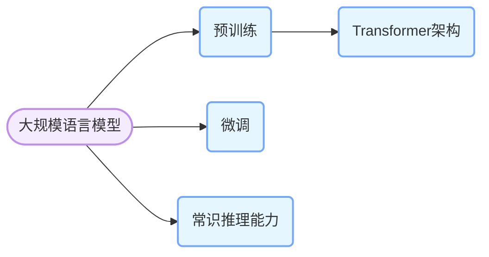

# 大规模语言模型的常识推理能力提升

> 关键词：大规模语言模型、常识推理能力、提升方法、核心算法、应用场景

> 摘要：本文围绕大规模语言模型的常识推理能力提升展开深入探讨。首先介绍了相关背景，包括目的范围、预期读者等。接着阐述核心概念及联系，剖析核心算法原理并给出具体操作步骤，同时讲解数学模型和公式。通过项目实战展示代码案例并详细解释。分析了实际应用场景，推荐了学习、开发工具和相关论文著作。最后总结未来发展趋势与挑战，还设置了常见问题解答和扩展阅读参考资料，旨在为提升大规模语言模型的常识推理能力提供全面且深入的指导。

## 1. 背景介绍 
### 1.1 目的和范围
随着人工智能技术的飞速发展，大规模语言模型在自然语言处理领域取得了显著的成果。然而，当前的大规模语言模型在常识推理方面仍存在一定的不足。本文章的目的在于深入研究如何提升大规模语言模型的常识推理能力，通过介绍相关的核心概念、算法原理、数学模型以及实际案例等内容，为研究人员和开发者提供全面的指导和参考。范围涵盖了从理论基础到实际应用的各个方面，包括核心算法的实现、项目实战的代码分析以及实际应用场景的探讨等。

### 1.2 预期读者
本文预期读者主要包括人工智能领域的研究人员、软件开发工程师、对自然语言处理和大规模语言模型感兴趣的学生以及相关领域的技术爱好者。对于研究人员，本文可以提供新的研究思路和方法；对于软件开发工程师，能够帮助他们在实际项目中提升语言模型的常识推理能力；对于学生和技术爱好者，有助于他们深入了解大规模语言模型的相关知识和技术。

### 1.3 文档结构概述
本文的文档结构如下：首先介绍核心概念与联系，明确大规模语言模型和常识推理的相关概念和它们之间的联系；接着详细讲解核心算法原理及具体操作步骤，通过Python代码进行阐述；然后介绍数学模型和公式，并举例说明；再通过项目实战展示代码实际案例并进行详细解释；之后分析实际应用场景；推荐学习、开发工具和相关论文著作；最后总结未来发展趋势与挑战，设置常见问题解答和扩展阅读参考资料。

### 1.4 术语表
#### 1.4.1 核心术语定义
- **大规模语言模型（Large Language Model，LLM）**：是指具有大量参数和强大语言处理能力的深度学习模型，通常基于Transformer架构，通过在大规模文本数据上进行训练来学习语言的模式和规律。
- **常识推理（Common Sense Reasoning）**：是指基于人类日常积累的常识知识，对给定的信息进行推理和判断，以得出合理结论的能力。在自然语言处理中，常识推理能力可以帮助语言模型更好地理解文本的含义和上下文信息。

#### 1.4.2 相关概念解释
- **预训练（Pre - training）**：大规模语言模型在大规模无监督文本数据上进行的初始训练过程，目的是学习语言的通用模式和特征。
- **微调（Fine - tuning）**：在预训练的基础上，使用特定任务的有监督数据对模型进行进一步训练，以适应具体的任务需求。

#### 1.4.3 缩略词列表
- **LLM**：Large Language Model（大规模语言模型）
- **NLP**：Natural Language Processing（自然语言处理）

## 2. 核心概念与联系 

### 大规模语言模型的原理
大规模语言模型通常基于Transformer架构，Transformer架构由编码器和解码器组成。编码器负责对输入的文本进行特征提取和表示，解码器则根据编码器的输出生成相应的文本。在预训练阶段，模型通过在大规模文本数据上进行无监督学习，学习语言的概率分布和模式。例如，在自监督学习任务中，模型可以通过预测文本中的掩码词来学习语言的上下文信息。

### 常识推理的本质
常识推理是人类智能的重要组成部分，它基于人类在日常生活中积累的大量常识知识。这些常识知识包括物理常识（如物体的属性、运动规律等）、社会常识（如人际关系、文化习俗等）和心理常识（如人类的情感、动机等）。在自然语言处理中，常识推理的本质是让语言模型能够利用这些常识知识，对输入的文本进行更深入的理解和推理。

### 核心概念的联系
大规模语言模型的目标是能够处理各种自然语言任务，而常识推理能力是实现这一目标的关键。缺乏常识推理能力的语言模型在处理一些需要常识知识的任务时会表现不佳。例如，在回答“鸟为什么会飞”这样的问题时，如果模型没有关于鸟类生理结构和空气动力学的常识知识，就很难给出合理的回答。因此，提升大规模语言模型的常识推理能力可以增强其在自然语言处理任务中的表现。

### 文本示意图
```plaintext
大规模语言模型
|
|-- 预训练（学习语言通用模式）
|   |
|   |-- Transformer架构（编码器、解码器）
|
|-- 微调（适应具体任务）
|
|-- 常识推理能力（利用常识知识理解文本）
```

### Mermaid流程图


## 3. 核心算法原理 & 具体操作步骤 

### 核心算法原理
为了提升大规模语言模型的常识推理能力，一种常用的方法是在预训练过程中引入常识知识。这里我们介绍一种基于知识注入的方法。其核心思想是将外部的常识知识图谱中的知识融入到语言模型的训练过程中。

假设我们有一个知识图谱 $G=(V, E)$，其中 $V$ 是节点集合，代表实体或概念，$E$ 是边集合，代表实体之间的关系。我们可以通过以下步骤将知识图谱中的知识注入到语言模型中：

1. **知识表示**：将知识图谱中的节点和边转换为向量表示。可以使用图嵌入技术，如TransE、RotatE等。
2. **知识融合**：在语言模型的输入层，将文本的词向量和知识图谱的向量表示进行融合。可以使用拼接、加权求和等方法。
3. **联合训练**：在训练过程中，同时优化语言模型的语言建模任务和知识图谱的知识推理任务。

### 具体操作步骤及Python代码实现
以下是一个简化的Python代码示例，展示了如何实现知识注入的过程：

```python
import torch
import torch.nn as nn

# 假设我们已经有了词向量和知识图谱向量
# 定义词向量维度和知识图谱向量维度
word_embedding_dim = 300
knowledge_embedding_dim = 200

# 定义输入层
class InputLayer(nn.Module):
    def __init__(self):
        super(InputLayer, self).__init__()
        # 假设我们已经有了词嵌入层和知识图谱嵌入层
        self.word_embedding = nn.Embedding(10000, word_embedding_dim)
        self.knowledge_embedding = nn.Embedding(5000, knowledge_embedding_dim)

    def forward(self, word_ids, knowledge_ids):
        # 获取词向量和知识图谱向量
        word_vec = self.word_embedding(word_ids)
        knowledge_vec = self.knowledge_embedding(knowledge_ids)
        # 知识融合：拼接
        combined_vec = torch.cat([word_vec, knowledge_vec], dim=-1)
        return combined_vec

# 定义一个简单的语言模型
class SimpleLanguageModel(nn.Module):
    def __init__(self):
        super(SimpleLanguageModel, self).__init__()
        self.input_layer = InputLayer()
        self.fc = nn.Linear(word_embedding_dim + knowledge_embedding_dim, 10000)

    def forward(self, word_ids, knowledge_ids):
        combined_vec = self.input_layer(word_ids, knowledge_ids)
        output = self.fc(combined_vec)
        return output

# 示例输入
word_ids = torch.randint(0, 10000, (32,))
knowledge_ids = torch.randint(0, 5000, (32,))

# 创建模型实例
model = SimpleLanguageModel()

# 前向传播
output = model(word_ids, knowledge_ids)
print(output.shape)
```

### 代码解释
1. **InputLayer类**：负责将词向量和知识图谱向量进行融合。通过 `nn.Embedding` 层获取词向量和知识图谱向量，然后使用 `torch.cat` 函数将它们拼接在一起。
2. **SimpleLanguageModel类**：一个简单的语言模型，包含输入层和一个全连接层。输入层将词向量和知识图谱向量融合，全连接层将融合后的向量映射到词汇表大小的维度。
3. **示例输入**：随机生成词ID和知识图谱ID，然后进行前向传播，输出结果的形状为 `(32, 10000)`，表示每个样本对应词汇表中每个词的得分。

## 4. 数学模型和公式 & 详细讲解 & 举例说明 

### 知识图谱嵌入模型：TransE
#### 数学模型和公式
TransE是一种经典的知识图谱嵌入模型，其核心思想是将知识图谱中的实体和关系表示为低维向量，并且满足 $h + r \approx t$，其中 $h$ 是头实体的向量表示，$r$ 是关系的向量表示，$t$ 是尾实体的向量表示。

TransE的目标是最小化以下损失函数：
$$L = \sum_{(h, r, t) \in S} \sum_{(h', r, t') \in S'} [\gamma + d(h + r, t) - d(h' + r, t')]_+$$
其中，$S$ 是正样本集合，$S'$ 是负样本集合，$\gamma$ 是一个边界超参数，$d$ 是距离函数，通常使用L1或L2距离，$[x]_+ = \max(0, x)$ 是一个取正函数。

#### 详细讲解
- **正样本和负样本**：正样本是知识图谱中真实存在的三元组 $(h, r, t)$，负样本是通过随机替换正样本中的头实体或尾实体得到的虚假三元组 $(h', r, t')$。
- **损失函数的含义**：损失函数的目标是让正样本的距离 $d(h + r, t)$ 尽可能小，负样本的距离 $d(h' + r, t')$ 尽可能大，并且两者之间的差距至少为 $\gamma$。

#### 举例说明
假设我们有一个知识图谱，其中有一个三元组 (北京, 是, 中国的首都)。在TransE中，“北京”、“中国” 是实体，“是……的首都” 是关系。我们将这些实体和关系表示为向量，通过训练使得 “北京” 的向量加上 “是……的首都” 的向量尽可能接近 “中国” 的向量。

### 知识融合的加权求和方法
#### 数学模型和公式
假设词向量为 $w$，知识图谱向量为 $k$，融合后的向量为 $v$，则加权求和的公式为：
$$v = \alpha w + (1 - \alpha) k$$
其中，$\alpha$ 是一个权重系数，取值范围为 $[0, 1]$。

#### 详细讲解
$\alpha$ 控制了词向量和知识图谱向量在融合过程中的相对重要性。当 $\alpha = 1$ 时，融合后的向量完全由词向量决定；当 $\alpha = 0$ 时，融合后的向量完全由知识图谱向量决定。

#### 举例说明
假设词向量 $w = [0.2, 0.3, 0.5]$，知识图谱向量 $k = [0.4, 0.6, 0.1]$，$\alpha = 0.6$，则融合后的向量为：
$$v = 0.6 \times [0.2, 0.3, 0.5] + (1 - 0.6) \times [0.4, 0.6, 0.1]$$
$$v = [0.12, 0.18, 0.3] + [0.16, 0.24, 0.04]$$
$$v = [0.28, 0.42, 0.34]$$

## 5. 项目实战：代码实际案例和详细解释说明 

### 5.1  开发环境搭建
#### 硬件环境
- **CPU**：建议使用多核处理器，如Intel Core i7及以上。
- **GPU**：如果进行大规模训练，建议使用NVIDIA GPU，如NVIDIA GeForce RTX 30系列或NVIDIA Tesla系列。
- **内存**：至少16GB，建议32GB及以上。

#### 软件环境
- **操作系统**：推荐使用Linux系统，如Ubuntu 18.04及以上版本。
- **Python**：版本3.7及以上。
- **深度学习框架**：使用PyTorch，版本1.7及以上。可以使用以下命令安装：
```bash
pip install torch torchvision torchaudio
```
- **其他依赖库**：如`numpy`、`pandas`等，可以使用以下命令安装：
```bash
pip install numpy pandas
```

### 5.2  源代码详细实现和代码解读
以下是一个完整的项目实战代码示例，用于提升大规模语言模型的常识推理能力：

```python
import torch
import torch.nn as nn
import torch.optim as optim
from torch.utils.data import Dataset, DataLoader

# 定义数据集类
class KnowledgeDataset(Dataset):
    def __init__(self, word_ids, knowledge_ids, labels):
        self.word_ids = word_ids
        self.knowledge_ids = knowledge_ids
        self.labels = labels

    def __len__(self):
        return len(self.word_ids)

    def __getitem__(self, idx):
        return self.word_ids[idx], self.knowledge_ids[idx], self.labels[idx]

# 定义输入层
class InputLayer(nn.Module):
    def __init__(self, word_vocab_size, word_embedding_dim, knowledge_vocab_size, knowledge_embedding_dim):
        super(InputLayer, self).__init__()
        self.word_embedding = nn.Embedding(word_vocab_size, word_embedding_dim)
        self.knowledge_embedding = nn.Embedding(knowledge_vocab_size, knowledge_embedding_dim)

    def forward(self, word_ids, knowledge_ids):
        word_vec = self.word_embedding(word_ids)
        knowledge_vec = self.knowledge_embedding(knowledge_ids)
        combined_vec = torch.cat([word_vec, knowledge_vec], dim=-1)
        return combined_vec

# 定义语言模型
class LanguageModel(nn.Module):
    def __init__(self, word_vocab_size, word_embedding_dim, knowledge_vocab_size, knowledge_embedding_dim, hidden_dim, output_dim):
        super(LanguageModel, self).__init__()
        self.input_layer = InputLayer(word_vocab_size, word_embedding_dim, knowledge_vocab_size, knowledge_embedding_dim)
        self.fc1 = nn.Linear(word_embedding_dim + knowledge_embedding_dim, hidden_dim)
        self.relu = nn.ReLU()
        self.fc2 = nn.Linear(hidden_dim, output_dim)

    def forward(self, word_ids, knowledge_ids):
        combined_vec = self.input_layer(word_ids, knowledge_ids)
        hidden = self.fc1(combined_vec)
        hidden = self.relu(hidden)
        output = self.fc2(hidden)
        return output

# 超参数设置
word_vocab_size = 10000
word_embedding_dim = 300
knowledge_vocab_size = 5000
knowledge_embedding_dim = 200
hidden_dim = 512
output_dim = 2
batch_size = 32
learning_rate = 0.001
num_epochs = 10

# 生成示例数据
word_ids = torch.randint(0, word_vocab_size, (1000,))
knowledge_ids = torch.randint(0, knowledge_vocab_size, (1000,))
labels = torch.randint(0, 2, (1000,))

# 创建数据集和数据加载器
dataset = KnowledgeDataset(word_ids, knowledge_ids, labels)
dataloader = DataLoader(dataset, batch_size=batch_size, shuffle=True)

# 创建模型、损失函数和优化器
model = LanguageModel(word_vocab_size, word_embedding_dim, knowledge_vocab_size, knowledge_embedding_dim, hidden_dim, output_dim)
criterion = nn.CrossEntropyLoss()
optimizer = optim.Adam(model.parameters(), lr=learning_rate)

# 训练模型
for epoch in range(num_epochs):
    running_loss = 0.0
    for word_batch, knowledge_batch, label_batch in dataloader:
        optimizer.zero_grad()
        outputs = model(word_batch, knowledge_batch)
        loss = criterion(outputs, label_batch)
        loss.backward()
        optimizer.step()
        running_loss += loss.item()
    print(f'Epoch {epoch + 1}, Loss: {running_loss / len(dataloader)}')

```

### 5.3  代码解读与分析
#### 数据集类 `KnowledgeDataset`
- 继承自 `torch.utils.data.Dataset`，用于封装数据集。
- `__init__` 方法接收词ID、知识图谱ID和标签作为输入。
- `__len__` 方法返回数据集的长度。
- `__getitem__` 方法根据索引返回对应的词ID、知识图谱ID和标签。

#### 输入层 `InputLayer`
- 负责将词向量和知识图谱向量进行融合。
- 通过 `nn.Embedding` 层获取词向量和知识图谱向量，然后使用 `torch.cat` 函数将它们拼接在一起。

#### 语言模型 `LanguageModel`
- 包含输入层、两个全连接层和一个ReLU激活函数。
- 输入层将词向量和知识图谱向量融合，第一个全连接层将融合后的向量映射到隐藏层，ReLU激活函数增加模型的非线性，第二个全连接层将隐藏层的输出映射到输出层。

#### 训练过程
- 使用 `DataLoader` 加载数据集，进行批量训练。
- 在每个epoch中，遍历数据集，计算损失，进行反向传播和参数更新。
- 打印每个epoch的平均损失。

## 6. 实际应用场景 
### 智能问答系统
在智能问答系统中，提升大规模语言模型的常识推理能力可以让系统更好地理解用户的问题，并给出更准确、更有深度的回答。例如，当用户询问 “为什么冬天会下雪” 时，具备常识推理能力的语言模型可以结合物理常识，解释下雪的原理，而不仅仅是给出一些表面的信息。

### 对话系统
在对话系统中，常识推理能力可以使对话更加自然和流畅。例如，在与用户的对话中，语言模型可以根据常识知识理解用户的意图，进行合理的回应。当用户说 “我今天感冒了”，语言模型可以根据常识知识给出关心的话语和一些建议，如 “那你要注意休息，多喝水”。

### 文本生成
在文本生成任务中，常识推理能力可以让生成的文本更加合理和连贯。例如，在生成新闻报道时，语言模型可以根据常识知识对事件进行合理的描述和分析。在生成故事时，也可以根据常识知识构建合理的情节和人物关系。

### 信息检索
在信息检索中，常识推理能力可以帮助语言模型更好地理解用户的查询意图，提高检索的准确性。例如，当用户查询 “苹果公司的创始人是谁” 时，具备常识推理能力的语言模型可以准确地给出答案，而不是返回一些无关的信息。

## 7. 工具和资源推荐
### 7.1 学习资源推荐
#### 7.1.1 书籍推荐
- 《深度学习》（Deep Learning）：由Ian Goodfellow、Yoshua Bengio和Aaron Courville撰写，是深度学习领域的经典教材，涵盖了神经网络、优化算法等基础知识。
- 《自然语言处理入门》：介绍了自然语言处理的基本概念、方法和技术，适合初学者学习。
- 《知识图谱：方法、实践与应用》：详细介绍了知识图谱的构建、表示和推理等方面的内容，对于了解知识图谱在语言模型中的应用有很大帮助。

#### 7.1.2 在线课程
- Coursera上的 “Deep Learning Specialization”：由Andrew Ng教授授课，系统地介绍了深度学习的各个方面，包括神经网络、卷积神经网络、循环神经网络等。
- edX上的 “Natural Language Processing with Deep Learning”：深入讲解了自然语言处理中深度学习的应用，包括词嵌入、序列模型等。
- 中国大学MOOC上的 “人工智能：模型与算法”：介绍了人工智能的基本模型和算法，对于理解大规模语言模型的原理有一定的帮助。

#### 7.1.3 技术博客和网站
- Medium：有很多关于人工智能和自然语言处理的优秀博客文章，作者包括行业专家和研究人员。
- arXiv：是一个预印本论文库，提供了最新的学术研究成果，对于了解大规模语言模型的最新进展非常有帮助。
- Hugging Face Blog：Hugging Face是自然语言处理领域的知名组织，其博客上有很多关于语言模型的技术文章和教程。

### 7.2 开发工具框架推荐
#### 7.2.1 IDE和编辑器
- PyCharm：是一款专门为Python开发设计的集成开发环境，具有强大的代码编辑、调试和自动补全功能。
- Visual Studio Code：是一款轻量级的代码编辑器，支持多种编程语言，并且有丰富的扩展插件，可以满足不同的开发需求。

#### 7.2.2 调试和性能分析工具
- TensorBoard：是TensorFlow提供的可视化工具，可以用于监控模型的训练过程，分析损失函数、准确率等指标的变化。
- PyTorch Profiler：是PyTorch提供的性能分析工具，可以帮助开发者找出模型中的性能瓶颈，优化代码。

#### 7.2.3 相关框架和库
- PyTorch：是一个开源的深度学习框架，具有动态图特性，易于使用和调试，广泛应用于自然语言处理领域。
- Hugging Face Transformers：提供了一系列预训练的语言模型和相关工具，方便开发者进行自然语言处理任务的开发。
- DGL（Deep Graph Library）：是一个用于图神经网络的开源框架，可以用于知识图谱的嵌入和推理。

### 7.3 相关论文著作推荐
#### 7.3.1 经典论文
- “Attention Is All You Need”：提出了Transformer架构，是大规模语言模型的基础。
- “BERT: Pre - training of Deep Bidirectional Transformers for Language Understanding”：介绍了BERT模型，开创了预训练语言模型的先河。
- “Translating Embeddings for Modeling Multi - relational Data”：提出了TransE知识图谱嵌入模型。

#### 7.3.2 最新研究成果
- 可以关注每年的自然语言处理顶级会议，如ACL（Association for Computational Linguistics）、EMNLP（Conference on Empirical Methods in Natural Language Processing）等，获取最新的研究成果。

#### 7.3.3 应用案例分析
- 一些知名科技公司的技术博客会分享大规模语言模型在实际应用中的案例分析，如Google AI Blog、Microsoft Research Blog等。

## 8. 总结：未来发展趋势与挑战
### 未来发展趋势
- **多模态融合**：将语言模型与图像、音频等多模态信息进行融合，进一步提升模型的常识推理能力和对现实世界的理解能力。例如，在回答关于图片内容的问题时，结合图像信息和常识知识给出更准确的回答。
- **知识增强的预训练**：不断改进知识注入的方法，将更多的常识知识和专业知识融入到预训练过程中，使模型在初始化时就具备更强的常识推理能力。
- **自适应学习**：让语言模型能够根据不同的任务和场景自适应地调整常识推理策略，提高模型的灵活性和泛化能力。

### 挑战
- **知识获取和表示**：如何高效地获取和表示大规模的常识知识是一个挑战。常识知识的来源广泛，包括书籍、互联网、人类经验等，如何将这些知识进行整合和表示是一个难题。
- **计算资源需求**：提升大规模语言模型的常识推理能力通常需要大量的计算资源和训练数据，如何在有限的资源下实现高效的训练是一个挑战。
- **可解释性**：目前的大规模语言模型大多是黑盒模型，缺乏可解释性。在常识推理中，用户往往希望了解模型得出结论的依据，如何提高模型的可解释性是一个重要的研究方向。

## 9. 附录：常见问题与解答
### 问题1：提升大规模语言模型的常识推理能力一定会增加模型的复杂度吗？
不一定。虽然一些方法，如知识注入，可能会增加模型的复杂度，但也有一些方法可以在不显著增加复杂度的情况下提升常识推理能力。例如，通过优化训练数据的选择和预处理，让模型更好地学习常识知识。

### 问题2：如何评估大规模语言模型的常识推理能力？
可以使用一些公开的常识推理数据集进行评估，如CommonsenseQA、OpenBookQA等。评估指标可以包括准确率、召回率、F1值等。此外，还可以进行人工评估，通过让人类评判模型的回答是否合理来评估其常识推理能力。

### 问题3：知识图谱中的知识是否会过时？
是的，知识图谱中的知识可能会过时。因为现实世界的知识是不断更新和变化的，例如科技的发展、社会的变迁等都会导致知识的更新。因此，需要定期更新知识图谱中的知识，以保证模型能够使用最新的常识知识。

## 10. 扩展阅读 & 参考资料
### 扩展阅读
- 《人工智能时代》：探讨了人工智能对社会、经济和文化的影响，有助于从更宏观的角度理解大规模语言模型的发展。
- 《智能时代》：介绍了智能技术的发展趋势和应用场景，对于了解大规模语言模型在未来的应用有一定的启发。

### 参考资料
- Goodfellow, I., Bengio, Y., & Courville, A. (2016). Deep Learning. MIT Press.
- Devlin, J., Chang, M. W., Lee, K., & Toutanova, K. (2018). BERT: Pre - training of Deep Bidirectional Transformers for Language Understanding. arXiv preprint arXiv:1810.04805.
- Bordes, A., Usunier, N., Garcia - Duran, A., Weston, J., & Yakhnenko, O. (2013). Translating Embeddings for Modeling Multi - relational Data. Advances in neural information processing systems.

作者：AI天才研究院/AI Genius Institute & 禅与计算机程序设计艺术 /Zen And The Art of Computer Programming