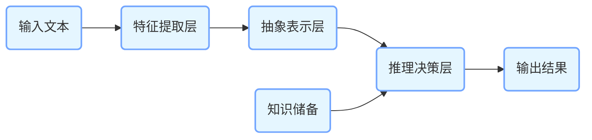

# 大规模语言模型的抽象思维与创新推理能力

> 关键词：大规模语言模型、抽象思维、创新推理能力、自然语言处理、深度学习

> 摘要：本文深入探讨了大规模语言模型的抽象思维与创新推理能力。首先介绍了研究的背景、目的、预期读者和文档结构，对相关术语进行了详细解释。接着阐述了核心概念，包括抽象思维和创新推理能力的原理及架构，并给出了相应的示意图和流程图。在核心算法原理部分，使用Python代码详细阐述。同时，引入数学模型和公式进行详细讲解与举例说明。通过项目实战，展示了代码的实际案例和详细解释。分析了大规模语言模型在多个领域的实际应用场景，推荐了学习资源、开发工具框架和相关论文著作。最后总结了未来发展趋势与挑战，提供了常见问题解答和扩展阅读参考资料，旨在全面深入地剖析大规模语言模型在抽象思维与创新推理方面的特性与应用。

## 1. 背景介绍 
### 1.1 目的和范围
近年来，大规模语言模型取得了巨大的进展，在自然语言处理的多个任务中展现出了强大的能力。本研究的目的在于深入探讨大规模语言模型的抽象思维与创新推理能力，明确其在不同场景下的表现、作用机制以及潜在的应用价值。研究范围涵盖了大规模语言模型的基本原理、核心算法、数学模型，以及在实际项目中的应用案例和未来发展趋势等方面。

### 1.2 预期读者
本文预期读者包括从事自然语言处理、人工智能相关领域的研究人员、开发者，对大规模语言模型感兴趣的技术爱好者，以及希望将大规模语言模型应用于实际业务的企业决策者和技术人员。

### 1.3 文档结构概述
本文首先介绍了研究的背景信息，包括目的、预期读者和文档结构。接着详细阐述了大规模语言模型抽象思维与创新推理能力的核心概念及其相互联系，并给出了相应的示意图和流程图。然后深入讲解了核心算法原理和具体操作步骤，同时引入数学模型和公式进行理论支持。通过项目实战部分，展示了代码的实际实现和详细解读。分析了大规模语言模型在不同领域的实际应用场景，推荐了相关的学习资源、开发工具框架和论文著作。最后总结了未来发展趋势与挑战，提供了常见问题解答和扩展阅读参考资料。

### 1.4 术语表
#### 1.4.1 核心术语定义
- **大规模语言模型**：是一种基于深度学习技术，通过在大规模文本数据上进行训练的语言模型，具有强大的语言理解和生成能力。例如，GPT - 3、BERT等。
- **抽象思维**：指大规模语言模型能够从具体的文本数据中提取出一般性的概念、模式和规律，进行高层次的语义理解和概括。
- **创新推理能力**：表示模型在已有知识的基础上，能够进行新颖的、有价值的推理和判断，生成具有创造性的文本内容。

#### 1.4.2 相关概念解释
- **自然语言处理**：是计算机科学与人工智能领域中的一个重要方向，旨在让计算机能够理解、处理和生成人类语言。大规模语言模型是自然语言处理的重要工具之一。
- **深度学习**：是一种基于人工神经网络的机器学习方法，通过构建多层神经网络来学习数据的特征和模式。大规模语言模型通常采用深度学习技术进行训练。

#### 1.4.3 缩略词列表
- **NLP**：Natural Language Processing，自然语言处理
- **GPT**：Generative Pretrained Transformer，生成式预训练变换器
- **BERT**：Bidirectional Encoder Representations from Transformers，基于变换器的双向编码器表示

## 2. 核心概念与联系 
### 抽象思维原理
大规模语言模型的抽象思维是基于其对大量文本数据的学习和理解。在训练过程中，模型通过神经网络的多层结构，对输入的文本进行逐步的特征提取和转换。从最底层的字符级特征开始，逐渐向上抽象到词级、短语级和句子级的语义特征。例如，对于文本“苹果是一种水果，富含维生素C”，模型不仅能够识别出“苹果”“水果”“维生素C”等具体的词汇，还能抽象出“苹果属于水果类别”以及“水果具有富含营养成分”这样的一般性概念。

### 创新推理能力原理
创新推理能力依赖于模型的知识储备和推理机制。模型在学习了大量的文本数据后，掌握了丰富的知识和语言模式。当面临一个具体的问题或任务时，模型能够根据已有的知识进行推理和联想。例如，在给定“鸟会飞，麻雀是鸟”这样的信息后，模型能够推理出“麻雀会飞”。同时，模型还可以在推理过程中引入新的视角和思路，生成具有创新性的结论。

### 抽象思维与创新推理能力的联系
抽象思维是创新推理能力的基础。只有通过抽象思维，模型才能从具体的文本中提取出一般性的知识和模式，为创新推理提供必要的素材。而创新推理能力则是抽象思维的进一步拓展和应用，通过对抽象知识的灵活运用和组合，模型能够生成新颖的、有价值的推理结果。

### 架构示意图

该流程图展示了大规模语言模型从输入文本到输出结果的处理过程。首先，输入文本经过特征提取层，提取出底层的文本特征。然后，这些特征在抽象表示层被转换为高层次的抽象语义表示。推理决策层结合抽象表示和知识储备进行推理和决策，最终生成输出结果。

## 3. 核心算法原理 & 具体操作步骤 
### 核心算法原理
大规模语言模型通常基于Transformer架构，其核心是多头自注意力机制（Multi - Head Self - Attention）。多头自注意力机制允许模型在处理输入序列时，同时关注不同位置的信息，从而捕捉到序列中的长距离依赖关系。

以下是多头自注意力机制的Python代码实现：
```python
import torch
import torch.nn as nn

class MultiHeadSelfAttention(nn.Module):
    def __init__(self, embed_size, num_heads):
        super(MultiHeadSelfAttention, self).__init__()
        self.embed_size = embed_size
        self.num_heads = num_heads
        self.head_dim = embed_size // num_heads

        assert (
            self.head_dim * num_heads == embed_size
        ), "Embedding size needs to be divisible by number of heads"

        self.values = nn.Linear(self.head_dim, self.head_dim, bias=False)
        self.keys = nn.Linear(self.head_dim, self.head_dim, bias=False)
        self.queries = nn.Linear(self.head_dim, self.head_dim, bias=False)
        self.fc_out = nn.Linear(num_heads * self.head_dim, embed_size)

    def forward(self, values, keys, query, mask):
        N = query.shape[0]
        value_len, key_len, query_len = values.shape[1], keys.shape[1], query.shape[1]

        # Split the embedding into self.num_heads different pieces
        values = values.reshape(N, value_len, self.num_heads, self.head_dim)
        keys = keys.reshape(N, key_len, self.num_heads, self.head_dim)
        queries = query.reshape(N, query_len, self.num_heads, self.head_dim)

        values = self.values(values)
        keys = self.keys(keys)
        queries = self.queries(queries)

        # Scaled dot-product attention
        energy = torch.einsum("nqhd,nkhd->nhqk", [queries, keys])
        if mask is not None:
            energy = energy.masked_fill(mask == 0, float("-1e20"))

        attention = torch.softmax(energy / (self.embed_size ** (1 / 2)), dim=3)

        out = torch.einsum("nhql,nlhd->nqhd", [attention, values]).reshape(
            N, query_len, self.num_heads * self.head_dim
        )

        out = self.fc_out(out)
        return out


```
### 具体操作步骤
1. **数据预处理**：将输入的文本数据进行分词、编码等处理，转换为模型可以接受的数值表示。
2. **模型初始化**：初始化Transformer模型的参数，包括多头自注意力层、前馈神经网络层等。
3. **前向传播**：将预处理后的数据输入到模型中，依次经过多头自注意力层和前馈神经网络层，得到模型的输出。
4. **损失计算**：根据模型的输出和真实标签，计算损失函数，常用的损失函数包括交叉熵损失等。
5. **反向传播和参数更新**：使用优化算法（如Adam）进行反向传播，更新模型的参数，以最小化损失函数。
6. **重复训练**：重复步骤3 - 5，直到模型收敛或达到预设的训练轮数。

## 4. 数学模型和公式 & 详细讲解 & 举例说明 
### 多头自注意力机制的数学模型
多头自注意力机制的核心是计算注意力分数，其数学公式如下：

$$
\text{Attention}(Q, K, V) = \text{softmax}\left(\frac{QK^T}{\sqrt{d_k}}\right)V
$$

其中，$Q$ 是查询矩阵，$K$ 是键矩阵，$V$ 是值矩阵，$d_k$ 是键向量的维度。

### 详细讲解
- **查询、键和值矩阵**：在多头自注意力机制中，输入序列会被线性变换为查询、键和值矩阵。查询矩阵表示当前位置需要关注的信息，键矩阵表示其他位置的信息特征，值矩阵表示其他位置的实际内容。
- **注意力分数计算**：通过计算查询矩阵和键矩阵的点积，得到注意力分数。为了避免点积结果过大，需要除以 $\sqrt{d_k}$ 进行缩放。
- **注意力分布**：使用softmax函数将注意力分数转换为注意力分布，使得每个位置的注意力权重之和为1。
- **加权求和**：将注意力分布与值矩阵相乘，得到最终的输出。

### 举例说明
假设输入序列为 $x = [x_1, x_2, x_3]$，嵌入维度为 $d = 6$，头数为 $h = 2$，则头维度为 $d_k = d/h = 3$。

查询矩阵 $Q$、键矩阵 $K$ 和值矩阵 $V$ 的计算如下：

$$
Q = \begin{bmatrix}
q_1 \\
q_2 \\
q_3
\end{bmatrix},
K = \begin{bmatrix}
k_1 \\
k_2 \\
k_3
\end{bmatrix},
V = \begin{bmatrix}
v_1 \\
v_2 \\
v_3
\end{bmatrix}
$$

其中，$q_i, k_i, v_i \in \mathbb{R}^{3}$。

注意力分数计算：

$$
\text{Energy} = \frac{QK^T}{\sqrt{d_k}} = \begin{bmatrix}
\text{score}_{11} & \text{score}_{12} & \text{score}_{13} \\
\text{score}_{21} & \text{score}_{22} & \text{score}_{23} \\
\text{score}_{31} & \text{score}_{32} & \text{score}_{33}
\end{bmatrix}
$$

注意力分布：

$$
\text{Attention} = \text{softmax}(\text{Energy}) = \begin{bmatrix}
\text{attn}_{11} & \text{attn}_{12} & \text{attn}_{13} \\
\text{attn}_{21} & \text{attn}_{22} & \text{attn}_{23} \\
\text{attn}_{31} & \text{attn}_{32} & \text{attn}_{33}
\end{bmatrix}
$$

最终输出：

$$
\text{Output} = \text{Attention}V = \begin{bmatrix}
\text{out}_1 \\
\text{out}_2 \\
\text{out}_3
\end{bmatrix}
$$

## 5. 项目实战：代码实际案例和详细解释说明 
### 5.1  开发环境搭建
- **操作系统**：推荐使用Linux系统，如Ubuntu 18.04及以上版本。
- **Python环境**：使用Python 3.7及以上版本。
- **深度学习框架**：使用PyTorch 1.7及以上版本。可以使用以下命令安装：
```bash
pip install torch torchvision
```
- **其他依赖库**：安装`transformers`库，用于加载预训练的大规模语言模型。
```bash
pip install transformers
```

### 5.2  源代码详细实现和代码解读
以下是一个使用`transformers`库进行文本生成的示例代码：
```python
from transformers import GPT2LMHeadModel, GPT2Tokenizer

# 加载预训练的模型和分词器
tokenizer = GPT2Tokenizer.from_pretrained("gpt2")
model = GPT2LMHeadModel.from_pretrained("gpt2")

# 输入文本
input_text = "Once upon a time"

# 对输入文本进行编码
input_ids = tokenizer.encode(input_text, return_tensors="pt")

# 生成文本
output = model.generate(input_ids, max_length=100, num_beams=5, no_repeat_ngram_size=2, early_stopping=True)

# 解码生成的文本
generated_text = tokenizer.decode(output[0], skip_special_tokens=True)

print(generated_text)


```
### 代码解读与分析
1. **加载预训练的模型和分词器**：使用`GPT2Tokenizer.from_pretrained("gpt2")`加载GPT - 2的分词器，使用`GPT2LMHeadModel.from_pretrained("gpt2")`加载GPT - 2的语言模型。
2. **输入文本编码**：使用分词器将输入文本编码为模型可以接受的输入ID。
3. **文本生成**：使用`model.generate()`方法生成文本。`max_length`参数指定生成文本的最大长度，`num_beams`参数指定束搜索的束数，`no_repeat_ngram_size`参数用于避免生成重复的n - gram，`early_stopping`参数表示在生成结束后停止搜索。
4. **解码生成的文本**：使用分词器将生成的ID序列解码为文本。

## 6. 实际应用场景 
### 内容创作
大规模语言模型可以用于文学创作、新闻写作等领域。例如，作家可以利用模型提供的创意和灵感，快速生成文章的初稿。模型能够根据给定的主题和风格，生成具有一定逻辑性和连贯性的文本内容。

### 智能客服
在智能客服系统中，大规模语言模型可以理解用户的问题，并提供准确、详细的回答。通过学习大量的客服对话数据，模型能够处理各种类型的问题，提高客服效率和用户满意度。

### 机器翻译
大规模语言模型在机器翻译领域也有广泛的应用。模型可以学习不同语言之间的语法和语义关系，实现高质量的翻译。与传统的翻译方法相比，基于大规模语言模型的翻译系统能够更好地处理长句子和复杂的语义。

### 教育领域
在教育领域，大规模语言模型可以作为智能辅导工具，为学生提供个性化的学习建议和解答问题。例如，模型可以根据学生的学习情况和问题，生成针对性的学习资料和解释。

## 7. 工具和资源推荐
### 7.1 学习资源推荐
#### 7.1.1 书籍推荐
- 《深度学习》（Deep Learning）：由Ian Goodfellow、Yoshua Bengio和Aaron Courville合著，是深度学习领域的经典教材，详细介绍了深度学习的基本原理和算法。
- 《自然语言处理入门》（Natural Language Processing with Python）：由Steven Bird、Ewan Klein和Edward Loper合著，提供了使用Python进行自然语言处理的详细教程和实例。

#### 7.1.2 在线课程
- Coursera上的“深度学习专项课程”（Deep Learning Specialization）：由Andrew Ng教授主讲，涵盖了深度学习的各个方面，包括神经网络、卷积神经网络、循环神经网络等。
- edX上的“自然语言处理基础”（Foundations of Natural Language Processing）：介绍了自然语言处理的基本概念、算法和应用。

#### 7.1.3 技术博客和网站
- Hugging Face博客：提供了关于大规模语言模型和自然语言处理的最新研究成果和技术文章。
- Medium上的AI相关专栏：有许多专业人士分享关于人工智能和自然语言处理的经验和见解。

### 7.2 开发工具框架推荐
#### 7.2.1 IDE和编辑器
- PyCharm：是一款专业的Python集成开发环境，提供了丰富的代码编辑、调试和版本控制功能。
- Jupyter Notebook：是一个交互式的开发环境，适合进行数据分析和模型实验。

#### 7.2.2 调试和性能分析工具
- TensorBoard：是TensorFlow提供的可视化工具，可以用于监控模型的训练过程和性能指标。
- PyTorch Profiler：可以帮助开发者分析模型的性能瓶颈，优化代码的执行效率。

#### 7.2.3 相关框架和库
- Transformers：Hugging Face开发的用于自然语言处理的库，提供了大量预训练的语言模型和工具。
- AllenNLP：是一个用于自然语言处理的深度学习框架，提供了丰富的模型和工具，方便开发者进行实验和开发。

### 7.3 相关论文著作推荐
#### 7.3.1 经典论文
- 《Attention Is All You Need》：提出了Transformer架构，是大规模语言模型的基础。
- 《BERT: Pre - training of Deep Bidirectional Transformers for Language Understanding》：介绍了BERT模型，开创了基于预训练的自然语言处理方法。

#### 7.3.2 最新研究成果
- 《GPT - 3: Language Models are Few - Shot Learners》：介绍了GPT - 3模型，展示了大规模语言模型在少样本学习方面的强大能力。
- 《XLNet: Generalized Autoregressive Pretraining for Language Understanding》：提出了XLNet模型，改进了BERT模型的一些局限性。

#### 7.3.3 应用案例分析
- 《Using Large - Scale Language Models for Conversational AI》：分析了大规模语言模型在对话式AI中的应用案例和技术挑战。
- 《Language Models for Machine Translation: A Survey》：对大规模语言模型在机器翻译领域的应用进行了综述和分析。

## 8. 总结：未来发展趋势与挑战
### 未来发展趋势
- **更大规模的模型**：随着计算资源的不断增加，未来的大规模语言模型将变得更加庞大，能够学习到更丰富的知识和模式。
- **多模态融合**：将语言模型与图像、音频等其他模态的信息进行融合，实现更加全面和智能的理解和生成。
- **个性化和定制化**：根据用户的需求和偏好，为用户提供个性化的语言服务和解决方案。

### 挑战
- **计算资源需求**：大规模语言模型的训练和推理需要大量的计算资源，如何降低计算成本是一个亟待解决的问题。
- **数据质量和隐私**：模型的性能依赖于高质量的数据，但数据的收集和使用也面临着隐私和安全的挑战。
- **可解释性和可靠性**：大规模语言模型的决策过程往往是黑盒的，如何提高模型的可解释性和可靠性是当前研究的热点。

## 9. 附录：常见问题与解答
### 大规模语言模型的训练时间通常需要多久？
大规模语言模型的训练时间取决于多个因素，包括模型的大小、训练数据的规模、计算资源的配置等。一般来说，训练一个大型的语言模型可能需要数周甚至数月的时间。

### 如何评估大规模语言模型的抽象思维和创新推理能力？
可以使用一些自然语言处理任务，如文本摘要、问答系统、文本生成等，来评估模型的抽象思维和创新推理能力。同时，也可以设计一些专门的测试集和评估指标，从不同的角度评估模型的性能。

### 大规模语言模型在实际应用中可能会遇到哪些问题？
在实际应用中，大规模语言模型可能会遇到生成内容不准确、存在偏见、计算资源消耗大等问题。需要对模型进行优化和调整，以提高其性能和可靠性。

## 10. 扩展阅读 & 参考资料
- 《The Art of Language Modeling》
- 《Advanced Natural Language Processing Techniques》
- Hugging Face官方文档：https://huggingface.co/docs
- OpenAI官方网站：https://openai.com/

作者：AI天才研究院/AI Genius Institute & 禅与计算机程序设计艺术 /Zen And The Art of Computer Programming