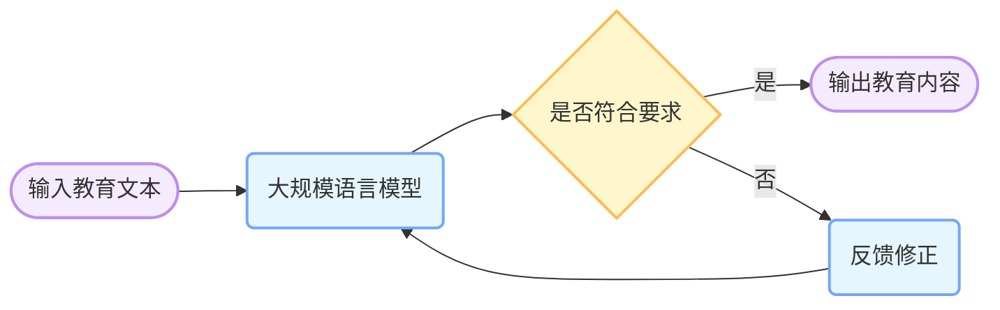

# 大规模语言模型的抽象概念泛化在教育内容生成中的应用

> 关键词：大规模语言模型、抽象概念泛化、教育内容生成、自然语言处理、人工智能教育

> 摘要：本文深入探讨了大规模语言模型的抽象概念泛化在教育内容生成中的应用。首先介绍了相关的背景知识，包括研究目的、预期读者等。接着阐述了核心概念与联系，通过文本示意图和 Mermaid 流程图清晰展示其原理和架构。详细讲解了核心算法原理，并给出 Python 源代码示例。同时，分析了相关的数学模型和公式，并举例说明。在项目实战部分，给出了开发环境搭建、源代码实现及解读。探讨了实际应用场景，推荐了相关的工具和资源。最后总结了未来发展趋势与挑战，还提供了常见问题解答和扩展阅读参考资料，旨在全面呈现大规模语言模型的抽象概念泛化在教育内容生成领域的重要作用和应用前景。

## 1. 背景介绍 
### 1.1 目的和范围
随着人工智能技术的飞速发展，大规模语言模型如 GPT 系列、BERT 等取得了显著的成果。这些模型在自然语言处理的各个领域展现出强大的能力。本研究的目的在于深入探究大规模语言模型的抽象概念泛化能力，并将其应用于教育内容生成中。范围涵盖了从基础的概念理论研究到实际的教育内容生成项目实践，涉及多种教育场景，如课程材料编写、学习资源生成、智能辅导等。

### 1.2 预期读者
本文预期读者包括教育技术领域的研究人员、教育工作者、人工智能开发者、对教育与人工智能融合感兴趣的学者以及相关专业的学生。这些读者可以从不同角度获取有价值的信息，研究人员可以借鉴研究思路和方法，教育工作者可以了解如何将先进技术应用于教学实践，开发者可以获取技术实现的细节，学生则可以拓展专业知识和视野。

### 1.3 文档结构概述
本文首先介绍背景知识，为后续内容奠定基础。接着阐述核心概念与联系，让读者对大规模语言模型的抽象概念泛化有清晰的认识。然后详细讲解核心算法原理和具体操作步骤，并给出相应的 Python 代码。再介绍相关的数学模型和公式，并举例说明其应用。通过项目实战展示如何将理论应用于实际，包括开发环境搭建、源代码实现和代码解读。探讨实际应用场景，让读者了解该技术在教育中的具体用途。推荐相关的工具和资源，帮助读者进一步深入学习和研究。最后总结未来发展趋势与挑战，提供常见问题解答和扩展阅读参考资料。

### 1.4 术语表
#### 1.4.1 核心术语定义
- **大规模语言模型**：是指基于大量文本数据进行训练的语言模型，通常具有数十亿甚至数万亿的参数，能够学习到丰富的语言模式和语义信息，如 GPT - 3、BLOOM 等。
- **抽象概念泛化**：指语言模型能够从具体的文本实例中提取出抽象的概念，并将这些概念应用到不同的情境中，从而实现对新知识的理解和生成。
- **教育内容生成**：利用技术手段自动或辅助生成与教育相关的内容，如教材、课件、练习题、教学案例等。

#### 1.4.2 相关概念解释
- **自然语言处理（NLP）**：是人工智能的一个重要领域，致力于让计算机理解、处理和生成人类语言。大规模语言模型是自然语言处理中的一种重要技术手段。
- **知识表示**：将知识以计算机能够理解和处理的形式进行表示，以便语言模型能够更好地学习和利用知识。在抽象概念泛化中，知识表示起着关键作用。

#### 1.4.3 缩略词列表
- **NLP**：Natural Language Processing（自然语言处理）
- **GPT**：Generative Pretrained Transformer（生成式预训练变换器）
- **BERT**：Bidirectional Encoder Representations from Transformers（基于变换器的双向编码器表示）

## 2. 核心概念与联系 

### 核心概念原理
大规模语言模型的抽象概念泛化基于深度学习的神经网络架构，如 Transformer 架构。Transformer 架构通过自注意力机制能够捕捉文本中不同位置之间的依赖关系，从而学习到丰富的语言特征。在训练过程中，模型会接触到大量的文本数据，这些数据包含了各种具体的实例和情境。通过对这些数据的学习，模型逐渐提取出抽象的概念，例如语法规则、语义关系、逻辑结构等。

当面对新的输入时，模型能够利用这些抽象概念进行推理和生成。例如，在教育内容生成中，如果输入是关于某个学科的基本概念描述，模型可以根据抽象概念泛化能力，生成相关的详细解释、示例、拓展内容等。

### 架构的文本示意图
大规模语言模型的抽象概念泛化在教育内容生成中的架构可以描述如下：

输入层接收教育相关的文本输入，如学科知识点、学习目标等。中间的模型层是经过预训练的大规模语言模型，它利用自身的抽象概念泛化能力对输入进行处理。输出层则生成与教育内容相关的结果，如课程大纲、教学讲解、练习题等。在这个过程中，可能还会有反馈机制，将生成的内容进行评估和修正，以提高教育内容的质量。

### Mermaid 流程图


## 3. 核心算法原理 & 具体操作步骤 

### 核心算法原理
大规模语言模型的核心算法通常基于 Transformer 架构。Transformer 由编码器和解码器组成（在不同的模型中可能有不同的侧重，如 GPT 系列主要使用解码器，BERT 主要使用编码器）。

自注意力机制是 Transformer 的关键部分，它允许模型在处理每个位置的输入时，考虑到输入序列中的所有其他位置。对于输入序列 $\mathbf{x} = [x_1, x_2, \cdots, x_n]$，自注意力机制计算每个位置的表示 $\mathbf{h}_i$ 如下：

首先，将输入 $\mathbf{x}$ 分别映射到查询（Query）、键（Key）和值（Value）向量：
$$
\mathbf{Q} = \mathbf{X} \mathbf{W}^Q \\
\mathbf{K} = \mathbf{X} \mathbf{W}^K \\
\mathbf{V} = \mathbf{X} \mathbf{W}^V
$$
其中 $\mathbf{X}$ 是输入矩阵，$\mathbf{W}^Q$、$\mathbf{W}^K$、$\mathbf{W}^V$ 是可学习的权重矩阵。

然后，计算注意力分数：
$$
\mathbf{A} = \text{softmax}\left(\frac{\mathbf{Q} \mathbf{K}^T}{\sqrt{d_k}}\right)
$$
其中 $d_k$ 是键向量的维度。

最后，计算输出：
$$
\mathbf{H} = \mathbf{A} \mathbf{V}
$$

在大规模语言模型的训练过程中，使用了无监督学习的方法，如语言建模任务。通过预测下一个词或掩码词来学习语言的模式和语义信息。

### 具体操作步骤及 Python 源代码
以下是一个使用 Hugging Face 的 Transformers 库实现简单文本生成的 Python 示例：

```python
from transformers import AutoTokenizer, AutoModelForCausalLM

# 加载预训练的模型和分词器
model_name = "gpt2"
tokenizer = AutoTokenizer.from_pretrained(model_name)
model = AutoModelForCausalLM.from_pretrained(model_name)

# 输入文本
input_text = "在数学中，函数的概念是"

# 对输入文本进行编码
input_ids = tokenizer.encode(input_text, return_tensors='pt')

# 生成文本
output = model.generate(input_ids, max_length=100, num_return_sequences=1)

# 解码生成的文本
generated_text = tokenizer.decode(output[0], skip_special_tokens=True)

print(generated_text)
```

在这个示例中，首先加载了预训练的 GPT - 2 模型和对应的分词器。然后对输入文本进行编码，将其转换为模型可以处理的输入格式。接着使用 `generate` 方法生成文本，设置了最大长度和返回序列的数量。最后将生成的文本解码并打印输出。

## 4. 数学模型和公式 & 详细讲解 & 举例说明 

### 数学模型和公式
#### 语言建模损失函数
在大规模语言模型的训练中，常用的损失函数是交叉熵损失函数。对于一个序列 $\mathbf{x} = [x_1, x_2, \cdots, x_n]$，模型的目标是预测每个位置的下一个词。设 $p(y_i | x_1, \cdots, x_i)$ 是模型预测第 $i$ 个位置的下一个词 $y_i$ 的概率分布，真实的下一个词为 $\hat{y}_i$，则交叉熵损失函数定义为：
$$
L = -\sum_{i = 1}^{n - 1} \log p(\hat{y}_i | x_1, \cdots, x_i)
$$

#### 多头注意力机制
多头注意力机制是自注意力机制的扩展，它通过多个不同的注意力头来捕捉不同方面的信息。设头的数量为 $h$，每个头的维度为 $d_{head}$，则多头注意力的输出计算如下：

对于每个头 $j$：
$$
\mathbf{Q}_j = \mathbf{X} \mathbf{W}_j^Q \\
\mathbf{K}_j = \mathbf{X} \mathbf{W}_j^K \\
\mathbf{V}_j = \mathbf{X} \mathbf{W}_j^V
$$
$$
\mathbf{A}_j = \text{softmax}\left(\frac{\mathbf{Q}_j \mathbf{K}_j^T}{\sqrt{d_{head}}}\right)
$$
$$
\mathbf{H}_j = \mathbf{A}_j \mathbf{V}_j
$$

然后将所有头的输出拼接起来并通过一个线性变换：
$$
\mathbf{H} = \text{concat}(\mathbf{H}_1, \cdots, \mathbf{H}_h) \mathbf{W}^O
$$
其中 $\mathbf{W}^O$ 是可学习的权重矩阵。

### 详细讲解
交叉熵损失函数的作用是衡量模型预测的概率分布与真实分布之间的差异。在训练过程中，模型的目标是最小化这个损失函数，从而使得模型的预测结果尽可能接近真实情况。

多头注意力机制通过多个注意力头，每个头关注输入序列的不同方面，能够捕捉到更丰富的信息。例如，一个头可能更关注语法信息，另一个头可能更关注语义信息。最后将所有头的输出拼接起来并进行线性变换，得到最终的输出表示。

### 举例说明
假设我们有一个简单的输入序列 "The cat is on the mat"。在自注意力机制中，当模型处理 "cat" 这个词时，它会计算 "cat" 与序列中其他词（如 "The"、"is" 等）的注意力分数，以确定它们之间的关系。

在多头注意力机制中，不同的头可能会有不同的关注重点。一个头可能会更关注 "cat" 与 "The" 的语法关系（如主谓关系），另一个头可能会更关注 "cat" 与 "mat" 的语义关系（如位置关系）。通过多个头的组合，模型能够更全面地理解输入序列的信息。

## 5. 项目实战：代码实际案例和详细解释说明 

### 5.1  开发环境搭建
#### 操作系统
可以选择常见的操作系统，如 Windows、Linux（如 Ubuntu）或 macOS。

#### Python 环境
建议使用 Python 3.7 及以上版本。可以通过 Anaconda 或 Python 官方网站下载和安装 Python。

#### 安装依赖库
使用 `pip` 安装所需的库，主要是 Hugging Face 的 Transformers 库和 PyTorch：
```sh
pip install transformers torch
```

### 5.2  源代码详细实现和代码解读
以下是一个更完整的教育内容生成项目的代码示例，该示例根据输入的学科知识点生成相关的教学讲解：

```python
from transformers import AutoTokenizer, AutoModelForCausalLM

# 加载预训练的模型和分词器
model_name = "gpt2"
tokenizer = AutoTokenizer.from_pretrained(model_name)
model = AutoModelForCausalLM.from_pretrained(model_name)

def generate_education_content(topic, max_length=200, num_return_sequences=1):
    # 构建输入文本
    input_text = f"关于 {topic} 的教学讲解："

    # 对输入文本进行编码
    input_ids = tokenizer.encode(input_text, return_tensors='pt')

    # 生成文本
    output = model.generate(input_ids, max_length=max_length, num_return_sequences=num_return_sequences)

    # 解码生成的文本
    generated_text = []
    for out in output:
        text = tokenizer.decode(out, skip_special_tokens=True)
        generated_text.append(text)

    return generated_text

# 示例使用
topic = "牛顿第二定律"
content = generate_education_content(topic)
for text in content:
    print(text)
```

### 5.3  代码解读与分析
- **模型和分词器加载**：使用 `AutoTokenizer.from_pretrained` 和 `AutoModelForCausalLM.from_pretrained` 加载预训练的 GPT - 2 模型和对应的分词器。
- **`generate_education_content` 函数**：该函数接收一个学科知识点 `topic` 作为输入，构建输入文本，对其进行编码，然后使用模型的 `generate` 方法生成文本，最后将生成的文本解码并返回。
- **示例使用**：指定一个学科知识点 "牛顿第二定律"，调用 `generate_education_content` 函数生成相关的教学讲解，并打印输出。

需要注意的是，这个示例只是一个简单的演示，实际应用中可能需要对模型进行微调，以提高生成内容的质量和相关性。

## 6. 实际应用场景 
### 课程材料编写
大规模语言模型的抽象概念泛化可以帮助教育工作者快速生成课程大纲、教学课件等材料。例如，根据课程的主题和学习目标，模型可以生成详细的章节内容、知识点讲解、示例和练习等，大大提高了课程材料编写的效率。

### 学习资源生成
可以利用模型生成各种学习资源，如在线教程、学习指南、科普文章等。这些资源可以为学生提供更多的学习渠道和资料，帮助他们更好地理解和掌握知识。

### 智能辅导
在智能辅导系统中，模型可以根据学生的问题和学习情况，生成针对性的解释和指导。例如，当学生在学习数学遇到难题时，模型可以根据问题的类型和相关知识点，生成详细的解题思路和步骤，帮助学生解决问题。

### 个性化学习
通过分析学生的学习数据和偏好，模型可以生成个性化的学习计划和内容。例如，对于不同学习进度和能力的学生，提供适合他们的练习题、拓展内容等，实现个性化的学习体验。

## 7. 工具和资源推荐
### 7.1 学习资源推荐
#### 7.1.1 书籍推荐
- 《深度学习》（Deep Learning）：由 Ian Goodfellow、Yoshua Bengio 和 Aaron Courville 编写，是深度学习领域的经典教材，涵盖了神经网络、优化算法等基础知识。
- 《自然语言处理入门》：介绍了自然语言处理的基本概念、算法和技术，适合初学者学习。

#### 7.1.2 在线课程
- Coursera 上的 "Natural Language Processing Specialization"：由斯坦福大学的教授授课，系统地介绍了自然语言处理的各个方面。
- edX 上的 "Deep Learning Fundamentals"：帮助学习者掌握深度学习的基本原理和方法。

#### 7.1.3 技术博客和网站
- Hugging Face Blog：提供了关于大规模语言模型和自然语言处理的最新研究和技术分享。
- Medium 上的自然语言处理相关专栏：有很多从业者分享的经验和见解。

### 7.2 开发工具框架推荐
#### 7.2.1 IDE和编辑器
- PyCharm：功能强大的 Python 集成开发环境，提供代码编辑、调试、版本控制等功能。
- Visual Studio Code：轻量级的代码编辑器，支持多种编程语言，有丰富的插件扩展。

#### 7.2.2 调试和性能分析工具
- TensorBoard：用于可视化深度学习模型的训练过程和性能指标。
- Py-Spy：可以对 Python 代码进行性能分析，找出性能瓶颈。

#### 7.2.3 相关框架和库
- Hugging Face Transformers：提供了丰富的预训练语言模型和工具，方便进行自然语言处理任务的开发。
- PyTorch：深度学习框架，广泛应用于自然语言处理和其他领域的研究和开发。

### 7.3 相关论文著作推荐
#### 7.3.1 经典论文
- "Attention Is All You Need"：介绍了 Transformer 架构，是大规模语言模型的基础。
- "BERT: Pre-training of Deep Bidirectional Transformers for Language Understanding"：提出了 BERT 模型，在自然语言处理领域取得了很大的突破。

#### 7.3.2 最新研究成果
- 关注 arXiv 上关于大规模语言模型和自然语言处理的最新论文，了解该领域的前沿研究。

#### 7.3.3 应用案例分析
- 一些学术会议和期刊上会有关于大规模语言模型在教育等领域应用的案例分析，可以从中学习实际应用的经验和方法。

## 8. 总结：未来发展趋势与挑战
### 未来发展趋势
- **更强大的模型**：随着计算资源的不断提升和算法的改进，未来可能会出现更大规模、更强大的语言模型，其抽象概念泛化能力将进一步提高，能够生成更准确、更丰富的教育内容。
- **多模态融合**：将语言模型与图像、音频等多模态信息融合，实现更全面的教育内容生成。例如，在生成教学材料时，可以同时生成相关的图片、视频等，提高学习效果。
- **个性化教育的深化**：结合学生的学习数据和行为分析，实现更加个性化的教育内容生成，满足每个学生的独特需求。

### 挑战
- **数据质量和隐私问题**：大规模语言模型的训练需要大量的数据，数据的质量直接影响模型的性能。同时，教育数据涉及学生的隐私信息，如何在保证数据质量的同时保护隐私是一个重要的挑战。
- **伦理和道德问题**：语言模型生成的内容可能存在偏见、虚假信息等问题，在教育领域应用时需要确保内容的正确性和公正性。
- **模型的可解释性**：大规模语言模型通常是黑盒模型，其决策过程难以解释。在教育应用中，需要提高模型的可解释性，让教育工作者和学生能够理解模型生成内容的依据。

## 9. 附录：常见问题与解答
### 问题 1：大规模语言模型生成的教育内容是否准确可靠？
解答：大规模语言模型生成的内容有一定的准确性，但也可能存在错误或不准确的地方。模型的输出受到训练数据和模型本身的限制。在使用生成的教育内容时，需要教育工作者进行审核和验证，确保内容的准确性和可靠性。

### 问题 2：如何提高大规模语言模型在教育内容生成中的性能？
解答：可以通过以下方法提高性能：对模型进行微调，使用与教育领域相关的数据集进行训练；优化模型的超参数；结合其他技术，如知识图谱，提供更多的背景知识。

### 问题 3：大规模语言模型在教育内容生成中的应用是否会取代教育工作者？
解答：不会。虽然大规模语言模型可以辅助生成教育内容，但教育工作者的作用是不可替代的。教育工作者具有丰富的教学经验和专业知识，能够根据学生的实际情况进行个性化的教学和指导，而模型生成的内容只是一种辅助工具。

## 10. 扩展阅读 & 参考资料
- Goodfellow, I., Bengio, Y., & Courville, A. (2016). Deep Learning. MIT Press.
- Devlin, J., Chang, M. W., Lee, K., & Toutanova, K. (2018). BERT: Pre-training of Deep Bidirectional Transformers for Language Understanding. arXiv preprint arXiv:1810.04805.
- Vaswani, A., Shazeer, N., Parmar, N., Uszkoreit, J., Jones, L., Gomez, A. N., ... & Polosukhin, I. (2017). Attention Is All You Need. In Advances in neural information processing systems (pp. 5998-6008).
- Hugging Face官方文档：https://huggingface.co/docs

作者：AI天才研究院/AI Genius Institute & 禅与计算机程序设计艺术 /Zen And The Art of Computer Programming