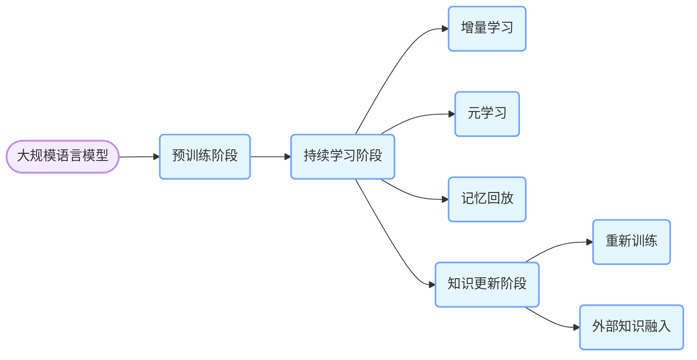

# 大规模语言模型的持续学习与知识更新

> 关键词：大规模语言模型、持续学习、知识更新、增量学习、数据处理

> 摘要：本文聚焦于大规模语言模型的持续学习与知识更新这一关键领域。首先介绍了该研究的背景、目的、预期读者等内容，接着阐述了核心概念及相互联系，详细讲解了核心算法原理和具体操作步骤，同时给出了相关数学模型和公式并举例说明。通过项目实战展示了代码实现和解读，分析了实际应用场景。还推荐了相关的学习资源、开发工具框架以及论文著作。最后对大规模语言模型持续学习与知识更新的未来发展趋势与挑战进行了总结，并提供了常见问题解答和扩展阅读参考资料，旨在为读者全面深入地理解该领域提供有价值的信息。

## 1. 背景介绍 
### 1.1 目的和范围
随着人工智能技术的飞速发展，大规模语言模型如GPT - 3、BERT等在自然语言处理的多个任务中展现出了卓越的性能。然而，这些模型面临着一个重要的挑战，即如何在不断变化的知识环境中进行持续学习和知识更新。本文章的目的在于深入探讨大规模语言模型持续学习与知识更新的原理、方法和应用，涵盖从基础概念到实际项目实战的各个方面，旨在为研究人员、开发者和相关从业者提供全面的技术指导和参考。

### 1.2 预期读者
本文的预期读者包括但不限于人工智能领域的研究人员、计算机科学专业的学生、自然语言处理开发者、软件工程师以及对大规模语言模型技术感兴趣的爱好者。对于希望深入了解大规模语言模型持续学习和知识更新机制，以及想要将相关技术应用到实际项目中的读者，本文将提供有价值的信息和指导。

### 1.3 文档结构概述
本文将按照以下结构展开：首先介绍相关的核心概念和它们之间的联系，通过文本示意图和Mermaid流程图进行清晰展示；接着详细讲解核心算法原理和具体操作步骤，并使用Python源代码进行阐述；然后给出数学模型和公式，结合实际例子进行详细讲解；通过项目实战部分，介绍开发环境搭建、源代码实现和代码解读；分析大规模语言模型持续学习与知识更新的实际应用场景；推荐相关的学习资源、开发工具框架和论文著作；最后总结未来发展趋势与挑战，提供常见问题解答和扩展阅读参考资料。

### 1.4 术语表
#### 1.4.1 核心术语定义
- **大规模语言模型（Large - Scale Language Model）**：指具有大量参数（通常数十亿甚至数万亿）的语言模型，通过在大规模文本数据上进行训练，能够学习到丰富的语言知识和模式，用于各种自然语言处理任务。
- **持续学习（Continuous Learning）**：也称为终身学习，是指模型能够在不断接收新数据的过程中持续学习新知识，同时保留之前学到的知识，避免灾难性遗忘。
- **知识更新（Knowledge Update）**：指对模型中已有的知识进行更新和扩展，以适应不断变化的现实世界知识和信息。
- **灾难性遗忘（Catastrophic Forgetting）**：当模型在学习新任务时，会快速忘记之前学习过的任务的知识，导致在旧任务上的性能急剧下降。
- **增量学习（Incremental Learning）**：一种持续学习的方法，模型在已有知识的基础上，逐步学习新的数据和知识，而不需要重新训练整个模型。

#### 1.4.2 相关概念解释
- **数据流（Data Stream）**：在持续学习场景中，数据以流的形式不断到达模型，模型需要实时或近实时地处理这些数据并进行学习。
- **元学习（Meta - Learning）**：也称为学习如何学习，是一种让模型能够快速适应新任务的学习方法，通过学习多个任务的共性，提高模型的泛化能力和学习效率。
- **记忆回放（Memory Replay）**：为了缓解灾难性遗忘，在学习新数据时，从之前的数据中随机抽取一部分进行回放，让模型同时学习新数据和旧数据。

#### 1.4.3 缩略词列表
- **NLP**：Natural Language Processing，自然语言处理
- **GPT**：Generative Pretrained Transformer，生成式预训练变换器
- **BERT**：Bidirectional Encoder Representations from Transformers，基于变换器的双向编码器表示

## 2. 核心概念与联系 
### 核心概念原理
#### 大规模语言模型
大规模语言模型通常基于深度学习架构，如Transformer。Transformer架构通过自注意力机制（Self - Attention Mechanism）能够高效地处理序列数据，捕捉长距离依赖关系。在预训练阶段，模型在大规模无监督文本数据上进行训练，学习语言的通用表示和模式。例如，GPT系列模型采用自回归的方式进行预训练，通过预测下一个词来学习语言知识；BERT模型则采用掩码语言模型（Masked Language Model）和下一句预测（Next Sentence Prediction）任务进行预训练。

#### 持续学习
持续学习的核心目标是让模型在不断接收新数据的过程中持续学习新知识，同时避免灾难性遗忘。为了实现这一目标，需要采用一些特殊的方法，如增量学习、元学习、记忆回放等。增量学习通过逐步更新模型的参数，让模型在已有知识的基础上学习新数据；元学习通过学习多个任务的共性，提高模型快速适应新任务的能力；记忆回放通过在学习新数据时回放旧数据，帮助模型保留旧知识。

#### 知识更新
知识更新是指对模型中已有的知识进行更新和扩展。随着时间的推移，现实世界的知识和信息不断变化，模型需要及时更新以保持准确性和实用性。知识更新可以通过重新训练模型、增量学习或使用外部知识源等方式实现。例如，可以定期收集新的数据，对模型进行微调；或者将外部知识库中的知识融入到模型中。

### 架构的文本示意图
```plaintext
大规模语言模型
|
|-- 预训练阶段：在大规模无监督文本数据上学习通用语言知识
|
|-- 持续学习阶段
|   |
|   |-- 增量学习：逐步更新模型参数学习新数据
|   |
|   |-- 元学习：学习多个任务共性提高适应新任务能力
|   |
|   |-- 记忆回放：学习新数据时回放旧数据避免遗忘
|
|-- 知识更新阶段
|   |
|   |-- 重新训练：定期用新数据微调模型
|   |
|   |-- 外部知识融入：将外部知识库知识融入模型
```

### Mermaid流程图


## 3. 核心算法原理 & 具体操作步骤 
### 增量学习算法原理
增量学习的核心思想是在已有模型的基础上，逐步学习新的数据，而不需要重新训练整个模型。常见的增量学习方法有基于梯度的方法和基于参数冻结的方法。

#### 基于梯度的增量学习
基于梯度的增量学习通过计算新数据的梯度，然后更新模型的参数。假设已有模型的参数为 $\theta$，新数据的损失函数为 $L(\theta; D_{new})$，则可以使用随机梯度下降（SGD）或其变种（如Adam）来更新参数：

```python
import torch
import torch.optim as optim

# 假设model是已有的大规模语言模型
model =...
# 定义优化器
optimizer = optim.Adam(model.parameters(), lr=0.001)

# 新数据的数据集
new_data_loader =...

# 训练新数据
for epoch in range(num_epochs):
    for batch in new_data_loader:
        # 前向传播
        outputs = model(batch)
        # 计算损失
        loss =...  # 根据具体任务定义损失函数
        # 反向传播
        optimizer.zero_grad()
        loss.backward()
        # 更新参数
        optimizer.step()
```

#### 基于参数冻结的增量学习
基于参数冻结的增量学习方法是冻结模型的一部分参数，只更新与新任务相关的参数。例如，对于一个预训练的语言模型，可以冻结其底层的编码器参数，只更新顶层的分类器参数。

```python
# 冻结底层编码器参数
for param in model.encoder.parameters():
    param.requires_grad = False

# 定义优化器，只优化分类器参数
optimizer = optim.Adam(model.classifier.parameters(), lr=0.001)

# 训练新数据
for epoch in range(num_epochs):
    for batch in new_data_loader:
        # 前向传播
        outputs = model(batch)
        # 计算损失
        loss =...  # 根据具体任务定义损失函数
        # 反向传播
        optimizer.zero_grad()
        loss.backward()
        # 更新参数
        optimizer.step()
```

### 元学习算法原理
元学习的目标是让模型能够快速适应新任务。一种常见的元学习方法是模型无关元学习（Model - Agnostic Meta - Learning，MAML）。MAML的核心思想是通过在多个任务上进行训练，找到一个初始参数，使得模型在新任务上只需要进行少量的梯度更新就能取得较好的性能。

```python
import torch
import torch.nn as nn
import torch.optim as optim

# 定义模型
model =...

# 元优化器
meta_optimizer = optim.Adam(model.parameters(), lr=0.001)

# 多个任务的数据集
task_datasets =...

# 元训练
for meta_epoch in range(meta_num_epochs):
    meta_loss = 0
    for task_dataset in task_datasets:
        # 复制模型参数
        fast_weights = list(model.parameters())
        
        # 内循环，在当前任务上进行少量梯度更新
        inner_optimizer = optim.SGD(fast_weights, lr=0.01)
        inner_data_loader =...  # 当前任务的数据加载器
        for inner_epoch in range(inner_num_epochs):
            for batch in inner_data_loader:
                outputs = model.forward_with_weights(batch, fast_weights)
                loss =...  # 根据具体任务定义损失函数
                inner_optimizer.zero_grad()
                grads = torch.autograd.grad(loss, fast_weights)
                for i in range(len(fast_weights)):
                    fast_weights[i] = fast_weights[i] - 0.01 * grads[i]
        
        # 外循环，计算元损失
        outer_data_loader =...  # 当前任务的验证数据加载器
        for batch in outer_data_loader:
            outputs = model.forward_with_weights(batch, fast_weights)
            outer_loss =...  # 根据具体任务定义损失函数
            meta_loss += outer_loss
    
    # 更新元参数
    meta_optimizer.zero_grad()
    meta_loss.backward()
    meta_optimizer.step()
```

### 记忆回放算法原理
记忆回放的目的是缓解灾难性遗忘。在学习新数据时，从之前的数据中随机抽取一部分进行回放，让模型同时学习新数据和旧数据。

```python
# 旧数据的数据集
old_data_loader =...

# 新数据的数据集
new_data_loader =...

# 训练新数据和旧数据
for epoch in range(num_epochs):
    for (old_batch, new_batch) in zip(old_data_loader, new_data_loader):
        # 前向传播旧数据
        old_outputs = model(old_batch)
        old_loss =...  # 根据具体任务定义旧数据损失函数
        
        # 前向传播新数据
        new_outputs = model(new_batch)
        new_loss =...  # 根据具体任务定义新数据损失函数
        
        # 总损失
        total_loss = old_loss + new_loss
        
        # 反向传播
        optimizer.zero_grad()
        total_loss.backward()
        # 更新参数
        optimizer.step()
```

## 4. 数学模型和公式 & 详细讲解 & 举例说明 
### 基于梯度的增量学习数学模型
在基于梯度的增量学习中，假设已有模型的参数为 $\theta$，新数据的损失函数为 $L(\theta; D_{new})$，则参数更新公式为：

$$\theta_{t + 1}=\theta_{t}-\alpha\nabla_{\theta}L(\theta_{t}; D_{new})$$

其中，$\theta_{t}$ 是第 $t$ 次更新时的参数，$\alpha$ 是学习率，$\nabla_{\theta}L(\theta_{t}; D_{new})$ 是损失函数关于参数 $\theta$ 的梯度。

举例说明：假设我们有一个简单的线性回归模型 $y = wx + b$，已有参数 $w = 1$，$b = 0$，新数据为 $(x_1, y_1)=(2, 5)$，损失函数采用均方误差 $L(w,b; (x_1,y_1))=\frac{1}{2}(wx_1 + b - y_1)^2$。则梯度为：

$$\nabla_{w}L(w,b; (x_1,y_1))=(wx_1 + b - y_1)x_1=(1\times2 + 0 - 5)\times2=-6$$

$$\nabla_{b}L(w,b; (x_1,y_1))=(wx_1 + b - y_1)=(1\times2 + 0 - 5)=-3$$

假设学习率 $\alpha = 0.1$，则更新后的参数为：

$$w_{new}=w-\alpha\nabla_{w}L(w,b; (x_1,y_1))=1-0.1\times(-6)=1.6$$

$$b_{new}=b-\alpha\nabla_{b}L(w,b; (x_1,y_1))=0-0.1\times(-3)=0.3$$

### 模型无关元学习（MAML）数学模型
在MAML中，假设模型的参数为 $\theta$，在第 $i$ 个任务上的损失函数为 $L_i(\theta; D_i)$，其中 $D_i$ 是第 $i$ 个任务的数据集。首先在每个任务上进行少量的梯度更新：

$$\theta_{i}'=\theta-\alpha\nabla_{\theta}L_i(\theta; D_{i}^{tr})$$

其中，$D_{i}^{tr}$ 是第 $i$ 个任务的训练数据集，$\alpha$ 是内循环学习率。然后计算元损失：

$$\mathcal{L}_{meta}(\theta)=\sum_{i = 1}^{N}L_i(\theta_{i}'; D_{i}^{val})$$

其中，$D_{i}^{val}$ 是第 $i$ 个任务的验证数据集，$N$ 是任务的数量。最后更新元参数：

$$\theta_{new}=\theta-\beta\nabla_{\theta}\mathcal{L}_{meta}(\theta)$$

其中，$\beta$ 是外循环学习率。

举例说明：假设有两个任务，模型的初始参数 $\theta = [1, 1]$，内循环学习率 $\alpha = 0.1$，外循环学习率 $\beta = 0.01$。在第一个任务上，训练数据的损失函数 $L_1(\theta; D_{1}^{tr})=\theta_1^2+\theta_2^2$，验证数据的损失函数 $L_1(\theta; D_{1}^{val})=(\theta_1 + \theta_2)^2$；在第二个任务上，训练数据的损失函数 $L_2(\theta; D_{2}^{tr})=(\theta_1 - \theta_2)^2$，验证数据的损失函数 $L_2(\theta; D_{2}^{val})=\theta_1^2-\theta_2^2$。

首先在第一个任务上进行内循环更新：

$$\nabla_{\theta}L_1(\theta; D_{1}^{tr})=[2\theta_1, 2\theta_2]=[2, 2]$$

$$\theta_{1}'=\theta-\alpha\nabla_{\theta}L_1(\theta; D_{1}^{tr})=[1 - 0.1\times2, 1 - 0.1\times2]=[0.8, 0.8]$$

在第二个任务上进行内循环更新：

$$\nabla_{\theta}L_2(\theta; D_{2}^{tr})=[2(\theta_1 - \theta_2), - 2(\theta_1 - \theta_2)]=[0, 0]$$

$$\theta_{2}'=\theta-\alpha\nabla_{\theta}L_2(\theta; D_{2}^{tr})=[1, 1]$$

然后计算元损失：

$$\mathcal{L}_{meta}(\theta)=L_1(\theta_{1}'; D_{1}^{val})+L_2(\theta_{2}'; D_{2}^{val})=(0.8 + 0.8)^2+(1^2 - 1^2)=2.56$$

最后更新元参数：

$$\nabla_{\theta}\mathcal{L}_{meta}(\theta)=\cdots$$（计算过程较复杂，此处省略）

$$\theta_{new}=\theta-\beta\nabla_{\theta}\mathcal{L}_{meta}(\theta)$$

### 记忆回放数学模型
在记忆回放中，总损失函数为旧数据损失和新数据损失之和：

$$L_{total}(\theta)=L(\theta; D_{old})+L(\theta; D_{new})$$

其中，$L(\theta; D_{old})$ 是旧数据的损失函数，$L(\theta; D_{new})$ 是新数据的损失函数。参数更新公式为：

$$\theta_{t + 1}=\theta_{t}-\alpha\nabla_{\theta}L_{total}(\theta_{t})$$

举例说明：假设旧数据的损失函数 $L(\theta; D_{old})=\theta^2$，新数据的损失函数 $L(\theta; D_{new})=(\theta - 2)^2$，则总损失函数为：

$$L_{total}(\theta)=\theta^2+(\theta - 2)^2=2\theta^2 - 4\theta + 4$$

梯度为：

$$\nabla_{\theta}L_{total}(\theta)=4\theta - 4$$

假设初始参数 $\theta_0 = 1$，学习率 $\alpha = 0.1$，则更新后的参数为：

$$\theta_1=\theta_0-\alpha\nabla_{\theta}L_{total}(\theta_0)=1-0.1\times(4\times1 - 4)=1$$

## 5. 项目实战：代码实际案例和详细解释说明 
### 5.1  开发环境搭建
#### 安装Python和必要的库
首先需要安装Python 3.7及以上版本。可以使用Anaconda来管理Python环境，创建一个新的虚拟环境：

```bash
conda create -n llm_continuous_learning python=3.8
conda activate llm_continuous_learning
```

然后安装必要的库，如PyTorch、Transformers等：

```bash
pip install torch
pip install transformers
```

#### 下载预训练模型
可以使用Transformers库下载预训练的大规模语言模型，如BERT：

```python
from transformers import BertModel

model = BertModel.from_pretrained('bert-base-uncased')
```

### 5.2  源代码详细实现和代码解读
#### 增量学习示例
以下是一个基于BERT模型的增量学习示例，假设我们要在一个新的文本分类任务上进行增量学习。

```python
import torch
import torch.nn as nn
import torch.optim as optim
from transformers import BertModel, BertTokenizer

# 加载预训练的BERT模型和分词器
model = BertModel.from_pretrained('bert-base-uncased')
tokenizer = BertTokenizer.from_pretrained('bert-base-uncased')

# 定义分类器
class TextClassifier(nn.Module):
    def __init__(self, bert_model):
        super(TextClassifier, self).__init__()
        self.bert = bert_model
        self.fc = nn.Linear(768, 2)  # 假设是二分类任务
    
    def forward(self, input_ids, attention_mask):
        outputs = self.bert(input_ids=input_ids, attention_mask=attention_mask)
        pooled_output = outputs.pooler_output
        logits = self.fc(pooled_output)
        return logits

# 初始化分类器
classifier = TextClassifier(model)

# 定义优化器和损失函数
optimizer = optim.Adam(classifier.parameters(), lr=0.0001)
criterion = nn.CrossEntropyLoss()

# 模拟新数据
new_texts = ["This is a positive example.", "This is a negative example."]
new_labels = [1, 0]

# 编码新数据
input_ids = []
attention_masks = []
for text in new_texts:
    encoding = tokenizer.encode_plus(
        text,
        add_special_tokens=True,
        max_length=128,
        padding='max_length',
        truncation=True,
        return_tensors='pt'
    )
    input_ids.append(encoding['input_ids'])
    attention_masks.append(encoding['attention_mask'])

input_ids = torch.cat(input_ids, dim=0)
attention_masks = torch.cat(attention_masks, dim=0)
labels = torch.tensor(new_labels)

# 训练新数据
num_epochs = 3
for epoch in range(num_epochs):
    optimizer.zero_grad()
    logits = classifier(input_ids, attention_masks)
    loss = criterion(logits, labels)
    loss.backward()
    optimizer.step()
    print(f'Epoch {epoch + 1}/{num_epochs}, Loss: {loss.item()}')
```

代码解读：
1. **加载预训练模型和分词器**：使用 `BertModel.from_pretrained` 和 `BertTokenizer.from_pretrained` 加载预训练的BERT模型和分词器。
2. **定义分类器**：创建一个 `TextClassifier` 类，将BERT模型和一个全连接层组合起来，用于文本分类任务。
3. **初始化优化器和损失函数**：使用Adam优化器和交叉熵损失函数。
4. **编码新数据**：使用分词器对新文本进行编码，得到输入ID和注意力掩码。
5. **训练新数据**：在新数据上进行多个epoch的训练，计算损失并更新模型参数。

#### 记忆回放示例
以下是一个简单的记忆回放示例，结合旧数据和新数据进行训练。

```python
# 模拟旧数据
old_texts = ["Old positive example.", "Old negative example."]
old_labels = [1, 0]

# 编码旧数据
old_input_ids = []
old_attention_masks = []
for text in old_texts:
    encoding = tokenizer.encode_plus(
        text,
        add_special_tokens=True,
        max_length=128,
        padding='max_length',
        truncation=True,
        return_tensors='pt'
    )
    old_input_ids.append(encoding['input_ids'])
    old_attention_masks.append(encoding['attention_mask'])

old_input_ids = torch.cat(old_input_ids, dim=0)
old_attention_masks = torch.cat(old_attention_masks, dim=0)
old_labels = torch.tensor(old_labels)

# 训练新数据和旧数据
num_epochs = 3
for epoch in range(num_epochs):
    optimizer.zero_grad()
    
    # 前向传播旧数据
    old_logits = classifier(old_input_ids, old_attention_masks)
    old_loss = criterion(old_logits, old_labels)
    
    # 前向传播新数据
    new_logits = classifier(input_ids, attention_masks)
    new_loss = criterion(new_logits, labels)
    
    # 总损失
    total_loss = old_loss + new_loss
    
    total_loss.backward()
    optimizer.step()
    print(f'Epoch {epoch + 1}/{num_epochs}, Loss: {total_loss.item()}')
```

代码解读：
1. **模拟旧数据并编码**：与新数据的编码方式相同，对旧数据进行编码。
2. **训练新数据和旧数据**：在每个epoch中，分别计算旧数据和新数据的损失，然后将它们相加得到总损失，最后更新模型参数。

### 5.3  代码解读与分析
#### 增量学习代码分析
在增量学习代码中，我们使用预训练的BERT模型作为基础，添加一个全连接层进行文本分类。通过在新数据上进行训练，逐步更新模型的参数。这种方法的优点是可以利用预训练模型的知识，快速适应新任务；缺点是可能会出现灾难性遗忘，即模型在学习新任务时忘记了之前学习的知识。

#### 记忆回放代码分析
记忆回放代码通过结合旧数据和新数据进行训练，缓解了灾难性遗忘的问题。在每个epoch中，同时计算旧数据和新数据的损失，然后更新模型参数。这种方法的优点是可以保留模型之前学习的知识；缺点是需要存储旧数据，增加了内存开销。

## 6. 实际应用场景 
### 智能客服系统
在智能客服系统中，用户的问题和需求不断变化，大规模语言模型需要进行持续学习和知识更新。例如，当有新的产品或服务推出时，模型需要学习相关的知识，以便能够准确回答用户的问题。通过增量学习和知识更新，智能客服系统可以不断提高服务质量和用户满意度。

### 新闻推荐系统
新闻推荐系统需要根据用户的兴趣和新闻内容的变化进行实时调整。大规模语言模型可以用于理解新闻文本和用户偏好，通过持续学习新的新闻数据和用户反馈，不断优化推荐算法，提高推荐的准确性和个性化程度。

### 金融风险评估
在金融领域，市场情况和风险因素不断变化。大规模语言模型可以用于分析金融文本数据，如新闻报道、公司公告等，进行风险评估。通过持续学习新的数据和知识，模型可以及时发现潜在的风险，为金融机构提供更准确的决策支持。

### 医疗辅助诊断
医疗领域的知识不断更新，新的疾病、治疗方法和研究成果不断涌现。大规模语言模型可以用于分析医疗文本数据，如病历、医学文献等，辅助医生进行诊断。通过持续学习新的医学知识，模型可以提高诊断的准确性和效率。

## 7. 工具和资源推荐
### 7.1 学习资源推荐
#### 7.1.1 书籍推荐
- 《深度学习》（Deep Learning）：由Ian Goodfellow、Yoshua Bengio和Aaron Courville所著，是深度学习领域的经典教材，涵盖了深度学习的基本原理、算法和应用。
- 《自然语言处理入门》：帮助读者快速了解自然语言处理的基本概念、方法和技术，适合初学者。
- 《动手学深度学习》：以实际代码为导向，介绍了深度学习的理论和实践，包括大规模语言模型的相关内容。

#### 7.1.2 在线课程
- Coursera上的“深度学习专项课程”（Deep Learning Specialization）：由Andrew Ng教授讲授，涵盖了深度学习的多个方面，包括自然语言处理和大规模语言模型。
- edX上的“自然语言处理”（Natural Language Processing）课程：系统介绍了自然语言处理的理论和方法，包括大规模语言模型的训练和应用。
- 哔哩哔哩（Bilibili）上有许多关于大规模语言模型的教学视频，由不同的博主分享，内容丰富多样。

#### 7.1.3 技术博客和网站
- Hugging Face博客：提供了关于大规模语言模型的最新研究成果、技术文章和应用案例，是了解该领域的重要资源。
- OpenAI博客：OpenAI团队发布的关于人工智能和大规模语言模型的研究进展和技术文章。
- arXiv：一个预印本服务器，包含了大量关于大规模语言模型的学术论文，可以及时了解该领域的最新研究动态。

### 7.2 开发工具框架推荐
#### 7.2.1 IDE和编辑器
- PyCharm：一款专业的Python集成开发环境，提供了丰富的代码编辑、调试和项目管理功能，适合大规模语言模型的开发。
- Jupyter Notebook：一种交互式的开发环境，支持代码、文本和可视化的混合编写，方便进行模型的实验和调试。
- Visual Studio Code：一款轻量级的代码编辑器，支持多种编程语言和插件，可用于大规模语言模型的开发和调试。

#### 7.2.2 调试和性能分析工具
- TensorBoard：TensorFlow提供的可视化工具，可以用于监控模型的训练过程、查看损失函数和准确率的变化等。
- PyTorch Profiler：PyTorch提供的性能分析工具，可以帮助开发者找出模型训练和推理过程中的性能瓶颈。
- NVIDIA Nsight Systems：一款用于分析GPU应用程序性能的工具，可以帮助开发者优化大规模语言模型在GPU上的运行效率。

#### 7.2.3 相关框架和库
- Transformers：Hugging Face开发的一个用于自然语言处理的库，提供了多种预训练的大规模语言模型，如BERT、GPT等，以及方便的模型加载、训练和推理接口。
- PyTorch：一个开源的深度学习框架，具有动态图和丰富的工具库，广泛用于大规模语言模型的开发和研究。
- TensorFlow：另一个流行的深度学习框架，提供了高效的分布式训练和部署能力，适合大规模语言模型的工业应用。

### 7.3 相关论文著作推荐
#### 7.3.1 经典论文
- “Attention Is All You Need”：介绍了Transformer架构，是大规模语言模型的基础。
- “BERT: Pre-training of Deep Bidirectional Transformers for Language Understanding”：提出了BERT模型，开创了基于预训练和微调的自然语言处理范式。
- “Generative Pretrained Transformer 3 (GPT - 3): Language Models are Few - Shot Learners”：介绍了GPT - 3模型，展示了大规模语言模型在少样本学习方面的强大能力。

#### 7.3.2 最新研究成果
- 关注arXiv上关于大规模语言模型持续学习和知识更新的最新论文，了解该领域的前沿研究动态。
- 顶级学术会议如NeurIPS、ICML、ACL等上发表的相关研究论文。

#### 7.3.3 应用案例分析
- 各大科技公司的技术博客，如Google、Microsoft、Facebook等，会分享大规模语言模型在实际应用中的案例和经验。
- 相关的行业报告和白皮书，分析大规模语言模型在不同领域的应用效果和挑战。

## 8. 总结：未来发展趋势与挑战
### 未来发展趋势
#### 更高效的持续学习算法
未来将研究和开发更高效的持续学习算法，减少灾难性遗忘，提高模型的学习效率和泛化能力。例如，结合元学习和增量学习的方法，让模型能够更快地适应新任务。

#### 多模态知识融合
大规模语言模型将不仅仅局限于文本数据，还会融合图像、音频、视频等多模态数据进行持续学习和知识更新。通过多模态知识的融合，模型可以获得更全面和深入的理解能力。

#### 个性化持续学习
根据用户的个性化需求和偏好，为每个用户提供定制化的持续学习和知识更新服务。例如，智能助手可以根据用户的使用习惯和兴趣，动态调整学习内容和策略。

#### 联邦学习与持续学习的结合
联邦学习可以在保护数据隐私的前提下，让多个参与方共同训练模型。将联邦学习与持续学习相结合，可以实现分布式环境下的大规模语言模型持续学习和知识更新。

### 挑战
#### 灾难性遗忘问题
尽管已经提出了许多缓解灾难性遗忘的方法，但仍然没有完全解决该问题。在持续学习过程中，模型如何有效地保留旧知识，同时学习新知识，仍然是一个挑战。

#### 数据隐私和安全
在持续学习和知识更新过程中，需要不断收集和使用新的数据。如何保护数据的隐私和安全，防止数据泄露和滥用，是一个重要的问题。

#### 计算资源需求
大规模语言模型的持续学习和知识更新需要大量的计算资源，包括GPU、内存等。如何降低计算资源的需求，提高模型的训练和推理效率，是一个亟待解决的问题。

#### 知识更新的准确性和及时性
随着知识的快速更新，如何确保模型能够及时、准确地更新知识，是一个挑战。需要建立有效的知识更新机制，保证模型的知识始终保持最新和准确。

## 9. 附录：常见问题与解答
### 1. 什么是灾难性遗忘，如何缓解？
灾难性遗忘是指模型在学习新任务时，会快速忘记之前学习过的任务的知识，导致在旧任务上的性能急剧下降。缓解灾难性遗忘的方法有增量学习、元学习、记忆回放等。增量学习通过逐步更新模型参数来学习新数据；元学习通过学习多个任务的共性，提高模型快速适应新任务的能力；记忆回放通过在学习新数据时回放旧数据，帮助模型保留旧知识。

### 2. 持续学习和传统的批量学习有什么区别？
传统的批量学习是在固定的数据集上进行训练，训练完成后模型的参数就固定下来了。而持续学习是在不断接收新数据的过程中持续学习新知识，模型的参数会不断更新。持续学习需要解决灾难性遗忘等问题，以保证模型在学习新数据的同时保留旧知识。

### 3. 如何选择合适的持续学习算法？
选择合适的持续学习算法需要考虑多个因素，如任务的特点、数据的分布、计算资源等。如果任务之间的相关性较强，可以考虑使用元学习方法；如果数据是以流的形式不断到达，可以使用增量学习方法；如果担心灾难性遗忘问题，可以结合记忆回放方法。

### 4. 大规模语言模型的知识更新频率应该如何确定？
大规模语言模型的知识更新频率应该根据具体的应用场景和知识变化的速度来确定。对于知识更新较快的领域，如新闻、金融等，可能需要较频繁的更新；对于知识相对稳定的领域，如基础科学等，可以适当降低更新频率。同时，还需要考虑计算资源和数据可用性等因素。

### 5. 如何评估大规模语言模型持续学习和知识更新的效果？
可以使用多种指标来评估大规模语言模型持续学习和知识更新的效果，如在旧任务和新任务上的准确率、召回率、F1值等。还可以通过人工评估的方式，让专业人员对模型的输出进行评价。此外，还可以观察模型在实际应用中的表现，如智能客服系统的用户满意度、新闻推荐系统的点击率等。

## 10. 扩展阅读 & 参考资料
### 扩展阅读
- 《人工智能：现代方法》（Artificial Intelligence: A Modern Approach）：全面介绍了人工智能的各个领域，包括自然语言处理和大规模语言模型。
- 《深度学习实战》（Deep Learning in Practice）：通过实际案例介绍了深度学习的应用，包括大规模语言模型在不同领域的应用。
- 《自然语言处理实战：基于Transformer》：详细介绍了基于Transformer架构的自然语言处理技术，包括大规模语言模型的训练和应用。

### 参考资料
- Hugging Face官方文档：https://huggingface.co/docs
- PyTorch官方文档：https://pytorch.org/docs/stable/index.html
- TensorFlow官方文档：https://www.tensorflow.org/api_docs

作者：AI天才研究院/AI Genius Institute & 禅与计算机程序设计艺术 /Zen And The Art of Computer Programming